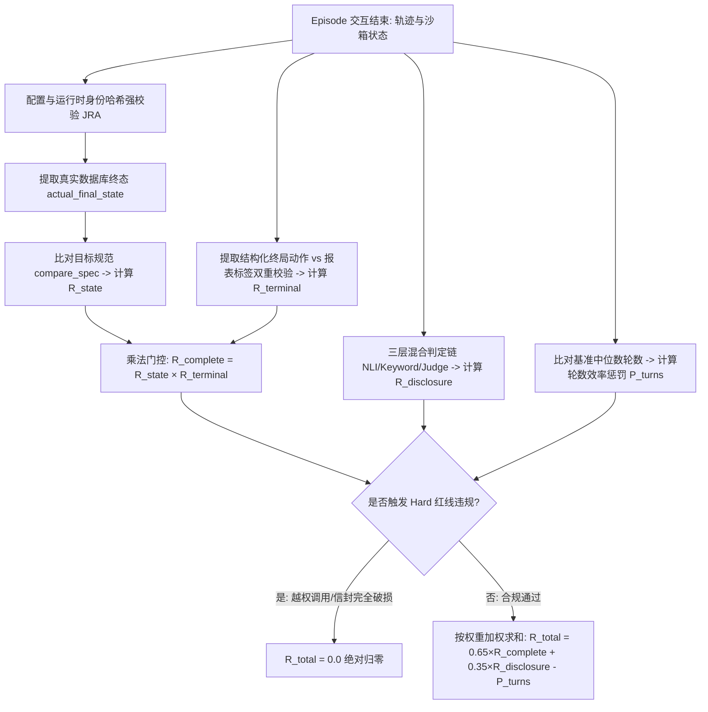

# agentic-gov 项目深问阶段 · 面试回答稿

> **定位**：与 `agentic-gov-deep-dive-questions.md` 问题集（41 题）完全对应，专供面试深问阶段（机制原理、架构权衡、技术难点复盘、RL/LLM 基础与源码实现）使用。
> **语言风格**：资深工程师真实技术面试口吻，去黑话、去内部流程代号，逻辑清晰、用词准确、实事求是。深入机制与代码细节，讲清“为什么这么选、放弃了什么、踩过什么坑、怎么定量定性排查”。
> **事实基线**：长程 500 步 GRPO 训练已完成，96 题基准集成功率从 54.3% 提升至 84.4%（净增 +30.1 个百分点）；转人工泛化测试集提升 +9.21 个百分点；1000 题保留测试集就绪。

---

## G1 Reward 与判定设计

### G1-1 你的 reward 从 v1 改到 v3，每一版在修什么问题？为什么上一版不够？

我们的 Reward 函数经历过三版迭代，每一次改动都是由实际评测中暴露出来的错误行为反例驱动的，目标是让强化学习的信号更纯净、区分度更高。

- **v1 的问题是“得分上限有语义瑕疵”**：在最初的 v1 中，扣分项（如超轮数惩罚、工具调用格式错误）占用了基础得分预算，导致一个所有操作完全正确的完美对话，最终得分最多只有 0.75 到 0.80 左右。“满分不等于 1.0”，这不仅让分数的绝对物理含义不清晰，而且压缩了不同质量轨迹之间的相对区分空间。
- **v2 修了归一化，但留下了“终局动作与状态打平（Tie）”的盲区**：v2 将正向质量项重新归一化，让完美的轨迹可以稳定拿到 1.0。用历史 728 条采样轨迹回溯验证，v2 下组内得分标准差平均提升了 30%，组内对比信号显著增强。但 v2 暴露了一个新问题：在不需要写数据库的任务中（例如纯咨询查询、或前置审查不通过该直接拒绝的任务），无论模型最终是“正确拒办”还是“错误强行办结”，由于数据库状态都没有被修改，两者的状态得分完全打平。模型选错了终局动作在得分上却不吃亏，导致强化学习无法学到准确的收尾判断。
- **v3 引入了“终局动作乘法门控”**：v3 将完成度拆解为“数据库状态对不对（$R_{state}$）”和“终局动作选没选对（$R_{terminal}$）”两个因子，采用乘法门控公式：$R_{complete} = R_{state} \times R_{terminal}$。只要终局动作选错，$R_{terminal}$ 直接置 0，状态分再高完成度也直接归零。这彻底解决了无写库任务中的打平问题，保证了终态与动作的双重正确。

代码实现上，v3 现役运行在 `reward/aggregate.py` 中，启动时有严格的配置哈希与组件绑定校验。

---

### G1-2 为什么终局正确性用乘法门控（R_state × R_terminal）而不是给 FWR 加一个对称的奖励项？R_escalate 为什么被移出训练总和？

这两个设计决策本质上都是为了**维护奖励函数的统一性与对称性**，避免给特定动作打“非对称补丁”。

1. **为什么选择乘法门控而非给特定动作（如带拒绝办结 FWR）加分**：
   - 业务逻辑上，“数据库状态正确”与“终局动作正确”是严格的**逻辑与（AND）**关系。只有两件事同时做对，政务办理才算闭环。
   - 如果用加法，当状态正确但动作选错时，模型依然能拿到大部分分数，v2 中的打平问题就会死灰复燃。
   - 如果只针对最容易吃亏的“带拒绝办结（FWR）”单独补一个奖励加分项，本质上是引入了非对称特例。以后每扩展一类新动作，都得重新设计一套补丁规则。乘法门控对所有合法动作（办结 Finish、带拒绝办结 FinishWithRefusal、转人工 Escalate）一视同仁。
   - $R_{terminal}$ 本身采用二值门控机制（非 0 即 1）：模型执行的终局动作与标准预期精确一致得 1，否则得 0。并且遵循严格的“失败闭锁（Fail-closed）”原则，若终局动作缺失或解析异常一律按 0 处理，绝不从最终数据库状态去猜测模型意图。

2. **为什么将 $R_{escalate}$ 移出训练总分**：
   - 早期我们曾给“转人工”动作保留 0.10 的额外奖励权重，初衷是鼓励模型在遇到疑难时不盲目办结。
   - 但在引入 $R_{terminal}$ 之后，转人工动作的对错已经由 $R_{terminal}$ 做了完整的 0/1 门控。如果再在总分里为转人工单发一笔奖金，等于在同一个判定信号上“重复计费”，人为扭曲了转人工与正常办结之间的收益平衡。
   - 因此在 v3 中，我们将 $R_{escalate}$ 移出了用于训练梯度的 Reward 总分，仅在评测报表中作为观测指标保留。

---

### G1-3 有人说"把 reward 线性归一化到 [0,1] 更自然"，为什么这对 GRPO 基本是空操作？它和你们实际做过的 v2 ceiling 修正有什么区别？

在 GRPO 强化学习中，直接对最终 Reward 做全局线性缩放（比如乘以系数 $a$ 加上常数 $b$）在数学上对策略更新是完全不起作用的**空操作**。

- **GRPO 优势计算的数学不变性**：
  GRPO 的核心是不依赖 Critic，而是直接利用同组 $K$ 条采样的相对得分计算优势：
  $$A_i = \frac{R_i - \bar{R}}{\sigma_R}$$
  如果将所有 $R_i$ 替换为 $a R_i + b$：
  - 分子：$(a R_i + b) - (a \bar{R} + b) = a (R_i - \bar{R})$，常数 $b$ 被相减完全消除；
  - 分母：$\sigma(a R + b) = a \sigma_R$，缩放因子 $a$ 被直接约分抵消；
  - 结果：每条轨迹的优势值 $A_i$ 保持严格不变。如果一组采样得分完全相同（$\sigma_R = 0$），线性缩放后依然是零方差组。除了让报表上的数字落在 0 到 1 之间，对训练梯度没有任何实质影响。

- **v2 Ceiling 修正的本质区别**：
  v2 的改动**不是**对总分做全局线性变换，而是**调整了内部各个子项之间的相对权重分配**（重新分配了状态完成度、关键信息告知与轮数效率的比例，消除了惩罚项对满分预算的挤占）。这种结构性调整改变了同组不同轨迹之间的相对分差，拉开了不同错误模式与正确模式之间的距离，从而真实地重塑了梯度的方向和幅度。
  实测回溯表明，v2 让同组采样的分数标准差平均放大了约 30%，提供了更清晰的优化信号。

---

### G1-4 为什么 reward 在 episode 结束统一结算？这种 terminal-only 设计在多轮信用分配上的优势和局限分别是什么？

我们坚持在多轮对话完全结束后进行统一的终局结算（Terminal-only），这是在**信号可信度**与**过程灵活性**之间权衡的结果。

**选择终局结算的优势**：
1. **终局信号客观可验证，防范 Reward Hacking**：在沙箱中，最终数据库状态可以通过代码精确比对，终局动作有结构化标签，这些客观事实模型无法通过话术投机取巧。
2. **避免扼杀策略探索空间**：我们曾论证并否决了三种过程奖励：
   - *按标准路径分步打分*：会严厉惩罚“绕了一点弯路但最终正确办结”的轨迹，强行锁死探索路径；
   - *错误恢复额外加分*：与最终完成度高度重叠，容易诱导模型先故意犯错再自我修正来刷分；
   - *思维链（CoT）文本打分*：会直接诱导模型学习“看起来思考得很周全的话术套路”，产生虚假推理。

**必须坦诚的局限性（信用分配难题）**：
- 终局结算意味着一条长达 6 到 8 轮的对话最终只产生一个标量回报，这个回报计算出的优势分会被均匀广播到轨迹中所有的 Assistant Token 上。
- 如果一条轨迹在第 2 轮问出了核心线索，但在第 7 轮因参数错误失败，算法无法精准定位第 2 轮的功劳与第 7 轮的责任。
- 本项目通过**将回报细分为完成度、告知率、轮数惩罚等独立维度**，并结合**同组 8 条采样的横向对比**，在一定程度上压低了方差并提升了可诊断性，但并未在根本上解决多轮信用分配（Credit Assignment）问题。这属于用粒度的粗糙换取信号的绝对真实。

---

### G1-5 disclosure（"说到位"）为什么纯 NLI 做不下去？hybrid 判定链怎么分层？NLI 的 premise 为什么按每条 assistant 消息取 max？

在政务办事场景中，“关键信息告知（Disclosure）”要求模型必须用自然语言向群众说清必要事实（如所需材料、审批时限、资金用途限制）。

1. **纯 NLI 为何在工程上失效**：
   - **阈值跨度极大**：不同告知事实的语义密度差异极大，实验表明各任务的最优 NLI 蕴含阈值跨越了三个数量级，不存在一个能通用的全局阈值。
   - **长文本截断丢失关键信息**：使用的轻量 NLI 模型（如 mDeBERTa）最大长度为 512 Token。若把多轮完整对话整体作为前提（Premise）送入，必然发生截断，而告知往往发生在对话尾声的办结轮次。实测将整段对话输入得分仅 0.0032，而逐轮切片输入得分达到 0.9971。

2. **Premise 按每条 Assistant 消息取 Max 的设计**：
   我们将每轮 Assistant 的单条回复独立作为 Premise，待验证的事实作为 Hypothesis 送入 NLI 计算蕴含概率，最终取整场对话各轮的最大值：$\max_{t} P(\text{entailment} \mid \text{msg}_t, \text{fact})$。只要模型在任意一轮清晰传达了该事实，即判定为告知成功，彻底消除了序列截断与位置偏差。

3. **三层混合（Hybrid）判定链与方向不对称设计**：
   - **第一层（本地 NLI）**：快速过滤 80% 以上语义明确的样本；
   - **第二层（确定性关键词规则）**：兜底处理金额、工单号等规则性极强的短实体；
   - **第三层（LLM 裁判 Adjudicator）**：仅用于前两层置信度不足的模糊边界场景。
   - **不对称审计逻辑**：
     - *正面应当告知项*：本地判命中后，若置信度存疑需送 LLM 裁判复核，防止模型使用“请您知悉”等空洞套话钻空子；
     - *负面严禁泄露项（如后台系统内部工号）*：本地判未提及直接放行，只有判为提及才送裁判终审，防止因模型在否定句中提及关键词（如“我不能向您透露后台编号”）产生误判。负面槽位一旦违规，直接一票否决告知分。

---

### G1-6 同样一个失败动作，hard-zero、负分、拒采重采三种处理在 reward 几何和责任归属上差别在哪？你们为什么最终是"hard 归零 + efficiency 继续"？

我们依据错误性质，将模型异常划分为三大类别，并对应不同的 Reward 处理逻辑：

1. **异常的三大分类**：
   - **Hard 违规（越权/严重格式损坏）**：调用了不存在或未经授权的工具、输出信封完全不可解析。这属于不可触碰的物理红线。
   - **Efficiency 错误（前置条件不满足/参数格式不对）**：如未查实名就直接调用申请接口、缺少必填参数。沙箱会拦截并返回具体错误信息，但**不终止对话**，允许模型在后续轮次中自我修正。
   - **业务正常拒绝（Business Refusal）**：如审查发现名下已有房产不符合提取条件。这是业务系统的正常逻辑分支，完全不计为错误，不予扣分。

2. **三种候选处理机制的权衡**：
   - **负分机制（被否决）**：给违规行为扣负分（如 -1.0）。负分幅度引入了一个额外且主观的设计自由度，改变了正负分量的几何比例，且容易让策略陷入局部极小（为避免负分而拒绝探索）。
   - **拒采重采机制（被否决）**：丢弃违规轨迹重新采样。这相当于由外部环境替模型掩盖了格式错误，策略永远学不会对输出格式负责。
   - **Hard 归零（选定）**：一旦触犯红线，整条轨迹总回报直接置 0 并终止。在语义上明确传达“该轨迹没有任何可接受价值”，将责任完全锚定在模型自身。

3. **为什么允许 Efficiency 错误继续尝试**：
   GRPO 依靠试错来学习复杂决策。如果模型第一次参数填错就直接扣死终止，它永远没有机会在多轮上下文中见到“被系统报错后如何读取错误码并修正参数”的数据分布。实测显示，格式失败率稳定在 2% 左右的极低水平，模型在保持高完成度的同时充分学会了动态纠错。

---

### G1-8 0.65/0.35/0.10 这些权重是怎么定的？做过敏感性分析吗？

在这个问题上必须实事求是：**这些权重主要是基于政务业务逻辑的常识性经验设定，并没有做过穷举式的超参数敏感性网格搜索。**

- **权重设定的业务依据**：
  核心比例（完成度 $R_{complete}$ 占约 0.65，告知率 $R_{disclosure}$ 占约 0.35）遵循一个基本逻辑：政务助手的核心职责首先是“把业务办对（动作与数据库终态正确）”，其次是“把政策交代明白（合规告知）”，因此完成度占据主导权重。早期为转人工设置的 0.10 额外加分是定性对冲采样偏差，而在 v3 中该项已被移出训练总分。
- **为什么没有做网格敏感性分析**：
  1. **算力优先级分配**：在 2 张 RTX 4090 的算力约束下，探索一套完整的超参扰动实验需要多轮长程训练，当时团队将宝贵的算力优先投入到了解决数据质量缺陷（清洗不可解任务）和验证终局泛化效果的主路径上。
  2. **实验归因的纯净度**：早期调整权重时，往往伴随着采样器策略或数据池的重构，存在变量耦合。在这种背景下单独做权重的敏感性拟合，结论的置信度并不高。

在工程实践中，明确认识到某些超参数的经验主义属性并清晰界定其边界，远比事后强行粉饰严谨性更符合实际工程认知。

---

## G2 环境、数据与 Simulator

### G2-1 contrast pair（只差一个边界因子、正确动作相反的 A/B 对）在 GRPO 里起什么作用？为什么 A、B 绝不能混进同一个组？

**Contrast Pair 的设计理念**：
我们构造了一批特殊的对照任务对（A/B 对）。A 和 B 在用户的开场白、人物画像设定、可透露事实清单上完全一模一样，但后台数据库中注入的关键事实存在微小差异（例如：A 的提取金额在政策限额之内，正确动作是“办结”；B 的提取金额微超上限，正确动作是“带拒绝办结”）。模型无法通过用户的开场话术走捷径，必须通过主动调用工具查询核实，才能做出正确裁决。

**为什么 A 和 B 绝对不能混入同一个 GRPO 采样组**：
GRPO 依赖同组 $K$ 条采样的平均分作为优势基准（Baseline），其数学前提是：**同组内所有轨迹面对的是完全相同的任务实例与初始环境**。

如果把 A（简单任务，模型平均得分 0.8）和 B（困难任务，模型平均得分 0.3）混在同一个组（例如 4 条 A + 4 条 B），组内平均分将被拉到约 0.525：
- 一条在 A 任务上执行错误、仅拿到 0.75 分的轨迹，由于 0.75 > 0.525，其优势分为正，会被算法错误强化；
- 一条在 B 任务上克服困难正确处理、拿到 0.30 分的轨迹，由于 0.30 < 0.525，其优势分为负，反而会被算法抑制。

这种混合基准会向模型传递完全错误的梯度信号，诱导模型无脑偏向高分动作。因此，Contrast Pair 在采样时必须**成对解耦到不同的采样组中**，保证组内基准的纯粹性与公平性。

---

### G2-2 simulator 为什么看不到工具的返回结果？给它看会怎么样？

我们的用户模拟器（Simulator）扮演办事的普通群众，其输入上下文被严格限制为**对话历史中的自然语言（User 与 Assistant 的对话文本）**，完全屏蔽模型调用的工具名称、输入参数以及后台接口返回的 JSON 数据。

**如果让 Simulator 看到工具返回，会导致三重严重后果**：
1. **破坏交互真实性与拟真度**：在现实中，办事群众坐在柜台外，不可能看到政务内网系统的返回数据。如果 Simulator 看到后台 JSON，它会利用这些“上帝视角”信息跳步回答或提前追问，破坏自然交互流。
2. **引发逆向强化欺骗，瓦解告知机制**：一旦 Simulator 能够感知工具结果，模型就会发现“只要我调用了查询接口，群众就已经‘知道’了结果”，从而退化出不再用自然语言向群众解释结果的不良行为。我们精心设计的告知奖励（Disclosure Reward）将彻底失效。
3. **隐私泄露检测失真**：系统用于监控信息越权泄露的指标将产生虚假读数，无法真实评估 Agent 是否违规吐露了后台敏感信息。

工程实现上，在每一轮调用 Simulator 之前，对话历史都会经过严格过滤，剔除所有 `tool_call` 和 `tool_response` 节点，并将连续的同角色发言合并为单一自然语言轮次。

---

### G2-3 simulator 的 reveal 偏急（被问即答而非拖一轮，残余泄漏 10-14%）为什么不阻断训练、也不把泄漏做成负 reward？什么情况会改判？

**现象与背景**：
在数据定义中，有大约 10% 到 14% 的任务设置了“延迟透露（After Delay）”规则（模拟群众在被第一次询问敏感信息时略带迟疑，被二次确认时才提供）。但实际微调出的 Simulator 表现偏“急”，常常在 Agent 第一次提问时就顺从回答。实测任务中的泄露率在购房类约为 10%，在非贷款类约为 3%。

**为什么不阻断训练、也不做负 Reward 惩罚**：
1. **Simulator 是外部环境的一部分**：强化学习训练的是 Agent，而不是 Simulator。惩罚 Agent 无法控制的外部环境行为，只会向策略梯度中引入纯粹的随机噪声。
2. **泄露属于被动响应，未破坏交互逻辑**：Simulator 只有在 Agent 主动提问时才会回答，从未发生过不问自说的“抢答”。Agent 依然完整保留了“识别缺参并主动提问”的行为模式。
3. **对组内相对优势影响近似平移**：同组 8 条采样面对的是相同的 Simulator 策略，提早透露对组内所有采样是均等发生的共同偏移，基本不改变组内的相对优劣排序。

**触发阻断或改判的四项硬性条件**：
我们在设计方案中明确了改判红线，只要出现以下任一情况即推翻当前结论：
- (1) Simulator 出现未被询问的主动抢答；
- (2) 提早透露的发生率超过 30%；
- (3) 核心终态 Reward 开始对透露时机产生强依赖；
- (4) 透露内容直接污染了 Reward 的判分依据。

---

### G2-4 数据全合成，凭什么敢用？一条任务从生成到进训练池要过哪些关？

面对政务真实交互数据难以大规模获取的现状，我们采用高质量全合成管线，并通过“单样本严苛检验 + 数据集多维隔离”的双重防御体系确保数据可信度。

**单条任务必须通关的六道自动门禁与人工抽检**：
- **L0 格式与模式校验**：检查字段完整性、类型与枚举值合法性；
- **L1 沙箱可执行性重放**：将任务预设的标准动作轨迹（Golden Chain）在真实沙箱中全流程执行，无法 100% 成功闭环的任务直接剔除；
- **L2 NLI 语义自洽校验**：验证任务描述文本与预期执行动作之间的语义蕴含关系；
- **L3 实体全链路对齐**：校验开场白、人物画像与后台数据库中的人名、身份证、账号等实体信息严格一致；
- **L4 敏感线索防早泄检查**：严格扫描开场白，确保核心决策因子未被提前泄漏；
- **L5 LLM 裁判复核**：针对疑难长尾样本进行一致性终审；
- **L6 分层人工抽样核查**：定期对合成数据进行人工抽检，评估机器过滤的置信度。

**数据集层面的防过拟合隔离**：
- **三维物理隔离**：按业务任务族（Family）、流程骨架（Skeleton）和词汇包（Lexical Pack）三个维度，在训练集、验证集与测试集之间进行彻底隔离，杜绝测试集出现训练集的近亲变体。
- **相似度去重门禁**：在同一业务格和难度档位内，文本相似度超过 0.90 的任务直接丢弃。
- **保留测试集的特异性设计**：在最终的 1000 题保留测试集中，严格保证每个任务族恰好只抽取 1 条任务，将族内相关性降至最低（设计效应 DEFF ≈ 1），确保泛化评测在统计学上的独立同分布有效性。

---

### G2-5 contrast pair 是怎么构造出来的？怎么保证 A/B 真的"只差一个关键事实"？

构造高质量 Contrast Pair 的核心在于**精确控制单一变量，确保决策反转完全由预设的边界因子引起**。

1. **提取具有翻转效应的边界因子**：
   我们定义了两大类共 15 种边界因子：
   - *数值型（7 种）*：如申请金额与账户提取限额的边界值比对（例如限额 50000，A 设为 48000，B 设为 50001），对应决策由“办结”翻转为“超额拒办”；
   - *离散类别型（8 种）*：如房产备案状态（已备案 vs 未备案）、缴存状态（正常 vs 封存）。

2. **字段级强一致性机器校验**：
   代码构建了严格的断言检查，要求 A 与 B 在以下字段上必须逐字节完全相等：
   - 用户画像的全部 9 个属性维度；
   - 用户开场白文本字符串（一字不差）；
   - 信息透露规则字典与模糊度配置字典；
   - 适用的业务政策版本与政策卡标识。
   允许变化的只有被指定的边界因子字段，以及该因子在底层数据库中引发的合法数据状态联动。

3. **开场白与透露规则的强约束**：
   为什么 A 和 B 开场白一样却能导向不同终局？因为差异存在于后台数据库或必须被追问的细节中。我们强制规定：**凡被边界因子修改的关键事实，在透露规则中只能配置为“被直接追问才说”或“从不说（需系统查询）”，严禁配置为“开场主动说”**。这确保了对照的绝对严密性，迫使模型必须通过调用接口核验来识别差异。

---

### G2-6 Policy Card、API Spec、sandbox precondition 和 reward 分别管什么？为什么不能把所有规则塞进 prompt、或全写死成 workflow？

在系统架构中，我们将约束与引导划分为四个清晰的层次：

| 层次 | 载体 | 核心职责 | 约束性质 |
|---|---|---|---|
| **业务决策知识** | Policy Card（政策卡） | 规定业务准入标准、不同条件下的正确终局动作（办结/拒办/转人工） | 显式注入 Prompt，供模型理解与学习 |
| **接口调用契约** | API Spec / required_slots | 规定调用具体接口时必须携带的参数格式，以及对话需收集的必填要素 | 静态 Schema 约束 |
| **底层安全防线** | Sandbox Precondition | 强行校验业务操作的前置物理依赖（如必须实名核验通过才能写库、必须属于同一主体） | 底层引擎强拦截（Fail-closed），不可绕过 |
| **行为质量评价** | Reward 函数 | 在所有合规的交互轨迹中，对效率、话术完整性与决策正确性进行连续评价 | 强化学习优化目标 |

**为什么不能走极端（全塞 Prompt 或全写死 Workflow）**：
- **如果全塞进 Prompt**：上下文迅速膨胀，大模型的注意力会被稀释，长程多轮交互中极易出现“规则遗忘”；且 Prompt 没有物理强制力，无法杜绝越权调用的安全隐患。
- **如果全写死成静态 Workflow 代码**：模型退化为纯粹的文本填空机，丧失了在模糊场景下灵活追问、在接口报错后动态恢复、以及在复杂边界下自主决策的泛化智能。

**架构原则**：“底线用沙箱硬拦截，知识通过政策卡显式表达，柔性决策与交互质量通过强化学习打磨”。

---

## G3 训练、采样与稳定性

### G3-1 你说用 GRPO，但实际优化的 loss 不是教科书 GRPO——准确口径是什么？CISPO 和 PPO clip 的梯度行为差在哪？

**准确的技术口径**：
我们在项目中采用的训练架构是：**GRPO 风格的组内无 Critic 相对优势估计**（同一任务采样 $K=8$ 条轨迹，计算组内标准化优势），搭配 **ART 框架默认的 CISPO（Clipped Importance Sampling Policy Optimization）Token 级损失函数**。

**CISPO 与标准 PPO 裁剪在梯度行为上的核心差异**：
- **PPO 的裁剪机制**：
  $$L_{PPO} = \min\left( r_t(\theta) A_t, \text{clip}(r_t(\theta), 1-\epsilon, 1+\epsilon) A_t \right)$$
  在 PPO 中，新旧概率比率 $r_t(\theta) = \frac{\pi_\theta(a_t|s_t)}{\pi_{old}(a_t|s_t)}$ 是直接带梯度的。当比率超出信任域（例如 $A_t > 0$ 且 $r_t > 1+\epsilon$ 时），目标函数进入常数裁剪分支，**该 Token 的策略梯度直接归零（梯度饱和截断）**。
- **CISPO 的解耦加权机制**：
  $$w_t = \text{clamp}\left( \text{detach}(r_t(\theta)), 1-\epsilon, 1+\epsilon_{high} \right)$$
  $$L_{CISPO} = - w_t \cdot A_t \cdot \log \pi_\theta(a_t|s_t)$$
  在 CISPO 中，比率 $r_t(\theta)$ 先通过 `.detach()` 切断梯度，仅作为一个标量权重。梯度**纯粹沿着当前策略的 $\log \pi_\theta$ 路径流动**。当策略发生较大幅度更新时，超出区间的 Token 只是其权重被截断在上界，但**策略梯度依然通畅流动**（行为退化为带折扣权重的标准 REINFORCE）。

**为什么对多轮 Agent 场景是净收益**：
在长序列多轮对话中，决定成败的关键 Token（如调用的工具名、填写的核心参数、终局动作标记）往往非常稀疏。这些核心 Token 的概率在学习过程中变化最为剧烈，极易触发 PPO 的裁剪。PPO 会将这些最具信息量的关键决策 Token “禁言”，而 CISPO 确保了关键决策梯度的连续传递。
在实际严格 On-Policy 训练中，新旧策略偏移极小，裁剪极少触发，CISPO 平时等价于标准策略梯度，在异常漂移时提供稳健托底。

---

### G3-2 组内全对或全错的 rollout 组怎么办？为什么"越难越该多采"被明确禁止？采样预算按什么定？

**零方差组的动态过滤机制**：
当同组 $K=8$ 条采样全部成功（得分均为 1.0）或全部失败（得分均为 0.0）时，该组得分的标准差为 0，所有轨迹计算出的优势值 $A_i$ 均为 0。这类组无法提供任何有效的梯度更新方向。我们在训练引擎中配置了**动态过滤（Dynamic Filter）**，在 Reward 结算后直接将零方差组丢弃，不执行反向传播，从而避免了无效的优化器计算与梯度统计污染。

**为什么明令禁止“越难的任务越该多采”**：
直觉上可能认为难任务学不会就该加大采样量，但在强化学习数学上这是完全错误的：
- 二值任务优势信号的方差正比于 $p(1-p)$（$p$ 为任务单次成功率）。
- 方差在 $p=0.5$ 处达到最大峰值，这意味着**成功率在五五开的任务能提供最强烈的正反对比梯度信号**。
- 极难任务（$p \approx 0$）属于“全错死区”，无论采样多少次，极大概率依然全错，产出的全是无意义的零方差组。按难度倒数加权采样，本质上是将宝贵的算力预算全部挥霍在无法产出梯度的死区里。

**科学的采样预算分配原则（基于可学习性 Learnability）**：
我们通过冻结的 $K=8$ 探针定期探测各任务池的成功率分布，划分三档：
1. **核心可学习带（成功率 2/8 到 6/8）**：重点投入 70% 以上采样预算，稳定产出高对比度梯度；
2. **待攻坚死区（成功率 0/8 到 1/8）**：不盲目加采，归入复测池，待前置能力就绪后再做阶梯引入；
3. **饱和带（成功率 7/8 到 8/8）**：基本不指望其产出梯度（全对被过滤是预期内的正常现象），但保留少量作为**金丝雀（Canary）任务**——监控其成功率是否从“稳定全对”开始滑坡，作为模型发生灾难性遗忘的报警触发器。

---

### G3-3 你们最终的长程 GRPO 训练 schedule 是怎么设计的？怎么防止终局动作偏科？

**最新训练状态**：
长程 500 步 GRPO 训练已全部执行完毕并产出最终检查点。在涵盖 12 个业务单元的 96 题基准集上，成功率从 SFT 起点的 54.3% 单调稳步提升至 **84.4%（净提升 +30.1 个百分点）**。

**防止动作偏科的 12 单元分层采样设计**：
政务场景涵盖 4 类业务 × 3 种终局动作共 12 个业务单元。由于天然存在“办结类任务多、拒办与转人工类任务少”的样本不平衡，若随机均匀采样，模型极易产生只擅长办结、在稀有动作上退化的偏科现象。

我们设计的每步 8 组（共 64 条 Rollout）配比结构如下：
- **4 个稀有动作核心槽**：定点覆盖 4 类业务下的“拒绝”与“转人工”格子，优先从 2/8-6/8 可学习带中挑选任务；
- **2 个办结锚点槽**：轮流抽取常规办结任务，用于监控并保护基础办事能力不滑坡；
- **2 个广度覆盖槽**：动态照顾历史曝光不足的冷门格子。

**滑动窗口浓度约束与确定性补位**：
- **浓度硬约束**：在任意连续 50 步的滑动窗口内，三种终局动作在训练中的占比被严格限制（办结锁定在 25-35%，拒绝与转人工各锁定在 30-40%）；单个任务在窗口内最多出现 4 次，防止稀有任务被过度重复刷爆。
- **确定性补位机制**：当某一步内因零方差过滤导致有效组不足 6 组时，从预先排队的候选队列中按“同格子、同动作”原则确定性补充，单步最多补 2 组，杜绝随机补位带来的分布漂移。

---

### G3-4 任务的训练顺序和难度递进怎么安排？有没有任务被判定"梯度够不到"？

**阶梯式课程学习（Curriculum Learning）**：
对于复合型高难度任务，我们避免让模型直接在 0 成功率的死区硬碰硬，而是拆解出 L1（基础单一动作）、L2（常规参数校验）、L3（复杂多轮核验）三级难度阶梯。利用 $K=8$ 探针动态评估，只有当某一梯度的成功率进入 2/8 到 6/8 的可学习带时才注入梯度训练，在该梯度训练至饱和（$\ge 7/8$）后将其移入监控池，推动模型向更高层级演进。

**关于“梯度够不到”的任务排查实例**：
在研发过程中，确实有两个业务格子曾被判定为异常，其排查过程体现了数据工程与算法的边界：
1. **购房提取·带拒绝办结（阶梯不成立）**：
   排查发现该任务的 L1 与 L2 梯级数据采用了同源配方生成，人物画像与关键边界完全相同，两级之间仅有微小措辞差异，缺少实质性的难度干预。这属于数据设计层面的阶梯缺陷，无法通过算法优化解决，最终通过重构 L1/L2 数据配方修复。
2. **购房提取·转人工（冷启动零供给）**：
   该任务的早期 L1 样本落在一个 SFT 阶段完全没有提供基础知识的盲区中，模型的基础探索概率为 0。我们在数据侧将 L1 触发逻辑替换为具有 SFT 先验基础的规则集，经过 80 轮探针重测，该格子成功从 0 条可学习恢复到 9 条稳定可学习。

---

### G3-5 KL penalty 在你们项目里防的具体是什么？为什么不在 GRPO 池里多混 SFT 数据来防遗忘？

**KL 散度惩罚在项目中的具体防御目标**：
在我们的场景中，KL 散度惩罚（将当前策略锚定在 SFT 参考模型上，系数设为 0.08）主要为了防范一种特定的模型病态演化——内部称之为**“政务复读机”现象**。
在“应当告知项尽可能说全（$R_{disclosure}$）”与“交互轮数越短惩罚越小（$P_{turns}$）”的双重奖励压力下，模型在没有约束时会迅速发现一条投机路径：在开场第一轮就吐出一篇数千字的超长免责与告知声明，把所有政策一股脑倾倒给用户。这种轨迹虽然各项指标得分极高，但完全丧失了人类对话的交互性。KL 惩罚强制约束了输出分布的偏离幅度，确保模型必须以自然、友好的语气按需沟通。

**为什么不能通过在 GRPO 采样池里多混 SFT 数据来防止遗忘**：
这两者在强化学习机制上存在本质差异：
- SFT 数据对于已经微调过的当前模型而言，绝大多数已经是高成功率的简单任务。
- 把大量已掌握的 SFT 任务扔进 GRPO 采样池，模型采出来的 8 条轨迹大概率全对，直接触发零方差过滤并被丢弃，**根本不产生任何策略梯度**。
- “在采样池中多采”绝不等于“在参数上进行了复习”。要真正依靠数据保留能力，必须在损失函数中引入显式的辅助监督微调损失（Auxiliary SFT Loss）或经验回放。而在本项目中，采用一行代码即可实现的 KL Anchor 机制是最轻量、最有效的防漂移手段。

---

### G3-6 长程训练的熔断/停训契约是什么？哪些信号有权直接停训、哪些只能告警？

长程 500 步训练耗时长、算力成本高。为了避免因偶发噪声误杀训练，我们制定了**高度不对称的分级停训契约**：

1. **自动直接停训（仅限确定性数据/梯度污染）**：
   - 训练损失或梯度范数出现 `NaN` 或 `Inf`（数值物理发散）；
   - 运行时组件身份校验失败（如判定器实例被错误篡改或掉包）；
   - 数据集切分污染（测试集任务被意外混入训练采样池）；
   - 裁判大模型出现静默降级或网络超时且错误进入了梯度更新流。
   *原则*：一旦发生上述情况，后续产出的所有模型参数在科学上均不可信，必须毫秒级自动停训止损。

2. **硬暂停与人工介入确认（Hard Pause）**：
   - 新旧策略重要性概率比率峰值异常超标（如最大比率超过 4.0，历史实测正常运行在 1.7 左右）。此时训练自动挂起，等待人工核查是否由单条畸形数据引起。

3. **仅触发告警与二次检验探针（不直接杀训练）**：
   - 训练批次中的格式解析失败率或硬违规率突破 5% 阈值。此时系统**不直接终止训练**，而是自动触发由 60 个独立任务组成的确认探针，通过单侧 99% 置信度的精确二项检验进行复核，只有当 60 个样本中出现 $\ge 8$ 例失败时才正式升级为故障。
   - 验证集开发指标（如阶段性成功率波动）仅用于评估当前检查点是否有资格晋级为上线候选，无权中断训练进程。

*设计哲学*：“错杀长程训练的成本远高于滞后几十步发现温和问题；只有在数据与数学正确性被破坏时才自动停机”。

---

## G4 难题复盘

### G4-1 rollout 吞吐的瓶颈是怎么一层层定位的？"busy-time 98% 在 agent"和"GPU 63% 空闲"矛盾吗？

Rollout 采样吞吐曾是制约项目进度的最大工程阻碍（早期单轮 64 条采样需耗时 20 分钟以上）。我们通过由表及里的三层排查定位了根因：

1. **第一层：排查 GPU 硬件拓扑抢占**：
   排查训练器与 Simulator 是否因争抢 GPU 显存与算力导致卡顿。分析发现，训练步（Backward）与采样步（Rollout）在时序上是严格分相位的互斥执行，分时复用同一张显卡完全不会发生物理算力争抢，排除了硬件绝对算力不足的假说。
2. **第二层：排查客户端并发配置瓶颈**：
   排查请求链路发现，Agent 客户端环境变量 `AGENT_MAX_CONCURRENT_REQUESTS` 被默认写死了 4。导致原本应当并发进行的 64 条轨迹被强制切成 16 批串行提交，这是人为造成的严重排队拥堵。调大该并发上限后，吞吐获得第一波显著提升。
3. **第三层：锁定核心瓶颈——多轮串行依赖与长尾木桶效应**：
   真正的物理瓶颈来自于任务本身的交互结构：
   - *严格的多轮 Ping-Pong 依赖*：每条轨迹包含 6-8 轮对话，第 3 轮必须等待第 2 轮生成完毕才能推进，轮次之间无法并行；
   - *长尾补全延迟（Tail Latency）*：同批 64 条采样中，前 9 条只需 38 秒即可完成，但最长的一条因反复追问和长文本生成耗时达 14 分钟。整批的 Wall-clock 耗时完全被最慢的单条轨迹卡死。

**“Busy-time 98% 在 Agent” 与 “GPU 63% 空闲” 的统一解读**：
- “98% Busy-time” 是从**轨迹视角的累计时间**统计，表明所有任务耗时绝大部分都花在等待 Agent 的文本生成上；
- “GPU 63% 空闲” 是从**硬件视角的利用率**统计，表明在整段采样周期内，由于多轮串行等待和调度间隔，GPU 的计算单元并没有被持续打满 Batch。
- 两个指标高度自洽：说明**系统的性能瓶颈不是算力上限不足，而是串行交互拓扑与生成长尾导致的计算空转**。单纯增加 GPU 数量无法直接解决该问题。

---

### G4-2 你们自己实现的 batched turn-boundary runner 实测慢了 2.1 倍，为什么？vLLM 的 continuous batching 和客户端攒批冲突在哪？

这是一次典型的“假设驱动但未加测量导致的负优化”教训。

- **当时的直觉假设**：
  我们曾设想在客户端实现一个按轮次同步攒批的调度器（Batched Turn-boundary Runner）：强制让所有 Agent 同时生成第 1 轮回复，全部返回后，再让所有 Simulator 同时生成第 2 轮回复。直觉认为这样能向服务端提供整齐的大 Batch，提升吞吐。
- **实测变慢 2.1 倍的根因分析**（单轮耗时从 538 秒恶化到 1127 秒）：
  1. **与 vLLM 的 Continuous Batching 机制严重冲突**：
     vLLM 等现代推理引擎的核心优势在于 **Token 级的连续流式批处理（Continuous Batching）**。当某个请求生成完毕后，引擎会立即释放显存并换入新的请求，无需等待同批其他请求。客户端强行“攒批同步”，反而剥夺了服务端自由动态调度的空间。
  2. **同步屏障放大了多轮长尾延迟**：
     在客户端设置“轮次屏障”后，每一轮对话都必须等待全场最慢的那一条生成完毕才能迈入下一轮。原本在异步流中只在最后一轮体现的长尾效应，在 8 轮交互中被**放大了整整 8 次**。
  3. **破坏了流水线的自然错峰重叠**：
     在自然异步模式下，部分任务在跑 Agent，部分任务在跑 Simulator，两张显卡各司其职实现流水线重叠；同步后变成了“大家一起等 Agent 生成，然后再一起等 Simulator 生成”，硬件闲置率大幅增加。

该模块已被彻底回滚并永久废弃。核心工程启示：在成熟的底层 Serving 框架之上，应用层粗暴的攒批往往是负优化。

---

### G4-3 LoRA 为什么训练省显存、serving 却可能更慢？你们那次 6 倍回归（1511→250 tok/s）怎么定位的？

**LoRA 训推显存与计算机制**：
LoRA 在训练时冻结主干权重，只对低秩旁路矩阵（$A \times B$）计算梯度，优化器状态显存与可训参数量成正比，因此能大幅节省训练显存。但在 Serving 推理阶段，如果直接挂载非零 LoRA 适配器，模型在执行每一层的前向计算时，都需要额外计算一次低秩分支的矩阵乘法并叠加回主干特征，增加了计算开销与内核（Kernel）启动开销。

**6 倍吞吐暴跌（1511 降至 250 tok/s）的排查定位过程**：
1. **排查 Prefix Cache 命中率**：首先怀疑多轮对话中重复的 System Prompt 缓存失效。监控实测 Prefix Cache 命中率稳定在 94%，排除了缓存失效假说。
2. **测试配置级廉价修复（Cheap-fix Triage）**：尝试调整 CUDA Graph 捕获、调整 Chunked Prefill 分块大小等参数，实测仅带来 3% 到 11% 的微弱改善，排除了常规配置问题。
3. **定位至高秩 LoRA Serving 内核瓶颈**：实验使用的 LoRA Rank 为 128，在多并发推理时，显存带宽与专门的 LoRA 算子调度开销急剧放大，确认吞吐骤降来源于 Serving 端的非零 LoRA 运行时开销。

**工程决策落地**：
我们确立了**“训练与推理形态分离”**的架构方案：在训练端依然使用 LoRA 以保障显存可控，但在进入 Serving 推理阶段前，自动化脚本将 LoRA 权重直接 Merge（合并）到基座模型的主干参数中，生成全量 Dense 权重提供服务。以可承受的磁盘与显存加载开销，成功将吞吐拉回 1500+ tok/s。

---

### G4-4 async pipeline（k=1）为什么失败？"off-policy 一步"到底差在哪？

为了进一步压榨硬件利用率，我们曾尝试过允许一步策略滞后（$k=1$）的异步流水线方案（即训练端在更新参数的同时，采样端使用上一步的模型版本继续并行采样）。

**实测结果与失败的两层根因**：
实验表明，异步方案不仅耗时比同步模式慢了近 2 倍，而且导致高达 44% 的 Rollout 轨迹被直接丢弃。

1. **第一层：业务前提不成立（没有气泡可填）**：
   异步重叠能够带来收益的前提是“训练耗时与采样耗时相当，存在相互等待的计算气泡”。而在我们的项目中，瓶颈高度集中在多轮 Rollout 采样上，一次反向传播更新仅需几十秒。没有明显的训练空闲等待时间可供重叠，异步失去了基础收益空间。
2. **第二层：权重版本生命周期的底层冲突（关键断裂点）**：
   在采用 Merge 后的 Dense 模型提供 Serving 服务时，推理实例在同一时刻只挂载一份全局唯一的在线模型。
   当一条多轮轨迹采样到第 4 轮时，后台训练步刚好完成并热更新了模型，旧模型名称被注销。正在进行中的这条轨迹在向服务端发起第 5 轮请求时，直接触发 `404 Model Not Found` 异常，导致整条轨迹被物理中断丢弃。
   $k=1$ 的算法假设只定义了“采完的数据能否用于下一步训练”，却无法解决“采到一半模型在底层被物理销毁”的工程生命周期断裂。

---

### G4-5 训练中后期 val strict 从 0.844 掉到 0.804、grad_norm 尖峰 34.98——怎么区分"没东西可学"和"优化不稳定"？为什么局部修复全生效后 run 仍被 reject？

在长程训练中后期，我们曾监测到验证集严格成功率出现回落，同时伴随梯度范数（Grad Norm）剧烈飙升至 34.98 的异常现象。

**如何准确区分“任务饱和无信号”与“优化过程不稳定”**：
- 如果仅仅是“任务饱和没东西可学”，模型的表现应当是收敛平稳，组内方差降为 0，格式规范与基础输出不会出现退化；
- 我们在监控中观察到了两个关键异动：
  1. *格式错误率反常抬头*：原本早已降为 0 的格式错误重新出现（如漏闭合 XML 标签、自我幻觉出 User 发言），排除了长度截断的原因；
  2. *策略熵（Entropy）与梯度范数在时间线上同步出现异常尖峰*。
- 结论明确：系统遭遇了严重的**训练动力学不稳定**，策略分布被异常梯度冲出了健康区域。

**定位与修复（极小分母放大效应）**：
深入剖析涉事批次发现，某些特定短轨迹批次中，真正参与损失计算的有效 Assistant Token 数量极少（仅 100 到 200 个）。损失函数在计算 Token 平均时，以极小的 Token 数作为分母，将微小的损失波动放大了数十倍形成梯度尖峰。
修复措施：为 Token 平均的分母设置了 2560 的平滑保底阈值（Floor），并设置了自适应梯度守门员（取绝对阈值 2.0 与滚动中位数 7 倍中的较大者）。

**为什么局部修复全生效后该 Run 依然被 Reject**：
修复上线后，梯度尖峰在后续 800 多个批次中完全归零，局部指标完全绿灯。但最终验收仍然果断拒绝了该次运行——因为全局验证集最终提升仍未达成预定科学目标。
**工程启示**：局部代码 Bug 的修复不等于算法全局效果的达成，实验验收必须以预先声明的全局客观指标为唯一判据。

---

### G4-6 NoHitChecker 事故后你们上了 JRA。JRA 能证明什么、不能证明什么？为什么还需要独立的语义审计？

**NoHitChecker 事故复盘**：
在早期一次探针评估中，系统因代码导入分支错误，实际接入了一个恒定返回“未说到”的占位判定器（NoHitChecker）。讽刺的是，部分租房任务因为具备确定性关键词兜底，表面上依然取得了不错的分数，将底层判定器掉包的问题掩盖了过去。
事故暴露了配置审计的严重漏洞：当时仅对 YAML 配置文件计算 SHA256 哈希，**配置文件的哈希只能证明配置文本未变，根本无法证明 Python 运行时内存中实际实例化的对象类是否正确**。

**JRA（运行时组件身份审计）的证明能力与边界**：
为了从机制上杜绝此类事故，我们建立了 JRA（Job Runtime Audit）门禁：在训练启动时，利用 Python 反射对内存中实际加载的 Checker 类路径、模型快照版本、阈值包、Prompt 模板和网络端点进行全字段扫描核验。
- **JRA 能证明**：当前物理进程中执行判定的代码与模型实例，与实验声明的架构 100% 一致。
- **JRA 不能证明**：判定器给出的语义裁判结果在逻辑上是客观正确的，也无法防范策略模型通过迎合裁判偏好的词汇进行作弊（Reward Gaming）。

**为什么必须引入独立的双盲语义审计**：
为了防御语义层面的误判与作弊，必须在评测阶段引入**与训练链路完全解耦的独立双盲审计**：抽取一定比例的真实交互轨迹，由未参与训练判定的独立评判者在隐藏任务标签的状态下重新裁决，比对两端差异，确保评测结果的真实有效。

---

### G4-7 什么样的任务才有资格进 RL 的梯度面/评测面？你们的任务有效性契约是什么？

在项目早期，我们曾遭遇过长达数周的训练停滞，最终系统性排查并清退了 247 条由于数据生成缺陷导致的“物理不可解任务”。为此，我们沉淀了一套严格的**任务有效性契约（五问原则）**，任何任务必须全部通过才能进入训练池或评测池：

1. **可观测性**：任务判定的正确终局标签，在环境中是否存在客观、可被感知的物理证据？
   - *反例（冒充者幽灵题）*：任务定义了“用户冒用他人身份，应予拒绝”，但对抗标记只写在后台元数据备注里，从未注入给用户的开场白或接口中，对话中根本不存在任何异常线索。
2. **物理可达性**：该证据在允许使用的工具接口或多轮对话中，Agent 是否能够真正读取到？
   - *反例（冻结账户转人工题）*：政策要求“账户冻结时转人工”，但分配给模型的查询接口根本不包含冻结状态字段，Simulator 也不会主动说明，导致即使完全正确的 Agent 也必然判错。
3. **政策一致性**：业务政策卡中是否有明确条款支持该场景下的终局决策？
4. **状态与动作自洽性**：标准答案轨迹（Golden Chain）、沙箱最终数据库状态与终局动作标签三者之间是否逻辑闭环？
5. **奖励区分度**：Reward 函数在该任务上，能否在数值几何上清晰拉开“做对”与“做错”的差距？

**工程治理闭环**：
我们将上述规则全部编译为底层的强校验断言（Fail-closed），一旦校验失败物理阻断入池。确保模型在强化学习中所面对的每一个任务都是“在逻辑和物理上均可解的”，彻底消除了伪失败对梯度的干扰。

---

## G5 由点扩面：RL/LLM 基础（结合项目）

### G5-1 GRPO 用组内均值当 baseline，相比 PPO 的 critic 放弃了什么、换来了什么？K=8 怎么定的？

**GRPO 与 PPO Baseline 机制的根本差异**：
PPO 依赖一个与策略网络同等规模的 Critic 网络，用于估计状态价值函数 $V(s)$，通过实际回报与 $V(s)$ 的残差计算优势；而 GRPO 完全抛弃了 Critic 网络，通过对同一个输入采样 $K$ 条轨迹，直接以同组 $K$ 条轨迹的平均回报作为 Baseline：$A_i = \frac{R_i - \bar{R}}{\sigma_R}$。

**换来了什么（收益）**：
1. **显著降低显存开销**：在 2 张 RTX 4090（单卡 24GB）的有限算力下，彻底省去了 Critic 模型的显存与优化器占用，使得长序列训练成为可能。
2. **消除了 Critic 估计误差引入的训练震荡**：Critic 自身也是在不断更新中的神经网络，其拟合不足或价值漂移往往是 PPO 训练不稳定的主要来源。
3. **规避了长程 Agent 中间状态价值难以定义的数学困境**：多轮对话中途各轮次的“真实价值”极难客观标注，终局横向比对更加直观稳健。

**放弃了什么（代价）**：
- 放弃了 Critic 跨任务学习全局状态价值的能力。GRPO 的 Baseline 仅在同任务组内成立，无法进行跨任务的绝对价值比较。
- 带来了**零方差失效问题**：当同组 $K$ 条采样全对或全错时，组内标准差为 0，优势直接归零失去梯度。

**K=8 的选型依据**：
$K$ 的大小是估计方差与计算成本之间的权衡。采样数 $K$ 越大，组内均值越稳定，但算力消耗呈线性增长（测算表明 $K$ 从 8 升至 16 将带来超过 50% 的额外开销）。在二值及连续混合 Reward 下，$K=8$ 是能够稳定捕获 2/8 到 6/8 可学习梯度的最小经济规模。

---

### G5-2 DAPO、GSPO、CISPO 分别改了 GRPO/PPO 训练中的哪个环节？你们为什么停在 CISPO 不再换算法？

我们可以沿着强化学习训练的三个正交维度来清晰梳理这三种前沿算法的定位：

```
[采样与数据流层]  ---> DAPO: 动态采样补位，解决零方差组丢弃问题
[重要性权重粒度层] ---> GSPO: 序列级比率归一化，降低长序列累积方差
[损失与梯度流向层] ---> CISPO: 比率 Detach 后裁剪当权重，保留被剪 Token 梯度
```

- **DAPO（Dynamic Adaptive Policy Optimization）**：动在**数据采样层**。针对零方差组被丢弃导致有效 Batch 缩水的问题，引入动态补采机制，确保每个训练步都有足额的有效梯度组。
- **GSPO（Group Sequence Policy Optimization）**：动在**重要性比率粒度层**。传统 PPO 在长序列中逐 Token 计算概率比率，比率连乘或累加会导致方差随序列长度剧烈爆炸；GSPO 将重要性比率提升至整条序列级别，有效压缩了长文本的优化方差。
- **CISPO（Clipped Importance Sampling Policy Optimization）**：动在**损失函数与梯度回传层**。将新旧概率比率 Detach 后作为加权系数，避免 PPO 硬裁剪导致的梯流阻断，让被裁剪的极端 Token 依然保留基础策略梯度。

**为什么本项目选择在 CISPO 处收敛并停止算法更换**：
1. **严格 On-Policy 场景下收益边际递减**：我们的主线是严格同策略训练，新旧模型分布极度贴近，CISPO 的表现已经非常稳健。
2. **解决主要矛盾的工程认知**：影响本项目效果的核心瓶颈始终在**数据物理可解性（清理坏题）**与**评测判定的客观性（防范掉包与作弊）**。在数据和度量体系尚未纯净前，频繁切换算法只会打乱归因，属于在非关键路径上空转。

---

### G5-3 SFT 的交叉熵和 RL 里的 KL anchor 在优化目标上有什么区别？为什么防跑偏用 KL 而不用 CE 当惩罚项？

回答这个问题的关键在于**必须首先明确交叉熵（Cross-Entropy）的计算方向**。

1. **SFT 中的交叉熵（数据分布驱动）**：
   $$\text{CE}(p_{data}, \pi_\theta) = H(p_{data}) + \text{KL}(p_{data} \parallel \pi_\theta)$$
   由于真实数据分布 $p_{data}$ 恒定，$H(p_{data})$ 为常数。最小化该交叉熵等价于最小化 $\text{KL}(p_{data} \parallel \pi_\theta)$（前向 KL，Mode-covering）。其数学特性是“覆盖众数”：模型必须为数据中出现过的所有可能表达赋予概率，因此 SFT 后的模型具备丰富自然的语言习惯。

2. **强化学习防漂移惩罚项中的交叉熵 vs 纯 KL**：
   在强化学习中，期望是在当前策略 $\pi_\theta$ 生成的分布下计算的。如果我们错误地使用策略对参考模型的交叉熵作为惩罚项：
   $$\text{CE}(\pi_\theta, \pi_{ref}) = H(\pi_\theta) + \text{KL}(\pi_\theta \parallel \pi_{ref})$$
   这个式子中包含了一项**策略自身的熵 $H(\pi_\theta)$**。
   如果将它作为惩罚项进行最小化，算法不仅在惩罚偏离参考模型，**还会顺带强行压缩策略自身的输出熵**，迫使模型变得极端确定性与狭隘，极易加速诱发单调复读（模式坍塌）。

3. **结论**：
   防跑偏惩罚项**必须使用纯 KL 散度 $\text{KL}(\pi_\theta \parallel \pi_{ref})$**。它只度量当前策略与参考模型之间的分布漂移，不包含压制策略熵的副作用，能够在约束模型不偏离人话底线的同时，保留足够的探索多样性。

---

### G5-4 判断一个任务桶"RL 学不学得动"为什么看 pass@k 不看 pass@1？pass@k 怎么算？

**为什么看 pass@k 而非 pass@1**：
pass@1 衡量的是单次采样的独立成功概率，而 pass@k 衡量的是在 $k$ 次独立采样中“至少有 1 次成功”的概率。
在 GRPO 强化学习中，策略更新依靠的是同组内的**对比信号**。一个任务即使单次成功率很低（例如 pass@1 仅为 0.15），但在采样 $K=8$ 条轨迹时，其 pass@8 达到了 $1 - (1 - 0.15)^8 \approx 0.73$。这意味着在同组 8 条采样中，有超过七成的概率能捕获到至少 1 条成功轨迹。这一两条成功的轨迹就能与其余失败轨迹形成清晰的优势差，为策略提供宝贵的正向引导梯度。因此，pass@k 才是决定任务是否具备可学习性的核心指标。

**pass@k 的两种计算方法与边界**：
1. **独立同分布理论近似（IID 假设）**：
   $$\text{pass}@k \approx 1 - (1 - p)^k$$
   （$p$ 为已测单次成功率。计算简便，但在采样间存在相关性时会略显乐观）。
2. **基于有限实测样本的无偏估计（组合计数）**：
   若实测对某任务采样了 $n$ 条，其中 $c$ 条成功，估计抽取 $k$ 条至少命中 1 条的概率：
   $$\text{pass}@k = 1 - \frac{\binom{n-c}{k}}{\binom{n}{k}}$$
   （该公式通过超几何分布排除了重复采样的偏置，是评测报告中的标准无偏估计口径）。

**真死区判定**：
若一个任务在 $K=8$ 探针下 pass@8 依然为 0，说明策略在当前能力下完全无法自发探索出任何正确解，强行训练只会产生零方差丢弃，必须通过 SFT 补充先验数据进行冷启动。

---

### G5-5 on-policy 和 off-policy 的界线在哪？staleness 怎么度量、为什么需要 importance sampling 修正？

**On-Policy 与 Off-Policy 的核心界线**：
判断的唯一标准在于：**产生当前环境交互数据（Rollout）的行为策略（Behavior Policy $\pi_{old}$），与当前正在接收梯度更新的目标策略（Target Policy $\pi_\theta$），在数学和参数上是否严格为同一个版本。**
如果是同一个参数版本，即为 On-Policy；如果参数已经发生迭代漂移，即为 Off-Policy。

**Staleness（陈旧度）的度量与数学修正**：
- **Staleness 度量**：通常用采样数据所使用的策略与当前目标策略之间的迭代步数代差（$k$ 步）来量化。
- **为什么必须用重要性采样（Importance Sampling）修正**：
  策略梯度定理中的期望回报是在当前策略分布 $\tau \sim \pi_\theta$ 下推导出的：
  $$\nabla_\theta J(\theta) = \mathbb{E}_{\tau \sim \pi_\theta} \left[ \sum_t \nabla_\theta \log \pi_\theta(a_t|s_t) A_t \right]$$
  当实际数据来自旧策略 $\pi_{old}$ 时，根据重要性采样原理，必须引入新旧概率比率权重进行数学无偏修正：
  $$\mathbb{E}_{\tau \sim \pi_{old}} \left[ \frac{\pi_\theta(\tau)}{\pi_{old}(\tau)} \sum_t \nabla_\theta \log \pi_\theta(a_t|s_t) A_t \right]$$
  若不乘以此比率，计算出的梯度方向将偏离当前策略的真实优化方向，导致策略崩塌。

在本项目中，主线采用严格 On-Policy（$k=0$），每次采样后立即更新，规避了陈旧度带来的理论方差；而 CISPO 的 Detach 裁剪机制可以看作是一种对重要性采样权重施加安全限幅的稳健实现。

---

### G5-6 你报的 +9.21pp 在统计上站得住吗？主分析为什么用 paired delta + clustered bootstrap？

我们在未见过的转人工泛化测试切片（S1 切片）上测得成功率净提升 **+9.21 个百分点**。为了确保这一数字在统计推断上的严谨性，我们设计了三层防御性的统计分析方法：

1. **第一层：采用配对差值（Paired Delta）作为基本分析单元**：
   我们不直接对比两个独立组的平均成功率，而是对同一个任务实例，计算“RL 后得分 - SFT 起点得分”的任务级差值 $\Delta_i$。配对设计能够完全消除不同任务固有难度差异（例如某些任务天然就是 90% 简单题，某些是 20% 难题）对整体方差的污染，将方差有效限制在策略改变量本身。
2. **第二层：采用按任务族聚类的自助法（Family-clustered Bootstrap）**：
   在政务数据集中，源自同一个任务族（Family）的题目共享业务骨架与词汇，彼此之间存在天然的组内相关性。若按普通 Bootstrap 假设数据独立同分布，会严重低估估计误差并虚假收窄置信区间。聚类 Bootstrap 以“任务族”为整体单位进行重采样，真实还原了族内相关性对置信度的折损。
3. **第三层：严格遵循预注册分析协议（Pre-registered Look）**：
   分析规则在评测运行前已固化并签署，严禁事后调整数据切分或选择性汇报。

**最终置信度结果**：
在上述严苛口径下，实测计算出的 95% 族聚类置信区间为 **[+3.29, +15.13]**。置信区间下界坚实落在 0 以上，证明这 +9.21 个百分点的泛化提升在统计学意义上是高度显著且可重复的。

---

## G6 业界动向与启发

### G6-1 业界 agentic RL 的工作里，哪几个直接改变了你们的设计？

在架构设计中，我们深入吸收了业界前沿工作的核心机理，并将其转化为了本项目中的具体工程实践：

1. **AReaL-SEA 系列工作对 Simulator 与采样的启发**：
   - *Simulator 必须微调*：该工作指出，如果直接使用通用的开源基座模型充当环境中的用户模拟器，模型往往存在指令遵循不严或话术漂移问题，Agent 最终学到的是“如何钻假用户的空子”。这直接推动我们在项目中独立设立了 **Simulator SFT 专项微调管线**，并建立了包含信息释放准确率（$\ge 0.90$）、指令遵循率（$\ge 0.95$）和无关废话率（$\le 0.05$）在内的五大拟真度验收门禁。
   - *基于方差的动态过滤*：启发了我们建立零方差组丢弃与基于可学习带的任务调度机制。
2. **CoVe（Constraint Verification）与可验证评估思想的启发**：
   - *约束模糊化（Constraint Fuzzification）*：真实群众不会在首轮一次性提供所有参数。该工作启发我们在任务定义中显式引入“模糊度画像（Ambiguity Profile）”与“逐轮信息释放规则”，强迫 Agent 必须在多轮中主动排查。
   - *终态验证优于轨迹锁定*：强调“验证器应当验证环境终态与核心约束是否满足，而非限制唯一的执行轨迹”。这一理念彻底确立了我们以沙箱数据库状态为核心的 Reward 体系，避免了对推理路径的僵化束缚。

---

### G6-2 on-policy distillation 最近很热，为什么不做你们的主线？蒸馏和 RL 在你们项目里怎么分工？

**On-Policy 蒸馏为何无法成为本项目的主线**：
同策略蒸馏（On-Policy Distillation）要求学生模型自主采样轨迹，然后由一个更强大的“教师模型”对学生生成的每个 Token 给出目标概率分布指导。这在本项目中无法落地的核心原因在于**缺乏合格的外部领域教师**：
- 开源或通用的外部超大模型根本不了解政务沙箱底层的专属工具协议、政策卡硬规则以及隐藏的数据库状态。让外部模型充当裁判，其给出的 Token 级指导往往包含大量业务错误。
- 外部模型的格式输出习惯还会干扰并拽偏我们严格定义的 `<analysis>/<action>` 结构化信封协议。
- 相反，政务沙箱自身具备 100% 确定、可程序化验证的环境终态与标准逻辑（天然的 RLVR 场景），可验证强化学习是探索决策边界的最优解。

**蒸馏与强化学习在项目中的合理分工**：
- **“SFT/蒸馏压缩已知，RL 探索未知”**：基础语言能力、通用指令遵循和信封输出格式由 SFT 阶段高效注入；而在复杂多轮博弈中何时追问、何时拒办、何时转人工的动态决策边界，完全交由 RL 在与沙箱的试错交互中自主探索。
- **预案角色**：若未来监控发现长程 RL 训练出现通用语言能力退化，已预留“自蒸馏（Self-Distillation）”作为兜底方案——以 RL 训练前的自身模型作为教师把能力拉回，同 Tokenizer 结构可天然避免跨模型分词对不齐的工程陷阱。

---

### G6-3 业界解 RL rollout 吞吐的路线有哪几类？async 的立场分裂你怎么看？

**业界解决 RL Rollout 吞吐的四条技术路线**：
1. **算法层稀疏化更新**：如 PivotRL 等工作，仅在策略不确定性高的关键轮次执行 RL 梯度计算，其余轮次直接跳过；
2. **集群级多任务复用**：如 RollMux，在超大 GPU 集群中多个训练 Job 共享采样池，谁有显存空闲谁去执行推理；
3. **框架级流水线异步化**：如 AReaL、StreamRL，将采样与训练在时序上彻底解耦，边采边训；
4. **底层推理引擎与通信极致优化**：如 verl、ReaLHF，通过显存重分配、权重零拷贝快速同步与算子优化提升吞吐。

**如何看待业界关于异步（Async Staleness）的立场分裂**：
业界对于异步数据陈旧度（Staleness）是否损害收敛存在截然不同的结论（部分工作证明无害，部分工作证明收敛明显变差）。
**根本原因在于不同任务对“策略时效性”的敏感度截然不同**：
- 在奖励宽容、容错率高的连续动作或文本生成任务中，策略对轻微的分布滞后并不敏感；
- 但在政务或复杂工具调用场景中，终局动作的对错判定具有高度刚性的二值门控特性（选错动作满盘皆输），轻微的策略漂移就会被判定链放大，导致梯度严重失真。
- 结合我们只有 2 张 4090 的硬件现实与合并权重的生命周期约束，**坚持严格 On-Policy 并将优化重心放在客户端并发与 Serving 权重合并上**，是投入产出比最高、风险最可控的选择。

---

### G6-4 你的 reward 走规则+verifier 可验证路线，和 reward model / LLM-as-judge 路线怎么分工？judge 怎么防成为单点？

**可验证路线与大模型裁判的分工原则**：
我们的核心原则是：**“凡是能够通过代码和沙箱确定性验证的，坚决不引入模型打分”**。
- 数据库终态是否完全一致、终局动作标签是否精确匹配、多轮交互轮数是否超标，这些都有 100% 可信的程序化比对逻辑，零成本、毫秒级响应且绝对免疫 Prompt 注入与作弊。
- 只有在“自然语言告知是否到位（Disclosure）”这类天然具备高度语义弹性的环节，规则匹配无法覆盖，才引入小模型 NLI 与 LLM 裁判进行语义判别，将大模型裁判的管辖面压缩到最小的局部槽位上。

**防范 LLM Judge 成为系统脆弱单点的三层防线**：
1. **第一层：结构性暴露面隔离**：LLM 裁判仅作为告知判定链中的第三层兜底（前有本地 NLI 和关键词双重过滤），其裁决结果被严格隔离在 $R_{disclosure}$ 局部，完全无法动摇底层的 $R_{state}$ 核心完成度。
2. **第二层：JRA 运行时身份强审计**：启动时通过反射机制对线上裁判的 Prompt 版本、网络端点和模型参数进行全量校验，防止判定服务被意外降级或掉包（防范“假裁判”）。
3. **第三层：双盲差分语义抽检**：定期由完全独立的离线双盲系统对裁判结果进行抽样比对，监控是否存在策略模型迎合特定裁判偏好话术而产生的 Reward Gaming（防范“真裁判被蒙蔽”）。

---

## G7 代码实现卡

### G7-1 手写你们实际优化的 loss：给定同组 K 条 rollout 的 reward 和 per-token 新旧 logprob，写出 advantage 和 token-level loss，并指出它和标准 PPO 差在哪几行。

**核心 PyTorch 实现逻辑**：

```python
import torch

# 1. 组内相对优势计算 (同任务采样 K=8 条轨迹)
# rewards: shape [K], 单组内每条轨迹的标量总回报
group_mean = rewards.mean()
group_std = rewards.std()
# 稳定常数取 1e-6 (用于优势计算防除零; 另有 1e-12 用于零方差组判定丢弃)
advantage = (rewards - group_mean) / (group_std + 1e-6)  # shape [K]

# 2. Token 级 CISPO 损失计算
# new_logprobs, old_logprobs: shape [K, seq_len], 每条轨迹各 token 的 log 概率
# loss_mask: shape [K, seq_len], bool/float, 仅 assistant 角色 token 为 1.0, 其余为 0.0

# 计算新旧概率比率
prob_ratio = torch.exp(new_logprobs - old_logprobs)

# 关键行 1: 切断比率的梯度, 并裁剪为重要性权重 (默认区间 [0.0, 5.0])
# epsilon=1.0, epsilon_high=4.0 -> 下界 1-1=0.0, 上界 1+4=5.0
is_weight = prob_ratio.detach().clamp(min=0.0, max=5.0)

# 关键行 2: 仅由 new_logprobs 传导策略梯度, 结合广播的优势值
# advantage.unsqueeze(-1) 形状广播到 [K, seq_len]
token_losses = - (is_weight * advantage.unsqueeze(-1) * new_logprobs)

# 关键行 3: 仅对有效 assistant token 计算损失平均 (加入分母下限保底防尖峰)
valid_tokens = loss_mask.sum()
denominator = torch.clamp(valid_tokens, min=2560.0)
loss = (token_losses * loss_mask).sum() / denominator
```

**与标准 PPO 的三大核心差异行**：
1. **比率 Detach 解耦**：标准 PPO 中 `ratio` 直接带梯度参与反向传播；CISPO 中通过 `prob_ratio.detach()` 切断了比率自身的梯度，仅作为标量加权系数。
2. **移除 `min` 目标分支**：标准 PPO 采用 `min(ratio * A, clip(ratio) * A)` 结构，进入裁剪区后梯度完全归零；CISPO 中被裁剪的 Token 权重被限制在上界 5.0，但**梯度依然沿着 `new_logprobs` 通畅回传**。
3. **裁剪区间设定**：标准 PPO 习惯对称裁剪为 $[0.8, 1.2]$；CISPO 设置了更宽容的 $[0.0, 5.0]$ 容忍区间，在严格 On-Policy 场景下平时等价于纯策略梯度，仅在异常偏离时进行限幅保护。

---

### G7-2 KL 散度的三种常用估计子（k1/k2/k3）写一下，各有什么偏差/方差性质？

**数学定义与符号约定**：
设当前正在更新的策略为 $\pi_{new}$，基准参考策略为 $\pi_{ref}$。对当前策略采样的一个 Token，令对数概率差为：
$$x = \log \pi_{new}(a|s) - \log \pi_{ref}(a|s)$$
要估计的目标是当前策略相对于参考策略的 KL 散度 $\mathbb{E}_{a \sim \pi_{new}} \left[ \log \frac{\pi_{new}(a|s)}{\pi_{ref}(a|s)} \right]$。

**三种估计子公式与性质对比**：

1. **$k_1$ 估计子（线性对数差）**：
   $$k_1 = x = \log \pi_{new}(a|s) - \log \pi_{ref}(a|s)$$
   - *性质*：数学期望上是**严格无偏估计**。但由于单次采样取值可正可负，在样本量较小时**方差较大**，单步估计值会出现上下跳动。
2. **$k_2$ 估计子（二阶平方项）**：
   $$k_2 = \frac{1}{2} x^2 = \frac{1}{2} (\log \pi_{new}(a|s) - \log \pi_{ref}(a|s))^2$$
   - *性质*：具有**天然非负性**（恒大于等于 0），数值波动较为平缓。但它是基于泰勒展开的二阶近似，在分布偏移较大时存在**明显偏差（有偏估计）**。
3. **$k_3$ 估计子（指数无偏非负估计）**：
   $$k_3 = \exp(-x) - 1 + x = \frac{\pi_{ref}(a|s)}{\pi_{new}(a|s)} - 1 - \log \frac{\pi_{ref}(a|s)}{\pi_{new}(a|s)}$$
   - *性质*：基于 $f(y) = y - 1 - \log y \ge 0$（当且仅当 $y=1$ 时取 0）的数学性质，**既保证了严格非负性，又在数学期望上严格无偏**，是性质最优的单样本估计子；工程上需对极端负数项做指数防溢出处理。

**项目落点**：
在训练损失的 KL Penalty 惩罚项中，我们采用实现最直接的逐 Token $k_1$ 对数差（乘以系数 0.08 折算入优势）；而在离线漂移监控中，同时记录带符号的 $k_1$ 均值（监控漂移方向）与 $k_3$ 估计值（监控绝对漂移幅度）。

---

### G7-3 多轮 agent 轨迹的 loss mask 怎么构造？你们项目里这个 mask 依赖什么容易踩的坑？

**Loss Mask 的构造原则**：
在多轮 Agent 交互中，拼接后的整条 Token 序列包含了系统提示词（System Prompt）、用户发言（User）、Agent 思考与动作（Assistant）以及环境工具返回（Tool Observation）。
**Loss Mask 必须严格限制为只对 Assistant 生成的 Token 置为 1.0，其余所有 Token 置为 0.0**。因为强化学习优化的唯一目标是 Agent 自身的决策策略，模型不应为外部环境或用户的发言承担梯度责任。

```
Token 序列: [System Prompt] [User Turn 1] [Assistant Turn 1] [Tool Result 1] [Assistant Turn 2]
Loss Mask : [     0 0 0    ] [   0 0 0   ] [     1 1 1      ] [    0 0 0    ] [     1 1 1      ]
```

**实践中极易踩坑的两个工程陷阱**：
1. **推理引擎 Choice 对象的 Logprobs 丢失问题**：
   - Rollout 采样阶段，推理引擎（vLLM）返回的完整结构中带有每个 Token 的原始 `logprob`。
   - 如果在多轮拼装适配器中，将 Assistant 的回复先序列化为纯字符串、再在后续流程中重新用 Tokenizer 重新编码，原始的 `logprob` 就会丢失。下游的 Loss 模块在比对时会因为找不到对应位置的旧概率，误将整段 Assistant 内容 Mask 归零，导致数据被**静默丢弃且不报任何错误**。
2. **Tool Observation 角色名未归一化导致上下文被模板吞噬**：
   - 不同的底层 Serving 框架对于工具返回的角色定义不同（有的标记为 `tool`，有的标记为 `observation` 或 `function`）。
   - 在拼接送入 Chat Template 前，必须将所有工具返回的角色名统一规范化为当前 Jinja 模板所识别的标准保留字。否则 Chat Template 会由于无法识别该角色类型，而在拼接时**静默丢弃整段工具返回内容**，导致模型在后续轮次中完全看不到环境返回值，训练严重失真。

---

### G7-4 走查你们的 reward 结算：一个 episode 结束后从轨迹到 R_total 的完整数据流是什么？

在一个 Episode 交互完全结束后，计算管线按以下严格顺序完成数据流转与分量结算：



**数据流的关键步骤说明**：
1. **前置安全门禁**：加载当前评测配置的 SHA256 哈希及 JRA 内存组件反射校验，确保判定逻辑未被污染，校验失败则直接拒绝计算；
2. **提取并比对状态（$R_{state}$）**：从沙箱导出真实的最终数据库表，剔除运行期临时注入的影子表后，对照 `compare_spec` 规范逐字段精确比对，输出 0.0 到 1.0 的连续状态分；
3. **二值核对终局动作（$R_{terminal}$）**：提取轨迹中最后一次合法的结构化动作标签，与预设标准答案比对，一致为 1.0，不一致或异常解析为 0.0；
4. **乘法门控输出完成度**：$R_{complete} = R_{state} \times R_{terminal}$，终局动作错误则完成度彻底归零；
5. **告知分量判定（$R_{disclosure}$）**：各必要告知槽位依次经过本地 NLI、关键词和裁判三层过滤，负面严禁泄露槽位一旦触发直接一票否决整个告知项；
6. **效率惩罚计算（$P_{turns}$）**：实际轮数超出历史冻结基准中位数时，按超出步数扣除线性效率分；
7. **Hard 违规总闸门**：若轨迹中存在调用未授权工具或输出协议严重破损等 Hard 违规，总分物理归零；否则按权重汇总产出最终的标量回报 $R_{total}$ 并落盘完整审计日志。

---

### G7-5 你们的输出协议（envelope）和训推一致性怎么保证？chat template 上踩过什么坑？

**私有信封协议（Envelope）的设计**：
我们为多轮政务 Agent 设计了一套结构严密的私有输出信封，强制模型每轮回复必须包含且仅包含以下结构：
```xml
<analysis>
在此处进行业务逻辑分析、规则推导与缺参判断（思考区）
</analysis>
<action>
{"tool_name": "query_qualification", "arguments": {"user_id": "..."}}
</action>
```
- **为什么不使用 Qwen3 原生的 `<think>` 思考通道**：
  私有 `<analysis>` 标签已经完整承载了思考链的职责。如果同时开启模型原生的 Think 通道，会导致系统存在两个平行的思考区，极易诱发模型在两个标签间产生格式错乱与幻觉，破坏严格的自动化解析契约。
  整个代码库维护唯一的信封解析器，解析失败按 Hard 违规严肃处理，绝不进行隐式兜底猜测。

**训推一致性保障与 Chat Template 深度踩坑复盘**：
在多轮强化学习中，“训练时 Tokenizer 拼装的 Token 序列”与“推理 Serving 引擎生成的 Token 序列”必须做到**逐 Token 字节级绝对一致**。

- **踩坑实录（同名不同义与隐藏参数陷阱）**：
  1. *模板命名欺骗*：训练框架（LLaMA-Factory）中配置的模板名为 `qwen`，而推理端直接使用了 HuggingFace 官方 Qwen3 仓库自带的 Jinja 模板。两者虽均名为 Qwen，但内部默认系统提示词（Default System Prompt）存在细微换行与前缀差异，导致训推特征漂移。
  2. *`enable_thinking=False` 语义陷阱*：在官方 Jinja 模板中，将参数配置为 `enable_thinking=False`，其底层的实现**并不是关闭思考标签，而是强制向 Assistant 消息最前方注入一个空的 `<think>\n</think>` 占位块**！这导致推理端模型生成的回复格式被破坏，实测格式硬违规率从 0% 暴增至 68.75%。
- **工程解决方案**：
  我们手写了一套专用的 Jinja 模板下发给 Serving 引擎，并在 CI/CD 管线中上线了**逐 Token 差异检测门禁（Token-diff Gate）**：在每次模型部署前，抽取典型多轮样本，对训练侧与推理侧生成的 Token 序列进行严格的逐字节比对，确保差异数必须为 0 才允许上线。
  **工程原则**：“约束系统的是字节级 Token 序列的绝对一致，而不是配置文件的名称一致”。

---
