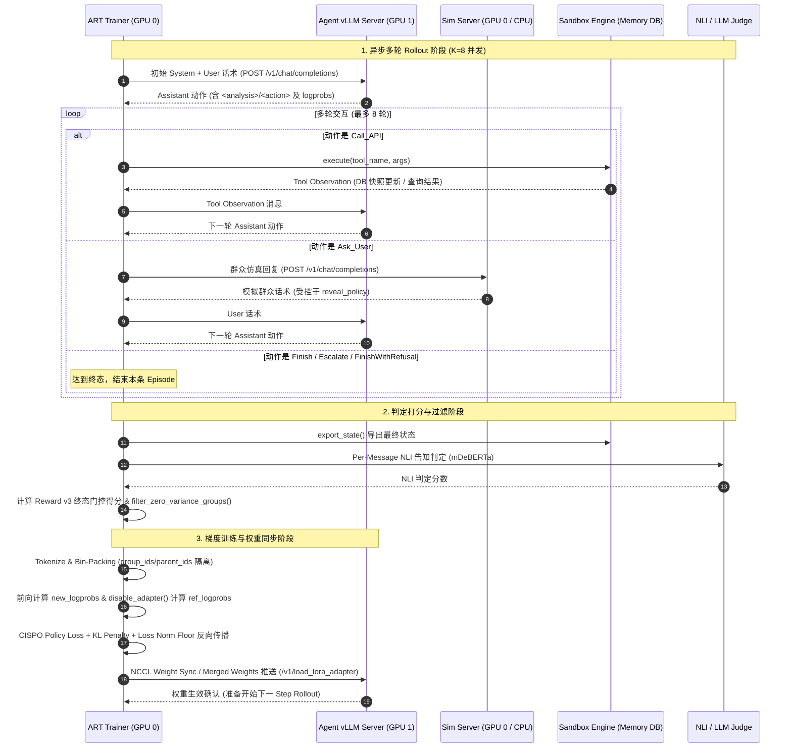

## Ch10 ART GRPO 训练：框架解构、算法机理与工程攻坚

在完成 SFT 冷启动、User Simulator 冻结以及 Phase 5 质量治理闭环后，项目进入了核心攻坚阶段——基于强化学习（RL）优化政务智能体在复杂多轮环境中的长程决策、条件槽精细判断与合规终结边界。

在工程与算法选型上，我们基于 OpenPipe ART 框架（约 0.5.18 语义，采用 LocalBackend：Unsloth 训练 + vLLM 推理）构建了全链路 GRPO（Group Relative Policy Optimization）训练流水线。

本章采用**两层立体结构**展开：
1. **项目侧编排层**：详解 `phase6/art/train_grpo.py` 的训练循环——任务采样、多轮 Rollout、判定器打分、轨迹收集、零方差动态过滤与梯度更新；
2. **ART 框架黑盒拆解层**：深入 ART 内部源码，彻底拆解 `gather_trajectory_groups`、`PackedTensors` 拼包与注意力隔离、Token 级 CISPO 损失函数、Advantage 归一化、Policy Loss 归一化分母地板（$N_{norm}=2560$）、以及 vLLM 权重同步机制。

同时，本章内嵌两个重磅决策插叙：**决策插叙⑨（KL Penalty 的优势级相对惩罚与零显存参考策略）** 与 **决策插叙⑧（6x LoRA Serving 性能悬崖发现与 Merged Serving 加速，以及 Async RL 异步漂移深度复盘）**。

---

### 10.1 项目侧训练编排体系：`train_grpo.py` 的主循环

项目侧的强化学习主循环位于 `phase6/art/train_grpo.py`。不同于简单的单轮 Prompt-Response RL，政务任务型智能体的 Rollout 是深度依赖多方协同的多轮交互。

```text
                  ┌────────────────────────────────────────────────────────┐
                  │              Phase 6 GRPO 训练主循环 (Step t)           │
                  └──────────────────────────┬─────────────────────────────┘
                                             │
      1. 任务采样 ────────────────────────────▼────────────────────────────
         select_train_step_scenarios() 从 Learnability Pool v2 采样 N 个场景
         (方差感知混合采样 + Canary 锚点保护 + 家族级隔离)
                                             │
      2. 并发 Rollout ────────────────────────▼────────────────────────────
         collect_train_groups() 调度并发生成
         每个 Scenario 并行采样 K 条轨迹 ──> art.gather_trajectory_groups
         (Agent vLLM 交互 + Sim Server 群众对话 + Sandbox 工具执行)
                                             │
      3. 判定器打分 ──────────────────────────▼────────────────────────────
         Reward Pipeline (Reward v3 终态门控):
         计算 R_complete / R_disclosure / R_escalate / R_efficiency / Hard_Zero
                                             │
      4. 零方差动态过滤 ──────────────────────▼────────────────────────────
         filter_zero_variance_groups():
         计算组内方差 Var(R) ──> 剔除 Var(R) <= eps 的无效组 (杜绝无梯度空转)
         (Canary 监控组保留进入审计，但剥离出梯度路径)
                                             │
      5. 轨迹与指标归档 ──────────────────────▼────────────────────────────
         model.log(groups, metrics, step=t)
         (写入 Parquet 审计日志 + 聚合 Step 指标 + 同步 W&B)
                                             │
      6. 后端梯度更新 ────────────────────────▼────────────────────────────
         backend.train(model, train_groups, lr, kl_penalty_coef)
         (Unsloth 算子: CISPO Loss + KL Penalty + Loss Norm Floor -> 更新 LoRA)
                                             │
      7. 权重同步与状态流转 ──────────────────▼────────────────────────────
         推送更新权重至 Agent vLLM (Merged Weights / Hot Reload)
         执行 Checkpoint 审计与熔断探测 (Train Fuse & Grad Guard)
```

#### 1. 单 Step 关键执行步骤解构
1. **场景采样（`select_train_step_scenarios`）**：
   从可学性任务池（Learnability Pool v2）中确定性循环抽取本 Step 训练的业务场景（例如 $N=8$ 个场景）。采样器严格遵循方差感知权重，过采样处于 $p \approx 0.5$ 黄金学习区的任务，并混合部分已知饱和的 Canary 锚点任务用于监控全生命周期的基线表现。
2. **异步轨迹收集（`collect_train_groups`）**：
   对采样的每个场景构造包含 $K$ 条独立交互的 `art.TrajectoryGroup`（通常 $K=8$，本 Step 共 $N \times K = 64$ 条轨迹），调用 `art.gather_trajectory_groups` 进行异步并发 Rollout。
3. **Reward v3 终态门控打分（`compute_reward`）**：
   在每条轨迹结束时，Reward Pipeline 结合沙箱真实数据库变更、Per-Message NLI 告知检测以及终态动作匹配（`TerminalMatch`），计算多维度加权奖励 $R_{total} \in [-0.2, 1.0]$；格式解析失败或严重违规直接触发 Hard-Zero（$R=0.0$ 即时终止）。
4. **零方差动态过滤（`filter_zero_variance_groups`）**：
   这是保证 GRPO 梯度的关键过滤网。GRPO 没有 Critic 网络，完全依赖组内相对优势 $A_i = (R_i - \bar{R})/\sigma_R$。若组内 8 条轨迹全部成功（8/8）或全部失败（0/8），则组内方差 $\sigma_R^2 = 0$，无任何学习信号。过滤函数精确识别并丢弃零方差组，避免无效数据冲淡优化步长。
5. **归档与审计（`model.log`）**：
   在送入梯度计算前，调用 `model.log` 将原始轨迹完整序列化为 Parquet 文件，同时计算并上报组方差、严格成功率、各业务分桶通过率等遥测指标至 W&B。
6. **参数更新（`backend.train`）**：
   将过滤后的有效轨迹组传入 ART 的 `LocalBackend.train()`，由底层 Unsloth 训练引擎执行张量打包、前向计算、Token 级 CISPO 损失、相对 KL 惩罚以及反向传播。
7. **权重推送与熔断校验**：
   完成梯度更新后，保存新的 Checkpoint，并将更新后的策略权重同步推送至推理端 vLLM；随后执行 `TrainFuse` 熔断检测与 `GradGuard` 梯度守卫，若指标异常立即安全暂停。

---

### 10.2 组件交互架构与通信拓扑

在真实训练环境下，Phase 6 采用多进程/跨 GPU 解耦的拓扑架构（以 2×A6000 48GB 节点为例），通过 HTTP 与 NCCL 高速协议协同：



**核心解耦设计**：
- **Sim Server 独立化**：User Simulator 采用独立本地 HTTP 进程承载（占用少量 GPU0 显存或 CPU），彻底隔离 Simulator 的前向推理与 Agent 主干训练，避免显存争抢与环境污染。
- **Trainer 与 Agent 推理物理分离**：GPU0 专用于 Unsloth 训练器与沙箱状态机，GPU1 专用于 Agent vLLM 推理服务，支持 Rollout 过程中的高并发解码。

---

### 10.3 ART 框架底层黑盒深度拆解

在许多应用中，ART 往往被当成一个调用 `gather` 和 `train` 的黑盒。然而，在面试与高难度算法工程场景中，能否彻底讲清 ART 的底层实现，是区分“调包工程师”与“资深算法架构师”的核心分水岭。

#### 1. `gather_trajectory_groups`：异步并发调度与组内对齐
`art.gather_trajectory_groups` 绝非简单的 `asyncio.gather`，其内部实现了专为强化学习设计的调度状态机：
- **Awaitable 嵌套包装**：接收生成器 `(TrajectoryGroup(rollout(...) for _ in range(K)) for scenario in scenarios)`。内部将每一组的 $K$ 条协程包装为异步聚合对象，并发推进。
- **组级异常熔断机制（`max_exceptions`）**：单条 Rollout 发生网络抖动或环境错误时，异常被捕获至 `group.exceptions`，不会直接打崩整个 Step；只有当异常率超过设定的 `max_exceptions` 阈值时，才会整体 Fail-Closed。
- **原子回调注入（`after_each` hook）**：支持在每组收集完毕的瞬间立即就地触发打分逻辑，流水线式释放内存。

#### 2. `TrainableModel.log`：轨迹落盘与双轨指标上报
在调用 `backend.train` 之前或之后，`TrainableModel.log` 执行关键的数据治理：
- **Parquet 轨迹流式落盘**：将每条轨迹包含的全部多轮消息、Token 级 `Choice` 对象、沙箱观察与元数据，按 `{base_path}/models/{name}/trajectories/{split}/{step:04d}.parquet` 持久化，支持字节级全量离线复盘。
- **指标聚合分类**：自动拆分计算组内均值（`group_reward`）、组内标准差（`reward_std_dev`）以及通过率，并无缝路由至本地 `history.jsonl` 与 W&B 监控看板。

#### 3. Tokenize 与 `PackedTensors`：注意力隔离与哨兵替换
多轮 Agent 轨迹输入底层大模型时，面临一个严峻挑战：一条轨迹包含 System Prompt、User 群众话术、Tool 返回结果以及 Agent 本身的动作，**只有 Agent 生成的动作 Token 才能计算 Loss 与梯度**，且同一个组内的多条轨迹往往共享长 System/User 前缀。

ART 通过极度精巧的预处理流水线解决了这一问题（位于 `src/art/preprocessing/`）：

```text
[原始 Trajectory]
System (Prompt) ──> User Turn 1 ──> Choice (Agent Action 1) ──> Tool Obs ──> Choice (Agent Action 2)
                                              │                                        │
                                              ▼                                        ▼
                                    old_logprobs 从 vLLM 提取               old_logprobs 从 vLLM 提取
                                    assistant_mask = 1                     assistant_mask = 1

[哨兵 Token 替换法]
1. 对话模板渲染: 先将 Assistant 轮次替换为唯一哨兵 Token <SENTINEL>，调用 apply_chat_template
2. 原位替换: 在 Token 序列中定位哨兵，将 vLLM 生成的真实 Token ID 与 old_logprobs 原位填回
3. 保证 Tokenizer 的 Jinja 格式与 vLLM 采样结果字节级严格一致！

[PackedTensors 贪心拼包与双 ID 注意力隔离]
Row 0: [  Prompt P  ] [ Completion A1 ] [ Completion A2 ] [  Prompt Q  ] [ Completion B1 ] ...
group_ids:    P              A1                A2              Q              B1
parent_ids:   P              P                 P               Q              Q

Causal Attention Mask 规则:
Mask[i, j] = (j <= i) & ( (group_ids[i] == group_ids[j]) | (parent_ids[i] == group_ids[j]) )
--> Completion A2 可以看到自己的历史 A1 和 Prompt P；但绝对看不到邻居 Prompt Q 与 Completion B1！
```

- **哨兵 Token 替换机制（Sentinel Replacement）**：
  为避免 Tokenizer 重新 encode 导致的多 Token 切分不一致（BPE 分词边界漂移），ART 先用 `<SENTINEL>` 占位渲染 ChatML 模板，再将 vLLM 在 Rollout 时生成的精确 Token IDs 和 Logprobs 缝合回对应位置。
- **双 ID 注意力掩码（`group_ids` 与 `parent_ids`）**：
  将多条变长轨迹贪心打包（Bin-Packing）进固定长度（如 4096）的 `PackedTensors` 中。通过 `(group_ids_query == group_ids_key) | (parent_ids_query == group_ids_key)` 构造 2D Attention Mask，在单行张量内彻底物理隔离不同样本的自注意力，实现计算吞吐最大化。

#### 4. 组内相对优势（Group-Relative Advantage）计算
在 `tokenize_trajectory_groups` 中，ART 严格按照 GRPO 范式计算样本优势：
$$\bar{R} = \frac{1}{K} \sum_{k=1}^K R_k, \quad \sigma_R = \sqrt{\frac{1}{K} \sum_{k=1}^K (R_k - \bar{R})^2}$$
$$A_k = \frac{R_k - \bar{R}}{\sigma_R + \epsilon}$$
计算出的标量优势 $A_k$ 随后被广播并对其赋给该轨迹的所有 `assistant_mask == 1` 的 Token 上。

#### 5. Token 级 CISPO 损失函数（`loss_fn`）
在底层梯度更新阶段（`src/art/loss.py`），ART 默认采用 **CISPO（Clipped IS-weight Policy Optimization）** 损失函数，而非传统 PPO 的双向裁剪目标：

$$\text{logprob\_diff} = \log \pi_\theta(a_t | s_t) - \log \pi_{\text{old}}(a_t | s_t)$$
$$\text{prob\_ratio} = \exp(\text{logprob\_diff})$$
$$L_{\text{CISPO}} = - \frac{1}{N_{\text{denom}}} \sum_{t \in \text{assistant}} \left[ \text{clip}\left(\text{prob\_ratio.detach()}, 1 - \epsilon, 1 + \epsilon_{\text{high}}\right) \cdot A_t \cdot \log \pi_\theta(a_t | s_t) \cdot w_t \right]$$

> [!IMPORTANT]
> **CISPO 相比标准 PPO 的核心优势**：
> 1. **Ratio 脱钩（`.detach()`）**：`prob_ratio` 仅作为加权系数被裁剪至 $[0.0, 5.0]$（默认 $\epsilon=1.0, \epsilon_{\text{high}}=4.0$），梯度完全通过 $\nabla_\theta \log \pi_\theta(a_t|s_t)$ 进行 REINFORCE 风格的反向传播。
> 2. **杜绝梯度死区**：标准 PPO 在比值超出 Trust Region 时直接将梯度截断为 0；在多轮长序列任务中，关键的决策/工具调用 Token 往往出现概率较低，CISPO 保证了这些关键探索 Token 即使比值较大，依然能保留方向明确的修正梯度，大幅提升多轮策略探索的稳定性。

#### 6. Policy Loss 归一化分母地板（`loss_norm_floor.py`）
在长序列多轮 RL 训练中，我们遭遇了极端样本导致的梯度爆炸难题（见下文 Note 026 实证）。

- **标准 ART 的分母陷阱**：
  原生 ART 的损失归一化分母为当前 Batch 中 Assistant Token 的掩码和：$N_{\text{stock}} = \sum \text{assistant\_mask} + 1e\text{-}18$。
  当某个 Batch 中包含因格式错误即时终止或身份冒充直接拒绝的极短样本时，$N_{\text{stock}}$ 骤降至仅十几个 Token，导致单步 Policy Loss 被放大上百倍，引发高达 18.4~35.0 的剧烈梯度尖峰（Grad Norm Spike）。
- **分母地板创新设计**：
  我们在 `phase6/art/loss_norm_floor.py` 中引入了策略损失分母地板：
  $$N_{\text{denom}} = \max\left(\sum \text{assistant\_mask}, N_{\text{norm}}\right), \quad \text{其中 } N_{\text{norm}} = 2560$$
- **关键约束**：分母地板**仅作用于 Policy Loss 的除法**；Entropy 与 KL 散度依然保持原生 `stock_denominator` 与 `masked_mean`，确保正规化项的物理尺度不发生系统性失真。

---

### 10.4 决策插叙⑨：KL Penalty 的设计与解读指南

在强化学习多轮微调中，防止策略在环境奖励的诱导下发生**奖励作弊（Reward Hacking）**与**模式坍缩（Mode Collapse）**是决定项目成败的底线。

> 详见项目实验笔记：`docs/experiment-notes/020-kl-penalty-rationale-and-interpretation-guide.md`

```text
[标准 TRL GRPO 实现]
Loss = Policy_Loss + beta * KL(pi_current || pi_ref)
--> 粗暴地在标量 Loss 上累加惩罚，同等压制所有偏离，抑制有效探索。

[ART 创新实现: Advantage-Level 相对 KL 调节]
1. 计算每个 Token 的偏离散度: kl_per_token = (log pi_new - log pi_ref) * mask
2. 计算全局平均散度: avg_kl = mean(kl_per_token)
3. 相对优势微调:
   kl_penalty = c_kl * (avg_kl - kl_per_token) * mask
   Advantage_t <- Advantage_t + kl_penalty

--> 核心机理:
    若某个 Token 的偏离程度 > 平均水平 (kl_per_token > avg_kl) --> 获得负惩罚 (Advantage 降低)
    若某个 Token 的偏离程度 <= 平均水平 --> 获得相对奖励 (Advantage 增加)
    保留了模型在“平均偏离预算”内的探索自由度，只定向压制异常离群 Token！
```

#### 1. 参考策略的零显存实现（`disable_adapter`）
在传统的 RLHF 架构中，计算 KL 散度通常需要常驻一个与当前模型等大的 Reference Model，导致显存翻倍。

ART 基于 PEFT LoRA 架构实现了极度优雅的零显存参考前向：
```python
# art/unsloth/train.py: calculate_logprobs 核心片段
if reference_logprobs:
    # 利用 PEFT 上下文管理器临时将 LoRA A/B 矩阵权重置零
    with trainer.accelerator.unwrap_model(trainer.model).disable_adapter():
        with torch.no_grad():
            ref_logits = trainer.model(input_ids=input_ids, ...).logits
            ref_logprobs = _calculate_logprobs(ref_logits, next_input_ids)
```
通过在同一套网络参数上临时禁用 LoRA 适配器，以仅仅增加 ~5% 单步墙钟时间的微小代价，**实现了 0 MB 的额外显存开销**。

#### 2. Wandb `loss/kl_policy_ref` 监控与健康诊断指南
在 Phase 6 的实际训练中，我们通过 W&B 实时监控 `loss/kl_policy_ref` 曲线，建立了标准化的健康诊断规则：

```text
KL 散度
0.30 ┤                              ╱──────  [健康稳定态: 0.01 ~ 0.30]
0.20 ┤                         ╱───╱
0.10 ┤                    ╱───╱
0.05 ┤              ╱────╱
0.00 ┤─────────────╱
     └──────────────────────────────────→ Training Step
```

| 曲线形态与特征 | 潜在病理诊断 | 应对与处置策略 |
|---|---|---|
| **KL 快速飙升至 > 1.0** | 策略发生剧烈漂移，模型正在 Reward Hacking（如发现复读某句时效告知即可刷高 NLI 奖励） | 立即查看 Completions 表排查话术；将 `c_kl` 从 0.04 调高至 0.08~0.10 |
| **KL 持续接近 0.0** | 探索严重受限，或奖励完全无方差 | 检查组内方差 `reward_std_dev` 是否大于 0；降低 `c_kl` 至 0.01 |
| **KL 骤降至 0（训练中后期）** | **模式坍缩（Mode Collapse）**：模型退化为对所有输入输出单一口癖 | 该 Run 已废，立即早停并排查奖励函数 |
| **KL 在 0.01~0.30 平稳波动** | **黄金健康区间**：策略在受控边界内积极探索高奖励动作 | 保持超参，正常推进训练 |

---

### 10.5 决策插叙⑧：两个关键工程发现——LoRA Serving 悬崖与 Async RL 深度复盘

强化学习训练的吞吐性能直接决定了算法迭代的生命线。在 Phase 6 中，我们经历了两次深刻的工程战役。

> 详见实验笔记：`docs/experiment-notes/023`、`024`、`025` 与 ADR `adr-phase6-rollout-throughput-4b-adoption-and-stop-infra-optimization.md`

#### 发现一：6x LoRA Serving 性能悬崖与 Merged Serving 机制
在完成 4B Agent 迁移（4B ckpt-720 严格对齐 8B 的 0.801 成功率且违规率为 0）后，我们对 Rollout 吞吐进行了纳秒级 Profiling，遭遇了一个惊人的性能悬崖：

```text
[Step 0 推理 (Zero-Delta 初始 LoRA)]
--> Peak Running: 62, Waiting: 0, Prefix Cache: 92.1%, 生成吞吐: 1511.1 tok/s (单步 Rollout 仅 45 秒)

[Step 1+ 推理 (Non-Zero Delta 训练后 LoRA)]
--> Peak Running: 64, Waiting: 0, Prefix Cache: 94.2%, 生成吞吐暴跌至: 247.2 tok/s (暴降 6 倍!)
--> 单步耗时被生生拉长至 8~9 分钟!
```

**深入排查与“廉价配置解”的破灭**：
1. **排查假说 A（Prefix Cache 失效）**：日志证实缓存命中率始终稳定在 94%~95%，LoRA 重载未冲垮 KV Cache（排除 World A 假设）。
2. **低成本配置尝试（Cheap-Fix Triage）**：
   - 禁用 CUDA Graph Specialization（`no_cudagraph_specialize_lora`）：仅改善 +11%（275 tok/s）；
   - 关闭分块 Prefill（`no_chunked_prefill`）：仅改善 +6%（262 tok/s）；
   - 强制 Eager 模式（`enforce_eager`）：仅改善 +3%（254 tok/s）。
3. **定位底层根因**：瓶颈根植于 vLLM 底层的 **Triton JIT LoRA Kernel** 在 $r=128$ 非零权重下的高昂计算开销。

**终极破局：Merged Serving 机制**
既然 LoRA Kernel 存在性能缺陷，而在 Strict 串行训练流中（Rollout 全部完成 $\to$ Train $\to$ 更新权重），同一时刻服务端仅需运行单一最新版本模型，我们启用了 `rollout_weights_mode="merged"`：
- 训练完成后，后台直接将 LoRA 权重与 Base 模型矩阵进行数学加和（$\text{Base} + \frac{\alpha}{r} BA$）；
- 以完整全量权重形式向 vLLM 推送热更新，彻底关闭 vLLM 的 LoRA Kernel 插件分支；
- **结果**：推理吞吐瞬间满血复活至 **~1500 tok/s**，单步 Rollout 耗时从 8 分钟大幅压缩至 1 分钟级！

---

#### 发现二：Async RL 深度复盘——漂移、损失鲁棒性与语义冲突
在业界，异步强化学习（如 ART 的 `PipelineTrainer(max_steps_off_policy=1)`）通过让 Rollout 与 Trainer 重叠执行来隐藏训练延迟。我们对此进行了严谨的理论解构与实证压测：

```text
[1. Intra-Step Drift: Strict 模式下的隐蔽漂移]
即便在所谓的 Strict 同步模式下，一个 ART Step 内部也包含中位数 40~48 次 Minibatch 梯度更新。
后续 Minibatch 事实上已经在轻微过时的数据上优化。PPO/CISPO 的 Ratio + Clip 天生就是为了容忍这种 Intra-step Drift。

[2. Async k=1 的漂移放大]
Async k=1 (max_steps_off_policy=1) 将数据滞后度扩大了约 1.8~2.0 倍 (相当于增加了一个 Step Boundary)。
由于 CISPO 的 Ratio 宽截断 ([0, 5]) 与 REINFORCE 梯度特性，这一程度的漂移并未导致策略发散。

[3. 致命冲突: Merged Serving 与 Async 多版本 Adapter Lease 的语义死锁]
为什么 Async 模式不能简单开启 Merged Serving 提速？
- LoRA 模式下: vLLM 可同时并存 @12 与 @13 两个 Adapter，正在进行中的 8 轮对话被 Lease 钉在 @12，能完整跑完所有轮次；
- Merged 模式下: 服务端物理上只有一份全量权重 (@13)！
- 冲突触发: 一个在 @12 发起的 8 轮交互，在执行到第 5 轮时后台完成了权重 Merge 并切换为 @13；当它继续请求第 6 轮时，vLLM 返回 404 Model Not Found，直接导致整条 Trajectory 崩溃报废！
```

**复盘结论**：
Async RL 是一项极具前景的吞吐优化方向，但在多轮对话智能体（Multi-Turn Agent）场景下，必须配合 **Drain Barrier（排空屏障）** 或 **Turn-Level 混合策略兼容机制** 才能安全落地。在缺乏这些复杂基建的前提下，**手写 Strict 串行调度 + Merged Serving** 是在算法确定性与工程吞吐之间最稳健的帕累托最优解。

---

### 10.6 本章小结

本章系统解构了 agentic-gov 在 Phase 6 中的强化学习训练核心：
1. 构建了由任务采样、自由 Rollout、Reward v3 终态门控、零方差过滤与 Unsloth 更新组成的高可靠项目级编排架构；
2. 彻底拆解了 ART 框架底层的 `PackedTensors` 拼包、双 ID 注意力隔离、Token 级 CISPO 损失以及优势归一化机理；
3. 阐明了 $N_{norm}=2560$ 损失归一化分母地板在抑制长序列梯度尖峰中的实证价值；
4. 深度复盘了 Advantage 级相对 KL 惩罚与零显存参考策略设计，以及 6x LoRA Serving 性能悬崖破局与 Async RL 适用边界。

至此，一个高吞吐、高稳定、严守业务红线的政务智能体强化学习闭环已完全就绪。在下一章中，我们将展示该系统在真实复杂业务集上的最终有效性结论（Verdict）与全盘复盘。
