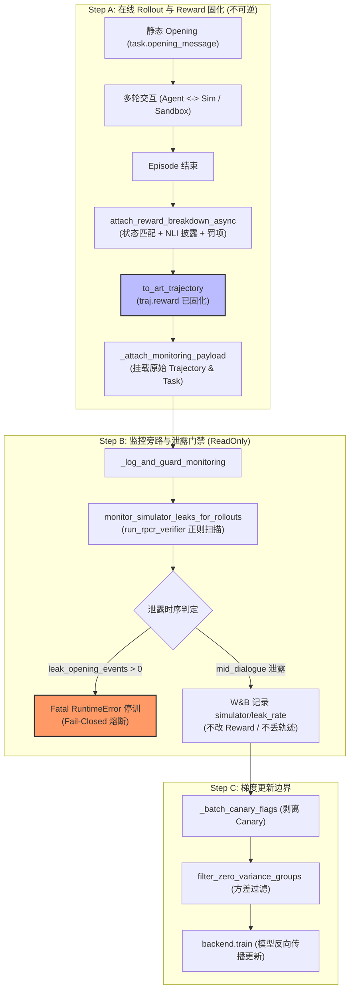
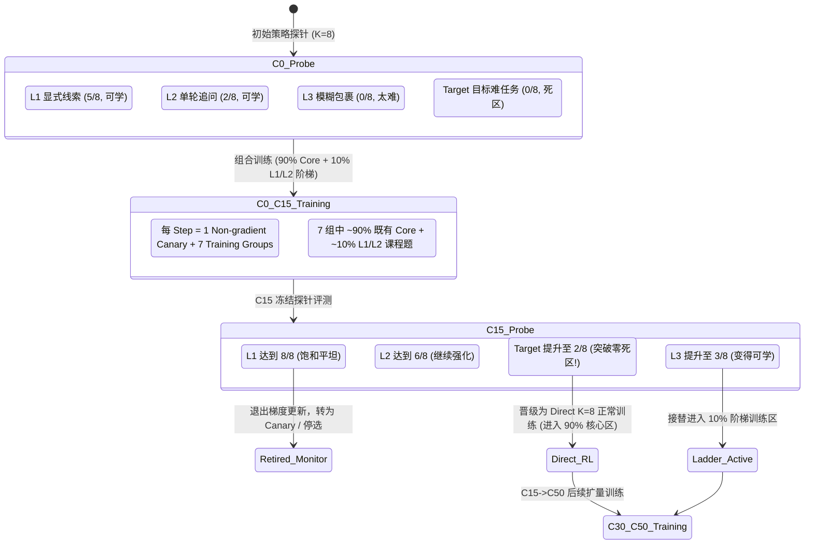
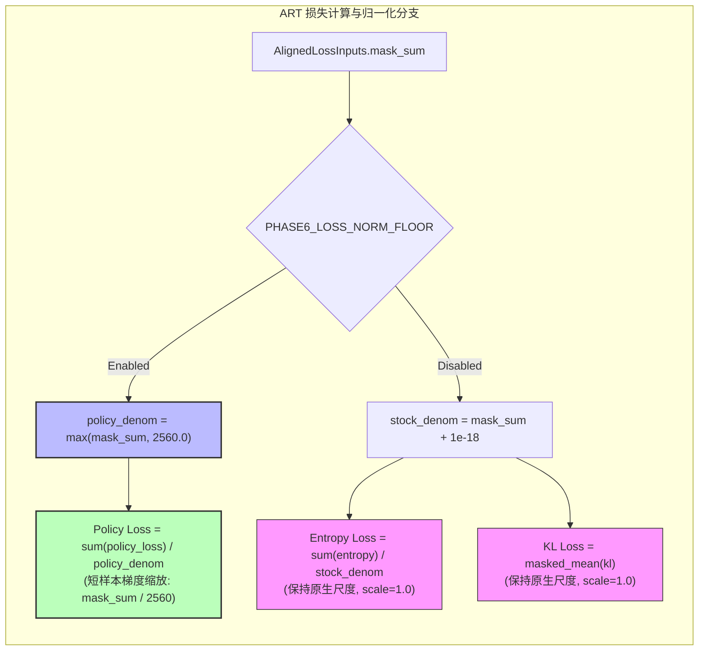

# Follow-up C — RL 泄露隔离、非梯度监控、L1~L3 课程与 N_norm 归一化地板

> **定位**：本文档为 `agentic-gov-recap` 强化学习（Phase 6）核心机制的专题复盘补丁，严格基于项目源码（`agentic-gov`、`ART`）与真实实验笔记（Note 005, 010, 016, 020, 021, 022, 024, 026, 027, 028, 029, 030, 031），系统解答强化学习环境隔离、监控预算边界、分级课程学习与梯度稳定性四大深度问题。

---

## 目录

- [一、直接回答](#一直接回答)
  - [Q1: Phase 6 Simulator 只读泄露隔离与 Reward 边界](#q1-phase-6-simulator-只读泄露隔离与-reward-边界)
  - [Q2: 10% 非梯度监控预算与四类数据边界划分](#q2-10-非梯度监控预算与四类数据边界划分)
  - [Q3: L1~L3 三级课程体系、演化脉络与晋级机制](#q3-l1l3-三级课程体系演化脉络与晋级机制)
  - [Q4: N_norm = 2560 策略损失分母地板的确定机理与权衡](#q4-n_norm--2560-策略损失分母地板的确定机理与权衡)
- [二、事实与出处](#二事实与出处)
- [三、建议插入 recap 的正文补丁](#三建议插入-recap-的正文补丁)
  - [Ch8 补丁：L1~L3 课程演化、血缘与配额状态机](#ch8-补丁l1l3-课程演化血缘与配额状态机)
  - [Ch9 补丁：Simulator 泄露监控旁路与 Reward 绝对隔离](#ch9-补丁simulator-泄露监控旁路与-reward-绝对隔离)
  - [Ch10 补丁：N_norm = 2560 F1-V A/B 实验实证与 Policy-Only 约束](#ch10-补丁n_norm--2560-f1-v-ab-实验实证与-policy-only-约束)
  - [Ch11 补丁：非梯度监控、探针与泛化评测的边界契约](#ch11-补丁非梯度监控探针与泛化评测的边界契约)
- [四、建议的伪代码补丁](#四建议的伪代码补丁)
  - [补丁 1：Simulator 泄露检测与 Fail-Closed 熔断门控](#补丁-1simulator-泄露检测与-fail-closed-熔断门控)
  - [补丁 2：Policy-Only 归一化地板与尺度因子计算](#补丁-2policy-only-归一化地板与尺度因子计算)
- [五、仍需谨慎的说法与表述纠偏](#五仍需谨慎的说法与表述纠偏)

---

## 一、直接回答

### Q1: Phase 6 Simulator 只读泄露隔离与 Reward 边界

#### 30 秒面试速答
> “Simulator 在 Phase 6 中是‘环境’而非 Policy。我们通过**执行时序硬解耦**保证泄露绝对不进入 Reward：Rollout 结束时，Reward（状态转移 + NLI 披露）已计算完毕并固化进 Trajectory；随后 Leak Monitor 仅作为只读旁路探针运行 CPU 正则校验。若检测到首轮 Opening 泄露，触发 Fail-Closed 致命异常（`RuntimeError`）直接熔断停训；若检测到对话中途泄露，仅记录 W&B 遥测指标，**既不修改 Reward、不反向惩罚 Agent，也不丢弃轨迹或重采样**。这种设计防止了将环境故障伪装成 Agent 策略缺陷。”



#### 精确 Data-Flow 追溯
1. **Reward 计算边界**（[`phase6/art/rollout.py:288-300`](file:///Users/sunxichen/Projects/agentic-gov/phase6/art/rollout.py#L288-L300)）：
   - `rollout_spec` 完成交互后生成 `EpisodeResult`；
   - 调用 `_attach_reward_breakdown_async` $\to$ `attach_reward_breakdown`（[`agentic_gov/runtime/reward_glue.py`](file:///Users/sunxichen/Projects/agentic-gov/src/agentic_gov/runtime/reward_glue.py)），根据沙箱最终状态 `r_complete`、NLI 蕴含 `r_disclosure`、升级合规 `r_escalate` 及轮数/错误调用惩罚计算标量奖励；
   - `to_art_trajectory` 将奖励写入 `art.Trajectory.reward`；
   - `_attach_monitoring_payload` 将底层 `Trajectory` 与 `CanonicalTask` 以私有属性 `_phase6_episode_trajectory` 挂载到 `art.Trajectory` 上。
2. **Leak Monitor 触发边界**（[`phase6/art/train_grpo.py:1230-1262`](file:///Users/sunxichen/Projects/agentic-gov/phase6/art/train_grpo.py#L1230-L1262)）：
   - 在 `collect_train_groups` 收集完一个 Step 的全部 Trajectories 后，调用 `_log_and_guard_monitoring`；
   - `leak_monitor_pairs_from_trajectories` 提取挂载的 Payload；若轨迹存在但 Payload 缺失，抛出 `RuntimeError` 防止监控被绕过；
   - `monitor_simulator_leaks_for_rollouts` 调用 [`src/agentic_gov/runtime/simulator_leak_monitor.py`](file:///Users/sunxichen/Projects/agentic-gov/src/agentic_gov/runtime/simulator_leak_monitor.py) 中的 `monitor_rollout_leaks`，在 CPU 上执行 `run_rpcr_verifier`。
3. **真实动作分支**：
   - **首轮 Opening 泄露**（`leak_opening_events > 0`）：触发 `raise RuntimeError("simulator opening leak detected; stopping Phase 6 training")`，立即中断训练。
   - **中途 Mid-dialogue 泄露**：仅在返回的 `metrics` 中输出 `simulator/leak_rate` 与 `simulator/leak_by_rule/*` 并落盘 W&B，**不修改任何已计算的 Trajectory Reward，不丢弃 Trajectory，不丢弃 Group，不执行重采样**。
4. **无法“绝对保证”的边界与审计方式**：
   - *无法保证的物理边界*：若 Simulator 中途提前泄露槽位，Agent 可能“不当获益”（无需多轮追问即可直接办理业务，从而获得更高的轮数效率奖励 $P_{\text{turns}}$），产生**正向捷径偏置（Shortcut Exploitation）**。
   - *审计机制*：W&B 实时监控 `simulator/leak_rate` 与 `simulator/leak_by_rule/reveal_when_requested_after_delay`；并在离线独立评测集（`hard_val_v1_prime`）中使用固定注入器复核合规率。

---

### Q2: 10% 非梯度监控预算与四类数据边界划分

#### 30 秒面试速答
> “`10% 非梯度监控预算`指的是在每步 8 个 Group 中分配 1 组（约 10%~12.5% 采样预算）饱和/基线任务（如 `account_balance_query × Finish`）。这部分数据**完整执行前向 Rollout 与奖励计算，但在反向传播前被强制剥离，不计算 Policy Loss、不反向传播、不进入 Optimizer Step**。它的唯一作用是实时监控简单基线任务的留存率，防范灾难性遗忘。我们严格区分了 Budget（采样配额）、Monitor（在线非梯度监控）、Eval（定步探针评测）与 Holdout（物理隔离泛化集）四级边界。”

#### 边界与隔离机制（Data Path 追溯）
- **前向执行**：`collect_train_groups` 对全量 8 组（含 Canary）并发执行 Rollout，计算沙箱与 NLI Reward；
- **梯度剥离**（[`phase6/art/train_grpo.py:780-794`](file:///Users/sunxichen/Projects/agentic-gov/phase6/art/train_grpo.py#L780-L794)）：
  ```python
  canary_flags = _batch_canary_flags(batch, v2_route=v2_route, sampler_config=sampler_config)
  gradient_groups = [g for g, is_canary in zip(groups, canary_flags) if not is_canary]
  train_groups = filter_zero_variance_groups(gradient_groups, epsilon=dynamic_filter_epsilon)
  result = await backend.train(model, train_groups, ...)
  ```
- **门禁排除**：Canary 组被排除在 `backend.train` 之外，同时不计入零方差过滤（Dynamic Filter）的 Drop 分子分母，不计入全跑 skip 统计，也不参与梯度裁剪（Grad Guard）的统计计算。

#### 四类概念的严格界定

| 概念 | 阶段与时机 | 是否前向 Rollout | 是否产生梯度 / Step | 作用与约束 |
| :--- | :--- | :---: | :---: | :--- |
| **Budget（采样预算）** | 每 Step 采样器内 | - | - | 采样器依据策略给各 Bucket 分配的槽位比例（如 80/10/10 或 1 Canary + 7 Training）。 |
| **Monitor / Canary（非梯度监控）** | 每 Step 训练循环内 | **是** | **否（强制剥离）** | 在线跟踪已饱和基线任务，检测先验漂移与遗忘；遥测输出至 W&B，完全不更新权重。 |
| **Eval（离线/定步探针）** | 固定 Checkpoint (C0/C15/C30/C50) | **是** | **否** | 冻结面板探针（如 K=8 离线测试、74 条晋级队列），评估当前模型在各能力阶梯上的真实表现，触发课程晋级决策。 |
| **Holdout（严格隔离泛化集）** | 最终验收 (Exit Eval) | **是** | **否** | 物理/血缘级永久隔离（如 `hard_val_v1_prime` 的 38 条 Escalate + 16 条 absent-delegation 任务）。**绝对禁止进入训练集、课程阶梯或监控池**。 |

---

### Q3: L1~L3 三级课程体系、演化脉络与晋级机制

#### 30 秒面试速答
> “由于目标难任务（Target）在初始策略下为全败死区（$0/8$ 成功），GRPO 相对优势归零，无法冷启动。我们设计了由易到难的 L1~L3 渐进式课程：L1 显式线索、L2 单轮追问、L3 模糊包裹。在每步 8 组（1 监控 + 7 训练）中分配约 10% 的课程训练预算。模型在 C0 训练 L1/L2；在 C15 探针中，一旦 Target 成功率突破至 $2\sim6/8$，立即晋级为 Direct RL 正常训练；而饱和到 $8/8$ 的 L1 则退出梯度更新退役为监控。项目经历了从早期 Frontloading 故障、方差感知混合采样、可学习性池 v1/v2，到最终 SR5 阶梯课程与血缘隔离的完整演化。”

#### 课程层级定义与设计契约



1. **三级课程任务画像**（[`docs/experiment-notes/027`](file:///Users/sunxichen/Projects/agentic-gov/docs/experiment-notes/027-phase6-sr5-k8-curriculum-checkpoint-probe-and-scaling-20260721.md)）：
   - **L1（基础阶梯）**：条件明晰，工具显式返回错误码（如 `ACCOUNT_FROZEN`），或用户在首轮 Opening 明确给出核心信息。C0 成功率约 $5/8$。
   - **L2（进阶阶梯）**：首轮缺失关键槽位，需 Agent 主动发起一次常规追问（`Ask_User`），用户随后完整配合透露。C0 成功率约 $2/8$。
   - **L3（高阶阶梯）**：信息包裹在口语化、含糊表达中，或设置延迟透露（`reveal_when_requested_after_delay`）。C0 成功率约 $0\sim 1/8$。
   - **Target（最终困难目标）**：包含完整业务边界、对抗性表达（如虚假代办身份）或多重冲突校验。C0 成功率恒为 $0/8$。
2. **Reward 与配额规则**（[`docs/experiment-notes/028`](file:///Users/sunxichen/Projects/agentic-gov/docs/experiment-notes/028-phase6-sr5-homogeneous-k8-curriculum-amendment-draft-20260721.md)）：
   - **Reward**：L1~L3 统一采用无偏差的 `Reward v3` 终态门控公式，严禁针对简单级别放宽评判标准。
   - **步配额与来源计划**：每 Step 固定 8 组（1 Canary + 7 Training）。在冻结 Packet 视界内，7 组训练数据按**不可变来源（Provenance）**审计：`hard_train_v2` 50%、历史 T2 25%、历史 T7 hard 15%、accepted curriculum 10%。
3. **阶段晋级与退役规则（Promotion / Demotion Lifecycle）**：
   - **C15 评测**：
     - 若 L1 达到 $8/8$，判定为饱和平坦区，**退出梯度更新**，退役为 Canary 监控候选或停止采样；
     - 若 Target 从 $0/8$ 提升至 $2\sim 6/8$（进入黄金学习区），**立即晋级为 Direct RL**，以真实困难条件进入正常训练；
     - 若最易级别的 L1 在 C0 探针与 K=32 探针中均呈现 $0/32$，RL 课程无法冷启动，此为**唯一允许提出 SR5C SFT 补丁（Booster）的条件**。
4. **演化脉络与历史机制解耦**：
   - **Frontloading 故障（Note 021）**：早期试图在采样前置中硬编码贷款升级比例，导致前 36 步全抽中饱和样本，丢弃率 94%。
   - **方差感知混合采样器（Variance-Aware Mixture, Note 024）**：引入 `rng.shuffle` 解耦存在性与位置，过采样 $p \approx 0.5$ 高方差任务（`loan/Finish` 74%, `purchase/Finish` 26%）。
   - **可学习性池 v1 $\to$ v2（Note 026）**：v1 按 80/10/10 划分；v2 重构为 `core`（$2\sim 6/8$）、`easy_canary`（$7\sim 8/8$）、`r3_queue`（$s=1$）和 `diagnostic_queue`（$s=0$）。
   - **SR5 阶梯课程（Note 027/028）**：在 v2 基础上形式化来源与路由解耦（Provenance 不可变，Route 动态晋级），确立 C0$\to$C15$\to$C30$\to$C50 阶段性换包机制。

---

### Q4: N_norm = 2560 策略损失分母地板的确定机理与权衡

#### 30 秒面试速答
> “$N_{\text{norm}} = 2560$ 是通过 **F1-V 受控 A/B 稳定性实验**严格确定的 Policy Loss 归一化分母地板。它既不是 Assistant Token 的统计 P50（P50 仅 ~160），也不是硬件 Pad 宽度（4096），而是为了压制短序列拒绝/报错样本导致的 $1/N_{\text{tokens}}$ 梯度爆炸。在 512（仍有 8.46 尖峰）、2048（超标 2.22）、4096（过度压制正常信号至 30%~40%）等多组候选对比中，**2560 是唯一既能将目标尖峰从 18.4 压制到 1.59（<2.0 门限），又能将 3 个正常对照任务的信号中位数保留在 52%~68%（落在 [0.5, 2.0] 合规区间）的平衡点**。该地板仅对 Policy Loss 除法生效，Entropy 与 KL 保持原生尺度，避免正规化项失真。”

#### 实验演进与参数选择证据（Note 026 §5-§6）

| 候选 $N_{\text{norm}}$ | 目标异常任务 Max Grad Norm | 正常对照任务 Median 留存比率 | 决策结论 | 失败/接受原因 |
| :---: | :---: | :---: | :---: | :--- |
| **OFF（原生分母）** | **18.4** | 1.000 (基准) | Rejected | 8/8 Batch 梯度 $\ge 2.0$，引发 Grad Guard 连续跳步熔断。 |
| **512（Dev 初选）** | **8.46** | ~0.900 | Rejected | 无法压制极端短样本的梯度尖峰（未达 $<2.0$ 门禁）。 |
| **2048** | **2.22** | ~0.720 | Rejected | 目标任务最大值仍突破 2.0 绝对硬门。 |
| **4096** | 1.24 | **0.324 / 0.397 / 0.423** | Rejected | 靠整体过度压低一切；正常任务学习信号被削弱 60%~70%，未达 $[0.5, 2.0]$ 门禁。 |
| **2560（最终选定）** | **1.59 (< 2.0)** | **0.526 / 0.630 / 0.681** | **ACCEPTED** | **唯一同时满足：目标尖峰 $<2.0$ 且正常对照留存比在 $[0.5, 2.0]$ 内。** |



#### 触发范围、梯度改变与隔离设计（[`phase6/art/loss_norm_floor.py`](file:///Users/sunxichen/Projects/agentic-gov/phase6/art/loss_norm_floor.py)）
1. **触发范围**：当 Batch 中 Assistant Token 掩码和 $\sum \text{mask} < 2560$ 时触发；当 $\sum \text{mask} \ge 2560$ 时，$\text{denom} = \sum \text{mask}$，缩放因子为 $1.0$（自然平滑过渡）。
2. **梯度改变**：将 Policy Loss 的梯度乘以 $\frac{\sum \text{mask}}{2560} \in (0, 1)$。对于 160 Token 的短样本，梯度强度缩减至原先的 $1/16$（即乘上 $0.0625$），消除梯度数值爆炸。
3. **为什么不缩放 Entropy 与 KL？**
   - Policy Loss 依赖组内相对优势打分，短序列除以小分母会导致参数暴冲；
   - Entropy 负责维持局部探索随机性，若除以 2560 会导致探索熵奖励被极度压缩（削弱 10~20 倍），引发策略过早确定化与模式坍缩；
   - KL 散度使用 Token-level `masked_mean` 作为策略偏离锚点，若缩放会导致参考模型约束失效。
4. **工程权衡（Trade-off）**：
   - *收益*：无需暴力丢弃短序列直接拒绝或报错的有效探索样本，彻底根治 Grad Spike。
   - *代价*：短序列样本在单步更新中的权重被相对压低，学习速度减缓；$N_{\text{norm}}=2560$ 是特定模型架构（Qwen-4B）与多轮序列长度分布下的实验标定值，而非跨模型的通用数学常数。

---

## 二、事实与出处

| 关键要素 | 真实代码 / 文件路径 | 核心函数 / 类 / 配置字段 | 关键证据与度量指标 |
| :--- | :--- | :--- | :--- |
| **Simulator 泄露监控底座** | [`src/agentic_gov/runtime/simulator_leak_monitor.py`](file:///Users/sunxichen/Projects/agentic-gov/src/agentic_gov/runtime/simulator_leak_monitor.py) | `monitor_rollout_leaks`, `LeakMonitorReport` | `warn_threshold=0.05`, `by_timing["opening"]`, `by_rule` 分桶 |
| **RL Rollout 监控挂载** | [`phase6/art/rollout.py`](file:///Users/sunxichen/Projects/agentic-gov/phase6/art/rollout.py) | `rollout_spec`, `_attach_monitoring_payload` | `_phase6_episode_trajectory`, `_phase6_task` 属性注入 |
| **GRPO 监控与熔断门控** | [`phase6/art/train_grpo.py`](file:///Users/sunxichen/Projects/agentic-gov/phase6/art/train_grpo.py) | `_log_and_guard_monitoring`, `log_training_monitoring` | `leak_opening_events > 0` $\to$ `RuntimeError` 停训 |
| **Canary 梯度剥离** | [`phase6/art/train_grpo.py`](file:///Users/sunxichen/Projects/agentic-gov/phase6/art/train_grpo.py) | `_batch_canary_flags`, `filter_zero_variance_groups` | Canary 排除在 `backend.train` 之外，0% 梯度贡献 |
| **可学习性池 v1 / v2** | [`phase6/art/learnability_pool.py`](file:///Users/sunxichen/Projects/agentic-gov/phase6/art/learnability_pool.py)<br/>[`phase6/art/learnability_pool_v2.py`](file:///Users/sunxichen/Projects/agentic-gov/phase6/art/learnability_pool_v2.py) | `compose_learnability_pool`, `CORE`, `EASY_CANARY`, `R3_QUEUE` | 80/10/10 比例，Pass@8 $\in [2,6]$ 入选 Core，T7 207 条 hard 合并 |
| **分母地板实现与镜像** | [`phase6/art/loss_norm_floor.py`](file:///Users/sunxichen/Projects/agentic-gov/phase6/art/loss_norm_floor.py) | `policy_denominator`, `stock_denominator`, `loss_scale_factor` | `PHASE6_LOSS_NORM_FLOOR=1`, `PHASE6_LOSS_NORM_N=2560.0` |
| **F1-V A/B 实验实证** | [`docs/experiment-notes/026`](file:///Users/sunxichen/Projects/agentic-gov/docs/experiment-notes/026-phase6-s3r-s3r2-recovery-experiments-20260717.md) | §5.2, §6.2, §6.3 (F1-V 评测) | Target Max Grad Norm: 18.4 $\to$ 1.59; Control Ratio: 0.681/0.526/0.630 |
| **课程体系设计与 90/10 契约** | [`docs/experiment-notes/027`](file:///Users/sunxichen/Projects/agentic-gov/docs/experiment-notes/027-phase6-sr5-k8-curriculum-checkpoint-probe-and-scaling-20260721.md)<br/>[`docs/experiment-notes/028`](file:///Users/sunxichen/Projects/agentic-gov/docs/experiment-notes/028-phase6-sr5-homogeneous-k8-curriculum-amendment-draft-20260721.md) | §3, §4, §6 (L1~L3 演化与换包) | 每步 8 组 (1 Canary + 7 训练)；7 组中 ~90% Core + ~10% Curriculum |
| **数据血缘与不可观察缺陷审计** | [`docs/experiment-notes/030`](file:///Users/sunxichen/Projects/agentic-gov/docs/experiment-notes/030-phase6-rl-data-problem-map-and-remediation-plan-20260726.md)<br/>[`docs/experiment-notes/031`](file:///Users/sunxichen/Projects/agentic-gov/docs/experiment-notes/031-independent-root-cause-review-20260726.md) | 结构性缺陷排查 (Note 030 §2, Note 031 §2) | 38 条无效任务 (0/304); 36 条可观测难任务 (+78% 提升, 14/288 $\to$ 25/288) |

---

## 三、建议插入 recap 的正文补丁

### Ch8 补丁：L1~L3 课程演化、血缘与配额状态机

建议在 [`recap-blog.md` 8.3 节末尾（第 1268 行后）](file:///Users/sunxichen/Projects/leetcode-practice-app/leetcode-practice-web/.scratch/interview-deck/agentic-gov-recap/recap-blog.md#L1268) 插入以下完整课程体系解析：

```markdown
#### 4. L1~L3 渐进式课程学习与 Checkpoint 晋级状态机（Note 027 / 028）

在多轮交互任务中，最困难的非 Happy Path 业务（如隐蔽代办、多因子冻结）在 SFT 阶段的 Pass@8 往往为恒定的 `0/8`（全败死区）。直接送入 GRPO 会因组内无方差（$\sigma_R = 0$）导致相对优势全部归零，训练完全停滞。

为此，我们在 SR5 中确立了**显式可观测证据梯度驱动的 L1~L3 渐进式课程体系**：

```text
               [L1 显式线索]             [L2 单轮追问]             [L3 模糊包裹]             [Target 目标难任务]
特点:        工具显式报错/配合输入      首轮缺槽位/需追问1次      口语化模糊/延迟透露       多重冲突/严格合规拒办
初始状态:    C0 Pass@8 ≈ 5/8 (可学)   C0 Pass@8 ≈ 2/8 (可学)   C0 Pass@8 ≈ 0/8 (太难)    C0 Pass@8 = 0/8 (死区)
训练分配:    ┌──────────────────────┐                         │                         │
            │ 入选 10% 课程训练区  │                         │ 暂时留在梯度外          │ 暂时留在梯度外
            └──────────────────────┘                         │                         │
                       │                                      │                         │
                       ▼ 训练 15 步达到 C15                   │                         │
C15 评测:   Pass@8 = 8/8 (饱和平坦)   Pass@8 = 6/8 (继续强化)   Pass@8 = 3/8 (变得可学)   Pass@8 = 2/8 (进入黄金区!)
晋级动作:   ┌──────────────────────┐ ┌──────────────────────┐ ┌──────────────────────┐ ┌──────────────────────┐
            │ 退役为 Canary 监控   │ │ 留在 10% 课程区      │ │ 接替进入 10% 课程区  │ │ 晋级为 Direct RL!    │
            │ (退出模型梯度更新)   │ │ (继续提供稳定信号)   │ │ (承接进阶探索)       │ │ (进入 90% 核心训练区)│
            └──────────────────────┘ └──────────────────────┘ └──────────────────────┘ └──────────────────────┘
```

- **配额与来源计划（Provenance vs Route）**：
  - **步结构**：每 Step 严格由 8 个 Group 构成（1 个 Non-gradient Canary 监控组 + 7 个训练组）；
  - **来源不可变契约（Immutable Provenance）**：7 个训练组中约 90% 来源于既有 Core 数据源（`hard_train_v2` 50%、历史 T2 25%、历史 T7 hard 15%），约 10% 来源于已审核的课程数据源（Accepted Curriculum）；
  - **路由动态解耦（Route Role）**：当 Target 难任务在 C15 探针中成功率突破至 $2\sim 6/8$ 时，其运行时角色晋级为 Direct RL 正常训练，但其来源属性依然不可变地记录为 Curriculum，杜绝数据统计失真。
- **阶段晋级铁律**：
  - 课程晋级、换包与退役只能发生在预先设定的 Checkpoint 探针节点（C0, C15, C30, C50），严禁在训练中根据单步抖动动态篡改数据池；
  - 若最基础的 L1 阶梯在 K=32 探针中仍然为 `0/32`，则判定强化学习课程无法冷启动，此为**唯一允许由负责人授权引入 SFT 局部补丁（Booster）的准入条件**。
```

---

### Ch9 补丁：Simulator 泄露监控旁路与 Reward 绝对隔离

建议在 [`recap-blog.md` 9.3 节末尾（第 1508 行前）](file:///Users/sunxichen/Projects/leetcode-practice-app/leetcode-practice-web/.scratch/interview-deck/agentic-gov-recap/recap-blog.md#L1508) 补充泄露隔离与 Reward 边界说明：

```markdown
#### 4. Simulator 只读泄露监控与 Reward 绝对隔离边界（`simulator_leak_monitor.py`）

在 Phase 6 的 GRPO 在线交互中，必须厘清一个核心工程边界：**Simulator 是外部环境，Policy 是被训模型。环境的潜在缺陷绝不能反向污染 Agent 的奖励函数。**

```text
[Episode 交互结束] ──> [attach_reward_breakdown_async] ──> [to_art_trajectory] ──> art_trajectory.reward 彻底固化
                                                                                     │
                                                      ┌──────────────────────────────┘
                                                      ▼
                                           [_log_and_guard_monitoring]
                                                      │
                                      [monitor_simulator_leaks_for_rollouts]
                                                      │
                         ┌────────────────────────────┴────────────────────────────┐
                         ▼                                                         ▼
             [首轮 Opening 泄露: t_reveal=0]                            [中途交互泄露: mid_dialogue]
                         │                                                         │
             [leak_opening_events > 0]                                  [记录 W&B simulator/leak_rate]
                         │                                                         │
             [Fatal RuntimeError 立即停训]                              [不改 Reward / 不丢轨迹 / 不重采样]
```

- **物理时序隔离**：Rollout 结束时，Reward（沙箱状态比对 + NLI 披露蕴含）已计算完毕并不可逆地写入 `art.Trajectory`；泄露监控（Leak Monitor）仅作为事后只读探针在 CPU 上执行字符串正则校验；
- **分级处理动作**：
  1. **首轮 Opening 泄露（`t_reveal == 0`）**：违反了“首轮由静态任务定义注入”的底线契约，立即抛出 `RuntimeError` 熔断停训（Fail-Closed），防止因模拟器幻觉产生无效训练；
  2. **中途交互泄露（`mid_dialogue`）**：仅输出遥测指标至 W&B，**既不修改 Reward、不反向惩罚 Agent，也不丢弃轨迹或重采样**。这保证了模型不会因为环境的早泄而遭到“冤枉扣分”，同时通过指标大盘为数据与环境迭代提供审计依据。
```

---

### Ch10 补丁：N_norm = 2560 F1-V A/B 实验实证与 Policy-Only 约束

建议在 [`recap-blog.md` 10.3 节第 6 点（第 1710 行后）](file:///Users/sunxichen/Projects/leetcode-practice-app/leetcode-practice-web/.scratch/interview-deck/agentic-gov-recap/recap-blog.md#L1710) 扩充 F1-V 实验实证细节：

```markdown
- **$N_{\text{norm}} = 2560$ 是如何通过 F1-V 受控 A/B 实验定下的？（Note 026 §5-§6）**
  
  $N_{\text{norm}} = 2560$ 既非粗略的 Token 长度统计量（短跳步批次的 Assistant Token P50 仅约 160），亦非硬件 Pad 宽度（4096），而是基于冻结 Step-14 异常轨迹（包含 1 个目标尖峰任务 `adv_identity_impersonation_027` 与 3 个正常对照任务，各 $K=8$）在 CUDA 环境下进行的严格 A/B 对比产物：

  ```text
  [候选分母地板测试矩阵]
  ├── N_norm = 512  ──> 目标任务仍出现 8.46 梯度尖峰 (未达 <2.0 门禁) ──────────> REJECTED
  ├── N_norm = 2048 ──> 目标任务最大值 2.22 (仍突破 2.0 绝对硬门) ──────────────> REJECTED
  ├── N_norm = 4096 ──> 目标任务 1.24, 但对照任务中位数被压至 0.32~0.42 (过杀正常信号) ──> REJECTED
  └── N_norm = 2560 ──> 目标任务降至 1.59 (<2.0), 对照任务留存 0.53~0.68 (在 [0.5, 2.0] 内) ──> ACCEPTED!
  ```

  - **Policy-Only 隔离铁律**：分母地板仅应用于 Policy Loss 的均值除法；**Entropy 损失与 KL 散度依然保持原生的 `stock_denominator` 与 `masked_mean`**。若将 Entropy 一并除以 2560，会导致探索熵奖励被极度削弱 10~20 倍，引发严重的探索窒息与模式坍缩。
```

---

### Ch11 补丁：非梯度监控、探针与泛化评测的边界契约

建议在 [`recap-blog.md` 11.2 节末尾（第 1900 行后）](file:///Users/sunxichen/Projects/leetcode-practice-app/leetcode-practice-web/.scratch/interview-deck/agentic-gov-recap/recap-blog.md#L1900) 增加四级数据评估边界说明：

```markdown
#### 3. 强化学习四级数据评估边界契约

为了确保强化学习算法指标的真实性与泛化度量的不失真，我们在工程上建立了清晰的四级边界：

```text
┌────────────────────────────────────────────────────────────────────────────────────────┐
│ 1. Budget（采样预算）   │ 每步采样器分配比例 (如 1 Canary + 7 Training Groups)            │
├────────────────────────────────────────────────────────────────────────────────────────┤
│ 2. Monitor（在线监控）  │ 每步前向 Rollout 但在反向传播前剥离，0% 梯度贡献，监控遗忘与泄露 │
├────────────────────────────────────────────────────────────────────────────────────────┤
│ 3. Eval（定步探针）     │ Checkpoint 挂载离线面板 (C0/C15/C30/C50)，用于触发课程晋级与换包 │
├────────────────────────────────────────────────────────────────────────────────────────┤
│ 4. Holdout（最终泛化集）│ 物理与血缘永久隔离 (hard_val_v1_prime)，绝对禁止进入训练/课程/监控│
└────────────────────────────────────────────────────────────────────────────────────────┘
```

这种严格的血缘隔离保证了：**监控不漏进梯度、探针不干扰训练、泛化集永不被先验污染**。
```

---

## 四、建议的伪代码补丁

### 补丁 1：Simulator 泄露检测与 Fail-Closed 熔断门控

```python
# 摘自 phase6/art/train_grpo.py 与 phase6/art/monitoring.py
from agentic_gov.runtime.simulator_leak_monitor import monitor_rollout_leaks

def log_and_guard_simulator_monitoring(
    groups: list[Any],
    step: int,
    split: str = "train",
    leak_warn_threshold: float = 0.05,
    wandb_run: Any | None = None,
) -> dict[str, float]:
    """只读监控旁路：评估模拟器泄露并在首轮泄露时执行 Fail-Closed 熔断。"""
    trajectories = [traj for g in groups for traj in getattr(g, "trajectories", [])]
    
    # 提取 Rollout 阶段挂载的私有 Payload
    leak_pairs = [
        (getattr(t, "_phase6_episode_trajectory"), getattr(t, "_phase6_task"))
        for t in trajectories
        if hasattr(t, "_phase6_episode_trajectory") and hasattr(t, "_phase6_task")
    ]
    if trajectories and not leak_pairs:
        raise RuntimeError("Rollout payload missing; leak monitor bypassed!")

    # CPU 正则校验，生成只读报告
    report = monitor_rollout_leaks(leak_pairs, warn_threshold=leak_warn_threshold)
    leak_metrics = {
        f"{split}/simulator/leak_rate": report.leak_rate,
        f"{split}/simulator/leak_events": float(report.n_leaking),
        f"{split}/simulator/leak_opening_events": float(report.by_timing.get("opening", 0)),
    }

    # 1. 首轮 Opening 泄露：致命错误，立即中断训练进程
    if leak_metrics[f"{split}/simulator/leak_opening_events"] > 0:
        raise RuntimeError("simulator opening leak detected; stopping Phase 6 training")

    # 2. 中途对话泄露：仅记录指标，不修改 Reward、不反向惩罚、不丢弃轨迹
    if wandb_run is not None:
        wandb_run.log({"training_step": float(step), **leak_metrics}, commit=False)

    return leak_metrics
```

---

### 补丁 2：Policy-Only 归一化地板与尺度因子计算

```python
# 摘自 phase6/art/loss_norm_floor.py
import os

DEFAULT_LOSS_NORM_N = 2560.0
ENV_LOSS_NORM_FLOOR = "PHASE6_LOSS_NORM_FLOOR"
ENV_LOSS_NORM_N = "PHASE6_LOSS_NORM_N"

def policy_denominator(
    mask_sum: float,
    *,
    reduction: str = "mean",
    enabled: bool | None = None,
    n_norm: float | None = None,
) -> float:
    """仅对 Policy Loss 生效的均值除法分母地板（Entropy/KL 保持原生）。"""
    stock = float(mask_sum) + 1e-18
    if reduction == "sum":
        return 1.0

    use_floor = (
        os.environ.get(ENV_LOSS_NORM_FLOOR, "0") in {"1", "true", "yes"}
        if enabled is None else bool(enabled)
    )
    if not use_floor:
        return stock

    floor = float(os.environ.get(ENV_LOSS_NORM_N, DEFAULT_LOSS_NORM_N) if n_norm is None else n_norm)
    return max(stock, floor + 1e-18)

def compute_loss_scales(mask_sum: float) -> tuple[float, float]:
    """返回 (policy_scale, entropy_scale)，明确两者在尺度上的解耦。"""
    stock = float(mask_sum) + 1e-18
    floored_policy = policy_denominator(mask_sum, enabled=True, n_norm=2560.0)
    
    policy_scale = stock / floored_policy  # 当 mask_sum < 2560 时 < 1.0
    entropy_scale = 1.0                    # 恒为 1.0，严禁缩放探索熵
    return policy_scale, entropy_scale
```

---

## 五、仍需谨慎的说法与表述纠偏

在技术复盘与面试沟通中，需注意以下表述的严谨性，避免将“设计目标”与“运行实证”混淆：

1. **纠偏：“Simulator 泄露被检测后会丢弃 Trajectory 或重新采样”**
   - **真实情况**：中途泄露既不丢弃也不重采样，而是作为环境只读遥测记录；只有首轮 Opening 泄露会直接触发 `RuntimeError` 终止整个训练 Run。
2. **纠偏：“$N_{\text{norm}} = 2560$ 是基于 Token 长度 P50 设定的”**
   - **真实情况**：短跳步批次的 Assistant Token P50 仅约 160，若设为 160 无法压制 18.4 的离群尖峰；2560 是在 F1-V A/B 实验中通过目标降峰（$<2.0$）与正常对照留存（$[0.5, 2.0]$）两相平衡后的实验确定值。
3. **纠偏：“Canary 任务参与了小权重的梯度更新”**
   - **真实情况**：Canary 组在 `collect_train_groups` 后被 `_batch_canary_flags` 严格剥离，在 `backend.train` 之前即被完全移出，梯度贡献严格为 0%。
4. **纠偏：“L1~L3 课程会动态调整阶梯内的数据”**
   - **真实情况**：数据流动遵循严密的 Checkpoint 状态机（C0, C15, C30, C50）。来源血缘（Provenance）永久不可变，只有运行时路由（Route）在达到通过率门限后发生跨区间晋级。
