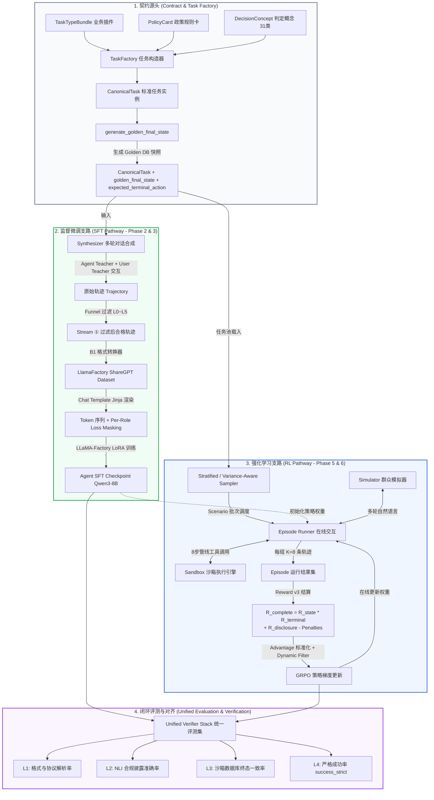
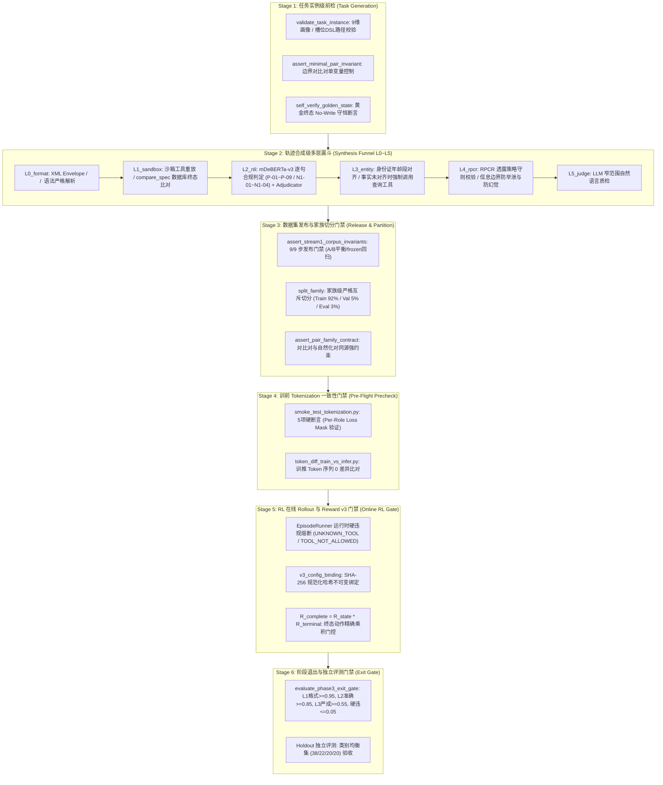
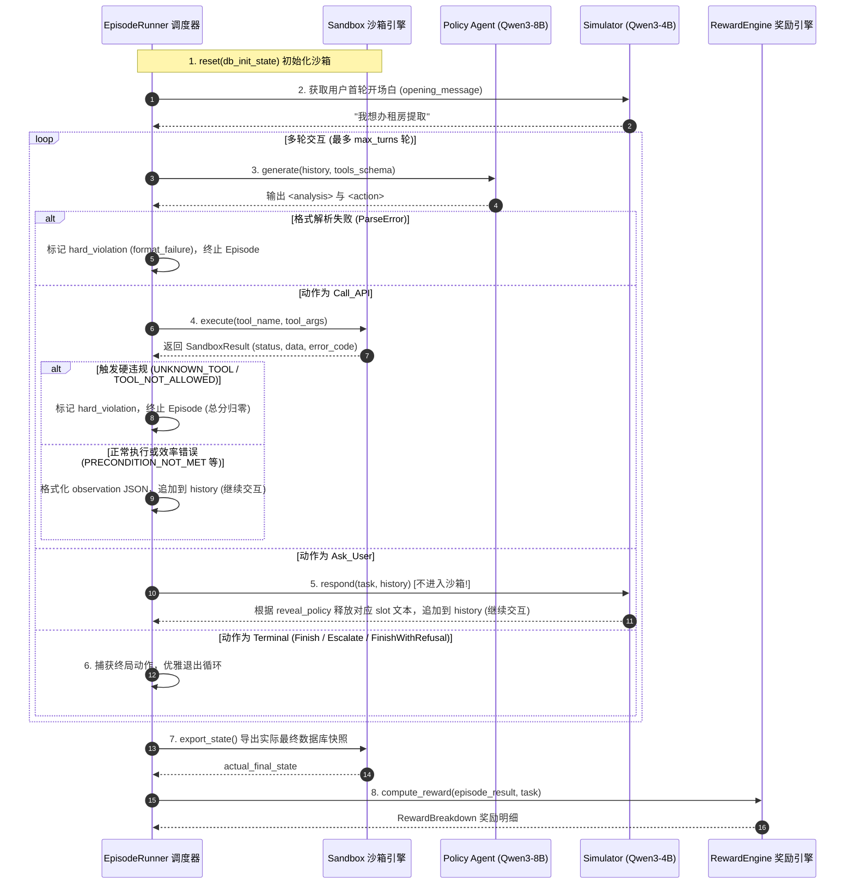
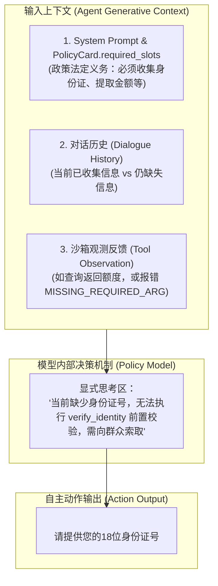
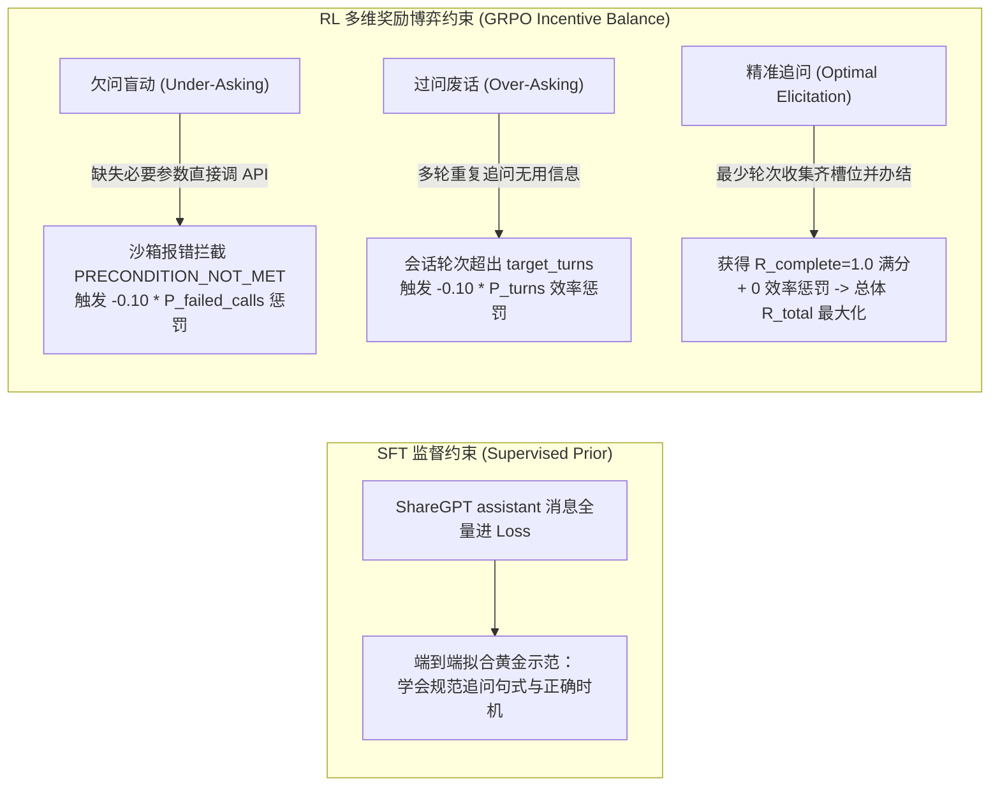
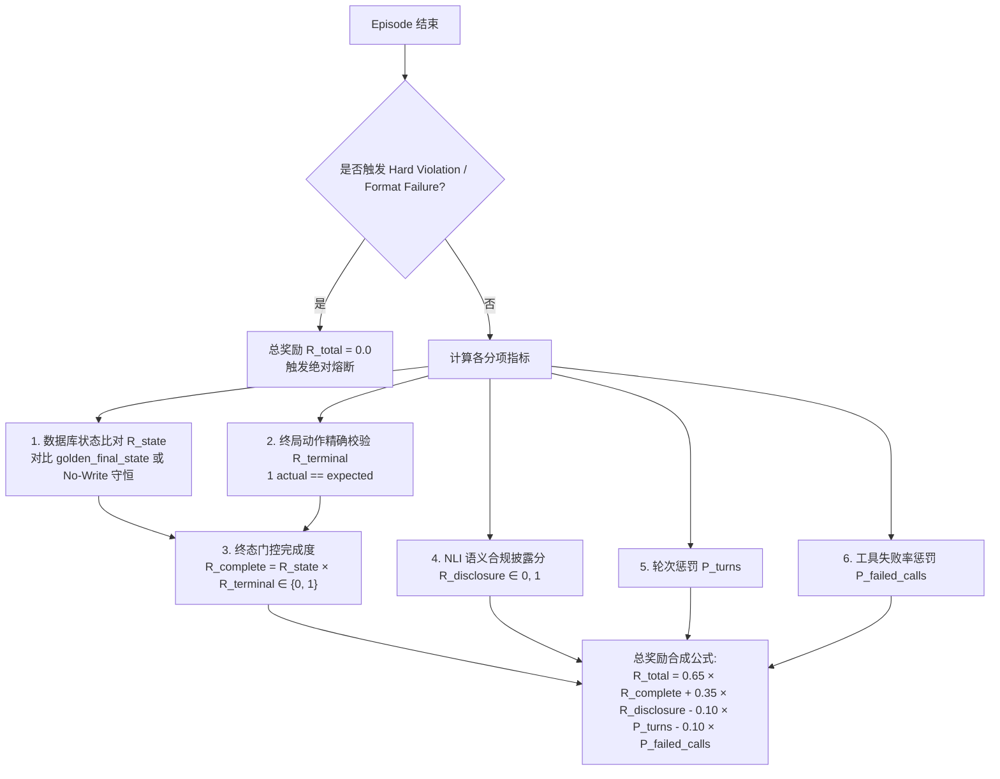
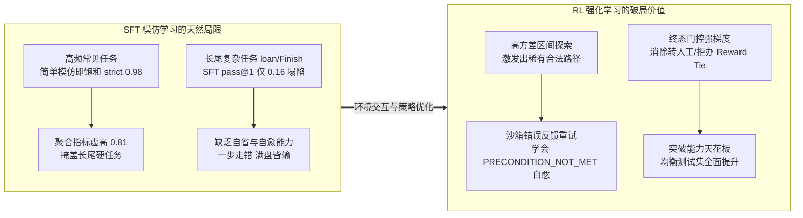

# 深入剖析 Agentic-Gov 数据全生命周期：从多流数据合成到 SFT 与 RL 强化学习双支路训练

> **导读**：在复杂政务“边聊边办”场景下，如何将一段业务政策规则转化为驱动大模型（LLM）精准决策、严守合规并具备自愈纠错能力的高质量训练数据？
> 本文深入剖析 `agentic-gov` 项目中**一条数据从任务实例定义（CanonicalTask）到分别进入 SFT（监督微调）与 RL（强化学习）训练并最终在评测层闭环**的全生命周期旅程。
> 本文将重点拆解：
> 1. **SFT 与 RL 双支路的分叉与汇合架构**；
> 2. **贯穿数据全生命周期的六级多层漏斗检验与质量门禁系统（Multi-Tier Verification Funnel & Quality Gates）**；
> 3. **ShareGPT 标准数据格式的角色规范、字段定义与 Chat Template / Loss Mask 映射**；
> 4. **核心机制辨析：Ask_User 不是沙盒信号，而是 Agent 的自主信息获取动作及其在 SFT/RL 中的流转**；
> 5. **基于 ChatML 的 Token 级模板化与 0 漂移训推一致性决策**；
> 6. **多轮 Rollout 状态机循环、GRPO 分组采样与 Reward v3 终态门控机制**；
> 7. **为什么强 SFT 基线下依然必须做 RL** 的底层工程洞察与设计哲学。
> 
> *注：关于沙箱环境内部的 8 步执行管线、主体感知状态账本（RuntimeFlags）及零副作用隔离机制，请交叉参阅姊妹篇文档 [agentic-gov-sandbox-architecture.md](file://.scratch/interview-deck/detail-notes/agentic-gov-sandbox-architecture.md)。*

---

## 1. 全景大图：CanonicalTask 的分叉、演进与闭环汇合

在 `agentic-gov` 系统中，所有训练与评测数据均源自一个不可变的声明式任务契约——**`CanonicalTask`（标准任务实例）**。以 `CanonicalTask` 为唯一真相源，系统向下分化出 **SFT 离线合成学习** 与 **RL 在线 Rollout 强化学习** 两条核心支路，最终在统一的**多维度可验证评测体系**中汇合。



### 两条支路的核心特征对照

| 维度 | SFT 监督微调支路 (`Phase 2/3`) | RL 强化学习支路 (`Phase 5/6 GRPO`) |
|---|---|---|
| **数据源形态** | 离线合成的静态完整对话轨迹（JSONL） | 策略模型与沙箱环境动态交互产生的 Rollout Episodes |
| **生成机制** | 双 Teacher LLM（Agent Teacher + User Teacher）受控对话 | Policy Agent（当前训练中模型）+ Simulator + 实时沙箱 |
| **优化目标** | 条件概率最大化（Cross-Entropy Token 预测损失） | 期望累积奖励最大化（GRPO Advantage 驱动策略梯度） |
| **Loss 作用域** | 仅作用于 Assistant 的 `<analysis>` 推理块与 `<action>` 动作块 | 整个 Rollout 轨迹生成的动作 Token 序列（加权优势值） |
| **错误暴露与自愈** | 仅包含正向示范（顺风局），几乎无中间出错恢复样本 | 真实经历错误调用与状态阻断（逆风局），学习自愈与退避 |
| **分布倾向** | 贴合业务真实频率分布（以常见任务为主，如租房提取占 48%） | 方差感知重加权（聚焦于可学习前沿，如贷款查询等 $p \approx 0.5$ 区域） |

---

## 2. 契约源头：CanonicalTask 与黄金终态派生

### 2.1 CanonicalTask 的数据结构

无论是离线合成对话，还是在线启动一个 RL Episode，起点都是统一的 `CanonicalTask` 实例（定义于 [`src/agentic_gov/schemas/task.py`](file:///Users/sunxichen/Projects/agentic-gov/src/agentic_gov/schemas/task.py)）：

```python
class CanonicalTask(BaseModel):
    task_id: str                              # 唯一任务 ID (如 task_rent_001)
    task_type: str                            # 事项类型 (如 withdrawal_for_rent)
    policy_id: str                            # 绑定的政策规则卡 ID (如 POL-HF-RENT-2026)
    policy_version: str                       # 政策版本号 (如 v1.0)
    db_init_state: DbSnapshot                 # 沙箱初始数据库快照 (各表初始行)
    policy_params: dict[str, Any]             # Task-Local 动态限额覆盖 (如 withdrawal_limit_rent: 30000.0)
    golden_final_state: DbSnapshot | None     # 沙箱期望黄金终态快照 (Oracle)
    metadata: TaskMetadata                    # 包含 expected_terminal_action, concept_primary 等
    persona: Persona                          # 用户人设画像 (耐受轮数、知识水平、情绪状态)
    hidden_truth: HiddenTruth                 # 用户真实客观事实账本 (身份证号、真实余额、租房合同)
    reveal_policy: dict[str, str]             # 信息透露策略 DSL (直接透露、追问后透露、拒绝透露)
    opening_message: str                      # 群众首轮开场自然语言表达
```

### 2.2 确定性黄金终态与终态动作派生机制

为了摆脱传统对话系统对“人工写死标准答案”的依赖，`agentic-gov` 实现了基于 **Golden Chain（标准操作脚本）** 的自动派生算法（位于 [`src/agentic_gov/task_factory/golden.py`](file:///Users/sunxichen/Projects/agentic-gov/src/agentic_gov/task_factory/golden.py)）。

1. **选择 Golden Chain**：根据 `task_type` 与 `boundary_config` 选择由 `ExpectedAction` 组成的确定性操作序列。
2. **沙箱虚拟执行**：以 `db_init_state` 启动沙箱，依次执行链中操作。
3. **遇到终态伪动作即中断并定性**：
   - 遇 `ESCALATE`：标记 `metadata.expected_terminal_action = "Escalate"`，终止执行；
   - 遇 `FINISH_WITH_REFUSAL`：标记 `metadata.expected_terminal_action = "FinishWithRefusal"`，终止执行；
   - 正常执行至真实 API 办结：标记 `metadata.expected_terminal_action = "Finish"`。
4. **导出快照与 No-Write 守恒验证**：
   - 导出沙箱快照并剔除影子表，赋给 `golden_final_state`；
   - **No-Write 守恒断言**：对于 `Escalate` 或 `FinishWithRefusal`，验证导出的快照必须与 `db_init_state` **绝对完全一致**（严防业务未办成却残留脏数据）。

---

## 3. 全生命周期多层漏斗检验与质量门禁系统（Multi-Tier Verification & Quality Gates）

在将复杂政务政策转化为训练数据的过程中，最危险的不是模型报错崩溃，而是**带有细微合规瑕疵、逻辑漏洞或格式变形的脏数据静默流入训练集**。

为了确保数据从生成源头到最终出模的 100% 可靠性，`agentic-gov` 构建了贯穿整个生命周期的**六级多层漏斗检验与质量门禁系统**：



### 六大阶段质量门禁详细规格表

| 门禁阶段 | 对应模块路径 | 输入载荷 | 校验内容与判定规则 | 失败/未通过处理 | 防御的故障与数据污染 |
|---|---|---|---|---|---|
| **① 任务实例级前检** | `src/agentic_gov/task_factory/` | 新构造的 `CanonicalTask` | 1. 校验 9 维画像枚举合法；<br/>2. 校验 `revealable_slots == set(reveal_policy.keys())`；<br/>3. 对比对执行 `assert_minimal_pair_invariant`（A/B 侧除目标边界槽位外完全同构）；<br/>4. `self_verify_golden_state` 校验转人工/拒办任务 No-Write 守恒。 | 抛出 `AssertionError` / `ValueError`，直接丢弃该任务生成，拒绝导出。 | 防止非法画像组合、字段早泄、非严格单变量对比对以及 Oracle 数据库快照损坏。 |
| **② 轨迹合成级漏斗** (`L0~L5`) | `src/agentic_gov/verifier/funnel.py` | Teacher LLM 生成的原始多轮对话 `Trajectory` | **L0 (格式)**：严格解析 `<analysis>` 与 `<action>` 结构；<br/>**L1 (沙箱)**：重放真实 API 调用，校验返回与 `golden_final_state`；<br/>**L2 (NLI)**：`mDeBERTa-v3` 校验法定告知项与防幻觉否定假设；<br/>**L3 (实体)**：校验身份证出生年份与年龄段匹配，未核身必须查库；<br/>**L4 (RPCR)**：校验用户模拟器严格服从 `reveal_policy` DSL 规则；<br/>**L5 (质检)**：自然语言文本合规质检。 | 任何一层失败均标记 `passed=False`，记录详细 `fail_reasons`，**整条轨迹剔除出池**。 | 杜绝 XML 格式错乱、沙箱状态不一致、法定告知遗漏、用户画像与身份证冲突以及用户模拟器抢先透露信息的“上帝视角”污染。 |
| **③ 发布与切分门禁** | `src/agentic_gov/release/` & `phase3/data/` | 候选 Stream ① 轨迹集 (4110 rows) | 1. 9/9 步 Release Gates 校验（A/B 对称性、无重复 ID）；<br/>2. `frozen_v2` 阈值回扫强制剔除 114 条边界样本；<br/>3. `split_family.py` 基于 `family_id` 执行 Train (92%) / Val (5%) / Eval Holdout (3%) 切分；<br/>4. `assert_pair_family_contract` 强制对比对落在同一切分。 | 抛出 `ReleaseContractError` 阻断发版；切分失败阻断 Manifest 生成。 | 防止数据泄漏（Data Contamination）、切分导致的对比对撕裂，以及未校准阈值下的脏数据流入 SFT。 |
| **④ 训前 Tokenization 门禁** | `phase3/llamafactory/` | ShareGPT 数据集 + Tokenizer | 1. `smoke_test_tokenization.py` 执行 5 项硬断言：User/Tool/System Label 必须全为 `-100`，Assistant Label 必须为有效 ID，`<analysis>` 完整保留；<br/>2. `token_diff_train_vs_infer.py` 比对 LLaMA-Factory 训练串与 vLLM 推理串字节级 Token 一致性。 | 5 项断言任一失败立即终止脚本（Exit code != 0），**禁止启动 GPU 训练**。 | 杜绝训练 Loss Mask 打错（把系统提示词或工具结果当作训练目标），以及训推 Token 不一致引发的推理崩溃。 |
| **⑤ 在线 RL 与 Reward 门禁** | `src/agentic_gov/reward/` & `src/agentic_gov/runtime/` | 在线 Rollout Episode 结果 | 1. `EpisodeRunner` 拦截未知工具与越权调用，标记 `hard_violation`；<br/>2. `validate_v3_config_binding` 校验 Reward 配置 SHA-256 哈希值；<br/>3. $R_{\text{complete}} = R_{\text{state}} \times R_{\text{terminal}}$ 终态门控匹配。 | 硬违规直接清零总奖（$R_{\text{total}} = 0.0$）；配置哈希不匹配直接拒绝计算；终态动作不匹配 $R_{\text{complete}}=0$。 | 防止 Agent 越权操作、Reward Hacking（靠不写库骗取无写入任务满分）及配置静默漂移。 |
| **⑥ 阶段退出评测门禁** | `phase3/eval/phase3_exit_gate.py` | L1/L2/L3 评测报告 | 1. L1 格式依从率 $\ge 0.95$；<br/>2. L2 动作预测准确率 $\ge 0.85$；<br/>3. L3 Scripted Replay 严格成功率 $\ge 0.55$；<br/>4. 硬违规率 $\le 0.05$。 | 判定 `passed=False`，返回退出码 2，**阻断进入下一研发阶段**。 | 保证只有真正具备高合规、高稳健性的模型 Checkpoint 才能作为下一阶段的基座。 |

#### 为什么需要全流程“多层级前置拦截”，而不是仅在最后跑一次 Eval？
1. **错误放大效应（Cascading Error Amplification）**：任务构造层的微小缺陷（如身份证号与年龄段冲突）会在合成阶段误导 Teacher LLM 产生看似合理实则违规的对话，最终在 SFT 阶段固化为模型的错误先验；
2. **GPU 算力止损（Compute Protection）**：在动辄数十 GPU 小时的 SFT/RL 训练前，通过轻量级前检（如 Tokenization Smoke Test）拦截问题，避免烧完卡后才发现 Loss Mask 全错；
3. **消除静默分布漂移（Silent Drift）**：模型在语法错误时会直接崩溃，但在合规性漏洞（如漏讲某条还款规则）时依然能顺畅输出。多层 NLI 与契约校验能捕获这类“表面正常、业务违规”的隐性缺陷。

---

## 4. SFT 支路：ShareGPT 标准格式、Chat Template 模板化与 Loss Mask 机制

### 4.1 对话合成流水线与四大训练子桶

在 Phase 2 中，系统通过双 Teacher LLM 在沙箱约束下进行多轮对抗仿真生成对话，经由多层漏斗检验后，沉淀出 **Stream ①** 训练集（共 3996 条通过全量回扫的合格样本）。

Stream ① 由四个互斥的训练子桶构成（参见 [`phase3/data/convert_stream1_to_llamafactory.py`](file:///Users/sunxichen/Projects/agentic-gov/phase3/data/convert_stream1_to_llamafactory.py)）：

```
Stream ① 训练集 (3996 rows)
├── agent_sft_main.jsonl              (3432 rows) ── 覆盖 31 类判定概念的标准正向路径
├── agent_sft_contrast_pairs.jsonl    ( 264 rows) ── 边界对比对 (A 侧办结 vs B 侧因单字段超标转人工/拒办)
├── agent_sft_naturalized_pairs.jsonl (  50 rows) ── 对比对的群众口语化与自然语言泛化变体
└── agent_sft_adversarial.jsonl       ( 250 rows) ── 提示词注入、诱导越权、越级操作的防御示范
```

#### 为什么 SFT 阶段以正样本为主？
SFT 的核心职责是**为模型建立冷启动格式契约与基础业务流模仿能力**。在 SFT 阶段，合成的轨迹均为遵循政策卡指引、各步骤精准无误的“顺风局”示范。若在 SFT 中引入过多随机调用失败与混乱重试，会导致模型在模仿学习时拟合错误的参数结构与调用前置依赖。**真正的错误自愈与逆风局探索能力，被明确设计留待 RL 阶段通过环境反馈去激发**。

---

### 4.2 ShareGPT 标准格式的角色定义与协议规范

在 `agentic-gov` 中，LLaMA-Factory 训练框架统一消费 **ShareGPT** 格式。数据通过 [`phase3/data/convert_stream1_to_llamafactory.py`](file:///Users/sunxichen/Projects/agentic-gov/phase3/data/convert_stream1_to_llamafactory.py) 进行格式转换。

#### 1. ShareGPT 行级数据结构定义

```json
{
  "sample_id": "traj_rent_pass_0042",
  "tools": "[{\"type\": \"function\", \"function\": {\"name\": \"verify_identity\", \"description\": \"核验办事群众身份...\", \"parameters\": {\"type\": \"object\", \"properties\": {\"id_number\": {\"type\": \"string\"}}, \"required\": [\"id_number\"]}}}, ...]",
  "messages": [
    {
      "role": "user",
      "content": "我想办理公积金租房提取。"
    },
    {
      "role": "assistant",
      "content": "<analysis>\n用户意图为租房提取，需要先核验身份与查询账户。\n</analysis>\n<action type=\"Call_API\" tool=\"verify_identity\">\n<args>\n{\"id_number\": \"310115199001011234\"}\n</args>\n<message>\n正在为您核验身份信息，请稍候。\n</message>\n</action>"
    },
    {
      "role": "observation",
      "content": "{\"status\": \"ok\", \"response\": {\"verified\": true, \"name\": \"张三\"}}"
    },
    {
      "role": "assistant",
      "content": "<analysis>\n身份核验已通过，接下来调用 check_eligibility 检查租房提取资格。\n</analysis>\n<action type=\"Call_API\" tool=\"check_eligibility\">\n<args>\n{\"id_number\": \"310115199001011234\", \"business_type\": \"rent\"}\n</args>\n</action>"
    },
    {
      "role": "observation",
      "content": "{\"status\": \"ok\", \"response\": {\"eligible\": true, \"max_amount\": 30000.0}}"
    },
    {
      "role": "assistant",
      "content": "<analysis>\n资格审查通过，账户状态正常。向用户追问本次提取的具体金额。\n</analysis>\n<action type=\"Ask_User\">\n您的租房提取资格已核验通过，本年度最高可提取 30,000 元。请问您本次需要提取多少金额？\n</action>"
    }
  ]
}
```

#### 2. LLaMA-Factory `dataset_info.json` 注册元数据

在 [`phase3/llamafactory/dataset_info.template.json`](file:///Users/sunxichen/Projects/agentic-gov/phase3/llamafactory/dataset_info.template.json) 中，数据集按如下契约注册：

```json
{
  "agent_sft_main": {
    "file_name": "agent_sft_main.jsonl",
    "formatting": "sharegpt",
    "columns": {
      "messages": "messages",
      "tools": "tools"
    },
    "tags": {
      "role_tag": "role",
      "content_tag": "content",
      "user_tag": "user",
      "assistant_tag": "assistant",
      "observation_tag": "observation"
    }
  }
}
```

#### 3. ShareGPT 角色语义与流转映射表

| ShareGPT 角色标识 | 对应业务实体 | 消息内容规范 | 是否参与 Loss 计算 | 映射至底层 ChatML 模板标记 |
|---|---|---|---|---|
| **`user`** | 真实办事群众 | 群众自然语言诉求（如 `"我想取公积金交房租"`） | ❌ **Masked (`-100`)** | `<|im_start|>user\n{content}<|im_end|>\n` |
| **`assistant`** | 政务智能体 Agent | 严格遵循 XML 封装：`<analysis>...</analysis>\n<action type="...">...</action>` | ✅ **Loss Bearing (Target IDs)** | `<|im_start|>assistant\n{content}<|im_end|>\n` |
| **`observation`** | 沙箱环境执行结果 | 标准化 JSON 字符串：`{"status": "ok", "response": {...}}` 或 `{"status": "error", "error_code": "..."}` | ❌ **Masked (`-100`)** | `<|im_start|>user\n<tool_response>\n{content}\n</tool_response><|im_end|>\n` |
| **`system`** *(隐式注入)* | 框架注入全局设定 | 通用系统设定 + PolicyCard + `<tools>...</tools>` 接口签名 | ❌ **Masked (`-100`)** | `<|im_start|>system\n{content}<|im_end|>\n` |

> 💡 **特别说明 1：`Ask_User` 在 ShareGPT 中的形态**
> 在 ShareGPT 样本中，`Ask_User` **绝不是一个独立的特殊 role**，而是作为 `assistant` 角色消息的 `content` 实体存在（例如 `<analysis>...</analysis>\n<action type="Ask_User">请提供身份证号</action>`）。
> 它在分词后**全量参与 Cross-Entropy 损失计算**，驱动模型在模仿学习中掌握“何时追问、追问什么槽位、使用何种礼貌话术”。

> 💡 **特别说明 2：Simulator SFT 的角色反转设计**
> 在训练群众模拟器（Simulator SFT，见 [`phase3/data/convert_stream2_to_llamafactory.py`](file:///Users/sunxichen/Projects/agentic-gov/phase3/data/convert_stream2_to_llamafactory.py)）时，由于 LLaMA-Factory 默认只对 `assistant_tag` 计算损失，系统巧妙地进行了角色定义对调：
> - `user_tag = "agent"`（政务 Agent 的发言作为输入上下文，打 `-100` Mask）；
> - `assistant_tag = "simulator"`（模拟群众的目标发言作为学习目标，计算 Loss）。
> 这样无需修改训练框架底层代码，即可复用同一套标准的 ShareGPT 训练管线。

---

### 4.3 Chat Template 模板化与 Token 级 Loss Mask 还原

在将多轮对话输入模型时，Chat Template（分词模板）负责将结构化消息拼装为底层 Token 序列。

#### 关键技术决策：为什么选择 `template: qwen` 纯 ChatML，而坚决避开 `qwen3` 原生 Thinking？

根据架构决策记录 [ADR: Qwen3 基座下采用 template: qwen 而非 qwen3](file:///Users/sunxichen/Projects/agentic-gov/research-proposal/adr-phase3-chat-template-qwen-not-qwen3.md)，项目做出了极具工程魄力的裁决：
1. **思考区冲突**：Agent 业务逻辑使用自定义的 `<analysis>...</analysis>` XML 标签承载思维链，这本身就是显式、受控的思考区；若引入 Qwen3 原生的 `<think>` 控制 Token，会导致两套机制并存并引发语义混乱；
2. **多轮历史丢失**：Qwen3 原生模板会在多轮渲染时剥离历史轮次的 `<think>` 块，这会彻底摧毁多轮会话中的推理上下文；
3. **消除训推漂移（Train-Infer Parity）**：使用纯 ChatML 结构（`<|im_start|>` / `<|im_end|>`），确保训练时与 vLLM/ART 推理时的 Token 序列 **0 差异**（实测表明，在推理端强加 `enable_thinking=False` 开关曾导致硬违规率从 $0.0$ 飙升至 $0.6875$）。

#### 完整渲染样貌（基于真实 Jinja 模板）

通过 [`phase3/llamafactory/chat_template.qwen_lf_equivalent.jinja`](file:///Users/sunxichen/Projects/agentic-gov/phase3/llamafactory/chat_template.qwen_lf_equivalent.jinja) 还原，一条样本在进入分词器后的完整文本与 Token 布局如下：

```text
<|im_start|>system
You are Qwen, created by Alibaba Cloud. You are a helpful assistant.

# Tools

You may call one or more functions to assist with the user query.

You are provided with function signatures within <tools></tools> XML tags:
<tools>
{"type": "function", "function": {"name": "verify_identity", "description": "核验办事群众身份...", "parameters": {"type": "object", "properties": {"id_number": {"type": "string", "description": "constraint: 18位身份证号"}}, "required": ["id_number"]}}}
{"type": "function", "function": {"name": "check_eligibility", "description": "审查提取资格与封存状态...", "parameters": {"type": "object", "properties": {"id_number": {"type": "string"}, "business_type": {"type": "string"}}, "required": ["id_number", "business_type"]}}}
{"type": "function", "function": {"name": "submit_rent_withdrawal", "description": "提交租房提取写操作...", "parameters": {"type": "object", "properties": {"id_number": {"type": "string"}, "amount": {"type": "number"}}, "required": ["id_number", "amount"]}}}
</tools>

For each function call, return a json object with function name and arguments within <tool_call></tool_call> XML tags:
<tool_call>
{"name": <function-name>, "arguments": <args-json-object>}
</tool_call><|im_end|>
<|im_start|>user
我想提取公积金交房租。<|im_end|>
<|im_start|>assistant
<analysis>
用户需要办理租房提取。当前尚未核验身份，按照 PolicyCard 前置条件约束，首步必须调用 verify_identity 进行核验。
</analysis>
<action type="Call_API" tool="verify_identity">
<args>
{"id_number": "310115199001011234"}
</args>
<message>
正在为您验证身份，请稍候。
</message>
</action><|im_end|>
<|im_start|>user
<tool_response>
{"status": "ok", "response": {"verified": true, "name": "张三"}}
</tool_response><|im_end|>
<|im_start|>assistant
<analysis>
身份已核验通过。接下来调用 check_eligibility 校验租房提取资格。
</analysis>
<action type="Call_API" tool="check_eligibility">
<args>
{"id_number": "310115199001011234", "business_type": "rent"}
</args>
</action><|im_end|>
<|im_start|>user
<tool_response>
{"status": "ok", "response": {"eligible": true, "balance": 45000.0, "annual_limit": 30000.0}}
</tool_response><|im_end|>
<|im_start|>assistant
<analysis>
资格校验通过，账户余额充足。需向用户告知可提取额度并追问提取金额。
</analysis>
<action type="Ask_User">
您的身份与租房提取资格已核验通过，当前账户可用余额为 45,000 元，本年度租房最高限额为 30,000 元。请问您计划提取多少金额？
</action><|im_end|>
```

#### Token 级别 Loss Masking（损失掩码）对照矩阵

为了让模型精准学习 Agent 的**决策思考与协议输出**，而绝不拟合环境或用户的输入，系统实施了极其严苛的 **Per-Role Loss Masking**（参见 [`phase3/llamafactory/smoke_test_tokenization.py:6-15`](file:///Users/sunxichen/Projects/agentic-gov/phase3/llamafactory/smoke_test_tokenization.py#L6-L15) 的 5 项硬性前检断言）：

```
[System & Tools Block]  ──> Label: -100 -100 -100 ... (全部 Mask，不计算 Loss)
[User Turn 1]           ──> Label: -100 -100 -100 ... (全部 Mask，不计算 Loss)
[Assistant Turn 1]      ──> Label: <analysis> ... </action><|im_end|> (参与 Loss 计算! Label != -100)
[Observation Turn 1]    ──> Label: -100 -100 -100 ... (全部 Mask，不计算 Loss)
[Assistant Turn 2]      ──> Label: <analysis> ... </action><|im_end|> (参与 Loss 计算! Label != -100)
```

| 文本区段 | 包含内容示例 | Token Label 设定 | 训练目标与理由 |
|---|---|---|---|
| **System Prompt** | `You are Qwen...` + 政策卡上下文 | `-100` (Masked) | 忽略通用提示词，不消耗模型参数容量去背诵系统设定。 |
| **Tools Schema** | `<tools>...{"name": "verify_identity"}...</tools>` | `-100` (Masked) | 接口定义是环境输入，模型只需理解并根据签名生成调用，严禁拟合定义本身。 |
| **User Turn** | `<|im_start|>user\n...<|im_end|>` | `-100` (Masked) | 群众自然语言输入属于外部条件，不计算生成损失。 |
| **Observation Turn** | `<tool_response>\n{"status": "ok"...}\n</tool_response>` | `-100` (Masked) | 沙箱执行结果是环境观测（Observation），模型只负责消费它，绝不可拟合。 |
| **Assistant Turn** | `<analysis>...</analysis>\n<action ...>...</action><|im_end|>` | **`Target Token IDs` (Unmasked)** | **核心训练目标**：不仅监督 `<action>` 的工具与参数，**同时全量监督 `<analysis>` 思考链**！确保模型掌握状态推理与决策意图。结尾的 `<|im_end|>` 同样参与 Loss，以学会自律停机。 |

---

## 5. RL 支路：在线 Rollout 循环、Ask_User 流转、分组采样与多级奖励结算

当 SFT Checkpoint 完成初始化后，模型进入 Phase 6 强化学习阶段。RL 支路不再依赖死板的静态文本，而是将模型置身于高拟真的交互沙箱中，展开多轮自主探索。

### 5.1 在线 Rollout Episode 循环机制

Rollout 由 `MultiTurnEpisodeRunner`（位于 [`src/agentic_gov/runtime/episode_runner.py`](file:///Users/sunxichen/Projects/agentic-gov/src/agentic_gov/runtime/episode_runner.py)）驱动。其单轮状态机推进过程如下：



---

### 5.2 核心机制辨析：Ask_User 不是沙盒信号，而是 Agent 的自主信息获取动作

在很多初学者的直觉中，常常误以为“沙箱报错告诉模型缺少参数后，沙箱发指令让模型去 Ask_User”。**这是一个严重的架构误解。**

#### 1. 决策机制：谁决定何时 `Ask_User`？

**结论：沙箱引擎是纯被动的工具执行器，绝不主动发出任何“向用户追问”的指令。`Ask_User` 是由 Policy Agent（LLM 模型自身）在每个生成步自主做出的决策动作。**



- **政策卡指引**：模型根据 System Prompt 中注入的 `PolicyCard.required_slots`（如 `required_slots=["id_number", "requested_amount"]`），提前知晓哪些槽位是业务必须项；
- **自省式推理**：在 `<analysis>` 标签内，模型通过上下文比对发现缺失必要槽位，于是主动生成 `<action type="Ask_User">`；
- **错误驱动自愈**：若模型前序误调了接口并收到沙箱返回的 `MISSING_REQUIRED_ARG` 或 `PRECONDITION_NOT_MET`，模型在看到报错 Observation 后，也能在下一步自省并退回一步生成 `Ask_User` 向用户补齐要素。

#### 2. Runtime 中的流转闭环与 Simulator 应答机制

在代码实现层面，`Ask_User` 在 [`src/agentic_gov/runtime/episode_runner.py:297-305`](file:///Users/sunxichen/Projects/agentic-gov/src/agentic_gov/runtime/episode_runner.py#L297-L305) 中的处理机制极其清晰：

```python
# episode_runner.py 中的执行分发逻辑
if action.action_type == "Ask_User":
    try:
        # 1. 绝对不调用 sandbox.execute！
        # 2. 异步将包含 Agent 问话的 full history 发送给群众模拟器
        user_text = await self.simulator.respond(task, history)
    except ReplayDiverged:
        return self._finish(task, turns, "divergent", {"divergent": True})
        
    # 3. 将群众自然语言应答包装为 UserTurn 追加到轨迹中
    turns.append(UserTurn(turn_index=turn_index, content=user_text))
    history.append({"role": "user", "content": user_text})
    turn_index += 1
    continue  # 继续下一轮循环，等待 Agent 读取该回答
```

##### 群众模拟器如何根据 `reveal_policy` 决定释放哪些信息？
群众模拟器（`FrozenSimulatorBackend` 或 `DeepSeekMockSimulator`）接收到 `task.hidden_truth`（真实客观事实账本）与 `task.reveal_policy`（信息释放策略 DSL）。
模拟器根据预置的 **5 条 DSL 规则**（定义于 [`src/agentic_gov/task_factory/reveal.py`](file:///Users/sunxichen/Projects/agentic-gov/src/agentic_gov/task_factory/reveal.py)）受控应答：
- **`when_requested`**：只有当 Agent 的 `Ask_User` 明确问及该槽位时，模拟器才从 `hidden_truth` 中取出真实值（如身份证号）回复；
- **`when_requested_after_delay`**：首次被问及会犹豫或提供模糊信息，直到再次追问或达到耐受轮数后才提供；
- **`refuse`**：明确拒绝提供该槽位信息（引导 Agent 走向 `FinishWithRefusal` 或 `Escalate`）；
- **`never`**：绝对保密，任何情况下严禁透露（模拟群众的敏感底线）；
- **`always`**：开场首轮主动交代（如开场白自带）。

#### 3. 本质区别对照：`Ask_User` vs `Call_API`

| 比较维度 | 交互动作 `Ask_User` | 工具调用动作 `Call_API` |
|---|---|---|
| **交互目标实体** | **办事群众（Citizen / User Simulator）** | **沙箱通用执行引擎（Sandbox Engine）** |
| **是否进入沙箱** | ❌ **完全不进入** `sandbox.execute` | ✅ 穿透 **8 步安全执行管线** |
| **数据库影响** | ❌ **0 写入、0 修改** | ✅ 通过 Handler 读写 `Database` 表格 |
| **状态账本影响** | ❌ 不修改 `RuntimeFlags` | ✅ 执行成功置位 `postconditions` 标记 |
| **作用空间** | **对话与认知信息空间（Epistemic State）**<br/>*将私有真实事实（hidden_truth）引渡至公共对话上下文* | **环境物理实体状态空间（Physical State）**<br/>*扣减资金账户余额、生成业务申请单据* |
| **载荷格式** | 纯中文自然语言追问文本（无 `<args>` 标签） | 携带 `tool="..."` 属性及 `<args>JSON</args>` 结构化入参 |

#### 4. SFT 与 RL 中对 `Ask_User` 的双重约束机制

系统如何确保模型“该问时精准追问、不该问时不问废话、遇到拒绝及时分流”？



1. **SFT 格式拟合**：在 SFT 阶段，`Ask_User` 是正向示范轨迹的关键节点，模型通过 Cross-Entropy 损失学习在特定业务上下文下触发追问；
2. **RL 欠问惩罚（Under-Asking Defense）**：若模型急于办结，在没有身份证号时盲目调用 `verify_identity`，沙箱在第 3 步立即返回 `MISSING_REQUIRED_ARG`，直接计入 $P_{\text{failed\_calls}}$ 失败调用惩罚（扣减总奖）；
3. **RL 过问惩罚（Over-Asking / Turn Penalty）**：若模型反反复复问废话，导致交互轮数超过该事项的标准基准轮数（`target_turns`），会直接被扣除 $P_{\text{turns}}$ 效率分；
4. **评测层越界防线（L4 RPCR）**：在评测中，若模型对设定为 `never` 的槽位死缠烂打，会被 L4 透露策略合规器判定为违规。

#### 5. Mini-Episode 微型交互追踪示例

以下展示一个真实的租房提取任务中，`Ask_User` 与 `Call_API` 如何在 EpisodeRunner 调度下交替推进：

```
[Turn 0 | User Opening]:
"我想提取公积金交房租。"

[Turn 1 | Agent Action (Ask_User)]:
<analysis>
用户需要办理租房提取。当前尚未核验身份，且未提供身份证号与提取金额。需向用户索取身份证号。
</analysis>
<action type="Ask_User">
您好，办理租房提取需要先核验您的身份信息。请您提供本人 18 位身份证号码。
</action>
--> Runner 分发: 不进沙箱，直接交由 Simulator 处理。

[Turn 2 | Simulator Reply (基于 reveal_policy="when_requested")]:
"我的身份证号是 310115199001011234。"

[Turn 3 | Agent Action (Call_API)]:
<analysis>
已获得身份证号，调用 verify_identity 完成核身。
</analysis>
<action type="Call_API" tool="verify_identity">
<args>
{"id_number": "310115199001011234"}
</args>
</action>
--> Runner 分发: 进入沙箱 8 步管线，执行成功，设置 RuntimeFlags("identity_verified")，返回 Observation。

[Turn 4 | Tool Observation]:
{"status": "ok", "response": {"verified": true, "name": "张三"}}
```

---

### 5.3 GRPO 分组采样与方差感知机制

项目采用 **GRPO（Group Relative Policy Optimization）** 算法进行策略优化。

#### 组内优势度计算
对于同一个任务场景 $q$，Policy 采样生成 $K$ 条独立的 Rollout 轨迹 $\{o_1, o_2, \dots, o_K\}$（默认 $K=8$）。
对每条轨迹计算总奖励 $R_i$，则其对应的优势值（Advantage）定义为：

$$A_i = \frac{R_i - \text{mean}(\{R_1, \dots, R_K\})}{\text{std}(\{R_1, \dots, R_K\}) + \epsilon}$$

#### 动态过滤（Dynamic Group Filtering）
如果同一组内 $K$ 条轨迹的奖励完全相同（例如全部取得满分 $R_i = 1.0$ 或全部硬违规 $R_i = 0.0$），则样本标准差 $\text{std} = 0$。**此时该组数据无法提供任何相对梯度方向，GRPO 将直接丢弃该组（Drop）**。

#### 采样前置 Bug 的深刻教训（Drop Rate ~0.94 的破局）
在 Phase 6 早期实验中，曾出现组丢弃率高达 94.1% 的险情。团队一度误以为是“模型在全数据集上奖励饱和”，但经深入代码排查发现：
1. **采样顺序 Bug**：采样器为了保证困难样本占比，将已饱和的 `loan + Escalate` 简单转人工任务排在了任务池最前端；
2. **顺序消费**：训练调度器连续消费了数十步完全相同的简单饱和任务，导致组内方差恒为 0；
3. **破局修法**：实现了 **Variance-Aware Mixture Sampler（方差感知混合采样器）**，基于历史实测组内方差动态过采样处于可提升前沿（通过率 $p \approx 0.5$ 处方差最大、学习效率最高）的任务桶，同时避开死地板（$p \approx 0$）与饱和区（$p \approx 1$）。

---

### 5.4 Reward v3 核心公式与终态门控机制

在政务场景下，奖励函数必须兼顾**业务办结确定性**、**合规红线零容忍**与**服务效率**。经过 Phase 5 到 Phase 6 的演进，系统最终确立了 **Reward v3（Terminal-Gated Outcome）** 架构（参见 [`src/agentic_gov/reward/aggregate.py`](file:///Users/sunxichen/Projects/agentic-gov/src/agentic_gov/reward/aggregate.py) 与 [ADR Reward v3](file:///Users/sunxichen/Projects/agentic-gov/research-proposal/adr-phase6-grpo-reward-v3-terminal-gated-outcome.md)）：



#### 各分项奖励的数学定义与计算逻辑

1. **状态正确性（$R_{\text{state}} \in \{0, 1\}$）**：
   - 根据 `task.metadata.expected_terminal_action` 提取 `compare_spec`；
   - 若 `compare_spec` 非空：逐字段确定性比对 `actual_final_state` 与 `golden_final_state`（全部匹配得 1，否则得 0）；
   - 若 `compare_spec` 为空（转人工/拒办任务）：校验 `actual_final_state` 是否与 `db_init_state` 严格相等（**No-Write 守恒**）。
   - *比对前强制调用 `strip_runtime_policy_table` 剥离沙箱专用的影子表。*

2. **终态动作门控（$R_{\text{terminal}} \in \{0, 1\}$）**：
   $$\mathbb{I}(\text{actual\_terminal\_action} == \text{expected\_terminal\_action})$$
   由底层协议强制核验。若动作丢失、格式解析异常或类型不匹配，立即判 0（**Fail-Closed** 原则）。

3. **终态门控完成度（$R_{\text{complete}}$）**：
   $$R_{\text{complete}} = R_{\text{state}} \times R_{\text{terminal}}$$
   > **为什么必须乘积门控？**
   > 在转人工（`Escalate`）或合规拒办（`FinishWithRefusal`）任务中，数据库本身不应发生任何写入。如果仅比对数据库，模型即使发生严重幻觉直接调用 `Finish` 假装办结，数据库也与初始状态完全一致（$R_{\text{state}} = 1$）。引入 $R_{\text{terminal}}$ 门控后，一旦模型选错终局动作，$R_{\text{complete}}$ **瞬间归零**，彻底解决了无写入任务中不同终局动作产生“奖励打平（Reward Tie）”的致命缺陷！

4. **合规披露分（$R_{\text{disclosure}} \in [0, 1]$）**：
   通过离线部署的 `mDeBERTa-v3` NLI 模型逐句扫描 Assistant 消息，结合 DeepSeek LLM 仲裁兜底，判定政策规定的法定告知条款（如到账时效、材料清单、扣款规则）是否完整准确传达给群众。

5. **效率惩罚项（$P_{\text{turns}}$ 与 $P_{\text{failed\_calls}}$）**：
   $$P_{\text{turns}} = \text{clamp01}\left(\frac{\max(0, \text{实际轮数} - \text{目标基准轮数})}{\text{目标基准轮数}}\right)$$
   $$P_{\text{failed\_calls}} = \frac{\text{触发可恢复错误的工具调用数}}{\text{总工具调用数}}$$

6. **硬违规绝对归零门（Hard Zero Gate）**：
   若模型触发越权调用（`TOOL_NOT_ALLOWED`）、伪造不存在工具（`UNKNOWN_TOOL`）或发生无法解析的协议格式崩溃，整个 Episode 总奖励强制清零：
   $$R_{\text{total}} = 0.0$$

---

## 6. 深度辨析：SFT 与 RL 的关系、演进协同与分布异构

在很多传统对话项目中，人们常常存有疑问：“既然 SFT 验证集上的准确率已经很高了，为什么还要大费周章上 RL？” `agentic-gov` 项目给出了极其扎实的工程与理论回答。

### 6.1 为什么 SFT 之后必须做 RL？



1. **聚合指标的“双峰假象”**：
   SFT 在容易模仿的高频任务（如公积金余额查询、常规租房提取）上迅速饱和（成功率 $\ge 0.98$），把聚合均值拉高至 0.81；但在需要复杂消歧、动态分支判断的长尾任务（如贷款结清与多抵押贷款还款 `loan_repayment_query / Finish`）上，SFT 的 pass@1 仅有 **0.16**！模仿学习在逻辑复杂的长尾场景必然塌陷。
2. **探索与自愈纠错（Self-Healing）能力**：
   SFT 只见过完美的教师示范轨迹。在真实交互中，一旦群众提供了模糊信息导致工具报错（如 `PRECONDITION_NOT_MET`），SFT 模型极易陷入死循环或胡言乱语；而 RL 模型在沙箱中经历了成千上万次报错与惩罚，真正学会了“看到参数缺失报错后退回一步追问群众”的**动态自愈能力**。
3. **稀有动作的梯度唤醒**：
   合规拒办（`FinishWithRefusal`）与转人工（`Escalate`）在数据集中属于低频样本。通过 RL 的终态门控奖励，模型在探索中一旦命中正确动作就能获得巨大的相对优势（Advantage），从而在参数空间中刻下清晰的决策分界线。

### 6.2 评估哲学：为什么看 pass@k 与硬违规地板，而不看 pass@1？

在评判 SFT 模型是否准备好进入 RL（RL-Readiness）时，**pass@1 是一个极具误导性的点估计**：
- 如果一个任务 pass@1 = 0.16，直觉可能认为“起点太低学不动”；
- 但如果在采样 $K=8$ 次时 pass@8 显著大于 0，说明模型**具备偶尔做对的能力，组内存在巨大方差**，这正是 GRPO 学得最快的黄金区间！
- 真正阻碍 RL 训练的是：**pass@k $\approx 0$（组内全错，无正例可强化）** 以及 **硬违规率过高（全被 Hard Zero 门截断为平的零分）**。

### 6.3 训练数据分布的本质异构：频率镜像 vs 方差加权

| 数据集特性 | SFT 阶段数据分布 | RL 阶段采样分布 |
|---|---|---|
| **分布构建哲学** | **现实频率镜像（Frequency Mirror）**：忠实反映政务业务发生的真实概率（租房 48%、购房 13%、贷款 28%、查询 10%）。 | **方差最大化导向（Variance-Oriented）**：脱离静态频率，依据强化学习信号强度动态加权。 |
| **高频简单任务处理** | 占据绝大多数比例，用于稳固基础语言理解与调用语法。 | **大幅降采样 / 动态剔除**：由于组内方差为 0 会被 GRPO 丢弃，必须降低采样率以节约 GPU Rollout 算力。 |
| **长尾困难任务处理** | 占比较低，模型仅建立基础印象。 | **显著过采样（Oversampling）**：对成功率在 30%~60% 之间的高方差前沿任务进行高密度采样，集中算力攻坚。 |

---

## 7. Agent 终态动作（Terminal Actions）的协议表达与评测闭环

政务业务不能无限期对话，必须有明确、严谨的业务终局。系统定义了三大合法终局动作枚举：

```python
class ExpectedTerminalAction(str, Enum):
    FINISH = "Finish"                           # 业务成功办结 (正常写入数据库)
    ESCALATE = "Escalate"                       # 转人工审批/线下网点 (合规无写入)
    FINISH_WITH_REFUSAL = "FinishWithRefusal"   # 政策明确禁止/不符条件拒办 (合规无写入)
```

### 7.1 输出层的协议表达规范

模型在决定收尾时，必须输出对应的 `<action>` 标签，并在 body 中包含符合法定要求的自然语言告知文本：

```xml
<!-- 场景 1: 正常办结 (Finish) -->
<analysis>
提取申请已成功提交，申请单号与新余额已由沙箱返回。业务已办结，向用户告知办结时效与到账短信提示。
</analysis>
<action type="Finish">
您的公积金租房提取业务已办理成功！本次提取金额 20,000.00 元，预计将在 1-3 个工作日内转入您尾号 8888 的银行卡中，请注意查收银行短信。
</action>

<!-- 场景 2: 异常转人工 (Escalate) -->
<analysis>
资格审查接口返回 ELIGIBILITY_ACCOUNT_FROZEN (账户处于司法冻结状态)。依据 PolicyCard 第 4 条，必须立即转人工线下核实，严禁继续提交提取。
</analysis>
<action type="Escalate">
非常抱歉，系统查询到您的公积金账户当前处于特殊冻结状态，无法通过线上快捷办理。我已为您将该业务转接至人工政务专员，请您携带身份证件前往就近公积金线下服务大厅核实处理。
</action>

<!-- 场景 3: 合规拒办 (FinishWithRefusal) -->
<analysis>
用户要求提取公积金用于偿还消费贷，且拒绝调整用途。根据公积金管理条例，该用途明确属于禁止提取范围，执行合规拒办。
</analysis>
<action type="FinishWithRefusal">
根据《住房公积金管理条例》规定，公积金仅可用于购买自住住房、偿还房贷或支付房租等法定住房消费，严禁用于偿还个人消费贷款或投资。本次提取申请无法受理，感谢您的理解。
</action>
```

### 7.2 评测层解析、混淆矩阵与严格成功判定

在评测与奖励计算时，系统通过 `parse_analysis_action` 提取 `action_type`，并通过 [`src/agentic_gov/reward/terminal.py`](file:///Users/sunxichen/Projects/agentic-gov/src/agentic_gov/reward/terminal.py) 构建 $3 \times 3$ 终态混淆矩阵：

$$\begin{pmatrix}
\text{Finish} \to \text{Finish} & \text{Finish} \to \text{Escalate} & \text{Finish} \to \text{Refusal} \\
\text{Escalate} \to \text{Finish} & \text{Escalate} \to \text{Escalate} & \text{Escalate} \to \text{Refusal} \\
\text{Refusal} \to \text{Finish} & \text{Refusal} \to \text{Escalate} & \text{Refusal} \to \text{Refusal}
\end{pmatrix}$$

#### 最终严格成功指标（`success_strict_v3`）
一个 Episode 只有在以下 **6 项指标全部通过** 的情况下，才被判定为严格成功（`True`）：
1. **$R_{\text{state}} == 1.0$**：数据库终态完全匹配（或 No-Write 完全守恒）；
2. **$R_{\text{terminal}} == 1.0$**：实际终局动作与预期终局动作 100% 精确匹配；
3. **$R_{\text{complete}} == 1.0$**：门控合成完成度满分；
4. **$R_{\text{disclosure}} == 1.0$**：法定告知要素经 NLI 判定无一遗漏；
5. **$\text{hard\_violation} == \text{False}$**：无任何越权或非法调用；
6. **$\text{format\_failure} == \text{False}$**：协议与 XML 封装完全合规。

---

## 8. 架构设计哲学与复盘启示（Engineering Takeaways）

在实现 `agentic-gov` 数据全生命周期与双支路训练体系的过程中，我们沉淀出以下四条核心设计法则：

### 1. 训推一致性是 Agentic 系统的第一生命线（Token-Level Parity）
不要将 Chat Template 视作无关紧要的文本格式化工具。在包含 Tool Call 与结构化 Reasoning 的 Agent 体系中，**训练时的 Token 序列必须与推理端完全一模一样**。避开基座原生复杂的动态 Thinking 机制、采用干净透明的 ChatML 协议，能够极大降低跨框架部署（如 vLLM / ART）的分布漂移风险。

### 2. 状态验证与动作门控乘积闭环（Structural Gate > Loose Matching）
不能单独依赖“数据库状态”去评判对话智能体。对于无需修改数据库的防御性动作（转人工/拒办），必须引入**确定性终态动作门控（$R_{\text{complete}} = R_{\text{state}} \times R_{\text{terminal}}$）**，从数学机制上杜绝模型靠“什么都不做”窃取状态满分的 Reward Hacking。

### 3. SFT 筑基模仿，RL 破界探索（Imitation for Base, RL for Frontier）
SFT 与 RL 各司其职：SFT 负责解决 80% 的通用格式规范与高频顺风局流程，建立良好的冷启动先验；RL 负责攻克 20% 的硬核长尾、边界冲突与逆风局错误自愈。判别 RL-Readiness 要看 pass@k 与硬违规地板，而非单次的 pass@1。

### 4. 训练分布与评测分布必须严格解耦与分层治理
在训练端，SFT 依赖反映真实世界的频率分布，而 RL 则需要方差感知（Variance-Aware）的动态重加权采样；在评测端，必须依赖**分桶评估、冻结且类别均衡的独立测试集（Holdout）**，绝不能被单一的聚合均值所蒙蔽。
