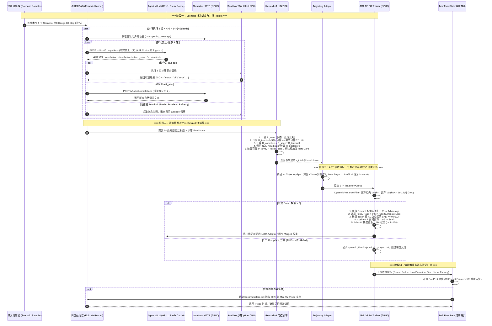
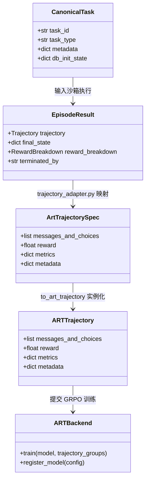

# 深入复盘 Agentic-Gov 强化学习训练：从真实数据分布、GRPO 链路、系统工程踩坑到 ART 框架适配与数据自洽性复盘

> **导读**：在复杂多轮政务智能体（Agent）系统中，强化学习（RL）如何真正发挥效用？教科书上的强化学习往往只描述优美的数学公式（如 GRPO 组内优势、PPO 裁剪比率、KL 散度惩罚），但在实际工程落地中，算法工程师面临的往往是极其残酷的现实：**“为什么 SFT 基线很高但 RL 训不动？”、“为什么训练集通过率上升但测试集全军覆没？”、“为什么 Serving 吞吐会在一个 Step 后暴跌 6 倍？”、“为什么错误的终态动作能拿到满分奖励？”**
> 
> 本文基于 `agentic-gov` 项目中数十篇真实实验笔记（Experiment Notes 010–031）、架构决策记录（ADR）以及远端真实训练日志，**全景式还原这一段真实的 RL 训练史**。
> 
> 本文将系统回答以下核心命题：
> 1. **P5/Phase 6 真实数据分布与前期规划的偏差**：详查 960 候选池、390 K8 测试池、Range-80 训练集与 C0→C15 课表的真实分布，揭示“稀有动作饥饿”与“单族化倾斜”的底层真相；
> 2. **真实 RL 训练链路**：从 SFT checkpoint 冷启动、双卡硬件拓扑、HTTP Simulator 与 NLI 裁决服务解耦、多轮异步 Rollout、Reward v3 门控结算、ART Trajectory 适配、动态方差过滤，到 GRPO 梯度更新与运行时熔断哨兵的完整端到端链路；
> 3. **四大工程与科学转折复盘**：
>    - 吞吐瓶颈与 World A/B 判定、4B 模型适配、LoRA Serving 在 Triton JIT 内核下的 6x 性能衰退与 Async PipelineTrainer 失败教训；
>    - Reward 从 v1/v2（无写入任务存在 Terminal Tie 导致梯度归零）向 v3（Terminal-Gated Outcome 终态门控）的必然演进；
>    - Sampler 从前置聚集（Front-loading）到方差感知混合采样（Variance-Aware Mixture Sampler）与 Exact Manifest 课表锁定；
>    - P5（C0→C15）“有成效（+7.8pp）但测出零迁移（0/373）”的重大反转——揭露生成端“标签-证据断裂（Entailment Failure）”并确立不变式（Invariant）防线；
> 4. **ART (Agent Reinforcement Trainer) 专章**：剖析 OpenPipe ART 框架的核心抽象、设计哲学及其在政务 Agent 中的无缝适配与底层改造；
> 5. **全流程实验时间线表与 2 分钟面试回答极简模板**。

---

## 1. 全景大图：RL Training 整体架构与系统拓扑

在 `agentic-gov` 项目中，RL 训练不是孤立的单机单卡单进程脚本，而是一个由 **Agent Policy**、**Frozen Simulator**、**Sandbox Engine**、**Reward Pipeline**、**ART GRPO Trainer** 与 **Release Gate** 共同构成的分布式实时交互系统。

### 1.1 总体架构与数据流向

```mermaid
flowchart TD
    subgraph Data_Layer["1. 数据层与采样调度 (Data & Sampler Layer)"]
        Pool[RL Task Pool / Range-80 任务池] --> Sampler[Scenario Sampler / Exact Manifest Scheduler]
        Sampler -->|每步调度 8 个 Scenario 组| Batch[Train Batch: 8 Task Groups]
    end

    subgraph Serving_Layer["2. 双卡专用推理拓扑 (Dedicated 2-GPU Serving Layer)"]
        subgraph GPU1["GPU 1: Agent vLLM Serving (48GB)"]
            AgentVLLM[Agent Policy vLLM Server<br/>Qwen3-4B / 8B + LoRA rank 128<br/>Prefix Caching 94%]
        end
        subgraph GPU0["GPU 0: Trainer & Aux Services (48GB)"]
            SimHTTP[Frozen Simulator HTTP Server<br/>Qwen3-4B SFT ckpt-2070<br/>Vllm HTTP API]
            NLIService[Local NLI Service<br/>mDeBERTa-v3-base-mnli-xnli]
            ARTTrainer[ART GRPO Trainer<br/>Loss, Advantage, Optimizer]
        end
        subgraph Cloud["外部仲裁服务 (Cloud LLM)"]
            Adjudicator[DeepSeek-V4-Flash<br/>Live Disclosure / Quality Judge]
        end
    end

    subgraph Rollout_Sandbox["3. 多轮 Rollout 与沙箱执行 (Rollout & Sandbox Layer)"]
        Batch --> Runner[Episode Runner / gather_trajectory_groups]
        Runner <-->|OpenAI API 获取 Choice 带 logprobs| AgentVLLM
        Runner <-->|多轮对话协议 (HTTP)| SimHTTP
        Runner <-->|8步事务管线 / 本地无副作用执行| Sandbox[Sandbox 沙箱引擎<br/>Postgres/SQLite 状态变更]
        Runner -->|每组 K=8 次 Rollout<br/>生成完整交互轨迹| RawEpisodes[64 条 Episode 原始轨迹]
    end

    subgraph Reward_Layer["4. 多维度奖励结算 (Reward Pipeline - Reward v3)"]
        RawEpisodes --> StateVer[Deterministic State Verifier -> R_state]
        RawEpisodes --> TermVer[Terminal Action Verifier -> R_terminal]
        RawEpisodes --> NLIVer[NLI / Adjudicator -> R_disclosure]
        StateVer & TermVer --> Gate[Terminal-Gated Outcome: R_complete = R_state * R_terminal]
        Gate & NLIVer --> RTotal[R_total = 0.65*R_comp + 0.35*R_disc - 0.10*P_turns - 0.10*P_failed<br/>(Hard Violation 触发则 R_total = 0.0)]
    end

    subgraph ART_Train_Layer["5. 轨迹适配与 GRPO 优化 (ART Adapter & GRPO Update)"]
        RTotal --> Adapter[trajectory_adapter.py: to_art_trajectory<br/>保留 Choice Token Mask, User/Tool Mask=0]
        Adapter --> DynFilter[Dynamic Variance Filter<br/>过滤 Var(R)=0 的全对/全错 Group]
        DynFilter -->|保留有梯度的有效 Groups| ARTTrainer
        ARTTrainer -->|GRPO Clip Loss + KL Penalty<br/>Cosine LR 1e-5 -> 3e-6| OptimizerStep[LoRA 权重梯度更新]
        OptimizerStep -->|热加载 Adapter / Merged 权重| AgentVLLM
    end

    subgraph Gate_Monitor["6. 运行时哨兵与发布门禁 (Guard & Release Gate)"]
        OptimizerStep --> Fuse[TrainFuseState 熔断哨兵<br/>监控 Format Failure / Hard Violation]
        Fuse -.->|触发告警时启动| MiniVal[Confirm-before-kill: 50 任务 Mini-Val Probe]
        OptimizerStep --> Checkpoint[Saved Checkpoint C0 -> C15]
        Checkpoint --> EvalGate[Release Gate G1-G4 / hard_val_v1_prime]
    end
```

### 1.2 硬件拓扑与服务隔离设计

在实际算力配置中（以 AutoDL 远端服务器 **2× NVIDIA RTX 4090 / A6000 48GB** 为基准），系统采用了严格的**非争用分离拓扑（Dedicated Topology）**：

| 设备 / 节点 | 运行服务 / 进程 | 资源占用 / 参数 | 职责与通信边界 |
|---|---|---|---|
| **GPU 1** | **Agent Policy vLLM Server** | 显存占用约 28–34 GB，`gpu_memory_utilization=0.85` | 专门支撑智能体多轮并发推理；开启 Prefix Caching（命中率稳定在 94%~95%）；通过 OpenAI 兼容 HTTP 接口吐出带 `logprobs` 的 Token。 |
| **GPU 0** | **Frozen Simulator HTTP Server** | 显存占用约 12–16 GB，`SIM_GPU_UTIL=0.25~0.40` | 运行冻结的群众模拟器（Qwen3-4B SFT ckpt-2070），作为独立 HTTP 服务供 Rollout 调用，彻底解耦 Agent 与 Simulator 的上下文。 |
| **GPU 0** | **Local NLI Service** | 显存占用约 2–4 GB | 运行 `mDeBERTa-v3-base-mnli-xnli`，处理本地离线自然语言蕴含推理，评估告知项（`R_disclosure`）。 |
| **GPU 0** | **ART GRPO Trainer** | 动态显存（约 18–24 GB） | 接收过滤后的有效 Trajectory Groups，在 PyTorch / Unsloth 后端执行 GRPO Loss 梯度反传与 AdamW 优化。 |
| **外部 API** | **DeepSeek-V4-Flash** | 限制并发 `ADJUDICATOR_MAX_CONCURRENCY=8` | 充当高阶披露与质量仲裁员（Adjudicator），在训练中对复杂告知语义进行打分。 |
| **Host CPU** | **Orchestrator & Sandbox** | Python 3.12 异步事件循环 | 执行 `gather_trajectory_groups`、沙箱 8 步事务管线、内存 DB 快照比对与文件 Hash 审计。 |

---

## 2. P5/Phase 6 数据分布与前期规划的偏差全景

在面试与技术复盘中，**“P5 取得了一些成效，但训练数据分布到底如何？与原规划有何偏差？”** 是最能体现工程师对数据血缘（Data Lineage）和数据自洽性把控力的核心问题。

### 2.1 数据漏斗的八层结构（从 1026 准备池到 Range-80）

经过对仓库内机器可读清单（`classification_report.json`、`c15_rek8_candidate_skeleton.jsonl`、Note 029）的完整审计，Phase 6 的数据流并非单一数据集，而是经历了严密的八层分级漏斗：

```text
1. 原始 Core 候选池 (960 条)
   ├─ hard_train_v2: 102 条
   ├─ historical_t2: 651 条
   └─ historical_t7_hard: 207 条
           │
           ├─ 补充 historical_paid_purchase_fwr: 16 条
           └─ 补充 generated-hard: 50 条
           ▼
2. 最终准备全集池 (1026 条)
           │
           │ [平衡抽样，防止 831 条 Finish 淹没稀有动作]
           ▼
3. Reward-v3 K8 难度筛选池 (390 条)
   ├─ 2–6/8 成功：175 条 (可训练候选池)
   ├─ 7–8/8 成功：111 条 (饱和监控池)
   ├─ 0–1/8 成功：78 条 (过难/晋级队列)
   └─ 不完整：26 条 (未知/废弃)
           │
           │ [按动作比例 50%/30%/20% 与业务覆盖抽取]
           ▼
4. Range-80 正式训练集 (80 条 Unique 任务)
           │
           │ [C0→C15 课表：15 Steps，每步 8 组，循环 1.5 轮 = 120 次任务曝光]
           ▼
5. 正式 C0→C15 训练曝光 (120 次曝光 / 960 次 Rollout)
           │
           ▼
6. C15 re-K8 训练后复测面板 (158 条)
   ├─ 原 Range-80 训练任务保持性复测: 80 条
   └─ Promotion Queue 晋级复测: 78 条 (含 47 条 generated-hard)
```

### 2.2 关键数据层级精确统计

#### 表 1：各数据层级动作分布对比（数量与占比）

| 数据层级 | 总数 | Finish | Escalate (转人工) | FinishWithRefusal (FWR, 拒绝办结) | 核心用途与说明 |
|---|---:|---:|---:|---:|---|
| **原始 Core 候选池** | 960 | 831 (86.6%) | 101 (10.5%) | 28 (2.9%) | 历史库存严重偏向正常办结（Finish），FWR 极度饥饿。 |
| **补充生成数据** | 66 | 0 (0.0%) | 16 (24.2%) | 50 (75.8%) | 16 条 Purchase FWR + 50 条 generated-hard。 |
| **最终准备全集池** | 1026 | 831 (81.0%) | 117 (11.4%) | 78 (7.6%) | 候选全集，供平衡抽样使用。 |
| **K8 筛选测试池** | 390 | 195 (50.0%) | 117 (30.0%) | 78 (20.0%) | 抽取比例定为 `50% / 30% / 20%`，覆盖全部稀有动作。 |
| **K8 可训练池 (2–6/8)** | 175 | 107 (61.1%) | 52 (29.7%) | 16 (9.1%) | 只有此区间任务在 K=8 下存在组内方差，产生 GRPO 梯度。 |
| **Range-80 训练集** | **80** | **40 (50.0%)** | **24 (30.0%)** | **16 (20.0%)** | **正式 C0→C15 训练中唯一的 80 条 Unique 任务。** |
| **C0→C15 实际曝光** | **120 次** | **58 (48.3%)** | **31 (25.8%)** | **31 (25.8%)** | 15 Steps × 8 Groups；完美贴合最初设定的 `50/25/25` 目标。 |

#### 表 2：Range-80 正式训练集按数据源与业务类型细分

| 业务类型 (Task Type) | 数量 | 对应数据来源分布 (Source) | K8 难度分布 (SFT Pass@8) |
|---|---:|---|---|
| **`loan_repayment_query` (还款查询/结清)** | 44 | `historical_t7_hard` (22), `historical_t2` (14), `hard_train_v2` (8) | 2/8: 6条, 3/8: 5条, 4/8: 10条, 5/8: 15条, 6/8: 8条 |
| **`withdrawal_for_rent` (租房提取)** | 22 | `historical_t7_hard` (10), `historical_t2` (8), `hard_train_v2` (4) | 2/8: 4条, 3/8: 3条, 4/8: 5条, 5/8: 6条, 6/8: 4条 |
| **`withdrawal_for_purchase` (购房提取)** | 10 | `historical_t7_hard` (2), `historical_t2` (6), `Purchase FWR` (1), `generated-hard` (1) | 2/8: 2条, 3/8: 1条, 4/8: 2条, 5/8: 3条, 6/8: 2条 |
| **`account_balance_query` (余额查询)** | 4 | `historical_t2` (2), `hard_train_v2` (2) | 2/8: 1条, 3/8: 1条, 4/8: 0条, 5/8: 1条, 6/8: 1条 |
| **总计** | **80** | **`t7_hard` (34), `t2` (30), `hard_v2` (14), `Purchase` (1), `gen_hard` (1)** | **总计 80 条，K8 均值 ≈ 4.38/8** |

### 2.3 实际数据分布与前期规划的四大偏差

对比《最终研究方案》中的规划设想，实际训练数据出现了四大显著偏差：

```text
                [前期规划分布]                              [实际 Range-80 / C15 训练分布]
┌──────────────────────────────────────────┐    ┌──────────────────────────────────────────┐
│ 1. 业务类型: 4 大业务各占 25% 平衡覆盖    │    │ 1. 业务倾斜: Loan(55%) + Rent(27.5%) 占82%│
│ 2. 动作分布: Finish 50%, Esc 25%, FWR 25%│ ─► │ 2. 动作匹配: 48.3% / 25.8% / 25.8% (达标) │
│ 3. 触发家族: 覆盖 12+ 类法定升级/拒绝原因│    │ 3. 家族单化: Escalate 91.7% 是同一触发原因 │
│ 4. 难度阶梯: L1(基础) / L2(追问) 渐进课程 │    │ 4. 阶梯失效: 新生成难任务 84% 测出 0/8 废弃 │
└──────────────────────────────────────────┘    └──────────────────────────────────────────┘
```

1. **业务类型高度集中于还款与租房**：
   - 规划：4 个 Task Type 均匀分布各占 25%。
   - 实际：`loan_repayment_query`（44 条，55.0%）与 `withdrawal_for_rent`（22 条，27.5%）合计占了 **82.5%**；购房仅 10 条，余额查询仅 4 条。
   - 原因：余额查询过于简单（SFT 下几乎全饱和 8/8），购房提取涉及多表关联在 SFT 阶段大多全失败（0/8），只有贷款与租房处于 `2–6/8` 的最佳学习区间。
2. **Escalate 触发家族严重单族化（Single-Family Skew）**：
   - 规划：覆盖 `bank_not_linked`（未绑卡）、`combined_loan`（组合贷）、`loan_overdue`（逾期）、`frozen_account`（冻结）等多种转人工场景。
   - 实际：Range-80 的 24 条 Escalate 任务中，**有 22 条（91.7%）属于同一种触发原因——`bank_not_linked`**。
   - 后果：模型在 C0→C15 中学到的转人工能力本质上是在“锐化未绑卡这一个家族的判断”，对其他转人工家族几乎没有梯度输入。
3. **FWR 信号与 SFT 模板高度同源（Shortcut Learning）**：
   - 规划：通过自然语义对话发现非本人代办、无合同备案等非法诉求并拒绝。
   - 实际：Range-80 的 16 条 FWR 任务中，14 条直接来自 SFT 的固定渲染行，包含极度明显的字面自白（“本人没空，我冒用他的身份办理…”或“我帮我父亲办…”）；仅有 2 条是真实的业务拒绝（`contract_not_filed`）。
   - 后果：模型学到的是针对自白关键词的捷径匹配，而非理解业务规则蕴含的拒绝逻辑。
4. **补充合成任务（generated-hard）的大面积阵亡**：
   - 规划：合成 50 条包含 L1/L2 结构的高质量难题补充稀有动作。
   - 实际：在 Reward-v3 K8 筛选中，**50 条中有 47 条得分 0–1/8，仅 1 条进入可训练池（2–6/8）**！
   - 原因：当时认为是“任务太难”，后续（Note 030/031）审计证实这是严重的**生成器缺陷（标签-证据断裂）**——任务元数据标记为拒绝，但环境中根本没有提供任何可观测证据，导致任何理性策略都必然得到 0 分。

---

## 3. 真实训练链路：从 SFT Checkpoint 到 Release Gate

真实的强化学习训练绝不是简单的 `loss.backward()`，而是一个涉及权重转换、多服务编排、状态机交互、严格门控奖励、梯度防护与自动熔断的精密工程。

### 3.1 一次完整 GRPO Step 的时序流转



### 3.2 真实训练各环节的核心工程细节

1. **SFT Base Checkpoint 准备与 Merge 策略**：
   - 训练起点必须是经过多流数据精调后的 `agent_sft/checkpoint-720`（Qwen3-4B，LoRA rank 128 / alpha 64）。
   - 在进入 ART 之前，必须执行**前置权重合并（Route-0 Merge）**，将 LoRA 权重直接融入 Base Model 生成新的自定义基座（`merged_4b_ckpt720`），RL 训练在此基座之上开启全新的独立 LoRA 适配器。这彻底规避了 LLaMA-Factory 适配器与 ART/vLLM 格式之间的加载歧义。
2. **异步 Rollout 与 Token Logprobs 的严密保护**：
   - Rollout 阶段**绝不能使用**返回普通字符串的普通推理客户端。必须调用 `model.openai_client().chat.completions.create(..., logprobs=True)`。
   - `trajectory_adapter.py` 在将 Episode 转换为 ART 轨迹时，**必须直接把 OpenAI 返回的原始 `Choice` 对象挂入 `messages_and_choices`**；如果将 Assistant Turn 转成纯文本再封装，将直接丢失采样时刻的 `old_logprobs`，导致 ART 的 Token Masking 将其当作上下文（Mask=0）从而完全不计算损失！
3. **动态方差过滤（Dynamic Variance Filtering）**：
   - 对于每个包含 $K=8$ 次 Rollout 的 Scenario Group，计算其奖励方差：
     $$\text{Var}(R) = \frac{1}{K} \sum_{i=1}^K (R_i - \bar{R})^2$$
   - 若 $\text{Var}(R) \le 10^{-12}$（组内全为 1.0 或全为 0.0），说明该任务对当前策略**无法提供排序对比优势（Advantage 全部为 0）**，必须直接整组剔除，不参与梯度回传。
4. **运行时熔断哨兵（Train Fuse & Mini-Val Probe）**：
   - 强化学习在小任务池上可能因为异常梯度尖峰（如 `grad_norm > 30`）导致策略崩塌，典型表现是输出格式破损（漏出 `</action>`、多块标签、幻觉用户轮次）。
   - 系统设置了 `TrainFuseState`：当单步格式错误率或硬违规率异常上升时，不盲目杀进程，而是启动 **Confirm-before-kill 机制**——自动调度 50 个验证集任务进行快速 Mini-Val Probe；只有当 Probe 证实策略确实全面退化时，才安全终止训练并回滚。

---

## 4. 四大实验转折与工程踩坑深度复盘

### 4.1 吞吐瓶颈诊断、4B 模型适配与 6x LoRA Serving 倒逼

在 Phase 6 初期，训练吞吐量极低（单步耗时 8–11 分钟），严重制约了迭代效率。团队开展了著名的 **World A vs World B** 诊断体系与 4B 模型实验（Note 021–023）。

#### 表 3：4B 与 8B Agent 性能及安全性严格对比 (eval_holdout 评估集)

| 评测指标 | Qwen3-4B (ckpt-720) | Qwen3-8B (merged ckpt-720) | 胜负与判据 | 结论 |
|---|---:|---:|---|---|
| **Overall Strict Success** | **0.801** | 0.776 | 4B 领先 +0.025 (P1 门禁: 差异 $\le 0.05$ 判定为平手) | **通过 (Parity)** |
| **Hard Violation Rate (硬违规率)** | **0.000** | **0.000** | 4B 与 8B 均维持 0 硬违规绝对安全红线 | **通过 (Equal Safety)** |
| **余额查询 (`account_balance`)** | 1.000 | 1.000 | 100% 完全相同 | 通过 |
| **贷款还款 (`loan_repayment`)** | **0.613** | 0.581 | 4B 领先 +0.032 | 通过 |
| **购房提取 (`withdrawal_purchase`)** | **0.765** | 0.647 | 4B 领先 +0.118 | 通过 |
| **租房提取 (`withdrawal_rent`)** | 0.817 | **0.833** | 8B 仅领先 +0.016 (G3 门禁: 单桶回退 $\le 0.08$) | 通过 |
| **转人工动作 (`Escalate`)** | **0.935** | 0.903 | 4B 领先 +0.032 | 通过 |
| **拒绝办结动作 (`FWR`)** | **0.200** | 0.133 | 4B 领先 +0.067 (两模型均因 SFT 模板限制而偏低) | 通过 |
| **端到端推理耗时 (Decode Latency)** | **~1.5x 提速** | 基准 1.0x | 内存带宽受限解码阶段，4B 提速显著 | **正式采纳 4B** |

#### World A 与 World B 判定及 6x LoRA Serving 性能黑洞

在部署 4B 模型后，团队发现训练步长依然停留在 8–9 分钟/步，并未达到预期的 2x 提速。团队设计了细粒度埋点（Agent-Stage Instrumentation），对两种假设做出了决定性裁决：

- **World A 假设（基础设施/配置故障）**：认为 vLLM 调度阻塞、Prefix Cache 因重新加载 Adapter 被刷掉、并发打不上去。
- **World B 假设（模型生成物理长尾 + 内核开销）**：认为瓶颈在于 8 轮串行多轮交互物理长尾以及 LoRA 算子计算开销。

**实测监控数据（Note 023）：**
- Prefix Caching 命中率在 Adapter 重新加载后**稳定保持在 94.0%~94.8%**（World A“缓存被刷”假设被彻底证伪）；
- vLLM 状态常驻 `Running: 39~64, Waiting: 0`（World A“调度队列阻塞”假设被证伪）；
- **决定性发现——LoRA Serving 性能断崖**：
  - 在 Step 0（加载 Zero-Delta LoRA 时），vLLM 生成吞吐为 **1511 tok/s**，p50 延迟 5.54s；
  - 进入 Step 1+（加载非零训练 LoRA 后），生成吞吐暴跌至 **200–280 tok/s**（单请求仅 3–4 tok/s），p50 延迟恶化至 **41.9s（暴慢 7.6 倍！）**。

**廉价修复排查（Cheap-Fix Triage）：**
团队针对 vLLM 进行了参数级快速调优，结果如下：
1. `enforce_eager`（强制 Eager 模式）：吞吐仅提升 +3%（254 vs 247 tok/s），失败；
2. `no_chunked_prefill`（关闭分块 Prefill）：吞吐仅提升 +6%（262 vs 247 tok/s），失败；
3. `no_cudagraph_specialize_lora`（关闭 CUDA Graph 特化）：吞吐仅提升 +11%（275 vs 247 tok/s），失败。

**结论**：性能暴跌根植于 **vLLM 的 Triton JIT LoRA Kernel 在 rank=128 非零权重下的解码开销**。由于无法通过修改配置廉价解决，团队决定：**在 Strict 模式下采用 `rollout_weights_mode="merged"`（每步训练后直接合并权重推给 vLLM，关闭 LoRA serving）彻底绕开 Triton LoRA 算子**。

---

### 4.2 Async PipelineTrainer (k=1) 的探索与重大教训

为解决串行 Rollout 的等待问题，团队尝试了异步流水线训练（`PipelineTrainer(max_steps_off_policy=1)`），试图让 Step $t$ 的训练与 Step $t+1$ 的采样重叠（Note 024–025）。

#### 异步流水线在慢 Serving 下的致命崩塌机制

```text
[预期健康的 Async k=1 流水线]
Time ─────────────────────────────────────────────────────────────────►
Worker Rollout:  |─── Group 0~7 (π_0) ───|─── Group 8~15 (π_1) ───|
Trainer Update:                          |── Train π_1 ──|── Train π_2 ──|
                                         (零等待，吞吐翻倍)

[实际发生：慢 LoRA Serving 触发的雪崩 (Note 025)]
Time ─────────────────────────────────────────────────────────────────►
Worker Rollout:  |─────────────── Group 0~7 (耗时 1200s, 极慢) ───────────────► ...
Trainer Update:  |── 等待 ──|── Train π_1 ──|── 等待数据 (Idle 1000s+) ──────►
Staleness 判定:  Worker 采完 Group 时，Policy 已经迭代至 π_2 -> Staleness > 1
结果:            Trainer 判定数据过期 -> 直接丢弃 (Discard)!
```

**实测惨痛数据（Note 025）：**
1. **44% 的数据被白白丢弃**：到 Step 14 时，累计训练 112 个 Groups，却丢弃了 **49 个过期 Group（Stale Discard）** 与 **38 个零方差 Group**，总丢弃率高达 43.75%；
2. **速度不增反降**：Strict 串行模式单步中位数耗时 696s，而 Async 模式因 Trainer 长期空转等待新鲜数据，单步耗时高达 **1356s（慢了近 2 倍！）**；
3. **策略漂移与格式提前损坏**：由于每个 Batch 都顶在最大允许的 Staleness 上限（真实 Staleness=1），策略漂移（Policy Drift）扩大 2 倍，格式损坏（Format Failure）在 Step 8 就提前爆发。

**关键认知：Merged 模式与 Async 流水线的不相容性**
用户曾提问：“既然 Merged 模式快，能否用 Merged 配合 Async？”
团队在 Note 025 明确论证了其**致命缺陷**：
- LoRA 模式下，vLLM 可同时挂载多个 Adapter（`agent-grpo@12`, `agent-grpo@13`），在跑的 Episode 可以用旧 Adapter 完整采完再让 Trainer 丢弃；
- **Merged 模式下，vLLM 内存中只有一份全量权重**。当 Trainer 完成更新并覆盖权重名为 `@13` 时，尚未采完的 Episode（例如在跑第 4 轮）再次请求 `@12` 将直接遭遇 **404 Model Not Found 崩溃**！
- 因此，在缺乏复杂 Barrier 排空机制的前提下，**严禁将 Merged 模式与 Async Pipeline 混用**。项目果断确立了 **“以 Strict 串行 + Merged 权重覆盖”** 为核心主线。

---

### 4.3 Reward 算法演进：从 v1/v2 的 Terminal Tie 到 v3 的终态门控

在 RL 训练中，Reward 函数定义了策略演进的价值地形。Phase 6 的关键突破之一是定位并彻底消除了 Reward v1/v2 中的 **Terminal Tie（终态平手）** 缺陷。

```
[Reward v1 / v2 缺陷机制：终态平手]
任务：无写入查询任务 (如要求转人工 Escalate)
  ├─ 轨迹 A (正确): 发起转人工 Escalate ──► 数据库无写入 (No Write) ──► R_complete = 1.0 (满分)
  └─ 轨迹 B (错误): 擅自回答 Finish   ──► 数据库无写入 (No Write) ──► R_complete = 1.0 (同样满分!)
  ──────────────────────────────────────────────────────────────────────────────
  后果: 正确与错误轨迹获得完全相同的 Reward ──► 组内无方差 ──► 稀有动作梯度归零!

[Reward v3 终态门控机制 (Terminal-Gated Outcome)]
R_state    = Deterministic State Verifier (数据库状态一致性: 0 或 1)
R_terminal = 1[ actual_terminal_action == expected_terminal_action ] (终态三值严格对称比对)
  ──────────────────────────────────────────────────────────────────────────────
R_complete = R_state * R_terminal (必须状态与动作双重正确，否则一票否决为 0)
```

#### 表 4：Reward 版本演进对比

| 特性 / 维度 | Phase 5 Reward v1 | Phase 6 Reward v2 | Phase 6 Reward v3 (Terminal-Gated) |
|---|---|---|---|
| **完成分定义 (`R_complete`)** | 仅比对数据库状态差异与 No-Write | 仅比对数据库状态差异与 No-Write | **$R_{\text{state}} \times R_{\text{terminal}}$ 双重门控** |
| **终态动作约束 (`R_terminal`)** | 无显式门控 | 无显式门控 | **严格对称校验（Finish, Escalate, FWR）** |
| **转人工项 (`R_escalate`)** | 单独加分（0.15 权重） | 设有上限，容易产生动作偏置 | **移出总分累加**（通过 $R_{\text{terminal}}$ 统一考核） |
| **总奖励权重配比** | Complete(0.50), Disc(0.35), Esc(0.15), 罚分 | Complete(0.65), Disc(0.35), 罚分 | **Complete(0.65), Disclosure(0.35), 罚分(-0.20)** |
| **安全违规处理 (Hard-Zero)** | $R_{\text{total}} = 0.0$ | $R_{\text{total}} = 0.0$ | **$R_{\text{total}} = 0.0$（绝对硬红线，不可逾越）** |
| **对稀有动作梯度的支持** | 存在平手，无法区分动作错误 | 存在平手，无法区分动作错误 | **彻底拉开差距（正确 0.65+，错误 0.0）** |

**v3 上线后的立竿见影效果**：
在上线 Reward v3 后执行的首次正式 15 步训练（C0→C15）中，稀有动作的 K8 通过率在训练分布上立即出现了历史性的爆发：**Escalate 提升 +20.6pp，FWR 提升 +12.5pp**！这无可辩驳地证明了此前训练停滞的核心瓶颈正是 Reward v1/v2 的评价缺陷。

---

### 4.4 Sampler 演进：消除前置聚集与方差感知混合调度

在强化学习初期，简单的采样逻辑曾引发严重的训练偏差（Note 021，Sampler Handoff）。

1. **Front-loading（前置聚集）重大 Bug**：
   - 早期数据集在按 Task Type 排序后直接切片，导致训练的前 40 个 Step 抽出来的全是 `loan_repayment_query / Escalate`；
   - 模型在单一场景下过拟合，而其他任务类型完全得不到训练。
   - **修复**：引入全局带 Seed 的确定性洗牌（Pair-Aware Global Shuffle），确保 Step 0 即可均匀覆盖各业务类型。
2. **Variance-Aware Mixture Sampler（方差感知混合采样器）**：
   - 随着容易任务迅速饱和（Pass Rate -> 100%）和极难任务持续失败（Pass Rate -> 0%），大量任务在 K=8 下产生 0 方差，导致 Dynamic Filter 丢弃率一度攀升至 **62.5%**！
   - 为此，团队设计了混合采样比例结构（以 8 Groups/Step 为例）：
     - **3 个 Targeted Slots（目标插槽）**：专门分配给实测处于可训练前沿（Trainable Frontier，具有高组内方差且有 Headroom）的桶（如 `loan/Finish` 与 `purchase/Finish`）；
     - **4~5 个 Reduced-Natural Baseline Slots（精简基线插槽）**：从剔除了已知全饱和 0 信号的任务池中抽取，保障基础分布覆盖；
     - **1 个 Rotating Boundary Canary Slot（轮转边界哨兵）**：每 4 步强制抽取 1 个已饱和的 Escalate 任务（轮流抽取 Loan/Rent/Purchase Escalate），不为了提供梯度，专门用于**监控边界能力是否退化**。
3. **Exact Manifest 锁定（Range-80 Schedule）**：
   - 为确保实验的完全可复现性与数据血缘透明度，在正式 C0→C15 阶段，团队放弃了在线概率采样，而是将 80 条 Unique 任务严格按配额固化为 **Range-80 Exact Manifest**，生成 120 次精确曝光课表，训练全流程严格绑定 SHA-256 账本。

---

## 5. P5 成效、局限与数据自洽性大反转

在 Phase 6 的 C0→C15 训练完成后，团队曾经历了一次从“成效显著”到“全面停滞”，最终反转为“揭露测量面与数据生成器缺陷”的经典科研排障过程（Note 029–031）。

### 5.1 P5 (C0→C15) 的真实成效与统计显著性

对 Range-80 任务在 SFT 基线（ckpt-720）与 C15 Checkpoint 下的成对（Paired）K8 复测进行严格统计（Note 031）：

#### 表 5：C0→C15 训练前后在 Range-80 任务集上的真实提升

| 动作类型 (Action Category) | 评估任务数 ($n$) | SFT 通过率 (Pass@8) | C15 通过率 (Pass@8) | 绝对提升 ($\Delta$) | 统计显著性 (Sign Test) |
|---|---:|---:|---:|---:|---|
| **全部任务 (Total Aggregate)** | 74 条完整任务 | 319/592 (53.89%) | 365/592 (61.66%) | **+7.77 pp** | **正向 41 / 负向 22 / 持平 11 ($p \approx 0.023$)** |
| **转人工动作 (`Escalate`)** | 23 条 | 59.78% | 80.43% | **+20.65 pp** | 极其显著，转人工判断力大幅增强 |
| **拒绝办结动作 (`FWR`)** | 13 条 | 47.12% | 59.62% | **+12.50 pp** | 显著提升 |
| **正常办结动作 (`Finish`)** | 38 条 | 52.63% | 51.00% | −1.63 pp | 保持平稳（伴随 8 条回归样本） |

**机械指标完全健康**：15 步训练全部完成，120 次 Group 曝光中 113 个产生有效组内方差（均值 0.0796），梯度裁剪与 KL 散度极度稳定（$|\text{KL}_{\text{ref}}| \le 0.0022$）。这确凿证明：**RL 算法与训练回路在已覆盖的数据分布上是完全有效的！**

---

### 5.2 所谓的“零迁移假象”与独立根因复查

然而，在 C15 完成后进行的晋级测试中，出现了令人震惊的数据：
- **47 条 generated-hard 晋级测试任务中，实测得到 0/373 的绝对零通过率！**
- **新生成的 24 条 Bridge L1 任务中，实测再次得到 0/24（0/188 pair）的绝对零通过率！**

当时的第一反应是：“RL 策略出现了严重的过拟合/动作坍塌，对新的 Hard 任务完全没有泛化迁移能力。”

#### Note 031 独立复查的重大反转：揭露“标签-证据断裂”

2026-07-26，团队对 47 条 generated-hard 和 24 条 Bridge 任务的原始交互轨迹（188 个 Pair）进行了逐轮逐 Token 的源码级审计，得出了推翻历史结论的重大发现：

```text
[不可解案例 1: loan_repayment_query x frozen -> 期望 Escalate]
1. 用户诉求: "查一下我的公积金贷款还剩多少没还，身份证号是..."
2. Agent 调用 verify_identity   ──► 返回 {"verified": true, "name": "赵建国"} (正常)
3. Agent 调用 query_loan_info   ──► 返回 {"status": "active", "balance": 120000} (贷款状态正常!)
4. Agent 告知贷款余额并结束对话 ──► 评测系统判定: 期望 Escalate, 实际 Finish -> 判 0 分!
────────────────────────────────────────────────────────────────────────────────
【根因】：
- 工具层: query_loan_info 的实现代码只读 loan_records 表，根本不读取 fund_account.status;
- 政策层: HF-LOAN-REPAY 政策卡规定的 4 条转人工条款中，根本不包含账户冻结 (account_frozen);
- 用户层: reveal_policy 禁止用户主动说明冻结。
结论: 环境里没有任何可观测线索。Agent 输出 Finish 按政策是 100% 正确的，标签完全标错了!
```

```text
[不可解案例 2: identity_impersonation -> 期望 FWR 拒绝]
1. 用户诉求: "帮我查一下公积金账户里还有多少钱" (第一人称自然表达)
2. Agent 要求提供身份证号
3. 用户提供了真实户主的身份证号: "500103199305082726"
4. Agent 调用 verify_identity   ──► 返回 {"verified": true}
5. Agent 正常查询余额并告知用户 ──► 评测系统判定: 期望 FWR (冒充拒绝), 实际 Finish -> 判 0 分!
────────────────────────────────────────────────────────────────────────────────
【根因】：
- Task Factory 生成该任务时，直接调用 build_task(adversarial_flag="identity_impersonation")，
  跳过了 _inject_adversarial_opening 改写开场白为代办诉求的关键步骤;
- opening_claims 字段为空字典，环境里根本没有发生任何冒用!
- 本应拦截该错误的 HARD Invariant (adversarial_flag_vs_opening_claims_presence) 虽已注册，
  但在 validate_task_instance() 入口中从未被调用执行!
```

#### 数据重分类与真假难度的真相

#### 表 6：C15 re-K8 Promotion 面板剔除无效任务后的真实表现

| 任务分类子集 | 任务数量 ($n$) | SFT 基线通过率 | C15 通过率 | 真实科学结论 |
|---|---:|---:|---:|---|
| **结构性无效任务（不可解/无证据）** | 38 条 | **0 / 304 (0.0%)** | **0 / 304 (0.0%)** | **测的是生成器缺陷，不是模型能力！** |
| **可观测的真实困难任务** | 36 条 | **14 / 288 (4.86%)** | **25 / 288 (8.68%)** | **C15 通过率几乎翻倍 (+78.6% 相对提升)！** |
| **总计** | 74 条 | 14 / 592 (2.36%) | 25 / 592 (4.22%) | 所谓“零迁移”叙事被彻底推翻。 |

**数据自洽性治理动作（Stage P0~P5）**：
1. 立即在 Task Factory 中接通 **全量 Invariants Registry**，增加 `terminal_action_vs_observable_evidence`（动作-证据蕴含不变量）；
2. 隔离存量 42 条无效 generated-hard 与 24 条无效 bridge 任务，标记为 `INVALID_LABEL_NOT_ENTAILED`；
3. 确立数据进厂硬门禁：**任何宣称需要转人工或拒绝的任务，必须证明在其 `allowed_tools` 与用户对话流中存在确定性的可观测证据暴露通道**。

---

## 6. ART (Agent Reinforcement Trainer) 专章深度解析

在技术方案选型与面试交流中，**ART 与当前项目的关系**是一个极为核心的维度。

### 6.1 ART 到底是什么？

**ART (Agent Reinforcement Trainer)** 是由 OpenPipe 团队开源的、专为**多步骤智能体（Multi-Step Agents）**设计的强化学习框架（基于 GRPO 算法）。

**核心设计理念与抽象：**
- **解耦推理与训练（Client-Server Separation）**：ART 抽象出了 Client 端与 Server 端。Client 负责使用 OpenAI 兼容 API 与业务沙箱交互并收集轨迹；Server 负责利用 vLLM 和 PyTorch/Unsloth 驱动 GRPO 训练。
- **自动 Per-Token Masking**：ART 规定在 `Trajectory.messages_and_choices` 中，只有带 `logprobs` 的 **`Choice` 对象**参与 Loss 计算并计算梯度；普通 `dict` 格式的 `system`、`user`、`tool` 消息会被自动 Mask（Loss Target 设为 `-100`），完美契合 Agent 的只对思考与动作求导的特性。
- **TrajectoryGroup 与自动优势计算**：用户只需提交包含 $K$ 条 Rollout 的 `TrajectoryGroup`，ART 会自动按组计算 Group-Relative Advantage：
  $$A_i = \frac{R_i - \text{mean}(\{R_1..R_K\})}{\text{std}(\{R_1..R_K\}) + \epsilon}$$

### 6.2 Agentic-Gov 与 ART 的对应关系与适配改造

`agentic-gov` 项目**深度集成了 OpenPipe ART**，将其作为 Phase 6 的核心强化学习引擎。在代码与架构层面，项目进行了高度专业化的适配与增强：



#### 关键适配模块与源码映射：

1. **轨迹适配层 (`phase6/art/trajectory_adapter.py`)**：
   - 将项目内部的 `UserTurn`、`ToolTurn` 映射为 ART 的 Masked Messages；
   - 将 Agent 输出的 XML `<analysis>` / `<action>` 对应的 OpenAI `Choice` 原生对象无缝保留在 `messages_and_choices` 中；
   - 将 Reward v3 的多维细分指标（`r_state`, `r_terminal`, `r_disclosure`, `p_turns`）扁平化存入 ART 的 `metrics` 与 `metadata`。
2. **训练驱动核心 (`phase6/art/train_grpo.py`)**：
   - 封装 `backend.train(model, train_groups, learning_rate=..., kl_penalty_coef=...)` 调用；
   - 挂载 `filter_zero_variance_groups` 进行组内动态方差过滤；
   - 挂载 `TrainFuseState` 熔断哨兵；
   - 支持 `exact_candidate_manifest_path` 精确课表驱动模式。
3. **NCCL 通信挂死保护（Merged Close Hang Workaround）**：
   - 在 Merged Rollout 模式下，训练完成后调用 ART 原生 `close_backend` 时，容易在 NCCL `destroy_comm` 发生线程死锁挂起；
   - 项目在 `train_grpo.py` 中实现了 `should_skip_art_close_on_success` 保护机制，成功避开通信悬挂，确保进程安全退出与审计日志落盘。
4. **Simulator 独立解耦 (`phase6/art/sim_server.py`)**：
   - 原生 ART 倾向于单模型自博弈；本项目将群众模拟器（Simulator）独立部署为专用 HTTP 服务，实现了 Agent 策略更新与 Simulator 冻结环境的绝对隔离。

---

## 7. 全流程实验时间线表 (Experiment Timeline Matrix)

| 阶段 (Phase) | 日期范围 | 主要目标 | 核心数据分布 | 训练与系统配置 | 发现的关键问题 | 核心结论与处置 |
|---|---|---|---|---|---|---|
| **Phase 6-A1~A4** | 2026-06-09 ~ 06-18 | ART 接入与最小闭环验证 | 单任务类型 (`balance_query`) 最小测试池 | 2 卡拓扑 (GPU0 训练 / GPU1 推理)，Route-0 LoRA Merge，K=4 | Jinja 模板渲染差异导致 Train-Infer Skew；ShareGPT 角色名漂移 | 统一 ChatML 模板；打通 `rollout -> reward -> train` 最小闭环。 |
| **Phase 6-Fullrun 早期** | 2026-06-21 ~ 06-25 | 4 业务类型全量 GRPO 启动 | 4 业务全集自然抽取，未做均衡 | 8B Agent，GROUPS_PER_STEP=8, K=8, LR=1e-5 | **Front-loading 导致前 40 步全为 Loan Escalate；Drop 率高达 43%~62%** | 修复全局洗牌；上线 Variance-Aware Sampler（3 目标+4 基线+1 哨兵）。 |
| **Phase 6 4B 攻坚** | 2026-06-29 ~ 07-02 | 吞吐优化与 4B Agent 适配 | Stream ① eval_holdout 对齐评测集 | 4B SFT Checkpoint-720，双卡 A6000 | **World B 证实：Triton JIT LoRA Kernel 导致解码吞吐暴跌 6 倍 (1511->240 tok/s)** | 4B 效果与 8B 平手 (0.801 vs 0.776)，正式采纳 4B；确立 Merged 模式绕开 LoRA 慢算子。 |
| **Phase 6 Async 探索** | 2026-07-03 ~ 07-07 | 异步流水线提速探索 | Stream ① 4B 训练池 | PipelineTrainer (k=1, max_steps_off_policy=1) | **慢 Serving 下 44% 数据过期被丢弃；Trainer 等待 1000s+，比串行还慢 2 倍** | 暂停 Async k=1 主线；论证 Merged 模式与 Async 在无排空机制下的不兼容性。 |
| **Phase 6 Reward v3** | 2026-07-21 ~ 07-24 | 修复稀有动作奖励平手 | 390 K8 测试池，Range-80 训练池 (80条) | Reward v3 (Terminal-Gated Outcome)，Cosine LR 1e-5->3e-6 | 历史 v1/v2 存在 Terminal Tie，错误 Finish 拿满分导致稀有动作无梯度 | **正式上线 Reward v3；C0→C15 完成 15 步训练，训练分布通过率提升 +7.8pp (Escalate +20.6pp)**。 |
| **Phase 6 根因复盘 (Plan 030)** | 2026-07-25 ~ 08-06 | 晋级测试 0/373 归因与数据自洽性重构 | 47 条 generated-hard，24 条 Bridge L1 | Read-only Audit，逐轮轨迹审计与 Task Factory 源码核查 | **41/50 generated-hard 与 24/24 bridge 存在“标签-证据断裂”，属于不可解坏任务** | 剔除无效假象，确立 Action-Evidence Entailment Invariants 防线；启动 Stage P0~P5 数据重构。 |

---

## 8. 面试回答模板：2 分钟讲透 RL Training 实战

### 8.1 2 分钟高管/技术面试极简回答框架（S-T-A-R-R）

> **[Situation - 背景]**
> 在政务 Agent 项目中，我们在 SFT 阶段将 Qwen3-4B 的严格成功率做到了 80.1%，但在涉及**法定转人工（Escalate）**和**冒用拒绝（FWR）**等高敏感边界场景下，模型依然存在“不该办时硬办、该升级时不升级”的幻觉缺陷。因此我们引入了基于 OpenPipe ART 框架的 GRPO 强化学习方案。
> 
> **[Task - 挑战]**
> 我们面临三大硬核挑战：第一是**稀有动作的奖励设计**，早期状态验证器对查询类任务存在“终态平手（Terminal Tie）”，错误动作也能拿满分；第二是**系统吞吐与 Serving 性能**，vLLM 的 Triton LoRA Kernel 在训练非零权重下出现 6 倍吞吐衰退；第三是**数据分布与泛化假象**，训练后期出现了“训练集大幅提升，但新合成任务 0% 通过”的诡异现象。
> 
> **[Action - 行动]**
> 针对这三大问题，我们实施了系统级的重构：
> 1. **算法与奖励层**：推翻 v1/v2，设计了 **Reward v3（Terminal-Gated Outcome）**，以数据库状态和终态动作的双重门控彻底拉开奖励差距；同时研发了**方差感知混合采样器（Variance-Aware Sampler）**，动态聚焦有梯度的前沿任务；
> 2. **系统工程层**：深挖 vLLM 埋点确立 World B 结论，放弃有严重数据作废率的 Async 流水线，改用 **Strict 串行 + Merged 权重热加载**，彻底绕开 Triton 算子性能黑洞；
> 3. **数据与不变式层**：深入审计 188 条原始轨迹，发现所谓“0% 泛化”是生成器**标签-证据断裂（Entailment Failure）**导致的假象（例如工具根本读不到冻结状态却要求转人工）。我们在 Task Factory 中接通了**动作-证据蕴含不变式（Invariants Registry）**，阻断了不可解坏任务进厂。
> 
> **[Result - 成果]**
> 在 Range-80 真实训练集上，C0→C15 实现了整体通过率 **+7.8pp（53.9% -> 61.7%, $p=0.023$）**，其中转人工动作大幅提升 **+20.6pp**，拒绝动作提升 **+12.5pp**，且全程保持 0 硬违规绝对安全红线。
> 
> **[Reflection - 反思]**
> 这段经历让我深刻认识到：**在大模型强化学习中，算法理论往往不是唯一的决定因素；奖励函数的数学完备性、底层 Serving 算子的工程性能、以及训练数据与环境契约之间的因果可观测性（Entailment），才是决定 RL 最终成败的生命线。**

---

### 8.2 核心追问速查手册 (Q&A Cheat Sheet)

#### Q1: 既然 SFT 已经做到了 80% 成功率，为什么一定还要做 RL？
> **答**：SFT 解决的是“模仿标准答案（Imitation）”，但政务场景有两大 SFT 无法解决的痛点：
> 1. **错误累积与曝光偏差（Exposure Bias）**：多轮长对话中，一旦中间工具调用返回了从未见过的未知错误，SFT 模型极易陷入死循环或幻觉；RL 允许智能体在沙箱环境中自由试错（Explore），学会通过自我纠错（Self-Correction）达成目标；
> 2. **决策边界的确定性裁决**：转人工与拒绝办理属于低频高危动作，SFT 只能学到表层关键词捷径；RL 通过组内比较（Advantage），能够对“办成事”与“识别办不了的事”施加明确的奖惩，显著拉开合法与非法边界的概率差。

#### Q2: 为什么你们的 Async PipelineTrainer (k=1) 会失败？
> **答**：因为异步流水线成立的前提是**Rollout 生成速度远快于 Trainer 训练速度**。在我们的多轮（8 轮串行）政务场景下，由于 vLLM Triton LoRA 算子的延迟惩罚，Rollout 极其缓慢（耗时 1200s+），导致 Trainer 更新后，在跑的 Rollout 采完时其 Staleness 已经超过了 $k=1$ 的阈值。结果导致 **44% 的 Group 被判定为过期数据直接丢弃**，Trainer 长期处于空转等待状态，单步耗时反而是串行的 2 倍。

#### Q3: 为什么你们选择 4B 模型替代 8B 模型作为 RL 基座？
> **答**：第一，我们在严格对齐的 SFT 评测（eval_holdout）中证实，4B 模型在各项业务指标上与 8B 完全平手（0.801 vs 0.776），且硬违规率同为 0.000；第二，多轮 Agent 推理属于内存带宽受限（Memory-Bandwidth Bound）的低并发解码场景，参数量减半的 4B 模型能带来约 1.5x 的物理提速，大幅降低多轮 Rollout 的显存占用与等待延迟。

#### Q4: 请详细解释什么是 Reward v3 的 Terminal Tie 以及如何解决？
> **答**：在政务场景中，查询类任务（以及合法的拒绝/升级任务）在执行完成后数据库均**不发生写操作（No Write）**。在 Reward v1/v2 中，完成分 `R_complete` 仅比对数据库终态，导致“错误的回答（Finish）”与“正确的转人工（Escalate）”在数据库层面都没有写库，从而拿到了**完全相同的完成分满分**。这使得组内不同轨迹之间没有 Reward 方差，GRPO 无法对终态动作计算出有效的梯度优势。Reward v3 引入了 **Terminal-Gated Outcome**：强制定义 $R_{\text{complete}} = R_{\text{state}} \times R_{\text{terminal}}$，只有状态正确且终态动作严格匹配时才给完成分，彻底消除了平手缺陷。

#### Q5: 你们在晋级测试中发现 0/373 零通过率时，是如何一步步定位出生成器 Bug 的？
> **答**：我们没有盲目调整学习率或推翻模型，而是遵循**机器可读证据链**逐层向下穿透：
> 1. 我们抽出了全部 188 条原始交互轨迹，逐轮查看模型与沙箱的通信日志；
> 2. 我们惊讶地发现：模型在调用工具后拿到了正常的身份核验与贷款状态，且政策卡中明确没有将账户冻结列为转人工条件，模型回答 Finish 在业务逻辑上是完全正确的；
> 3. 我们进一步反查 Task Factory 源码，发现 `HF-LOAN-REPAY` 的 `allowed_tools` 中根本没有能读取账户冻结状态的工具；同时冒充任务在生成时直接漏掉了代办开场白注入；
> 4. 由此我们确立了：**0 分不是模型能力不行，而是生成端存在“动作-证据不蕴含（Entailment Failure）”的结构性坏任务**。我们在 Task Factory 中接通了 Invariant 防线，实现了数据质量的根本性自洽。
