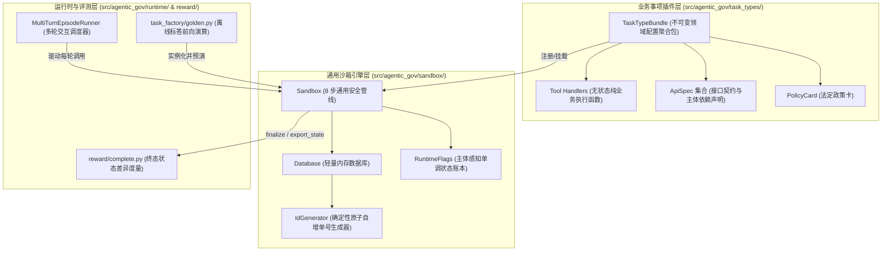
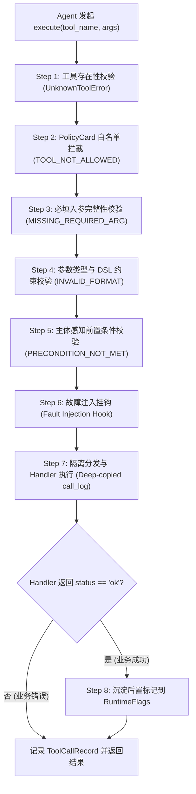
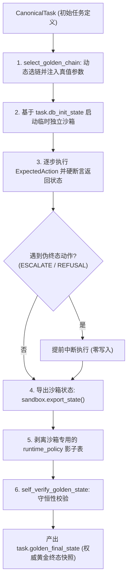
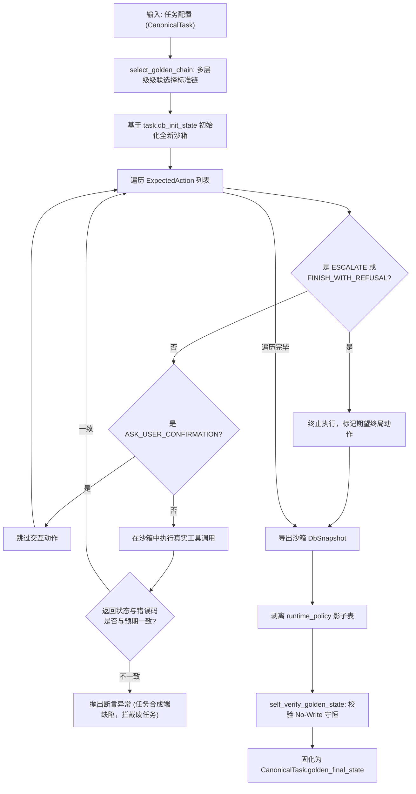
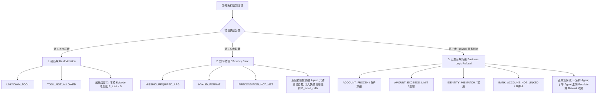
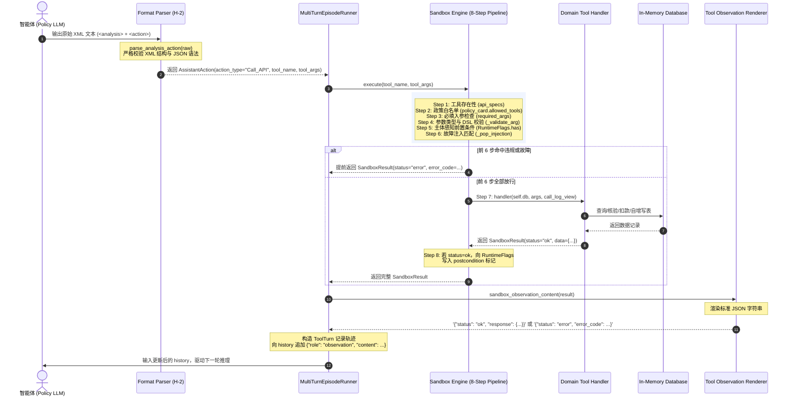
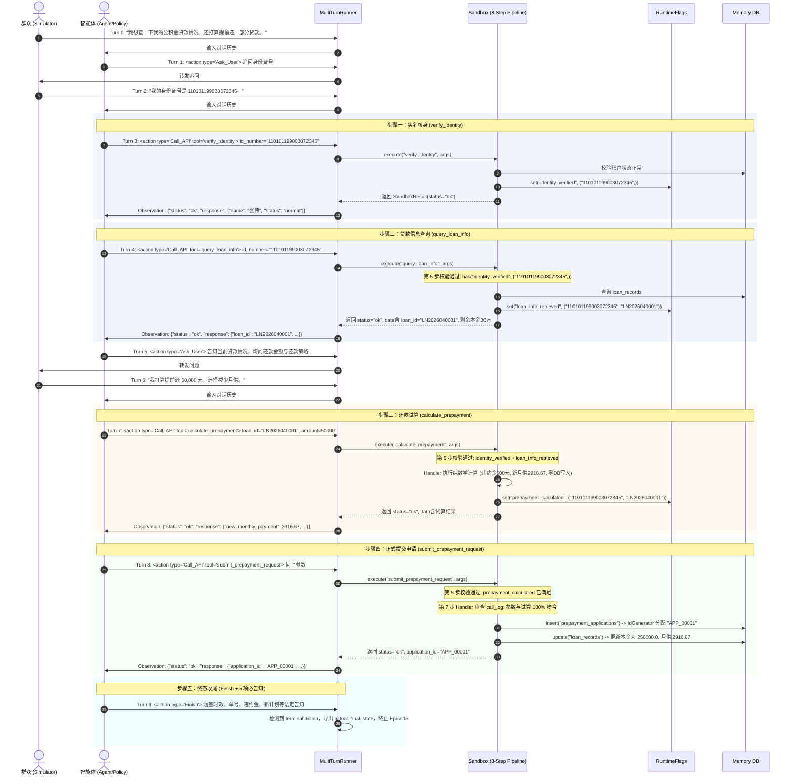
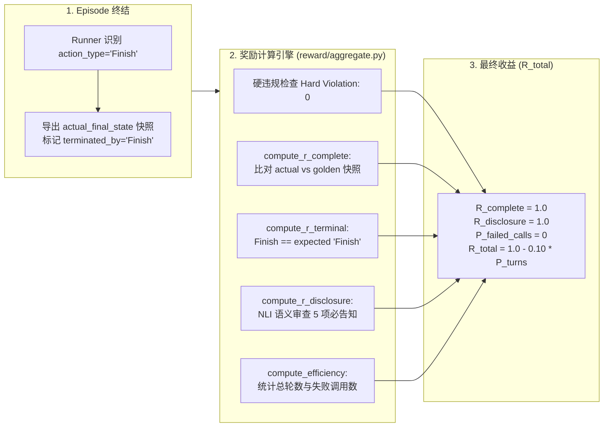

# Agentic-Gov 沙箱仿真环境与评测执行架构深度解析

> **文档定位**：面试复习专题笔记（针对项目原作者深度复盘）。
> **目标**：彻底讲透 `agentic-gov` 沙箱（Sandbox）的设计初衷、与 Task Type / PolicyCard 的绑定机制、8 步安全执行管线、主体感知状态机（Subject-Aware Preconditions）、确定性自增 ID 生成器、标准操作链（Golden Chain）离线生成与在线 RL Rollout 执行的区别、异常状态码派生机制、终局动作（Terminal Action）识别协议，以及完整闭环的奖励结算联动。
> **代码权威源**：`src/agentic_gov/sandbox/`（`engine.py`、`database.py`、`runtime_flags.py`、`errors.py`、`tool_registry.py`）、`src/agentic_gov/task_factory/golden.py`、`src/agentic_gov/runtime/`（`episode_runner.py`、`tool_observation.py`）、`src/agentic_gov/reward/`（`complete.py`、`terminal.py`、`disclosure.py`、`aggregate.py`）、`src/agentic_gov/task_types/`、`src/agentic_gov/schemas/`、`src/agentic_gov/verifier/format.py`。
> *注：本文与 [《任务工厂（Task Factory）》](./agentic-gov-task-factory.md)、[《四大事项业务规则与状态机设计》](./agentic-gov-task-types-business-rules.md)、[《数据全生命周期与 SFT/RL 评测体系》](./agentic-gov-data-lifecycle-sft-rl.md) 三篇专题文档构成系列，各管一面。*

---

## 1. 背景与核心挑战：为什么 Agent 需要专用沙箱？

在政务大模型（Government Service Agent）的训练与评测中，不能直接拿生产环境的真实 API 给强化学习（RL）或大模型智能体调用。政务业务具有极高的严肃性，存在**不可逆资金划拨（如公积金提取、提前还贷）**、**严格的前置合规时序依赖（如实名核验、购房合同核验）**以及**数据隐私安全红线**。

为了构建高效、可控且支持自动化大规模 Rollout 的训练与评测环境，`agentic-gov` 自研了一套轻量级、高确定性且具备深层安全防线的**内存沙箱仿真引擎（Memory-based Sandbox Engine）**。

```mermaid
flowchart TD
    User["办事群众 (Simulator / 真实用户)"] -->|自然语言追问与诉求| Agent["政务大模型 Agent (Policy LLM)"]
    Agent -->|XML 结构化发射封套 (H-2)| Runner["MultiTurnEpisodeRunner"]
    Runner -->|Call_API (tool_name, args)| Sandbox["Sandbox 8-Step Security Pipeline"]
    Sandbox -->|隔离执行| MemoryDB[(轻量内存数据库 Database)]
    Sandbox -->|状态沉淀| Flags[(主体感知账本 RuntimeFlags)]
    Sandbox -->|SandboxResult| Runner
    Runner -->|标准 Observation 渲染| Agent
    Runner -->|Terminal Action (Finish / Escalate / Refusal)| Reward["Reward 奖励与评测结算"]
    MemoryDB -.->|导出 actual_final_state| Reward
    Golden[("Golden Final State (权威标答)")] -.->|路径比对| Reward
```

### 通用 LLM 直接面对业务 API 的三大致命缺陷

1. **幻觉越权调用（Hallucinated & Unauthorized Calls）**：大模型倾向于在未获取用户授权、未核实真实身份前，直接调用敏感查询或写操作接口；
2. **“张冠李戴”的主体混淆（Cross-Subject Data Poisoning）**：模型在多轮对话中可能核验了市民 A 的身份证，却在下一步拿市民 B 的身份证发起资金提取；
3. **探索破坏性与状态漂移（Side-Effect Drift in RL Exploration）**：在 PPO / GRPO 采样中，模型大量的失败探索会导致数据库产生不可逆脏数据或非确定性单号，导致终态难以自动化对齐打分。

---

## 2. 整体架构：通用引擎与领域插件的彻底解耦

整个沙箱体系在工程实现上严格遵循**“通用执行引擎（Engine）与领域业务规则（Task Bundle）完全解耦”**的原则：



### 各层级职责划分

- **沙箱引擎层（Domain-Agnostic）**：位于 `src/agentic_gov/sandbox/`。它完全不感知具体的公积金、社保或医保概念。它只负责维护通用的 8 步执行管线、解析 `ApiSpec` 中的 DSL 约束与主体元组、管理状态账本、提供原子内存 DB 操作；
- **业务事项插件层（Domain-Specific）**：位于 `src/agentic_gov/task_types/`。以声明式的方式定义各政务事项的 `PolicyCard`、`ApiSpec` 与具体的 Python `Handler` 执行逻辑；
- **运行时调度与评测层**：位于 `src/agentic_gov/runtime/` 和 `src/agentic_gov/reward/`。负责多轮交互循环调度、解析 Agent 输出的发射封套、驱动沙箱执行、捕获终局动作并结算强化学习奖励。

---

## 3. 核心概念辨析：Task Type、PolicyCard 与 CanonicalTask 的三位一体关系

在 `agentic-gov` 中，有三个极易混淆的核心概念：`task_type`、`PolicyCard` 与 `CanonicalTask`。它们分别位于**业务架构的不同抽象层次**：

```
                    ┌────────────────────────┐
                    │       task_type        │  <--- 技术维度的业务模型抽象
                    │ (如 withdrawal_for_rent)│
                    └───────────┬────────────┘
                                │ 1:1 强绑定
                                ▼
                    ┌────────────────────────┐
                    │       PolicyCard       │  <--- 业务维度的法定政策说明书
                    │   (如 HF-WD-RENT v1.0) │
                    └───────────┬────────────┘
                                │ 实例化出成千上万个
                                ▼
                    ┌────────────────────────┐
                    │     CanonicalTask      │  <--- 运行维度的单次办件工单
                    │ (带特定画像/初始库/单号) │
                    └────────────────────────┘
```

### 3.1 概念定位与职责边界

#### 1. `task_type`：技术层面的“业务事项模型”
- **定义**：技术维度的唯一标识符（字符串，如 `withdrawal_for_rent`、`loan_repayment_query`）。
- **职责**：作为系统架构的“主键”，用于挂载 `TaskTypeBundle`、索引对应的 `ApiSpec` 接口集、定位 Handler 处理函数，以及在任务工厂中决定数据生成流水线。

#### 2. `PolicyCard`：业务层面的“法定政策说明书（Contract）”
- **定义**：由 `src/agentic_gov/schemas/policy.py` 定义的强类型 Pydantic 模型。
- **职责**：代表一份**不可篡改的法定业务规范**。它声明了该业务事项的必填槽位（`required_slots`）、法定前置条件（`preconditions`）、硬性业务红线（`hard_rules`）、法定转人工触发条件（`escalation_conditions`）、法定终态告知清单（`mandatory_disclosures`）以及合法调用的工具白名单（`allowed_tools`）。

#### 3. `CanonicalTask`：运行层面的“单次办理工单（Episode Instance）”
- **定义**：由 `src/agentic_gov/schemas/task.py` 定义，代表一次具体群众进线办理的**完整任务实例**。
- **职责**：包含唯一的 `task_id`、绑定的 `task_type`、政策版本号（`policy_id`, `policy_version`）、群众画像（`persona`）、群众真实事实（`hidden_truth`）、初始数据库状态（`db_init_state`）、权威终态标答（`golden_final_state`）以及字段比对规格（`compare_spec`）。

---

### 3.2 公积金四大事项的真实映射对照

#### 核心结论：4 大 Task Type 与 4 张 PolicyCard 的 1:1 强绑定体系

系统当前构建了 4 个核心 `task_type` 与 4 张 `PolicyCard`，呈 **1:1 强绑定关系**，由 `TaskTypeRegistry` 单例在系统加载时统一注册管理：

| 事项标识 (`task_type`) | 政策卡标识 (`policy_id`) | 版本号 (`version`) | 真实政务业务映射 | 核心合法工具集 (`allowed_tools`) |
|---|---|---|---|---|
| **`account_balance_query`** | `HF-BAL-QUERY` | `v1.0` | 个人公积金账户与明细查询 | `verify_identity`<br>`verify_delegate_authorization`<br>`query_account_info` |
| **`withdrawal_for_rent`** | `HF-WD-RENT` | `v1.0` | 无房职工租房提取公积金 | `verify_identity`<br>`verify_delegate_authorization`<br>`check_eligibility`<br>`submit_rent_withdrawal` |
| **`withdrawal_for_purchase`** | `HF-WD-PURCHASE` | `v1.0` | 购买自住商品房提取公积金 | `verify_identity`<br>`verify_delegate_authorization`<br>`check_eligibility`<br>`verify_purchase_contract`<br>`submit_purchase_withdrawal` |
| **`loan_repayment_query`** | `HF-LOAN-REPAY` | `v1.0` | 公积金贷款查询与提前还款 | `verify_identity`<br>`verify_delegate_authorization`<br>`query_loan_info`<br>`calculate_prepayment`<br>`submit_prepayment_request` |

```python
# src/agentic_gov/task_types/housing_fund/__init__.py
TaskTypeRegistry.register(ACCOUNT_BALANCE_QUERY_BUNDLE)
TaskTypeRegistry.register(WITHDRAWAL_FOR_RENT_BUNDLE)
TaskTypeRegistry.register(WITHDRAWAL_FOR_PURCHASE_BUNDLE)
TaskTypeRegistry.register(LOAN_REPAYMENT_QUERY_BUNDLE)
```

**面向未来的可扩展性（Extensibility）**：
如果未来需要接入**社保参保缴费证明查询（`social_security_payment_proof`）**、**医保异地备案（`healthcare_cross_region_filing`）**或**个人个税申报（`tax_personal_declaration`）**等全新领域：
1. **通用引擎零修改**：沙箱底层 8 步管线、主体感知状态机、内存 DB 与评测模块**完全不需要修改任何一行代码**；
2. **纯外挂式声明**：只需在 `src/agentic_gov/task_types/` 下新建领域子包，定义对应的 `PolicyCard`、`ApiSpec` 与 Python `Handler`，打包为 `TaskTypeBundle` 注册进 `TaskTypeRegistry`，沙箱即可开箱即用支持全新政务大类。

---

### 3.3 为什么必须将 PolicyCard 独立出来？（版本演化与防御性断言）

很多开发者会问：为什么不直接将政策规则写死在 `task_type` 的代码逻辑里？

#### 优势一：政策动态演进与框架零改动
现实中的政务政策处于持续修订中（例如：2025年租房提取限额为 48,000 元/年，2026年提高至 60,000 元/年）。将 `PolicyCard` 独立后，只需要新增 `HF-WD-RENT v2.0` 的配置即可，底层沙箱引擎与任务工厂逻辑完全不变。

#### 优势二：训练环境与任务数据的“零容忍”版本硬校验
在 `src/agentic_gov/task_loader.py` 中，沙箱实例化时会强制校验任务声明的版本与系统注册的 PolicyCard 是否严格一致：

```python
# src/agentic_gov/task_loader.py
def build_sandbox(task: CanonicalTask) -> Sandbox:
    bundle = TaskTypeRegistry.get(task.task_type)
    _assert_policy_match(task, bundle.policy_card.policy_id, bundle.policy_card.policy_version)
    runtime_bundle = effective_bundle_for_task(task, bundle=bundle)
    ...
```

一旦出现数据文件中声明的 `policy_version="v2.0"` 而当前代码环境只有 `v1.0`，系统在初始化阶段就会**立即崩溃（Fail-Fast）**，坚决杜绝因为环境与数据版本不一致导致的“假性训练”或评测漂移。

---

## 4. 核心机制一：8 步安全执行管线（Execution Pipeline）

当 Agent 发起一次工具调用请求（如 `sandbox.execute("submit_rent_withdrawal", {"id_number": "110101...", "amount": 20000})`）时，请求绝不会直接打到底层数据库，而是必须顺序穿透沙箱的 **8 步安全执行管线**：



### 8 步管线的逐步实现与设计哲学

#### Step 1: 工具存在性校验（Existence Check）
检查 `tool_name in self.api_specs`。若不存在，直接抛出 `UnknownToolError`。这属于代码或 Prompt 契约级别的 Bug，直接触发硬性违规中断。

#### Step 2: 政策规则卡白名单拦截（Policy Whitelist Guard）
检查 `tool_name in self.policy_card.allowed_tools`。若 Agent 试图在一个租房任务中调用购房提取的接口（跨事项越权），沙箱直接返回 `TOOL_NOT_ALLOWED`。

#### Step 3 & 4: 参数完整性与 DSL 约束校验
遍历 `api_spec.required_args` 与 `optional_args`，并执行内置的轻量级 DSL 约束引擎：
- 数值约束：`> 0`、`>= 100`；
- 枚举约束：`in:partial,full`、`in:rent,purchase`；
- 格式不合规时返回 `INVALID_FORMAT`。

#### Step 5: 主体感知前置条件校验（Subject-Aware Preconditions）
最核心的安全防线。沙箱遍历 `api_spec.preconditions`，并从当前入参中解析出主体元组，断言该主体必须已在 `RuntimeFlags` 账本中激活。若未激活，返回 `PRECONDITION_NOT_MET`。

#### Step 6: 故障注入挂钩（Fault Injection Hook）
检查是否存在预设的测试异常注入（如模拟网络抖动返回 `TEMPORARY_UNAVAILABLE`）。该计数器仅对合法到达此步的有效调用递增。

#### Step 7: 隔离分发与防篡改执行（Isolated Dispatch）
分发到对应的 Python Handler 函数。**关键安全防御**：Handler 接收到的历史调用日志 `call_log_view` 是经过 `copy.deepcopy` 深拷贝的只读副本，彻底杜绝 Handler 篡改权威历史日志。

```python
# src/agentic_gov/sandbox/engine.py (Step 7)
handler = self.tool_handlers[tool_name]
call_log_view = tuple(rec.model_copy(deep=True) for rec in self._tool_call_log)
result = handler(self.db, args, call_log_view)
```

#### Step 8: 成功状态下的后置标记沉淀（Postconditions Flagging）
**当且仅当 Handler 返回 `status == "ok"` 时**，引擎才会遍历 `api_spec.postconditions`，根据 `postcondition_subject_refs` 从入参或 Handler 返回的 `result.data` 中动态组装主体元组，写入 `RuntimeFlags` 账本。

---

## 5. 核心机制二：主体感知状态账本（Subject-Aware Runtime Flags）

### 传统全局 Flag 的致命漏洞：“张冠李戴”越权

传统的 Agent 环境通常使用布尔值标志，例如 `flags["identity_verified"] = True`。这在单主体简单场景下尚可工作，但在复杂政务场景下存在致命的**主体越权漏洞（Cross-Subject Exploit）**：
> Agent 先对市民 A（张三）执行了 `verify_identity(id_number="110101...")`，激活了全局 `identity_verified = True`；
> 随后，Agent 在未核验市民 B（李四）的情况下，直接调用 `submit_rent_withdrawal(id_number="320102...", amount=20000)`。由于全局标记为 `True`，传统系统会误判通过，导致张三的核身被李四盗用！

### 声明式主体引用语法（Subject References）

为了彻底根除这一隐患，`agentic-gov` 自研了**主体感知（Subject-Aware）**机制：状态标记不再是布尔值，而是挂载在特定的**数据主体元组（Subject Tuple）**上。

在 `ApiSpec` 中通过声明式语法指定主体来源：

```python
# src/agentic_gov/task_types/housing_fund/withdrawal_for_purchase.py
VERIFY_PURCHASE_CONTRACT_SPEC = ApiSpec(
    tool_name="verify_purchase_contract",
    tool_type="read",
    required_args=[
        ArgSpec(name="id_number", type="str"),
        ArgSpec(name="contract_number", type="str"),
    ],
    # 必须对该 id_number 已完成实名核身
    preconditions=["identity_verified"],
    precondition_subject_refs={
        "identity_verified": ("args.id_number",),
    },
    # 成功后沉淀该人与该合同的联合绑定标记
    postconditions=["contract_verified"],
    postcondition_subject_refs={
        "contract_verified": ("args.id_number", "args.contract_number"),
    },
)
```

### 多元组主体与跨接口数据传递（`args.*` 与 `result.*`）

主体引用不仅支持从请求参数提取（`args.xxx`），还支持**动态从接口返回数据中提取（`result.xxx`）**：

```
[ 步骤一: 贷款查询 ]
Agent -> query_loan_info(args.id_number="110101...")
           │
           ▼ Handler 查库返回
result.data = {"loan_id": "LN2026040001", "balance": ...}
           │
           ▼ Step 8 解析 postcondition_subject_refs: ("args.id_number", "result.loan_id")
RuntimeFlags.set("loan_info_retrieved", ("110101...", "LN2026040001"))

─────────────────────────────────────────────────────────────────────────────

[ 步骤二: 提前还款试算 ]
Agent -> calculate_prepayment(args.id_number="110101...", args.loan_id="LN2026040001")
           │
           ▼ Step 5 解析 precondition_subject_refs: ("args.id_number", "args.loan_id")
RuntimeFlags.has("loan_info_retrieved", ("110101...", "LN2026040001")) -> TRUE (放行!)
```

### 运行时账本的单调性与类型一致性安全

`RuntimeFlags`（`src/agentic_gov/sandbox/runtime_flags.py`）具备两项铁律：
1. **单调递增性（Monotonicity）**：标记一旦设置，在整个 Episode 生命周期内只能增加不能撤销，杜绝状态回滚漏洞；
2. **作用域一致性强断言（Scope Consistency）**：在沙箱初始化时，引擎会自动扫描所有已挂载的 `ApiSpec`。如果接口 A 声明 `identity_verified` 是单主体 `("args.id_number",)`，而接口 B 却声明为全局无主体，沙箱会在启动时**直接抛出类型冲突异常崩溃**，将 Spec 编写错误扼杀在上线之前。

---

## 6. 核心机制三：轻量内存数据库与确定性 ID 生成器

### 为什么选择 In-Memory Dict DB？

沙箱底层的 `Database`（`src/agentic_gov/sandbox/database.py`）完全基于 Python 原生 `dict` 结构实现内存数据库，没有采用 SQLite 或外部数据库。

**设计权衡（Design Rationale）**：
1. **极致吞吐**：在强化学习（RL）并行 Rollout 时，成千上万个沙箱实例并发运行，纯内存 Dict 无磁盘 I/O、无锁竞争，吞吐量提升数个数量级；
2. **完美状态隔离与快照复制**：通过 `db.snapshot()` 和 `model_copy(deep=True)`，可在微秒级完成数据库状态的深拷贝、重置与回滚，天然支持树状搜索（MCTS）与并行环境采样。

### 确定性原子自增 ID 生成器（`IdGenerator`）与终态比对前提

在政务业务中，任何写操作（如租房提取、购房提取、提前还贷）成功后都必须生成业务流水单号（如 `APP_00001`）。

在分布式强化学习（如 16 并发 GPU Rollout）中，如果使用随机 UUID 或依赖系统时间戳生成单号，**状态比对（Outcome Verification）就会彻底失效**，因为模型执行出的 `actual_final_state` 中的单号永远无法与离线预生成的权威标答 `golden_final_state` 匹配！

为此，沙箱实现了基于 `task_id` 种子绑定的确定性生成器：

```python
# src/agentic_gov/sandbox/database.py
class IdGenerator:
    def __init__(self, seed: str | None = None) -> None:
        self._counters: dict[str, int] = {}
        
    def next(self, prefix: str) -> str:
        self._counters[prefix] = self._counters.get(prefix, 0) + 1
        return f"{prefix}_{self._counters[prefix]:05d}"
```

#### 为什么“只在真实有效写入时消费计数器”是关键设计？

在强化学习探索中，Agent 可能会进行多次尝试：参数格式错误、超额被拒、缺少前置等。
如果每次调接口无论成败都消费 ID 计数器，那么 Agent 第一次错误调用就会导致计数器变成 `00002`，最终成功写入时生成的单号变成 `APP_00002`，从而与标答的 `APP_00001` 发生**单号偏移漂移**。

**沙箱的核心设计**：
ID 计数器的消费**强绑定在 `Database.insert()` 的成功执行时**。只要未发生真实数据库写入，计数器绝对不自增！

**工程效果**：
**确定性 ID 生成器是「终态比对（Outcome Verification）」能成立的前提条件。** 无论 Agent 在中间轮次中经历了多少次碰壁、重试、澄清或自愈纠错，只要它最终做出的真实有效写操作序列一致，数据库生成的主键单号必定 100% 严格复现并精确吻合 `golden_final_state`，使状态比对奖励计算具备坚如磐石的可信度。

---

## 7. 领域插件实现与 Handler 调度机制

### 7.1 TaskType、TaskTypeBundle 与 Handler 的组织与调度全景

很多开发者在阅读沙箱代码时会产生疑问：**`task_type` 与 `handler` 到底是什么关系？`TaskTypeBundle` 是如何将各种配置组装起来的？`Sandbox.execute` 在收到 `tool_name` 时又是如何精准路由到对应 Python 处理函数的？**

#### 1. 概念关系与组织机制（先结论，后机制）

- **核心结论**：
  - `task_type`（如 `withdrawal_for_rent`）是**业务事项的逻辑标识符**；
  - `Handler` 是底层执行具体业务判定与数据库操作的**无状态纯 Python 函数**（函数签名统一定义为 `(db: Database, args: dict[str, Any], call_log: Sequence[ToolCallRecord]) -> SandboxResult`）；
  - `TaskTypeBundle` 是一个强类型的不可变数据容器（`dataclass(frozen=True)`），作为业务插件的基本打包单元；
  - 每个 `task_type` 对应一个独立的 `TaskTypeBundle`，里面装载了该事项的政策卡 `policy_card`、接口规格字典 `api_specs: dict[str, ApiSpec]` 以及处理函数字典 `tool_handlers: dict[str, Handler]`。

```mermaid
flowchart TD
    subgraph Bundle["TaskTypeBundle (业务事项聚合包)"]
        TT["task_type: 'withdrawal_for_rent'"]
        PC["policy_card: PolicyCard (HF-WD-RENT)"]
        AS["api_specs: dict[str, ApiSpec]<br/>{'verify_identity': ..., 'submit_rent_withdrawal': ...}"]
        TH["tool_handlers: dict[str, Handler]<br/>{'verify_identity': handle_verify_identity,<br/> 'submit_rent_withdrawal': handle_submit_rent_withdrawal}"]
        CS["compare_spec_by_flow: dict"]
        FSE["forbidden_side_effects: list"]
    end

    REG["TaskTypeRegistry (单例注册表)"] -->|register 注册| Bundle
    LOADER["task_loader.build_sandbox(task)"] -->|get(task.task_type)| REG
    LOADER -->|effective_bundle_for_task| R_BUNDLE["Runtime TaskTypeBundle<br/>(按 flow_variant 裁剪 allowed_tools)"]
    R_BUNDLE -->|注入构造参数| SANDBOX["Sandbox 运行时实例<br/>self.api_specs<br/>self.tool_handlers<br/>self.policy_card"]
```

- **注册与运行时装配全流程**：
  1. **静态注册（Import-Time）**：在 `src/agentic_gov/task_types/housing_fund/__init__.py` 加载时，各事项模块将自身定义的 `POLICY_CARD`、`API_SPECS`、`HANDLERS` 封装为 `TaskTypeBundle` 并注册到单例 `TaskTypeRegistry` 中：
     ```python
     # src/agentic_gov/task_types/registry.py
     @dataclass(frozen=True)
     class TaskTypeBundle:
         task_type: str
         policy_card: PolicyCard
         api_specs: dict[str, ApiSpec]
         tool_handlers: dict[str, Handler]
         compare_spec_by_flow: dict[str | None, dict[str, dict[str, str]]] = field(default_factory=dict)
         forbidden_side_effects: list[str] = field(default_factory=list)
     ```
  2. **任务加载与版本强校验（Load-Time）**：`task_loader.build_sandbox(task)` 从注册表获取 Bundle，并通过 `_assert_policy_match` 防御性断言任务声明的 `policy_id` 与 `policy_version` 必须与注册表完全一致；
  3. **运行时动态裁剪（`effective_bundle_for_task`）**：针对 `loan_repayment_query` 这种包含 `flow_variant` 的事项，若为 `query_only` 纯查询流，`runtime_bundle.py` 会将写工具 `submit_prepayment_request` 从 `policy_card.allowed_tools` 中剔除；
  4. **沙箱构造期防御性断言**：`Sandbox.__init__` 初始化时，执行硬校验：
     ```python
     missing_handlers = [name for name in api_specs if name not in tool_handlers]
     if missing_handlers:
         raise ValueError(f"API specs without handlers: {missing_handlers}")
     ```
     确保声明的每一个 `ApiSpec` 都必定拥有对应的 `Handler` 处理函数。

#### 2. `Sandbox.execute` 如何定位到对应 Handler？

当 Agent 发起 `sandbox.execute(tool_name, args)` 时，引擎经过前 6 步的通用安全守卫拦截（存在性检查、白名单拦截、参数完整性、DSL 约束、主体感知前置条件、故障注入）后，在 **Step 7（隔离分发）** 直接通过字典索引寻址并调用：

```python
# src/agentic_gov/sandbox/engine.py (Step 7)
handler = self.tool_handlers[tool_name]
call_log_view = tuple(rec.model_copy(deep=True) for rec in self._tool_call_log)
result = handler(self.db, args, call_log_view)
```

---

### 7.2 PolicyCard.allowed_tools、ApiSpec 与 Handler 的“三权分立”安全模型

很多初学者容易混淆：**既然有了 `PolicyCard.allowed_tools`，为什么还需要 `ApiSpec`？既然 `ApiSpec` 声明了参数，为什么还需要 `Handler` 内部去校验？**

在沙箱架构中，三者构成了清晰的**“三权分立”分层防御体系**：

```
[ 8 步安全管线中的分层设防 ]
Agent Tool Call
  │
  ├─► [ Step 2 ] PolicyCard.allowed_tools ──► 宏观政策门禁 (Macro Access Guard)
  │                                           "这个事项/变体允许调这个工具吗？"
  │
  ├─► [ Step 3-5 ] ApiSpec ─────────────────► 微观契约与状态机 (Micro Contract & Flags)
  │                                           "参数类型对吗？DSL满足吗？前置主体核身了吗？"
  │
  └─► [ Step 7 ] Tool Handler ──────────────► 领域业务逻辑与数据库变更 (Business Implementation)
                                              "账户余额够扣吗？银行卡绑定了吗？写表并生成单号"
```

#### 三者职责对照矩阵表

| 维度 | `PolicyCard.allowed_tools` | `ApiSpec` | `Tool Handler` |
|---|---|---|---|
| **定位与层级** | **政策法规层** (`schemas/policy.py`) | **通用引擎契约层** (`schemas/api_spec.py`) | **领域插件实现层** (`task_types/...`) |
| **关注粒度** | 事项级 / 流程变体级宏观白名单 | 接口级输入契约与状态机声明 | 领域级真实业务逻辑与数据库原子变更 |
| **管线介入点** | **Step 2**（政策白名单拦截） | **Step 3–5**（参数/DSL/前置）+ **Step 8**（后置标记沉淀） | **Step 7**（隔离分发执行） |
| **核心职责** | 1. 阻断跨事项越权调用（如租房任务调购房接口）；<br>2. 流程变体收缩（如纯查询流屏蔽提交写接口）；<br>3. 面向 Agent Prompt 渲染合法工具列表。 | 1. 声明入参名称与类型（`ArgSpec`）；<br>2. 声明数值与枚举轻量 DSL（如 `"> 0"`, `"in:a,b"`）；<br>3. 声明数据主体绑定与前置/后置条件元组。 | 1. 访问内存数据库 `db.find_one` 查询实体；<br>2. 执行政策限额综合比对、复杂还款数学试算；<br>3. 调用 `db.insert()` 消费确定性 ID 并修改数据；<br>4. 返回业务错误码（如 `ACCOUNT_FROZEN`）。 |
| **引擎是否感知业务** | **完全领域无关**：引擎只做 `tool_name in allowed_tools` 集合判断。 | **完全领域无关**：引擎只解析 DSL 字符串与元组 `args.*`/`result.*`。 | **领域特异（Domain-Specific）**：包含公积金专属扣款、利率、网签核验逻辑。 |
| **触发错误类型** | **硬违规 (Hard Violation)**：`TOOL_NOT_ALLOWED`（直接熔断，总分清零）。 | **效率错误 (Efficiency Error)**：`MISSING_REQUIRED_ARG`, `INVALID_FORMAT`, `PRECONDITION_NOT_MET`。 | **业务合规拒绝 (Business Refusal)** 或 **成功**：如 `AMOUNT_EXCEEDS_LIMIT`, `status="ok"`。 |

#### 实例走查：以 `submit_rent_withdrawal` 为例
设想 Agent 在第 3 轮发起了 `submit_rent_withdrawal(id_number="110101...", amount=20000)`：
1. **`PolicyCard.allowed_tools` 的职责**：若当前任务是 `withdrawal_for_rent`，校验通过放行；若当前任务是 `account_balance_query`，直接在 Step 2 拦截并报错 `TOOL_NOT_ALLOWED`（硬违规）；
2. **`ApiSpec` 的职责**：在 Step 3–5 检查 `id_number` 和 `amount` 是否提供、`amount > 0` 是否成立、`identity_verified` 和 `eligibility_confirmed` 是否已在该 `id_number` 上激活。若 Agent 跳过核验直接提交，在 Step 5 被拦截并报错 `PRECONDITION_NOT_MET`；
3. **`Handler` 的职责**：进入 Step 7，Handler 读取数据库发现该用户真实公积金余额仅 15,000 元（提取 20,000 元超额），此时 Handler 内部返回业务拒绝 `error_result(SandboxError.AMOUNT_EXCEEDS_LIMIT)`；
4. **`ApiSpec` 的后置职责**：由于 Step 7 返回了 `error`，Step 8 绝不会向 `RuntimeFlags` 激活任何后置完成标记。

---

### 7.3 业务 Handler 实现范例（租房提取提交）

业务 Handler 纯粹负责执行具体的业务判定与数据更新：

```python
def handle_submit_rent_withdrawal(
    db: Database, args: dict[str, Any], call_log: Sequence[ToolCallRecord]
) -> SandboxResult:
    id_number = args["id_number"]
    amount = float(args["amount"])
    
    # 1. 查找账户
    account = db.find_one("fund_account", id=id_number)
    if account is None:
        return error_result(SandboxError.AMOUNT_EXCEEDS_LIMIT, cause="account_missing")
        
    # 2. 银行卡绑定校验
    if account.get("linked_bank_account") is None:
        return error_result(SandboxError.BANK_ACCOUNT_NOT_LINKED, id_number=id_number)
        
    # 3. 政策限额与余额综合校验
    balance = float(account["balance"])
    annual_limit = float(db.get_runtime_policy("withdrawal_limit_rent", 50000.0))
    effective_limit = min(balance, annual_limit)
    
    if amount > effective_limit:
        return error_result(
            SandboxError.AMOUNT_EXCEEDS_LIMIT,
            amount=amount,
            effective_limit=effective_limit,
        )
        
    # 4. 执行扣款与写表
    new_row = apply_balance_and_record(
        db, id_number=id_number, amount=amount, reason="rent", contract_number=None
    )
    
    return ok_result(
        data={
            "application_id": new_row["application_id"],
            "status": new_row["status"],
            "new_balance": balance - amount,
        }
    )
```

---

## 8. 自动化标答生成：标准操作链（Golden Chain）

在强化学习与数据飞轮管线中，最大的痛点是如何为数千条全合成任务提供**绝对准确的最终数据库目标状态（`golden_final_state`）**。人工标注成本极高且易错，而 `agentic-gov` 创新性地在任务合成阶段引入了**可执行标准操作链（Golden Chain）**机制。

### 8.1 标答生成者与生成时机

Golden Chain 由任务工厂的核心模块 `src/agentic_gov/task_factory/golden.py` 提供，并在**任务合成阶段（Task Synthesis Phase）**离线执行。当任务工厂采样完成政策参数、群众画像与初始数据库快照后，立即调用 `generate_golden_final_state(task)` 驱动沙箱进行前向确定性演算，为每一个 `CanonicalTask` 预先生成权威的 Ground Truth（关于任务工厂的完整采样与过滤管线，详见 [《任务工厂（Task Factory）》](./agentic-gov-task-factory.md)）。

### 8.2 什么是 `ExpectedAction`？

标准操作链由一系列 `ExpectedAction` 顺序构成。它不仅支持真实的工具调用，还支持**流程控制伪动作（Pseudo Actions）**：

```python
# src/agentic_gov/task_factory/golden.py
@dataclass(slots=True)
class ExpectedAction:
    tool: str                   # 真实工具名 或 伪动作名 (ASK_USER_CONFIRMATION / ESCALATE / FINISH_WITH_REFUSAL)
    args: dict[str, Any]        # 期望调用的参数 (由 hidden_truth 动态注入)
    expect_status: str = "ok"   # 期望返回 "ok" 或 "error"
    expect_code: str | None     # 期望错误码 (如 ELIGIBILITY_INACTIVE_ACCOUNT / AMOUNT_EXCEEDS_LIMIT)
    note: str = ""
```

三类动作元素：
1. **真实工具调用**：如 `verify_identity`、`check_eligibility`，必须精确匹配声明的返回状态与错误码；
2. **伪交互动作（`ASK_USER_CONFIRMATION`）**：表示该环节需要与群众进行自然语言确认，在沙箱执行标答生成时直接跳过；
3. **伪终局动作（`ESCALATE` / `FINISH_WITH_REFUSAL`）**：沙箱在遇到该动作时**立即中断（Break）后续执行**，并将任务终局标记为转人工或明确拒绝。

---

### 8.3 核心澄清一：`ExpectedAction` 列表与 Task Type 的关联性及 5 维动态路由

针对读者的常见疑问：**`ExpectedAction` 列表是否与 `task_type` 关联？一个固定 `task_type` 的 expected action 列表和对应 `expected_status` 是否就固定不变？**

#### 1. 先下结论
- **是与 `task_type` 强关联**：`task_type` 是级联选择路由的基准骨架，决定了该事项的基本工具集、主干时序逻辑与默认 Happy Path；
- **但动作列表与 `expected_status` 绝非固定不变！** 面向具体的任务实例时，动作步骤、预期状态（`expect_status`）与错误码（`expect_code`）会由 **5 维元数据路由器（`select_golden_chain`）动态重构**。

#### 2. 后讲机制（5 维动态编译路由）

`src/agentic_gov/task_factory/golden.py` 中的 `select_golden_chain(task)` 函数会依据任务元数据进行级联分发：

```
                              select_golden_chain(task)
                                         │
    ┌────────────────────────────────────┼────────────────────────────────────┐
    ▼                                    ▼                                    ▼
[ 1. 特殊家族覆盖 ]              [ 2. 对抗场景分支 ]                  [ 3. 边界用例匹配 (49种) ]
family_id == HV2                 adversarial_flag != None             (task_type, boundary_id, side)
(无授权代办 -> Refusal)          (提示注入防御链)                     (超额重试 / 状态冻结转人工)
    │                                    │                                    │
    └────────────────────────────────────┼────────────────────────────────────┘
                                         │ (未命中上述特异分支)
    ┌────────────────────────────────────┴────────────────────────────────────┐
    ▼                                                                         ▼
[ 4. 故障注入自愈链 ]                                                  [ 5. Happy Path 基线分支 ]
recoverable_error in {TEMPORARY_UNAVAILABLE, MISSING_ARG}             (task_type, flow_variant)
(首调用 error -> 重试 ok)                                             (纯查询 2 步 vs 还款 4 步)
```

1. **流程变体维度（`flow_variant`）**：
   - 同样是 `loan_repayment_query`：
     - `flow_variant="query_only"` 对应 2 步动作：`[verify_identity(ok), query_loan_info(ok)]`；
     - `flow_variant="with_prepayment"` 对应 4 步动作：`[verify_identity(ok), query_loan_info(ok), calculate_prepayment(ok), submit_prepayment_request(ok)]`。
2. **边界用例维度（`boundary_config`，49 种显式注册链 `GOLDEN_CHAINS_BOUNDARY`）**：
   - **正常合规（`BD-N1 under`）**：直接一次性 `submit_rent_withdrawal`，`expect_status="ok"`；
   - **超额自愈重试（`BD-N1 over`）**：
     - 前两步正常核身与资格审查；
     - 第 3 步期望超额报错：`submit_rent_withdrawal` $
ightarrow$ **`expect_status="error", expect_code="AMOUNT_EXCEEDS_LIMIT"`**；
     - 第 4 步期望修正重试：`submit_rent_withdrawal`（以政策限额重试） $
ightarrow$ **`expect_status="ok"`**；
   - **账户冻结转人工（`BD-C3 frozen`）**：
     - 第 1 步 `verify_identity` (`expect_status="ok"`)；
     - 第 2 步 `check_eligibility` $
ightarrow$ **`expect_status="error", expect_code="ELIGIBILITY_INACTIVE_ACCOUNT"`**；
     - 第 3 步插入伪终态动作 **`ESCALATE`**（沙箱遇到立即中断，不再执行后续提款写入）。
3. **系统可恢复故障维度（`recoverable_error`）**：
   - `TEMPORARY_UNAVAILABLE`：首次调用写接口期望返回系统不可用错误（`expect_status="error", expect_code="TEMPORARY_UNAVAILABLE"`），随后执行同参重试（`expect_status="ok"`）；
   - `MISSING_REQUIRED_ARG`：首次调用故意缺省必填字段触发错误，随后补齐参数重试成功。
4. **对抗与身份冒用维度（`adversarial_flag` / `family_id`）**：
   - `HV2_DELEGATE_AUTHORIZATION_ABSENT`：调 `verify_delegate_authorization` 返回 `AUTHORIZATION_NOT_FOUND`，紧跟 `FINISH_WITH_REFUSAL`。
5. **实例参数动态注入（Truth Grounding）**：
   - 所有标准链均经过 `_decorate_golden_chain_with_truth_grounding` 包装，动作入参 `args`（身份证号、申请金额、合同编号、贷款 ID 等）由 `task.hidden_truth`（`user_profile` 与 `case_context`）在运行时动态填充。

#### 3. 实例对比表（以租房提取 `withdrawal_for_rent` 为例）

| 场景类型 | 任务元数据标记 | `ExpectedAction` 步骤序列 | 步骤期望状态 (`expect_status` / `code`) | 终态动作 |
|---|---|---|---|---|
| **常态基准 (Happy Path)** | `boundary_config: null` | 1. `verify_identity`<br>2. `check_eligibility`<br>3. `submit_rent_withdrawal` | 1. `ok`<br>2. `ok`<br>3. `ok` | `Finish` |
| **限额边界超额 (BD-N1 Over)** | `boundary: ("BD-N1", "over")` | 1. `verify_identity`<br>2. `check_eligibility`<br>3. `submit_rent_withdrawal` (超额)<br>4. `submit_rent_withdrawal` (限额) | 1. `ok`<br>2. `ok`<br>3. **`error (AMOUNT_EXCEEDS_LIMIT)`**<br>4. **`ok`** | `Finish` |
| **账户冻结异常 (BD-C3 Frozen)** | `boundary: ("BD-C3", "frozen")` | 1. `verify_identity`<br>2. `check_eligibility`<br>3. `ESCALATE` (伪终态) | 1. `ok`<br>2. **`error (ELIGIBILITY_INACTIVE_ACCOUNT)`**<br>3. *中断执行* | `Escalate` |
| **系统故障注入 (Recoverable)** | `recoverable_error: TEMPORARY_UNAVAILABLE` | 1. `verify_identity`<br>2. `check_eligibility`<br>3. `submit_rent_withdrawal`<br>4. `submit_rent_withdrawal` (重试) | 1. `ok`<br>2. `ok`<br>3. **`error (TEMPORARY_UNAVAILABLE)`**<br>4. **`ok`** | `Finish` |

---

### 8.4 核心澄清二：`generate_golden_final_state` 的产生机制与多层次不一致性

针对读者的常见疑问：**`generate_golden_final_state` 是怎么产生的？每个 task type 的 `generate_golden_final_state` 是一致的吗？**

#### 1. 先下结论
- **产生方式**：`generate_golden_final_state` 是一个**离线确定性演算解释器**。它将选出的 `ExpectedAction` 脚本放入一个干净独立的 `Sandbox` 实例中回放执行，执行完毕后导出并剥离影子表，得到最终权威快照（Ground Truth）；
- **绝对不一致！** **不仅各个 `task_type` 之间产生的 `golden_final_state` 完全不同，即使是同一个 `task_type`，不同任务实例演算出的 `golden_final_state` 也截然不同！**

#### 2. 后讲机制（产生全流程与 3 级不一致性剖析）



#### 3 个维度的“不一致性”深度剖析

1. **维度 ①：跨 Task Type 不一致（涉及的业务表格与数据结构根本不同）**
   - `account_balance_query`：纯只读事项，执行后数据库无任何表变动（No-Write）；
   - `withdrawal_for_rent`：更新 `fund_account` 表的 `balance` 字段，并在 `withdrawal_applications` 插入 `reason="rent"` 的新记录；
   - `withdrawal_for_purchase`：更新 `fund_account` 余额，并在 `withdrawal_applications` 插入 `reason="purchase"` 及 `contract_number` 字段；
   - `loan_repayment_query`（还款流）：更新 `loan_records` 表的 `remaining_principal` 与 `monthly_payment`，并在 `prepayment_applications` 表插入新记录。
2. **维度 ②：同一 Task Type 内部跨变体/异常分支不一致（Flow & Exception Level）**
   - **正常办结（Finish）**：数据库发生真实物理写入，导出包含新单据与扣减后余额的快照；
   - **转人工 / 拒办（Escalate / FinishWithRefusal）**：Golden Chain 在前置校验报错后立即命中伪终态中断，后续写工具根本不执行。导出的快照剥离影子表后与 `db_init_state` **绝对完全一致（Zero Write 守恒）**；
   - **流程分支（如贷款查询）**：`query_only` 为 No-Write 快照，`with_prepayment` 为有写入快照。
3. **维度 ③：同一分支内部跨具体任务实例不一致（Instance Data Level）**
   - 即使是两个同属于正常租房提取（`withdrawal_for_rent`）的任务：
     - **任务 A（张三）**：初始余额 50,000 元，提取 20,000 元 $
ightarrow$ `golden_final_state` 中 `balance=30000.0`, `amount=20000.0`, `id_number="110101..."`, `application_id="APP_00001"`；
     - **任务 B（李四）**：初始余额 80,000 元，提取 48,000 元 $
ightarrow$ `golden_final_state` 中 `balance=32000.0`, `amount=48000.0`, `id_number="320102..."`, `application_id="APP_00001"`。
   - 每个任务实例的黄金快照都是为其**量身定制的专属物理真值**。

#### 3. 实例对比展示（JSON 终态快照对比）

```json
// 实例 1: 租房提取正常办结 (withdrawal_for_rent, Finish) -> 发生扣款与写表
{
  "tables": {
    "fund_account": [{"id": "110101199003072345", "balance": 30000.0, "status": "normal", "linked_bank_account": "6222021000123456789"}],
    "withdrawal_applications": [{"application_id": "APP_00001", "id_number": "110101199003072345", "amount": 20000.0, "reason": "rent", "status": "approved"}]
  }
}

// 实例 2: 租房提取账户冻结 (withdrawal_for_rent, Escalate) -> 保持 No-Write，与初始快照完全一致
{
  "tables": {
    "fund_account": [{"id": "110101199003072345", "balance": 50000.0, "status": "frozen", "linked_bank_account": "6222021000123456789"}],
    "withdrawal_applications": []
  }
}

// 实例 3: 贷款提前还款办结 (loan_repayment_query, Finish) -> 更新贷款表并写入提前还款申请
{
  "tables": {
    "loan_records": [{"loan_id": "LN2026040001", "remaining_principal": 250000.0, "monthly_payment": 2916.67, "status": "active"}],
    "prepayment_applications": [{"application_id": "APP_00001", "loan_id": "LN2026040001", "prepayment_amount": 50000.0, "status": "submitted"}]
  }
}
```

---

### 8.5 执行断言失败的本质含义：任务合成缺陷（Fail-Fast at Synthesis）

在 `generate_golden_final_state(task)` 中，沙箱会严格逐行执行 `ExpectedAction`：

```python
# src/agentic_gov/task_factory/golden.py
result = sandbox.execute(expected.tool, expected.args)
if expected.expect_status == "ok":
    if result.status != "ok":
        raise AssertionError(f"Golden step {expected.tool} expected ok but got {result.status}:{result.error_code}")
elif result.status != "error" or str(result.error_code) != expected.expect_code:
    raise AssertionError(f"Golden step {expected.tool} expected error {expected.expect_code} but got {result.status}:{result.error_code}")
```

**极其重要的概念辨析**：
如果在标答生成过程中抛出了 `AssertionError`，**这绝非 Agent 的运行错误，而是任务工厂离线合成逻辑的缺陷（Synthesis Defect）**。
- 例如：采样器生成的初始数据库余额是 0 元，但案例上下文却给出了常规的租房提取任务，导致 Golden Chain 在执行提取时被沙箱以 `AMOUNT_EXCEEDS_LIMIT` 阻断，引发断言崩溃。
- **工程价值**：该断言充当了出厂前的“物理可解性硬门禁”。任何自相矛盾、状态死锁的病态任务都会在合成期被直接击毙，杜绝污染下游的 SFT 训练集与 RL 评测基准。

### 8.6 零人工标注的黄金终态生成算法流程



### 8.7 与 Reward 模块的无缝衔接

演算成功后，Golden Chain 的产物将成为强化学习与评测的核心基准：
1. **终态基准固化**：导出的数据库快照剥离 `runtime_policy` 影子表后，保存为 `CanonicalTask.golden_final_state`；
2. **收尾动作固化**：通过 `derive_expected_terminal_action(script)` 提取标准收尾动作，写入 `CanonicalTask.metadata["expected_terminal_action"]`；
3. **闭环比对打分**：在 RL Rollout 或评测结束时，奖励模块 `src/agentic_gov/reward/complete.py` 中的 `compute_r_complete(task, actual_final_state)` 直接根据任务声明的 `compare_spec` 字段路径，比对实际数据库状态与 `golden_final_state`，得出确定性的 $R_{	ext{complete}}$ 完成度得分。

### 8.8 “不锁定对话路径”原则与数据库 No-Write 守恒

在评测阶段，系统**只比对最终数据库状态与终局告知内容，绝不拿 Golden Chain 去逐步比对 Agent 的每一步对话**。
- **允许自由探索**：Agent 可以先问金额再问身份证号，可以多次重试纠错，只要最终在合规范围内办成事，均可获得满分状态分（多走的轮次仅被效率惩罚微调扣除）；
- **No-Write 守恒验证**：对于判定为“转人工”或“明确拒绝”的任务，`self_verify_golden_state` 强制断言其导出的 `golden_final_state` 必须与初始 `db_init_state` 在剥离影子表后**绝对完全一致（Zero Write）**，杜绝未成功办结却残留脏数据的隐患。

---

## 9. 智能体终局交互：Terminal Action 的行为协议与识别机制

在多轮对话中，Agent 不仅需要与沙箱工具交互、与用户沟通，还需要在任务完成或触发异常时**明确宣布对话终局**。沙箱与运行时评测层如何识别 Agent 的收尾意图？它在代码上到底以什么形式体现？

### 9.1 Agent 侧的输出协议：结构化发射封套（Emission Envelope）

在 `agentic-gov` 中，Agent 的所有输出均严格遵循单一权威解析器 `src/agentic_gov/verifier/format.py`（H-2 契约）所定义的 XML 规范。模型每轮输出必须且只能包含一个 `<analysis>` 思考块和一个 `<action>` 动作块：

```xml
<analysis>
... 智能体内部思考过程、业务合规判断与决策依据 ...
</analysis>
<action type="Finish|Escalate|FinishWithRefusal" [tool="..."]>
... 动作载荷 / 面向群众的自然语言应答 ...
</action>
```

#### 关键语法规则：工具调用 vs 终态动作

| 动作类型 (`type`) | 语义与业务定位 | `tool="..."` 属性 | `<action>` Body 内容规范 | 错误反例 (将触发 `ParseError` 硬违规) |
|---|---|---|---|---|
| `Call_API` | 调用沙箱业务接口 | **必须包含** 且非空（如 `tool="verify_identity"`） | **必须且只能包含** 一个 `<args>JSON</args>` 块，可选包含一个 `<message>` 用户提示 | 包含非 JSON 内容、丢失 `<args>`、在属性写 `args="..."` |
| `Ask_User` | 追问群众缺失要素 | **严禁包含**（若出现报错） | **纯自然语言**，直接对群众说的话 | 在 Body 中嵌套 `<args>` 或 `<message>` 标签 |
| **`Finish`** | **业务成功办结收尾** | **严禁包含** | **纯自然语言**，包含法定必告知项与办事结果说明 | 将其当成工具调用输出 `tool="Finish"` 或携带 JSON 参数 |
| **`Escalate`** | **触发合规条件转人工** | **严禁包含** | **纯自然语言**，向群众解释转人工原因与后续指引 | 携带参数、嵌套 XML 标签 |
| **`FinishWithRefusal`** | **严重合规违规明确拒办** | **严禁包含** | **纯自然语言**，向群众严肃解释法律法规依据与拒办理由 | 携带参数、格式混乱 |

**设计洞察**：
终态动作（`Finish` / `Escalate` / `FinishWithRefusal`）在本质上是**面向群众的法定告知与交代**，而不是调接口。因此它们在协议层与 `Ask_User` 保持一致的纯文本 Body 结构，绝不携带 `<args>`。

### 9.2 运行时沙箱与评测层如何识别 Terminal Action？

在多轮运行调度器 `MultiTurnEpisodeRunner`（`src/agentic_gov/runtime/episode_runner.py`）中，Episode 的推进与终结完全由解析后的 `AssistantAction` 驱动：

```python
# src/agentic_gov/runtime/episode_runner.py
assistant = await self.agent.generate(history, self.tools)
assistant = _ensure_parsed_assistant(assistant, turn_index)
action = assistant.action

# 1. 终态识别拦截
if action.action_type in ("Finish", "Escalate", "FinishWithRefusal"):
    # 立即中断多轮循环，导出沙箱数据库最终快照，并标记结束原因
    return self._finish(task, turns, action.action_type, {"turn_count": len(turns)})

# 2. 工具调用分发
elif action.action_type == "Call_API":
    result = self.sandbox.execute(action.tool_name, action.tool_args)
    ...
```

当 Agent 发射了终态动作后：
1. **立即终止 Episode**：不再向群众模拟器（Simulator）请求下一轮回复，防止多余轮次消耗 Token；
2. **权威快照导出**：调用 `self.sandbox.export_state()` 冻结当前数据库状态为 `actual_final_state`；
3. **记录终结类型**：将 `action.action_type` 记录到 `EpisodeResult.terminated_by` 中，作为后续奖励结算的法定动作依据。

### 9.3 Agent 终态动作与 Golden Chain 伪终局动作的映射对照

| Golden Chain 伪动作 | Agent 期望收尾动作 | 触发业务场景范例 | 终态数据库要求 (`compare_spec`) |
|---|---|---|---|
| *(无伪终态，正常执行至链尾)* | **`Finish`** | 正常合规办结（如公积金租房提取成功、提前还款成功、余额正常查出） | 严格匹配 `golden_final_state` 中变更的表字段与自增主键 |
| `ESCALATE` | **`Escalate`** | 触碰政策卡人工审批边界（如公积金账户冻结、银行卡未绑定、组合贷款等） | **No-Write 守恒**：数据库不得有任何修改，与 `db_init_state` 完全一致 |
| `FINISH_WITH_REFUSAL` | **`FinishWithRefusal`** | 严重违规或冒用（如无委托书冒领他人公积金、伪造网签合同等） | **No-Write 守恒**：数据库绝对零写入 |

在评测阶段，评测模块首先断言：`terminated_by == task.metadata["expected_terminal_action"]`。一旦收尾动作类型不匹配（例如应转人工的任务 Agent 强行办结，或正常任务 Agent 误转人工），完成度奖励直接置零。

---

## 10. 错误分级体系与 RL 奖励系统联动

沙箱将所有可能产生的错误明确划分为三档，这一分类直接决定了 Agent 在强化学习中的奖励（Reward）反馈：



### 三档错误码与奖励映射对照表

| 错误档位 | 典型错误码 | 触发阶段 | 对 Agent 的行为要求 | 强化学习奖励影响 |
|---|---|---|---|---|
| **① 硬违规 (Hard)** | `UNKNOWN_TOOL`<br>`TOOL_NOT_ALLOWED` | 引擎第 1-2 步 | 严禁越权或伪造接口 | **绝对零分门（Hard Zero）**：直接终止 Episode，总奖励 $R_{	ext{total}} = 0$。 |
| **② 效率错误 (Efficiency)** | `MISSING_REQUIRED_ARG`<br>`INVALID_FORMAT`<br>`PRECONDITION_NOT_MET` | 引擎第 3-5 步 | 自我纠错并补齐要素/调整顺序 | **软性惩罚**：允许 Agent 看到错误后重试，仅扣减工具失败率惩罚（$-0.10 	imes P_{	ext{failed\_calls}}$）。 |
| **③ 业务拒绝 (Business)** | `ELIGIBILITY_INACTIVE_ACCOUNT`<br>`AMOUNT_EXCEEDS_LIMIT`<br>`IDENTITY_MISMATCH`<br>`CONTRACT_NOT_FOUND` 等 14 种 | 引擎第 7 步 (Handler 内部) | 正确理解政策，合规转人工（Escalate）或拒办（Refusal） | **正常业务信号（零惩罚）**：沙箱正确工作，只要 Agent 做出正确的收尾动作，仍可获得 $1.0$ 满分完成度！ |

### 完成度打分公式中的“收尾动作门控”

在最终结算奖励时，完成度 $R_{	ext{complete}}$ 不仅看数据库状态是否匹配，还强绑定收尾动作：

$$R_{	ext{complete}} = 	ext{Match}(	ext{Actual\_DB}, 	ext{Golden\_DB}) 	imes \mathbb{I}(	ext{Actual\_Terminal} == 	ext{Expected\_Terminal})$$

**核心洞察**：如果一个任务由于账户冻结应当“转人工（Escalate）”，此时数据库本就不该被修改。如果只比对数据库状态，模型即使什么都没做直接“办结（Finish）”，数据库也完全匹配。引入收尾动作门控后，一旦收尾动作选错，$R_{	ext{complete}}$ 立即归零，从而彻底解决了稀有动作（转人工/拒办）在 RL 训练中缺乏梯度的问题。

---

## 11. RL Rollout 运行态沙箱响应与异常派生机制：状态机驱动而非脚本回放

在强化学习（如 GRPO / PPO）的 Rollout 探索阶段与在线评测中，很多工程师会产生一个核心疑惑：
**“既然黄金标答（`golden_final_state`）是通过离线回放 `ExpectedAction` 得到的，那么在在线 Rollout 时，沙箱是如何根据 Agent 的模型输出实时执行的？它到底调不调 Handler？对于非 Happy Path，沙箱怎么‘知道’该报什么错？Agent 乱序调用时为什么还能返回符合预期的状态码？”**

本章将系统揭开沙箱在运行态的“反应式状态机”本质。

---

### 11.1 核心结论：沙箱是“纯反应式状态机”，而非“测试脚本播放器”

#### 1. 先下结论
1. **`ExpectedAction` 仅是离线预演脚本，在线 Rollout 完全不感知它**：`ExpectedAction` 仅在离线任务合成阶段由 `task_factory/golden.py` 执行一次以产生 `golden_final_state`。在多轮对话运行（`MultiTurnEpisodeRunner`）与 RL Rollout 中，沙箱引擎**完全不读取、也根本不知道 `ExpectedAction` 列表的存在**！
2. **沙箱是无预设立场的纯反应式状态机（Reactive State Machine）**：沙箱内部只维护客观的系统事实——内存数据库（`Database`）、主体感知账本（`RuntimeFlags`）、工具规格集（`ApiSpec`）、白名单规则（`PolicyCard`）与底层执行函数（`ToolHandler`）。
3. **调用必然路由到真实 Handler（除非前置拦截）**：Agent 发出的每一个合规工具调用，都会被真实分发至对应的 Python `Handler` 函数执行真实的查库、试算与扣款。
4. **状态码完全由“当前状态”与“客观输入”即时推导**：无论 Agent 是顺序调用、逆序探索还是重复调用，沙箱都严格按照 8 步安全管线即时评估并返回确定性的 `SandboxResult`。

---

### 11.2 端到端执行链路：从 Agent Token 输出到 Observation 反哺

在 `MultiTurnEpisodeRunner.run`（`src/agentic_gov/runtime/episode_runner.py`）中，Agent 与沙箱的单步交互链路如下：



#### 关键步骤代码溯源：
1. **XML 协议解析**（`src/agentic_gov/verifier/format.py`）：
   ```python
   analysis_text, action = parse_analysis_action(raw_model_output)
   # 若解析失败抛出 ParseError，Runner 判定为 hard_violation（格式违规，R_total = 0）
   ```
2. **调度分发与沙箱执行**（`src/agentic_gov/runtime/episode_runner.py`）：
   ```python
   if action.action_type == "Call_API":
       result = self.sandbox.execute(action.tool_name, action.tool_args)
   ```
3. **Step 7 真实分发到 Handler**（`src/agentic_gov/sandbox/engine.py`）：
   ```python
   handler = self.tool_handlers[tool_name]
   call_log_view = tuple(rec.model_copy(deep=True) for rec in self._tool_call_log)
   result = handler(self.db, args, call_log_view)
   ```
4. **标准化 Observation 渲染**（`src/agentic_gov/runtime/tool_observation.py`）：
   ```python
   def sandbox_observation_content(result: SandboxResult) -> str:
       if result.status == "ok":
           return json.dumps({"status": "ok", "response": result.data}, ensure_ascii=False)
       return json.dumps({
           "status": "error",
           "error_code": result.error_code.value if result.error_code else None,
           "error_detail": result.error_detail
       }, ensure_ascii=False)
   ```

---

### 11.3 沙盒如何“知道”抛什么异常？异常来源的三重维度划分

很多初次接触该架构的工程师会误以为“非 Happy Path 的报错是系统按剧本写死的”。**实际上，沙箱根本没有剧本，所有异常完全是由三层物理机制即时推导产生的**：

```
[ 沙箱异常的三重派生源 ]
┌────────────────────────────────────────────────────────────────────────────────────────┐
│ 1. 引擎通用前置守卫 (Step 1-5)  ──► 工具未注册 / 越权 / 缺参 / DSL不符 / 未满足前置标记 │
├────────────────────────────────────────────────────────────────────────────────────────┤
│ 2. 领域业务 Handler 判定 (Step 7) ──► 数据库事实: 账户冻结 / 未绑卡 / 超额 / 合同号不存在 │
├────────────────────────────────────────────────────────────────────────────────────────┤
│ 3. 故障注入挂钩 (Step 6)         ──► sandbox_overrides: 模拟网络超时 TEMPORARY_UNAVAILABLE │
└────────────────────────────────────────────────────────────────────────────────────────┘
```

#### 维度 ①：8 步管线前置通用守卫（Engine Pre-handler Guards, Step 1–5）
引擎在进入业务 Handler 之前，先由通用逻辑做 5 道防线拦截：
- `UNKNOWN_TOOL`（Step 1）：调用了不存在的工具；
- `TOOL_NOT_ALLOWED`（Step 2）：工具在注册表中存在，但不在当前事项 `policy_card.allowed_tools` 白名单中（如在租房任务中试图调购房接口，或在纯查询 `query_only` 变体下试图调写接口）；
- `MISSING_REQUIRED_ARG`（Step 3）：缺少 `api_spec.required_args` 声明的必填字段；
- `INVALID_FORMAT`（Step 4）：字段类型错误或不满足轻量 DSL 约束（如 `amount <= 0` 违反 `constraint="> 0"`）；
- `PRECONDITION_NOT_MET`（Step 5）：`RuntimeFlags` 中缺少该调用主体（如身份证号）的前置标记（如未核身直接调查询）。

#### 维度 ②：Handler 内部业务逻辑判定（Domain Business Refusals, Step 7）
当调用穿透前 5 步进入 Handler 后，Handler 会查询内存数据库 `self.db`。**初始任务快照（`db_init_state`）与政策参数（`policy_params`）中预设的客观事实，决定了 Handler 执行哪条分支**：
- **账户冻结（`ACCOUNT_FROZEN` / `ELIGIBILITY_INACTIVE_ACCOUNT`）**：
  采样器在生成该任务时，将 `db_init_state.tables.fund_account[0].status` 设为了 `"frozen"`。Handler 执行 `account = db.find_one("fund_account", id=id_number)` 读到状态为 frozen，自然返回错误码；
- **未绑定银行卡（`BANK_ACCOUNT_NOT_LINKED`）**：
  任务初始库中 `account["linked_bank_account"] = None`，Handler 检测到缺失银行卡返回拒办；
- **超额提取（`AMOUNT_EXCEEDS_LIMIT`）**：
  `task.policy_params` 注入了 `withdrawal_limit_rent = 48000.0`，市民在对话中要求提取 50,000 元，Handler 计算 `effective_limit = min(balance, annual_limit)` 后发现 `50000 > 48000`，返回超额错误及当前上限；
- **购房合同不存在或不匹配（`CONTRACT_NOT_FOUND` / `CONTRACT_OWNER_MISMATCH`）**：
  任务初始库 `purchase_contracts` 中无此合同号，或合同的 `buyer_id_number` 是另一个人，Handler 比对失败返回对应业务错误；
- **贷款逾期禁办提前还款（`LOAN_OVERDUE`）**：
  初始库 `loan_records[0].status = "overdue"`，还款 Handler 校验发现状态逾期，拒绝办理。

#### 维度 ③：故障注入与临时异常模拟机制（Fault Injection Hook, Step 6）
在真实政务系统中，网络抖动、下游专网临时不可用是常见现象。为了训练 Agent 具备自愈重试能力，系统设计了显式的故障注入机制：
- **配置位置**：任务生成器在合成 `recoverable_error_chain` 任务时，在 `CanonicalTask.sandbox_overrides` 中注入配置：
  ```json
  "sandbox_overrides": {
    "inject_errors": [
      {
        "tool_name": "submit_purchase_withdrawal",
        "on_call": 1,
        "error_code": "TEMPORARY_UNAVAILABLE",
        "recover_after_calls": 0
      }
    ]
  }
  ```
- **触发时机与生命周期**：
  1. `Sandbox.__init__` 将其存入 `self._pending_injections`；
  2. 在 `Sandbox.execute` 中，只有当调用**成功穿透 Step 1–5 前置检查**后，计数器才递增：`self._call_counter[tool_name] += 1`；
  3. 当计数器等于 `on_call`（例如第 1 次合法调用该工具）时，Step 6 的 `_pop_injection` 弹出该项，立即返回 `SandboxResult(status="error", error_code=SandboxError.TEMPORARY_UNAVAILABLE, error_detail={"injected": True})`，**拦截并不进入 Handler**；
  4. 下一轮 Agent 重新重试该工具时，计数器变为 2 且注入池已清空，调用顺畅穿透进入 Handler 成功办结。

---

### 11.4 为什么不依赖 ExpectedAction 顺序？乱序调用的状态机自洽性

在 RL 训练初期，LLM 策略网络具有很强的随机探索性（Exploration），它经常会出现：
- 先调用购房合同核验，后调用身份核验；
- 跳过身份核验，直接尝试调用资金提取；
- 第一次参数填错，第二次修正重试。

**为什么沙箱在面对这些完全偏离 `ExpectedAction` 的行为时，依然能表现得完全符合业务逻辑？**

#### 核心机制：以状态（State）为唯一准绳
沙箱内部维护的只有：
1. `self.db`：当前数据库各表行记录；
2. `self.runtime_flags`：已激活的 `(flag_name, subject_tuple)` 集合；
3. `self._tool_call_log`：历史调用日志；
4. `self._id_gen`：自增单号发生器。

#### 乱序调用的状态流转范例：
- **情况 A：跳步直接调用提款**
  - Agent 试图抄近道直接调 `submit_rent_withdrawal`。
  - 沙箱执行至 Step 5，检查 `RuntimeFlags.has("identity_verified", (id_number,))` $
ightarrow$ `False`。
  - 沙箱立即返回 `PRECONDITION_NOT_MET`。**Agent 碰壁，探索失败，被迫回退去先做核身**。
- **情况 B：颠倒了两个无依赖关系的动作**
  - 在购房提取中，`check_eligibility`（依赖核身）与 `verify_purchase_contract`（依赖核身）两者之间互不依赖；
  - 无论是 `核身 -> 查资格 -> 验合同` 还是 `核身 -> 验合同 -> 查资格`，由于前置依赖在调用那一刻均已满足，沙箱都会放行并记录对应的 postcondition。
- **情况 C：多次重试与自省纠错**
  - Agent 第一次给 `submit_purchase_withdrawal` 传了负数金额，Step 4 返回 `INVALID_FORMAT`；
  - 第二次 Agent 修正了金额，沙箱放行并由 Handler 成功写入数据库。

**设计结论**：
`ExpectedAction` 是**最优黄金轨迹的单向投影**，而沙箱是**全状态空间的确定性反应器**。不拿 `ExpectedAction` 去限制 Agent 的调用顺序，赋予了强化学习在广阔策略空间中自主探索、遭遇失败并学会自愈纠错的能力。

---

### 11.5 对比实战：两个极端场景下的执行与异常流转

#### 场景一：Happy Path 下的购房提取顺利提交（全通关）

```
[ Agent ] ──► verify_identity(id_number="110101...")
               │  └─► Step 1-5 放行 -> Step 7 Handler 查库存在 -> Step 8 写入 identity_verified
[ Agent ] ──► check_eligibility(id_number="110101...")
               │  └─► Step 5 检查 identity_verified (OK) -> Step 7 Handler 校验状态 active -> Step 8 写入 eligibility_confirmed
[ Agent ] ──► verify_purchase_contract(id_number="110101...", contract_number="HT-2026-001")
               │  └─► Step 5 检查 identity_verified (OK) -> Step 7 Handler 校验买受人匹配 -> Step 8 写入 contract_verified:("110101...", "HT-2026-001")
[ Agent ] ──► submit_purchase_withdrawal(id_number="110101...", amount=30000, contract_number="HT-2026-001")
               │  └─► Step 5 检查 3 项前置全部就绪 (OK) -> Step 7 Handler 扣减余额、分配单号 "APP_00001"、写入申请表
               ▼
[ Observation 反哺 ] ──► '{"status": "ok", "response": {"application_id": "APP_00001", "new_balance": 20000.0, "status": "submitted"}}'
```

#### 场景二：非 Happy Path 下的前置拦截与 Handler 业务拒办交织（异常自愈与合规分流）

```
[ Turn 1: Agent 冒失调用 ] ──► check_eligibility(id_number="110101...")
                                 │  └─► Step 5 检查: 缺少 identity_verified 标记!
                                 ▼
[ Turn 1: 引擎前置拦截 ] ──► '{"status": "error", "error_code": "PRECONDITION_NOT_MET", "error_detail": {"missing_precondition": "identity_verified"}}'

[ Turn 2: Agent 自省纠错 ] ──► verify_identity(id_number="110101...")
                                 │  └─► Step 1-5 放行 -> Step 7 Handler 查库成功 -> Step 8 激活 identity_verified
                                 ▼
[ Turn 2: 核身成功反哺 ] ──► '{"status": "ok", "response": {"name": "张三", "status": "normal"}}'

[ Turn 3: Agent 重新查资格 ] ──► check_eligibility(id_number="110101...")
                                 │  └─► Step 5 检查通过 -> Step 7 Handler 读库发现 account["status"] == "frozen"
                                 ▼
[ Turn 3: Handler 业务拒绝 ] ──► '{"status": "error", "error_code": "ELIGIBILITY_INACTIVE_ACCOUNT", "error_detail": {"account_status": "frozen"}}'

[ Turn 4: Agent 终局决策 ] ──► 输出 <action type="Escalate">向群众解释账户冻结，合规转人工审批</action>
                                 │
                                 ▼
[ 运行时收尾与评测结算 ] ──► Runner 检测到 Escalate 终结 Episode，导出实际快照 (Zero-Write 守恒)；
                            奖励模块比对: actual_terminal ("Escalate") == expected_terminal ("Escalate")，获得 1.0 满分完成度！
```

---

## 12. 端到端实战走查：以贷款提前还款（`loan_repayment_query`）为例的完整闭环

为了将前文阐述的 **8 步安全管线**、**主体感知状态机**、**确定性 ID 生成器**、**Golden Chain 终态比对**与 **RL 奖励结算**彻底融会贯通，本章选取公积金体系中最具综合代表性的复杂场景——**贷款还款查询与提前还款分支（`loan_repayment_query` with prepayment）**，进行逐轮（Turn-by-Turn）的完整数据流与状态变迁走查。

### 12.1 案例背景与任务初始快照（Task Setup）

该任务属于难度最高的 ⭐⭐⭐⭐ 事项：涉及实名核身、贷款信息检索、动态 `loan_id` 主体穿透绑定、还款试算、防篡改写表提交，以及 5 项法定义务告知。

```json
// CanonicalTask 快照配置 (task_id: "task_hf_loan_repay_0088")
{
  "task_id": "task_hf_loan_repay_0088",
  "task_type": "loan_repayment_query",
  "policy_id": "HF-LOAN-REPAY",
  "policy_version": "v1.0",
  "metadata": {
    "flow_variant": "with_prepayment",
    "expected_terminal_action": "Finish"
  },
  "user_profile": {
    "name": "张伟",
    "id_number": "110101199003072345"
  },
  "db_init_state": {
    "tables": {
      "fund_account": [
        {
          "id": "110101199003072345",
          "name": "张伟",
          "balance": 85000.0,
          "status": "normal",
          "linked_bank_account": "6222021000123456789"
        }
      ],
      "loan_records": [
        {
          "loan_id": "LN2026040001",
          "id_number": "110101199003072345",
          "loan_type": "housing_fund",
          "total_amount": 500000.0,
          "remaining_principal": 300000.0,
          "monthly_payment": 3500.0,
          "interest_rate": 0.031,
          "remaining_months": 120,
          "status": "active",
          "prepayment_penalty_rate": 0.01,
          "min_prepayment_amount": 10000.0
        }
      ],
      "prepayment_applications": []
    }
  },
  "compare_spec": {
    "Finish": {
      "tables.prepayment_applications[0].application_id": "exact",
      "tables.prepayment_applications[0].status": "exact:submitted",
      "tables.prepayment_applications[0].prepayment_amount": "exact",
      "tables.loan_records[0].remaining_principal": "exact",
      "tables.loan_records[0].monthly_payment": "exact"
    }
  }
}
```

---

### 12.2 多轮交互走查（Turn-by-Turn Execution Trace）



#### Turn 0 & Turn 1：要素识别与追问
- **群众输入**：`"我想查一下我的公积金贷款情况，还打算提前还一部分贷款。"`
- **Agent 输出**：
  ```xml
  <analysis>
  用户意图为查询公积金贷款并办理提前还款。根据 HF-LOAN-REPAY 政策卡，办理该事项必须先获取用户身份证号进行实名核验。当前对话历史中缺失身份证号，需先向用户追问。
  </analysis>
  <action type="Ask_User">
  您好！办理公积金贷款查询及提前还款业务，需要先核验您的身份。请问您的身份证号码是多少？
  </action>
  ```
- **Runner 处理**：识别 `action_type == "Ask_User"`，将文本交由群众模拟器生成回复。

#### Turn 2 & Turn 3：实名身份核身（`verify_identity`）
- **群众回复**：`"我的身份证号是 110101199003072345。"`
- **Agent 输出**：
  ```xml
  <analysis>
  已获取身份证号 110101199003072345。依据政策卡执行路径，首先调用 verify_identity 完成实名核验。
  </analysis>
  <action type="Call_API" tool="verify_identity">
  <args>{"id_number": "110101199003072345"}</args>
  <message>正在核验您的身份信息，请稍候...</message>
  </action>
  ```
- **沙箱 8 步管线执行**：
  - Step 1-4：工具存在、白名单合法、入参格式合规；
  - Step 5：`preconditions=[]`，直接通过；
  - Step 7：Handler 查询 `fund_account`，状态正常返回 `status="ok"`；
  - Step 8：引擎向 `RuntimeFlags` 写入标记：`identity_verified` $
ightarrow$ 绑定主体 `("110101199003072345",)`。
- **回填 Observation**：
  ```json
  {"status": "ok", "response": {"name": "张伟", "status": "normal"}}
  ```

#### Turn 4：贷款信息查询与复合主体捕获（`query_loan_info`）
- **Agent 输出**：
  ```xml
  <analysis>
  身份核验已通过。接下来调用 query_loan_info 查询用户的公积金贷款基本信息与还款状态。
  </analysis>
  <action type="Call_API" tool="query_loan_info">
  <args>{"id_number": "110101199003072345"}</args>
  <message>正在查询您的公积金贷款信息...</message>
  </action>
  ```
- **沙箱 8 步管线执行**：
  - Step 5：主体感知前置检查 `Flags.has("identity_verified", ("110101199003072345",))` $
ightarrow$ `True`，放行！
  - Step 7：Handler 检索出贷款记录 `LN2026040001`（状态 `active`，剩余本金 `300,000.00` 元，违约金率 `0.01`，最低还款额 `10,000.00` 元）；
  - Step 8：引擎解析 `postcondition_subject_refs`，**动态从 `result.data["loan_id"]` 提取出 `"LN2026040001"`**，向账本写入标记：`loan_info_retrieved` $
ightarrow$ 绑定复合主体 `("110101199003072345", "LN2026040001")`。
- **回填 Observation**：
  ```json
  {"status": "ok", "response": {"interest_rate": 0.031, "loan_id": "LN2026040001", "loan_type": "housing_fund", "min_prepayment_amount": 10000.0, "monthly_payment": 3500.0, "prepayment_penalty_rate": 0.01, "remaining_months": 120, "remaining_principal": 300000.0, "status": "active", "total_amount": 500000.0}}
  ```

#### Turn 5 & Turn 6：现状告知与意向追问
- **Agent 输出**：
  ```xml
  <analysis>
  已查得贷款数据（贷款号 LN2026040001，剩余本金 300,000 元，月供 3,500 元，违约金率 1%）。需要向群众告知当前贷款基本情况，并追问打算提前还款的具体金额及还款方案（减少月供或缩短还款期限）。
  </analysis>
  <action type="Ask_User">
  已为您查询到公积金贷款信息：
  - 贷款编号：LN2026040001
  - 剩余本金：300,000.00 元
  - 当前月供：3,500.00 元（剩余 120 个月）
  - 最低提前还款金额：10,000.00 元，提前还款违约金费率：1%
  请问您本次计划提前还款多少元？还款后您希望选择“减少月供”还是“缩短还款期限”？
  </action>
  ```
- **群众回复**：`"我打算提前还 50,000 元，选择减少月供。"`

#### Turn 7：提前还款方案试算（`calculate_prepayment`）
- **Agent 输出**：
  ```xml
  <analysis>
  用户明确还款 50,000 元，类型 partial，策略 reduce_payment。政策卡要求在提交申请前必须先进行试算（calculate_prepayment）。
  </analysis>
  <action type="Call_API" tool="calculate_prepayment">
  <args>{"id_number": "110101199003072345", "loan_id": "LN2026040001", "prepayment_amount": 50000.0, "prepayment_type": "partial", "repayment_plan_strategy": "reduce_payment"}</args>
  <message>正在为您试算提前还款方案与违约金...</message>
  </action>
  ```
- **沙箱 8 步管线执行**：
  - Step 4：DSL 约束校验 `prepayment_amount > 0`（50000 > 0）、`prepayment_type in:partial,full`，校验通过；
  - Step 5：前置校验 `Flags.has("loan_info_retrieved", ("110101199003072345", "LN2026040001"))` $
ightarrow$ `True`，校验通过；
  - Step 7：Handler 执行纯数学试算：
    - 违约金：$	ext{round}(50000 	imes 0.01, 2) = 500.00$ 元；
    - 新本金：$300000 - 50000 = 250,000.00$ 元；
    - 新月供：等额本息公式计算得 $2,916.67$ 元；
    - **无任何数据库写入**；
  - Step 8：写入标记：`prepayment_calculated` $
ightarrow$ 绑定主体 `("110101199003072345", "LN2026040001")`。
- **回填 Observation**：
  ```json
  {"status": "ok", "response": {"new_monthly_payment": 2916.67, "new_remaining_months": 120, "new_remaining_principal": 250000.0, "penalty_amount": 500.0}}
  ```

#### Turn 8：正式申请提交与确定性单号生成（`submit_prepayment_request`）
- **Agent 输出**：
  ```xml
  <analysis>
  试算成功且 prepayment_calculated 标记已就绪。用户已绑卡且状态正常，调用 submit_prepayment_request 提交正式申请。
  </analysis>
  <action type="Call_API" tool="submit_prepayment_request">
  <args>{"id_number": "110101199003072345", "loan_id": "LN2026040001", "prepayment_amount": 50000.0, "prepayment_type": "partial", "repayment_plan_strategy": "reduce_payment"}</args>
  <message>正在为您提交提前还款申请...</message>
  </action>
  ```
- **沙箱 8 步管线执行**：
  - Step 5：校验主体感知标记 `prepayment_calculated` $
ightarrow$ `True`；
  - Step 7：Handler 执行核心业务校验与数据库更新：
    1. **调用历史回溯审计**：从深拷贝的 `call_log` 中检索最近一次成功的 `calculate_prepayment`，校验参数与本次提交完全一致；
    2. **银行卡校验**：检查 `fund_account.linked_bank_account` 不为空；
    3. **自增主键消费**：`Database.insert("prepayment_applications", ...)` 触发 `id_generator.next("APP")`，生成确定性单号 `"APP_00001"`；
    4. **数据更新**：`Database.update("loan_records", ...)` 将剩余本金更新为 `250000.0`，月供更新为 `2916.67`。
- **回填 Observation**：
  ```json
  {"status": "ok", "response": {"application_id": "APP_00001", "new_monthly_payment": 2916.67, "new_remaining_months": 120, "new_remaining_principal": 250000.0, "penalty_amount": 500.0, "status": "submitted"}}
  ```

#### Turn 9：终态收尾与 5 项法定必告知披露（`Finish`）
- **Agent 输出**：
  ```xml
  <analysis>
  提前还款申请已成功提交（申请单号 APP_00001）。所有业务工具调用完成，事项顺利办结。
  根据 HF-LOAN-REPAY 政策卡中 with_prepayment 分支下的 Finish 规则，终局告知必须严格覆盖全部 5 项必告知要素：
  1. loan_info_data_freshness（数据时效说明）
  2. result_or_next_step（办理结果与下一步扣款提示）
  3. processing_time（处理时效）
  4. prepayment_penalty（提前还款违约金金额）
  5. new_repayment_plan_summary（还款方案调整汇总）
  </analysis>
  <action type="Finish">
  您的公积金贷款提前还款申请已成功提交！
  【办理结果与时效】申请单号为 APP_00001，当前状态为已提交（submitted），系统预计将在 1-3 个工作日内完成审批及账户扣款。
  【还款与违约金明细】本次提前还款本金 50,000.00 元，按 1% 费率产生提前还款违约金 500.00 元。请确保您的还款银行卡（尾号 6789）在扣款日前留存足额资金。
  【还款计划调整】本次还款采用“减少月供”方案。办理完成后，您的贷款剩余本金变更为 250,000.00 元，调整后的每月还款额预计为 2,916.67 元，剩余还款期限保持 120 个月不变。
  【数据时效】以上信息由公积金核心业务系统实时演算生成。如有疑问可随时咨询，祝您生活愉快！
  </action>
  ```

---

### 12.3 运行时判定与 RL 奖励模块结算（Outcome Verification & Reward）

当 Turn 9 的 `Finish` 动作发射后，系统在后台执行全自动的闭环结算：



1. **硬违规审查（`compute_hard_violation`）**：
   - 全程调用均为注册且合规的工具，无未授权调用，XML 格式解析合法 $
ightarrow$ `hard_violation = False`。
2. **终态数据库比对（`compute_r_complete`）**：
   - 提取 `task.compare_spec["Finish"]` 声明的 5 条路径进行逐项比对：
     - `tables.prepayment_applications[0].application_id`: 实际 `"APP_00001"` == 黄金 `"APP_00001"`（**确定性 ID 生成器生效**）；
     - `tables.prepayment_applications[0].status`: 实际 `"submitted"` == 黄金 `"submitted"`；
     - `tables.prepayment_applications[0].prepayment_amount`: 实际 `50000.0` == 黄金 `50000.0`；
     - `tables.loan_records[0].remaining_principal`: 实际 `250000.0` == 黄金 `250000.0`；
     - `tables.loan_records[0].monthly_payment`: 实际 `2916.67` == 黄金 `2916.67`；
   - 所有字段 100% 匹配 $
ightarrow$ `complete.score = 1.0`。
3. **收尾动作门控（`compute_r_terminal_from_episode`）**：
   - `actual_terminal_action == "Finish"` 与 `expected_terminal_action == "Finish"` 一致 $
ightarrow$ `terminal.score = 1.0`；
   - 最终状态完成度 $R_{	ext{complete}} = 	ext{complete.score} 	imes 	ext{terminal.score} = 1.0 	imes 1.0 = 1.0$。
4. **必告知 NLI 语义审查（`compute_r_disclosure`）**：
   - 评测引擎加载冻结的 NLI 评测探针，对 Agent 在 `Finish` 动作中输出的自然语言文本进行 5 项概念的蕴含性检查：
     - `loan_info_data_freshness` $
ightarrow$ 蕴含（Entailment）
     - `result_or_next_step` $
ightarrow$ 蕴含
     - `processing_time` $
ightarrow$ 蕴含
     - `prepayment_penalty` $
ightarrow$ 蕴含
     - `new_repayment_plan_summary` $
ightarrow$ 蕴含
   - 5 项全部通过 $
ightarrow$ $R_{	ext{disclosure}} = 1.0$。
5. **效率惩罚计算（`compute_efficiency`）**：
   - 失败工具调用次数为 0 $
ightarrow P_{	ext{failed\_calls}} = 0.0$；
   - 总交互轮数在上限范围内 $
ightarrow P_{	ext{turns}} \in [0, 0.5]$。
6. **最终总奖励结算**：
   $$R_{	ext{total}} = 0.65 	imes R_{	ext{complete}} + 0.35 	imes R_{	ext{disclosure}} - 0.10 	imes P_{	ext{turns}} - 0.10 	imes P_{	ext{failed\_calls}} = 1.0 - 0.10 	imes P_{	ext{turns}}$$

整个 Episode 从群众进线意图识别、沙箱 8 步防线校验、主体感知标记沉淀、数据确定性变更、自然语言法定告知，到权威终态与 NLI 自动打分，**完整构成了无人工介入、高确定性、强合规的强化学习闭环**。

---

## 13. 总结与设计反思（Engineering Takeaways）

在构建 `agentic-gov` 沙箱架构的过程中，我们沉淀出以下四条核心设计法则：

1. **结构性防线优于模型自觉（Structural Guardrails > Prompting）**
   不要指望通过 Prompt 叮嘱模型“请先核验身份再提交”。必须在沙箱引擎层通过 **Subject-Aware Preconditions** 进行物理拦截，将合规要求固化为确定性的代码断言。

2. **状态比对优于轨迹比对（Outcome Verification > Step-by-step Locking）**
   评测与打分应当关注“事情最终有没有办成”（数据库终态）和“该说的话有没有说到”（语义 NLI 判定），而不是规定模型在第几轮必须调哪个接口。不锁死路径才能赋予模型探索与自愈纠错的自由度。

3. **错误码的分级治理是 Agent 能够自省的前提**
   必须严格区分“违规操作”、“调用瑕疵”与“业务正常拒绝”。混淆三者会导致模型在遭遇正常业务阻断（如用户余额不足）时无所适从，甚至产生 Reward Hacking。

4. **开箱即用的插件扩展性**
   通过将 `PolicyCard`、`ApiSpec`、`ToolHandler` 与 `ExpectedAction` 打包为 `TaskTypeBundle`，接入社保、医保或税务等新政务事项时，**沙箱引擎核心代码零改动**，边际成本完全收敛在业务规则配置上。
