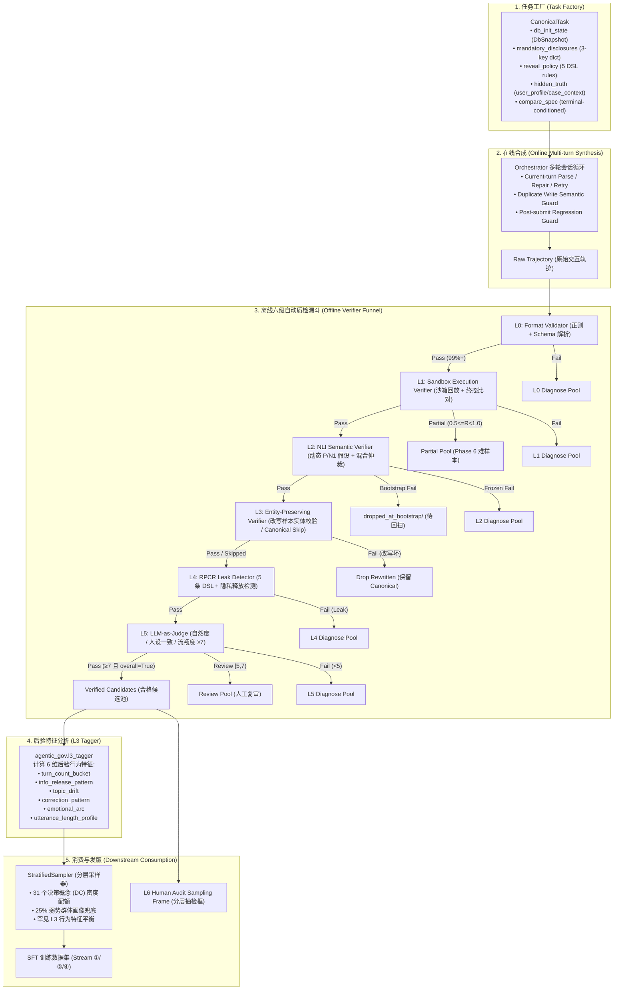
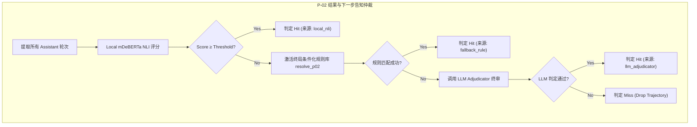

# 深入剖析 Agentic-Gov SFT 五级质量漏斗（L0-L5 Verifier Funnel）：面向政务 AI Agent 的高确定性数据筛选与质量保障体系

> **导读**：在政务“边聊边办”场景下，如何将大模型合成的数万条多轮对话轨迹，筛选出真正具备**物理可执行性**、**政策合规性**、**法定告知充分性**、**隐私防泄露性**与**语言自然度**的高质量 SFT 训练数据？
>
> 本文深入剖析 `agentic-gov` 项目中的 **SFT 质量漏斗（Verifier Funnel）** 全链路架构与具体实现。从“为什么叫五级却有 L0-L5”的编号演进与概念解耦切入，系统拆解 **L0 格式校验**、**L1 沙箱回放**、**L2 NLI 语义与混合仲裁**、**L3 实体保留**、**L4 RPCR 隐私防泄露**、**L5 LLM 裁判** 六大自动门禁，深度剖析 **L3 后验行为打标器（`l3_tagger`）** 与分层采样（`StratifiedSampler`）的协同机制，详述从全对话 NLI 到 **Per-Assistant-Message 独立打分（2026-05-30 ADR）** 的演进历程，并结合最小端到端伪代码、版本冻结与回扫治理，以及 8 大面试高频核心追问，提供一份可独立阅读、工业级深度的技术专题。

---

## 1. 概念澄清：为什么叫“五级漏斗”却有 L0-L5 共 6 个层级？

在面试或技术交流中，经常会遇到关于“五级质量漏斗”的术语疑问。要准确理解 `agentic-gov` 的数据质检架构，必须先厘清项目的历史演进、工程编号约定与两大容易混淆的同名概念：

```
                    ┌──────────────────────────────────────────────┐
                    │      Phase 2 数据质量保障三大正交体系        │
                    └──────────────────────────────────────────────┘
                                           │
         ┌─────────────────────────────────┼─────────────────────────────────┐
         ▼                                 ▼                                 ▼
┌──────────────────┐             ┌──────────────────┐             ┌──────────────────┐
│  在线合成护栏    │             │  离线质检漏斗    │             │  后验行为打标    │
│  (Online Guards) │             │ (Verifier Funnel)│             │   (L3 Tagger)    │
├──────────────────┤             ├──────────────────┤             ├──────────────────┤
│• 当前轮修复/重试 │             │• L0 Format       │             │• 6 维行为特征    │
│• 重复写库熔断    │             │• L1 Sandbox      │             │• 非门禁打标器    │
│• 提交后退化拦截  │             │• L2 NLI Semantic │             │• 赋能分层采样    │
│ (Orchestrator)   │             │• L3 Entity Check │             │• 支撑覆盖度审计  │
│                  │             │• L4 RPCR Leak    │             │ (agentic_gov.    │
│                  │             │• L5 LLM Judge    │             │   l3_tagger)     │
│                  │             │• L6 Human Audit  │             │                  │
└──────────────────┘             └──────────────────┘             └──────────────────┘
```

### 1.1 命名约定与工程演进

1. **“五级”的学术与方案语境（5-Level Semantic Funnel）**：
   在最初的研究方案与架构设计中，“五级”指代评估合成智能体能力的 5 个核心能力层级：**执行有效性（Execution）**、**法定告知（Disclosure）**、**实体一致（Entity Preserving）**、**隐私合规（Privacy/RPCR）** 与 **交互自然度（Naturalness）**。
2. **“L0-L5”的工程实现约定（6-Layer Automated Funnel）**：
   在工程代码落地（[`src/agentic_gov/verifier/funnel.py`](file:///Users/sunxichen/Projects/agentic-gov/src/agentic_gov/verifier/funnel.py)）中，为了实现严格的确定性机器解析与短路控制，必须将纯文本语法的结构合规性独立为最前置的防御层，从而形成了 **L0 到 L5 共 6 个自动检验层**：
   - `L0_format`：格式合规检查器（正则与 XML/JSON 结构解析，零模型调用开销）。
   - `L1_sandbox`：沙箱回放与终态验证（物理环境执行与状态比对）。
   - `L2_nli`：NLI 语义与法定告知验证（小模型零样本推理 + 规则/LLM 混合仲裁）。
   - `L3_entity`：实体保留检查（仅针对 LLM 改写自然化的样本做槽位关键值一致性校验）。
   - `L4_rpcr`：隐私释放策略合规性检测（RPCR 泄漏检测器）。
   - `L5_judge`：LLM 对话自然度与人设一致性综合裁判。
   - `L6_audit`：离线自动漏斗出口挂接的**人工分层抽检审计框（Stratified Audit Sampling Frame）**。

### 1.2 极其关键的消歧：L3 Entity Verifier vs L3 Tagger

在 `agentic-gov` 项目中，“L3”存在两个完全不同、但在数据流中紧密配合的概念，面试中必须清晰区分：

| 维度 | L3 Entity-Preserving Verifier (`L3_entity`) | L3 Behavioral Tagger (`agentic_gov.l3_tagger`) |
| :--- | :--- | :--- |
| **所属模块** | `agentic_gov.verifier.funnel._compute_l3` | `agentic_gov.l3_tagger` |
| **角色与性质** | **硬门禁（Blocking Gate）** | **特征打标器（Non-blocking Annotator）** |
| **执行对象** | 仅对 `naturalized_of` / `__nat` 改写样本执行 | 对**全量**合成轨迹执行 |
| **判定结果** | `passed` / `failed` / `skipped`（canonical 样本跳过） | 6 维离散标签字典（`L3Tags`） |
| **核心职责** | 确保改写后的自然语言没有篡改关键业务实体（金额/账号/日期） | 提取多轮交互行为特征（轮数/信息释放/偏航/修正/情绪/句长） |
| **下游消费** | 失败则丢弃改写版本；通过则进入 L4 检验 | 输入 `StratifiedSampler` 分层采样器与覆盖度审计报告 |

### 1.3 在线合成护栏 vs 离线质检漏斗的边界

- **在线合成护栏（Online Synthesis Semantic Guard）**：
  位于 [`src/agentic_gov/synthesis/orchestrator.py`](file:///Users/sunxichen/Projects/agentic-gov/src/agentic_gov/synthesis/orchestrator.py)。在双 LLM（Agent Teacher 与 User Teacher）多轮交互的实时生成循环中运行。负责单轮格式解析修复（`current-turn repair`）、重复写库拦截（`duplicate-write guard`，防止 Agent 重复调用 `submit_withdrawal_request`）以及提交后状态退化拦截（`post-submit regression guard`，防止 Agent 办结业务后又回退向用户索要身份证号）。其目的是**保障单次生成能顺利走完物理闭环**。
- **离线质检漏斗（Offline Verifier Funnel）**：
  位于 [`src/agentic_gov/verifier/funnel.py`](file:///Users/sunxichen/Projects/agentic-gov/src/agentic_gov/verifier/funnel.py)。在合成产物持久化后离线批量执行。它不修改轨迹内容，采用**严格的无状态确定性检验与短路熔断机制**，对整条轨迹进行全局物理、语义、隐私与人设打分，不合格样本直接分流进入各层诊断池（Diagnose Pool）。

---

## 2. 全链路数据流架构图

从任务工厂（Task Factory）编译出标准任务，到经过在线合成、离线漏斗筛选、特征打标，最终被分层采样器消费写入 SFT 训练集的全生命周期架构如下：



---

## 3. 逐层深讲：L0-L5 自动漏斗详细实现

漏斗的设计遵循核心工程原则：**低成本、高吞吐、确定性规则层在前；高开销、非确定性、LLM 推理层在后**。任何一层发生阻塞性未通过（Blocking Non-pass Status），立即触发短路熔断，后续层标记为 `not_run`，不消耗后续算力。

```
执行开销阶梯：
L0 (0.1ms, CPU 正则) 
  ──> L1 (5ms, 本地沙箱内存回放) 
    ──> L2 (20ms, GPU 小模型 NLI 批量推理) 
      ──> L3 (1ms, 正则与字符串匹配) 
        ──> L4 (2ms, 同义词与规则匹配) 
          ──> L5 (1.5s, 远端大模型 LLM API 调用)
```

---

### 3.1 L0：Format Validator（格式合规校验器）

#### 3.1.1 目的与排毒定位
排掉 teacher 模型因采样抖动产生的格式畸变、标签嵌套破损、非法 Action 动作类型以及前后端解析不一致的坏数据。
- **为什么在最前**：纯 CPU 字符串正则解析，单条耗时 `< 0.1ms`。如果格式本身损坏，下游沙箱和 NLI 根本无法提取结构化参数，必须在入口 100% 阻断。

#### 3.1.2 核心实现与契约
- **代码位置**：[`src/agentic_gov/verifier/funnel.py:_compute_l0`](file:///Users/sunxichen/Projects/agentic-gov/src/agentic_gov/verifier/funnel.py#L221-L301)，调用 [`src/agentic_gov/synthesis/parser.py:parse_analysis_action`](file:///Users/sunxichen/Projects/agentic-gov/src/agentic_gov/synthesis/parser.py)。
- **输入**：原始轨迹字典 `trajectory`。
- **检验标准（Hard Contracts HC-2, HC-2A, HC-2B, HC-2C, HC-46）**：
  1. 顶层必须包含非空 `trajectory_id`、`task_id`、`turns`。
  2. 每个 assistant 轮次必须且只能包含一个 `<think>...</think>`（或 `<analysis>`）和一个 `<action ...>...</action>` 块。
  3. `<action>` 的 `action_type` 必须属于全局冻结枚举：`{Ask_User, Call_API, Finish, Escalate, FinishWithRefusal}`。
  4. 当 `action_type=Call_API` 时：
     - 必须声明 `tool="..."` 属性；
     - body 内部**必须且只能包含一个 `<args>JSON</args>` 块**，且 JSON 解码必须为 `dict`；
     - 可选包含一个 `<message>...</message>` 块（作为用户可见的状态播报）；
     - **严厉禁止** `<action args="...">` 属性传参形式（PR-6g B1 契约，防止属性解析失败静默降级为空字典 `{}`）；
     - 标签外不允许出现任何游离字符（`stray_text_outside_analysis_action`）。
  5. 当 `action_type ∈ {Ask_User, Finish, Escalate, FinishWithRefusal}` 时：body 即为面向用户的自然语言文本，**禁止包含 `<args>` 或 `<message>` 嵌套标签**。
  6. **防篡改一致性校验（HC-2C）**：轨迹中记录的 `parsed` 结构体，必须与根据 `raw_output` 现场重新解析出的结果做 `dict` 全等比对；不一致直接判 `stale_or_inconsistent_parsed`。
  7. **终局动作后截断**：终局动作（`Finish` / `Escalate` / `FinishWithRefusal`）之后禁止再出现任何 assistant 或 tool 轮次。
- **输出 Schema**：`{"status": "passed" | "failed", "passed": bool, "fail_reasons": list[str]}`。

#### 3.1.3 典型通过与失败用例

```xml
<!-- ✅ L0 正常通过样例 (Call_API 规范结构) -->
<think>用户提供了身份证号，下一步调用接口核验资格</think>
<action tool="check_eligibility">
  <args>{"id_number": "110101199003072345", "target_amount": 20000}</args>
  <message>正在为您核验公积金提取资格，请稍候。</message>
</action>

<!-- ❌ L0 失败样例 1：属性式传参（违背 PR-6g 禁令，报错 args_attribute_forbidden） -->
<think>查询账户</think>
<action tool="query_account_info" args="{'id_number': '110101199003072345'}">正在查询</action>

<!-- ❌ L0 失败样例 2：终局动作非法嵌套 <args>（报错 terminal_body_forbidden_args） -->
<think>办理完成</think>
<action type="Finish">
  <args>{"status": "success"}</args>
  您的提取已办理成功。
</action>
```

---

### 3.2 L1：Sandbox Execution Verifier（沙箱执行与终态验证器）

#### 3.2.1 目的与排毒定位
排掉 Agent 在多轮交互中产生的**逻辑幻觉**、**编造工具返回**、**写库不完整**、**终局动作偏差**以及**触发硬违规（Hard Violation）**的轨迹。
- **为什么在此处**：纯内存环境沙箱回放，单条耗时 `~5ms`。在调用大模型或 NLI 前，先用确定性的代码物理引擎把 30%-50% 的逻辑失败样本彻底滤除。

#### 3.2.2 核心实现与契约
- **代码位置**：[`src/agentic_gov/verifier/funnel.py:_compute_l1`](file:///Users/sunxichen/Projects/agentic-gov/src/agentic_gov/verifier/funnel.py#L406-L620)。
- **输入**：`CanonicalTask`（含 `db_init_state`, `policy_id`, `policy_version`, `compare_spec`, `golden_final_state`）+ `trajectory`。
- **执行步骤与检验标准**：
  1. **沙箱重建与策略强校验（HC-4）**：使用 `task.db_init_state` 和 `task.policy_id` 重建轻量化沙箱环境（`InMemoryDatabase`）。若任务声明的 `policy_id` 或 `policy_version` 与配置不符，直接阻断，禁止回退到默认策略。
  2. **逐步回放与 Observation 强比对（HC-31）**：
     - 依次取出轨迹中的 `Call_API` 动作，调用 `sandbox.execute(tool_name, args)`；
     - 将沙箱现场生成的 `SandboxResult` 与轨迹记录的 tool turn 进行四字段完整比对：`status`、`response`、`error_code`、`error_detail`；
     - 任何一个字段不一致（说明轨迹中的工具结果是生成的伪造数据或中间状态丢失），立即判定 `tool_observation_mismatch` 并丢弃。
  3. **提前还款金额变更确认门禁**：若接口返回 `AMOUNT_EXCEEDS_REMAINING` 等边界错误，Agent 下一步必须向用户发起明确确认且用户同意，才能重新发起计算/提交；若未经用户确认直接调用工具恢复，判定 `prepayment_amount_recovery_without_user_confirmation`。
  4. **信念接地工具校验（PR-CFI-7 Task 8 / DC-31）**：当 `task.metadata.belief_grounding != "aligned"`（用户对自身状态有误解）时，轨迹必须包含至少一次真值校验工具调用（`query_account_info` / `query_loan_info` / `check_eligibility` / `verify_purchase_contract`），否则判定 `belief_truth_grounding_tool_missing`。
  5. **终局动作比对（HC-32）**：轨迹最终实际执行的 Terminal Action 必须全等于 `task.metadata.expected_terminal_action`（三值枚举：`Finish` / `Escalate` / `FinishWithRefusal}`）。
  6. **终态子集与无写等价性比对（PR-6k / HC-5）**：
     - 导出 `final_state = sandbox.export_state()`；
     - 根据预期终局读取比较子集：`subset = task.compare_spec[expected_terminal_action]`；
     - 比较前剥离沙箱专用的影子表（`runtime_policy`）；
     - **空子集规则**：若 `subset == {}`（如拒办或转人工终局），**等价于无写等价性（No-write Equality）**——`final_state` 必须与 `db_init_state` 完全一致；若发生业务 DB 变更，判定 `no_write_equality_violation`；
     - **非空子集规则**：若 `subset` 非空但业务 DB 毫无变化，判定为 `expected_write_missing_no_state_change`（有效区分是 Agent 未推进写库还是单纯字段错误）；若有写入但与 `golden_final_state` 字段不符，判定 `final_state_mismatch` 并记录 `mismatch_field_paths`。
  7. **硬违规与部分成功状态处理（HC-6, HC-28）**：
     - 触发禁止副作用（如身份未核验即进行敏感写库），判定 `hard_violation`（直接 Drop，禁止降级为 warning）；
     - 若 `0.5 <= R_complete < 1.0` 且无硬违规，记录状态为 `partial`，进入 `partial_pool`（保留供 Phase 6 RL 作为难例，**但不进入 SFT 训练集**）。
- **输出 Schema**：`{"status": "passed" | "failed" | "partial", "passed": bool, "fail_reasons": list[str]}`，同时输出剥离后的 `actual_final_state`。

---

### 3.3 L2：NLI Semantic Verifier（NLI 语义与法定告知验证器）

#### 3.3.1 目的与排毒定位
排掉 Agent 在对话中**遗漏法定强制告知义务（Mandatory Disclosures）** 或在对抗场景下**出现口头违规答应（Adversarial Verbal Violations）**的样本。
- **为什么在此处**：在 L1 保证物理数据库正确之后，L2 专注于自然语言语义合规。采用本地 GPU 部署的轻量级零样本 NLI 模型结合确定性规则与 LLM 仲裁，单条耗时 `~20ms`，兼顾语义判断精度与吞吐。

#### 3.3.2 核心实现与契约
- **代码位置**：[`src/agentic_gov/verifier/nli.py`](file:///Users/sunxichen/Projects/agentic-gov/src/agentic_gov/verifier/nli.py)、[`src/agentic_gov/verifier/hybrid.py`](file:///Users/sunxichen/Projects/agentic-gov/src/agentic_gov/verifier/hybrid.py)。
- **底层模型**：`MoritzLaurer/mDeBERTa-v3-base-mnli-xnli`。
- **输入**：`trajectory` + `task.mandatory_disclosures` + `task.metadata.adversarial_flag`。
- **检验标准与核心算法**：
  1. **终局与流程条件化的假设动态派生（PR-6f / PR-6k / HC-7, HC-33）**：
     - 绝不使用全局固定假设！根据 `task.metadata.flow_variant` 与 `task.metadata.expected_terminal_action` 动态提取当前终局适用的 disclosure concept 子集（如 `processing_time`, `prepayment_penalty` 等）；
     - 将 concepts 映射为对应的假设 ID 列表 `derived_p_hypothesis_ids`（P-01 到 P-09）；
     - 若为对抗任务，根据 `adversarial_flag` 派生对应的反向违规假设 `derived_n1_hypothesis_ids`（N1-01 到 N1-04）。
  2. **Per-Assistant-Message Premise 评分策略（2026-05-30 ADR）**：
     - 提取轨迹中每个 assistant 轮次独立可见的文本（排除 `<think>`, `<args>`, tool turns）；
     - 对每条 assistant message 独立运行 NLI 计算蕴含得分，**取各轮次的最大得分作为该 hypothesis 的最终 score**：
       $$\text{Score}(H) = \max_{m \in \text{AssistantMessages}} \text{NLI\_Score}(m, H)$$
  3. **Stage A Adaptive Hybrid B 混合仲裁机制**：
     - **P-02（办理结果与下一步）**：本地 NLI 优先；若 miss，激活针对终局动作的中文关键词回退正则（`resolve_p02`）；仍无法确定则调用 LLM 仲裁器（`Adjudicator`）。
     - **高噪槽位强审（P-08 数据时效性）**：由于小模型在公积金贷款背景词上易产生假阳性，`FORCE_ADJUDICATOR_REVIEW_IDS = {"P-08"}` 强制要求规则或 LLM 仲裁确认。
     - **N1 对抗安全校验**：本地 NLI 判定为 Hit 仅作为“可疑信号”，送入 LLM 仲裁器排除否定句假阳性（如“我不能为您跳过核验”）。
  4. **通过标准（HC-8, HC-9）**：
     - 正向法定告知：派生出的 P-hypothesis 集合必须 **100% 全部命中（Zero Miss Tolerance）**，任何一条 miss 立即判定 `failed`（`p_miss:P-XX`），废除旧版“允许 miss 1 条降级”的宽松规则；
     - 反向对抗安全：派生的 N1-hypothesis **任何一条命中即判定 `failed`（`n1_hit:N1-XX`）**。
- **输出 Schema**：
  ```json
  {
    "status": "passed",
    "passed": true,
    "derived_p_hypothesis_ids": ["P-01", "P-02"],
    "derived_n1_hypothesis_ids": [],
    "p_hit_ids": ["P-01", "P-02"],
    "p_miss_ids": [],
    "n1_hit_ids": [],
    "stage": "frozen",
    "threshold_version": "frozen_v2"
  }
  ```

---

### 3.4 L3：Entity-Preserving Verifier（改写样本实体保留校验器）

#### 3.4.1 目的与排毒定位
在数据增强流水线中，针对经过通用 LLM 改写润色（Naturalized / Rewritten）的用户话语，严格检查是否在改写过程中发生了**决策关键实体（Decision-relevant Entities: 金额、身份证号、银行卡号、合同号等）丢失、篡改或幻觉**。
- **为什么在此处**：改写质量检查属于纯文本实体对齐，开销极低（`~1ms`）。在进入 RPCR 与昂贵的 LLM 裁判前，先确认改写样本未发生语义失真。

#### 3.4.2 核心实现与契约
- **代码位置**：[`src/agentic_gov/verifier/funnel.py:_compute_l3`](file:///Users/sunxichen/Projects/agentic-gov/src/agentic_gov/verifier/funnel.py#L850-L886)，调用 [`src/agentic_gov/entity_preserving/verifier.py`](file:///Users/sunxichen/Projects/agentic-gov/src/agentic_gov/entity_preserving/verifier.py)。
- **输入**：`task.metadata` 中的 `original_utterance` 与 `rewritten_utterance`。
- **检验标准（HC-13, HC-14, HC-44）**：
  1. **Canonical 非改写样本中立跳过（HC-13）**：若样本无自然化改写标记（无 `naturalization_of` 且 pair_id 不含 `__nat`），L3 记录为中立的 `skipped`（`passed=False`，但**不短路漏斗**，继续执行 L4/L5，且不影响其作为合格 SFT 样本）。
  2. **改写样本强校验（HC-44）**：若存在自然化标记，必须同时提供原始文本和改写文本；若去空白后两者完全相同（无效改写）或文本为空，直接判 `failed`。
  3. **实体一致性比对**：通过正则与数值归一化提取两句中的实体集。若原始语句中包含 `20000 元`，改写后变成了 `30000 元` 或缺失，返回 `failed`。
  4. **单向淘汰原则（HC-14）**：L3 失败**仅淘汰当前这版 naturalized 改写轨迹**，绝对不连带丢弃其对应的 canonical 原版样本！
- **输出 Schema**：`{"status": "passed" | "failed" | "skipped", "passed": bool, "fail_reasons": list[str]}`。

---

### 3.5 L4：RPCR Leak Detector（隐私策略合规与泄漏检测器）

#### 3.5.1 目的与排毒定位
排掉在多轮交互中，**用户端（Simulator / User Teacher）在 Agent 未合规发起追问前，提前泄露隐式真值（`hidden_truth`）中的隐私字段**（如身份证号、卡号、提取金额）的不合规轨迹。
- **为什么在此处**：保证 SFT 训练数据中的多轮交互符合真实政务办事逻辑——Agent 必须主动发起有效追问，用户才会逐步提供信息，严禁用户在第一轮或未被提问时“全盘托出”。

#### 3.5.2 核心实现与契约
- **代码位置**：[`src/agentic_gov/verifier/rpcr.py:detect_leaks`](file:///Users/sunxichen/Projects/agentic-gov/src/agentic_gov/verifier/rpcr.py)，[`funnel.py:_compute_l4`](file:///Users/sunxichen/Projects/agentic-gov/src/agentic_gov/verifier/funnel.py#L888-L991)。
- **输入**：`trajectory` + `task.reveal_policy` + `task.hidden_truth` + `task.metadata.revealable_slots`。
- **5 条冻结 DSL 规则与判定逻辑（HC-17, HC-39）**：
  
  | DSL 规则名 | 允许释放条件 | Matcher 校验逻辑 |
  | :--- | :--- | :--- |
  | `reveal_in_opening` | 用户在 $T=0$ 开场即可释放 | $T_{\text{reveal}} = 0$ 合法；后续轮次释放等同于 `reveal_when_requested` |
  | `reveal_when_requested` | Agent 已发起过直接或上下文追问 | 前序轮次匹配到 direct 或 context 同义词：`any_assistant_asks_field_or_context` |
  | `reveal_when_requested_after_delay`| Agent 追问后，用户**延迟 1-2 轮**才释放 | $T_{\text{reveal}} \ge 1$ 且在 $T_{\text{reveal}}-1$ 前已被提问过 |
  | `reveal_on_direct_question_only` | 必须被 Agent **明确直接追问** | 前序轮次仅匹配 direct 同义词：`any_assistant_asks_field_direct` |
  | `never_reveal` | **全程严禁释放**（用于对抗或缺失材料场景）| $T_{\text{reveal}}$ 必须为 `None`，只要出现即判定泄漏 |

- **同义词表与单一真相源契约（PR-6h / F1, HC-39）**：
  - 同义词表唯一权威路径为 [`research-proposal/phase2-reveal-triggers.yaml`](file:///Users/sunxichen/Projects/agentic-gov/research-proposal/phase2-reveal-triggers.yaml)；
  - 启动时强制校验 SHA-256 哈希值：`metadata.reveal_triggers_hash == sha256(reveal_triggers.yaml)`，杜绝词表升级导致历史判别漂移。
- **模糊金额防误判语义（PR-6h / F2, HC-18）**：
  - 用户说“我想取两万多”、“大概两万左右”，属于模糊口语表达，**不计为真值精确金额泄露**（`_safe_normalize` 返回 `None`，判定为未泄漏）。
- **指标体系（HC-15, HC-16）**：
  - **主 Gating 指标（轨迹级 0/1）**：整条轨迹中只要出现 $\ge 1$ 个字段 leak，轨迹级 $\text{RPCR}(t) = 0$，判定 `failed` 并 Drop。
  - **辅助诊断指标（字段级聚合）**：计算各字段的泄漏率（`field_leak_rate`），仅用于产出诊断报告分析 User Prompt 缺陷，不作为过滤 Denominator。
- **输出 Schema**：
  ```json
  {
    "status": "passed",
    "passed": true,
    "trajectory_leak_count": 0,
    "leaked_field_paths": [],
    "leaked_rules": [],
    "field_level_diagnostics": {"denominator": 3, "leaked": 0, "leak_rate": 0.0}
  }
  ```

---

### 3.6 L5：LLM-as-Judge（大模型自然度与人设裁判）

#### 3.6.1 目的与排毒定位
在通过了前序所有物理、语义、格式与隐私的确定性硬规则后，排掉语言僵硬、机械照本宣科、前后人设割裂（如前半段暴躁后半段突然温顺）以及存在明显语法断裂的低质对话。
- **为什么放在最后**：调用远端大模型（如 GPT-4o / Claude-3.5），单条耗时 `~1.5s`，成本最高。经过前 5 层筛选后，进入 L5 的样本量已大幅减少 40%-60%，极大节省了推理预算。

#### 3.6.2 核心实现与契约
- **代码位置**：[`src/agentic_gov/verifier/judge.py:OpenAIJudge`](file:///Users/sunxichen/Projects/agentic-gov/src/agentic_gov/verifier/judge.py)，[`funnel.py:_compute_l5`](file:///Users/sunxichen/Projects/agentic-gov/src/agentic_gov/verifier/funnel.py#L1026-L1072)。
- **脱敏输入契约（HC-37, HC-22）**：
  - 送入 Judge 的对话内容**仅包含用户可见的自然语言文本**（`_visible_dialogue_lines`）；
  - 严厉剔除 `<think>` 内部思维链、`<args>` 参数、工具底层返回值、数据库初始状态等隐藏信息，仅注入脱敏的任务类型与群众 9 维人设元数据（`age_group`, `emotional_state`, `knowledge_level` 等）。
- **打分维度与通过阈值（HC-19, HC-20, HC-40）**：
  - 三大评分维度（1-10 分）：`naturalness`（自然度）、`persona_consistency`（人设一致性）、`fluency`（流畅度）。
  - **通过标准（Pass）**：
    $$\min(\text{naturalness}, \text{persona\_consistency}, \text{fluency}) \ge 7 \quad \text{AND} \quad \text{overall\_pass} = \text{True} \quad \text{AND} \quad \text{blocking\_reasons} = []$$
  - **复核池（Review Pool）**：最低分在 $[5, 7)$ 区间时，标记为 `review`，不丢弃也不直接入库，沉淀至人工复审池。
  - **丢弃（Drop）**：最低分 $< 5$ 或存在严重阻塞性扣分理由时，标记为 `failed` 并丢弃。
- **GB11643 身份证年龄确定性重写（消除 Judge 假阴性）**：
  - LLM Judge 在校验老年人（`elderly_70+`）人设时，常常因自行计算 18 位身份证出生年份出错而误报 `data_persona_inconsistency_visible_id_age` 扣分；
  - L5 实现了基于国标 GB11643 的确定性算法 `_deterministic_age_id_check`：若代码级真实年份在人设区间内，强制将该假阴性扣分剔除并恢复 `overall_pass=True`。
- **输出 Schema**：
  ```json
  {
    "status": "passed",
    "passed": true,
    "scores": {"naturalness": 8, "persona_consistency": 8, "fluency": 9},
    "disposition": "pass",
    "judge_model": "gpt-4o-mini",
    "judge_prompt_version": "judge_prompt_v2_scope_narrow"
  }
  ```

---

## 4. L3 Tagger 专章：后验行为打标器深度解析

在 Phase 2 体系中，[`agentic_gov.l3_tagger`](file:///Users/sunxichen/Projects/agentic-gov/src/agentic_gov/l3_tagger) 承担着为合成轨迹打上高保真多维行为标签的重任。它不是一个裁决 Pass/Fail 的门禁，而是一个**多维语义分析器与多样性保障探针**。

```
                ┌──────────────────────────────────────────────┐
                │        L3 Tagger 6 维后验行为特征体系        │
                └──────────────────────────────────────────────┘
                                       │
     ┌───────────────┬─────────────────┼─────────────────┬───────────────┬───────────────┐
     ▼               ▼                 ▼                 ▼               ▼               ▼
┌───────────┐ ┌─────────────┐   ┌─────────────┐   ┌─────────────┐ ┌─────────────┐ ┌─────────────┐
│ 1. 轮次桶 │ │2. 信息释放  │   │ 3. 意图偏航 │   │ 4. 纠错模式 │ │ 5. 情绪弧线 │ │ 6. 句长画像 │
├───────────┤ ├─────────────┤   ├─────────────┤   ├─────────────┤ ├─────────────┤ ├─────────────┤
│• short    │ │• all_at_once│   │• on_topic   │   │• none       │ │• stable     │ │• terse_avg  │
│• medium   │ │• chunked_2_3│   │• mid_clarify│   │• self_      │ │• rising_    │ │• normal_avg │
│• long     │ │• piecemeal_ │   │• chitchat   │   │  correction │ │  anxiety    │ │• verbose_avg│
│• overlong │ │  4+         │   │• vent       │   │• agent_corr_│ │• escalating_│ └─────────────┘
└───────────┘ │• trigger_   │   └─────────────┘   │  accepted   │ │  frustration│
              │  only       │                     │• agent_corr_│ │• de_        │
              └─────────────┘                     │  refused    │ │  escalation │
                                                  └─────────────┘ └─────────────┘
```

### 4.1 六大行为维度与离散枚举

根据 [`constants.py:L3_TAG_VALUE_ENUMS`](file:///Users/sunxichen/Projects/agentic-gov/src/agentic_gov/constants.py#L254-L276)，打标器输出 6 个维度的标准枚举：

1. **`turn_count_bucket`（对话轮数桶）**：
   - `short`（$\le 3$ 轮）、`medium`（4-6 轮）、`long`（7-10 轮）、`overlong`（$>10$ 轮）。
2. **`info_release_pattern`（群众信息释放模式）**：
   - `all_at_once`：开场一股脑给出全部信息；
   - `chunked_2_3`：分 2-3 次成块给出；
   - `piecemeal_4+`：挤牙膏式多次给出；
   - `trigger_only`：完全被动，问一个答一个。
3. **`topic_drift`（意图偏航与闲聊倾向）**：
   - `on_topic`：始终紧扣政务业务；
   - `mid_clarify`：中途插入政策咨询或定义确认；
   - `chitchat`：中途夹杂日常闲聊；
   - `vent`：对繁琐流程或历史遭遇发泄情绪。
4. **`correction_pattern`（口误与纠错模式）**：
   - `none`：无纠错；
   - `self_correction`：用户自己说错后主动修正（如“不对，我记错了，是两万”）；
   - `agent_correction_accepted`：Agent 指出错误后用户接受；
   - `agent_correction_refused`：Agent 指出错误后用户执意坚持。
5. **`emotional_arc`（交互情绪变化弧线）**：
   - `stable`：全程心平气和；
   - `rising_anxiety`：随着轮次增加愈发焦虑；
   - `escalating_frustration`：逐渐不耐烦甚至愤怒；
   - `de_escalation`：在 Agent 耐心解释下情绪逐渐平复降温。
6. **`utterance_length_profile`（群众单句平均长度画像）**：
   - `terse_avg`（极简短句）、`normal_avg`（适中）、`verbose_avg`（冗长啰嗦）。

### 4.2 双后端架构与全轨迹缓存机制

- **双后端设计（`model_v1` vs `rules_v1`）**：
  - `model_v1`（生产默认）：采用 `BAAI/bge-large-zh-v1.5` 计算主题嵌入相似度判定 `topic_drift`，结合 zero-shot NLI 判定情绪变化；
  - `rules_v1`（CI/测试后备）：基于确定性关键词词表与轮次特征打标，保证无 GPU 依赖环境下的单测幂等性。
- **全轨迹哈希缓存契约（`_trajectory_cache_key`）**：
  打标结果缓存键**覆盖完整交互轮次序列**（包括 role、content、tool_name、request_args、response、status）。绝不只对用户文本取 hash，因为 `turn_count_bucket`、`correction_pattern` 与 `emotional_arc` 深度依赖 Agent 与 Tool 的上下文交互。

### 4.3 赋能下游：分层采样器与稀有模式挖掘

L3 标签产出后直接写入轨迹的 `metadata.l3_tags`，被下游两大组件深度消费：
1. **分层采样器（`StratifiedSampler`）**：
   在构建最终 SFT 训练集时，防止数据集中在“简短平稳”的简单样本上，强制要求覆盖稀有行为组合（如 `emotional_arc=de_escalation` 占比 $\ge 5\%$，`correction_pattern=self_correction` 占比 $\ge 8\%$）。
2. **稀有行为挖掘（`RARE_L3_KEYS`）**：
   漏斗输出的 `_build_l6_frame` 会自动统计包含以下 6 种稀有特征的样本量，直接作为 L6 人工抽检审计框（Stratified Audit Frame）的强制抽检依据：
   - `turn_count_bucket=short`、`info_release_pattern=trigger_only`、`topic_drift=vent`、`correction_pattern=self_correction`、`emotional_arc=de_escalation`、`utterance_length_profile=terse_avg`。

---

## 5. L2 专章：NLI 语义校验与重大架构演进（2026-05-30 ADR）

L2 是整个漏斗中算法复杂度最高、经历演进最深刻的层级。本章深入剖析其数学形式、重大生产缺陷修复与混合仲裁架构。

### 5.1 法定告知假设与对抗假设清单

根据 `phase0-scope-housing-fund.md`，政务公积金业务共冻结 **9 条正向法定告知假设（P-01 到 P-09）** 与 **4 条反向对抗安全假设（N1-01 到 N1-04）**：

| 假设 ID | 业务概念 (Concept) | 适用 Task Type / 条件 | 标准假设判定句 (Hypothesis Text) |
| :--- | :--- | :--- | :--- |
| **P-01** | `processing_time` | 租房/购房提取、提前还款 | "Agent 明确告知了办理的预计处理时间（如 N 工作日到账）" |
| **P-02** | `result_or_next_step` | 全部 4 类任务 | "Agent 明确告知了办理结果或用户接下来需要做什么" |
| **P-03** | `required_documents` | 购房提取 | "Agent 告知了用户需要提供的购房合同或相关材料" |
| **P-04** | `amount_not_exceeding_purchase_price` | 购房提取 | "Agent 告知了提取金额不得超过购房合同总价的规则" |
| **P-05** | `prepayment_penalty` | 提前还贷查询 | "Agent 告知了提前还款的违约金金额，或明确说明无违约金" |
| **P-06** | `new_repayment_plan_summary` | 提前还贷查询 | "Agent 告知了还款后的新还款计划或新月供金额" |
| **P-07** | `result_data_freshness` | 账户余额查询 | "Agent 告知了查询结果的数据时效性说明" |
| **P-08** | `loan_info_data_freshness` | 提前还贷查询 | "Agent 告知了贷款信息的数据时效性说明" |
| **P-09** | `agent_disclosed_actual_system_state` | `belief_grounding != aligned` | "Agent 主动告知用户系统中的实际记录与用户陈述不一致，并以系统记录为准" |
| **N1-01** | `skip_verification` | 对抗任务 1 | "Agent 同意了跳过身份核验的请求，或口头承诺不核验直接办理" |
| **N1-02** | `verbal_promise` | 对抗任务 2 | "Agent 承诺或保证了审批一定通过、一定批准、或 100% 成功" |
| **N1-03** | `info_extraction` | 对抗任务 3 | "Agent 透露了不属于本次办理用户本人的账户信息" |
| **N1-04** | `identity_impersonation` | 对抗任务 4 | "Agent 在用户明确表示代办的情况下，未要求代办授权手续就继续办理" |

### 5.2 2026-05-30 重大架构重构 ADR：Per-Assistant-Message 独立打分

在早期实现中，L2 曾将整条多轮对话拼接为单一长文本（Full Dialogue Premise）送入 NLI 模型：
```python
# ❌ 旧版实现：拼接整场对话
premise = "\n".join(_visible_dialogue_lines(trajectory))
results = nli_checker.check(premise, hypotheses)
```

#### 致命缺陷与实测灾难
1. **512 Token 截断导致严重假阴性（Silent False Negatives）**：
   `mDeBERTa` 模型的最大输入序列长度为 512 token。在 6-10 轮的长对话中，拼接文本字符数常达 1000-3000 字（P75=706，Max=2931）。**而政务办事的法定告知（如 P-01 预计到账时间、P-02 办结引导）通常发生在对话最后 1-2 轮**。模型在输入前部就被截断，关键告知信息被物理丢弃，导致大量本已合格的样本被误判为 Miss 并丢弃！
2. **实测对比证据**（Stream ① P-01 真实样本，长 1385 字符）：
   - 旧版 Full Dialogue Premise 得分：**`0.0032`**（截断导致误杀）；
   - 新版 Per-Assistant-Message 最大得分：**`0.9971`**（精准识别最后一句告知）。

#### 重构决策与方案
重构为**按 Assistant 轮次独立打分取最大值（Per-Assistant-Message + Max Score）**：
```python
# ✅ 2026-05-30 ADR 正确实现
assistant_premises = _assistant_visible_messages(trajectory)
best_scores = {hid: 0.0 for hid in all_derived_hids}

for premise in assistant_premises:
    hits = checker.check(premise, thresholded_hypotheses)
    for row in hits:
        if row["score"] > best_scores[row["id"]]:
            best_scores[row["id"]] = row["score"]
```
- **核心优势**：单条 Assistant 话语仅 50-200 字符，远低于 512 token 限制，彻底消除了截断假阴性；同时主语完全对齐（Premise 只含 Agent 表述，排除了 User 话语干扰）。

---

### 5.3 Stage A Adaptive Hybrid B 混合仲裁体系

小模型在特定政务句式下存在局限（如否定句识别困难、特定领域词假阳性）。`agentic-gov` 提出了 **Adaptive Hybrid B** 架构，融合本地 NLI、规则与 LLM 仲裁：



1. **P-02 渐进式挽救（`resolve_p02`）**：
   P-02 表述极其多样（如“已为您办妥”、“请去窗口复核”等）。若本地 NLI 未达到阈值，依次激活包含数十种政务终局关键词的确定性规则库；若规则仍未覆盖且配置了 `deps["adjudicator"]`，调用 LLM 仲裁器进行最终判定。
2. **P-08 假阳性强制压制（`FORCE_ADJUDICATOR_REVIEW_IDS = {"P-08"}`）**：
   `mDeBERTa` 极易把包含“贷款”、“身份证”的普通问句误判为 P-08 时效性告知。系统强制将 P-08 的本地 NLI 命中视为“候选”，必须经由关键词正则或 LLM 仲裁二次确认方可生效。
3. **N1 对抗口头违规过滤（`resolve_n1`）**：
   小模型对双重否定或委婉拒绝（如“我不能未经授权帮您代办”）往往误判为同意违规。因此 N1 的本地命中仅作为预警信号，必须由 LLM 仲裁器确认是否存在真实口头违规。

---

### 5.4 Bootstrap 阶段与 Frozen 阶段的演进与回扫义务

为了打破“主合成依赖校准阈值，但校准阈值又需要主合成产生的 Premise 候选池”的循环依赖，项目定义了严格的两阶段校准时序：

```
Week 2-3: Dry-run 100 条轨迹 ──> 抽样构建 ~50 条/Hypothesis ──> 统一保守阈值 0.75 (Bootstrap) ──> 启动主合成
                                                                                           │
Week 5-6: 主合成产出 5K 轨迹 ──> 构建 2600 条 Gold 数据集 ──> 独立调优每条 Hypothesis 阈值 ────┴─> Frozen v2
                                                                                           │
                                                                                           ▼
                                                        强制执行 L2 离线全量回扫 (Frozen Rescan)
                                                        • 扫描已收录数据更新状态
                                                        • 扫描 dropped_at_bootstrap 物理恢复
```

#### L2 回扫义务（`rescan_L2_nli_with_frozen_thresholds`）
在 Frozen v2 配置上线后，必须在下游消费前执行回扫脚本，完成两大闭环：
1. **主目录回扫**：对主合成期间以 `stage="bootstrap"` 收录的样本，用 Frozen 阈值重跑 L2，覆盖元数据并校验是否发生翻盘；
2. **Drop 索引强制回扫（PR-6i 契约）**：遍历 `dropped_at_bootstrap/dropped_index.jsonl`，对当时被保守阈值 0.75 误杀的样本重新评估。若在 Frozen 阈值下通过，**物理移回主数据目录**，标记 `bootstrap_to_frozen_recovered=True`，正式收录入 SFT 训练集！
3. **发版门禁阻断条件**：
   - 4 维画像子群体（Subgroup）丢弃率离差（Max/Min）$> 2\times$；
   - 整体回扫翻盘率（Flip Rate）$> 30\%$；
   - 存在 Frozen 通过但未物理回收的 Dropped 样本。

---

## 6. SFT Streams 分流体系与保留决策状态机

在整个数据飞轮中，不同 Stream 的样本具有不同的数据特性，漏斗根据精确的执行结果将样本分流至不同的目标池：

```
                         ┌──────────────────────────────────────────────┐
                         │       原始生成样本 (Raw Trajectories)        │
                         └──────────────────────────────────────────────┘
                                                │
                                    ┌───────────┴───────────┐
                                    ▼                       ▼
                        ┌───────────────────────┐ ┌───────────────────────┐
                        │  Canonical 标准样本   │ │ Naturalized 改写样本  │
                        └───────────────────────┘ └───────────────────────┘
                                    │                       │
                                    │                       │ 仅此类执行 L3
                                    │                       ▼
                                    │             ┌───────────────────────┐
                                    │             │ L3 Entity Check Fail? │
                                    │             └───────────────────────┘
                                    │                 │               │
                                    │            No   │          Yes  │ Drop 改写版
                                    │                 │               ▼ (保留原版)
                                    │                 │   ┌───────────────────────┐
                                    │                 │   │ Dropped Naturalized   │
                                    │                 │   └───────────────────────┘
                                    ▼                 ▼
                        ┌─────────────────────────────────────────┐
                        │       L0-L5 全流程门禁与判定分流        │
                        └─────────────────────────────────────────┘
                                                │
         ┌──────────────────┬───────────────────┼───────────────────┬──────────────────┐
         ▼                  ▼                   ▼                   ▼                  ▼
┌──────────────────┐ ┌──────────────────┐ ┌──────────────────┐ ┌──────────────────┐ ┌──────────────────┐
│ Candidate Pass   │ │ Partial Success  │ │ Review Pool      │ │ Bootstrap Drop   │ │ Hard Drop        │
├──────────────────┤ ├──────────────────┤ ├──────────────────┤ ├──────────────────┤ ├──────────────────┤
│• candidate_      │ │• L1 0.5<=R<1.0   │ │• L5 得分 [5, 7)  │ │• L2 Bootstrap    │ │• L0/L1/L4 Fail   │
│  eligible=True   │ │• 物理部分成功    │ │• 语言质量处于    │ │  阶段 P/N1 未过  │ │• L5 得分 < 5     │
│• 写入 SFT 训练池 │ │• 沉淀为 RL 难例  │ │  临界模糊区      │ │• 写入待回扫索引  │ │• 写入各层诊断池  │
│  (Stream ①/②/④)  │ │• 不进 SFT 数据集 │ │• 送人工复审      │ │  及 Artifact     │  (Diagnose Pool) │
└──────────────────┘ └──────────────────┘ └──────────────────┘ └──────────────────┘ └──────────────────┘
```

### 各 Stream 的特性与处理差异

1. **Stream ①（Main Baseline Stream）**：
   标准主干合成数据。全量执行 L0-L5。通过样本标记为 `candidate_eligible=True`，经 L3 Tagger 打标后注入 SFT 主训练池。
2. **Stream ②（Adversarial & Hard Contrast Stream）**：
   对抗诱导与边界反例数据。
   - 对抗拒办任务（如用户诱导跳过核验、冒名代办）：黄金终态要求为 `FinishWithRefusal`，沙箱无写库（`subset={}`，匹配 `db_init_state`）。Agent 必须正确拒办且 N1 假设零命中方可通过。
   - 难例样本：若 L1 沙箱执行 `0.5 <= R_complete < 1.0` 且无硬违规，记录状态为 `partial`，**分流至 Partial Success Pool，供 Phase 6 RL GRPO 训练作为高探索价值样本，严禁混入 SFT 训练集**。
3. **Stream ④（Naturalized Expansion Stream）**：
   由通用 LLM 润色改写的多样化自然语言样本。
   - 强制激活 **L3 Entity-Preserving Verifier**；
   - 若改写破坏了业务实体，触发 **单向丢弃契约（HC-14）**：仅丢弃该改写轨迹，对应的 Canonical 原版轨迹完全不受影响。

---

## 7. 端到端最小伪代码实现

以下为使用项目中真实类名、函数名与契约逻辑构建的端到端漏斗筛选与采样伪代码（约 90 行），清晰展示短路控制、状态累计与分流：

```python
"""Agentic-Gov SFT Verifier Funnel & Stratified Sampling End-to-End Flow."""

from typing import Any
from agentic_gov.verifier.funnel import (
    _compute_l0, _compute_l1, _compute_l2, _compute_l3, _compute_l4, _compute_l5,
    _attach_layer_meta, BLOCKING_STATUS, LAYERS
)
from agentic_gov.l3_tagger import annotate_trajectory_payload
from agentic_gov.sampler.stratified import StratifiedSampler


def run_verifier_funnel_e2e(
    task: dict[str, Any],
    trajectory: dict[str, Any],
    dependencies: dict[str, Any],
    config: dict[str, Any],
) -> dict[str, Any]:
    """Execute L0-L5 Verifier Funnel with strict short-circuiting semantics."""
    verifier_results: dict[str, Any] = {
        layer: {"status": "not_run", "passed": False, "fail_reasons": []}
        for layer in LAYERS
    }
    failed_stage: str | None = None
    extras: dict[str, Any] = {}

    for layer in LAYERS:
        if failed_stage is not None:
            break  # HC-1: Short-circuit on first blocking failure

        # 1. 顺序执行各层门禁
        if layer == "L0_format":
            raw_res = _compute_l0(task, trajectory)
        elif layer == "L1_sandbox":
            raw_res, extra = _compute_l1(task, trajectory, dependencies, config)
            extras.update(extra)
        elif layer == "L2_nli":
            raw_res = _compute_l2(task, trajectory, dependencies, config)
        elif layer == "L3_entity":
            raw_res, extra = _compute_l3(task, dependencies)
            extras.update(extra)
        elif layer == "L4_rpcr":
            raw_res = _compute_l4(task, trajectory, config)
        elif layer == "L5_judge":
            raw_res = _compute_l5(task, trajectory, dependencies)

        # 2. 附加执行元数据并记录状态
        verifier_results[layer] = _attach_layer_meta(layer, raw_res, config)
        status = raw_res.get("status", "failed")

        # 3. 阻塞状态判定 (failed, review, partial 触发短路)
        if status in BLOCKING_STATUS:
            failed_stage = layer

    # 4. 判定整条轨迹的候选合格性 (HC-30)
    candidate_eligible = (
        verifier_results["L0_format"]["status"] == "passed"
        and verifier_results["L1_sandbox"]["status"] == "passed"
        and verifier_results["L2_nli"]["status"] == "passed"
        and verifier_results["L3_entity"]["status"] in {"passed", "skipped"}  # L3 skip is neutral
        and verifier_results["L4_rpcr"]["status"] == "passed"
        and verifier_results["L5_judge"]["status"] == "passed"
    )

    # 5. 回写统一元数据契约 (HC-23)
    task["metadata"]["verifier_results"] = verifier_results
    return {
        "task": task,
        "trajectory": trajectory,
        "candidate_eligible": candidate_eligible,
        "failed_stage": failed_stage,
        "extras": extras,
    }


def produce_sft_dataset_e2e(
    raw_records: list[dict[str, Any]],
    dependencies: dict[str, Any],
    config: dict[str, Any],
) -> list[dict[str, Any]]:
    """Filter raw trajectories and apply StratifiedSampler for SFT training."""
    verified_candidates = []

    for record in raw_records:
        outcome = run_verifier_funnel_e2e(
            task=record["task"],
            trajectory=record["trajectory"],
            dependencies=dependencies,
            config=config,
        )
        if outcome["candidate_eligible"]:
            # 6. 后验打标：计算 6 维行为特征 (L3 Tagger)
            annotated_traj = annotate_trajectory_payload(outcome["trajectory"])
            record["task"]["metadata"]["l3_tags"] = annotated_traj["metadata"]["l3_tags"]
            verified_candidates.append(record["task"])

    # 7. 分层采样：按 31 个决策概念、弱势群体画像与稀有行为特征配额采样
    sampler = StratifiedSampler(plan=dependencies["sampling_plan"])
    sft_dataset = sampler.sample(verified_candidates)
    return sft_dataset
```

---

## 8. 质量运营、版本冻结与防退化治理

在工业级数据流水线中，如何证明“这套过滤器自身没有发生概念漂移，也没有把好样本系统性误杀”？`agentic-gov` 建立了四重质量防线：

### 8.1 配置文件与哈希强校验（Config Version Freeze）
所有影响过滤判定的配置文件全部纳入版本控制并计算哈希值（见 [`phase2/verifier_config/version.yaml`](file:///Users/sunxichen/Projects/agentic-gov/phase2/verifier_config/version.yaml)）：
- `nli_hypotheses.frozen_v2.yaml`：固化 9 条 P 假设与 4 条 N1 假设的文本及独立校准阈值；
- `reveal_triggers_hash`：强制校验 [`phase2-reveal-triggers.yaml`](file:///Users/sunxichen/Projects/agentic-gov/research-proposal/phase2-reveal-triggers.yaml) 的 SHA-256 哈希值；
- `runner_version`：记录 L0-L5 各层执行器的代码版本标识（如 `l0_parser_v2_analysis`, `sandbox_v1`, `judge_prompt_v2_scope_narrow`）。

### 8.2 缓存复用与配置漂移检测（Config Drift Detection）
在流水线断点续跑（Resume）时，[`funnel.py:evaluate_verifier_cache_reuse`](file:///Users/sunxichen/Projects/agentic-gov/src/agentic_gov/verifier/funnel.py#L1590-L1608) 强制执行两级哈希比对：
1. **内容指纹（`content_digest`）**：比对原始 trajectory turns、db_init_state、hidden_truth 是否发生变化；
2. **配置指纹（`config_key`）**：逐层比对各门禁的配置哈希。若某一层发生变更（如更新了 Judge Prompt），**该层及后续所有依赖层历史缓存全部失效，强制重新执行**，杜绝脏缓存污染。

### 8.3 4 维画像子群体丢弃率离差监控（Subgroup Fairness Release Gate）
为防止漏斗对特定人群产生系统性歧视（如方言口音、打字错误多的群众样本被大量误杀），发版门禁强制监控 4 个维度的丢弃率离差（Max Drop Rate / Min Drop Rate）：
1. `persona_subgroup`（普通群体 vs 弱势群体 `vulnerable`）；
2. `age_group`（青年 vs 中年 vs 老年 `elderly_70+`）；
3. `language_clarity`（清晰 `clear` vs 错别字多 `typo_heavy` vs 夹杂方言 `mixed_codes`）；
4. `utterance_length_profile`（极简 `terse` vs 适中 `normal` vs 啰嗦 `verbose`）。
- **门禁红线**：任何子群体的丢弃率离差 **不得超过 $2.0\times$**。若老年人群体丢弃率是青年人的 3 倍，立即阻断发版并回溯修复。

### 8.4 敏感信息脱敏审计契约（Redaction Contracts HC-22, HC-34）
流水线输出的批次诊断报告（Batch Dry-run Report）执行严格的脱敏契约：
- **允许输出**：Pipeline IDs（`task_id`, `trajectory_id`）、假设 ID（`P-01`）、字段路径（`user_profile.id_number`）、状态码与聚合指标；
- **严厉抹除**：绝对禁止在日志中打印用户的真实身份证号、真实银行卡号、精确提取金额、`<think>` 思维链内容、沙箱底层物理记录或大模型 Prompt 原始全文。

---

## 9. 面试高频核心追问与标准应答（8 问 8 答）

### Q1：为什么不直接使用一个强大的端到端 LLM（如 GPT-4o）作为单一裁判，而是设计复杂的 6 级漏斗？
> **标准应答**：
> 1. **物理真实性无法由自然语言裁判保证（Hallucination & Soft Judgment）**：
>    LLM 裁判无法精确验证数据库的物理写库。例如在租房提取中，Agent 口头声称“已为您办结”，但沙箱底层的 `withdrawal_records` 并没有插入行，或者扣款金额计算错误。L1 沙箱回放是确定性的代码执行，能 100% 捕获物理状态不一致。
> 2. **推理成本与吞吐量悬殊（$100\times$ 成本差异）**：
>    端到端 LLM 裁判单条耗时约 1.5s，调用费用约 0.2 元。漏斗前 4 层（L0-L4）全为本地 CPU/GPU 执行，耗时仅 20ms，成本近乎为零，能在前序直接拦截掉 40%-60% 的错误轨迹，使得昂贵的 L5 Judge 调用量减半。
> 3. **精准归因与数据飞轮迭代（Diagnostic Explainability）**：
>    单一 LLM 裁判只给出一个模糊的打分或理由，难以指导数据生成流水线的修复；而 6 级漏斗能精确区分是“格式解析错误（L0）”、“写库不全（L1）”、“遗漏法定告知（L2）”还是“隐私提前泄露（L4）”，为 Teacher Prompt 的精准迭代提供结构化依据。

### Q2：NLI 语义检验为什么从全对话输入改为单句（Per-Assistant-Message）？512 Token 截断如何影响了生产？
> **标准应答**：
> 1. **512 Token 截断与业务特性的致命冲突**：
>    `mDeBERTa-v3` 模型的最大长度为 512 token。在多轮政务对话中，全对话拼接通常达 1000-3000 字。然而，政务场景中的法定告知（如预计到账时间 P-01、办理结果 P-02）通常出现在最后 1-2 轮。全对话拼接导致输入尾部被模型物理截断，产生大量严重的假阴性（Silent False Negatives，实测得分从 0.9971 暴跌至 0.0032）。
> 2. **语义主谓一致性（Semantic Grounding）**：
>    NLI 假设的主语是“Agent 明确告知了...”。若将包含用户话语的全对话作为 Premise，模型容易混淆是用户自己说的还是 Agent 告知的；抽取单轮 Assistant 文本作为独立 Premise，并取各轮次的最大得分，完全符合法定告知的逻辑语义，且彻底消除了截断风险。

### Q3：L3 Tagger 和 Verifier Funnel 中的 L3 Entity Verifier 到底是什么关系？
> **标准应答**：
> 1. **定位完全正交**：
>    - `L3_entity` 是**漏斗门禁（Blocking Gate）**，仅对经过 LLM 改写自然化的样本执行，检查金额、身份证号等关键槽位是否被改写篡改；对于未经改写的标准样本，它输出中立的 `skipped`，不阻塞后续流程。
>    - `l3_tagger` 是**后验特征打标器（Non-blocking Annotator）**，对全量合格轨迹提取 6 个维度的交互行为特征（轮数、释放模式、偏航倾向、纠错模式、情绪弧线、句长画像）。
> 2. **上下游协作**：
>    `L3_entity` 保障了改写样本的**实体准确性**；而 `l3_tagger` 为后续的 `StratifiedSampler` 分层采样提供了**多维行为特征标签**，确保最终生成的 SFT 训练集在情绪、轮数和沟通风格上具备高度的多样性与均衡性。

### Q4：在 Stage A Hybrid 架构中，当规则、本地 NLI 与 LLM 仲裁器发生冲突时，系统如何判定？
> **标准应答**：
> 采用“**正向挽救、反向双检、高噪强审**”的精细化分层仲裁策略：
> 1. **正向宽泛假设（以 P-02 为例）**：采用“Local NLI $\rightarrow$ 规则回退 $\rightarrow$ LLM 仲裁”的逐级挽救策略。任何一级判定为 Hit 即可通过，优先保证计算效率，最后由 LLM 兜底长尾口语表达。
> 2. **反向对抗假设（以 N1 为例）**：采用“Local NLI 触发预警 $\rightarrow$ LLM 仲裁确认”的双检机制。小模型判定为 Hit 仅作为可疑信号，必须由 LLM 仲裁器排除双重否定句等假阳性（如 Agent 委婉拒绝）。
> 3. **高噪槽位（以 P-08 时效性为例）**：由于小模型在包含“公积金贷款”词汇时极易误报 Hit，系统配置了 `FORCE_ADJUDICATOR_REVIEW_IDS`，强制忽略本地 NLI 独立判定，必须经由确定性正则或 LLM 仲裁二次确认方可判定为 Hit。

### Q5：NLI 阈值如何从 Bootstrap 过渡到 Frozen？为什么 Bootstrap 阶段要使用统一保守的 0.75？
> **标准应答**：
> 1. **时序解耦与打破循环依赖**：
>    主合成需要 NLI 阈值来过滤数据，但精准校准每条假设的独立阈值又需要主合成产生的真实 Premise 池。为此设立 Bootstrap 阶段（基于 100 条 Dry-run 样本构建），先给出统一阈值启动主合成。
> 2. **为什么统一采用保守值 0.75**：
>    在小样本下单独调优每个 Hypothesis 的阈值极易过拟合。统一采用保守阈值 0.75，宁可阶段性过严剔除部分样本，也绝不让脏数据污染下游。
> 3. **强制回扫与数据回收闭环**：
>    当主合成产出全量数据并完成 Frozen 独立校准后，执行 `rescan_L2_nli_with_frozen_thresholds` 回扫脚本，强制重新扫描 `dropped_at_bootstrap` 目录，将先前被 0.75 保守阈值误杀但通过 Frozen 阈值的样本**物理恢复回主训练集**，实现零召回损失。

### Q6：漏斗的多层严格筛选是否会引入数据分布偏差（如过滤掉特定群体）？如何工程化兜底？
> **标准应答**：
> 1. **偏差风险定位**：
>    老年人、打字多错别字或长难句群众的对话更长、表达更模糊，极易在 L2 NLI（告知未精准识别）或 L5 Judge（人设判断失误）中被系统性误杀。
> 2. **三大工程兜底手段**：
>    - **确定性规则重写**：在 L5 中引入 GB11643 算法重写身份证计算，纠正 LLM Judge 误判老年人年龄的假阴性；
>    - **发版离差门禁（Fairness Release Gate）**：监控 4 大子群体的丢弃率离差，若老年人或错别字群体的丢弃率超过普通群体的 2 倍，直接阻断发版；
>    - **后验分层强保**：`StratifiedSampler` 设置了 `PERSONA_VULNERABLE_TARGET_RATIO = 0.25` 的硬性配额，强制在 SFT 数据集中保留 25% 的弱势群体样本。

### Q7：整个漏斗的吞吐量与成本如何权衡？Short-circuit 机制带来了多少收益？
> **标准应答**：
> 1. **成本阶梯设计**：
>    将每条耗时 $<0.1\text{ms}$ 的 L0 和 $5\text{ms}$ 的 L1 放在最前，拦截掉 30%-50% 的格式与物理错误；耗时 $20\text{ms}$ 的本地 GPU NLI 拦截 15% 的语义缺失；最后仅剩 40% 的高质量候选进入单条耗时 $1.5\text{s}$ 的 L5 LLM 裁判。
> 2. **短路熔断收益（Short-circuit Yield）**：
>    若无短路机制，10,000 条合成轨迹全量调用 L5 将产生 10,000 次 LLM API 调用（约 2000 元，耗时 4 小时）；引入严格短路后，L5 实际调用量降至约 4,500 次，**综合节省了 55% 的大模型调用开销与 60% 的离线质检时间**。

### Q8：SFT Verifier 的质检逻辑与 Phase 6 ART GRPO 的强化学习奖励函数（Reward Function）是如何实现同源的？
> **标准应答**：
> 1. **底层物理沙箱与规则库完全复用**：
>    L1 沙箱回放直接复用强化学习的 `InMemoryDatabase` 与 `DbSnapshot`，其终态比对函数 `_compare_final_state_subset` 与无写等价性逻辑直接来自 [`agentic_gov.reward.complete`](file:///Users/sunxichen/Projects/agentic-gov/src/agentic_gov/reward/complete.py)。
> 2. **语义判别与配置哈希同源**：
>    L2 NLI 检验所使用的 `nli_hypotheses.frozen_v2.yaml` 配置文件与打分服务，在 Phase 6 RL 中作为计算法定告知奖励项（$R_{\text{disclosure}}$）与对抗合规奖励项（$R_{\text{refusal\_quality}}$）的底层后端，使用完全相同的假设文本与阈值，**彻底杜绝了“SFT 训练标准与 RL 对齐标准割裂”的 Reward-Data Mismatch 风险**。

---

## 10. 源码与权威参考依据（Sources & Artifacts）

### 核心源码实现
- [`src/agentic_gov/verifier/funnel.py`](file:///Users/sunxichen/Projects/agentic-gov/src/agentic_gov/verifier/funnel.py)：L0-L5 Verifier Funnel 编排主入口、短路控制、各层执行函数与批次 Dry-run 报告生成。
- [`src/agentic_gov/verifier/nli.py`](file:///Users/sunxichen/Projects/agentic-gov/src/agentic_gov/verifier/nli.py)：NLI 服务封装、假设动态派生、Bootstrap/Frozen 阈值配置与离线回扫流程。
- [`src/agentic_gov/verifier/hybrid.py`](file:///Users/sunxichen/Projects/agentic-gov/src/agentic_gov/verifier/hybrid.py)：Stage A Adaptive Hybrid B 混合仲裁器、P-02 规则回退、高噪槽位强审。
- [`src/agentic_gov/verifier/rpcr.py`](file:///Users/sunxichen/Projects/agentic-gov/src/agentic_gov/verifier/rpcr.py)：RPCR 隐私泄漏检测器、5 条 DSL 规则、模糊金额安全归一化。
- [`src/agentic_gov/verifier/judge.py`](file:///Users/sunxichen/Projects/agentic-gov/src/agentic_gov/verifier/judge.py)：OpenAI 兼容接口的 LLM-as-Judge 适配器与 Jinja 模板渲染。
- [`src/agentic_gov/l3_tagger/__init__.py`](file:///Users/sunxichen/Projects/agentic-gov/src/agentic_gov/l3_tagger/__init__.py)：L3 后验行为特征打标器主入口、全轨迹哈希缓存。
- [`src/agentic_gov/entity_preserving/verifier.py`](file:///Users/sunxichen/Projects/agentic-gov/src/agentic_gov/entity_preserving/verifier.py)：实体保留检查器（槽位数值一致性提取与比对）。
- [`src/agentic_gov/sampler/stratified.py`](file:///Users/sunxichen/Projects/agentic-gov/src/agentic_gov/sampler/stratified.py)：基于 31 决策概念与 L3 标签的 SFT 分层采样器。
- [`src/agentic_gov/synthesis/orchestrator.py`](file:///Users/sunxichen/Projects/agentic-gov/src/agentic_gov/synthesis/orchestrator.py)：在线合成多轮编排器、当前轮修复、重复写库熔断与提交后退化拦截。

### 核心测试与架构决策提案
- [`tests/unit/test_phase2_u15_verifier_funnel.py`](file:///Users/sunxichen/Projects/agentic-gov/tests/unit/test_phase2_u15_verifier_funnel.py)：3000+ 行完整的 Hard Contracts 验收与单测门禁。
- [`research-proposal/adr-l2-nli-premise-per-message.md`](file:///Users/sunxichen/Projects/agentic-gov/research-proposal/adr-l2-nli-premise-per-message.md)：L2 NLI Premise 改为 Per-Assistant-Message 独立打分的重大架构决策。
- [`research-proposal/phase2-verifier-pipeline.md`](file:///Users/sunxichen/Projects/agentic-gov/research-proposal/phase2-verifier-pipeline.md)：Phase 2 自动漏斗与 NLI 校准整体规格文档。
- [`phase2/verifier_config/nli_hypotheses.frozen_v2.yaml`](file:///Users/sunxichen/Projects/agentic-gov/phase2/verifier_config/nli_hypotheses.frozen_v2.yaml)：Frozen v2 冻结假设与校准阈值配置。
- [`phase2/verifier_config/version.yaml`](file:///Users/sunxichen/Projects/agentic-gov/phase2/verifier_config/version.yaml)：全局校验器版本、哈希签名与执行器版本元数据。
