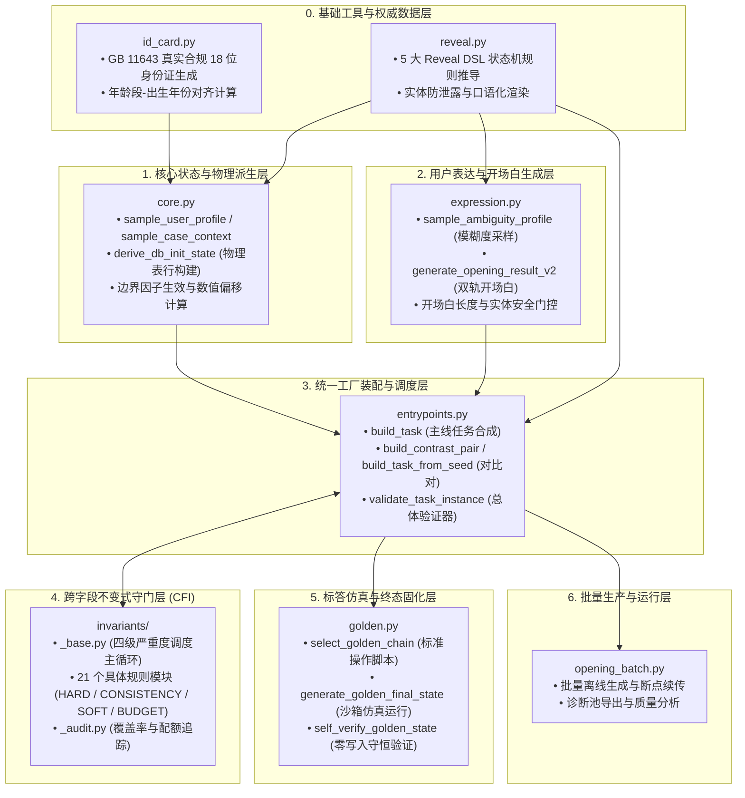
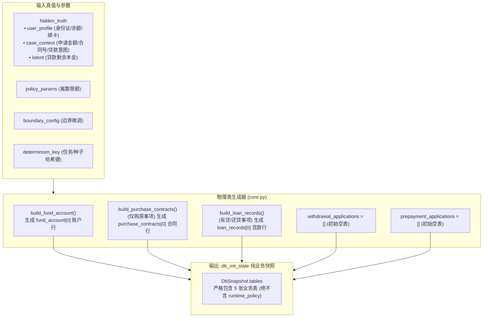
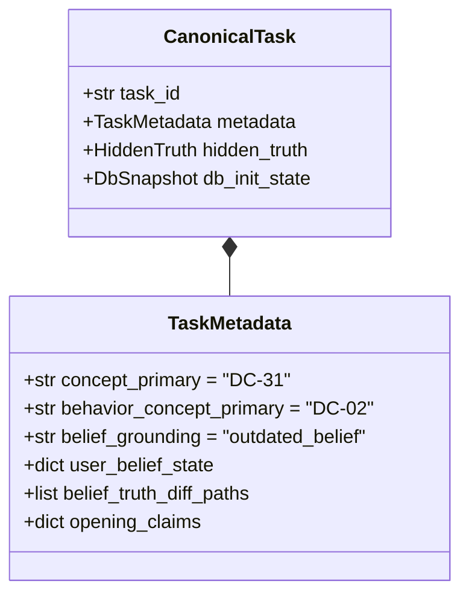
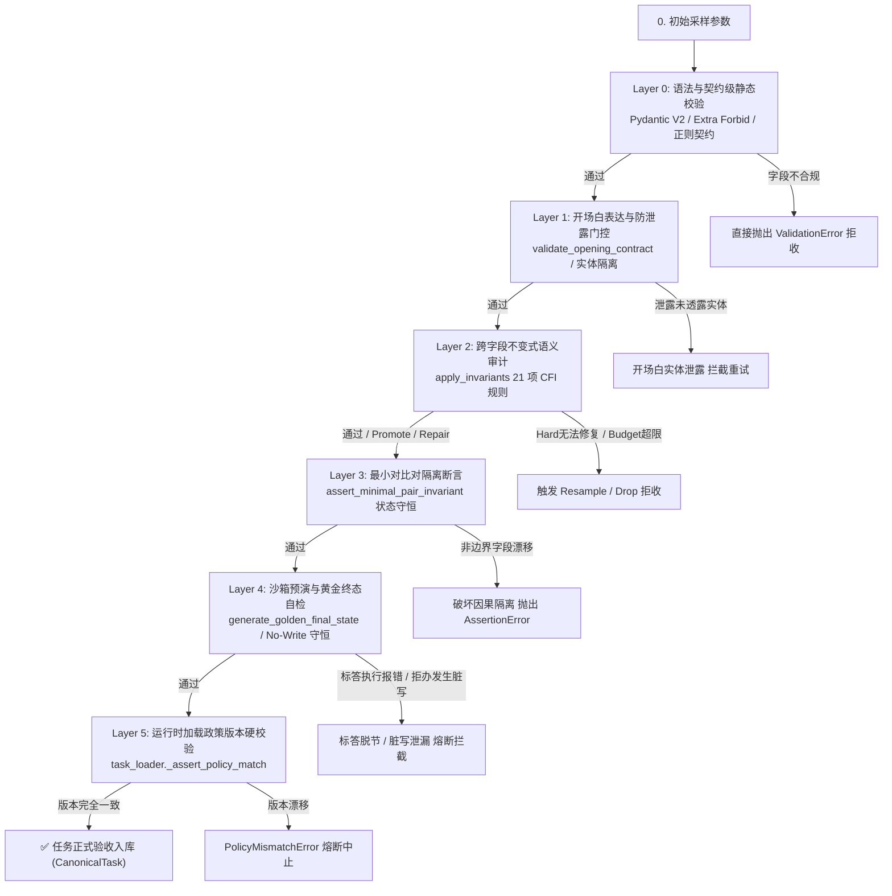

# 深入剖析 Agentic-Gov 任务工厂（Task Factory）：面向政务 AI Agent 的高确定性任务合成与不变式保障体系

> **导读**：在政务“边聊边办”场景下训练强化学习（RL）Agent 与构建高可信评测基准时，高质量、具备严格物理可解性且拥有确定性黄金标答（Ground Truth）的任务实例从何而来？如果完全依赖人工编写，边际成本极高且难以覆盖复杂的边界参数空间；如果直接使用通用大语言模型（LLM）自由生成，则必然遭遇**状态自相矛盾**、**业务规则死锁**、**开场白实体泄露**、**幽灵标签毒化**与**标答幻觉**等致命缺陷。
>
> 本文深入剖析 `agentic-gov` 项目中的**任务工厂（Task Factory）**全生命周期架构。详解其如何从声明式业务卡片出发，通过**离散参数空间采样**、**物理数据库与主体感知状态机派生（`derive_db_init_state`）**、**开场白表达层（Expression Layer）与双轨生成机制**、**六层过滤验收防线**、**四大等级 21 项跨字段不变式（Cross-Field Invariants, CFI）审查闭环**、**信念接地概念 DC-31 的系统级建模**、**最小对比对（Contrast Pairs）隔离生成**，以及与**沙箱仿真引擎和黄金终态（Golden Chain）的确定性联动**，构建起一条高保真、零污染、物理自洽的政务智能体任务合成工业流水线。

---

## 1. 背景与核心使命：为什么政务 Agent 需要程序化任务工厂？

在复杂政务服务（如住房公积金的提取、还贷与查询）中，智能体面对的不是开放式闲聊，而是具有**高度严密法律政策约束、强前置状态依赖、多轮信息追问及不可逆副作用**的行政审批工作流。

为了训练具备高可靠决策能力、高鲁棒性边界判别力与合规拒办意识的 Agent，环境构建面临着极具挑战的“数据飞轮启动问题”：

```
[ 现实挑战 ]
  1. 真实政务数据涉及公民敏感 PII 与资金账务，不可直接公开或注入训练；
  2. 真实长尾边界场景（如超额 1 元被拒、冒领冒用、状态冻结等）在真实历史日志中样本极度稀疏；
  3. 纯 LLM 合成容易“前言不搭后语”——比如开场白声称要租房提取，底层数据库却根本没有正常缴存账户，或者给出了 15 位的非法旧身份证号。

           │
           ▼
[ 任务工厂 Task Factory 的使命 ]
  将政务政策空间（Policy Parameters）、群众用户画像（Persona Profile）、
  隐式业务真值（Hidden Truth）与沙箱初始快照（DbSnapshot），
  通过严格的数学模型与代码状态机，编译为机器可加载、可执行、可验证的 CanonicalTask 标准任务契约。
```

### 传统 LLM 盲目生成任务的三大硬伤

1. **逻辑自洽性缺失（Semantic Incoherence）**：
   LLM 生成的自然语言开场白可能提到“我想提取 5 万元”，但合成的底层数据库账户余额仅有 3000 元，导致意图与物理状态撕裂，Agent 无论做出何种决策都会受到错误的奖励信号反馈。
2. **状态机不可达死锁（State-Machine Deadlock）**：
   业务流程要求“提取公积金必须先绑定银行卡”，如果生成的任务数据库中 `linked_bank_account=False`，且用户信息披露策略（Reveal Policy）将银行卡信息设为 `never_reveal`，该任务在逻辑上将彻底沦为不可解的“死局”，直接破坏强化学习算法的策略梯度。
3. **缺乏客观可验证的物理终态（No Objective Ground Truth）**：
   若没有沙箱执行环境的先验仿真，任务的标答只能依赖 LLM 裁判的自然语言打分。这种“软判定”无法验证数据库底层的扣款是否准确、行记录是否生成、收尾动作（Finish / Escalate / FinishWithRefusal）是否精准合规。

为解决上述问题，`agentic-gov` 构建了一套**以代码状态机为骨架、以不可变契约为协议、以跨字段不变式为守门人、以 LLM 为语义表达润色器**的 Task Factory 体系。

---

## 2. 输入与输出全景契约：CanonicalTask 规范详解

任务工厂在系统架构中扮演着“任务编译器（Task Compiler）”的角色。其输入是高维离散的业务与画像参数，输出则是全局统一的数据协议——[`CanonicalTask`](file:///Users/sunxichen/Projects/agentic-gov/src/agentic_gov/schemas/task.py#L901-L1071)。

```mermaid
flowchart LR
    subgraph Inputs["Task Factory 离散输入空间"]
        PP["1. 政策参数空间<br/>POLICY_PARAM_DISCRETE_POOLS"]
        DC["2. 决策概念空间<br/>DECISION_CONCEPT_DENSITY (31 种 DC)"]
        BD["3. 对比对边界配置<br/>BOUNDARY_FACTOR_BY_ID (15 种 BD)"]
        PER["4. 群众画像多维空间<br/>Persona (年龄/耐心/协作度/文化度等)"]
        SEED["5. 随机种子 / 对比对基准种子<br/>RNG Seed / PairSeed"]
    end

    subgraph Factory["Task Factory 任务工厂编译管线"]
        CORE["core.py<br/>核心状态与 DB 派生"]
        EXP["expression.py<br/>开场白表达与模糊度"]
        CFI["invariants/<br/>21 项跨字段不变式审计"]
        GOLD["golden.py<br/>黄金标答执行与自验证"]
    end

    subgraph Output["标准输出协议"]
        CT["CanonicalTask 结构化任务实例<br/>(Pydantic V2 / Extra Forbid)"]
    end

    Inputs --> Factory
    Factory --> Output
```



### 2.1 任务工厂的核心输入空间

任务工厂的输入并非无序的 Prompt 提示词，而是经过严格数学建模与行业知识固化的参数池（权威定义见 [`constants.py`](file:///Users/sunxichen/Projects/agentic-gov/src/agentic_gov/constants.py)）：

1. **政策参数空间 (`POLICY_PARAM_DISCRETE_POOLS`)**：
   - 租房提取限额 `withdrawal_limit_rent`: `(30000, 45000, 50000, 60000, 80000)`
   - 购房提取限额 `withdrawal_limit_purchase`: `(500000, 800000, 1000000, 1500000, 2000000)`
   - 提前还贷最低门槛 `min_prepayment_amount`: `(5000, 10000, 20000, 30000)`
   - 违约金比例 `prepayment_penalty_rate`: `(0, 0.005, 0.01, 0.02)`
2. **决策概念空间 (`DECISION_CONCEPT_DENSITY`)**：
   定义了全系统 31 个核心决策点（DC-01 至 DC-31），涵盖常规办理（如租房正常办 DC-02、购房正常办 DC-03）、边界校验（如余额不足 DC-17、冷却期限制 DC-18、账户冻结 DC-19）、混合贷款（DC-20）、逾期阻断（DC-21）、合同纠纷转人工（DC-22）、主动要求转人工（DC-23）以及信念接地错位（DC-31）。
3. **对比对边界定义 (`BOUNDARY_FACTOR_BY_ID`)**：
   15 种精准边界触发器（7 种数值边界 `BD-N1` ~ `BD-N7`，8 种分类边界 `BD-C1` ~ `BD-C8`）。
4. **群众用户画像 (`Persona`)**：
   多维特征笛卡尔积，包括年龄段（`age_group`）、耐心轮数（`patience_turns`）、知识水平（`knowledge_level`）、协作程度（`cooperation_level`：`compliant`, `impatient`, `suspicious`, `chatty`, `evasive`）、语言清晰度（`language_clarity`）及弱势群体标记（`vulnerability_flag`）。

---

### 2.2 核心输出契约：CanonicalTask 顶级字段逐个深度解析

[`CanonicalTask`](file:///Users/sunxichen/Projects/agentic-gov/src/agentic_gov/schemas/task.py#L901-L1071) 是整个项目的核心数据结构，采用 Pydantic V2 构建，严格配置 `extra="forbid"`，杜绝任何未定义字段。其完整字段矩阵如下：

| 字段名称 | 类型定义 | 核心职责与工程内涵 |
|---|---|---|
| **`task_id`** | `str` | 全局唯一任务实例标识（如 `task_8f3d...` 或对比对 `pair_BD-N1-002_A`）。 |
| **`domain`** | `Literal["housing_fund"]` | 业务领域命名空间，当前固定为住房公积金领域。 |
| **`task_type`** | `Literal["account_balance_query", "withdrawal_for_rent", "withdrawal_for_purchase", "loan_repayment_query"]` | 四大具体政务事项类型，用于注册表寻址和业务插件绑定。 |
| **`split`** | `Literal["train", "eval"]` | 数据集划分标记，确保训练集与评测集的物理隔离。 |
| **`difficulty`** | `Literal["easy", "medium", "hard"]` | 任务难度分级（基于要素缺失数、对抗强度及边界偏离度计算）。 |
| **`policy_id`** | `str` | 绑定的政策规则卡唯一标识（如 `POL-HOUSING-FUND-RENT-001`）。 |
| **`policy_version`** | `str` | 政策规则版本号（如 `1.0.0`），与沙箱运行时执行强一致性版本校验。 |
| **`hidden_truth`** | `HiddenTruth` | **世界底层隐式真值**。包含用户真实画像（`user_profile`：身份证、真实余额、是否绑卡、账户状态）、案件上下文（`case_context`：申报金额、合同号、贷款意图）及潜变量（`latent`：贷款剩余本金）。Agent 初始不可见。 |
| **`db_init_state`** | `DbSnapshot` | **沙箱初始状态**。真实的内存数据库快照，包含 `fund_account`、`purchase_contracts`、`loan_records`、`withdrawal_applications` 等业务表的初始行数据。 |
| **`golden_final_state`** | `DbSnapshot \| None` | **黄金标答数据库终态**。任务生成阶段由标准动作脚本在沙箱中预演执行并剥离影子表后生成的“完美目标快照”，供强化学习计算 $R_{\text{complete}}$ 完成度奖励。 |
| **`compare_spec`** | `CompareSpec` (`dict[str, dict[str, str]]`) | **终态字段比对规格**。按收尾动作（`Finish`/`Escalate`/`FinishWithRefusal`）分别定义需要比对的字段路径（如 `tables.fund_account[0].balance: "exact"`），避免将沙箱自增 ID、时间戳等动态量卷入评分。 |
| **`policy_params`** | `dict[str, Any]` | 该任务实例具体生效的政策参数数值（如 `withdrawal_limit_rent: 50000`）。 |
| **`metadata`** | `TaskMetadata` | **元数据全景资产**。记录主次决策概念（`concept_primary`, `decision_concept_ids`）、对比对标记（`pair_id`, `pair_side`, `boundary_config`）、对抗标记（`adversarial_flag`）、预推导收尾动作（`expected_terminal_action`）、流程变体（`flow_variant`）、触发器哈希（`reveal_triggers_hash`）及信念错位（`belief_grounding`）等。 |
| **`mandatory_disclosures`** | `MandatoryDisclosures` | **法定义务告知概念集**。定义 Agent 在完成业务或收尾时必须通过自然语言告知群众的法定要点（如办结时效、逾期罚息计算、材料要求等）。贷款事项下按 `flow_variant` 进行双层字典嵌套。 |
| **`forbidden_side_effects`**| `list[str]` | 严禁发生的副作用接口列表（例如查询业务严禁调用写入接口，冒领场景严禁调用审批接口）。 |
| **`persona`** | `Persona` | 群众用户画像实体，驱动对话模拟器与开场白生成风格。 |
| **`ambiguity_profile`** | `AmbiguityProfile` | **模糊度与表达缺陷配置**。定义开场白中故意隐去的槽位（`omit_slots`）、迟延透露的字段（`late_reveal_fields`）及使用的口语模糊词（`vague_terms`）。 |
| **`reveal_policy`** | `dict[str, str]` | **信息披露状态机协议**。将每个二段式字段路径（如 `user_profile.id_number`）精确映射到 5 种权威透露规则之一。 |
| **`opening_message`** | `str` | 群众发起的第 1 轮自然语言开场白文本。 |
| **`sandbox_overrides`** | `SandboxOverrides \| None` | 可选的沙箱运行期故障注入配置（如模拟第三方接口瞬时超时 `SYSTEM_ERROR` 以评测 Agent 的自愈重试能力）。 |

---

## 3. 模块全景图：职责划分与协作顺序

`src/agentic_gov/task_factory/` 目录下的各模块呈现出高度内聚、单向依赖的分层架构体系：



### 核心模块职责明细矩阵

| 模块文件 | 核心函数 / 类 | 核心工程职责 |
|---|---|---|
| **[`core.py`](file:///Users/sunxichen/Projects/agentic-gov/src/agentic_gov/task_factory/core.py)** | `build_core_derivation`<br>`derive_db_init_state`<br>`sample_policy_params` | **物理真值与沙箱数据库派生**。负责根据概念与边界配置，确定性生成 `user_profile`、`case_context`、`latent` 及对应的五张数据库表（`fund_account`、`purchase_contracts`、`loan_records` 等）。不涉及 LLM 表达与标答执行。 |
| **[`id_card.py`](file:///Users/sunxichen/Projects/agentic-gov/src/agentic_gov/task_factory/id_card.py)** | `generate_chinese_id_card_18_for_age_group`<br>`birth_year_from_id`<br>`is_valid_chinese_id_card` | **GB 11643 身份证权威生成器**。支持标准 Mod-11 校验码计算、行政区划匹配，并严格保证身份证内的出生年份与用户画像中的 `age_group`（以 2026 年为基准基年）绝对对齐。 |
| **[`reveal.py`](file:///Users/sunxichen/Projects/agentic-gov/src/agentic_gov/task_factory/reveal.py)** | `derive_reveal_policy`<br>`facts_to_reveal`<br>`fallback_template_opening` | **信息透露策略引擎**。推导 5 大权威 DSL 规则，计算开场白允许携带的事实集合，提供确定性模板兜底。 |
| **[`expression.py`](file:///Users/sunxichen/Projects/agentic-gov/src/agentic_gov/task_factory/expression.py)** | `sample_ambiguity_profile`<br>`generate_opening_result_v2`<br>`validate_opening_contract` | **用户表达与开场白生成层**。支持 `llm_required`、`offline_test`、`llm_then_offline_metered` 三种模式。带有本地 KV 缓存、重试退避与严格的字数/实体防泄露门控。 |
| **[`entrypoints.py`](file:///Users/sunxichen/Projects/agentic-gov/src/agentic_gov/task_factory/entrypoints.py)** | `build_task`<br>`build_task_from_seed`<br>`build_contrast_pair`<br>`validate_task_instance` | **任务工厂统一门面与总装配线**。编排 U3 物理派生、U4 表达生成、U5 黄金标答与 CFI 审查，输出合规的 `CanonicalTask` 实例。 |
| **[`invariants/`](file:///Users/sunxichen/Projects/agentic-gov/src/agentic_gov/task_factory/invariants/)** | `apply_invariants`<br>`_base.py`<br>`_audit.py` | **21 项跨字段不变式审计注册表**。执行语义冲突检测，支持自动提升（Promote）、就地修复（Repair）、软标签标记（Soft-Tag）与超额重采样（Resample）。 |
| **[`golden.py`](file:///Users/sunxichen/Projects/agentic-gov/src/agentic_gov/task_factory/golden.py)** | `select_golden_chain`<br>`generate_golden_final_state`<br>`self_verify_golden_state` | **黄金标答生成与物理终态预演**。在沙箱实例中执行确定性 `ExpectedAction` 序列，导出并剥离影子表后的 `golden_final_state`，执行拒办/转人工的零写入守恒自检。 |
| **[`opening_batch.py`](file:///Users/sunxichen/Projects/agentic-gov/src/agentic_gov/task_factory/opening_batch.py)** | `run_opening_batch`<br>`analyze_opening_amount_like_expressions` | **批处理驱动与诊断监控**。负责千级任务的大规模批量合成、异常隔离、进度 Checkpoint 恢复与离线回落率熔断监控。 |

---

## 4. 物理数据库快照构建：`db_init_state()` 的生成机制

很多工程师容易将 `db_init_state` 误解为一个“简单的 Mock 数据字典”。实际上，`db_init_state` 是沙箱物理世界在第 0 轮的真实快照。

[`derive_db_init_state()`](file:///Users/sunxichen/Projects/agentic-gov/src/agentic_gov/task_factory/core.py#L443-L484) 负责将采样的隐式真值（`HiddenTruth`）映射为标准的数据库表行结构。



### 4.1 各业务表的行初始化全流程

1. **`fund_account`（公积金账户表）**：
   - 所有 4 种 `task_type` **必有且仅有一行记录**；
   - `id` 严格绑定 `user_profile["id_number"]`（18 位合规身份证）；
   - `name` 绑定 `user_profile["name"]`；
   - `balance` 绑定 `user_profile["fund_balance"]`（若为 `BD-N3` 余额边界，则根据申报金额和偏移量进行严格反算）；
   - `status` 初始化为 `"active"`；当命中概念 `DC-19` 或边界 `BD-C3` 时，确定性置为 `"frozen"`（冻结）或 `"sealed"`（封存）；
   - `linked_bank_account`：当 `user_profile["linked_bank_account"]` 为 True 时，调用 `_sample_bank_account_number` 生成 `"BANK_" + 12位数字`，否则置为 `None`（受 `BD-C7` 边界控制）；
   - `recent_withdrawal_within_cooldown`：记录 3 个月内是否有提取记录（受 `BD-C8` 边界控制）。
2. **`purchase_contracts`（购房合同表）**：
   - **仅在 `task_type == "withdrawal_for_purchase"` 时初始化一行记录**，其余 3 种事项严格为空列表 `[]`；
   - `contract_number` 绑定 `case_context["contract_number"]`；
   - `buyer_id_number` 默认绑定 `user_profile["id_number"]`；当触发 `BD-C2 (mismatch)` 边界时，调用 `_sample_other_id_number` 派生一个合规但**非本人**的第三方身份证号；
   - `purchase_price`：默认采样 2.3M 至 6.0M 的高额房价（确保不成为非 `BD-N4` 任务的意外瓶颈）；当触发 `BD-N4` 房价边界时，根据申请金额和偏移量精确反算；
   - `filing_status`：默认置为 `"filed"`（已备案）；触发 `BD-C1` 边界时置为 `"not_filed"`。
3. **`loan_records`（公积金贷款表）**：
   - 当 `user_profile["has_active_loan"] == True`（受 `BD-C6` 控制）或 `task_type == "loan_repayment_query"` 时**初始化一行记录**，否则为空列表 `[]`；
   - `loan_id` 格式为 `"L_" + 7位数字`；
   - `remaining_principal` 绑定潜变量 `latent["remaining_principal"]`（100,000 ~ 600,000 元）；
   - `total_amount` 由剩余本金乘以 1.5~2.5 倍确定性放大得到；
   - `loan_type` 默认为 `"pure_fund"`（纯公积金贷款）；在概念 `DC-20` 或边界 `BD-C4` 下置为 `"combined"`（组合贷款）；
   - `status` 默认为 `"active"`；在概念 `DC-21` 或边界 `BD-C5` 下置为 `"overdue"`（逾期）或 `"settled"`（已结清）；
   - `monthly_payment` 与 `remaining_months` 根据总额、期限与剩余本金由物理公式精确推导。
4. **`withdrawal_applications` 与 `prepayment_applications`（审批申请单表）**：
   - 在任务初始化时**严格为空列表 `[]`**。只有当 Agent 在沙箱中合规调用写入接口（如 `submit_rent_withdrawal` 或 `submit_loan_prepayment`）后，沙箱 Handler 才会向其中追加行记录。

### 4.2 影子表（Shadow Table）与 Runtime Policy 的参与边界

在系统架构中，必须明确划分**业务数据快照**与**引擎运行时状态**的边界：
- **`db_init_state()` 阶段**：完全不包含任何影子表。输出的是干净的纯业务数据 `DbSnapshot(tables={...})`。
- **沙箱实例化阶段 (`Sandbox.__init__`)**：通用沙箱引擎为了管理动态限额与主体认证标记（`RuntimeFlags`），会在内部自动创建一张名为 `runtime_policy` 的内存影子表。
- **黄金终态固化阶段 (`generate_golden_final_state`)**：在沙箱预演完毕导出快照后，[`_strip_sandbox_shadow_tables()`](file:///Users/sunxichen/Projects/agentic-gov/src/agentic_gov/task_factory/golden.py#L1375-L1381) 必须**物理剔除 `runtime_policy` 表**，然后再写入 `canonical.golden_final_state`。这样确保了 `db_init_state` 与 `golden_final_state` 的 Schema 结构绝对同构，支持纯粹的业务字段比对。

### 4.3 四大 Task Type 在数据库初始化上的核心差异

| 数据库表 | 余额查询 (`account_balance_query`) | 租房提取 (`withdrawal_for_rent`) | 购房提取 (`withdrawal_for_purchase`) | 贷款还款 (`loan_repayment_query`) |
|---|---|---|---|---|
| **`fund_account`** | 必填 1 行 (`balance` 自由采样) | 必填 1 行 (`balance` 受限额关联) | 必填 1 行 (`balance` $\ge 50000$) | 必填 1 行 (`balance` 自由采样) |
| **`purchase_contracts`** | **严格为空 `[]`** | **严格为空 `[]`** | **必填 1 行** (含网签/房价/买受人) | **严格为空 `[]`** |
| **`loan_records`** | 条件 1 行 (仅当 `has_active_loan`) | 条件 1 行 (仅当 `has_active_loan`) | 条件 1 行 (仅当 `has_active_loan`) | **必填 1 行** (含本金/月供/逾期状态) |
| **`withdrawal_applications`** | 初始空 `[]` | 初始空 `[]` (办结后追加) | 初始空 `[]` (办结后追加) | 初始空 `[]` |
| **`prepayment_applications`** | 初始空 `[]` | 初始空 `[]` | 初始空 `[]` | 初始空 `[]` (还款办结后追加) |

---

## 5. 核心概念专项深度解析：DC-31 (Truth Grounding Overlay)

在 `agentic-gov` 的 31 个决策概念中，**`DC-31`** 是架构上最为特殊的一个概念。



### 5.1 DC-31 的定义、出现位置与命名来源

- **定义与全称**：
  在权威文档中，DC-31 的标准定义是 **`"Ground in system truth, not user assertion"`（以系统真实记录为准，而非盲目采信用户主观陈述）**。
- **命名与标记来源**：
  在 Phase 2 早期规划中，系统定义了 30 个决策概念（编号为 `DC-01` 至 `DC-30`，总密度配额为 4600 条）。在随后的工程评审与真实政务客服数据压测中发现，**群众在咨询或申办时存在极高比例（>30%）的记忆错误或认知偏差**。为了在评测中专门度量 Agent 抵抗“随声附和（Sycophancy）”与“跳步未查证”的能力，系统在 PR-6.X 中**顺延新增了第 31 个概念，正式编号并标记为 `DC-31`**，并追加了 200 条密度配额（使主干总样本规模达到 4800 条）。
- **出现位置全景**：
  1. [`constants.py`](file:///Users/sunxichen/Projects/agentic-gov/src/agentic_gov/constants.py#L61-L68)：在 `DECISION_CONCEPT_DENSITY` 中注册配额 200，并在 `CONCEPT_ALLOWED_TASK_TYPES["DC-31"]` 中声明其为**唯一横跨全部 4 种 `task_type` 的通用概念**；
  2. [`schemas/task.py`](file:///Users/sunxichen/Projects/agentic-gov/src/agentic_gov/schemas/task.py#L494-L508)：在 `TaskMetadata` 中扩展了 `belief_grounding`、`user_belief_state`、`belief_truth_diff_paths`、`opening_claims`、`behavior_concept_primary` 等字段，并通过 Pydantic 模型验证器锁定其强关联约束；
  3. [`entrypoints.py`](file:///Users/sunxichen/Projects/agentic-gov/src/agentic_gov/task_factory/entrypoints.py#L747-L875)：在 `_belief_grounding_claim_payload` 中合成 5 类虚假事实陈述，并在 `mandatory_disclosures` 中强制追加 `agent_disclosed_actual_system_state`；
  4. [`invariants/`](file:///Users/sunxichen/Projects/agentic-gov/src/agentic_gov/task_factory/invariants/)：作为 `belief_grounding_consistency` 与 `intent_vs_flow_variant` 的**提升目标（Promote Target）**。

---

### 5.2 DC-31 解决的现实业务问题

在传统人机对话中，LLM 极易表现出**顺从性幻觉**。例如：
```
群众："我名下没有公积金贷款，我想办个租房提取。"
（系统底层数据库中：该群众名下有一笔正在逾期的公积金贷款，依法必须先结清逾期才能提取）

[ 缺陷 Agent 的表现 ]：直接采信用户口述，跳过贷款核查接口，直接提交租房申请 -> 被沙箱抛出 ELIGIBILITY 异常拦截。
[ 合格 Agent 的表现 (DC-31 训练目标) ]：
  1. 调用 check_eligibility 或 query_loan_info 接口核查；
  2. 发现系统记录与群众陈述不一致；
  3. 礼貌向群众指出：“系统查询到您名下仍有一笔公积金贷款处于逾期状态，依据政策暂无法办理租房提取...”；
  4. 以系统真实记录为准终止或转人工。
```

### 5.3 DC-31 的 5 大信念错位子值矩阵

DC-31 的 200 条配额被精准划分到 5 种真实的群众认知错位模式中（[`constants.py:486`](file:///Users/sunxichen/Projects/agentic-gov/src/agentic_gov/constants.py#L486-L497)）：

| 子值枚举 (`belief_grounding`) | 密度配额 | 适用事项 | 错位行为模式示例 |
|---|---|---|---|
| **`outdated_belief`** | 60 条 | 贷款还款 / 余额查询 | **陈旧记忆**。用户以为自己贷款还剩 10 万（实际已还清为 0），或以为余额有 5 万（实际仅剩 1 万）。 |
| **`optimistic_overestimate`** | 40 条 | 提取事项 / 贷款事项 | **过度乐观**。用户开场白声称“我账户里有 10 万元”，底层数据库实际仅有 2 万元。 |
| **`pessimistic_underestimate`**| 30 条 | 提取事项 | **过度悲观**。用户以为账户只有 5000 元，实际有 8 万元，Agent 需准确告知可提取上限。 |
| **`third_party_misinfo`** | 30 条 | 全部 4 类事项 | **第三方误导**。用户声称“*我妈说我名下没有贷款/我中介说可以提8万*”，Agent 需以官方底账纠偏。 |
| **`confused_entity`** | 40 条 | 贷款还款事项 | **业务意图混淆**。用户声称来“咨询贷款”，实际后台关联的是提前还款写入任务。 |

### 5.4 “Overlay 叠加层”设计哲学

在代码实现中，DC-31 不是一个独立的孤立业务，而是一个 **Overlay（叠加层）**：
- **`metadata.concept_primary = "DC-31"`**：负责在数据统计与强化学习损失函数中归属为“接地纠偏信号”；
- **`metadata.behavior_concept_primary = "DC-02"`**：保留底层的真实业务行为概念（如租房提取），**任务工厂的状态机派生、限额采样与沙箱 Golden Chain 依然严格由 `behavior_concept_primary` 驱动**。
这种设计优雅地实现了“在不破坏原有业务逻辑状态机的前提下，无缝叠加认知对抗测试”。

---

## 6. 系统级任务过滤与验收防线：从 Schema 到物理执行的六层拦截器

在任务工厂中，一个候选任务从生成到最终被准入（Accept），必须经过**六层逐级递进的严格过滤与验收拦截器**。



### 6.1 六层过滤拦截矩阵详表

| 拦截层级 | 执行位置与核心代码 | 拦截性质 | 具体的过滤/拒收判定规则（以代码为准） | 失败处置行为 |
|---|---|---|---|---|
| **Layer 0<br/>结构契约校验** | `schemas/task.py`<br>`CanonicalTask.model_validate` | 语法与格式结构 | 1. 拒绝任何未定义字段（`extra="forbid"`）；<br/>2. `pair_id` 必须严格匹配 `^pair_BD-[NC]\d-\d{3}(__nat)?$`；<br/>3. `reveal_triggers_hash` 必须与当前 yaml 文件的 sha256 强哈希完全一致；<br/>4. `compare_spec` 必须为三键字典，路径必须满足 `tables.<table>[i].<field>` 正则，严禁整表比对；<br/>5. `policy_params` 必须数值型且在离散池内（除非列入 override 白名单）。 | 抛出 `pydantic.ValidationError`，任务合成中断。 |
| **Layer 1<br/>开场白安全门控** | `expression.py`<br>`validate_opening_contract` | 自然语言安全 | 1. **单句长度上限**：LLM 模式 $\le 80$ 字符，离线模板 $\le 140$ 字符，追加信号后 $\le 180$ 字符；<br/>2. **未透露实体绝对零泄露**：凡属于 `omit_slots` 或非 `reveal_in_opening` 的字段值（身份证号、合同号、精确非整万金额），**绝对禁止出现在开场白文本中**；<br/>3. **必透露实体存在性**：标记为 `reveal_in_opening` 的字段值必须出现在开场白中。 | 抛出 `OpeningGenerationError`，触发开场白重试（最多 3 次）。 |
| **Layer 2<br/>跨字段语义审计** | `invariants/`<br>`apply_invariants` | 业务可解性与逻辑自洽 | 1. **HARD**（9 条）：身份证合规、年龄出生年对齐、比对规格闭包、意图与流程变体匹配、冒名锁定 PII、拒办证据存在性等；<br/>2. **CONSISTENCY**（1 条）：用户错误认知升级为 DC-31；<br/>3. **BUDGET**（3 条）：耐心轮数 $\ge$ 标答执行步数及最小澄清轮数、标答必填槽位在透露策略中必须可达；<br/>4. **SOFT**（8 条）：弱势/绝望人设软约束与批次配额监控。 | 按等级执行：`Promote` 升级、`Repair` 修复、`Resample` 重新抽样、`Drop` 直接丢弃。 |
| **Layer 3<br/>对比对隔离断言** | `entrypoints.py`<br>`assert_minimal_pair_invariant` | 因果隔离度量 | 1. A/B 两侧必须共享相同 `PairSeed`（相同人设画像、相同开场白、相同基础限额）；<br/>2. **除边界声明修改字段外，A/B 两侧 `db_init_state` 在 JSON 序列化后必须 100% 绝对一致**；<br/>3. H-3 契约：边界字段在透露策略中严禁配置为 `reveal_in_opening`。 | 抛出 `AssertionError`，废弃对比对并重新合成。 |
| **Layer 4<br/>沙箱标答仿真** | `golden.py`<br>`generate_golden_final_state`<br>`self_verify_golden_state` | 物理可达性与零写入守恒 | 1. `select_golden_chain` 选出的脚本在沙箱中执行，每步返回状态必须严格符合预期；<br/>2. **No-Write 守恒**：对于 `Escalate` / `FinishWithRefusal` 路径，导出终态剥离影子表后必须与初始快照 `db_init_state` 完全一致（Zero Write）。 | 抛出 `AssertionError`，防止标答脱节或脏写数据流入训练集。 |
| **Layer 5<br/>运行时版本校验** | `task_loader.py`<br>`_assert_policy_match` | 环境一致性 | 1. `task.policy_id == registry.policy_card.policy_id`；<br/>2. `task.policy_version == registry.policy_card.policy_version`。 | 抛出 `PolicyMismatchError`，环境拒绝加载运行。 |

---

### 6.2 过滤失败时的分级流转决策状态机

当一个任务草稿在 Layer 2（CFI 不变式）未能直接通过时，系统**绝不采用一刀切的简单丢弃**，而是由 [`apply_invariants`](file:///Users/sunxichen/Projects/agentic-gov/src/agentic_gov/task_factory/invariants/_base.py#L399-L630) 执行精密的状态机流转：

```
                              [ 触发违规 Violation ]
                                        │
             ┌──────────────────────────┼──────────────────────────┬──────────────────────────┐
             ▼                          ▼                          ▼                          ▼
     【 HARD 违规 】             【 CONSISTENCY 违规 】       【 BUDGET 违规 】           【 SOFT 违规 】
             │                          │                          │                          │
  ┌──────────┴──────────┐               │                          │               ┌──────────┴──────────┐
  ▼                     ▼               ▼                          ▼               ▼                     ▼
配置 promote_before_repair?          调用 promote 算子          采样先验错误      ctx.would_exceed?     未超配额
  ├─ 是 ──> 调用 promote 升级为 DC-31 升级为 DC-31 错位变体      直接判定为         ├─ 是 ──> Resample    打上 soft_tag
  └─ 否 ──> 尝试 local repair 局部修复 (ApplyStatus.PROMOTED)   DROPPED 丢弃       └─ 否 ──> 正常准入    (diluted_flags)
            ├─ 成功 ──> 重新审查                                (日志报警)
            └─ 失败 ──> 放弃草稿, 触发 RESAMPLE_REQUIRED (外层重抽)
```

1. **`Promote`（变废为宝，保留高价值错位）**：对于意图矛盾或事实不一致，将其提升为 `DC-31` 信念错位场景，保留样本用于训练纠偏能力；
2. **`Repair`（就地自愈）**：对于局部可推导错误（如开场白关键词轻微修饰），执行局部替换并重审；
3. **`Resample`（重新抽样）**：局部修复失败或软配额超标时，通知外层采样循环更换随机种子重抽；
4. **`Drop`（一票否决）**：对于由于采样器逻辑 Bug 导致的不可达预算错误，直接丢弃。

---

## 7. 典型不变式案例深度重写：坏任务、训练污染与代码治理

为了帮助复盘者透彻理解不变式设计的必要性，下文选取三个最具代表性的不变式，详细呈现**坏任务的具体长相**、**未拦截时的训练毒化后果**、**代码识别逻辑**以及**治理后的标准形态**。

---

### 案例 1：开场白意图与还贷流程变体冲突 ([`intent_vs_flow_variant.py`](file:///Users/sunxichen/Projects/agentic-gov/src/agentic_gov/task_factory/invariants/intent_vs_flow_variant.py))

#### ① 坏任务长什么样？（Bad Task 实体示例）
```json
{
  "task_id": "task_bad_001",
  "task_type": "loan_repayment_query",
  "metadata": {
    "flow_variant": "query_only",       // 流程变体标记为：仅查询
    "concept_primary": "DC-04",
    "opening_claims": {"intent_label": "apply"}
  },
  "compare_spec": {
    "Finish": {}                        // 比对规格为空：判定任何写入操作均为违规！
  },
  "opening_message": "您好，我手里有笔闲钱，想今天把公积金贷款提前还了，麻烦帮我办一下提前还贷。"
}
```

#### ② 如果不拦截会导致什么训练/评测污染？
- **策略梯度严重颠倒（Reward Misalignment）**：
  群众明明在第 1 轮明确说“*想办提前还款*”，一个具备优秀语义理解能力的 Agent 听懂了群众诉求，调用 `calculate_prepayment` 并准备提交申请。然而：
  1. 运行时沙箱由于 `flow_variant="query_only"`，其工具白名单中根本没有开放 `submit_loan_prepayment` 写入接口，Agent 尝试调用将直接触发 `TOOL_NOT_ALLOWED`（硬违规，总奖励 $R_{\text{total}} = 0$）；
  2. 即使模型勉强完成，由于 `compare_spec` 为空，任何写入都会被判错。
  
  **致命后果**：做出正确理解的聪明 Agent 被环境重罚，而一个**完全聋哑、无视用户诉求、只查了下余额就强行点“办结”的愚蠢 Agent 反而拿到满分**！模型将被迫学到“忽略用户明确主张”的错误策略。

#### ③ 代码如何发现并捕获它？
在 [`intent_vs_flow_variant.py:95-150`](file:///Users/sunxichen/Projects/agentic-gov/src/agentic_gov/task_factory/invariants/intent_vs_flow_variant.py#L95-L150) 中：
1. `opening_intent_label()` 函数读取 `opening_claims.intent_label`（或通过关键词正则匹配）判定用户自然语言意图为 `"apply"`（申请办理）；
2. 提取当前任务的元组 `("apply", "query_only", True)`；
3. 比对冻结的合法三元组集合 `_LEGAL_TRIPLES`：
   ```python
   _LEGAL_TRIPLES = frozenset({
       ("query", "query_only", True),        # 查询意图 + 仅查流程 + 空比对 -> 合法
       ("query", "with_prepayment", False),  # 查询意图 + 还贷流程 + 有写入比对 -> 合法 (查完顺带还)
       ("apply", "with_prepayment", False),  # 申请意图 + 还贷流程 + 有写入比对 -> 合法
   })
   ```
4. 发现 `("apply", "query_only", True)` 不在白名单中，立即构建 `Violation(severity=Severity.HARD, name="intent_vs_flow_variant", reason="opening expresses apply intent but flow_variant is query_only")`。

#### ④ 修复/升级后的正确任务形态
由于该规则配置了 `promote_before_repair=True`，系统不会粗暴重写开场白，而是**将其自动提升为 DC-31 `confused_entity` 认知纠偏任务**：
- `metadata.concept_primary` 自动重写为 `"DC-31"`，原业务概念沉淀至 `behavior_concept_primary = "DC-04"`；
- `metadata.belief_grounding` 置为 `"confused_entity"`；
- `mandatory_disclosures` 注入 `agent_disclosed_actual_system_state`；
- **任务目标被重新定义**：Agent 必须先核查贷款底账，然后礼貌向群众指出：“*系统检测到您当前未发起提前还贷申报，已为您查询到剩余贷款本金为...*”，最后合规收尾。

---

### 案例 2：拒办/转人工收尾缺乏可观测物理证据 ([`terminal_action_vs_observable_evidence.py`](file:///Users/sunxichen/Projects/agentic-gov/src/agentic_gov/task_factory/invariants/terminal_action_vs_observable_evidence.py))

#### ① 坏任务长什么样？（Bad Task 实体示例）
```json
{
  "task_id": "task_bad_002",
  "task_type": "withdrawal_for_rent",
  "metadata": {
    "expected_terminal_action": "FinishWithRefusal",  // 标答期望动作：明确拒办！
    "adversarial_flag": null                          // 无任何对抗攻击
  },
  "db_init_state": {
    "tables": {
      "fund_account": [{
        "status": "active",                           // 账户完全正常缴存
        "balance": 80000,                             // 账户余额极度充裕
        "linked_bank_account": "BANK_622202123456",   // 正常绑定一类卡
        "recent_withdrawal_within_cooldown": false    // 无提取冷却期
      }]
    }
  },
  "hidden_truth": {
    "case_context": {"requested_amount": 20000}       // 申请 2 万元，未超限额 (50000)
  }
}
```

#### ② 如果不拦截会导致什么训练/评测污染？
- **幽灵标签毒化（Ghost Labels & Spurious Correlation）**：
  底层数据库没有任何异常，开场白没有任何违规，办理要素一应俱全。在真实业务中，这是一个标准的 100% 应该办结（`Finish`）的任务。
  然而，元数据却把标答强行写成了“拒办（`FinishWithRefusal`）”。
  
  **致命后果**：Agent 严格合规办理完毕，却被强化学习环境判定为动作错误（收尾动作门控直接将 $R_{\text{complete}}$ 归零）；只有模型出现幻觉、无缘无故粗暴拒绝群众时，才能拿到满分奖励！这会导致 Agent 学会“神经过敏式滥用拒办”，彻底丧失业务可用性。

#### ③ 代码如何发现并捕获它？
在 [`terminal_action_vs_observable_evidence.py:100-240`](file:///Users/sunxichen/Projects/agentic-gov/src/agentic_gov/task_factory/invariants/terminal_action_vs_observable_evidence.py#L100-L240) 中：
1. 过滤拦截：当 `expected_terminal_action ∈ {"Escalate", "FinishWithRefusal"}` 时激活检查；
2. 运行沙箱仿真，遍历 `select_golden_chain` 生成的动作序列：
   - 检查是否有任何工具接口返回了业务阻断错误码（如 `ACCOUNT_FROZEN`、`AMOUNT_EXCEEDS_LIMIT`、`BANK_ACCOUNT_NOT_LINKED`、`IDENTITY_MISMATCH`）；
3. 若动作链中所有接口全部返回 `status="ok"`，进一步检查自然语言证据层：
   - 检查 `opening_claims` 中是否包含合法的阻断凭证（如冒充他人的 `third_party_subject` 声明）；
4. 发现**物理接口无报错且自然语言无证据**，代码立即断言该拒办标签属于无源之水，抛出 `Severity.HARD` 违规。

#### ④ 修复/过滤后的正确任务形态
该规则无局部修复算子，直接触发 `RESAMPLE_REQUIRED` 丢弃并重抽。合格的拒办任务必须满足**证据充分性充要条件**（两者必居其一）：
1. **物理状态阻断**：沙箱中真实存在阻断数据（如 `db_init_state.tables.fund_account[0].status = "frozen"`，使得调用 `check_eligibility` 时确定性返回 `ELIGIBILITY_INACTIVE_ACCOUNT` 错误）；
2. **对话对抗阻断**：开场白包含结构化违规证据（如冒领人承认自己并非公积金缴存主体），使得 Agent 具有确凿的拒办依据。

---

### 案例 3：黄金标答所需要素在透露策略中不可达 ([`reveal_reachability_for_golden.py`](file:///Users/sunxichen/Projects/agentic-gov/src/agentic_gov/task_factory/invariants/reveal_reachability_for_golden.py))

#### ① 坏任务长什么样？（Bad Task 实体示例）
```json
{
  "task_id": "task_bad_003",
  "task_type": "withdrawal_for_purchase",
  "opening_message": "我想办理购房提取公积金。",       // 开场白未透露合同号
  "ambiguity_profile": {
    "omit_slots": ["case_context.contract_number"]    // 合同号被故意隐去
  },
  "reveal_policy": {
    "user_profile.id_number": "reveal_when_requested",
    "case_context.contract_number": "never_reveal"     // 透露策略错误配置为: 绝不透露!
  }
}
```

#### ② 如果不拦截会导致什么训练/评测污染？
- **环境死锁与策略探索破坏（Unsolvable Environment Deadlock）**：
  购房提取的政策规则卡明确规定：调用 `verify_purchase_contract` 接口必须传入 `contract_number`（合同编号）。
  在对话中，合规的 Agent 在第 1 轮发起追问：“*请提供您的购房网签合同编号*”。
  群众模拟器读取 `reveal_policy`，发现规则是 `never_reveal`，因此模拟器回复：“*这个我不清楚/我不能提供*”。
  
  **致命后果**：Agent 无论如何提问都无法拿到合同编号，无法调用核验接口，工作流被物理锁死。Agent 最终只能在反复追问中耗尽用户耐心（Patience Exhausted）导致 Episode 失败。这种不可解任务会向强化学习算法注入无意义的高方差噪声。

#### ③ 代码如何发现并捕获它？
在 [`reveal_reachability_for_golden.py:50-120`](file:///Users/sunxichen/Projects/agentic-gov/src/agentic_gov/task_factory/invariants/reveal_reachability_for_golden.py#L50-L120) 中：
1. 提取该任务对应的黄金标答动作链（如 `verify_identity` 需要 `id_number`，`verify_purchase_contract` 需要 `contract_number`）；
2. 收集动作链所需的全部参数路径集合 $S_{\text{required}} = \{\text{user\_profile.id\_number}, \text{case\_context.contract\_number}\}$；
3. 检查每个必须参数在 `reveal_policy` 中的规则：
   - 若规则为 `never_reveal`，且该字段值**未在 `opening_message` 中预先给出**，则判定该槽位在时序上处于物理不可达状态；
4. 立即抛出 `Severity.BUDGET` 违规，阻断任务进入数据集。

#### ④ 修复/过滤后的正确任务形态
正确任务的透露策略必须保证**关键槽位时序可达性**：
- 标答动作所依赖的必填槽位，其透露规则必须处于可达集合中（`reveal_in_opening`、`reveal_when_requested`、`reveal_when_requested_after_delay` 或 `reveal_on_direct_question_only`）；
- 确保 Agent 只要遵循合规业务流程发起追问，就一定能在群众耐心耗尽前获得合法输入并推进工作流。

---

## 8. 确定性可复现性（Deterministic Reproducibility）工程保障

对于强化学习和基准评测系统，**完全确定性的环境可复现性**是科研实验能够被审计与对比的基石。

任务工厂通过以下四层严密的确定性设计，保证在给定相同种子时，生成的每一个任务字节完全一致：

```
                    ┌──────────────────────────────────────────────────────────┐
                    │      Deterministic Reproducibility 四层保证机制          │
                    └──────────────────────────────────────────────────────────┘
                                                  │
             ┌────────────────────────┬───────────┴────────────┬────────────────────────┐
             ▼                        ▼                        ▼                        ▼
1. 独立子随机流派生            2. 对比对共享 PairSeed     3. 固化基准时间锚点        4. 开场白本地 KV 缓存
   sha256(key:field_name)       A/B 侧随机流严格对齐        DATASET_REF_YEAR=2026      哈希命中零 API 漂移
```

1. **独立字段级 PRNG 种子衍生 (`deterministic_sample`)**：
   在 [`core.py:130`](file:///Users/sunxichen/Projects/agentic-gov/src/agentic_gov/task_factory/core.py#L130-L136) 中，系统不使用全局单例随机数发生器，而是基于哈希动态派生：
   ```python
   def deterministic_sample(determinism_key: str, field_name: str) -> random.Random:
       seed_bytes = hashlib.sha256(f"{determinism_key}:{field_name}".encode()).digest()
       seed_int = int.from_bytes(seed_bytes[:8], "big")
       return random.Random(seed_int)
   ```
   **工程价值**：即使未来在某一字段采样中增加或减少了抽取次数，其他字段由于拥有独立的种子计算流，其抽样结果绝对不会发生雪崩式错位。

2. **对比对基准种子共享 (`PairSeed`)**：
   在构建 A/B 对比对时，所有共享数据（姓名、身份证、基础账户余额、开场白、基础政策限额）全部在 `PairSeed` 生成阶段由 `seed_uuid` 单次确定性抽样产生。A 侧与 B 侧分别深拷贝该 Seed，仅在边界受控维度进行单点修改，保证非边界字段 100% 绝对一致。

3. **固化时间基准锚点 (`DATASET_REFERENCE_YEAR = 2026`)**：
   在 [`id_card.py:34`](file:///Users/sunxichen/Projects/agentic-gov/src/agentic_gov/task_factory/id_card.py#L34-L35) 中，将身份证计算与画像年龄段映射的当前年份物理硬编码为 `2026`，彻底杜绝因现实物理时钟流逝导致 18 位身份证出生年份重新生成漂移的问题。

4. **开场白本地 KV 缓存 (`phase2-opening-cache`)**：
   在生产调用 LLM 生成开场白时，`expression.py` 以 `(prompt_hash, hidden_truth_hash, persona_hash)` 作为键进行本地持久化磁盘缓存。二次运行直接读取缓存，零 API 额外开销且绝对消除大模型采样的非确定性。

---

## 9. 总结与设计取舍（Engineering Takeaways）

回顾 `agentic-gov` 任务工厂的架构演进，我们在系统设计上做出了以下五项关键工程取舍：

```
                    ┌──────────────────────────────────────────────────┐
                    │      Task Factory 核心设计哲学与工程取舍         │
                    └──────────────────────────────────────────────────┘
                                              │
         ┌───────────────────┬────────────────┴───────────────────┬───────────────────┐
         ▼                   ▼                                    ▼                   ▼
1. 状态机物理派生     2. 四级不变式分级治理                3. 最小对比对精准因果       4. 标答先仿真后落盘
   > 纯大模型编造        > 粗暴丢弃或盲目修复                 > 单点孤立样本评测          > LLM 自然语言打分
```

1. **代码状态机物理派生 > 纯大模型端到端编造**
   坚持底层数据（账户、合同、贷款、身份证）由纯 Python 代码状态机确定性派生，仅在最外层的自然语言表达（`opening_message`）中引入 LLM。将“幻觉”严格限制在自然语言句式层面，保证物理环境的 100% 自洽。

2. **四级不变式分级治理（CFI）> 一刀切重采样**
   设计 `HARD` / `CONSISTENCY` / `SOFT` / `BUDGET` 四级体系。将“群众认知与客观事实冲突”这一宝贵的复杂样本自动提升（Promote）为 `DC-31` 信念错位场景，变“违规缺陷”为“高质量训练资产”。

3. **最小对比对（Minimal Contrast Pairs）作为鲁棒性试金石**
   要求 A/B 侧除了唯一的边界扰动（如超额 5%）外，开场白与其余全部数据库字段保持绝对一致。这为学术研究与工业评测提供了最纯粹的因果干预评估环境。

4. **黄金终态“先沙箱仿真后落盘”**
   黄金标答不是写在文档里的静态期望，而是真正驱动沙箱执行管线运行后导出的物理快照，并带有强力的拒办零写入守恒（Zero-Write Verification）自检，确保发放到训练集的每条数据都经得起程序化推敲。

5. **全流程不可变数据契约与零容忍校验**
   从 `CanonicalTask` 的 `extra="forbid"` 到 `PolicyCard` 版本硬校验，在全链路的每个交接点设置防御性断言，彻底杜绝数据在漫长流转过程中的静默损坏。

---

## 附录：核心术语速查表

- **`CanonicalTask`**：政务任务标准契约实体，封装了一个独立评测或训练回合的全部上下文与终态判定标准。
- **`DbSnapshot`**：沙箱内存数据库快照，以表名映射行记录列表的形式存在。
- **`HiddenTruth`**：隐藏在沙箱背后的世界绝对真值，包含未脱敏的用户画像与业务潜变量。
- **`RevealPolicy`**：定义用户画像与案件要素在多轮对话中如何向 Agent 逐步释放的状态机策略。
- **`AmbiguityProfile`**：用户表达模糊度配置，定义要素隐去（Omit）与迟延透露（Late Reveal）。
- **`ExpectedAction`**：黄金操作脚本单步定义，支持常规业务 API 与伪动作（`ESCALATE`, `FINISH_WITH_REFUSAL`）。
- **`CFI (Cross-Field Invariants)`**：跨字段不变式系统，确保任务实例在跨维度语义上严格可解且逻辑自洽。
- **`Minimal Contrast Pair`**：最小对比对，在同一基准种子上仅干预单一边界因子的成对任务实例（A 侧合规 / B 侧违规）。
- **`DC-31 (Truth Grounding Overlay)`**：信念接地概念（`"Ground in system truth, not user assertion"`），模拟群众陈旧记忆或虚假认知与系统物理真值不符的复杂纠偏场景。
