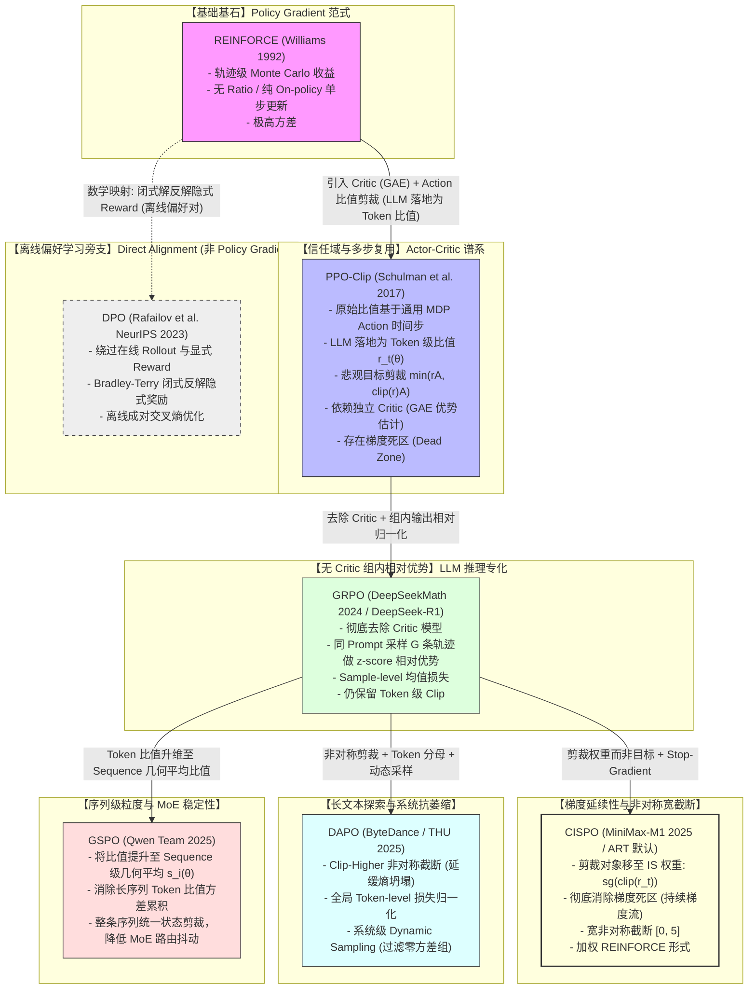
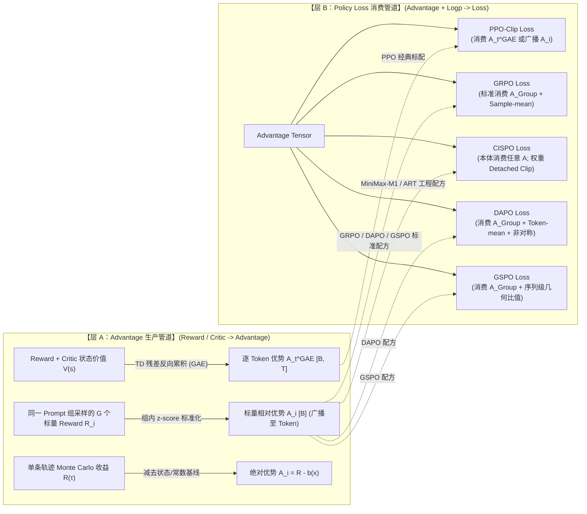

# 专题：PPO、GRPO、CISPO、REINFORCE、DAPO、GSPO、DPO 的关系、差异与 Loss 实现

> **适用读者**：大模型强化学习（LLM-RL）、智能体（Agentic Systems）及对齐算法工程师。  
> **核心目标**：从统一的目标函数骨架出发，彻底理清各大主流 RL/Alignment 算法在**重要性采样、优势估计、梯度截断、归一化粒度与系统调度**上的演进逻辑，并结合 PyTorch 最小可运行代码与真实工业级系统（如 OpenPipe ART / agentic-gov）完成落地理解。

---

## 1. 结论与全景导航图

在 Large Language Model (LLM) 与自主智能体（Agent）的后训练（Post-Training）阶段，策略优化算法经历了从传统强化学习（Policy Gradient / Actor-Critic）到大规模群体相对优化（Group Relative），再到梯度连续性与序列级长程建模的快速演进。

下图展示了从基础 **REINFORCE** 到各类现代变体、以及独立偏好对齐分支 **DPO** 的数学与机制拓扑关系：



> **重要概念澄清（MDP Action 与 Token-level 落地）**：  
> Schulman et al. (2017) 原始 PPO 论文定义在通用马尔可夫决策过程（MDP）的离散/连续动作时间步 $a_t \sim \pi(a_t \mid s_t)$ 之上。在自回归 LLM / RLHF 语境中，生成下一个词被建模为一个单步动作（$s_t = (x, y_{<t}), a_t = y_t$），因此 PPO 在 LLM 工程落地中自然对应为 **Token 级比值**。请读者注意：PPO 原始理论并非专为 NLP Token 设计，Token-level 是其在自回归生成任务中的具体实例化。上述拓扑展示的是**数学构成部件（比值形式、优势基线、截断算子、归一化粒度、在线/离线）**的演化逻辑，而非单一时间线因果。

---

## 2. 统一记号、共同骨架与二层解耦架构

为了在同一坐标系下无歧义地对比所有算法，我们统一约定以下数学记号，并首先建立**优势生成与损失消费的二层解耦视图**。

### 2.1 统一数学记号

| 符号 | 含义 | 维度 / 范围 |
| :--- | :--- | :--- |
| $x \sim \mathcal{D}$ | 输入 Prompt / 上下文 | 文本序列 |
| $y = (y_1, y_2, \dots, y_T)$ | 策略生成的完整输出序列（Response / Trajectory） | 长度为 $T$ 的 Token 序列 |
| $\pi_\theta(y \mid x)$ | 当前正在反向传播更新的策略（Learner Policy） | $\prod_{t=1}^T \pi_\theta(y_t \mid x, y_{<t})$ |
| $\pi_{\theta_{\text{old}}}(y \mid x)$ | 采样轨迹时使用的旧策略（Behavior / Rollout Policy） | 冻结参数 |
| $\pi_{\text{ref}}(y \mid x)$ | 初始参考模型 / SFT 模型（Reference Policy） | 冻结参数 |
| $r(x, y)$ 或 $R_i$ | 环境 / 规则验证器（Verifier） / 奖励模型给出的标量奖励 | $\mathbb{R}$ |
| $\hat{A}_t$ 或 $\hat{A}_i$ | 优势函数估计值（Advantage），$t$ 表示 Token 级（或 MDP 时间步），$i$ 表示序列级 | $\mathbb{R}$ |
| $r_t(\theta)$ | 重要性采样比值：自回归 LLM 中为单 Token 比值 $\frac{\pi_\theta(y_t \mid x, y_{<t})}{\pi_{\theta_{\text{old}}}(y_t \mid x, y_{<t})}$（原始 PPO 为通用 Action 步 $\frac{\pi(a_t \mid s_t)}{\pi_{\text{old}}(a_t \mid s_t)}$） | $\mathbb{R}^+$ |
| $s_i(\theta)$ | 序列级几何平均重要性比值：$\left(\frac{\pi_\theta(y_i \mid x)}{\pi_{\theta_{\text{old}}}(y_i \mid x)}\right)^{\frac{1}{\|y_i\|}}$ | $\mathbb{R}^+$ |
| $M_{i,t} \in \{0, 1\}$ | Assistant Token 掩码（屏蔽 Prompt 与 Padding） | $\{0, 1\}$ |
| $G$ | 同一个 Prompt 在组相对优化中采样的回答数量（Group Size） | 标量整数（如 4, 8, 16） |
| $\text{sg}(\cdot)$ | Stop-Gradient 截断算子（在 PyTorch 中对应 `.detach()`） | 阻断反向传播梯度 |

---

### 2.2 $\pi_\theta$ 是如何计算出来的？从 Transformer 隐藏状态到词表对数概率（Log-Prob）的完整物理链路

```mermaid
flowchart LR
    Tokens["Input Token IDs [B, N]<br/>(Prompt + Response)"] --> Backbone["Transformer 骨干网络<br/>(Self-Attention + MLP/MoE)"]
    Backbone --> Hidden["Hidden States H<br/>[B, N, D] (D=4096)"]
    Hidden --> LM_Head["LM Head (词表线性投影)<br/>logits = H · W_head"]
    LM_Head --> Logits["Logits 张量<br/>[B, N, V] (V=151936)"]
    Logits --> Shift["因果时序错位 (Causal Shift)<br/>logits[:, :-1, :] 预测 ids[:, 1:]"]
    Shift --> LogSoftmax["F.log_softmax(logits, dim=-1)<br/>数值稳定的全词表对数概率分布"]
    LogSoftmax --> Gather["torch.gather(..., target_ids)<br/>提取实际生成 Token 的对数似然"]
    Gather --> LogP["log π_θ(y_t | x, y_<t)<br/>标量张量 [B, T] (保留反向传播梯度)"]
```

在很多强化学习理论公式中，$\pi_\theta(y_t \mid x, y_{<t})$ 被抽象地写成一个概率符号。在自回归 Causal LLM 中，**$\pi_\theta$ 正是模型最后一层线性投影（LM Head）在整个词表（Vocabulary，大小为 $V$，如 32,000 或 151,936）上做 Softmax 之后，在实际采样到的那个具体 Token 索引 $y_t$ 处的标量条件概率**。



#### 完整前向计算的 5 个步骤（PyTorch 视角）：

1. **Transformer 骨干特征提取**：  
   将拼接好的 Prompt 与 Response 传入模型，输出最后一层隐藏状态：$H \in \mathbb{R}^{B \times N \times D}$（其中 $B$ 为 Batch 大小，$N$ 为总序列长度，$D$ 为隐藏层维度，如 4096）。
2. **LM Head 词表线性投影**：  
   通过输出投影矩阵 $W_{\text{head}} \in \mathbb{R}^{D \times V}$，将隐藏特征投影为未归一化的对数几率（Logits）：
   $$\text{logits} = H \cdot W_{\text{head}} \in \mathbb{R}^{B \times N \times V}$$
3. **因果错位对齐（Causal Shift）**：  
   因果语言模型是用位置 $t-1$ 的隐藏状态去预测位置 $t$ 的词。因此在 PyTorch 实现中，必须执行错位对齐：
   ```python
   shift_logits = logits[:, :-1, :].contiguous()       # [B, N-1, V]
   shift_labels = input_ids[:, 1:].contiguous()       # [B, N-1]
   ```
4. **数值稳定的 Log-Softmax 计算**：  
   千万不要先做 `softmax` 得到 $\pi \in (0, 1]$ 再取 $\log$！因为长尾词概率极小（如 $10^{-8}$），在 fp16/bf16 下会直接下溢为 0，导致 $\log(0) = -\infty$ 进而引发 Loss NaN。必须使用数值稳定的 `F.log_softmax`：
   $$\log P(v \mid s_t) = \text{logits}_{t, v} - \log \sum_{j=1}^V \exp(\text{logits}_{t, j})$$
5. **Gather 索引提取实际 Token 的概率**：  
   采样时实际生成的 Token ID 为 $y_t$。利用 `torch.gather` 提取对应词表索引处的标量：
   ```python
   # [B, N-1, V] -> [B, N-1, 1] -> [B, N-1]
   token_logprobs = shift_logits.log_softmax(dim=-1).gather(
       dim=-1, index=shift_labels.unsqueeze(-1)
   ).squeeze(-1)
   
   # 乘以 Assistant Mask 只保留回复部分: [B, T]
   new_logprobs = token_logprobs * assistant_mask
   ```

#### 💡 在 RL 训练系统中的分工（Worker vs. Learner）：
* **Rollout Worker（如 vLLM）**：自回归生成 $y_t$ 时，记录采样当时的 $\log \pi_{\theta_{\text{old}}}(y_t)$，存入 Batch 元数据（即 `old_logp`，无梯度）。
* **Training Learner（如 PyTorch）**：拿到完整的整个序列，做**单次前向传播（Forward Pass）**算出当前权重下的 `new_logp` = $\log \pi_\theta(y_t)$（带梯度计算图）。
* **重要性采样比值（Ratio）计算**：
  $$\text{log\_ratio} = \text{new\_logp} - \text{old\_logp} \implies r_t(\theta) = \exp(\text{log\_ratio})$$

---

### 2.3 共同目标骨架（The Unified Loss Skeleton）

所有 Policy Gradient 类算法的最小优化骨架，本质上都源于策略梯度定理定义的期望收益最大化，对应损失函数的一般形式为：

$$\mathcal{L}_{\text{PG}}(\theta) = - \frac{1}{\mathcal{Z}} \sum_{i} \sum_{t \in \text{assistant}} \mathcal{W}_{i,t}(\theta) \cdot \hat{A}_{i,t} \cdot \log \pi_\theta(y_{i,t} \mid x_i, y_{i,<t})$$

或者写成代理目标函数（Surrogate Objective）形式：

$$\mathcal{J}_{\text{surr}}(\theta) = \frac{1}{\mathcal{Z}} \sum_{i} \sum_{t \in \text{assistant}} \mathcal{F}\left( r_{i,t}(\theta), \hat{A}_{i,t} \right) - \beta \cdot \Omega(\pi_\theta, \pi_{\text{ref}})$$

所有算法的本质区别，在于对以下 **4 个核心构件** 的不同设计：

1. **重要性比值与截断算子 $\mathcal{W}_{i,t}$ / $\mathcal{F}(r, A)$**：
   - 恒等于 $1$（REINFORCE，无比值）；
   - 目标函数悲观剪裁 $\min(r A, \text{clip}(r) A)$（PPO, GRPO, DAPO；其中 PPO 为通用 Action 步剪裁，在 LLM 中落地为 Token 剪裁）；
   - 权重截断并阻断梯度 $\text{clip}(\text{sg}(r), 1-\epsilon_l, 1+\epsilon_h)$（CISPO）；
   - 序列级几何平均比值剪裁 $\min(s A, \text{clip}(s) A)$（GSPO）。
2. **优势估计基线 $\hat{A}_{i,t}$**：
   - 全轨迹 Monte Carlo 绝对收益 $R(\tau) - b(x)$（REINFORCE）；
   - 独立 Critic 估计的 GAE 逐步优势 $\hat{A}_t^{\text{GAE}}$（PPO）；
   - 组内采样输出均值与标准差相对归一化 $\frac{R_i - \mu_G}{\sigma_G}$（GRPO, CISPO, DAPO, GSPO）。
3. **损失归一化分母 $\mathcal{Z}$（Normalization Level）**：
   - 样本级归一化（Sample-Level）：先求每条序列的平均 Token 目标，再求 Batch 均值（GRPO）；
   - 全局 Token 级归一化（Token-Level）：直接除以全 Batch 有效 Token 总数（DAPO, CISPO）；
   - 引入分母地板保底（Floored Denominator）：$\max(\sum M, N_{\text{norm}})$（ART / agentic-gov）。
4. **正则约束项 $\Omega(\cdot)$**：
   - 无显式约束；或添加策略熵奖励 $\mathcal{H}(\pi_\theta)$；
   - 相对参考模型的 Token 级 KL 散度惩罚 $\beta D_{\text{KL}}(\pi_\theta \parallel \pi_{\text{ref}})$。

---

### 2.4 二层解耦：Advantage 生产管道（层 A）与 Policy Loss 消费管道（层 B）

> [!IMPORTANT]
> **切勿把“如何计算 Advantage”与“Loss 如何消费 Advantage”混为一谈！**  
> 在现代 LLM-RL 架构中，策略损失函数（Policy Loss）本质上只负责**消费张量 $\hat{A}$**，而**并不负责生产 $\hat{A}$**。$\hat{A}$ 的生成由上游的 Advantage Pipeline 决定。



#### 各方法 Advantage 来源与本体绑定关系表

下表彻底厘清各算法在“Advantage 来源”与“方法本体定义”之间的严格边界：

| 方法 | Advantage $\hat{A}$ 的来源 | 是否方法本体强绑定该来源 | 在学术原著 vs. 工业界 / agentic-gov 中的关系 |
| :--- | :--- | :--- | :--- |
| **REINFORCE** | 轨迹全量 Monte Carlo 回报减去基线：$R(\tau) - b(x)$ | ✅ 是（策略梯度定理的基础无偏形式） | 无偏但方差极大，无法支撑大模型长程稳定训练。 |
| **PPO** | 经典标配为独立 Critic 估计的 $\text{GAE}(\gamma, \lambda)$ 逐步优势 $\hat{A}_t^{\text{GAE}}$ | ❌ 否（PPO-Clip Loss 接收任意 $\hat{A}$，但 GAE 是经典 AC 标配） | 传统 RLHF（如 InstructGPT）标配，但 Critic 模型带来 50% 显存开销与价值漂移。 |
| **GRPO** | 同 Prompt 组内 $G$ 条回答标量奖励的 z-score：$\frac{R_i - \mu_G}{\sigma_G}$，广播到整条序列 | ✅ 是（无 Critic 的组相对统计是 GRPO 的**核心学术定义**） | DeepSeekMath / DeepSeek-R1 标配；零方差组会导致算力浪费。 |
| **DAPO** | 继承 GRPO 组相对优势（未修改 $\hat{A}$ 的数学公式） | 依赖 Group 相对优势 | ByteDance DAPO 原文在系统层增加 **Dynamic Sampling**，动态过滤并补采 $\sigma_G = 0$ 的组。 |
| **GSPO** | 继承 GRPO 组相对优势（未修改 $\hat{A}$ 的数学公式） | 依赖 Group 相对优势 | Qwen Team 原文核心创新在**序列级几何平均比值**与整序列剪裁，未另造新的 Advantage。 |
| **CISPO** | **本体解耦**：加权 REINFORCE 目标，**本体可消费任意合法来源的 $\hat{A}$** | ❌ 否（狭义 CISPO 仅定义 Detached Clip 权重与目标，未绑定特定 A） | **MiniMax 训练配方与 agentic-gov/ART** 均将 CISPO Loss 与 GRPO 的组相对优势组合使用。 |
| **DPO** | **无在线 Advantage 概念** | 不适用 | 纯离线偏好对齐，基于 Bradley-Terry 模型反解隐式奖励，无在线优势。 |

---

### 2.5 Advantage 的物理本质：通用含义与各变体的具象意义

#### 1. 通用物理含义：相对“平均预期水平”的边际超越度（Relative Marginal Improvement）

强化学习中的核心概念是 **$A(s, a) = Q(s, a) - V(s)$**：
* **Reward（奖励）** 回答的是：*“这个动作 / 这条回答**绝对有多好**？”*（绝对分值，包含 Prompt 天然难易程度的直流偏置 DC Bias）。
* **Advantage（优势）** 回答的是：*“在当前状态下，我采取这个具体动作，**比当前策略的‘平均预期水平’（Baseline）相对好多少（或差多少）**？”*

> **【通俗类比：为什么必须用 Advantage 替代 Reward？】**
> * **水题（全网通过率 99%，平均预期 $V(s) = 0.99$）**：
>   * 做对了拿 $R = +1.0$ $\implies$ $\hat{A} = 1.0 - 0.99 = \mathbf{+0.01}$（理所应当，微调即可）；
>   * 做错了拿 $R = 0.0$ $\implies$ $\hat{A} = 0.0 - 0.99 = \mathbf{-0.99}$（低级失误，施加极其强烈的负梯度修正）。
> * **难题（全网通过率 10%，平均预期 $V(s) = 0.10$）**：
>   * 做对了拿 $R = +1.0$ $\implies$ $\hat{A} = 1.0 - 0.10 = \mathbf{+0.90}$（惊艳突破，施加巨大正梯度大力强化！）；
>   * 做错了拿 $R = 0.0$ $\implies$ $\hat{A} = 0.0 - 0.10 = \mathbf{-0.10}$（情理之中，施加轻微负梯度）。
> 
> **物理结论**：Advantage 抹平了任务本身的天然难度差异，只度量具体动作带来的**边际惊喜度（Surprise / Excess Return）**，从数学上最大化信噪比并消除梯度估计的巨大方差。

---

#### 2. 各算法变体中 Advantage 的具象物理含义

虽然通用内核都是“相对基准”，但不同变体根据**基准（Baseline）的构造方式与统计粒度**赋予了 Advantage 不同的具象物理含义：

| 算法变体 | Advantage 的具象物理含义 | 比较的基准参照物（Baseline） | 物理粒度 |
| :--- | :--- | :--- | :--- |
| **REINFORCE** | **全局期望回报偏离度**：整条回答相对历史全局均值的总体好坏。 | 全局历史平均回报 $b(x)$ | 序列级标量 |
| **PPO (GAE)** | **时序局部惊喜度（Credit Assignment）**：生成第 $t$ 个特定 Token，相比生成该 Token 前的预期剩余胜率，带来了多大的即时信息增益。 | 独立 Critic 网络对当前状态的前瞻价值 $V_\phi(s_t)$ | **Token 级密集时序向量** $[B, T]$ |
| **GRPO** | **同侪相对排位（Peer Competition）**：同一道题下，当前回答在同批参考的 $G$ 个考生中处于前百分之几的相对排位（z-score 标准化）。 | 同 Prompt 组内 $G$ 条采样的经验均值 $\mu_G$ 与方差 $\sigma_G$ | 组内相对标量（广播至 Token） |
| **DAPO** | **有效同侪排位**：在过滤掉“全对或全错”毫无区分度的无效考场后，保留有效考场的同侪相对排位。 | 动态重采样后的非零方差组均值与方差 | 组内相对标量（广播至 Token） |
| **GSPO** | **序列整体同侪排位**：整条回答作为整体的组内排位，驱动序列级几何比值进行统一缩放。 | 同 Prompt 组内 $G$ 条采样的经验均值 $\mu_G$ 与方差 $\sigma_G$ | 序列级标量 |
| **CISPO** | **加权探索推进力**：组内相对优劣程度，结合当前动作的探索偏离权重（Exploration Weight），共同决定梯度的推进步长。 | 外部输入的基准（配方常为组内 $\mu_G, \sigma_G$） | 标量优势 $\times$ 逐词 Detached 权重 |
| **DPO** | **离线隐式胜率边际（Log-Odds Margin）**：以 SFT 参考模型为中立原点，胜出回答相对失败回答的隐式奖励相对边际。 | 失败回答在当前模型与参考模型下的隐式得分 | 成对偏好边际差值 |

---

## 3. 逐个算法深度剖析

---

### 3.1 REINFORCE (Williams 1992)

* **数据来源**：纯在线（On-Policy）实时采样轨迹 $\tau \sim \pi_\theta$。
* **核心 Objective / Loss**：
  $$\mathcal{L}_{\text{REINFORCE}}(\theta) = - \mathbb{E}_{\tau \sim \pi_\theta} \left[ \sum_{t=1}^T \log \pi_\theta(y_t \mid x, y_{<t}) \cdot \left( R(\tau) - b(x) \right) \right]$$
* **梯度物理含义**：
  $$\nabla_\theta \mathcal{L} = - \sum_{t=1}^T \nabla_\theta \log \pi_\theta(y_t) \cdot \hat{A}$$
  *“如果这整条回答的最终总分高于基线（$\hat{A} > 0$），就把生成这条回答中每一个 Token 的对数概率按同等力度推高；反之推低。”*
* **相较共同骨架改动**：最原始基石。没有重要性采样比值（$r_t = 1$），无多步更新。
* **解决的问题**：无需构建复杂的动态规划或价值函数，直接通过 Monte Carlo 采样端到端优化不可导的奖励信号。
* **代价与失败模式**：
  1. **方差极大**：使用完整的单次轨迹收益作为长期回报估计，长序列累积方差剧烈；
  2. **数据利用率极低**：严格要求 On-policy，采样出的 Batch 数据只能反向传播更新 **1 次**，随后策略参数变化导致数据失效，无法进行多 Epoch 或异步训练。

---

### 3.2 PPO (Proximal Policy Optimization, Schulman et al. 2017)

* **理论溯源与 LLM 落地映射**：  
  Schulman et al. (2017) 原始 PPO 论文是在连续控制（MuJoCo）与 Atari 游戏等标准强化学习环境下验证的，其重要性采样比值严格定义在一般动作时间步（Action Timestep）上：$r_t(\theta) = \frac{\pi_\theta(a_t \mid s_t)}{\pi_{\theta_{\text{old}}}(a_t \mid s_t)}$。  
  随着 InstructGPT (Ouyang et al. 2022) 等工作将 PPO 引入大语言模型对齐（RLHF），自回归文本生成被严格形式化为 MDP：环境状态为 Prompt 加上当前已生成的前缀 $s_t = (x, y_1, \dots, y_{t-1})$，动作为当前词表输出 $a_t = y_t \in \mathcal{V}$。因此，**“Token-Level Ratio” 是 PPO 在自回归文本生成这一特定 MDP 下的工程落地形式，而非 Schulman 2017 原始论文的天然限定**。
* **Advantage 管道实现（Critic + GAE 深度解析）**：  
  PPO 经典实践依赖一个与 Actor 同量级的独立 Critic 网络 $V_\phi(s)$ 预测状态价值。对于生成的序列，逐步 TD 残差 $\delta_t$ 与广义优势估计（GAE）定义为：
  $$\delta_t = r_t + \gamma V_\phi(s_{t+1}) - V_\phi(s_t)$$
  $$\hat{A}_t^{\text{GAE}(\gamma, \lambda)} = \sum_{l=0}^\infty (\gamma \lambda)^l \delta_{t+l} = \delta_t + (\gamma \lambda) \hat{A}_{t+1}^{\text{GAE}}$$

  > **【深度剖析：为什么是“句末给 $R$、中间给 KL”，以及什么是“密集的信用分配”？】**
  > 
  > 1. **奖励稀疏性（Sparse Outcome Reward）**：在数学推理、代码生成或多轮对话中，环境、单元测试或 Verifier 只有在**整条回答全部生成完毕（遇到 `<eos>` 或句末 $t=T$）**时才能评判最终对错，给出终局标量奖励 $R_{\text{env}} \in \{0, 1\}$；在生成第 $1$ 到第 $T-1$ 个中间 Token 时，外部环境无法给出即时判定，因此中间步的环境奖励为 0。
  > 2. **步级 KL 惩罚分解**：为了防止策略模型在优化过程中偏离基座 SFT 模型过远（导致语法崩溃或欺骗 Reward Model 的 Reward Hacking），标准 RLHF 将全局 KL 散度约束 $\beta D_{\text{KL}}$ 按自回归概率的对数可加性**均摊分解到生成的每一个 Token 动作步**：$r_t^{\text{KL}} = -\beta (\log \pi_\theta(y_t \mid x, y_{<t}) - \log \pi_{\text{ref}}(y_t \mid x, y_{<t}))$。因此强化学习 MDP 在每一个时间步 $t$ 接收到的瞬时合成奖励为：
  >    - **中间时间步（$t < T$）**：$r_t = 0 + r_t^{\text{KL}} = -\beta \log \frac{\pi_\theta(y_t)}{\pi_{\text{ref}}(y_t)}$（仅包含步级偏离惩罚）；
  >    - **终局时间步（$t = T$）**：$r_T = R_{\text{env}} + r_T^{\text{KL}} = R_{\text{env}} - \beta \log \frac{\pi_\theta(y_T)}{\pi_{\text{ref}}(y_T)}$（环境总分 $R$ 叠加最后一步的 KL 惩罚）。
  > 3. **什么是“密集的信用分配（Credit Assignment）”？**：
  >    - **核心痛点**：若一条长达 500 Token 的数学回答最终做对了（拿到了终局满分 $R=+1$），究竟是**第 50 步写出的关键引理转换**立了大功，还是**第 450 步一句无关紧要的修饰词**立了功？若缺乏信用分配机制，算法只能将奖励平均分给 500 个词（大锅饭）。
  >    - **Critic + GAE 的解法**：Critic 网络 $V_\phi(s_t)$ 学习评估“从当前前缀状态 $s_t$ 开始往后，未来期望能拿到的累积回报”。如果在第 50 步模型写出一个关键突破词，使得 Critic 对未来的期望预估从 $V(s_{50}) = 0.2$ 瞬间暴涨到 $V(s_{51}) = 0.9$，那么即使该步环境即时得分 $r_{50} \approx 0$，单步 TD 残差 $\delta_{50} \approx 0.9 - 0.2 = +0.7$ 依然巨大！经 GAE 指数加权反向累积后，**第 50 步的 Token 获得极高的优势标量 $\hat{A}_{50}$，而平庸废话步骤的 $\hat{A}$ 接近 0，犯错步骤的 $\hat{A}$ 为负**。这就是“密集信用分配”——精准度量每一步动作的功过。
  > 4. **与“Outcome Reward 广播标量”的本质区别与 PPO-Clip 的消费端定位**：
  >    - **广播标量（如 GRPO / 简化配方）**：不训练 Critic，直接拿整条回答的组内标量优势 $\hat{A}_{\text{group}} \in [B]$ 复制广播给全序列（$\hat{A}_{i, 1} = \hat{A}_{i, 2} = \dots = \hat{A}_{i, T} = \hat{A}_{\text{group}}$）。此时所有 Token 共享同一个全局标量，不具备步级精细信用分配能力。
  >    - **PPO-Clip 只是消费端**：PPO 损失公式 $\mathcal{L}_{\text{PPO}} = -\min\left( r_t(\theta) \hat{A}_t, \, \text{clip}(r_t(\theta), 1-\epsilon, 1+\epsilon) \hat{A}_t \right)$ 仅要求输入一个形状对齐的优势张量 $\hat{A} \in [B, T]$。**无论上游传入的是 GAE 算出的逐词差异化优势 $\hat{A}_t^{\text{GAE}}$，还是没有 Critic 直接广播过来的全局标量 $\hat{A}_{\text{broadcast}}$，PPO-Clip Loss 都能正常执行悲观剪裁并计算梯度**。这再次印证了 Advantage 生产端与 Loss 消费端的严格解耦。
* **核心 Objective / Loss**：
  $$\mathcal{L}_{\text{PPO-CLIP}}(\theta) = - \mathbb{E}_t \left[ \min\left( r_t(\theta) \hat{A}_t, \, \text{clip}\left( r_t(\theta), 1-\epsilon, 1+\epsilon \right) \hat{A}_t \right) \right] + c_1 \mathcal{L}_{\text{VF}}(\phi) - c_2 \mathcal{H}(\pi_\theta)$$
* **梯度物理含义与梯度死区（Dead Zone）**：
  考虑正向优势 $\hat{A}_t > 0$：
  * 当 $r_t(\theta) \le 1+\epsilon$ 时：目标为 $r_t(\theta) \hat{A}_t$，梯度为 $\frac{\nabla_\theta \pi_\theta}{\pi_{\text{old}}} \hat{A}_t$，正常推高概率；
  * 当 $r_t(\theta) > 1+\epsilon$ 时：目标被截断为常数 $(1+\epsilon)\hat{A}_t$。**对 $\theta$ 的一阶导数严格为 0**！
  * *“一旦该 Token 的概率比采样时增加了超过 20%，优化器判定其已离开信任域，立即把该 Token 的梯度完全切断（梯度死区）。”*
* **解决的问题**：通过重要性采样与悲观剪裁限制单步更新幅度，避免策略更新步长过大导致性能崩溃，大幅提升了数据复用率；GAE 提供了低方差的逐步信用分配。
* **代价与失败模式**：
  1. **Critic 显存与算力负担沉重**：LLM 场景下 Critic 也是 7B~70B 模型，吞噬 50% 显存；
  2. **Critic 价值漂移（Value Drift / Value Misfit）**：在数学推理长链条中，Critic 极难准确评估中间步骤的价值，价值网络失准会直接导致策略优化震荡发散；
  3. **关键探索 Token 梯度丢失**：低频关键词（如 “Wait”, 工具调用）探索成功后概率激增，极易越过 $1+\epsilon$ 掉入死区，无法有效固化。

---

### 3.3 GRPO (Group Relative Policy Optimization, DeepSeekMath 2024 / DeepSeek-R1)

* **数据来源**：针对同一个 Prompt $x$，并发采样 $G$ 条完整回答 $\{y_1, y_2, \dots, y_G\} \sim \pi_{\theta_{\text{old}}}(Y \mid x)$。
* **Advantage 管道实现（Group-Relative Advantage）**：  
  彻底废弃 Critic 模型，利用同 Prompt 组内采样的经验分布构造基线：
  $$\mu_G = \frac{1}{G} \sum_{i=1}^G R(x, y_i), \quad \sigma_G = \sqrt{\frac{1}{G} \sum_{i=1}^G (R(x, y_i) - \mu_G)^2 + \epsilon_{\text{std}}}$$
  $$\hat{A}_i = \frac{R_i - \mu_G}{\sigma_G}$$
  标量 $\hat{A}_i$ 广播应用到回答 $y_i$ 的每一个有效 Token。
* **核心 Objective / Loss**：
  $$\mathcal{J}_{\text{GRPO}}(\theta) = \mathbb{E}_{x \sim \mathcal{D}, \{y_i\}_{i=1}^G \sim \pi_{\theta_{\text{old}}}} \left[ \frac{1}{G} \sum_{i=1}^G \frac{1}{|y_i|} \sum_{t=1}^{|y_i|} \left\{ \min\left( r_{i,t}(\theta) \hat{A}_i, \, \text{clip}\left( r_{i,t}(\theta), 1-\epsilon, 1+\epsilon \right) \hat{A}_i \right) - \beta D_{\text{KL}}(\pi_\theta \parallel \pi_{\text{ref}}) \right\} \right]$$
  KL 散度通常采用 Schulman 无偏估计：$D_{\text{KL}} \approx \frac{\pi_{\text{ref}}}{\pi_\theta} - \log \frac{\pi_{\text{ref}}}{\pi_\theta} - 1$ 或 $\log \frac{\pi_\theta}{\pi_{\text{ref}}}$。
* **相较共同骨架改动**：
  1. **彻底废除 Critic 网络**：用组统计量替代 Critic；
  2. **损失归一化为 Sample-Level**：外层 $\frac{1}{G} \sum$，内层 $\frac{1}{|y_i|} \sum$。
* **解决的问题**：彻底消除了 Critic 模型带来的显存压力与协同训练崩溃风险，在数学、代码等具备确定性 Verifier 的推理任务上表现极佳。
* **代价与失败模式**：
  1. **零方差组（Zero-Variance Group）梯度饥饿**：全对或全错时 $\sigma_G = 0 \implies \hat{A}_i = 0$，产生 0 梯度浪费算力；
  2. **Sample-level 均值带来长度偏置**：长回答中的 Token 被 $\frac{1}{|y_i|}$ 稀释，短回答中的单个 Token 拥有更大梯度权重；
  3. **依然存在 Token-level 梯度死区**。

---

### 3.4 CISPO (Clipped Importance Sampling Policy Optimization, MiniMax-M1 2025 / ART 默认)

* **方法本体与训练配方的边界解耦**：  
  * **狭义 CISPO 本体**：是一种**改进重要性采样梯度行为的通用 Policy Loss**。核心定义是**对 Detached 的重要性比值权重进行剪裁**，形式回归加权 REINFORCE：$L = - \text{clip}(\text{sg}(r), 1-\epsilon_l, 1+\epsilon_h) \cdot \hat{A} \cdot \log \pi$。**CISPO 本体并不强制要求特定的 Advantage 形式**，理论上可以消费 GAE、MC 收益或组相对优势。  
  * **MiniMax-M1 与 OpenPipe ART / agentic-gov 的训练配方**：在工业落地中，将 CISPO Loss 与 GRPO 的无 Critic 组相对优势（Group Advantage）结合，既享受组相对归一化的零显存负担，又享受 Detached Clip 的无梯度死区特性。
* **核心 Objective / Loss**：
  $$\mathcal{L}_{\text{CISPO}}(\theta) = - \frac{1}{\mathcal{Z}} \sum_{i=1}^B \sum_{t \in \text{assistant}} \text{clip}\left( \text{sg}\left( \frac{\pi_\theta(y_{i,t} \mid s_{i,t})}{\pi_{\theta_{\text{old}}}(y_{i,t} \mid s_{i,t})} \right), \, 1-\epsilon_{\text{low}}, \, 1+\epsilon_{\text{high}} \right) \cdot \hat{A}_i \cdot \log \pi_\theta(y_{i,t} \mid s_{i,t})$$
  其中 $\text{sg}(\cdot)$ 为 Stop-Gradient 操作符（在 PyTorch 中为 `prob_ratio.detach()`）。
* **梯度推导与物理含义**：
  $$\nabla_\theta \mathcal{L}_{\text{CISPO}} = - \frac{1}{\mathcal{Z}} \sum_{i, t} \underbrace{\text{clip}\left( \frac{\pi_\theta(y_{i,t})}{\pi_{\theta_{\text{old}}}(y_{i,t})}, 1-\epsilon_{\text{low}}, 1+\epsilon_{\text{high}} \right)}_{\text{常数标量权重 } w_{i,t} \text{（不参与求导）}} \cdot \hat{A}_i \cdot \nabla_\theta \log \pi_\theta(y_{i,t})$$
  *“无论策略如何更新，只要 $\hat{A}_i \neq 0$，每一个有效 Token 永远保持非零的优化梯度！比值超出安全范围时，只限制其梯度放大的最大系数（例如限制在 $[0, 5]$ 内），绝不简单粗暴地将梯度截断为 0。”*
* **相较共同骨架改动**：
  * 将剪裁对象从“目标函数”转移到了“重要性权重”，形式回归加权 REINFORCE；
  * 默认采用更宽的非对称剪裁范围（如 MiniMax-M1 与 ART 默认配置 $\epsilon_{\text{low}}=1.0, \epsilon_{\text{high}}=4.0$，即比值区间 $[0, 5]$）。
* **解决的问题**：彻底消除梯度死区，保证稀有但关键的推理转折 Token 持续获得梯度；对异步 Rollout 的轻微漂移具有极高宽容度。
* **代价与失败模式**：若优势估计存在严重 Reward Hacking，持续非零的梯度可能加速错误方向探索，需配合 KL 惩罚或优势截断。

---

### 3.5 DAPO (Decoupled Clip & Dynamic Sampling, ByteDance/THU 2025, arXiv:2503.14476)

* **核心定位与 Advantage 来源**：DAPO 建立在 GRPO 的无 Critic 组相对优势框架之上（未改变 $\hat{A}_i$ 的数学定义）。它的创新主要集中在 **Loss 内部的非对称剪裁与全局 Token 归一化**，以及 **Loss 外部系统级的动态重采样（Dynamic Sampling）**。
* **核心 Objective / Loss 与四大支柱**：

  $$\mathcal{L}_{\text{DAPO}}(\theta) = - \frac{1}{\sum_{i=1}^G |y_i|} \sum_{i=1}^G \sum_{t=1}^{|y_i|} \min\left( r_{i,t}(\theta) \hat{A}_i, \, \text{clip}\left( r_{i,t}(\theta), 1-\epsilon_{\text{low}}, 1+\epsilon_{\text{high}} \right) \hat{A}_i \right)$$

  | DAPO 支柱 | 所属层级 | 具体机制与解决的病灶 |
  | :--- | :--- | :--- |
  | **Clip-Higher（非对称裁剪）** | Loss 内部 | 将对称剪裁 $[0.8, 1.2]$ 改为非对称 $[0.8, 1.28]$（$\epsilon_{\text{high}} > \epsilon_{\text{low}}$）。允许正向探索有更大的概率提升空间，**直接延缓策略熵坍塌（Entropy Collapse）**。 |
  | **Token-Level Loss 归一化** | Loss 内部 | 弃用 GRPO 的序列均值，直接用全 Batch 总有效 Token 数 $\sum |y_i|$ 作为唯二分母。**赋予每个 Token 平等的梯度权利，消除对长 CoT 推理链的欠加权惩罚**。 |
  | **Dynamic Sampling（动态采样）** | 训练系统外围 | 在 Rollout 阶段动态检测并**丢弃全部正确/全部错误的零方差 Prompt 组**，持续补采直到填满有效 Batch，根除算力浪费与梯度饥饿。 |
  | **Overlong Reward Shaping** | 奖励系统 | 对超长或被强制截断的回答施加平滑惩罚，抑制模型无意义的字数膨胀。 |

---

### 3.6 GSPO (Group Sequence Policy Optimization, Qwen Team 2025, arXiv:2507.18071)

* **核心定位与 Advantage 来源**：GSPO 同样复用了 GRPO 的组相对优势估算管道，但重点重构了**重要性采样的粒度**。
* **核心 Objective / Loss**：
  $$\mathcal{J}_{\text{GSPO}}(\theta) = \mathbb{E}_{x, \{y_i\}_{i=1}^G} \left[ \frac{1}{G} \sum_{i=1}^G \min\left( s_i(\theta) \hat{A}_i, \, \text{clip}\left( s_i(\theta), 1-\epsilon, 1+\epsilon \right) \hat{A}_i \right) \right]$$
  其中**序列级重要性采样比值（长度归一化的几何平均）**定义为：
  $$s_i(\theta) = \left( \frac{\pi_\theta(y_i \mid x)}{\pi_{\theta_{\text{old}}}(y_i \mid x)} \right)^{\frac{1}{|y_i|}} = \exp\left( \frac{1}{|y_i|} \sum_{t=1}^{|y_i|} \left( \log \pi_\theta(y_{i,t}) - \log \pi_{\theta_{\text{old}}}(y_{i,t}) \right) \right)$$
* **梯度展开与物理含义**：
  $$\nabla_\theta \mathcal{J}_{\text{GSPO}} = \frac{1}{G} \sum_{i=1}^G \mathbb{I}_{\text{active}}(s_i) \cdot \left( \frac{s_i(\theta)}{|y_i|} \hat{A}_i \right) \cdot \sum_{t=1}^{|y_i|} \nabla_\theta \log \pi_\theta(y_{i,t})$$
  *“整条序列作为一个不可分割的整体，共享完全相同的标量重要性比值 $s_i(\theta)$。序列内的所有 Token 要么一起进入信任域被同等比例优化，要么一起被 Clip，彻底消灭了序列内部 Token 间的方差撕裂。”*
* **解决的问题**：根治长推理链中 Token 级比值方差爆炸导致的策略崩溃；大幅减少 MoE 路由抖动。

---

### 3.7 DPO (Direct Preference Optimization, Rafailov et al. NeurIPS 2023)

* **数据来源**：**离线静态成对偏好数据集** $\mathcal{D} = \{(x, y_w, y_l)\}$，其中 $y_w$ 为胜出回答（Winner），$y_l$ 为失败回答（Loser）。
* **核心 Objective / Loss**：
  $$\mathcal{L}_{\text{DPO}}(\theta; \pi_{\text{ref}}) = - \mathbb{E}_{(x, y_w, y_l) \sim \mathcal{D}} \left[ \log \sigma \left( \beta \log \frac{\pi_\theta(y_w \mid x)}{\pi_{\text{ref}}(y_w \mid x)} - \beta \log \frac{\pi_\theta(y_l \mid x)}{\pi_{\text{ref}}(y_l \mid x)} \right) \right]$$
  定义策略的**隐式奖励（Implicit Reward）**：$\hat{r}_\theta(x, y) = \beta \log \frac{\pi_\theta(y \mid x)}{\pi_{\text{ref}}(y \mid x)}$。
* **为什么 DPO 不属于 Policy Gradient 谱系**：
  1. **无在线采样与 Rollout**：直接在固定离线数据集上做监督式更新；
  2. **无显式优势基线与比值**：不使用策略梯度定理，而是基于 Bradley-Terry 偏好模型的最优策略解析解闭式反解。
* **代价与失败模式**：无法进行在线探索（Out-of-Distribution Exploration），容易发生隐式奖励溢出或长度偏置欺骗。

---

## 4. 逐维全景对照表

| 对照维度 | REINFORCE | PPO (PPO-Clip) | GRPO | CISPO | DAPO | GSPO | DPO |
| :--- | :--- | :--- | :--- | :--- | :--- | :--- | :--- |
| **范式归属** | Policy Gradient (On-policy) | Actor-Critic (Near On-policy) | Group Relative PG | Clipped-IS PG | Asymmetric Token-PG | Sequence-level PG | Offline Preference Optimization |
| **在线 / 离线** | 严格在线单步 | 在线采样 + 组内微弱离线多 Epoch | 在线组采样 | 在线组采样 (容忍异步 Drift) | 在线组采样 + 动态重采样 | 在线组采样 | 纯离线成对数据 |
| **Reward 来源** | 环境/终局评分 | Reward Model / 环境 | Verifier / 规则 / RM | Verifier / 规则 / RM | Verifier / 规则 / RM | Verifier / 规则 / RM | 偏好成对标注 $(y_w \succ y_l)$ |
| **Critic 网络** | ❌ 无 (可加标量 baseline) | ✅ 必须 (显存占用大) | ❌ 无 (组统计替代) | ❌ 无 (组统计替代) | ❌ 无 (组统计替代) | ❌ 无 (组统计替代) | ❌ 无 (隐式奖励) |
| **Reference 模型** | ❌ 无 | ⚪ 可选 (KL 惩罚) | ✅ 显式 KL 惩罚 | ⚪ 可选 (KL 优势调整) | ✅ 显式 KL 惩罚 | ⚪ 可选 (KL 惩罚) | ✅ 必须 (隐式基准) |
| **Advantage 定义** | $R(\tau) - b(x)$ | GAE $\hat{A}_t^{\text{GAE}}$ (逐步优势) | $\frac{R_i - \mu_G}{\sigma_G}$ (组内 z-score) | 任意合法 $\hat{A}$ (配方常用组优势) | $\frac{R_i - \mu_G}{\sigma_G}$ (组内 z-score) | $\frac{R_i - \mu_G}{\sigma_G}$ (组内 z-score) | 无 (隐式边际 $\hat{r}_w - \hat{r}_l$) |
| **Ratio 计算粒度** | 无 ($r_t=1$) | 通用 Action 级（LLM 落地为 Token 级）: $\frac{\pi(y_t)}{\pi_{\text{old}}(y_t)}$ | Token 级: $\frac{\pi(y_t)}{\pi_{\text{old}}(y_t)}$ | Token 级: $\frac{\pi(y_t)}{\pi_{\text{old}}(y_t)}$ | Token 级: $\frac{\pi(y_t)}{\pi_{\text{old}}(y_t)}$ | **Sequence 几何平均**: $(\frac{\pi(y)}{\pi_{\text{old}}(y)})^{\frac{1}{\|y\|}}$ | 无 |
| **Clip 与梯度死区** | 无 Clip | 对称截断；**存在梯度死区** | 对称截断；**存在梯度死区** | 剪裁权重并 Detach；**无梯度死区** | 非对称 Clip-Higher；**死区推迟** | 序列级对称截断；**整序同状态** | Sigmoid 连续软饱和 |
| **Loss 归一化分母** | 样本序列数 $B$ | 有效 Token 均值 | **Sample-Level**: $\frac{1}{G}\sum \frac{1}{\|y_i\|}\sum$ | **Token-Level**: $\sum M$ (或加 Floor) | **Token-Level**: $\sum \|y_i\|$ | 序列数 $G$ | 样本对数 $B$ |
| **对长推理链影响** | 方差随长度线性爆炸 | Token 级累积噪声大 | 均值分母欠加权长 CoT | 保留长链关键 Token 梯度 | 平等对待长短 CoT 的每个 Token | 几何平均平滑长链比值噪声 | 易偏向更长的模式 |
| **组采样 (Group) 作用** | 无 (单条 Rollout) | 无 (单条/多条独立) | 计算组内相对优势 | 计算组内相对优势 | 计算组优势 + 动态采样过滤 | 计算组内相对优势 | 偏好成对构造 |

---

## 5. 为什么这些差异 Matters：5 大工业级场景解析

### 场景 1：零方差组（Zero-Variance Group）与算力黑洞
* **现象**：在 DeepSeek-R1 / Agent 任务训练中，简单题所有采样回答全部做对（$R=[1, 1, 1, 1]$），难题全部做错（$R=[0, 0, 0, 0]$）。
* **数学机理**：在 GRPO / CISPO 中，$\mu = 1.0, \sigma = 0 \implies \hat{A}_i = 0$。整批昂贵的 Rollout 算力生成的梯度完全为 0。
* **工程解法**：DAPO 提出 **Dynamic Sampling**，在 Rollout 引擎层动态识别 $\sigma^2 < \epsilon$ 的组并直接丢弃，持续异步补采直到填满有效梯度批次；agentic-gov 则引入了 **Learnability Pool 难度分层与 Canary 探针**，主动规避零方差区间。

### 场景 2：梯度死区（Gradient Dead Zone）导致关键决策 Token 丢失
* **现象**：Agent 探索出了正确的工具调用格式（如 `call_api(id=12)`），该关键 Token 在采样时概率仅为 $0.01$，更新后提升至 $0.05$（Ratio = 5.0）。
* **数学机理**：标准 PPO/GRPO 的 Clip 上界为 $1.2$。由于 $5.0 > 1.2$ 且 $\hat{A} > 0$，目标函数进入常数区间，导数直接归零！优化器无法继续强化这个绝佳的探索点。
* **工程解法**：**CISPO** 裁剪的是 Detached 权重，梯度仍为 $\text{clip}(5.0, 0, 5) \cdot \hat{A} \cdot \nabla \log \pi = 5.0 \cdot \hat{A} \cdot \nabla \log \pi$。梯度保持强烈激活，模型迅速固化该推理逻辑。

### 场景 3：长推理链惩罚与分母偏置（Normalization Bias）
* **现象**：一条深度思考长回答（2000 tokens）与一条粗糙短回答（100 tokens）都获得了 $+1.0$ 的奖励，但模型更倾向于退化为短回答。
* **数学机理**：GRPO 采用 Sample-Level 归一化：短回答每个 Token 分到的梯度权重是 $\frac{1}{100}$，长回答每个 Token 仅为 $\frac{1}{2000}$（相差 20 倍）。
* **工程解法**：DAPO 采用全局 Token 归一化 $\frac{1}{\sum T}$；agentic-gov / ART 引入 **$N_{\text{norm}}$ 分母地板**，防止极短的报错样本单 Token 梯度过大击穿 LoRA 权重。

### 场景 4：异步推理-训练架构（Async RL）下的策略滞后（Policy Staleness）与各变体公式支持度

在大规模工业级强化学习系统（如 vLLM/SGLang 作为并发 Rollout Workers，Megatron/DeepSpeed 作为 Learner）中，**推理与训练解耦的异步架构（Async RL）是提升 GPU 吞吐量的主流方向**。但在 Async 架构下，Rollout 采样时使用的策略 $\theta_{\text{old}} = \theta_k$ 与 Learner 实际计算梯度时的策略 $\theta_{\text{new}} = \theta_{k+\Delta}$ 存在天然的时间差（**Policy Staleness / Policy Lag $\Delta$**）。

#### 1. 如何从公式设计直接判断对 Async RL 的支持好坏？（5 大核心判别构件）

| 核心公式构件 | 对 Async RL 友好（强支持）的数学设计 | 对 Async RL 脆弱（弱支持）的数学设计 | 为什么（数学机理推导） |
| :--- | :--- | :--- | :--- |
| **① 梯度截断机制** | **CISPO (Detached 权重截断)**：<br/>$\text{clip}(\text{sg}(r), 1-\epsilon_l, 1+\epsilon_h) \cdot A \cdot \nabla \log \pi$ | **PPO / GRPO (目标函数剪裁)**：<br/>$\min(r A, \text{clip}(r) A)$ | **【致命死区问题】**：Async 延迟使得大量 Token 在进入 Learner 时比值就已漂出 $[0.8, 1.2]$。PPO/GRPO 会直接把导数置 0（进入死区），导致大量昂贵的异步采样数据被直接清零浪费；而 CISPO 保持梯度非零且方向正确，仅限制梯度放大系数。 |
| **② 比值聚合粒度** | **GSPO (序列级几何平均比值)**：<br/>$s_i = \exp\left( \frac{1}{\|y_i\|}\sum \log r_t \right)$ | **PPO / GRPO (Token 级独立比值)**：<br/>$r_t = \frac{\pi(y_t)}{\pi_{\text{old}}(y_t)}$ | **【长序列方差累积】**：在 4k~8k 的长推理链中，Async 滞后导致 Token 级比值随机散布（有的 0.3，有的 3.0），整条序列被割裂裁剪；GSPO 通过全序列长度归一化几何平均，将数千个 Token 的局部漂移抵消平滑，抗异步方差极强。 |
| **③ 剪裁区间宽度** | **CISPO / DAPO (宽/非对称剪裁)**：<br/>CISPO $[0, 5]$，DAPO $[0.8, 1.28]$ | **标准 PPO / GRPO (对称窄剪裁)**：<br/>$[0.8, 1.2]$ | **【容忍步级漂移】**：对称窄剪裁假设策略更新步长极小。Async 下的 Intra-step Drift 使得正向有益探索很容易超出 1.2。宽截断 $[0, 5]$ 在数学上天然包容 1~3 个 step 的策略滞后。 |
| **④ Advantage 对 Critic 的依赖** | **GRPO / CISPO / GSPO (无 Critic 组优势)**：<br/>$\hat{A}_i = \frac{R_i - \mu_G}{\sigma_G}$ | **PPO (依赖 Critic GAE 状态价值)**：<br/>$\delta_t = r_t + \gamma V_\phi(s_{t+1}) - V_\phi(s_t)$ | **【价值网络滞后脱节】**：Async 下不仅 Actor 滞后，Critic 也在滞后。Rollout 记录的 $V_{\text{old}}(s)$ 与 Learner 当前的 $V_{\text{new}}(s)$ 产生严重脱节（Value Misfit），导致 TD 残差剧烈震荡；无 Critic 组优势纯靠同题横向对比，完全不受全局 Critic 滞后污染。 |
| **⑤ 异常分母的保底机制** | **ART / agentic-gov ($N_{\text{norm}}$ 分母保底)**：<br/>$\max(\sum M, N_{\text{norm}})$ | **无保底分母**：<br/>直接除以实际 Token 数 $\sum M$ | **【异步异常样本冲击】**：Async 分布式集群中难免出现网络抖动、提前报错截断的超短样本（如 30 tokens）。无保底分母会导致该样本梯度放大上百倍击穿模型；$N_{\text{norm}}$ 保障了异常异步样本的梯度的有界性。 |

#### 2. 各算法对 Async RL 支持能力的综合梯队划分

* 🏆 **第一梯队（原生为 Async / 长程推理定制，支持最强）**：
  * **CISPO**：Detached 权重消灭死区 + $[0, 5]$ 宽截断 + 无 Critic 组优势。在异步漂移下吞吐平稳，是 OpenPipe ART、MiniMax-M1 等异步体系的默认主力。
  * **GSPO**：序列级几何平均比值平滑了长序列在异步环境下的累积方差，消除 Token 剪裁撕裂，极其适合异步 MoE 训练（Qwen Team 推荐）。
* 🥈 **第二梯队（良好支持，但需控制异步滞后 Lag $\le 1$）**：
  * **DAPO**：Clip-Higher 延缓死区 + 全局 Token 分母平滑长文本，但仍保留 Token 级剪裁；Dynamic Sampling 依赖组采样的同步性。
  * **GRPO**：去除了 Critic（远优于传统 PPO），但 Token-level 窄剪裁在异步滞后时梯度有效率明显下降。
* 🥉 **第三梯队（对 Async 最脆弱，需要复杂工程补丁）**：
  * **PPO (with Critic & GAE)**：双重脆弱性（Critic 滞后导致 Value Misfit + 窄剪裁导致梯度大面积清零），在异步架构下必须引入昂贵的 V-trace / IMPALA 重要性权重修正。
  * **REINFORCE**：纯 On-Policy，数学上假设 $\theta_{\text{old}} = \theta_{\text{new}}$，无法容忍任何异步延迟。
* ⚪ **独立范式**：
  * **DPO**：纯离线偏好，不涉及在线 Rollout。

### 场景 5：为什么 Deep Reasoning 必须用在线 RL 而不是 DPO
* **现象**：用 DPO 训练数学/逻辑推理模型，模型能学会标准的 Markdown 思考格式，但解题准确率很快遇到瓶颈。
* **数学机理**：DPO 仅能拟合静态数据中已有的正例分布。对于前所未见的复杂难题，模型必须在探索中走出全新的多步回溯、验证与自我纠错轨迹，并得到 Verifier 的精确反馈。DPO 无法生成并验证训练集以外的探索路径。

---

## 6. 结合 agentic-gov 与 OpenPipe ART 的落地实践阅读

在本地工作区 `agentic-gov` 与 OpenPipe ART 源码中，算法理论被高度工程化地组合落地：

### 6.1 ART 默认采用 Token-Level CISPO（`src/art/loss.py`）

查看 [loss.py](file:///Users/sunxichen/Projects/ART/src/art/loss.py#L188-L193)：

```python
if ppo:
    policy_loss = -torch.min(
        prob_ratio * advantages,
        torch.clip(prob_ratio, 1 - epsilon, 1 + epsilon_high) * advantages,
    )
else:
    # Modified REINFORCE or Clipped IS-weight Policy Optimization (CISPO)
    policy_loss = -(
        torch.clip(prob_ratio.detach(), 1 - epsilon, 1 + epsilon_high)
        * advantages
        * new_logprobs
    )
```

* ART 默认配置为 `ppo=False, epsilon=1.0, epsilon_high=4.0`，即**标准的宽截断 Token 级 CISPO 损失函数**。
* 比值计算支持多级粒度配置（`token`, `sequence`, `geometric_average`），与 GSPO 的序列级思想直接连通。

### 6.2 agentic-gov 的稳定性分母地板（`phase6/art/loss_norm_floor.py`）

查看 [loss_norm_floor.py](file:///Users/sunxichen/Projects/agentic-gov/phase6/art/loss_norm_floor.py#L96-L120)：

```python
def policy_denominator(
    mask_sum: float,
    *,
    reduction: Literal["mean", "sum"] = "mean",
    enabled: bool | None = None,
    n_norm: float | None = None,
) -> float:
    stock = stock_denominator(mask_sum, reduction=reduction)
    if not use_floor:
        return stock
    floor = float(loss_norm_n() if n_norm is None else n_norm)
    return max(stock, floor + 1e-18)
```

* **工程机理**：当遇到单步快速退出的短失败轨迹（如仅 50 tokens）时，正常的 Token 均值分母会导致这 50 个 Token 产生极大的梯度范数。设置 $N_{\text{norm}} = 512$（或 $2560$）保底分母，成功压制了单步梯度尖峰（Grad Norm Outlier）。

### 6.3 组过滤机制（`phase6/art/train_grpo.py`）

查看 [train_grpo.py](file:///Users/sunxichen/Projects/agentic-gov/phase6/art/train_grpo.py#L172-L181)：

```python
def filter_zero_variance_groups(groups: Sequence[Any], *, epsilon: float = 1e-12) -> list[Any]:
    kept: list[Any] = []
    for group in groups:
        trajectories = list(getattr(group, "trajectories", []) or [])
        rewards = [float(getattr(traj, "reward", 0.0)) for traj in trajectories]
        if should_keep_group(rewards, epsilon=epsilon):
            kept.append(group)
    return kept
```

* 在进入底层反向传播前，主动剔除零方差组，与 DAPO 的 Dynamic Sampling 理念相呼应。

---

## 7. Python 代码阅读指南与系统边界澄清

配套代码文件 [rl-objectives-losses.py](file:///Users/sunxichen/Projects/leetcode-practice-app/leetcode-practice-web/.scratch/interview-deck/detail-notes/rl-objectives-losses.py) 提供了单文件可运行的纯 PyTorch 验证套件。

### 7.1 核心代码结构与测试用例

```bash
# 运行 smoke run 验证全部 7 种损失函数与梯度行为
python rl-objectives-losses.py
```

该脚本包含 5 大并排实验：
1. **组相对优势计算**：直观展示 Group 内相同奖励时的零优势表现；
2. **梯度死区实验（PPO vs CISPO）**：在 Ratio = 2.718 的超界状态下，验证 PPO 梯度归零（`grad=0.0`），而 CISPO 保持活跃梯度（`grad=-2.718`）；
3. **比值粒度实验（GRPO vs GSPO）**：展示序列内部分 Token 暴涨暴跌时，GRPO 割裂裁剪，而 GSPO 几何平均平滑稳定；
4. **归一化实验（GRPO Sample-mean vs DAPO Token-mean）**；
5. **DPO 偏好对齐实验**：验证正负例隐式奖励差与 Log-Sigmoid 损失。

### 7.2 哪些机制属于 Loss 内部，哪些属于外部系统

| 机制属性 | 属于单个 Loss 函数内部（Mathematical Loss） | 属于外部训练系统与调度（System / Runtime） |
| :--- | :--- | :--- |
| **可表达内容** | Token/Sequence 比值计算、Clip 截断、Stop-Gradient、KL 散度计算、分母除法、隐式 Reward 计算 | 异步 Rollout 调度、动态补采样（Dynamic Sampling）、PackedTensors 显存拼包、KV Cache 管理、vLLM 权重同步、熔断器（Train Fuse） |
| **边界结论** | 不能指望在一个纯 Loss 函数里实现 Dynamic Sampling 的自动补采，它必须在 Gather / Rollout 外部数据流调度层实现。 |

---

## 8. 一手论文来源与阅读导航（Sources & Reading Guide）

下表列出调研与实现依据的第一手文献，并标注了读者应重点核实的章节与公式号：

1. **REINFORCE**
   * **文献**：Williams, R. J. (1992). *Simple statistical gradient-following algorithms for connectionist reinforcement learning*. Machine Learning, 8(3), 229–256. DOI: [10.1007/BF00992696](https://doi.org/10.1007/BF00992696) / 出版方原文：[Springer Link](https://link.springer.com/article/10.1007/BF00992696).
   * **重点**：公式 (11) - (13)，Policy Gradient 定理与无偏基线推导。
2. **PPO (Proximal Policy Optimization)**
   * **文献**：Schulman, J., et al. (2017). *Proximal Policy Optimization Algorithms*. [arXiv:1707.06347](https://arxiv.org/abs/1707.06347).
   * **重点**：Section 3 公式 (6) - (7)，Clipped Surrogate Objective 及其梯度断点（注意其在 MDP 通用动作步与自回归 Token 步之间的对应关系；GAE 参见 Schulman et al. 2015 ICLR arXiv:1506.02438）。
3. **GRPO (Group Relative Policy Optimization)**
   * **文献**：Shao, Z., et al. (2024). *DeepSeekMath: Pushing the Limits of Mathematical Reasoning in Open Language Models*. [arXiv:2402.03300](https://arxiv.org/abs/2402.03300); DeepSeek-R1 (2025) [arXiv:2501.12948](https://arxiv.org/abs/2501.12948).
   * **重点**：DeepSeekMath Section 3.2 公式 (3) - (4)，组相对优势 z-score 与 Sample-Level 归一化。
4. **CISPO (Clipped Importance Sampling Policy Optimization)**
   * **文献**：MiniMax Team. (2025). *MiniMax-M1: Scaling Test-Time Compute Efficiently with Lightning Attention*. [arXiv:2506.13585](https://arxiv.org/abs/2506.13585).
   * **重点**：Section 4 强化学习部分关于 Detached Clipped IS-weight 的定义与梯度连续性证明；OpenPipe ART [loss.py](file:///Users/sunxichen/Projects/ART/src/art/loss.py)。
5. **DAPO (Decoupled Clip & Dynamic Sampling)**
   * **文献**：ByteDance & Tsinghua University. (2025). *DAPO: An Open-Source LLM Reinforcement Learning System at Scale*. [arXiv:2503.14476](https://arxiv.org/abs/2503.14476).
   * **重点**：Section 3.1 (Clip-Higher), Section 3.2 (Dynamic Sampling), Section 3.3 (Token-Level Loss Normalization)。
6. **GSPO (Group Sequence Policy Optimization)**
   * **文献**：Qwen Team. (2025). *Group Sequence Policy Optimization*. [arXiv:2507.18071](https://arxiv.org/abs/2507.18071).
   * **重点**：Section 3 公式 (2) - (5)，序列级几何平均比值定义与 MoE 稳定性实证。
7. **DPO (Direct Preference Optimization)**
   * **文献**：Rafailov, R., et al. (2023). *Direct Preference Optimization: Your Language Model is Secretly a Reward Model*. NeurIPS 2023. [arXiv:2305.18290](https://arxiv.org/abs/2305.18290).
   * **重点**：Section 4 公式 (4) - (7)，Bradley-Terry 模型的隐式反解与目标函数。
