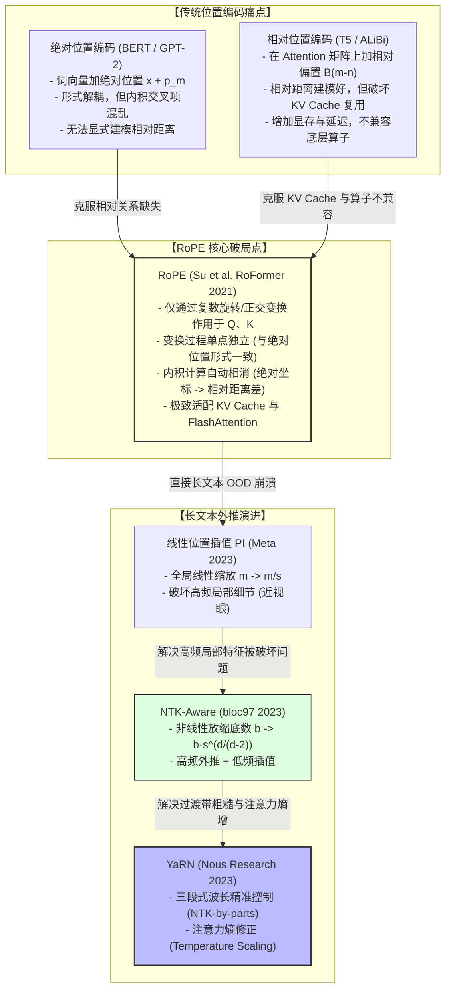

# 专题：RoPE（旋转位置编码）全景拆解：从 2D 几何直觉、源码实现差异、仅 Q/K 旋转本质到 NTK/YaRN 外推

> **适用读者**：LLM 算法工程师、底层算子研发人员及大模型架构面试备战者。  
> **核心目标**：从 2D 几何直觉出发，彻底扫清 RoPE 在**代数推导、代码实现排布（相邻配对 vs 前后切半分组）、注意力机制角色分配（为什么不转 V）、硬件显存亲和性（KV Cache / FlashAttention）**以及**长文本外推（PI $\to$ NTK-Aware $\to$ YaRN）**上的认知盲区。

---

## 1. 核心结论与全景拓扑图

在大语言模型（LLM）的发展历程中，位置编码经历了从**绝对位置编码（Absolute PE）**到**相对位置编码（Relative PE）**，再到**旋转位置编码（RoPE）**的大一统演进。

RoPE 的核心哲学可以概括为一句话：**“以绝对位置编码的形式，达成相对位置编码的效果。”**



---

## 2. 2D 几何直觉与高维空间泛化

### 2.1 2D 旋转与内积夹角不变性（突破口）

假设在二维平面上，Query 向量为 $q$，Key 向量为 $k$。它们的几何点积为：
$$\langle q, k \rangle = \|q\| \|k\| \cos(\theta_{qk})$$
点积大小完全取决于**两个向量的模长**与**它们之间的夹角**。

#### 旋转操作
- 将位于绝对位置 $m$ 的 Query 向量逆时针旋转 $m\theta$ 角度：
  $$Q_m = \mathbf{R}(m\theta) q$$
- 将位于绝对位置 $n$ 的 Key 向量逆时针旋转 $n\theta$ 角度：
  $$K_n = \mathbf{R}(n\theta) k$$

其中二维旋转矩阵定义为：
$$\mathbf{R}(\phi) = \begin{pmatrix} \cos\phi & -\sin\phi \\ \sin\phi & \cos\phi \end{pmatrix}$$

#### 内积的相对距离化
计算旋转后向量的点积：
$$\langle Q_m, K_n \rangle = (Q_m)^T K_n = (\mathbf{R}(m\theta) q)^T (\mathbf{R}(n\theta) k) = q^T \mathbf{R}(m\theta)^T \mathbf{R}(n\theta) k$$

由于正交旋转矩阵满足 $\mathbf{R}(m\theta)^T = \mathbf{R}(-m\theta)$，且 $\mathbf{R}(\alpha) \mathbf{R}(\beta) = \mathbf{R}(\alpha + \beta)$：
$$\mathbf{R}(-m\theta) \mathbf{R}(n\theta) = \mathbf{R}((n - m)\theta)$$

因此：
$$\langle Q_m, K_n \rangle = q^T \mathbf{R}((n - m)\theta) k = g(q, k, n - m)$$

> **几何结论**：  
> 两个向量旋转后的相对夹角为 $\theta_{\text{new}} = \theta_{qk} + (n - m)\theta$。  
> **绝对位置 $m$ 与 $n$ 在内积中完全抵消，保留下来的只有相对位置差 $(m - n)$！**

---

### 2.2 推广到 $d$ 维空间：正交子空间正交分解

大模型的 Head Dimension 通常是高维的（如 $d = 64, 128$）。高维旋转并不是在整空间构建稠密矩阵，而是**将 $d$ 维空间切分成 $d/2$ 个相互正交的 2D 子空间**：

$$\mathbf{R}_{\Theta, m}^d = \begin{pmatrix} 
\mathbf{R}(m\theta_0) & 0 & \cdots & 0 \\
0 & \mathbf{R}(m\theta_1) & \cdots & 0 \\
\vdots & \vdots & \ddots & \vdots \\
0 & 0 & \cdots & \mathbf{R}(m\theta_{d/2 - 1})
\end{pmatrix}$$

### 2.3 频率谱 $\theta_i$ 的物理意义

每个二维子空间的旋转角速度定义为：
$$\theta_i = b^{-2i/d} = 10000^{-2i/d}, \quad i \in \left[0, 1, \dots, \frac{d}{2}-1\right]$$

其波长定义为：
$$\lambda_i = \frac{2\pi}{\theta_i} = 2\pi \cdot 10000^{2i/d}$$

| 维度通道索引 $i$ | 角速度 $\theta_i$ | 波长 $\lambda_i$ | 特征捕获目标 | 几何物理行为 |
| :--- | :--- | :--- | :--- | :--- |
| **低维部分 ($i \to 0$)** | 极大（高频） | 极短（几个 token） | 捕捉**紧邻词语法结构、词序** | 旋转极其迅速，位置稍有位移角度变化剧烈 |
| **高维部分 ($i \to d/2-1$)** | 极小（低频） | 极长（上万 token） | 捕捉**长程篇章主题、全局语义** | 旋转极其缓慢，大范围移动才出现明显角位移 |

---

## 3. 工程实现中的“大坑”：相邻配对 vs 前后切半分组

在很多技术博客中，公式推导与主流开源代码（LLaMA / HuggingFace Transformers）存在排布差异，导致很多工程师在阅读源码时产生疑惑。

### 3.1 两种配对模式对比

```
【相邻配对 (Interleaved / 原论文)】
向量维度: [ x0,  x1,  x2,  x3, ..., x_{d-2}, x_{d-1} ]
分组平面: (x0, x1), (x2, x3) ...
旋转目标: [-x1, x0, -x3, x2, ...]

【前后切半分组 (Half-Split / LLaMA / HF Transformers)】
向量维度: [ x0,  x1, ..., x_{d/2-1}  |  x_{d/2}, x_{d/2+1}, ..., x_{d-1} ]
          \________________________/   \____________________________/
                   x_first (前半)                 x_second (后半)
分组平面: (x_0, x_{d/2}), (x_1, x_{d/2+1}), ..., (x_i, x_{i + d/2})
旋转目标: [-x_second, x_first]
```

### 3.2 `rotate_half` 的数学等价推导

以**前后切半分组**为例，令前段为 $x_1 \in \mathbb{R}^{d/2}$，后段为 $x_2 \in \mathbb{R}^{d/2}$，两两配对 $(x_i, x_{i+d/2})$ 的 2D 旋转公式为：
$$\begin{cases} 
x_i^{\text{new}} = x_i \cos\theta_i - x_{i+d/2} \sin\theta_i \\
x_{i+d/2}^{\text{new}} = x_{i+d/2} \cos\theta_i + x_i \sin\theta_i
\end{cases}$$

构造：
1. 原向量：$x = [x_1, x_2]$
2. 算子 `rotate_half(x)`：
   $$\text{rotate\_half}(x) = [-x_2, x_1]$$
3. 角度向量（前后拼接两份）：
   $$\cos = [\cos\theta, \cos\theta], \quad \sin = [\sin\theta, \sin\theta]$$
4. 逐元素向量化计算：
   $$\text{RoPE}(x) = x \odot \cos + \text{rotate\_half}(x) \odot \sin$$

**分块验证**：
- **前半部分**：$x_1 \odot \cos + (-x_2) \odot \sin = \mathbf{x_i \cos\theta_i - x_{i+d/2} \sin\theta_i}$（与目标完全一致）
- **后半部分**：$x_2 \odot \cos + x_1 \odot \sin = \mathbf{x_{i+d/2} \cos\theta_i + x_i \sin\theta_i}$（与目标完全一致）

> **工程价值**：  
> 前后切半分组只需要调用 `torch.chunk` 和 `torch.cat`，内存访问在显存中完全是**连续块操作（Contiguous Slice）**，避免了交叉索引带来的大量碎片化非对齐访存。

---

## 4. 工业级 PyTorch 源码实现与可运行验证

以下是工业级标准 RoPE 模块实现，内置预计算缓存机制、动态扩容以及单元测试验证：

```python
import torch
import torch.nn as nn
from typing import Tuple

def rotate_half(x: torch.Tensor) -> torch.Tensor:
    """
    将输入张量的后半部分取负，并与前半部分拼接：[x1, x2] -> [-x2, x1]
    """
    x1 = x[..., : x.shape[-1] // 2]
    x2 = x[..., x.shape[-1] // 2 :]
    return torch.cat((-x2, x1), dim=-1)

class RotaryEmbedding(nn.Module):
    """
    RoPE 模块：支持动态扩展 Cache 与高吞吐广播
    """
    def __init__(self, dim: int, max_position_embeddings: int = 4096, base: float = 10000.0):
        super().__init__()
        assert dim % 2 == 0, f"Head dimension 必须是偶数，当前为 {dim}"
        self.dim = dim
        self.max_position_embeddings = max_position_embeddings
        self.base = base
        
        # 1. 计算不同维度分量的角速度 theta_i = base^(-2i / dim)
        inv_freq = 1.0 / (self.base ** (torch.arange(0, self.dim, 2).float() / self.dim))
        self.register_buffer("inv_freq", inv_freq, persistent=False)
        
        # 2. 初始化缓存 cos, sin
        self._set_cos_sin_cache(seq_len=max_position_embeddings)

    def _set_cos_sin_cache(self, seq_len: int):
        self.max_seq_len_cached = seq_len
        # 位置索引 t = [0, 1, 2, ..., seq_len - 1]
        t = torch.arange(seq_len, dtype=torch.float32, device=self.inv_freq.device)
        
        # 外积计算 m * theta: shape [seq_len, dim // 2]
        freqs = torch.outer(t, self.inv_freq)
        
        # 拼接成 [seq_len, dim] -> [theta_0...theta_{d/2-1}, theta_0...theta_{d/2-1}]
        emb = torch.cat((freqs, freqs), dim=-1)
        
        # 缓存 cos / sin 矩阵
        self.register_buffer("cos_cached", emb.cos(), persistent=False)
        self.register_buffer("sin_cached", emb.sin(), persistent=False)

    def forward(self, x: torch.Tensor, seq_len: int) -> Tuple[torch.Tensor, torch.Tensor]:
        # 动态长度自适应扩展
        if seq_len > self.max_seq_len_cached:
            self._set_cos_sin_cache(seq_len=seq_len)
            
        return (
            self.cos_cached[:seq_len],
            self.sin_cached[:seq_len]
        )

def apply_rotary_pos_emb(
    q: torch.Tensor, 
    k: torch.Tensor, 
    cos: torch.Tensor, 
    sin: torch.Tensor
) -> Tuple[torch.Tensor, torch.Tensor]:
    """
    参数:
        q, k: [batch_size, num_heads, seq_len, head_dim]
        cos, sin: [seq_len, head_dim] -> unsqueeze 广播为 [1, 1, seq_len, head_dim]
    """
    cos = cos.unsqueeze(0).unsqueeze(0)
    sin = sin.unsqueeze(0).unsqueeze(0)
    
    # 核心计算公式: (x * cos) + (rotate_half(x) * sin)
    q_embed = (q * cos) + (rotate_half(q) * sin)
    k_embed = (k * cos) + (rotate_half(k) * sin)
    
    return q_embed, k_embed

# ================= 单元测试与相对位置不变性验证 =================
def run_unit_tests():
    torch.manual_seed(42)
    head_dim = 64
    seq_len = 64
    rope = RotaryEmbedding(dim=head_dim, max_position_embeddings=seq_len)
    
    # 构造原始未经旋转的 Q 和 K
    q_raw = torch.randn(1, 1, 1, head_dim)
    k_raw = torch.randn(1, 1, 1, head_dim)
    
    cos, sin = rope(q_raw, seq_len=seq_len)
    
    # 测试组 A: m = 7, n = 3 (相对距离 = 4)
    q_7, _ = apply_rotary_pos_emb(q_raw, q_raw, cos[7:8], sin[7:8])
    _, k_3 = apply_rotary_pos_emb(k_raw, k_raw, cos[3:4], sin[3:4])
    score_7_3 = torch.sum(q_7 * k_3)
    
    # 测试组 B: m = 27, n = 23 (相对距离 = 4)
    q_27, _ = apply_rotary_pos_emb(q_raw, q_raw, cos[27:28], sin[27:28])
    _, k_23 = apply_rotary_pos_emb(k_raw, k_raw, cos[23:24], sin[23:24])
    score_27_23 = torch.sum(q_27 * k_23)
    
    # 对照组 C: m = 27, n = 3 (相对距离 = 24)
    score_27_3 = torch.sum(q_27 * k_3)
    
    print("----- RoPE 相对位置不变性测试结果 -----")
    print(f"相对距离为 4 的内积 (位置 7 和 3):   {score_7_3.item():.6f}")
    print(f"相对距离为 4 的内积 (位置 27 和 23): {score_27_23.item():.6f}")
    print(f"相对距离为 24 的内积 (对照组):        {score_27_3.item():.6f}")
    
    assert torch.allclose(score_7_3, score_27_23, atol=1e-5), "断言失败：相对位置内积不一致！"
    print("✅ 测试通过：相对位置不变性完全成立！")

if __name__ == "__main__":
    run_unit_tests()
```

---

## 5. 为什么 RoPE 只旋转 Q、K，绝不旋转 V？

### 5.1 Attention 机制的本质分工：寻址路由 vs 语义负载

标准 Attention 机制的计算流为：
$$\text{Attention}(Q, K, V) = \text{Softmax}\left(\frac{Q K^T}{\sqrt{d_k}}\right) V$$

- **$Q$ 与 $K$ 负责“路由打分（Addressing / Scoring）”**：  
  模型需要知道“Token A 与 Token B 距离多远”、“谁在谁前面”，从而决定分配多少注意力权重 $\alpha_{m,n}$。因此，**相对距离与拓扑结构必须注入到 $Q$ 和 $K$ 的打分过程中**。
- **$V$ 负责“语义负载（Content Payload / Value）”**：  
  最终输出为各位置 $V$ 的加权和：$\text{Output}_m = \sum_n \alpha_{m,n} V_n$。  
  由于注意力权重 $\alpha_{m,n}$ 已经包含了精准的相对位置响应，**加权聚合得到的结果天然已经带有位置上下文**。

---

### 5.2 为什么旋转 $V$ 会在数学上造成“灾难”？

1. **旋转变换是“保内积、不保加法”的正交变换**：
   - 对于 $Q_m$ 和 $K_n$，它们进行的是**内积运算**：
     $$(R_m q)^T (R_n k) = q^T R_{n-m} k \implies \text{完美保持相对关系}$$
2. **对 $V$ 施加旋转会导致特征空间基底坍塌**：
   若对 $V$ 也施加旋转 $R_n$，则 Attention 聚合输出变为：
   $$\text{Output}_m = \sum_n \alpha_{m,n} (R_n V_n)$$
   - 每个位置的 $V_n$ 处于**各自独立的旋转坐标基底**中；
   - 将不同角度旋转后的向量进行**线性加权相加**，会生成一个处于“混合旋转杂乱空间”的无序向量；
   - 后续的 MLP / FFN 层无法用统一的静态权重解开这种因位置而异的混合旋转畸变，彻底破坏模型的语义表示能力。

---

## 6. 长文本外推技术全景（Length Extrapolation）

当一个在长度 $L$（如 4096）上预训练的模型直接推理 $s \cdot L$（如 32K/128K）时，低频分量进入未见过的角度区间，高频分量累积了未知圈数，导致 **OOD（Out-Of-Distribution）灾难**，困惑度（PPL）迅速爆炸。

针对 RoPE 的上下文扩展算法演进路线如下：


---

### 6.1 线性位置插值（Position Interpolation, PI）

*   **核心做法**：直接将输入位置缩放 $s$ 倍：$m' = \frac{m}{s}$。
*   **缺陷**：将所有频段等比例压缩。对于**高频分量**（负责近邻语法和词序），压缩导致相邻 token 的角位移严重缩小，模型丧失分辨紧邻词序的能力（产生严重的“近视眼”现象），必须做大量长文本数据的全量微调。

---

### 6.2 NTK-Aware RoPE（非线性插值）

*   **核心思想**：**“高频分量外推保持局部高分辨率，低频分量插值保证全局不越界”**。
*   **数学机制**：不修改位置 $m$，而是将 Base $b = 10000$ 放大为 $b'$：
    $$b' = b \cdot s^{\frac{d}{d-2}}$$
*   **分段行为分析**：
    - **最高频通道 ($i=0$)**：$\theta_0' = (b')^0 = 1$（完全不缩放，保持 100% 原始高频分辨率，纯外推）；
    - **最低频通道 ($i=d/2-1$)**：$\theta_{\max}' \approx \frac{\theta_{\max}}{s}$（被完整压缩 $s$ 倍，实现长程插值）。
*   **优势**：无需微调即可获得较平稳的外推能力（Training-Free Extrapolation）。

---

### 6.3 YaRN（Yet another RoPE extensioN）

YaRN 是目前工程应用中最为成熟稳定、微调成本最低的长文本方案，它解决了 NTK-Aware 在过渡带不够精准以及长上下文下注意力熵增的问题：

#### 核心贡献 1：基于波长 $\lambda$ 的严格三段式插值（NTK-by-parts）
定义每个维度的波长 $\lambda_i = \frac{2\pi}{\theta_i}$ 与原始预训练窗口 $L$ 的比值：
$$\gamma_i = \frac{L}{\lambda_i}$$
设置低频阈值 $\beta_{\text{low}}$ 与高频阈值 $\beta_{\text{high}}$：
$$\text{Scale Factor } s_i = \begin{cases} 
1, & \gamma_i > \beta_{\text{high}} \quad (\text{高频区：纯外推，不插值}) \\
s, & \gamma_i < \beta_{\text{low}} \quad (\text{低频区：纯线性插值}) \\
(1-\alpha) \cdot 1 + \alpha \cdot s, & \text{otherwise} \quad (\text{平滑线性过渡区})
\end{cases}$$

#### 核心贡献 2：注意力熵修正（Temperature Scaling）
在序列长度扩增 $s$ 倍后，Softmax 作用的 token 数量剧增，导致注意力分布偏向均匀（熵增大，模型“注意力涣散”）。
YaRN 引入温度缩放因子 $t$：
$$\text{Attention}(Q, K, V) = \text{Softmax}\left(\frac{Q K^T}{t \cdot \sqrt{d_k}}\right) V$$
通过降低有效温度 $t < 1$（即乘以放大因子 $\sqrt{1/t}$），将变平缓的注意力分布重新“拉陡峭”，大幅减少长文本幻觉。

---

### 6.4 外推技术全景对比总结

| 方案 | 核心算子修改 | 高频处理 | 低频处理 | 注意力熵修正 | 微调数据需求 | 代表模型 |
| :--- | :--- | :--- | :--- | :--- | :--- | :--- |
| **原始 RoPE** | 无 | 原始 | 原始 | 无 | 0 | LLaMA-1/2 |
| **PI (位置插值)** | $m \to m/s$ | 线性压缩 | 线性压缩 | 无 | 需大量微调 | LLaMA-Linear |
| **NTK-Aware** | $b \to b \cdot s^{d/(d-2)}$ | 保持外推 | 非线性压缩 | 无 | **免微调 / 极少微调** | CodeLLaMA ($b=10^6$), Qwen |
| **YaRN** | **三段波长映射 + $\sqrt{t}$** | **严格外推** | **精准线性插值** | **有 (Temp Scaling)** | **仅需 ~0.1% 数据微调** | LLaMA-2-Long, Mistral/Mixtral |

---

## 7. 工程师面试与交流口述通关指南

### 7.1 45秒黄金口述总结模板

> “我对 **RoPE（旋转位置编码）** 的理解可以总结为：**‘以绝对位置编码的形式，实现了相对位置编码的效果’**。
> 
> 它的核心机制是：把 Query 和 Key 向量切分为若干个二维正交子空间，给位于位置 $m$ 的向量在各平面上逆时针旋转 $m\theta_i$ 的角度。
> 
> 这种设计的精妙之处在于**正交几何不变性**：当 $Q_m$ 与 $K_n$ 进行点积计算 Attention 权重时，根据旋转矩阵的正交性，绝对旋转坐标自动抵消，计算结果天然只与相对位移 $(m - n)$ 相关。
> 
> 相比传统方案，RoPE 具备三大工业级优势：
> 1. **计算零额外显存、单点独立**：输入仅依赖绝对坐标，算完即可存入 **KV Cache**，且与 **FlashAttention** 完美原生兼容；
> 2. **天然具备远程衰减性**：高频分量旋转迅速、低频分量旋转缓慢，符合自然语言的局部性先验；
> 3. **极强且可控的长文本外推性**：通过 NTK-Aware 与 YaRN 等技术调整底数和波长分段，可以用极低的微调成本完成 4K 到 128K 乃至 1M 的上下文扩展。”

---

### 7.2 核心追问攻防矩阵

*   **Q1: RoPE 为什么不直接在词向量 $x$ 上做，而是在投影后的 $Q, K$ 上做？**
    *   *Answer*：如果在词向量 $x$ 上旋转，经过 $W_q, W_k, W_v$ 线性变换后，线性投影矩阵会与旋转矩阵发生复杂的非交换矩阵乘法缠绕，彻底破坏旋转抵消的相对性质。必须在投影至注意力空间后独立旋转。
*   **Q2: 为什么 `head_dim` 必须是偶数？**
    *   *Answer*：因为 RoPE 的几何底座是 2D 平面旋转，高维空间必须两两成对分解为 $d/2$ 个独立二维正交子空间。
*   **Q3: 为什么说 RoPE 对 KV Cache 极致友好？**
    *   *Answer*：因为 Key 向量的位置变换只依赖其自身绝对位置 $n$（即 $K_n = \text{RoPE}(K, n)$）。推理自回归解码时，历史 $K_n$ 仅需计算一次即可存入 KV Cache，后续生成无需重算任何历史位置。
