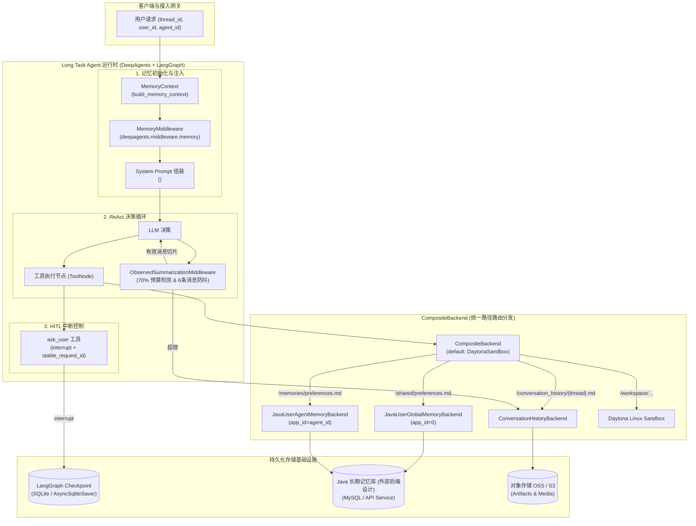
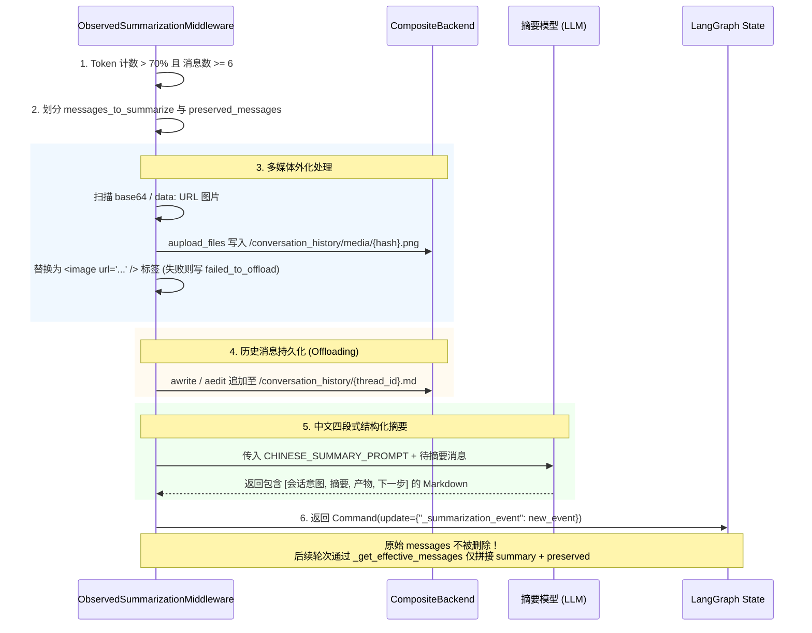
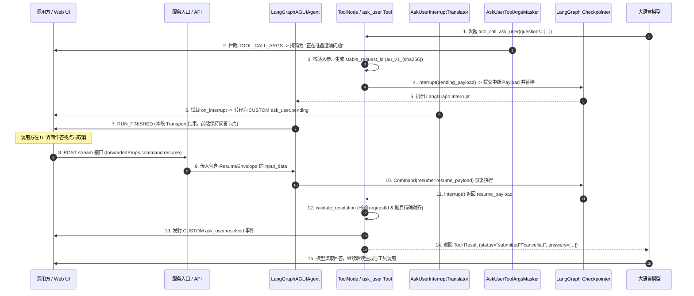

# Topic Brief: Memory、Compaction、Skill 与 Ask User 深度审计

> **审计范围**：长期记忆体系（Memory）、上下文自动压缩（Context Compaction）、技能动态导入与激活（Skill System）、执行中用户交互（Ask User / HITL）。  
> **源码基线**：`.scratch/langagent-develop-reference` @ `4cebb661e88e02f5119fd013236c1402dc3d2cf8`  
> **框架底层基线**：`.scratch/langagent-framework-sources` (`deepagents 0.6.12`, `langgraph 1.2.8`, `langgraph-prebuilt 1.1.0`, `langgraph-checkpoint 4.1.1`, `langgraph-checkpoint-sqlite 3.0.3`, `ag-ui-protocol 0.1.19`, `ag-ui-langgraph 0.0.42`)  
> **设计与演进文档基线**：  
> - 压缩设计：`prd/long_task_context_auto_compaction_prd.md`、`prd/long_task_context_auto_compaction_implementation_spec.md`  
> - 记忆演进：`docs/docs/deepagents-memory-integration.md` (v4.0 早期方案)、`docs/long-task-memory-prd.md` (V2.2 PRD)、`docs/long-task-memory-implementation-progress.md` (实施进度)  
> - Ask User 调研与设计：`docs/docs/sunxichen/work/ask-user/research/industry-comparison.md` (业界调研)、`docs/docs/sunxichen/work/ask-user/PRD.md` (Feature PRD)、`docs/docs/sunxichen/work/ask-user/ASK_USER_开发设计.md` (架构设计)、`docs/docs/sunxichen/work/ask-user/ASK_USER_COMMAND_RESUME工作蓝图.md` (执行蓝图)  

---

## 1. 五维存储与上下文实体对比 (Five Context & Storage Entities)

在 `langAgent` 长任务体系中，存在五类具有不同生命周期、作用域、持久化载体与读写契约的存储与上下文实体。

### 1.1 五维实体对比矩阵

| 维度 | 1. 对话消息 (Messages) | 2. LangGraph Checkpoint | 3. USER_GLOBAL 长期记忆 | 4. USER_AGENT 长期记忆 | 5. Workspace 沙箱文件 |
|---|---|---|---|---|---|
| **物理载体 / 存储位置** | LangGraph State `messages` 列表（内存 / Checkpointer） | SQLite (`checkpoints.db` / `AsyncSqliteSaver`) | Java 外部后端数据库（通过 HTTP 虚拟文件 `preferences.md` 交互，基于外部后端设计与联调记录） | Java 外部后端数据库（通过 HTTP 虚拟文件 `preferences.md` 交互，基于外部后端设计与联调记录） | Daytona 沙箱容器内 Linux 文件系统 (`/workspace/...`) |
| **生命周期 (Lifetime)** | 单个会话 Thread（受压缩裁剪与切片影响） | 跨请求、跨进程持久存在，直到会话被归档或清理 | 用户级别持久化，跨该用户**所有** Agent、所有会话 Thread 共享 | 用户 × Agent 级别持久化，跨该用户在**当前特定 Agent** 下的所有 Thread 共享 | 绑定至 Daytona Workspace 容器生命周期（Allocated -> Reclaimed -> Destroyed） |
| **隔离命名空间 (Namespace)** | `thread_id` + `checkpoint_ns` (区分主图与子代理) | `{"configurable": {"thread_id": ..., "checkpoint_ns": ...}}` | `scope_type="USER_GLOBAL"`, `user_id`, `app_id=0` | `scope_type="USER_AGENT"`, `user_id`, `app_id=int(agent_id)` | `workspace_id`（通常单沙箱与单 `thread_id` 绑定） |
| **读取路径 (Readers)** | LLM Agent Loop（由 SummarizationMiddleware 过滤为 Effective Messages） | LangGraph 运行时（`aget_state`、恢复中断、会话重入） | `JavaUserGlobalMemoryBackend` -> `MemoryMiddleware.abefore_agent` -> 注入 System Prompt (`/shared/preferences.md`) | `JavaUserAgentMemoryBackend` -> `MemoryMiddleware.abefore_agent` -> 注入 System Prompt (`/memories/preferences.md`) | 沙箱文件工具 (`read_file`, `list_files`, `glob`, `grep`, `execute`)、`ArtifactService` |
| **写入路径 (Writers)** | 用户输入、模型 `AIMessage`、工具 `ToolMessage`（经 `add_messages` Reducer 追加） | LangGraph Pregel 引擎在每个 Superstep 节点执行完毕后写入 | Agent 调用 `write_file` / `edit_file` on `/shared/preferences.md` -> CompositeBackend -> HTTP PUT | Agent 调用 `write_file` / `edit_file` on `/memories/preferences.md` -> CompositeBackend -> HTTP PUT | Agent 沙箱工具 (`write_file`, `edit_file`, `execute` bash)、`SkillImportService`、`SandboxFileImportService` |
| **上下文替换 / 压缩行为** | 触发压缩时，旧消息被摘要为一条带 `lc_source="summarization"` 的 HumanMessage，原始历史保留在 Checkpoint | Checkpoint 不物理删除历史消息，由 `_summarization_event` 记录 `cutoff_index` | 不受上下文压缩影响；内容变更直接写回 Java 后端，后续 run 加载最新版本 | 不受上下文压缩影响；内容变更直接写回 Java 后端，后续 run 加载最新版本 | 存储在沙箱磁盘；重要产物通过 `export_artifacts` / `ArtifactService` 提取外化到对象存储 |

### 1.2 运行时交互拓扑与路由关系

---

## 2. 长期记忆体系还原 (Long-term Memory Architecture)

### 2.1 身份归一化与降级逻辑 (`memory_context.py`)
源码位置：`src/agent/long_task/memory_context.py#L22-L74`

`build_memory_context(user_id, agent_id)` 在 Agent 构建前对用户与 Agent 身份执行契约校验：
1. **用户身份缺失**：若 `user_id` 为空串或 `None`，返回 `MemoryContext(user_id=None, app_id=None, enabled_global=False, enabled_agent=False)`，关闭长期记忆读写。
2. **默认长任务 Agent**：若 `agent_id` 为空或等于 `DEFAULT_LONG_TASK_AGENT_ID ("long-task-default")`，开启全局记忆 `enabled_global=True`，关闭 Agent 级记忆 `enabled_agent=False, app_id=None`。
3. **非法 `agent_id` 格式**：若 `agent_id` 包含非数字字符（如 `"agent-123"`），记录 Warning 日志并降级为仅开启全局记忆，避免因参数格式错误中断任务。
4. **整数溢出处理**：若 `app_id <= 0` 或 `app_id > 9_223_372_036_854_775_807`（Java `Long.MAX_VALUE` 边界），降级为仅开启全局记忆。
5. **双域启用**：当 `user_id` 有效且 `agent_id` 为合法的正十进制整数时，同时启用 `enabled_global=True` 与 `enabled_agent=True`。

### 2.2 虚拟文件路由与 `JavaMemoryBackend` 机制
源码位置：`src/agent/long_task/memory_backend.py#L30-L267`

系统将跨会话长期记忆抽象为虚拟 Markdown 文件，利用 `deepagents.backends.composite.CompositeBackend` 的路径前缀剥离与分发能力：
- `/shared/preferences.md` -> 路由至 `JavaUserGlobalMemoryBackend(user_id, scope_type="USER_GLOBAL", app_id=0)`
- `/memories/preferences.md` -> 路由至 `JavaUserAgentMemoryBackend(user_id, scope_type="USER_AGENT", app_id=app_id)`

#### 关键实现细节与容错：
1. **路径白名单校验**：`_normalize_path` 校验剥离路由前缀后的文件名必须等于 `preferences.md`。任何尝试访问其他路径（如 `read("../secret.md")`）均抛出 `ValueError("长期记忆只允许访问 preferences.md")`。
2. **读失败降级**：在 `_aget_file()` 中调用 `backend_api_client.batch_get_memory_files`：
   - 遭遇 **HTTP 404**、**HTTP 5xx**、**Java 业务码 500** 以及底层 **httpx.HTTPError** 时，记录 Warning 日志并返回空记忆对象 `MemoryFileVO(scope_type=..., app_id=..., content="", version=0)`。
   - 遭遇 **HTTP 401 / 403** 鉴权失败时向上抛出异常。
3. **乐观并发控制与重试**：在 `_areplace` 中，修改记忆时附带 `expected_version`。当遭遇并发更新导致 **HTTP 409 Conflict** 时，支持最大重试 1 次（`_MAX_EDIT_RETRIES = 1`）：重新拉取最新 version 内容并再次应用字符串替换。
4. **格式化行号**：`read` 与 `aread` 输出采用 `_format_cat_n`（右对齐 6 位行号 + Tab），与 POSIX `cat -n` 格式兼容，供模型通过行号使用 `edit_file` 编辑。
5. **外部后端设计与联调记录说明**：Java 侧 `agent_memory` 单表存储及 Phase 2 进度属于外部后端设计与联调记录（见 `docs/long-task-memory-prd.md` 与 `docs/long-task-memory-implementation-progress.md`），Python develop 代码仅证明 `JavaMemoryBackend` 的 HTTP 契约与两层虚拟路径路由。

### 2.3 DeepAgents 0.6.12 `MemoryMiddleware` 注入与约束
源码位置：`.scratch/langagent-framework-sources/deepagents/middleware/memory.py#L180-L442`

`MemoryMiddleware` 作为生命周期拦截器：
- `abefore_agent` 阶段：通过 `backend.adownload_files(["/shared/preferences.md", "/memories/preferences.md"])` 拉取记忆内容并保存在私有状态 `state["memory_contents"]` 中。
- `modify_request` 阶段：剥离 HTML 注释（`<!-- ... -->`），通过 `_format_agent_memory` 组装为 `<agent_memory>` 块注入 Prompt，并包含禁止记录凭据与密钥的安全指南。

---

## 3. 上下文自动压缩与可观测性 (Context Compaction & Observability)

### 3.1 核心压缩参数推导与 Monkey Patch
源码位置：
- `src/server/config/config.py#L124-L133`
- `src/agent/long_task/factory.py#L238-L270`
- `src/agent/long_task/chinese_deep_agent.py#L195-L318`
- `.scratch/langagent-framework-sources/deepagents/middleware/summarization.py#L261-L298`

1. **输入预算推导**：
   $$\text{resolved\_max\_input\_tokens} = \text{context\_window\_tokens} - \text{max\_tokens} - \text{safety\_margin\_tokens}$$
   默认配置下，若模型总窗口为 131,072，输出占用 2,000，安全边际（`context_compaction_safety_margin_tokens`）为 4,096，则输入预算约为 124,976 Tokens。
2. **触发比例覆盖**：
   - `deepagents 0.6.12` 原生 `compute_summarization_defaults` 源码中，当模型具备 `max_input_tokens` profile 时默认触发阈值为 85% (`("fraction", 0.85)`)，保留比例为 10% (`("fraction", 0.10)`)（见 `deepagents/middleware/summarization.py#L280-L287`，此为框架源码默认值，非项目实测值）。
   - 项目在 `chinese_deep_agent.py` 中通过 Monkey Patch 将触发阈值覆盖为 **70%**（`context_compaction_trigger_fraction = 0.7`），保留比例覆盖为 **保留后 25%**（`context_compaction_keep_fraction = 0.25`，定义于 `src/server/config/config.py#L128`）。
3. **消息数前置防抖**：`ObservedDeepAgentsSummarizationMiddleware._should_summarize` 增加前置检查：仅当有效消息数 $\ge 6$（`context_compaction_min_messages = 6`）时才允许触发压缩，避免首轮请求触发压缩。
4. **安全 Cutoff 计算**：覆盖 `_determine_cutoff_index`，按 `keep_fraction`（默认保留后 25% 消息）结合 `_find_safe_cutoff` 避免在 ToolCall 与 ToolMessage 中间切断。

### 3.2 历史外化与摘要生成流程
源码位置：`.scratch/langagent-framework-sources/deepagents/middleware/summarization.py#L800-L1560`

### 3.3 状态更新原理
在 LangGraph 中，状态保留全量 `messages`。
- **私有状态标记**：通过 `Command(update={"_summarization_event": {"cutoff_index": state_cutoff_index, "summary_message": HumanMessage(content=..., additional_kwargs={"lc_source": "summarization"}), "file_path": file_path}})` 记录摘要事件。
- **动态消息投影**：后续轮次中，`_get_effective_messages` 构造 `[summary_message, *messages[cutoff_index:]]` 传给模型调用。

### 3.4 压缩异常与可观测性路径细分
源码位置：
- `src/agent/long_task/observed_summarization_middleware.py#L187-L281`
- `src/agent/long_task/context_compaction_events.py#L1-L59`
- `.scratch/langagent-framework-sources/deepagents/middleware/summarization.py#L1300-L1455`

不同异常在中间件中的处理路径具有明确分工：
1. **历史持久化失败 (Offload Failure)**：`_aoffload_to_backend` 捕获文件读写异常，记录 Warning 日志并返回 `None`。压缩流程继续执行，仅在摘要事件中标记 `file_path=None`。
2. **多媒体转存失败 (Media Offload Failure)**：单张图片上传失败时被捕获并替换为 `<image error="failed_to_offload" />` 占位符，不中断流程。
3. **摘要模型调用失败 (Summary Generation Failure)**：若生成摘要的 LLM 调用抛出异常，`ObservedDeepAgentsSummarizationMiddleware` 记录 `logger.exception("上下文压缩失败: ...")` 并**重新抛出 (`raise`)**，由外层错误流接管。
4. **模型调用 ContextOverflowError 兜底**：在未主动触发压缩的普通推理中，若底层模型调用抛出 `ContextOverflowError`，deepagents 捕获该异常并触发紧急压缩及 `_clip_overflow_tail`。
5. **可观测事件发射失败 (Event Dispatch Failure)**：中间件通过 `count_tokens_approximately` 进行**近似上下文 Token 估算**（非模型计费 `usage_metadata`），并在 `build_usage_updated` 中标记 `approximate=true`。develop 当前代码发射 `context.usage_updated` CUSTOM 事件，事件通道异常被 `try...except` 捕获并记录 Warning，不影响模型调用结果。

---

## 4. 技能体系还原 (Skill System Architecture)

### 4.1 协议演进：新旧双协议兼容
源码位置：`src/server/services/skill_import_service.py#L96-L356`

| 特性 | 新协议 `skill_configs` (结构化对象) | 旧协议 `skill_oss_urls` (字符串列表) |
|---|---|---|
| **请求字段** | `list[LongTaskSkillConfig]` (包含 `id`, `name`, `description`, `url`, 可选 `dataset_ids`) | `list[str]` (仅 OSS 签名下载 URL 列表) |
| **沙箱落盘路径** | `/workspace/agent_skills/{skill_id}/{skill_dir}/` (按业务 ID 独立路径) | `/workspace/agent_skills/{extracted_folder}/` (平铺解压) |
| **选技支持** | 支持模型自动发现与用户显式指定 (`selected_skill_id`) | 仅支持模型根据 `SKILL.md` frontmatter 自动发现 |
| **Manifest 结构** | 包含 `packages` 映射 (`id`, `source_root`, `skill_md_path`, `skill_dir`) | 仅包含 `skills_paths: ["/workspace/agent_skills/"]` |

### 4.2 资源身份签名与缓存复用 (`_canonical_resource_identity`)
源码位置：`src/server/services/skill_import_service.py#L71-L114`

- `_canonical_resource_identity(url)`：解析 URL，剔除 `_TRANSIENT_QUERY_KEYS` 及所有 `x-amz-*` / `x-oss-*` 参数，保留稳定的 Scheme、Netloc、Path 与非临时 Query。
- `compute_skill_signature`：对排序后的 `f"{skill.id}|{canonical_url}"` 结合布局版本 `layout-v3` 计算 SHA-256 哈希值。
- **沙箱 Manifest 缓存命中**：当 `workspace_id` 与 `signature` 均未变化时，从沙箱读取 `/workspace/agent_skills/.langagent_manifest.json` 复用缓存。

### 4.3 ZIP 校验与 Staging 切换
源码位置：`src/server/services/skill_import_service.py#L358-L512`

1. **体积限制**：单 ZIP 包体积上限 **50MB**（`MAX_SKILL_ZIP_SIZE_BYTES`）。
2. **Zip Slip 防御**：检查 ZIP 内每一项，拒绝绝对路径及包含 `..` 分量的路径，跳过 `__MACOSX`。
3. **单 `SKILL.md` 约束**：每个技能包必须包含且仅包含一个 UTF-8 编码的 `SKILL.md`。
4. **Staging + Backup 目录切换**：解压至 `__staging__`，通过 shell 脚本重命名替换 `/workspace/agent_skills`，并在发生错误时恢复 `__backup__`。

### 4.4 DeepAgents `SkillsMiddleware` vs 项目 `SkillActivationMiddleware`

| 维度 | DeepAgents 0.6.12 原生 `SkillsMiddleware` | 项目扩展 `SkillActivationMiddleware` |
|---|---|---|
| **执行时机** | Agent 构建与启动前 (`abefore_agent`, `modify_request`) | 工具调用拦截层 (`awrap_tool_call`) |
| **主要职责** | 渐进式发现：扫描沙箱 `SKILL.md` 的 YAML frontmatter，将技能名称与描述注入系统提示词 | 激活状态观测：拦截模型发起的 `read_file` 工具调用 |
| **触发条件** | 每轮对话启动时从 backend 加载技能元数据 | 模型调用 `read_file(file_path="/workspace/.../SKILL.md")` 且工具返回成功 (`status != "error"`) |
| **事件行为** | 不发送业务事件 | 发射 `copilotkit_emit_activity` (`activity_type="skill_activation"`) |
| **去重保证** | 无状态去重（全量展示列表） | 按 run 级维护 `_activated_skill_ids` 集合，同技能单 run 仅激活一次 |
| **侵入性** | 修改 Prompt | **只读观测**：不修改工具入参或返回值，事件发送异常时不影响工具正常返回 |

---

## 5. Human-in-the-loop (Ask User) 机制还原

### 5.1 强类型契约与参数过滤 (`contracts.py`)
源码位置：`src/agent/ask_user/contracts.py#L1-L136`

- `AskUserQuestion`：
  - 问题数：单次调用包含 **1 至 4 道问题**（在 `tool.py#L67` 校验）。
  - 选项数：每题提供 **2 至 4 个选项**（`min_length=2, max_length=4`），单选项最大 160 字符。
  - **敏感词初筛**：`reject_sensitive_text` 扫描 `context` 与 `question`，命中 `password`, `token`, `secret`, `验证码`, `密码`, `密钥`, `银行卡`, `身份证` 等敏感词时抛出 `ValueError`。
- `AskUserResolution` 与 `AskUserResumeEnvelope`：
  - 状态分为 `"submitted"`（包含 `answers`）与 `"cancelled"`（无 `answers`）。
  - 规范化单行答案：用户填写的 `text` 限制为 1 至 500 字符的单行文本。

### 5.2 端到端执行与中断恢复状态机

### 5.3 关键技术控制点
1. **确定性 Request ID 关联 (`stable_request_id`)**：
   $$\text{request\_id} = \text{"au\_v1\_"} + \text{SHA256}(\text{"v1\x1f"} + \text{thread\_id} + \text{"\x1f"} + \text{run\_id} + \text{"\x1f"} + \text{tool\_call\_id})[:32]$$
   - 保证同一 `thread_id + run_id + tool_call_id` 在 Checkpoint 恢复重放时计算出稳定的业务 Request ID，并在 resume 时通过 `secrets.compare_digest` 校验恢复信封是否匹配当前中断，防止 Request ID 串扰。
   - **边界澄清**：该机制用于确定性 ID 关联与防串扰，未在业务层实现跨实例防重放或排他 CAS 机制。
2. **流式参数掩码**：`AskUserToolArgsMasker` (`src/agent/middleware/ask_user_tool_args_masker.py#L12-L53`) 拦截发往浏览器的 `TOOL_CALL_ARGS` delta 并替换为 `"正在准备澄清问题"`，减少原始问题 JSON 在前端的暴露。
3. **顶层专有绑定**：在 `build_long_task_agent` 中，`ask_user` 工具仅绑定给顶层 Agent；子代理工具列表显式过滤：`subagent_tools = [tool for tool in custom_tools if tool.name != "ask_user"]`。

---

## 6. 设计意图 vs 当前实现 vs 演进偏差对比 (Design Intent vs Implementation vs Deltas)

### 6.1 长期记忆 (Memory) 设计 vs 实现对照

| 维度 | 原始设计意图 (`DESIGN-MEM-001`) | 演进后 PRD 范围 (`DESIGN-MEM-002`) | develop 当前实现基线 (`FACT-MEM-001..005`) | 演进差异说明 (Delta) |
|---|---|---|---|---|
| **作用域分层** | 规划 4 层架构：组织级 (`/policies/company.md`)、Agent 级 (`/agents/AGENTS.md`)、用户共享 (`/shared/preferences.md`)、用户×Agent (`/memories/preferences.md`) | 收敛为 2 层架构：`USER_GLOBAL` 与 `USER_AGENT`；组织级与 Agent 级不进入首期范围 | 仅挂载 `/shared/` 与 `/memories/`，`_normalize_path` 锁定 `preferences.md` | **范围收敛**：方案文档从 4 层变为 2 层用户偏好（具体业务原因见 `GAP-MEM-003`）。 |
| **存储表结构** | 规划 4 张物理表：`org_memory`、`agent_memory`、`shared_memory`、`user_memory` | 规划 1 张实体表 `agent_memory`，通过 `scope_type` 区分全局与 Agent | Java Phase 2 建表 `agent_memory`，`tenant_id='1'` 占位（外部后端设计记录） | **单表存储**：采用单表配合联合唯一索引 `uk_agent_memory_scope` 支持两类作用域。 |
| **多租户隔离** | 包含 `org_id` / `tenant_id` 参与主键与隔离 | 第一版不考虑多租户隔离，`tenant_id` 仅作表结构兼容占位 | `agent_memory.tenant_id` 固定为 1，不参与过滤和接口参数 | **隔离边界**：首期按单一租户约定交付，多租户隔离未启用。 |
| **读写与降级** | 规划标准 CRUD，未定义细致错误降级 | 明确 Java 不可用时降级为空文件，409 重试一次 | `_aget_file` 对 404/5xx/Java 500 降级为空 VO，401/403 抛出；409 重试 1 次 | **联调修复**：2026-08-04 联调修复 Java 业务码 500 异常，补充对业务码的静默降级。 |

### 6.2 上下文自动压缩 (Compaction) 设计 vs 实现对照

| 维度 | 原始设计意图 (`DESIGN-CMP-001`) | 实施规格 (`implementation_spec.md`) | develop 当前实现基线 (`FACT-MEM-006..011`) | 演进差异说明 (Delta) |
|---|---|---|---|---|
| **触发与保留阈值** | 70% 触发，保留最近 25% | 70% 触发，保留 25%，增加 `CONTEXT_COMPACTION_MIN_MESSAGES=6` 防抖 | `config.py` 中 `trigger=0.7`、`keep=0.25`、`min_messages=6` | **参数一致**：通过 Monkey Patch 覆盖框架默认的 85%/10%。 |
| **手动压缩 (/compact)** | 明确规划第一版不实现手动 `/compact` | 明确非目标 | 未实现 `/compact` 工具与 API | **范围一致**：未引入手动压缩。 |
| **可观测事件** | 规划发射 `compaction_started`, `compaction_finished`, `compaction_failed`, `usage_updated` 4 个事件 | 规划后端从 SSE 捕获 4 个事件持久化 | develop 当前代码仅发射 `context.usage_updated`（标记 `approximate=true`），started/finished/failed 在中间件内记录日志与耗时 | **事件契约差异**：develop 当前代码仅发射单一 usage 事件，开始/结束/失败未作为独立 CUSTOM 事件发出（具体原因见 `GAP-CMP-001`）。 |
| **历史消息访问** | 仅支持 `read_file` 访问 `/conversation_history/{thread_id}.md` | 适配 BackendProtocol | `ConversationHistoryBackend` 实现了 read/download/write/edit/upload/ls | **路径路由**：虚拟路径通过 CompositeBackend 路由，隔离于沙箱文件系统。 |

### 6.3 技能体系 (Skill System) 设计 vs 实现对照

| 维度 | 早期设计 / 历史实现 | 新版设计意图 | develop 当前实现基线 (`FACT-SKL-001..007`) | 演进差异说明 (Delta) |
|---|---|---|---|---|
| **协议与隔离** | 支持 `skill_oss_urls` 字符串列表，沙箱中平铺解压 | 引入 `skill_configs` 结构化对象，按业务 ID 在沙箱独立目录落盘 | 同时兼容新协议 `skill_configs` 与旧协议 `skill_oss_urls` | **双协议兼容**：保留旧版接口以支持未升级前端，新任务支持结构化隔离路径（演进驱动原因见 `GAP-SKL-001`）。 |
| **显式选技** | 依赖模型根据 frontmatter 自动发现 | 支持前端通过 `selected_skill_id` 显式选技并置顶提示词 | `factory.py` 注入置顶 Prompt 与强制执行指令，预激活 ID | **能力落地**：支持显式指定特定技能。 |
| **激活观测** | 无激活事件 | 模型读取 `SKILL.md` 后触发激活通知 | `SkillActivationMiddleware` 拦截 `read_file` 成功并按 run 去重 | **解耦实现**：中间件纯只读，与 deepagents 0.6.12 原生 SkillsMiddleware 并存。 |

### 6.4 用户交互 (Ask User) 设计 vs 实现对照

| 维度 | 架构设计意图 (`DESIGN-ASK-001/002/003`) | 蓝图与规格 (`ASK_USER_COMMAND_RESUME工作蓝图.md`) | develop 当前实现基线 (`FACT-ASK-001..009`) | 演进差异说明 (Delta) |
|---|---|---|---|---|
| **接口与恢复** | 复用原 stream 主接口，通过 `forwardedProps.command.resume` 恢复 (`DESIGN-ASK-002`) | 约定 `Command(resume=ResumeEnvelope)` 为恢复唯一载体 | `contracts.py` + `tool.py` + `ag_ui_langgraph` 均已打通 | **机制落地**：调用方契约支持在主接口传递 resume 载荷。 |
| **取消与敏感词** | 支持 `status="cancelled"`，拒绝收集密码等敏感信息 (`DESIGN-ASK-001`) | 结构化 Tool Result 规范 | `reject_sensitive_text` 拦截敏感词，代码支持 cancelled 数据状态与 Prompt 建议 | **合约与提示词落地**：合约支持取消状态，系统提示词指导模型使用安全默认值。 |
| **重复提交与多实例 CAS** | 规划 `asyncio.Lock` + 独立 `AskUserRequest` 业务表 CAS 状态机（Phase 3+ `DESIGN-ASK-003`） | 规划 409 `ASK_USER_ALREADY_RESOLVED` 稳定错误响应 | 未在代码中发现独立 `AskUserRequest` 业务表、CAS 状态机或业务 409 拦截机制 | **设计未在项目层落地**：当前未实现独立数据库表与业务 409 拦截（见 `GAP-ASK-002`）。 |
| **快照缺失契约** | 规划网关级 `503 ASK_USER_RESUME_UNAVAILABLE` | 规划重试提示 | Checkpointer 状态丢失抛出标准异常，未封装专用 503 业务码 | **未封装专用错误码**：依赖通用异常流。 |
| **自动化测试覆盖** | 规划包含合约、普通 Agent、Long Task、协议 4 大类测试 | 规划验收测试套件 | `tests/` 下无独立 `test_ask_user*.py` 测试文件 | **测试缺失**：功能代码合入主线，但无独立自动化单元测试文件。 |

---

## 7. US 24 与非 Happy Path 核验 (Non-Happy Paths & Error Handling)

### 7.1 US 24 需求与真实实现对照表

| 场景 / 需求 (US 24) | 源码实现状态 (develop) | 真实机制与代码位置 | 局限性与设计态偏差 |
|---|---|---|---|
| **取消操作 (Cancellation)** | ✅ **已实现 (Implemented)** | `contracts.py#L80-L90` 支持 `status="cancelled"` 数据状态；`tool.py#L127` 放行；`factory.py#L172` 注入提示词建议模型在 cancelled 时使用安全默认值推进。 | 仅为合约与提示词建议，模型实际运行时是否推进取决于 LLM 推理，且无专项测试覆盖。 |
| **Request ID 与题目顺序校验** | ✅ **已实现 (Implemented)** | `contracts.py#L103-L136` 基于 `stable_request_id` 与 `compare_digest` 校验；`tool.py#L116` 校验传入题目与 pending 题目按原顺序一一对应。 | 校验失败抛出 `ValueError`，由外层捕获转化为 `RUN_ERROR`。 |
| **流式参数掩码 (Args Masking)** | ✅ **已实现 (Implemented)** | `src/agent/middleware/ask_user_tool_args_masker.py#L12-L52` 将发往浏览器的流式参数替换为 `"正在准备澄清问题"`。 | 仅作用于 AG-UI SSE 事件流，不修改内部工具参数与 Checkpoint 存储。 |
| **重复提交 / 409 冲突 (Repeated Submit)** | ❌ **项目层未闭环 (Design Only)** | 设计文档 `ASK_USER_开发设计.md#L31-L40` 规划了独立 `AskUserRequest` 业务表 CAS 方案（Phase 3+ `DESIGN-ASK-003`）。 | 未在代码中发现独立数据库表与业务 409 拦截机制。向已推进的 checkpoint 再次发送 resume 会因无 pending 中断由框架层报错，非业务 409 错误契约。 |
| **防重放 (Replay Prevention)** | ❌ **项目层未闭环** | `stable_request_id` 仅保证相同输入计算出稳定 ID，无 consumed-ID 消费标记或分布式锁/CAS 防重放机制。 | 依赖 Checkpoint 状态推进，未在业务层实现防重放。 |
| **快照缺失 (Missing Snapshot)** | ❌ **未在项目层实现稳定契约** | 设计文档规划了网关级 `503 ASK_USER_RESUME_UNAVAILABLE` 响应。 | 项目代码中未实现专门的 snapshot 缺失错误转换，表现为 Checkpointer 获取状态失败的标准异常。 |
| **自动化测试覆盖 (Test Suite)** | ❌ **无专项测试** | `tests/` 目录下包含 Memory 与 Skill 的测试，**不存在 `test_ask_user*.py`**。 | 代码与 Prompt 已合入主线，但无独立单元测试覆盖（置信度评定为 `Medium`）。 |

### 7.2 异常降级汇总表

| 故障领域 | 异常场景 | 降级与恢复行为 |
|---|---|---|
| 长期记忆 (Memory) | Java 后端 404 / 500 / 网络超时 | 记录 Warning，降级为空记忆 VO，不中断主任务 |
| 长期记忆 (Memory) | 并发修改版本冲突 (HTTP 409) | 重新拉取最新版本，重试 1 次 (`_MAX_EDIT_RETRIES = 1`) |
| 长期记忆 (Memory) | 路径非法访问 | 抛出 `ValueError`，阻止非法文件读写 |
| 上下文压缩 (Compaction) | 历史消息持久化写入失败 | 记录 Warning，降级为 `file_path=None` 继续生成摘要 |
| 上下文压缩 (Compaction) | 单张图片上传/解码失败 | 替换为 `failed_to_offload` 占位符，不中断流程 |
| 上下文压缩 (Compaction) | usage 事件发送通道异常 | 捕获异常记录 Warning，不影响模型调用结果 |
| 上下文压缩 (Compaction) | 摘要生成 LLM 调用失败 | 记录异常并重新抛出 (`raise`) |
| 上下文压缩 (Compaction) | 推理时 ContextOverflowError | deepagents 捕获并触发紧急压缩及尾部截断 |
| 技能系统 (Skill) | ZIP 体积超过 50MB | 抛出 `ValueError`，跳过该技能包导入 |
| 技能系统 (Skill) | Zip Slip 路径遍历 | 抛出 `ValueError`，拒绝解压 |
| 技能系统 (Skill) | SKILL.md 缺失或编码错误 | 抛出 `ValueError`，记录失败 ID，其余继续 |
| 技能系统 (Skill) | 沙箱激活重命名失败 | 执行回滚脚本，恢复 `__backup__` 目录 |
| 技能系统 (Skill) | 激活 Activity 事件发送失败 | 捕获异常记录 Warning，保持工具调用成功 |
| 用户交互 (Ask User) | 包含敏感词 | 抛出 `ValueError`，拒绝执行提问 |
| 用户交互 (Ask User) | resume 时 requestId 不匹配 | 抛出 `ValueError`，拒绝恢复 |
| 用户交互 (Ask User) | 恢复答案与题目不一致 | 抛出 `ValueError`，拒绝恢复 |

---

## 8. 审计总结与结论 (Audit Synthesis)

1. **五者边界**：对话历史在 Checkpoint 中受 `_summarization_event` 动态投影保护；USER_GLOBAL 与 USER_AGENT 长期记忆通过 `JavaMemoryBackend` 虚拟文件路由隔离；Workspace 沙箱文件生命周期独立。
2. **压缩机制**：70% 动态预算阈值、保留后 25% 截断、6 条消息防抖、多媒体与文本独立 offloading、不改底层 State 消息序列的 `Command(update=...)` 机制已实现。develop 当前代码发射 `context.usage_updated` 事件。
3. **技能机制**：具备 URL 临时鉴权参数清洗、SHA-256 签名缓存、50MB 上限、Zip Slip 校验、Staging 切换回滚以及按 run 去重的激活观测。
4. **Ask User 状态机与测试状态**：`contracts`、`tool`、`translator`、`masker`、`stable_request_id` 状态机在 develop 源码中均已实现，支持取消数据状态与 Prompt 建议；但当前未编写专用自动化单元测试，且未在代码中发现独立 `AskUserRequest` 业务表与业务 409 拦截机制。
