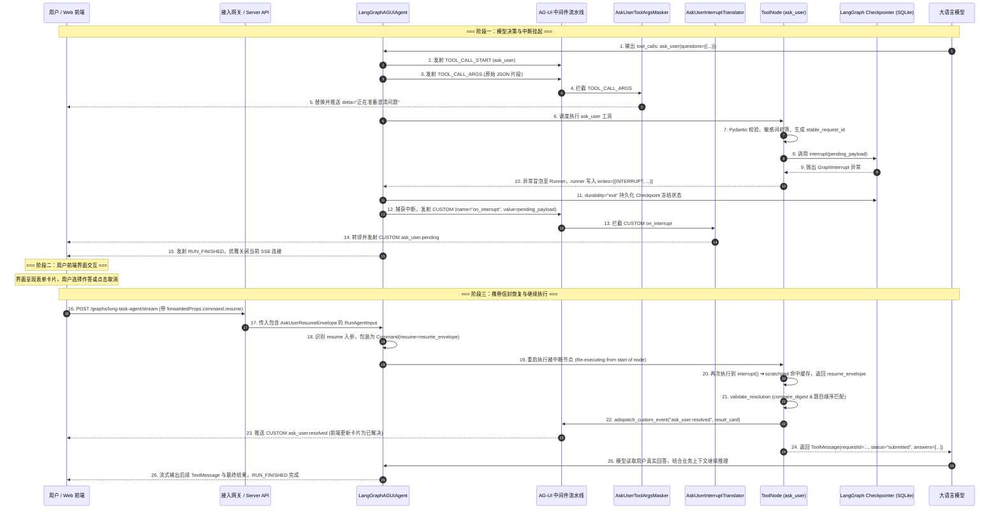

# 专题六：LangGraph/deepagents HITL 详解与 AG-UI 便捷能力

> **文档定位**：本文档针对 `langAgent` 技术架构中的人机协同（Human-in-the-loop, HITL）中断恢复机制与 AG-UI 交互协议层进行源码级深度剖析。严格按照 **“框架原生层 ➔ AG-UI 集成层 ➔ langAgent 自建层”** 三层架构展开，系统解构从 LangGraph 底层 `interrupt()` 异常抛出与 Checkpoint 状态冻结、deepagents 工具审批策略，到 `ag-ui-langgraph` 事件映射与流式交互契约，再到 `langAgent` 自建 Ask User 强类型协议、稳定 Request ID、参数遮蔽、状态恢复与取消默认值推演的完整技术闭环与端到端 Trace。

---

## 1. 核心架构全景与三层解构模型

在复杂长程任务与智能体决策中，模型不可避免会遇到参数缺失、歧义意图或高危操作。`langAgent` 摒弃了传统的死循环等待或侵入式阻塞轮询，构建了基于 **“异步异常挂起 + 增量状态持久化 + 协议流式转译 + 强类型契约校验”** 的现代 HITL 架构体系。

```
┌────────────────────────────────────────────────────────────────────────────────────────┐
│                      Human-in-the-loop (HITL) 与 AG-UI 交互三层架构全景图                 │
├────────────────────────────────────────────────────────────────────────────────────────┤
│  [3. langAgent 自建层 (Application Business & Typed Contracts)]                        │
│    • Ask User 强类型契约: AskUserQuestion (1~4题, 2~4选项, 敏感词过滤), AskUserResumeEnvelope│
│    • 确定性追踪: stable_request_id (au_v1_{sha256}) + _runtime_identifier 三层 ID 提取   │
│    • 流式中间件: AskUserToolArgsMasker (参数遮蔽) + AskUserInterruptTranslator (转译 pending)│
│    • 恢复校验与容错: secrets.compare_digest + 题目顺序强对齐 + cancelled 安全默认值推导  │
│    • 拓扑隔离: 仅顶层 Agent 挂载 ask_user，子代理 (subagents) 显式剥离                  │
├────────────────────────────────────────────────────────────────────────────────────────┤
│  [2. AG-UI 集成层 (ag-ui-langgraph & AG-UI Protocol Layer)]                            │
│    • 事件流双向映射: LangGraph on_chat_model_stream / on_tool_start ➔ TOOL_CALL_* 等    │
│    • 中断透出契约: 捕获 task.interrupts ➔ CustomEvent(name="on_interrupt") ➔ RUN_FINISHED │
│    • 状态快照同步: MESSAGES_SNAPSHOT / STATE_SNAPSHOT 权威状态与前端回滚探测             │
│    • 恢复信封桥接: forwardedProps.command.resume ➔ Command(resume=...)                 │
├────────────────────────────────────────────────────────────────────────────────────────┤
│  [1. 框架原生层 (Framework Native: LangGraph 1.2.8 & deepagents 0.6.12)]               │
│    • LangGraph interrupt(): 抛出 GraphInterrupt ➔ scratchpad 计数器 ➔ 节点完整重放短路 │
│    • Checkpointer 持久化: 捕获异常 ➔ writes=[(INTERRUPT, ...)] ➔ durability="exit" 冻结│
│    • deepagents HITL 审批: HumanInTheLoopMiddleware (approve/edit/reject/respond 决策)│
│    • 权限与条件中断: interrupt_on 规则合并 + when 谓词 + description 工厂               │
└────────────────────────────────────────────────────────────────────────────────────────┘
```

### 1.1 核心组件与职责分工清单

| 架构分层 | 核心模块 / 类名 | 源码定位 | 核心职责 |
|---|---|---|---|
| **框架原生层** | `langgraph.types.interrupt` | [`langgraph/types.py#L811-L935`](file:///.scratch/langagent-framework-sources/langgraph/types.py#L811-L935) | 抛出 `GraphInterrupt` 挂起执行；恢复时通过 `scratchpad` 计数器与缓存实现重放短路。 |
| **框架原生层** | `langgraph.errors.GraphInterrupt` | [`langgraph/errors.py#L102-L108`](file:///.scratch/langagent-framework-sources/langgraph/errors.py#L102-L108) | 中断专用异常类（继承 `GraphBubbleUp`），被 runner 捕获并保存中断写操作。 |
| **框架原生层** | `langgraph.pregel._runner` & `_loop` | [`langgraph/pregel/_runner.py#L585-L591`](file:///.scratch/langagent-framework-sources/langgraph/pregel/_runner.py#L585-L591)<br>[`langgraph/pregel/_loop.py#L1320-L1360`](file:///.scratch/langagent-framework-sources/langgraph/pregel/_loop.py#L1320-L1360) | 拦截中断异常、将 `(INTERRUPT, ...)` 写入 Checkpoint、冻结通道状态并派发生命周期事件。 |
| **框架原生层** | `HumanInTheLoopMiddleware` | [`langchain/agents/middleware/human_in_the_loop.py#L216-L486`](file:///.scratch/langagent-framework-sources/langchain/agents/middleware/human_in_the_loop.py#L216-L486) | deepagents 原生工具审批中间件，支持 `approve`、`edit`、`reject`、`respond` 四种人机决策。 |
| **AG-UI 集成层** | `LangGraphAGUIAgent` | [`ag_ui_langgraph/agent.py#L420-L585`](file:///.scratch/langagent-framework-sources/ag_ui_langgraph/agent.py#L420-L585) | 解析活跃中断并封装为 `CUSTOM on_interrupt` 事件；将 `forwardedProps.command.resume` 转换为 `Command(resume=...)`。 |
| **AG-UI 集成层** | `ag_ui.core.events.EventType` | [`ag_ui/core/events.py#L42-L80`](file:///.scratch/langagent-framework-sources/ag_ui/core/events.py#L42-L80) | AG-UI 协议核心事件枚举（`TOOL_CALL_*`, `TEXT_MESSAGE_*`, `CUSTOM`, `STATE_SNAPSHOT` 等）。 |
| **langAgent 自建层** | `AskUserContracts` | [`src/agent/ask_user/contracts.py#L13-L136`](file:///.scratch/langagent-develop-reference/src/agent/ask_user/contracts.py#L13-L136) | 定义 `AskUserQuestion`、`AskUserResumeEnvelope`、`stable_request_id` 与 `validate_resolution` 强类型契约。 |
| **langAgent 自建层** | `create_ask_user_tool` | [`src/agent/ask_user/tool.py#L56-L157`](file:///.scratch/langagent-develop-reference/src/agent/ask_user/tool.py#L56-L157)（`_runtime_identifier` 三层 ID 解析在 L22-L31） | 封装三层 ID 提取、敏感词校验、`interrupt()` 挂起、常量时间校验及 `ask_user.resolved` 事件发射。 |
| **langAgent 自建层** | `AskUserInterruptTranslator` | [`src/agent/middleware/ask_user_interrupt_translator.py#L13-L48`](file:///.scratch/langagent-develop-reference/src/agent/middleware/ask_user_interrupt_translator.py#L13-L48) | 拦截框架 `on_interrupt` 并转译为业务强类型 `CUSTOM ask_user.pending`。 |
| **langAgent 自建层** | `AskUserToolArgsMasker` | [`src/agent/middleware/ask_user_tool_args_masker.py#L12-L53`](file:///.scratch/langagent-develop-reference/src/agent/middleware/ask_user_tool_args_masker.py#L12-L53) | 拦截发往前端的原始参数，替换为 `"正在准备澄清问题"`，防止未校验 JSON 闪烁与泄露。 |

---

## 2. 使用向指南：怎么用 LangGraph/deepagents 实现 HITL（含实例）

在实际工程落地中，开发者最关心的核心诉求往往是：**“如何为我自己的 Agent 添加人机交互能力（审批、补充信息、前端表单对接）？”** 本节从工程实战视角出发，按五大常见场景提供开箱即用、API 签名严格对齐的代码实例与最佳实践指引。

---

### 2.1 场景一：最简用法 —— LangGraph 原生 `interrupt()` 与 `Command(resume=...)` 最小骨架

#### 1. 核心流程与硬依赖说明
- **`interrupt(value)` 挂起**：在图的任意节点内，当需要人工决策或补充数据时，调用 `interrupt(payload)`。此时 LangGraph 会暂停当前图执行，将 `payload` 暴露给调用方，并把当前图的状态安全冻结。
- **`Command(resume=...)` 恢复**：当外部完成人工交互后，调用方将恢复值包装在 `Command(resume=answer)` 中传入 `graph.invoke` 或 `graph.stream`，图将自动唤醒并从中断点恢复执行。
- **Checkpointer 是硬依赖**：
  > [!IMPORTANT]
  > **必须挂载 Checkpointer**：LangGraph 的中断与恢复必须依赖状态持久化机制。若在 `builder.compile()` 时未传入 `checkpointer`（单机/测试环境使用 `InMemorySaver`，生产环境推荐 `PostgresSaver`），调用 `interrupt()` 会因无法持久化未决写操作（pending writes）而导致运行时异常。

#### 2. 最小可运行代码实例

```python
from typing import TypedDict
from langgraph.checkpoint.memory import InMemorySaver
from langgraph.graph import END, START, StateGraph
from langgraph.types import Command, interrupt


# 1. 定义状态结构
class ApprovalState(TypedDict):
    action: str
    requires_approval: bool
    approval_result: str | None
    execution_output: str | None


# 2. 定义包含中断的业务节点
def check_and_request_approval(state: ApprovalState) -> dict:
    if state.get("requires_approval"):
        # 调用 interrupt() 挂起当前节点，并将待确认内容暴露给外部
        # 内部抛出控制流信号，图状态被 Checkpointer 持久化后优雅退出当前轮次
        human_decision = interrupt({
            "prompt": f"检测到敏感操作【{state['action']}】，是否允许执行？",
            "allowed_responses": ["approve", "reject"],
        })
        # 当外部通过 Command(resume=...) 唤醒时，节点从头重放至此并直接获取 human_decision
        return {"approval_result": human_decision}
    return {"approval_result": "auto_approved"}


def execute_action(state: ApprovalState) -> dict:
    if state.get("approval_result") == "approve" or state.get("approval_result") == "auto_approved":
        return {"execution_output": f"操作【{state['action']}】执行成功！"}
    return {"execution_output": f"操作【{state['action']}】已被人工拒绝，流程终止。"}


# 3. 构造工作流图并绑定 Checkpointer
builder = StateGraph(ApprovalState)
builder.add_node("approval_node", check_and_request_approval)
builder.add_node("execution_node", execute_action)

builder.add_edge(START, "approval_node")
builder.add_edge("approval_node", "execution_node")
builder.add_edge("execution_node", END)

# 硬依赖：必须配置 checkpointer（此处使用 InMemorySaver，生产可换为 SqliteSaver/PostgresSaver）
checkpointer = InMemorySaver()
graph = builder.compile(checkpointer=checkpointer)

# 4. 首次运行：发起操作，触发中断挂起
thread_config = {"configurable": {"thread_id": "session-demo-001"}}
initial_input = {"action": "清空用户历史缓存", "requires_approval": True}

print("=== 1. 首次触发执行 ===")
for event in graph.stream(initial_input, config=thread_config):
    print("流式事件:", event)

# 5. 查看图当前状态与挂起的中断
state = graph.get_state(thread_config)
print("\n=== 2. 查看当前状态 ===")
print("当前待执行节点:", state.next)  # ('approval_node',)
print("活跃中断 Payload:", state.tasks[0].interrupts[0].value)
# 输出: {'prompt': '检测到敏感操作【清空用户历史缓存】，是否允许执行？', 'allowed_responses': ['approve', 'reject']}

# 6. 模拟用户审批：传入 Command(resume=...) 恢复执行
print("\n=== 3. 传入人工决策恢复执行 ===")
resume_command = Command(resume="approve")
for event in graph.stream(resume_command, config=thread_config):
    print("恢复后流式事件:", event)

# 7. 查看最终完成状态
final_state = graph.get_state(thread_config)
print("\n=== 4. 最终状态结果 ===")
print("执行产物:", final_state.values["execution_output"])
# 输出: 操作【清空用户历史缓存】执行成功！
```

---

### 2.2 场景二：工具审批 —— deepagents `HumanInTheLoopMiddleware` 与 `interrupt_on` 审批策略

#### 1. 工具审批核心机制与四类决策语义
在基于 LLM Tool-Calling 的 Agent 中，`deepagents` 提供了原生的 `HumanInTheLoopMiddleware` 中间件，开发者无需在每个工具内部手动编写 `interrupt()`，只需在 `create_deep_agent` 时声明 `interrupt_on` 规则。

当模型决策调用目标工具时，中间件会在工具实际执行前拦截并触发中断。外部通过 `Command(resume={"decisions": [...]})` 传入决策：

| 决策类型 (`DecisionType`) | 载荷结构 (`Decision`) | 核心语义与模型/工具影响 |
|---|---|---|
| **`approve`** | `{"type": "approve"}` | **原样批准**：保留模型生成的原始工具调用与参数，交由 `ToolNode` 物理执行真实调用。 |
| **`edit`** | `{"type": "edit", "edited_action": {"name": ..., "args": ...}}` | **人工修改**：覆写模型生成的工具名称或入参，由 `ToolNode` 执行人工修正后的安全调用（如修改 SQL 条件或缩小删除范围）。 |
| **`reject`** | `{"type": "reject", "message": "..."}` | **直接拒绝**：**阻断工具物理执行**，向上下文注入状态为 `error` 的 `ToolMessage`，告知模型已被人工拒绝，严禁重试。 |
| **`respond`** | `{"type": "respond", "message": "..."}` | **人工代答**：**跳过工具物理执行**，直接注入状态为 `success` 的 `ToolMessage`（以人工输入的 `message` 作为工具返回值返回给模型）。 |

#### 2. `interrupt_on` 的灵活配置语法
`interrupt_on` 字典支持两类配置：
1. **布尔简写**：`"tool_name": True` —— 表示该工具触发中断，且允许全部 4 种决策类型。
2. **细粒度 `InterruptOnConfig`**：
   - `allowed_decisions: list[DecisionType]`：限定可用的决策（如 `["approve", "reject"]`）；
   - `description: str | _DescriptionFactory`：静态审核提示语，或动态生成说明的工厂函数；
   - `when: Callable[[ToolCallRequest], bool]`：**条件谓词**，根据入参动态判定是否中断（如仅针对删除生产库或高危目录触发审批，普通查询自动放行）；
   - `args_schema: dict[str, Any]`：当允许 `edit` 决策时，提供给前端校验的入参 JSON Schema。

#### 3. 完整代码实例

```python
from langchain_core.tools import tool
from deepagents import create_deep_agent
from langchain.agents.middleware import InterruptOnConfig
from langgraph.checkpoint.memory import InMemorySaver
from langgraph.types import Command


# 1. 定义业务工具
@tool
def execute_sql(query: str) -> str:
    """执行 SQL 查询语句。"""
    return f"SQL 执行成功，影响行数: 3。Query: {query}"


@tool
def delete_file(path: str) -> str:
    """删除服务器上的指定文件。"""
    return f"文件 {path} 删除成功。"


# 2. 细粒度配置 interrupt_on 策略
interrupt_on_rules = {
    # 规则 1：SQL 工具无条件拦截，允许所有审批方式 (approve/edit/reject/respond)
    "execute_sql": True,
    
    # 规则 2：删除文件工具仅在操作 /etc 或 /root 敏感目录时拦截 (when 条件谓词)
    # 并且仅允许 approve 或 reject，不允许 edit 或 respond
    "delete_file": InterruptOnConfig(
        allowed_decisions=["approve", "reject"],
        description="高危系统路径删除操作安全审核",
        when=lambda req: any(
            req.tool_call["args"].get("path", "").startswith(p)
            for p in ("/etc", "/root", "/var/log")
        ),
    ),
}

# 3. 创建 Agent（绑定 Checkpointer 与 interrupt_on）
checkpointer = InMemorySaver()
agent = create_deep_agent(
    model="anthropic:claude-3-5-sonnet-20241022",
    tools=[execute_sql, delete_file],
    interrupt_on=interrupt_on_rules,
    checkpointer=checkpointer,
)

# 4. 执行 Agent 触发工具调用审批
thread_config = {"configurable": {"thread_id": "agent-thread-001"}}
prompt_input = {"messages": [{"role": "user", "content": "请帮我执行清理：DROP TABLE temp_logs;"}]}

# 首次调用：模型输出 tool_call，命中 execute_sql 的 interrupt 规则，图挂起
agent.invoke(prompt_input, config=thread_config)

# 5. 读取待审批的 HITLRequest
state = agent.get_state(thread_config)
hitl_request = state.tasks[0].interrupts[0].value
print("待审批请求结构:")
print("Action Requests:", hitl_request["action_requests"])
print("Review Configs:", hitl_request["review_configs"])
# hitl_request 结构示例:
# {
#   "action_requests": [{"name": "execute_sql", "args": {"query": "DROP TABLE temp_logs;"}, "description": "..."}],
#   "review_configs": [{"action_name": "execute_sql", "allowed_decisions": ["approve", "edit", "reject", "respond"]}]
# }

# 6. 人工提交决策并唤醒 Agent
# 示范：使用 edit 决策将高危 DROP 修改为安全查询
resume_payload = {
    "decisions": [
        {
            "type": "edit",
            "edited_action": {
                "name": "execute_sql",
                "args": {"query": "SELECT count(*) FROM temp_logs;"}
            }
        }
    ]
}

# 恢复执行：ToolNode 将执行修改后的 SQL 并在下一步返回给模型
final_result = agent.invoke(Command(resume=resume_payload), config=thread_config)
print("模型最终回答:", final_result["messages"][-1].content)
```

---

### 2.3 场景三：结构化提问 —— langAgent Ask User 生产级用法参考

#### 1. 为什么需要生产级结构化提问？
在实际应用中，若仅使用自由文本让 Agent 提问，容易引发以下工程痛点：
- **模型提问失控**：模型可能一次性提出冗长、发散的问答，或者无意间诱导用户输入密码、Token 等敏感信息；
- **前端无法结构化渲染**：自由文本无法直接映射为优雅的单选/多选卡片、选项描述与提交按钮；
- **重放与幂等串扰**：在分布式或多次重试环境中，随机生成 ID 会导致中断恢复时前后端状态失序。

`langAgent` 的 `Ask User` 模式提供了生产级的解决方案：**“强类型契约约束 + SHA-256 确定性追踪 ID + 节点内恢复校验 + 取消安全回退”**。

#### 2. 生产级结构化表单工具实现示范

```python
from __future__ import annotations

import hashlib
from secrets import compare_digest
from typing import Any, Literal
from langchain_core.tools import tool
from langgraph.prebuilt import ToolRuntime
from langgraph.types import interrupt
from pydantic import BaseModel, Field, field_validator, model_validator

# 敏感词黑名单
_SENSITIVE_TERMS = ("password", "token", "secret", "密码", "密钥", "银行卡", "身份证")


# 1. 强类型表单模型定义
class AskUserQuestion(BaseModel):
    context: str = Field(min_length=1, max_length=240, description="说明为什么需要询问此题")
    question: str = Field(min_length=1, max_length=240, description="呈现给用户的问题")
    options: list[str] = Field(min_length=2, max_length=4, description="供用户选择的互斥选项")

    @field_validator("context", "question")
    @classmethod
    def check_sensitive(cls, v: str) -> str:
        text = v.strip().lower()
        if any(term in text for term in _SENSITIVE_TERMS):
            raise ValueError("Ask User 严禁收集敏感信息！")
        return v.strip()


class AskUserResolutionAnswer(BaseModel):
    question: str = Field(min_length=1, max_length=240)
    text: str = Field(min_length=1, max_length=500)


class AskUserResolution(BaseModel):
    status: Literal["submitted", "cancelled"]
    answers: list[AskUserResolutionAnswer] | None = None

    @model_validator(mode="after")
    def check_status(self) -> AskUserResolution:
        if self.status == "submitted" and not self.answers:
            raise ValueError("submitted 状态必须包含 answers")
        if self.status == "cancelled" and self.answers is not None:
            raise ValueError("cancelled 状态不能包含 answers")
        return self


# 2. 确定性 Request ID 生成（确保节点多次重放时 ID 恒定不变）
def stable_request_id(*, thread_id: str, run_id: str, tool_call_id: str) -> str:
    material = f"v1\x1f{thread_id}\x1f{run_id}\x1f{tool_call_id}".encode("utf-8")
    return f"au_v1_{hashlib.sha256(material).hexdigest()[:32]}"


# 3. 定义结构化 Ask User 工具
@tool
def ask_user(questions: list[AskUserQuestion], runtime: ToolRuntime) -> dict[str, Any]:
    """向用户提出 1 至 4 道结构化澄清单选/多选题，挂起等待用户作答。"""
    # 提取运行时标识
    thread_id = str(runtime.config.get("configurable", {}).get("thread_id", ""))
    run_id = str(runtime.config.get("configurable", {}).get("run_id", "default_run"))
    tool_call_id = str(runtime.tool_call_id or "default_tc")

    # 计算恒定稳定的 Request ID
    req_id = stable_request_id(thread_id=thread_id, run_id=run_id, tool_call_id=tool_call_id)

    # 构造挂起载荷并调用 interrupt()
    pending_payload = {
        "type": "ask_user",
        "requestId": req_id,
        "threadId": thread_id,
        "questions": [q.model_dump() for q in questions],
    }

    # 触发挂起，恢复时直接获得外部传入的恢复信封
    resume_envelope = interrupt(pending_payload)

    # 恢复后安全校验：防时序竞争与跨请求串扰
    received_req_id = resume_envelope.get("requestId", "")
    if not compare_digest(received_req_id, req_id):
        raise ValueError(f"requestId 不匹配！期望 {req_id}，收到 {received_req_id}")

    resolution = AskUserResolution.model_validate(resume_envelope.get("resolution", {}))

    # 处理用户取消分支（指引模型采用安全默认值推进）
    if resolution.status == "cancelled":
        return {
            "requestId": req_id,
            "status": "cancelled",
            "message": "用户取消了本次澄清，请采用安全默认配置继续执行，勿重复询问相同问题。",
        }

    # 返回用户作答结果给模型
    return {
        "requestId": req_id,
        "status": "submitted",
        "answers": [ans.model_dump() for ans in (resolution.answers or [])],
    }
```

---

### 2.4 场景四：前端对接 —— AG-UI 中断透出与前端提交 Resume 协议

#### 1. 后端中断事件流透出与优雅断连
当使用 `ag-ui-langgraph`（或在 Web 服务中暴露 SSE 流）时，中断事件的处理具有独特的生命周期契约：
1. **中断事件派发**：后端检测到节点挂起后，向 SSE 流发射 `CustomEvent(name="on_interrupt", value=...)`（或转译后的 `ask_user.pending`）；
2. **连接优雅关闭**：紧接着派发 `RunFinishedEvent`，**正常关闭当前 HTTP SSE 连接**。前端无需保持长连接空转等待，避免了长连接超时和资源泄露。

```
[Agent Stream] ──► CustomEvent(name="on_interrupt", value={...}) ──► RunFinishedEvent ──► [HTTP SSE 断开]
                                                                                               │
[前端 Web]     ◄────────── 接收中断载荷，渲染表单/审批模态框 ◄────────────────────────────────────┘
     │
     ▼ (用户点击提交)
[前端 POST]    ──────────► POST /api/agent/stream (带 forwardedProps.command.resume) ────────► [Agent 恢复]
```

#### 2. 前端监听与提交 Resume 的请求形态

##### ① 前端接收中断事件（TypeScript 示例）
```typescript
// 前端监听 SSE CustomEvent
eventSource.addEventListener("CUSTOM", (event: MessageEvent) => {
  const customData = JSON.parse(event.data);
  
  if (customData.name === "on_interrupt" || customData.name === "ask_user.pending") {
    const interruptPayload = customData.value;
    console.log("收到中断交互请求:", interruptPayload);
    // 弹出结构化问答卡片或工具审批弹窗
    renderInteractiveCard(interruptPayload);
  }
});
```

##### ② 前端提交恢复请求的 HTTP POST 载荷规范
当用户在前端完成表单填写或审批决策后，发起新的流式请求，在 `forwardedProps.command.resume` 中注入恢复信封：

**A. 工具审批场景恢复请求载荷**：
```json
{
  "thread_id": "session-demo-001",
  "forwardedProps": {
    "command": {
      "resume": {
        "decisions": [
          {
            "type": "approve"
          }
        ]
      }
    }
  }
}
```

**B. 结构化 Ask User 场景恢复请求载荷**：
```json
{
  "thread_id": "session-demo-001",
  "forwardedProps": {
    "command": {
      "resume": {
        "type": "ask_user",
        "requestId": "au_v1_8f9c12a7d0...",
        "resolution": {
          "status": "submitted",
          "answers": [
            {
              "question": "请确认部署环境",
              "text": "生产环境 (Production)",
              "options": "测试环境,预发环境,生产环境 (Production)"
            }
          ]
        }
      }
    }
  }
}
```

##### ③ 后端 AG-UI 自动桥接说明
在 `ag_ui_langgraph` 的 `LangGraphAGUIAgent` 中，框架检测到请求体中的 `forwardedProps.command.resume` 后，会自动将其解构并封装为 LangGraph 原生 `Command(resume=resume_input)` 传递给图执行器，无缝恢复被中断的节点。

---

### 2.5 场景五：常见坑与避坑清单

在实现与使用 HITL 时，开发者最容易踩入以下几个关键陷阱：

| 陷阱场景 | 错误现象 / 根因 | 正确做法与避坑方案 |
|---|---|---|
| **1. 缺少 Checkpointer** | 节点抛出 `GraphInterrupt` 后图执行崩溃，或者恢复时提示无法找到历史状态。 | **硬约束**：使用 `interrupt()` 时，必须在 `compile(checkpointer=...)` 传入 Checkpointer（如 `InMemorySaver` / `PostgresSaver`）。 |
| **2. 节点重放导致非幂等副作用** | 恢复执行时，节点之前的外部写操作（如写数据库、扣减库存、发送飞书通知）被**二次重复执行**。 | **理解重放语义**：LangGraph 恢复时**从节点头部完整重新运行**。节点内 `interrupt()` 之前的逻辑必须保持幂等，高危外部副作用必须放在 `interrupt()` 之后或单独的后置节点中。 |
| **3. 多 `interrupt()` 恢复顺序错乱** | 同一个节点内连续调用多个 `interrupt()`，恢复时传入的值与期望问题不对应。 | **顺序计数机制**：LangGraph 内部依赖 `scratchpad.interrupt_counter()` 自增索引顺序匹配恢复值。多中断必须按触发顺序逐轮恢复，每次恢复提供对应轮次的答案。 |
| **4. 子代理 (Subagent) 滥用全局中断** | 子代理在子图中调用全局 UI 提问，导致多 Agent 并发分支中断状态污染主图事件流。 | **拓扑隔离**：全局交互工具（如 `ask_user`）仅挂载在顶层 Agent；在创建子代理时通过工具过滤显式剔除：`subagent_tools = [t for t in tools if t.name != "ask_user"]`。 |

---

> [!NOTE]
> **深入原理指引**：关于中断与恢复的底层实现细节（`GraphInterrupt` 异常抛出与冒泡、Checkpoint 状态冻结机制、`scratchpad` 计数器短路与节点重放模型）、deepagents 审批拦截底层机制与 AG-UI 协议实现源码，详见后文第 3 章及后续各章节深度解析。

---

## 3. 框架原生层：LangGraph 与 deepagents HITL 底层机制

### 3.1 LangGraph `interrupt()` 的底层语义与生命周期

在 `langgraph 1.2.8` 中，`interrupt()` 是构建人机协同工作流的基石原语。其内部并不采用系统级阻塞等待（如 `threading.Event` 或 `sleep`），而是基于 **“异常中断冒泡 + 状态持久化冻结 + 节点幂等重放”** 的无状态恢复模型。

- **源码定义**：[`langgraph/types.py#L811-L935`](file:///.scratch/langagent-framework-sources/langgraph/types.py#L811-L935)
- **底层源码实现**：
  ```python
  def interrupt(value: Any) -> Any:
      conf = get_config()["configurable"]
      # 1. 追踪当前 Task 内部的中断计数器索引
      scratchpad = conf[CONFIG_KEY_SCRATCHPAD]
      idx = scratchpad.interrupt_counter()

      # 2. 命中历史已恢复的值（针对同一个 Task 内部的多次 interrupt）
      if scratchpad.resume:
          if idx < len(scratchpad.resume):
              conf[CONFIG_KEY_SEND]([(RESUME, scratchpad.resume)])
              return scratchpad.resume[idx]

      # 3. 提取当前轮次传入的恢复值
      v = scratchpad.get_null_resume(True)
      if v is not None:
          assert len(scratchpad.resume) == idx, (scratchpad.resume, idx)
          scratchpad.resume.append(v)
          conf[CONFIG_KEY_SEND]([(RESUME, scratchpad.resume)])
          return v

      # 4. 无恢复值时，抛出 GraphInterrupt 异常中断执行
      raise GraphInterrupt(
          (
              Interrupt.from_ns(
                  value=value,
                  ns=conf[CONFIG_KEY_CHECKPOINT_NS],
              ),
          )
      )
  ```

#### 1. `GraphInterrupt` 抛出与冒泡机制
- 当节点首次执行到 `interrupt(value)` 时，由于 `scratchpad` 中没有对应的恢复值（`v is None`），函数直接抛出 `GraphInterrupt` 异常（[`types.py#L927`](file:///.scratch/langagent-framework-sources/langgraph/types.py#L927)）。
- `GraphInterrupt` 继承自 `GraphBubbleUp`（[`errors.py#L102-L108`](file:///.scratch/langagent-framework-sources/langgraph/errors.py#L102-L108)），它不是业务失败错误，而是控制流中断信号。
- 在 `_runner.py` 的执行循环中，当捕获到 `GraphInterrupt` 时，runner 会将其记录为任务写操作：
  ```python
  # langgraph/pregel/_runner.py#L585-L591
  if isinstance(exception, GraphInterrupt):
      if exception.args[0]:
          writes = [(INTERRUPT, exception.args[0])]
          if resumes := [w for w in task.writes if w[0] == RESUME]:
              writes.extend(resumes)
          self.put_writes()(task.id, writes)
  ```
- 同时在 `_panic_or_proceed`（[`_runner.py#L683-L690`](file:///.scratch/langagent-framework-sources/langgraph/pregel/_runner.py#L683-L690)）中，`GraphInterrupt` 不会被视为普通 Failure，所有并发兄弟任务被安全取消，汇总的中断集合被向上传播至主循环。

#### 2. Checkpointer 状态冻结机制
- 在 `_loop.py` 的步骤退出阶段（[`_loop.py#L1324-L1340`](file:///.scratch/langagent-framework-sources/langgraph/pregel/_loop.py#L1324-L1340)），当 `durability="exit"` 且发生中断时，执行：
  1. `self._put_exit_delta_writes()`：暂存当前步骤的增量写操作；
  2. `self._put_checkpoint(self.checkpoint_metadata)`：将完整的通道状态持久化到 Checkpointer（如 SQLite / MemorySaver）；
  3. `self._put_pending_writes()`：保存包含 `INTERRUPT` 的未决写操作；
  4. `self._push_graph_lifecycle_event("interrupt", interrupts=interrupts)`：向图生命周期压入中断事件；
  5. 顶级图在捕获到 `GraphInterrupt` 后会**抑制异常冒泡**（`suppress interrupt`），确保调用方的 stream 连接正常进入完成逻辑而不是直接崩溃抛错。

#### 3. `Command(resume=...)` 恢复时点与节点重放语义
- **恢复起点（Re-execution from Start of Node）**：
  > [!IMPORTANT]
  > **关键机制澄清**：LangGraph 在通过 `Command(resume=...)` 恢复执行时，**并不是从 `interrupt()` 代码行的下一句直接恢复程序计数器（Instruction Pointer）**，而是**从被中断节点的头部（Start of Node）完整重新执行整个节点逻辑**！
- **透明重放与短路**：
  - 当节点重新执行并再次运行到 `interrupt()` 语句时，`scratchpad.interrupt_counter()` 递增计数器。
  - 函数从 `scratchpad.get_null_resume(True)` 或 `scratchpad.resume[idx]` 中直接获取先前由 `Command(resume=...)` 注入的恢复值并返回，**不再抛出 `GraphInterrupt`**。
  - 节点得以继续执行 `interrupt()` 之后的校验与业务逻辑。
- **副作用防范要求**：由于节点会在恢复时重新执行 `interrupt()` 前面的代码，开发者必须确保 `interrupt()` 之前的逻辑具有**幂等性**，避免非幂等的外部写操作（如写数据库或发送邮件）被二次执行。

#### 4. `NodeInterrupt` 与多 `interrupt` 顺序匹配
- **`NodeInterrupt` 废弃说明**：在 LangGraph 1.0+ 中，旧有的 `NodeInterrupt` 类已被明确标记为废弃（[`errors.py#L110-L127`](file:///.scratch/langagent-framework-sources/langgraph/errors.py#L110-L127)），统一由函数式原语 `interrupt()` 取代。
- **多中断顺序匹配**：
  - 若同一个节点内部先后调用了多个 `interrupt()`（如先确认身份，再确认转账金额），LangGraph 严格依赖 `scratchpad.interrupt_counter()` 的自增索引 `idx` 进行顺序匹配。
  - 第一次执行：遇到 `interrupt("Q1")` ➔ 挂起；
  - 第二次执行（传入 A1）：重放节点 ➔ 遇到 `interrupt("Q1")` 时命中 `resume[0]=A1` 顺利通过 ➔ 执行到 `interrupt("Q2")` ➔ 再次抛出 `GraphInterrupt` 挂起；
  - 第三次执行（传入 A2）：重放节点 ➔ Q1 命中 A1，Q2 命中 A2 ➔ 节点完整走通。
  - 这一机制确保了即使单节点存在链式提问，状态机也能保持绝对确定性。

---

### 3.2 deepagents HITL 工具审批机制

在 `deepagents 0.6.12` 架构中，系统通过引入 `HumanInTheLoopMiddleware` 提供了开箱即用的工具调用人工审核（Approval / Review）能力。

- **源码定位**：[`langchain/agents/middleware/human_in_the_loop.py#L216-L486`](file:///.scratch/langagent-framework-sources/langchain/agents/middleware/human_in_the_loop.py#L216-L486)
- **挂载与配置推导**：[`deepagents/graph.py#L211-L226, L473-L493, L830-L835`](file:///.scratch/langagent-framework-sources/deepagents/graph.py#L830-L835)
  在 `create_deep_agent` 时，若传入了 `interrupt_on` 或配置了需要审核的文件系统权限（`permissions`），框架会自动合成 `main_interrupt_on` 并挂载 `HumanInTheLoopMiddleware(interrupt_on=main_interrupt_on)`。

```
┌────────────────────────────────────────────────────────────────────────────────────────┐
│                        deepagents HITL 审批中间件拦截与决策处理机制                       │
├────────────────────────────────────────────────────────────────────────────────────────┤
│  1. 模型输出 AIMessage(tool_calls=[tc1, tc2, ...])                                     │
│        │                                                                               │
│        ▼                                                                               │
│  2. after_model 拦截: 遍历 tool_calls ➔ 匹配 interrupt_on 配置与 when 谓词               │
│        │                                                                               │
│        ▼                                                                               │
│  3. 构造 HITLRequest(action_requests=[...], review_configs=[...])                      │
│        │                                                                               │
│        ▼                                                                               │
│  4. 调用 LangGraph interrupt(hitl_request) ➔ 触发 GraphInterrupt 挂起                  │
│        │                                                                               │
│        ▼ (等待外部传入 Command(resume={"decisions": [...]}))                            │
│  5. 恢复并消费 decisions ➔ 调用 _process_decision 分流处理:                             │
│        ├─► [approve] ──► 保留原 tool_call ➔ 交由 ToolNode 真实执行                      │
│        ├─► [edit]    ──► 替换为 edited_action(name, args) ➔ ToolNode 执行修改后工具     │
│        ├─► [reject]  ──► 保留 tool_call + 配对合成 ToolMessage(status="error")，使 ToolNode 不再执行 │
│        └─► [respond] ──► 保留 tool_call + 配对合成 ToolMessage(status="success")，使 ToolNode 不再执行│
│                          (直接用人工答案代替工具执行，跳过 ToolNode)                   │
└────────────────────────────────────────────────────────────────────────────────────────┘
```

#### 1. `interrupt_on` 配置体系与条件门禁
`interrupt_on` 支持高度灵活的配置形态（[`human_in_the_loop.py#L146-L214`](file:///.scratch/langagent-framework-sources/langchain/agents/middleware/human_in_the_loop.py#L146-L214)）：
1. **布尔开关**：`interrupt_on={"execute_sql": True}`，等价于开启全部 4 类决策（`approve`, `edit`, `reject`, `respond`）；
2. **细粒度配置 `InterruptOnConfig`**：
   - `allowed_decisions: list[DecisionType]`：限定允许的决策范围（如只允许 `["approve", "reject"]`）；
   - `description: str | _DescriptionFactory`：静态描述或基于 `(tool_call, state, runtime)` 动态生成的审核说明；
   - `args_schema: dict[str, Any]`：允许 `edit` 时提供的参数 JSON Schema；
   - `when: Callable[[ToolCallRequest], bool]`：动态条件谓词（例如：`when=lambda req: req.tool_call["args"].get("path", "").startswith("/etc")`，仅当操作关键目录时才触发中断，普通目录自动放行）。

#### 2. 四大审批决策类型（`DecisionType`）源码级解析
在 [`human_in_the_loop.py#L51, L300-L350`](file:///.scratch/langagent-framework-sources/langchain/agents/middleware/human_in_the_loop.py#L300-L350) 中定义了 4 类审批决策：

```python
DecisionType = Literal["approve", "edit", "reject", "respond"]
```

| 决策类型 | 入参载荷结构 | 底层处理机制 (`_process_decision`) | 模型与工具最终效果 |
|---|---|---|---|
| **`approve`** | `{"type": "approve"}` | 返回 `(tool_call, None)`。 | 保持原始 `ToolCall` 不变，下阶段正常流入 `ToolNode` 执行真实物理调用。 |
| **`edit`** | `{"type": "edit", "edited_action": {"name": ..., "args": ...}}` | 返回 `(revised_tool_call, None)`，保持原有 `tool_call_id`。 | 覆写模型生成的工具名称与参数，由 `ToolNode` 执行人工修正后的安全调用。 |
| **`reject`** | `{"type": "reject", "message": "..."}` | 返回 `(tool_call, ToolMessage(status="error", content=message))`。 | 拦截并阻止工具物理执行，直接向上下文注入状态为 error 的 `ToolMessage`，告知模型用户拒绝并严禁重试。 |
| **`respond`** | `{"type": "respond", "message": "..."}` | 返回 `(tool_call, ToolMessage(status="success", content=message))`。 | **跳过工具物理执行**，由人工输入的 `message` 直接充当工具返回结果（常用于人工代答场景）。 |

#### 3. 与 Checkpointer 的依赖强约束
无论是 LangGraph 原生的 `interrupt()` 还是 deepagents 的 `HumanInTheLoopMiddleware`，**必须在图编译时配置 Checkpointer**（如 `builder.compile(checkpointer=checkpointer)`）。若未启用 Checkpointer，调用 `interrupt()` 会因为无法持久化当前步骤的 Task 写操作与 `_graph_lifecycle_events`，在恢复时无法找回中断上下文而直接抛出运行时异常。

---

## 4. AG-UI 集成层：协议映射与便捷能力

`ag-ui-langgraph 0.0.42` 与 `ag_ui_protocol 0.1.19` 作为连接 LangGraph 后端状态机与 Web 前端交互的桥梁，在底层 LangGraph 事件流之上提供了工业级的协议封装与便捷能力。

### 4.1 LangGraph 到 AG-UI 的事件流映射体系

LangGraph 内部通过 `astream_events(version="v2")` 发射细粒度的图执行事件。`LangGraphAGUIAgent` 在 [`ag_ui_langgraph/agent.py#L990-L1478`](file:///.scratch/langagent-framework-sources/ag_ui_langgraph/agent.py#L990-L1478) 中实现了标准化的协议转译：

```
┌────────────────────────────────────────────────────────────────────────────────────────┐
│                        LangGraph 到 AG-UI 核心事件映射矩阵                               │
├────────────────────────────────────────────────────────────────────────────────────────┤
│  [LangGraph 内部事件]                     [AG-UI 标准事件 (EventType)]                   │
│  • on_chain_start (node)       ─────────► • STEP_STARTED                               │
│  • on_chain_end (node)         ─────────► • STEP_FINISHED                              │
│  • on_chat_model_stream (text) ─────────► • TEXT_MESSAGE_START / CONTENT / END         │
│  • on_chat_model_stream (tool) ─────────► • TOOL_CALL_START / ARGS / END               │
│  • on_chat_model_stream (think)─────────► • REASONING_MESSAGE_START / CONTENT / END     │
│  • on_tool_end                 ─────────► • TOOL_CALL_RESULT                           │
│  • on_custom_event             ─────────► • CUSTOM (name, value)                       │
│  • Task Checkpoint Interrupt   ─────────► • CUSTOM (name="on_interrupt", value=...)    │
│  • 图执行生命周期完成          ─────────► • RUN_FINISHED                               │
│  • 步骤边界与快照同步          ─────────► • MESSAGES_SNAPSHOT / STATE_SNAPSHOT         │
└────────────────────────────────────────────────────────────────────────────────────────┘
```

#### 核心事件类型与渲染契约
1. **工具调用生命周期契约**：
   - `TOOL_CALL_START`：通知前端工具卡片初始化（包含 `tool_call_id`、`tool_call_name`）；
   - `TOOL_CALL_ARGS`：流式增量推送模型生成的 JSON 参数片段（`delta`）；
   - `TOOL_CALL_END`：标记参数流式生成完毕；
   - `TOOL_CALL_RESULT`：由 `on_tool_end` 触发，携带工具执行的实际返回值与 `status`。
2. **状态快照与权威同步**：
   - `MESSAGES_SNAPSHOT`：在每个 Step 结束时下发 Checkpoint 中权威的完整消息列表，前端借此纠正流式拼接过程中的丢包或乱序；
   - `STATE_SNAPSHOT` 与 `STATE_DELTA`：同步 Graph State 内部业务变量的变更。
3. **时间旅行与状态分叉探测（Regenerate Heuristic）**：
   - 在 [`agent.py#L490-L532`](file:///.scratch/langagent-framework-sources/ag_ui_langgraph/agent.py#L490-L532) 中，`ag_ui_langgraph` 内置了重生成探测逻辑：当传入消息少于 Checkpoint 消息且最后一条用户消息 ID 匹配历史时，自动进入 `prepare_regenerate_stream` 触发状态分叉回滚。

---

### 4.2 `interrupt` 透出与恢复交互契约

`ag_ui_langgraph` 对 LangGraph 中断机制提供了专门的封装，使得前端无需感知底层的 `GraphInterrupt` 异常细节：

#### 1. 中断事件的主动透出与优雅关闭
- 在 [`ag_ui_langgraph/agent.py#L437-L459`](file:///.scratch/langagent-framework-sources/ag_ui_langgraph/agent.py#L437-L459) 中，当节点抛出中断后，`LangGraphAGUIAgent` 遍历 `state.tasks[0].interrupts`：
  ```python
  for interrupt in interrupts:
      yield self._dispatch_event(
          CustomEvent(
              type=EventType.CUSTOM,
              name=LangGraphEventTypes.OnInterrupt.value,  # "on_interrupt"
              value=dump_json_safe(interrupt.value),
              raw_event=interrupt,
          )
      )
  yield self._dispatch_event(
      RunFinishedEvent(type=EventType.RUN_FINISHED, thread_id=thread_id, run_id=self.active_run["id"])
  )
  ```
- **关键设计**：在发射 `CUSTOM on_interrupt` 事件后，框架紧接着发射 `RUN_FINISHED` 并**正常关闭当前 HTTP SSE 流**。这样前端连接优雅断开，前端 UI 维持表单卡片挂起，静待用户交互输入，避免长连接空转。

#### 2. 幂等短路探测（No-Resume Active Interrupt Path）
- 若客户端在中断挂起期间，未携带 `resume` 参数重复发起请求（例如页面刷新或重复探测），`prepare_stream`（[`agent.py#L534-L557`](file:///.scratch/langagent-framework-sources/ag_ui_langgraph/agent.py#L534-L557)）会检测到 `has_active_interrupts and not has_resume_input`。
- 此时框架**直接短路返回已缓存的中断事件并派发 `RUN_FINISHED`**，根本不会重复触发图的重新运行，实现了绝对的只读幂等。

#### 3. 恢复信封桥接（`forwardedProps.command.resume`）
- 当用户在前端完成交互后，客户端通过标准 HTTP POST 发送请求，并在 `forwardedProps` 中携带恢复信封：
  ```json
  {
    "thread_id": "thr-xxx",
    "forwardedProps": {
      "command": {
        "resume": {
          "type": "ask_user",
          "requestId": "au_v1_...",
          "resolution": { ... }
        }
      }
    }
  }
  ```
- 在 [`ag_ui_langgraph/agent.py#L562-L583`](file:///.scratch/langagent-framework-sources/ag_ui_langgraph/agent.py#L562-L583) 中，框架识别到 `has_resume_input`，自动构造 LangGraph 原生 `stream_input = Command(resume=resume_input)`，传入 `graph.astream_events(...)` 唤醒被中断节点的重放执行。

---

## 5. langAgent 自建层：Ask User 强类型契约体系

在底层 LangGraph `interrupt()` 与 AG-UI 协议层之上，`langAgent` 构建了企业级的 **Ask User 澄清确认体系**，彻底解决了“大模型乱提问、敏感词泄露、流式参数闪烁、恢复 ID 串扰、用户取消无序”等一系列工程难题。

```
┌────────────────────────────────────────────────────────────────────────────────────────┐
│                        langAgent Ask User 强类型协议与防护体系                          │
├────────────────────────────────────────────────────────────────────────────────────────┤
│  [1. 强类型模型 (contracts.py)]                                                         │
│    • AskUserQuestion: 1~4 题, 2~4 选项 (≤160字), reject_sensitive_text 敏感词拦截     │
│    • AskUserResolutionAnswer: 1~500 字单行文本 (禁止换行符), 回传原题与选项              │
│    • AskUserResolution: status 仅限 "submitted" / "cancelled", 互斥性校验              │
│    • AskUserResumeEnvelope: type="ask_user", requestId, resolution                     │
├────────────────────────────────────────────────────────────────────────────────────────┤
│  [2. 确定性标识 (Deterministic Tracking)]                                              │
│    • stable_request_id: "au_v1_" + SHA256("v1\x1f" + thread + "\x1f" + run + "\x1f" + tc)│
│    • _runtime_identifier: runtime.state ➔ config["configurable"] ➔ config["metadata"] │
├────────────────────────────────────────────────────────────────────────────────────────┤
│  [3. 管道中间件 (Middleware Chain)]                                                     │
│    • AskUserToolArgsMasker: 将 TOOL_CALL_ARGS 替换为 "正在准备澄清问题"                 │
│    • AskUserInterruptTranslator: 将框架 CUSTOM on_interrupt 转译为 CUSTOM ask_user.pending│
├────────────────────────────────────────────────────────────────────────────────────────┤
│  [4. 恢复校验与容错 (Verification & Fault Tolerance)]                                   │
│    • validate_resolution: secrets.compare_digest 校验 requestId + 题目列表严格对齐    │
│    • 取消行为指导: Prompt 约束模型在 status="cancelled" 时优先采用安全默认值推进任务  │
│    • 子代理剥离: build_long_task_agent 显式剔除 subagent 中的 ask_user 工具             │
└────────────────────────────────────────────────────────────────────────────────────────┘
```

### 5.1 强类型数据模型与敏感词拦截 (`contracts.py`)

- **源码定位**：[`src/agent/ask_user/contracts.py#L13-L101`](file:///.scratch/langagent-develop-reference/src/agent/ask_user/contracts.py#L13-L101)

#### 1. 敏感信息初筛防御 (`_SENSITIVE_TERMS`)
为防止大模型被诱导收集用户敏感隐私，`contracts.py` 定义了硬编码敏感词黑名单：
```python
_SENSITIVE_TERMS = (
    "password", "token", "secret",
    "验证码", "密码", "密钥", "银行卡", "身份证",
)
```
在 `AskUserQuestion.reject_sensitive_text`（[`contracts.py#L32-L41`](file:///.scratch/langagent-develop-reference/src/agent/ask_user/contracts.py#L32-L41)）中，对问题的 `context` 和 `question` 字段执行大小写归一化检查，命中任意敏感词立即抛出 `ValueError("Ask User 不得收集敏感信息")` 阻断工具调用。

#### 2. 题目与选项几何级约束
- **题目数量**：单次提问严格限定在 **1 至 4 道题**（[`tool.py#L67`](file:///.scratch/langagent-develop-reference/src/agent/ask_user/tool.py#L67)），禁止一次性抛出大量题目导致用户体验崩溃；
- **选项数量与长度**：每道题限定 **2 至 4 个互斥选项**，单项长度不得超过 **160 个字符**，且同一题内选项严禁重复（[`contracts.py#L43-L54`](file:///.scratch/langagent-develop-reference/src/agent/ask_user/contracts.py#L43-L54)）；
- **答案格式**：`AskUserResolutionAnswer` 要求回答文本为 **1 至 500 字符的单行文本**（严禁包含 `\r` 或 `\n`，防止注入多行破坏前端卡片布局）。

#### 3. 状态互斥校验 (`AskUserResolution`)
```python
# contracts.py#L77-L90
class AskUserResolution(BaseModel):
    status: Literal["submitted", "cancelled"]
    answers: list[AskUserResolutionAnswer] | None = None

    @model_validator(mode="after")
    def validate_status(self) -> AskUserResolution:
        if self.status == "submitted" and not self.answers:
            raise ValueError("submitted 状态必须包含 answers")
        if self.status == "cancelled" and self.answers is not None:
            raise ValueError("cancelled 状态不能包含 answers")
        return self
```

---

### 5.2 稳定 Request ID 与三层标识解析

#### 1. `stable_request_id` 确定性推导公式
在分布式或复杂异步场景中，随机生成的 UUID 会导致重放与追踪无法对齐。`langAgent` 基于当前执行的上下文三元组计算确定性的 SHA-256 哈希作为业务 Request ID：

- **源码实现**：[`contracts.py#L103-L113`](file:///.scratch/langagent-develop-reference/src/agent/ask_user/contracts.py#L103-L113)
- **推导公式**：
  $$\text{Material} = \text{"v1\x1f"} + \text{thread\_id} + \text{"\x1f"} + \text{run\_id} + \text{"\x1f"} + \text{tool\_call\_id}$$
  $$\text{stable\_request\_id} = \text{"au\_v1\_"} + \text{SHA256}(\text{Material})[:32]$$
- **设计价值**：
  - 使用不可见控制字符 `\x1f`（Unit Separator）作为分隔符，杜绝因 ID 自身包含常规符号（如下划线或连字符）引发的哈希碰撞攻击；
  - 保证在 LangGraph 节点中断与多次恢复重放期间，针对同一个工具调用生成的 `requestId` 绝对恒定，彻底避免前端与后端事件的 ID 串扰。

#### 2. `_runtime_identifier` 三层回退解析
`ToolRuntime` 在不同执行上下文（顶层图、子图或独立运行器）中传递元数据的方式存在差异。`tool.py` 实现了健壮的三层回退提取策略：

- **源码实现**：[`tool.py#L22-L31`](file:///.scratch/langagent-develop-reference/src/agent/ask_user/tool.py#L22-L31)
- **解析优先级**：
  1. `runtime.state.get(key)`：优先从当前 Graph State 中读取；
  2. `runtime.config.get("configurable", {}).get(key)`：回退至 RunnableConfig 的 `configurable` 字典；
  3. `runtime.config.get("metadata", {}).get(key)`：回退至 RunnableConfig 的 `metadata` 字典；
  4. 若三处均缺失，抛出显式 `ValueError(f"Ask User 缺少运行时 {key}")`。

---

### 5.3 协议转译与参数遮蔽中间件

为了在 AG-UI 10 项中间件流水线中提供极致的前端体验，`langAgent` 定制了两个专有中间件：

#### 1. 参数遮蔽中间件：`AskUserToolArgsMasker`
- **源码定位**：[`src/agent/middleware/ask_user_tool_args_masker.py#L12-L53`](file:///.scratch/langagent-develop-reference/src/agent/middleware/ask_user_tool_args_masker.py#L12-L53)
- **解决痛点**：当大模型输出 `ask_user` 工具调用时，底层 `ag_ui_langgraph` 会将模型生成的 JSON 字符串通过 `TOOL_CALL_ARGS` 增量推送给前端。原始的 JSON 参数未经校验且可能格式破碎，直接在前端展示会造成严重的视觉闪烁与敏感信息泄露。
- **拦截逻辑**：
  1. 监听 `TOOL_CALL_START`，若工具名为 `ask_user`，记录 `tool_call_id` 到追踪集合；
  2. 拦截属于该 `tool_call_id` 的首个 `TOOL_CALL_ARGS`，将其 `delta` 强行替换为固定的友善提示文本：`"正在准备澄清问题"`；
  3. 后续传入的参数 delta 直接丢弃返回空列表 `[]`；
  4. 监听 `TOOL_CALL_END`，清理追踪状态。

#### 2. 中断转译中间件：`AskUserInterruptTranslator`
- **源码定位**：[`src/agent/middleware/ask_user_interrupt_translator.py#L13-L48`](file:///.scratch/langagent-develop-reference/src/agent/middleware/ask_user_interrupt_translator.py#L13-L48)
- **解决痛点**：框架原生发射的事件名为通用的 `CUSTOM on_interrupt`，其内部 payload 结构未经过业务层契约标准化。
- **转译逻辑**：
  - 拦截事件类型为 `EventType.CUSTOM` 且 `name == "on_interrupt"` 的事件；
  - 解析其 `value`，若包含 `"type": "ask_user"`，将其平滑转译为业务专有事件：
    ```python
    return CustomEvent(
        type=EventType.CUSTOM,
        name="ask_user.pending",
        value=value,
        raw_event=getattr(event, "raw_event", None),
    )
    ```
  - 前端只需监听 `ask_user.pending` 即可精准渲染结构化提问卡片。

---

### 5.4 恢复校验、取消引导与拓扑隔离

#### 1. 常量时间校验与题目对齐 (`validate_resolution`)
- **源码定位**：[`contracts.py#L115-L136`](file:///.scratch/langagent-develop-reference/src/agent/ask_user/contracts.py#L115-L136)
- **防定时攻击**：使用 Python 标准库 `secrets.compare_digest(parsed.request_id, expected_request_id)` 执行常量时间字符串比对，防止恶意攻击者通过响应耗时侧信道爆破 `requestId`；
- **题目顺序强对齐**：当 `status == "submitted"` 时，提取恢复信封中的题目列表与当前 Checkpoint 中挂起的 `questions` 题目文本列表进行全等比对（`actual_questions != expected_questions`），确保用户作答严格对应原题目且顺序未被篡改。

#### 2. 取消行为指导与系统提示词规范
当用户点击前端卡片的“取消”按钮时，信封以 `status="cancelled"` 恢复。
- **源码定位**：[`contracts.py#L88-L90`](file:///.scratch/langagent-develop-reference/src/agent/ask_user/contracts.py#L88-L90)<br>[`src/agent/long_task/factory.py#L164-L173`](file:///.scratch/langagent-develop-reference/src/agent/long_task/factory.py#L164-L173)
- **系统提示词约束 (`_ASK_USER_GUIDANCE`)**：
  > “若 Tool Result 的 status 为 cancelled，视为用户暂不愿补充本次信息：**同一轮恢复中不得再次调用 ask_user 询问相同或等价的缺失信息**；应优先采用安全默认值并继续，无法安全继续时再简洁说明阻塞原因。”
- 这一约束从提示词层面锁死了“用户取消 ➔ 模型再次提问 ➔ 用户再次取消”的无限循环死锁风险。

#### 3. 顶层 Agent 独占与子代理拓扑隔离
- **源码定位**：[`src/agent/long_task/factory.py#L283-L286, L408-L415`](file:///.scratch/langagent-develop-reference/src/agent/long_task/factory.py#L408-L415)
- **架构隔离策略**：
  - `ask_user` 工具仅在 `forwarded_props.enable_ask_user == True` 时挂载至主 Agent（Top-level Agent）；
  - 在创建 deepagents 的通用子代理（`general-purpose subagent`）时，系统执行显式过滤：
    ```python
    # factory.py#L409
    subagent_tools = [tool for tool in custom_tools if tool.name != "ask_user"]
    ```
  - **设计原因**：子代理运行在隔离的子图或并发异步分支中，若子代理随意调用 `ask_user`，会导致非顶层的未知中断，破坏主流程的状态机拓扑，甚至导致整个图流式连接无法正常恢复。

---

## 6. 端到端完整执行 Trace：从提问到恢复执行

以下是 `langAgent` 中一次典型的 Ask User 端到端执行全生命周期时序追踪：



---

## 7. 三层架构设计对比与关键结论

为了在技术评审中清晰界定各层边界，下表总结了三层的技术依赖与设计考量：

| 维度 | 框架原生层 (LangGraph / deepagents) | AG-UI 集成层 (ag-ui-langgraph) | langAgent 自建层 (Ask User) |
|---|---|---|---|
| **核心关注点** | 状态机执行流控制、异常中断、Checkpoint 持久化、工具调用阻断与审批。 | 运行时事件流映射、状态与消息快照同步、前端流式渲染契约、恢复信封桥接。 | 业务强类型契约、数据安全与敏感词防范、确定性追踪、参数掩码、业务容错。 |
| **状态载体** | `PregelTask.writes`、`scratchpad.resume`、SQLite Checkpoint。 | `RunStartedEvent`、`CustomEvent`、`RunFinishedEvent`、`StateSnapshotEvent`。 | `AskUserResumeEnvelope`、`stable_request_id`、`AskUserResolution`。 |
| **中断形态** | `GraphInterrupt`（底层控制流异常）。 | `CustomEvent(name="on_interrupt")` + `RUN_FINISHED` 优雅关闭。 | `CustomEvent(name="ask_user.pending")` 结构化表单事件。 |
| **恢复机制** | `Command(resume=...)` 唤醒节点重放。 | 解析 HTTP `forwardedProps.command.resume` 转换为 Command。 | `validate_resolution` 常量时间比对 + 题目对齐 + 取消默认值推导。 |
| **安全与防御** | 基础类型检查。 | JSON 安全序列化（`dump_json_safe`）。 | 敏感词黑名单拦截、参数流式掩码、防重放 SHA-256 追踪、子代理拓扑隔离。 |

---

## 8. 生产演进与未决事项 (Evolution & Evidence Notes)

1. **分布式 CAS 409 防重放设计对比** (`FACT-ASK-002`, `DELTA-ASK-001`, `DESIGN-ASK-003`)：
   - 架构设计文档（`ASK_USER_开发设计.md`）规划了在 Phase 3+ 引入独立业务表 `AskUserRequest` 与跨多实例分布式 CAS 409 拦截机制；
   - 在当前 `develop` 主线实现中，基于 `stable_request_id` 与 LangGraph Checkpointer 原生状态机完成幂等控制，未在业务层引入独立数据库表的分布式 CAS。
2. **测试覆盖现状** (`FACT-ASK-009`)：
   - `Ask User` 在 `develop` 主线中已具备完整的合约定义、工具状态机、双中间件以及工厂组装代码；
   - 经核对，当前 `tests/` 目录下未包含独立的自动化单元测试文件（如 `test_ask_user*.py`），单元测试待后续完善补充。
