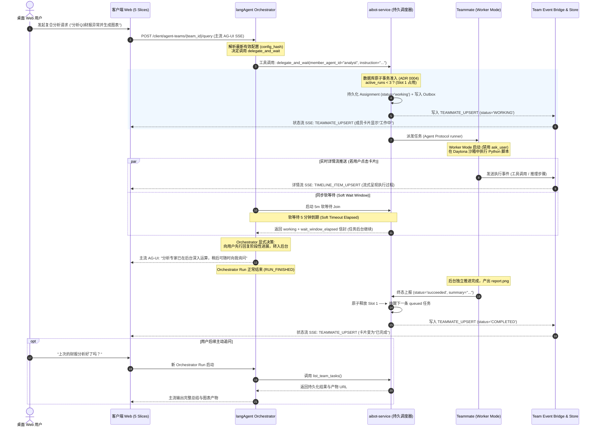

# 专题七：Agent Teams 详解——Orchestrator 工具与内部实现逻辑

> **成熟度标注**：`design_complete`（平台架构设计契约已完成评审，运行时尚未实施）  
> **设计契约依据**：[Master PRD: AI 智企 · Agent Teams PRD 与技术方案](file:///Users/sunxichen/Projects/langAgent/docs/docs/Agent_Teams_PRD_%E4%B8%8E%E6%8A%80%E6%9C%AF%E6%96%B9%E6%A1%88.md)；[ADR 0001~0006](file:///Users/sunxichen/Projects/langAgent/docs/docs/adr/)  
> **白板推演参照**：[workflow_agent_teams.py](file:///Users/sunxichen/Projects/leetcode-practice-app/leetcode-practice-web/.scratch/interview-deck/langagent-recap/recap-code/evolution/workflow_agent_teams.py)（已通过架构演进白板验收）  
> **实施状态声明**：**待实施阶段（Not yet implemented / No runtime code in baseline）**。全篇所有机制、接口、状态机与数据流严格基于 Master PRD 与 ADR 0001-0006 的设计契约进行深度技术推演与解析，严禁表述为已合入 `develop` 主线、已交付或已上线（与事实基准 `DESIGN-TM-001~011`, `FACT-TM-001~003`, `ORAL-T08-TM-001~002`, `DELTA-TM-001` 严格一致）。

---

## 1. 架构定位与核心设计哲学

### 1.1 什么是 Agent Team：从单智能体到独立组合资产 (`DESIGN-TM-001`, ADR 0001, ADR 0003)

在企业级智能体平台的演进历程中，单智能体（Single Agent）即便搭载了 Daytona 代码沙箱与长期记忆，在面对跨领域、多专业分支的复杂业务时，依然会遭遇上下文注意力分散（Context Dilution）、工具冲突与长链路规划脆弱等结构性瓶颈。

为此，平台提出了 **Agent Teams（多智能体团队协作体系）**。其核心设计哲学并非引入一套晦涩的黑盒多智能体框架，而是将企业中已独立验证成熟的多个专长智能体（Type 7 Claw Agent）组合为高凝聚力、可独立授权与发布的 **组合型一等资产（First-Class Composite Asset）**：

```
┌────────────────────────────────────────────────────────────────────────────────────────────────────────┐
│                                   Agent Teams 组合资产模型与边界                                       │
│                                                                                                        │
│  【Agent Team 独立组合资产 (agent_team)】                                                              │
│    • 独立展示身份：专属名称 (name)、描述 (description)、头像 (logo)                                   │
│    • 资产组成：1 个 Orchestrator + 1～10 个 Team Members (引用已有 Type 7 Claw Agent)                  │
│    • 关联属性：每个成员绑定必填团队职责说明 (responsibility)；可选团队级 SOP (collaboration_notes)     │
│                                                                                                        │
│                                       │ 仅保存稳定的 agent_id 引用 (不绑定固定版本快照)                │
│                                       ▼                                                                │
│  ┌──────────────────────────────────────────────────────────────────────────────────────────────────┐  │
│  │ 动态解析最新有效配置原则 (ADR 0001, ADR 0003)                                                    │  │
│  │ 1. 每次 Run 启动时动态解析：Orchestrator 或 Teammate Run 启动时，实时拉取对应 Agent 最新有效配置     │  │
│  │ 2. 运行中不可变：当前 Run 执行周期内配置保持恒定，并计算记录规范化 config_hash                   │  │
│  │ 3. 新运行自动刷新：后续的 Follow-up / Redirect 触发新 Run 时重新解析最新配置                     │  │
│  │ 4. Checkpoint 污染清理：复用 Checkpointer 时主动剔除旧 Run 残留的 llm_config / chatbi_config 等   │  │
│  │ 5. 已有会话跟随最新定义：Team Thread 绑定稳定 team_id，新增成员懒加载，删除成员保留只读卡片与产物│  │
│  └──────────────────────────────────────────────────────────────────────────────────────────────────┘  │
└────────────────────────────────────────────────────────────────────────────────────────────────────────┘
```

根据 [Master PRD:L73-L84](file:///Users/sunxichen/Projects/langAgent/docs/docs/Agent_Teams_PRD_%E4%B8%8E%E6%8A%80%E6%9C%AF%E6%96%B9%E6%A1%88.md#L73-L84) 与 [ADR 0001](file:///Users/sunxichen/Projects/langAgent/docs/docs/adr/0001-agent-teams-follow-latest-effective-agent-config.md)、[ADR 0003](file:///Users/sunxichen/Projects/langAgent/docs/docs/adr/0003-existing-team-threads-follow-latest-team-definition.md) 的设计契约：
- **不创建私有 Agent，不覆盖底层能力**：Team 不拥有私有人设或专属模型配置，亦不篡改成员的 MCP 工具集、知识库或 Skills。
- **引用而非克隆**：Team 资产仅持久化稳定的 `agent_id` 引用，彻底避免了配置分叉与版本同步噩梦。

---

### 1.2 单一面向用户主控心智（Orchestrator-Only Mental Model）与 Worker Mode (`DESIGN-TM-002`, ADR 0002)

多智能体协作最容易陷入的陷阱是“界面失控”——多个 Agent 争抢向用户发言，导致用户心智负担剧增。Agent Teams 架构确立了极简的 **单一主控心智**：

```
                              ┌────────────────────────┐
                              │    桌面 Web 终端用户   │
                              └───────────┬────────────┘
                                          │ 唯一面向用户的交互流 (主流 Standard AG-UI SSE)
                                          ▼
                              ┌────────────────────────┐
                              │    Orchestrator Run    │
                              │ (唯一协调器 / 主 Agent)│
                              └─────┬────────────┬─────┘
                                    │            │
         【路径 1: 直接完成工作】   │            │ 【路径 2: 委派任务】
         • 无需委派，直接调用自身能力 │            │ • 形成独立、完整的业务指令 (Assignment)
         • 成员栏不出现 Teammate 卡片│            │ • 注入专用委派工具 (delegate / redirect)
         • 零委派开销 (Zero Overhead)│            │
                                                 ▼
                              ┌────────────────────────┐
                              │ aibot-service 持久调度 │
                              └───────────┬────────────┘
                                          │ 3 槽位持久准入 + FIFO 队列
                                          ▼
                              ┌────────────────────────┐
                              │  Teammate Worker Mode  │
                              │ (只对 Orchestrator 负责)│
                              └────────────────────────┘
```

1. **Orchestrator 职责与自由度** ([PRD:L305-L325](file:///Users/sunxichen/Projects/langAgent/docs/docs/Agent_Teams_PRD_%E4%B8%8E%E6%8A%80%E6%9C%AF%E6%96%B9%E6%A1%88.md#L305-L325))：
   - 它是 Team 中唯一直接面对用户的角色。
   - 它拥有完全的自主裁量权：可以直接利用自身能力完成简单任务（旅程 A：零委派直接工作）；也可以将复杂子任务委派给专长 Teammate。
2. **Teammate Worker Mode 严格约束** ([PRD:L326-L336](file:///Users/sunxichen/Projects/langAgent/docs/docs/Agent_Teams_PRD_%E4%B8%8E%E6%8A%80%E6%9C%AF%E6%96%B9%E6%A1%88.md#L326-L336))：
   - **能力层禁用 Ask User / HITL**：所有 Teammate 虽为完整的 Type 7 Claw Agent，但在以 Worker 模式加载时，运行时中间件在 Tool Registry 能力层**物理剔除 `ask_user` 工具**，绝不依赖脆弱的 Prompt 软性约定。
   - **单向结果汇报**：Teammate 仅接收 Orchestrator 下达的完整业务指令（Assignment），并在执行终态向 Orchestrator 返回纯文本总结（Text Summary）与结构化元数据，绝不主动向最终用户发送消息或插队打断对话。
   - **只读观察界面**：用户可在右侧栏观察 Teammate 的聊天式只读执行流与卡片状态，但**禁止直接对 Teammate 发送消息、停止、重试或追问**。

---

## 2. Orchestrator 专用委派工具全景与接口契约 (PRD §8.1, §15.4)

在运行时，`langAgent` 为 Orchestrator 动态注入 7 大专用团队协作工具。这些工具并非单纯的进程内函数，而是通过受信任内部网络调用 `aibot-service` 的持久化调度内核：

> ⚠️ **推演标注**：PRD §8.1 只定义了 7 个工具的**语义表**（名称 + 行为），并未定义参数 JSON Schema。本节 §2.1~§2.6 给出的参数 Schema 与返回信封是依据 PRD 语义与数据模型（§14）的**设计态推演示意**，非契约原文；PRD 数据模型中对应字段为 `team_assignment.wait_extension_count`。

```
┌────────────────────────────────────────────────────────────────────────────────────────────────────────┐
│                              Orchestrator 7 大专用团队委派与控制工具集                                 │
│                                                                                                        │
│  ┌───────────────────────┐  ┌─────────────────────────┐  ┌──────────────────────────────────────────┐  │
│  │ delegate_and_wait     │  │ delegate_in_background  │  │ send_follow_up                           │  │
│  │ 同步委派 + 5m 软等待  │  │ 后台异步委派 + 立即回执 │  │ 追加有界增量指令 (FIFO 队列上限 5 条)    │  │
│  └───────────────────────┘  └─────────────────────────┘  └──────────────────────────────────────────┘  │
│  ┌───────────────────────┐  ┌─────────────────────────┐  ┌──────────────────────────────────────────┐  │
│  │ interrupt_and_redirect│  │ cancel_team_work        │  │ list_team_tasks / check_team_task        │  │
│  │ 中断方向 + 清队列替换 │  │ 用户主会话显式停止任务   │  │ 跨 Run 查询持久运行记录 (无主动唤醒)     │  │
│  └───────────────────────┘  └─────────────────────────┘  └──────────────────────────────────────────┘  │
└────────────────────────────────────────────────────────────────────────────────────────────────────────┘
```

---

### 2.1 `delegate_and_wait`（同步等待委派）

#### 签名与参数 Schema
```json
{
  "name": "delegate_and_wait",
  "description": "向指定团队成员委派独立任务，并同步等待执行结果返回（适用于当前回复强依赖该结果的场景）",
  "parameters": {
    "type": "object",
    "properties": {
      "member_agent_id": {
        "type": "string",
        "description": "目标成员 Agent ID，必须属于当前 Team 名册"
      },
      "instruction": {
        "type": "string",
        "description": "清晰、完整且可独立执行的任务指令与必要上下文"
      },
      "wait_retry_attempt": {
        "type": "integer",
        "default": 0,
        "description": "软等待追加重试序号（内部计数器，最多追加 3 次）"
      }
    },
    "required": ["member_agent_id", "instruction"]
  }
}
```

#### 内部实现逻辑与控制流
1. **持久线程解析**：调用 `PersistentTeammateManager.get_or_create_teammate_thread(member_agent_id)`，基于 `team_thread_id + member_agent_id` 懒加载或获取唯一的 `teammate_thread_id`（[ADR 0002](file:///Users/sunxichen/Projects/langAgent/docs/docs/adr/0002-dynamic-persistent-teammates-over-agent-protocol.md)）。
2. **调度器事务准入**：向 `aibot-service` 的 `TeamAssignmentScheduler` 提交 Assignment（`dispatch_mode="waiting"`）。
   - 若活跃槽位 `active < 3` 且目标成员空闲：占用 Slot，状态置为 `working`，生成真实 `teammate_run_id`，写入 `dispatch_outbox` 事务。
   - 若槽位已满（`active = 3`）或成员正忙：状态置为 `queued`，进入持久 FIFO 队列。
3. **建立软等待 Join**：Orchestrator 启动 **5 分钟（300 秒）软等待窗口**，通过持久 Completion Channel / SSE 监听该 Run 的终态事件（[PRD:L391-L410](file:///Users/sunxichen/Projects/langAgent/docs/docs/Agent_Teams_PRD_%E4%B8%8E%E6%8A%80%E6%9C%AF%E6%96%B9%E6%A1%88.md#L391-L410)）。
4. **正常返回**：Teammate 在 5 分钟内执行完毕，返回纯文本总结（`result_summary`），Orchestrator 将其注入上下文继续推理。

#### 异常与边界分支
- **软等待窗口到期（Soft Timeout Elapsed）**：
  - **核心设计契约**：软等待到期**绝不将 Assignment 判定为失败**！底层任务继续在后台稳健运行。
  - **返回信封**（推演示意）：软窗口到期不判失败，按 PRD §8.1 契约口径返回 `working + wait_window_elapsed`，结构化回执形如 `{"status": "working", "wait_window_elapsed": true, "remaining_retries": 3 - wait_retry_attempt}`。
  - **Orchestrator 4 选 1 显式决策**：
    1. *追加等待*：在剩余 3 次额度内再次调用 `delegate_and_wait(wait_retry_attempt=N+1)`；
    2. *转为后台*：直接向用户输出阶段性答复（如“专家正在深度计算中...”），结束当前 Orchestrator Run；
    3. *Redirect 快速收尾*：调用 `interrupt_and_redirect` 要求 Teammate 基于已有半成品快速产出总结；
    4. *取消任务*：调用 `cancel_team_work` 显式终止。

---

### 2.2 `delegate_in_background`（后台异步委派）

#### 签名与参数 Schema
```json
{
  "name": "delegate_in_background",
  "description": "向指定团队成员委派后台异步任务，立即返回任务回执，不阻塞当前主对话（适用于耗时计算或无需即时回复结果的场景）",
  "parameters": {
    "type": "object",
    "properties": {
      "member_agent_id": {
        "type": "string",
        "description": "目标成员 Agent ID"
      },
      "instruction": {
        "type": "string",
        "description": "后台执行的完整任务指令"
      }
    },
    "required": ["member_agent_id", "instruction"]
  }
}
```

#### 内部实现逻辑与控制流
1. **持久化并提交调度**：将 Assignment 持久化写入数据库（`dispatch_mode="background"`）。
2. **立即返回 Admission 回执**：
   - 调度器准入决策后，立即返回 `{"status": "started" | "queued", "assignment_id": "asgn_xxx", "teammate_thread_id": "tm_th_xxx"}`。
3. **主 Agent 优雅收尾**：Orchestrator 获知任务已受理，组织自然语言回复告知用户（如“已为您启动后台批量分析”），随后主 Run 触发 `RUN_FINISHED` 释放资源。
4. **后台独立执行**：后台 Teammate Run 与浏览器连接及 Orchestrator 进程完全解耦，由后台执行器独立消费直至终态（[PRD:L557-L569](file:///Users/sunxichen/Projects/langAgent/docs/docs/Agent_Teams_PRD_%E4%B8%8E%E6%8A%80%E6%9C%AF%E6%96%B9%E6%A1%88.md#L557-L569)）。

#### 异常与边界分支
- **无主动唤醒机制**：后台任务成功或失败均只落库 Team Event 并驱动卡片状态变迁，**绝不主动唤醒主会话，亦不向主消息历史插入系统通知**。

---

### 2.3 `send_follow_up`（追加有界追问/增量任务）

#### 签名与参数 Schema
```json
{
  "name": "send_follow_up",
  "description": "向指定 Teammate 追加后续补充指令或增量任务",
  "parameters": {
    "type": "object",
    "properties": {
      "member_agent_id": {
        "type": "string",
        "description": "目标成员 Agent ID"
      },
      "follow_up_instruction": {
        "type": "string",
        "description": "追加的补充说明或下一步要求"
      }
    },
    "required": ["member_agent_id", "follow_up_instruction"]
  }
}
```

#### 内部实现逻辑与控制流
1. **成员状态感知**：
   - 若目标 Teammate 处于空闲（驻留终态）：直接通过调度器申请 Slot 并启动新 Run。
   - 若目标 Teammate 处于 `working`：指令进入该成员专属的持久化 FIFO Follow-up 队列（[PRD:L353-L360](file:///Users/sunxichen/Projects/langAgent/docs/docs/Agent_Teams_PRD_%E4%B8%8E%E6%8A%80%E6%9C%AF%E6%96%B9%E6%A1%88.md#L353-L360)）。
2. **有界容量校验**：单 Teammate 的 Follow-up 队列上限严格限制为 **5 条**。

#### 异常与边界分支
- **队列溢出拒绝（Queue Overflow）**：当队列中已有 5 条待执行指令时，第 6 条直接返回 `{"status": "rejected", "error": "Follow-up queue cap (5) reached"}`，强制 Orchestrator 等待或重定向。
- **否定自动合并与指令替换**：平台**绝不自动合并自然语言指令**，因为系统无法确定新指令是对旧指令的补充、修正还是完全覆盖，必须严格遵循 FIFO 顺序执行。

---

### 2.4 `interrupt_and_redirect`（中断并重新定向）

#### 签名与参数 Schema
```json
{
  "name": "interrupt_and_redirect",
  "description": "立即中断指定 Teammate 当前的执行方向，清空其未执行队列，并基于已有进度启动全新方向的替换任务",
  "parameters": {
    "type": "object",
    "properties": {
      "member_agent_id": {
        "type": "string",
        "description": "目标成员 Agent ID"
      },
      "new_instruction": {
        "type": "string",
        "description": "新的任务指令（通常包含快速收尾、更换统计口径等要求）"
      }
    },
    "required": ["member_agent_id", "new_instruction"]
  }
}
```

#### 内部实现逻辑与控制流
根据 [ADR 0002](file:///Users/sunxichen/Projects/langAgent/docs/docs/adr/0002-dynamic-persistent-teammates-over-agent-protocol.md) 与 [ADR 0004](file:///Users/sunxichen/Projects/langAgent/docs/docs/adr/0004-durable-team-assignment-admission-control.md)，Redirect 实现了原子级**原槽位替换**：
1. **中断信号广播**：向底层正在执行的 `teammate_run_id` 发送 Agent Protocol `interrupt` 信号。
2. **清空待执行队列**：原子清空该成员专属的 5 条 Follow-up 队列中所有尚未开始的项。
3. **原槽位原子替换**：将原 Assignment 标记为 `cancelled_by_redirect`，并在**原调度槽位内直接创建新的替换 Assignment**（`status="working"`），生成新 `teammate_run_id`。
4. **不额外占槽**：替换过程不释放 Slot 也不触发队列重新排队，确保新方向任务立即开始执行。

#### 异常与边界分支
- **独立隔离性**：中断与清空操作仅作用于指定的 `member_agent_id`，同一 Team Thread 中其他正在并发运行的 Teammate 及其队列完全不受影响。

---

### 2.5 `cancel_team_work`（停止团队工作）

#### 签名与参数 Schema
```json
{
  "name": "cancel_team_work",
  "description": "停止指定成员或整个团队正在进行的所有工作项（响应用户主会话中的'停止'指令）",
  "parameters": {
    "type": "object",
    "properties": {
      "member_agent_id": {
        "type": "string",
        "description": "可选。指定成员 ID；若为空，则停止当前 Team 会话内的所有团队工作"
      }
    }
  }
}
```

#### 内部实现逻辑与控制流
1. **目标任务取消**：调度器扫描目标成员（或会话内所有成员）处于 `working` 与 `queued` 状态的 Assignment。
2. **状态落库与槽位释放**：
   - 处于 `working` 的 Run 发送取消信号，状态更新为 `cancelled`，`terminal_reason="cancelled_by_user"`；
   - 处于 `queued` 的任务直接移出队列并标记 `cancelled`；
   - 原子释放占用的调度 Slot。

#### 异常与边界分支
- **只取消任务，不删会话**：与危险的“会话删除”不同，`cancel_team_work` 仅终止当前计算，**绝对保留 Team Thread、主消息历史、Teammate 历史卡片与已外化的产物**（[PRD:L468-L469](file:///Users/sunxichen/Projects/langAgent/docs/docs/Agent_Teams_PRD_%E4%B8%8E%E6%8A%80%E6%9C%AF%E6%96%B9%E6%A1%88.md#L468-L469)）。

---

### 2.6 `list_team_tasks` 与 `check_team_task`（跨 Run 状态查询）

#### 签名与参数 Schema
```json
{
  "name": "list_team_tasks",
  "description": "查询当前 Team 会话中所有 Teammate 的持久化任务清单与当前状态（用于新 Run 汇总后台进度）",
  "parameters": {
    "type": "object",
    "properties": {}
  }
}
```
```json
{
  "name": "check_team_task",
  "description": "根据任务 ID 查询特定 Assignment 的详细执行结果与产物元数据",
  "parameters": {
    "type": "object",
    "properties": {
      "assignment_id": {
        "type": "string",
        "description": "业务工作项 ID"
      }
    },
    "required": ["assignment_id"]
  }
}
```

#### 内部实现逻辑与控制流
1. **解决跨 Run 记忆鸿沟**：当用户在数小时后再次进入会话询问“上次交给分析师的报告做好了吗？”，新的 Orchestrator Run 无需依赖旧进程的内存变量，直接调用 `list_team_tasks` 读取持久化记录表 `team_assignment`。
2. **返回持久化事实**：返回各成员的最新状态、完成时间、纯文本总结及关联产物 URL。

---

## 3. 内部实现逻辑与核心机制下钻

```
┌────────────────────────────────────────────────────────────────────────────────────────────────────────┐
│                                TeamAssignmentScheduler 内部调度内核                                    │
│                                                                                                        │
│  Orchestrator 委派调用 (delegate / follow_up / redirect)                                               │
│                         │                                                                              │
│                         ▼                                                                              │
│  ┌──────────────────────────────────────────────────────────────────────────────────────────────────┐  │
│  │ 数据库原子事务边界 (Database Transaction & Lock)                                                  │  │
│  │                                                                                                  │  │
│  │  1. 活跃槽位检查 (active_runs < 3 ?)                                                             │  │
│  │     ├─ [槽位未满且目标成员空闲] ──► 状态置为 working ──► 写入 dispatch_outbox (幂等 key)          │  │
│  │     └─ [槽位已满 OR 目标成员正忙] ─► 状态置为 queued  ──► 写入持久 FIFO 队列                      │  │
│  │                                                                                                  │  │
│  │  2. Redirect 事务内替换                                                                           │  │
│  │     └─ 原 Run 标记 cancelled_by_redirect ──► 清空 Follow-up 队列 ──► 原槽位创建新 working Run      │  │
│  │                                                                                                  │  │
│  │  3. 终态释放与出队                                                                               │  │
│  │     └─ Run 终态 (succeeded/failed/timeout) ──► 释放 Slot ──► 扫描出队下一条 queued Assignment     │  │
│  └──────────────────────────────────────────────────────────────────────────────────────────────────┘  │
│                         │                                                                              │
│                         ▼ 异步消费 (Lease + Heartbeat 存活保障)                                         │
│  ┌──────────────────────────────────────────────────────────────────────────────────────────────────┐  │
│  │ 后台执行器 (Agent Protocol Runtime / langAgent Teammate Runner)                                   │  │
│  │  • 加载最新 Agent 配置 (ADR 0001)   • 禁用 ask_user (Worker Mode)   • 施加 2h 平台硬运行上限        │  │
│  └──────────────────────────────────────────────────────────────────────────────────────────────────┘  │
└────────────────────────────────────────────────────────────────────────────────────────────────────────┘
```

---

### 3.1 3 槽位持久准入控制与 Dispatch Outbox (ADR 0004)

#### 为什么彻底否定进程内存信号量（In-memory Semaphore）？
在 [ADR 0004](file:///Users/sunxichen/Projects/langAgent/docs/docs/adr/0004-durable-team-assignment-admission-control.md) 的架构决策中，明确否定了使用 Python 原生 `asyncio.Semaphore` 控制并发的方案：
1. **多副本失效**：`aibot-service` 与 `langAgent` 在生产环境中均为多 Pod 副本部署，进程内信号量无法感知跨节点并发，瞬间导致槽位击穿；
2. **服务重启与断线丢失**：内存信号量随进程消亡而归零，无法支撑跨越数小时的后台长任务；
3. **调度与存储裂缝**：若内存获取槽位成功但数据库写入失败，将造成槽位永久泄漏。

#### 事务准入与 Outbox 幂等派发机制
`aibot-service` 的 `TeamAssignmentScheduler` 采用严格的 **事务准入 + Dispatch Outbox** 模式（代码参照 [workflow_agent_teams.py:L274-L418](file:///Users/sunxichen/Projects/leetcode-practice-app/leetcode-practice-web/.scratch/interview-deck/langagent-recap/recap-code/evolution/workflow_agent_teams.py#L274-L418)）：
- **原子准入**：在数据库行级锁保护下校验 `SELECT count(*) FROM team_assignment WHERE team_thread_id = :id AND status = 'working'`。
- **Outbox 事务写入**：槽位分配、Assignment 持久化与 `dispatch_outbox` 表的写入置于同一数据库本地事务内。
- **幂等派发键**：`idempotency_key = f"{assignment_id}:{attempt}"`，确保即使 Outbox 扫描器发生网络重试，底层 Agent Protocol 亦绝不创建重复的 Teammate Run。
- **平滑状态映射**：内部的 `queued` 排队态在向前端状态流推送时，**统一平滑映射为“工作中”**，避免向用户暴露内部排队技术细节（[PRD:L385](file:///Users/sunxichen/Projects/langAgent/docs/docs/Agent_Teams_PRD_%E4%B8%8E%E6%8A%80%E6%9C%AF%E6%96%B9%E6%A1%88.md#L385)）。

---

### 3.2 一成员一持久 Teammate 模型 (ADR 0002)

#### 实例映射与生命周期
平台确立了 **一成员一持久 Teammate（One Persistent Teammate per Member）** 的核心契约（[ADR 0002](file:///Users/sunxichen/Projects/langAgent/docs/docs/adr/0002-dynamic-persistent-teammates-over-agent-protocol.md)）：
- **持久键**：`team_thread_id + member_agent_id -> teammate_thread_id`。
- **懒加载创建**：创建 Team 会话时不提前初始化所有成员沙箱；仅在某个成员**首次收到委派时**动态创建持久线程并绑定 Daytona 容器。
- **跨任务上下文与 Workspace 复用**：后续派发给该成员的所有 Assignment、Follow-up 与 Redirect 均复用同一个 `teammate_thread_id` 和同一个 Daytona 代码沙箱，使成员能够天然继承前序生成的中间代码、数据表与分析产物。

---

### 3.3 双层超时体系与优雅宽限期 (PRD §9.1)

```
┌────────────────────────────────────────────────────────────────────────────────────────────────────────┐
│                                   Agent Teams 双层超时与生命周期控制                                    │
│                                                                                                        │
│  【第一层: 同步软等待窗口 (Soft Wait Window)】                                                          │
│    • 默认阈值：5 分钟 (300 秒)                                                                         │
│    • 最大追加次数：3 次 (累计最长等待 20 分钟)                                                         │
│    • 核心原则：到期绝不判任务失败！Orchestrator 显式 4 选 1 (追加 / 转后台 / Redirect / 取消)          │
│                                                                                                        │
│  【第二层: Assignment 平台硬运行上限 (Hard Runtime Limit)】                                             │
│    • 默认阈值：2 小时 (7200 秒)                                                                        │
│    • 计时起点：从任务进入 working 状态开始计时 (严格排除 queued 排队等待时间)                          │
│    • 核心原则：超时强制中断 Run，释放 Slot，持久化标记 status="timed_out" (前端映射为"执行异常")       │
│                                                                                                        │
│  【第三层: 会话删除优雅宽限期 (Deletion Grace Period)】                                                 │
│    • 默认阈值：30 秒                                                                                   │
│    • 核心原则：删除会话时建立 Fence，给工具和资源释放留出 30s 宽限，随后硬清理 Checkpoint 与沙箱       │
└────────────────────────────────────────────────────────────────────────────────────────────────────────┘
```

根据 [Master PRD:L391-L410](file:///Users/sunxichen/Projects/langAgent/docs/docs/Agent_Teams_PRD_%E4%B8%8E%E6%8A%80%E6%9C%AF%E6%96%B9%E6%A1%88.md#L391-L410)，超时参数由后端统一环境配置，不向管理端暴露混淆视听。

---

### 3.4 三层流架构与前端隔离读模型 (PRD §13, §16, `DESIGN-TM-007`)

为了彻底杜绝长任务事件将现有聊天 Reducer 冲垮，Agent Teams 设计了高内聚的三层流架构：

```
┌────────────────────────────────────────────────────────────────────────────────────────────────────────┐
│                                       三层流解耦与前端 5 大读模型                                       │
│                                                                                                        │
│  [ 桌面 Web 客户端 ]                                                                                   │
│       │                                                                                                │
│       ├─ 1. 主流 (Mainstream AG-UI SSE) ──► 写入 orchestratorMessages 切片 (仅处理主会话气泡与工具)     │
│       │                                                                                                │
│       ├─ 2. 状态流 (Team Status SSE) ─────► 写入 teamSummaryByThread 切片 (常驻监听 TEAMMATE_UPSERT)   │
│       │                                                                                                │
│       └─ 3. 详情流 (Detail REST + SSE) ───► 写入 timelineByMember 切片 (仅在点击卡片时按需加载)        │
│                                                                                                        │
│  ┌──────────────────────────────────────────────────────────────────────────────────────────────────┐  │
│  │ 前端 5 大独立 State Slices (物理隔离，严禁写入单一 chatInfo.answer)                               │  │
│  │ 1. orchestratorMessages: 驱动主会话 QBubble / ABubble                                            │  │
│  │ 2. teamSummaryByThread: 驱动右侧栏 Teammate 成员卡片四态 (工作中 / 已完成 / 执行异常 / 已停止)    │  │
│  │ 3. timelineByMember: 驱动选中成员的聊天式只读执行流 (默认 30 条游标分页 before_sequence)          │  │
│  │ 4. connectionByStreamKey: 管理各流的 AbortController、重连 Cursor 与断线状态                      │  │
│  │ 5. activeTeamView: 当前激活视图标识 (orchestrator 或选中的 member_agent_id)                       │  │
│  └──────────────────────────────────────────────────────────────────────────────────────────────────┘  │
└────────────────────────────────────────────────────────────────────────────────────────────────────────┘
```

- **状态流事件（`TEAMMATE_UPSERT`）**：
  推送轻量级的卡片快照（示例为节选，完整结构还含 `avatar` 等字段）：`{"type": "TEAMMATE_UPSERT", "sequence": 130, "payload": {"memberAgentId": "agent-101", "name": "设计专家", "status": "COMPLETED"}}`。前端基于 sequence 保证幂等覆盖（[PRD:L858-L870](file:///Users/sunxichen/Projects/langAgent/docs/docs/Agent_Teams_PRD_%E4%B8%8E%E6%8A%80%E6%9C%AF%E6%96%B9%E6%A1%88.md#L858-L870)）。
- **详情流 REST 与 SSE 衔接**：
  用户点击卡片时，先通过 REST API 拉取最近 30 条历史（`GET /timeline?limit=30`），获得当前最新序列号 `latestSequence=N`；随后建立详情 SSE 并传入 `afterSequence=N`，实现历史与实时的无缝拼接。

---

### 3.5 断连恢复、重启对账与删除 Fence (PRD §11, §13.3, ADR 0006)

#### 浏览器断开与服务重启对账
- **断连解耦**：异步 Teammate Run 绝不依赖客户端的 HTTP/SSE 连接。当用户关闭浏览器或网络闪断时，后台 Agent Protocol 运行器继续推进任务至终态，所有事件完整持久化至 `team_event` 表。
- **重启对账（Reconciliation）**：
  服务实例重启后，调度器后台对账 Job 扫描所有 `status="working"` 的任务，比对 Agent Protocol 的底层心跳与 30s Lease。若心跳超时超过 5 分钟（`zombie`），自动触发清理并释放 Slot（5 分钟 zombie TTL 见 PRD §9.1 与 §18.3 `team_run_heartbeat_age`；恢复原则见 [PRD §13.3](file:///Users/sunxichen/Projects/langAgent/docs/docs/Agent_Teams_PRD_%E4%B8%8E%E6%8A%80%E6%9C%AF%E6%96%B9%E6%A1%88.md#L561-L569)）。

#### 会话删除 Fence 机制
根据 [PRD:L470-L485](file:///Users/sunxichen/Projects/langAgent/docs/docs/Agent_Teams_PRD_%E4%B8%8E%E6%8A%80%E6%9C%AF%E6%96%B9%E6%A1%88.md#L470-L485)，当用户在历史列表中删除 Team Thread 时，系统在原子事务内执行防御性清理：
1. **建立原子 Fence**：将 `team_thread.status` 更新为 `deleting`，全局 Fence 生效，坚决拒绝任何新 Run 启动，并丢弃所有迟到的 Worker 执行结果；
2. **清空队列**：立即清空所有排队中的 Assignment 与 Follow-up；
3. **下发取消信号**：向所有运行中的 Orchestrator 与 Teammate 下发取消信号，提供 **30 秒优雅宽限期**；
4. **级联资源销毁**：宽限期过后强制释放 Lease，级联清理 Checkpoint 状态、Teammate 映射与底层 Daytona 沙箱容器；
5. **置终态**：标记状态为 `deleted`。整套清理流程幂等可重试。

---

### 3.6 权限复用与运行审计模型 (ADR 0005, ADR 0006)

- **无提权原则（No Privilege Escalation，ADR 0005）**：
  Team 资产完全复用现有 Agent 的 `SUPER_ADMIN / ADMIN / NORMAL` 权限模型，不新增任何私有权限类型。用户拥有 Team 使用权即可对话，但**进入底层 MCP 工具、知识库检索与数据库查询时，系统全程向下透传该最终用户的身份与组织上下文**，绝不允许利用 Team 组合间接提升底层数据访问权限。
- **运行记录作为唯一审计源（ADR 0006）**：
  系统直接以持久化运行记录表（`team_thread` / `team_assignment` / `teammate_run` / `team_event`）作为 MVP 唯一的审计事实来源，完整保留 `config_hash`、真实 `run_id`、调度方式与终止原因，避免为了虚构的合规诉求复制第二套沉重的审计载荷。

---

## 4. Orchestrator 一次完整委派的端到端时序（设计态推演）

以下展示从用户发起复合请求，到 Orchestrator 委派、调度器排队与准入、Teammate 沙箱执行、三层流推送，直至结果回收的完整端到端时序逻辑（以等待型委派与软超时分支为例）：



---

## 5. 与 deepagents 0.6.12 原生异步子代理的差异对照 (`DELTA-TM-001`)

在架构设计评估阶段，团队深入剖析了锁定依赖版本 `deepagents 0.6.12` 中的原生中间件 `middleware/async_subagents.py`（代码见 [FACT-TM-001](file:///Users/sunxichen/Projects/leetcode-practice-app/leetcode-practice-web/.scratch/interview-deck/langagent-recap/fact-base.md#L156)）。Agent Teams 的架构设计契约与框架原生实现存在四大本质层面的演进差异：

```
┌────────────────────────────────────────────────────────────────────────────────────────────────────────┐
│                       deepagents 0.6.12 原生行为 vs. Agent Teams 设计契约演进对比                       │
│                                                                                                        │
│  【维度 1: 线程与实例生命周期】                                                                        │
│    • deepagents 0.6.12: astart_async_task 每次调用显式执行 await client.threads.create() 创建全新线程   │
│    • Agent Teams 设计 : 一成员一持久线程 (team_thread_id + member_agent_id -> teammate_thread_id)     │
│                                                                                                        │
│  【维度 2: 并发与准入调度机制】                                                                        │
│    • deepagents 0.6.12: 框架未定义任何会话级并发限制，所有任务到达立即无节制发起远程 Run                │
│    • Agent Teams 设计 : 持久调度器 (TeamAssignmentScheduler) 严格管控 3 槽位硬限制与持久 FIFO 队列    │
│                                                                                                        │
│  【维度 3: 工具契约与抽象语义】                                                                        │
│    • deepagents 0.6.12: 暴露底层技术工具 (start/check/update/cancel_async_task)，强绑定 task_id         │
│    • Agent Teams 设计 : 封装面向角色的业务委派 (delegate_and_wait, delegate_in_background, redirect)    │
│                                                                                                        │
│  【维度 4: 事件流转与读模型解耦】                                                                      │
│    • deepagents 0.6.12: 仅提供轮询/更新等控制面，无独立 Worker 实时事件推送能力                         │
│    • Agent Teams 设计 : 自研 Team Event 桥接层，输出主流/状态流/详情流三层流与前端 5 Slice 隔离读模型   │
└────────────────────────────────────────────────────────────────────────────────────────────────────────┘
```

### 深度架构对比矩阵 (`DELTA-TM-001`)

| 比较维度 | `deepagents 0.6.12` `async_subagents.py` 原生行为 | Agent Teams 平台架构设计契约 (Master PRD + ADR) | 演进动因与架构权衡 |
|---|---|---|---|
| **线程生命周期** | 源码 [async_subagents.py:L337-L343](file:///Users/sunxichen/Projects/leetcode-practice-app/leetcode-practice-web/.scratch/langagent-framework-sources/deepagents/middleware/async_subagents.py#L337-L343) 显示：每次 `astart_async_task` 均显式调用 `threads.create()`，任务与新线程绑定。 | **一成员一持久线程** ([ADR 0002](file:///Users/sunxichen/Projects/langAgent/docs/docs/adr/0002-dynamic-persistent-teammates-over-agent-protocol.md))：同一 Team 会话中每个成员在首次委派时懒创建持久线程，后续任务全部复用。 | 避免每次委派导致右侧成员栏无限膨胀；确保 Teammate 能够跨任务复用沙箱内已生成的文件与上下文。 |
| **并发准入控制** | 源码未提供任何并发槽位控制；任务提交直接派发至远程，极易因高并发打满集群资源。 | **3 槽位持久准入调度** ([ADR 0004](file:///Users/sunxichen/Projects/langAgent/docs/docs/adr/0004-durable-team-assignment-admission-control.md))：持久调度器在数据库事务内硬限制 3 个活跃 Run，超出部分进入持久 FIFO 队列。 | 杜绝单会话滥用算力，保障平台稳定性；支持服务重启与跨 Pod 副本的可靠恢复。 |
| **工具契约语义** | 暴露低层级技术工具（`start_async_task`, `check_async_task`, `cancel_async_task`），输入输出充斥底层 `task_id`。 | 封装**面向角色与业务的高层委派工具**（`delegate_and_wait`, `delegate_in_background`, `send_follow_up`, `interrupt_and_redirect`）。 | 屏蔽底层基础设施技术细节，契约贴合人类团队协作分工；天然支持软等待与原槽位快速重定向。 |
| **事件流与读模型** | 缺乏独立 Worker 的流式外化通道；`ag-ui-langgraph 0.0.42` 不支持 `subagent_id` 归因。 | **自研 Team Event 桥接体系**（[PRD §13](file:///Users/sunxichen/Projects/langAgent/docs/docs/Agent_Teams_PRD_%E4%B8%8E%E6%8A%80%E6%9C%AF%E6%96%B9%E6%A1%88.md#L513-L569) 与 §16 起约 L840）：驱动主流、状态流、详情流三层解耦与前端 5 Slice 隔离。 | 彻底防止子 Agent 高频事件污染主会话 Reducer；按需加载历史，大幅降低前端网络与渲染开销。 |

---

## 6. 附录：核心数据模型与 API 契约速查 (PRD §14, §15)

### 6.1 核心持久化表结构设计

```
┌────────────────────────────────────────────────────────────────────────────────────────────────────────┐
│                                   Agent Teams 核心数据模型关系图 (ERD)                                 │
│                                                                                                        │
│    agent_team (组合资产) 1 ─── N agent_team_member (成员引用 + 必填职责说明)                            │
│         │                                                                                              │
│         │ 1                                                                                            │
│         ▼ N                                                                                            │
│    team_thread (持久团队会话，绑定 team_id)                                                            │
│         │                                                                                              │
│         ├─ 1 ─── N team_teammate (持久成员实例: UNIQUE(team_thread_id, member_agent_id))                 │
│         │             │                                                                                │
│         │             └─ 1 ─── N team_assignment (业务工作项: queued / working / succeeded / ...)      │
│         │                           │                                                                  │
│         │                           └─ 1 ─── N teammate_run (真实执行 Attempt，记录 config_hash)       │
│         │                                                                                              │
│         └─ 1 ─── N team_event (单调递增 sequence，驱动状态流与只读 Timeline 投影)                      │
└────────────────────────────────────────────────────────────────────────────────────────────────────────┘
```

1. **`agent_team`**：`id`, `name`, `description`, `logo`, `orchestrator_agent_id`, `collaboration_instructions`, `deleted`, `creator/modifier`。
2. **`agent_team_member`**：`team_id`, `member_agent_id`, `responsibility`（必填团队职责）, `sort_order`；约束：`unique(team_id, member_agent_id)`。
3. **`team_thread`**：`team_thread_id`, `conversation_id`, `team_id`, `user_id`, `org_id`, `status`（`active | deleting | deleted`）, `latest_sequence`。
4. **`team_teammate`**：`teammate_id`, `team_thread_id`, `member_agent_id`, `teammate_thread_id`, `latest_status`；约束：`unique(team_thread_id, member_agent_id)`。
5. **`team_assignment`**：`assignment_id`, `team_thread_id`, `member_agent_id`, `orchestrator_run_id`, `kind`（`assignment | follow_up | redirect`）, `dispatch_mode`（`waiting | background`）, `instruction`, `status`, `wait_extension_count`, `terminal_reason`。
6. **`teammate_run`**：`teammate_run_id`, `assignment_id`, `run_id`（真实底层 Run ID）, `attempt`, `config_hash`, `status`, `started_at`, `finished_at`；约束：`unique(run_id)`。
7. **`team_event`**：`event_id`, `team_thread_id`, `sequence`（单调递增游标）, `event_type`, `member_agent_id`, `timeline_item_id`, `payload`, `occurred_at`；约束：`unique(team_thread_id, sequence)`。

---

### 6.2 内部控制面与外部观察 API 契约速查

| 接口类型 | HTTP Method 与端点 | 核心职责与入参说明 | 响应契约与关键字段 |
|---|---|---|---|
| **外部观察 API** | `GET /team-threads/{id}/teammates` | 获取当前会话所有 Teammate 的卡片状态列表。 | `{"latestSequence": 128, "items": [{"memberAgentId": "...", "status": "WORKING"}]}` |
| **外部观察 API** | `GET /team-threads/{id}/teammates/{mid}/timeline` | 游标分页拉取只读 Timeline 历史（`limit=30`, `before_sequence=N`）。 | `{"hasMore": true, "nextBeforeSequence": 76, "items": [{"timelineItemId": "...", "type": "text"}]}` |
| **外部观察 API** | `POST /team-threads/{id}/events/stream` | 订阅状态流（`scope=status`）或指定成员详情流（`scope=detail`, `afterSequence=N`）。 | Server-Sent Events 流式事件（`TEAMMATE_UPSERT` / `TIMELINE_ITEM_UPSERT`） |
| **内部控制面** | `POST /internal/team-threads/{id}/assignments` | 由委派工具调用，向持久调度器提交 Assignment。 | `{"assignmentId": "as-1", "admission": "started" \| "queued", "status": "working"}` |
| **内部控制面** | `POST /internal/.../follow-ups` | 追加有界 Follow-up 指令（队列上限 5 条）。 | `{"status": "queued", "queuePosition": 2} / {"status": "rejected"}` |
| **内部控制面** | `POST /internal/.../interrupt-and-redirect` | 中断当前 Run，清空队列并在原槽位替换新指令。 | `{"status": "redirected", "newAssignmentId": "as-2"}` |
| **内部控制面** | `POST /internal/.../assignments/{id}/cancel` | 取消指定任务，原子释放调度 Slot。 | `{"status": "cancelled"}` |
