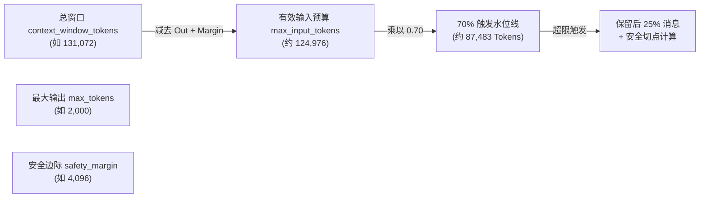
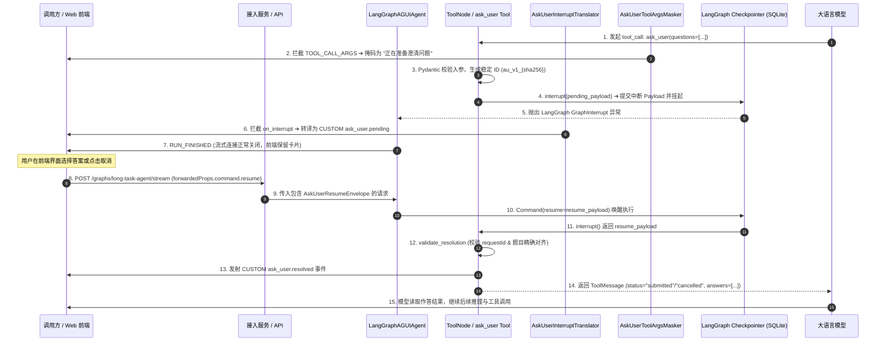

# langAgent 架构深度复盘：从动态图编排、沙箱治理到工作流与多智能体演进

> **文档性质与叙事定位**：
> 本文是 `langAgent` 项目的完整技术复现与工程架构深度复盘。
> - **第一人称叙事视角**：以“核心设计与实现参与者”身份展开，深入阐述系统为何如此设计、核心控制流拓扑、状态与协议边界、失败模式与故障自愈，并在必要处明确区分**我参与/主导的架构设计**与**团队最终落地的工程实现**。
> - **主线贯穿**：以一次 **Long Task 请求的端到端生命周期** 为骨架主线，将通用 Dynamic Agent 底座、Daytona 容器沙箱治理、Artifact Durability、多维上下文与记忆体系、Human-in-the-loop (Ask User)、业务子图（ChatBI 架构升级 / DataEnvelope / Visualization / A2UI）以及平台高阶演进（Workflow/Chatflow 与 Agent Teams）有机融为一个无断点的工程全貌。
> - **技术深度与事实纪律**：本文严格锚定项目已审计事实底稿（`fact-base.md` 与 `evidence-gaps.md`），杜绝未经证实的线上事故、虚构时延/吞吐数字或伪造 A/B 实验数据；严格区分**已实现（develop 基线）**、**原型验证（参考分支/未提交工作树）**、**设计完成（PRD/ADR 完备契约）**、**提议与探索（proposed / accepted_unknown）**与**已废弃**等成熟度状态。
> - **配套白板代码**：本文各章节机制与 [recap-code/](recap-code/) 下的 4 份核心白板伪代码（core/ 3 份 + evolution/ 1 份）严格同名、同状态、同流向保持双向一致，另有 skeleton/ 5 份极简记忆骨架（15 分钟可默写主干，含 MCP 工具全链路），读者可对照阅读或作为面试白板默写索引。

---

## 0. 架构全景蓝图与 20-30 分钟面试自述路线

### 0.1 平台定位与系统架构全景蓝图

在企业级 AI 应用平台建设中，单一预设的 Agent 拓扑无法同时应对轻量级交互式问答、多模态知识检索、复杂业务数据分析（ChatBI / 结构化可视化）、深度代码编写与沙箱执行（Long Task），以及确定性业务审批流与多角色专业团队协作。

`langAgent` 平台确立了**双核心执行面、统一协议适配、高阶演进协同**的三层平台蓝图：

```
┌────────────────────────────────────────────────────────────────────────────────────────────────────────┐
│                                     langAgent 平台运行时与演进全景蓝图                                    │
│                                                                                                        │
│  [ 前端 Web 客户端 / 管理端 ] ──── (HTTP POST / SSE 长连接: /react-agent/stream, /graphs/long-task-agent)  │
│                                                │                                                       │
│                                                ▼                                                       │
│  ┌──────────────────────────────────────────────────────────────────────────────────────────────────┐  │
│  │ 1. 接入与协议适配层 (Gateway & Protocol Pipeline)                                                 │  │
│  │    • Starlette 0.52+ 断连感知监听器 (with_disconnect_watcher 独立协程轮询 request.is_disconnected())   │  │
│  │    • 10 级中间件流水线 (工具名转译 ➔ 状态修复 ➔ 活动注入 ➔ 入参掩码 ➔ 协议适配 ➔ 旁路度量)                  │  │
│  │    • AG-UI 协议统一分发: SSE 流式推送 与 Blocking 同源聚合 (BlockingEventAggregator)              │  │
│  │    • Opik 分布式追踪注入 (RunnableConfig["callbacks"]) 与全链路 Correlation ID 透传                   │  │
│  └─────────────────────────────────────────────┬────────────────────────────────────────────────────┘  │
│                                                │                                                       │
│                                                ▼                                                       │
│  ┌──────────────────────────────────────────────────────────────────────────────────────────────────┐  │
│  │ 2. 配置编译与动态图治理 (Dynamic Graph Compilation & LRU Registry)                                │  │
│  │    • AgentConfig 强类型 Pydantic 校验与多模态文件预解析                                            │  │
│  │    • AgentRegistry: 基于 MD5(AgentConfig) 的进程内 LRU 128 编译缓存                                │  │
│  │    • Nacos 动态配置监听 + PromptProxy 内存代理 (实现提示词热更与编译缓存物理拓扑解耦)               │  │
│  │    • SQLite 两阶段延迟状态回滚 (_pending_rollbacks 规避 Async Generator 退出时连接池死锁)          │  │
│  └─────────────────────────────────────────────┬────────────────────────────────────────────────────┘  │
│                                                │                                                       │
│                        ┌───────────────────────┴───────────────────────┐                               │
│                        ▼                                               ▼                               │
│  ┌───────────────────────────────────────────┐   ┌──────────────────────────────────────────────────┐  │
│  │ 3a. 【通用 Dynamic Agent 执行面】          │   │ 3b. 【Long Task Agent 执行面】 (主线生命周期)     │  │
│  │     (第 1、4、5 章展开)                   │   │     (第 2、3、4 章展开)                          │  │
│  │ • 运行时: LangGraph StateGraph ReAct 闭环 │   │ • 运行时: deepagents 0.6.12 + CompositeBackend   │  │
│  │ • 状态机: MainAgentState + add_messages   │   │ • 沙箱隔离: Daytona Linux 容器 (专属线程池调度)    │  │
│  │ • 扩展: 4 层工具分类体系 (内置/MCP/子图)   │   │ • 租约治理: Claim 准入 + Run 独占排他 + 心跳保活   │  │
│  │ • 业务子图: ChatBI / Visualization / A2UI │   │ • 产物治理: Single-Flight 扫描 + SHA256 缓存回灌 │  │
│  │ • 交互: Ask User 中断挂起与 Command 恢复  │   │ • 上下文治理: 70%/25% 自动压缩 + 技能包签名隔离  │  │
│  └───────────────────────────────────────────┘   └──────────────────────────────────────────────────┘  │
│                                                │                                                       │
│                                                ▼                                                       │
│  ┌──────────────────────────────────────────────────────────────────────────────────────────────────┐  │
│  │ 4. 平台高阶演进层 (High-Order Platform Evolution - 第 6 章展开)                                   │  │
│  │                                                                                                  │  │
│  │  【确定性工作流 (Workflow/Chatflow)】              【多智能体团队协作 (Agent Teams)】             │  │
│  │  • 定位: 刚性 SOP / 确定性 DAG 图引擎             • 定位: Orchestrator 集中协调多角色协作体系     │  │
│  │  • 选型: Dify 沙箱复用 + LangFlowMVP 独立演进      • 调度: 3 槽位持久准入 + FIFO 队列 + 双层超时  │  │
│  │  • 机制: Human-Input Bridge 中断与强类型恢复      • 流解耦: 主流 AG-UI + 状态流 + 30条游标详情流  │  │
│  │  • 嵌合: Workflow-as-Tool 与 Agent-in-Workflow    • 隔离: 一成员一持久线程/沙箱 + 30s 优雅删除   │  │
│  └──────────────────────────────────────────────────────────────────────────────────────────────────┘  │
└────────────────────────────────────────────────────────────────────────────────────────────────────────┘
```

---

### 0.2 20–30 分钟面试自述路线图

在高级 Agent 平台 / 应用工程师的架构面试中，建议采用“**总览蓝图 ➔ 主线穿透 ➔ 深度下钻 ➔ 演进复盘**”的结构化节奏进行陈述，在有限时间内清晰呈现技术深度与架构 Ownership，正文技术细节则作为应对面试官追问的坚实后盾：

```
┌────────────────────────────────────────────────────────────────────────────────────────────────────────┐
│                              20 - 30 分钟面试自述结构化节奏建议                                        │
├───────────────┬──────────────┬─────────────────────────────────────────────────────────────────────────┤
│ 时间区间      │ 模块主题     │ 核心陈述要点与架构关键词                                                │
├───────────────┼──────────────┼─────────────────────────────────────────────────────────────────────────┤
│ **00 - 03 min**│ **开篇蓝图** │ • 平台定位：双核心执行面（Dynamic Agent vs. Long Task）与统一协议底座。 │
│               │ **与问题域** │ • 核心挑战：状态持久化、容器生命周期与产物留存、长上下文衰减与多 Agent 协同。 │
├───────────────┼──────────────┼─────────────────────────────────────────────────────────────────────────┤
│ **03 - 08 min**│ **底座运行时** │ • DynamicAgentFactory 配置动态编译与 MD5(AgentConfig) LRU 128 缓存。     │
│               │ **与协议引擎** │ • PromptProxy 内存代理与 Nacos 监听解耦（提示词热更无需重新哈希编译图）。│
│               │              │ • 10 级中间件流水线与 AG-UI 协议统一分发（流式与 Blocking 同源聚合）。   │
│               │              │ • Starlette 断连独立轮询与两阶段延迟回滚（避免 SQLite 连接池死锁）。    │
├───────────────┼──────────────┼─────────────────────────────────────────────────────────────────────────┤
│ **08 - 15 min**│ **长任务编排** │ • 穿透一次 Long Task 端到端 13 阶段控制流（请求 ➔ Claim ➔ Run 租约 ➔ 执行）。 │
│               │ **与沙箱产物** │ • Workspace 状态机与独占租约治理（默认 30s 续租、120s 心跳保活）。    │
│               │              │ • Daytona 沙箱专属线程池与密文环境变量动态 export 拼接注入。            │
│               │              │ • 存储架构演进：从算法本地 SQLite 彻底重构为 Java 后端 Internal API 托管。│
│               │              │ • Artifact Durability：Single-Flight 同步、SHA256 去重与冷启动历史回灌。│
├───────────────┼──────────────┼─────────────────────────────────────────────────────────────────────────┤
│ **15 - 20 min**│ **上下文、技能**│ • 五维存储实体界定（Messages / Checkpoint / Memory / Summary / 沙箱）。 │
│               │ **与人机协同** │ • 长期记忆两层收敛（USER_GLOBAL / USER_AGENT）与 401/403 vs 404 降级分水岭。│
│               │              │ • 自动压缩：70% 触发 / 25% 保留、消息防抖、多媒体外化与动态有效投影。   │
│               │              │ • 技能系统：规范化签名跳过、业务 ID 目录隔离、read_file 激活拦截与去重。 │
│               │              │ • Ask User：强类型契约、稳定 ID 恢复校验、流式参数掩码与 Cancelled 引导。│
├───────────────┼──────────────┼─────────────────────────────────────────────────────────────────────────┤
│ **20 - 25 min**│ **业务链路与** │ • ChatBI 智能体化升级：从固定 6 节点 DAG 升级为 Agent Loop 三段式自主循环。│
│               │ **ChatBI 升级**│ • 架构取舍：全量内联 M-Schema 否定动态选表、列值探测闭环、绕过 ainvoke 防崩溃。│
│               │              │ • DataEnvelope 20 行信封完整性分流与 Visualization 双通道分发（带外渲染）。│
│               │              │ • A2UI 生成式 UI 原型：Basic Catalog 基础组件约束与不可逆操作 HITL 拦截。│
├───────────────┼──────────────┼─────────────────────────────────────────────────────────────────────────┤
│ **25 - 30 min**│ **编排演进与** │ • 三大编排范式协同：Workflow-as-Tool 与 Agent-in-Workflow 相互嵌合。   │
│               │ **团队协作** │ • 工作流选型：Dify 平台级耦合 vs. LangFlowMVP 独立轻量演进，复用 Dify 沙箱。│
│               │              │ • Agent Teams 完备设计契约：一成员一持久实例、3 槽位持久准入调度。      │
│               │              │ • Follow-up 5 条队列与 Redirect、双层超时（5m 软等待 / 2h 硬上限）、三层流解耦。│
│               │              │ • 总结：从单 Agent 自主探索到企业级多角色团队协作的完整演进闭环。        │
└───────────────┴──────────────┴─────────────────────────────────────────────────────────────────────────┘
```

> **自述表达策略提醒**：
> 1. **主动标注成熟度**：陈述时明确说明“在当前 `develop` 主线中，动态图、沙箱治理、记忆压缩与 Ask User 均已落地合入；ChatBI Agent Loop 在参考分支、A2UI 在未提交工作树中完成了原型验证；Agent Teams 完成了完备的设计契约（`design_complete`，Master PRD 与 6 项 ADR，待实施）；而 Workflow/Chatflow 则处于调研探索阶段（`proposed / accepted_unknown`，GAP-20～24）”。
> 2. **聚焦决策与取舍**：不要只报功能清单，多用“我们最初采用 A 方案，但在遇到 X 边界问题后，重构成 B 方案，付出了 Y 代价，换取了 Z 稳定性”的逻辑进行阐述。

---

## 1. 核心运行时：配置编译、ReAct 闭环与协议引擎

作为平台运行时的核心底座，通用 Dynamic Agent 承载了轻量级对话、多模态知识库检索、实时工具调用与业务子图编排。

### 1.1 双核心执行面定位边界

```
┌────────────────────────────────────────────────────────────────────────────────────────────────────────┐
│                                     双核心执行面职责与特征矩阵                                         │
├──────────────────────────┬──────────────────────────────────────────┬──────────────────────────────────┤
│ 比较维度                 │ 通用 Dynamic Agent 执行面 (Dynamic Graph) │ Long Task Agent 执行面 (DeepAgents)│
├──────────────────────────┼──────────────────────────────────────────┼──────────────────────────────────┤
│ **定位场景**             │ 开放式对话、即时问答、知识检索、业务子图 │ 深度代码生成、批量数据处理、长文本研报│
├──────────────────────────┼──────────────────────────────────────────┼──────────────────────────────────┤
│ **运行时内核**           │ LangGraph `StateGraph` 原生 ReAct 循环   │ `deepagents 0.6.12` + 15 级中间件│
├──────────────────────────┼──────────────────────────────────────────┼──────────────────────────────────┤
│ **计算隔离载体**         │ 进程内存 + SQLite Checkpointer 状态持久化 │ Daytona Linux 容器沙箱 (OS 级隔离)│
├──────────────────────────┼──────────────────────────────────────────┼──────────────────────────────────┤
│ **执行时长与模型**       │ 短周期即时响应 (毫秒至数十秒级)          │ 长耗时异步执行 (数分钟至数小时级) │
├──────────────────────────┼──────────────────────────────────────────┼──────────────────────────────────┤
│ **状态与产物机制**       │ `MainAgentState` 内存流转，无沙箱文件系统 │ Workspace 租约、增量 Diff、Artifact 外化│
└──────────────────────────┴──────────────────────────────────────────┴──────────────────────────────────┘
```

---

### 1.2 配置驱动的动态图编译与 LRU 缓存 (`FACT-RT-001`, `FACT-RT-002`)

在 `src/agent/factory/agent_factory.py` 与 `agent_registry.py` 中，平台实现了高度可扩展的动态图编译流水线：

```
[客户端请求: AgentConfig JSON]
             │
             ▼
[Pydantic 强类型解析与校验: AgentConfig]
             │
             ▼
[计算缓存 Key: config_hash = MD5(AgentConfig.model_dump_json())]
             │
             ├─► [命中 AgentRegistry LRU 128 缓存] ──► 直接返回 CompiledStateGraph 实例
             │
             └─► [缓存未命中] ──► 调用 DynamicAgentFactory.build(config)
                                      │
                                      ├─ 1. 注册核心节点: agent_node, tool_executor
                                      ├─ 2. 挂载已启用子图: visualization, chatbi, report
                                      ├─ 3. 装配条件边: route(state) 拦截分流
                                      ├─ 4. 绑定 Checkpointer (SqliteSaver)
                                      └─ 5. StateGraph.compile() 写入 LRU 缓存
```

- **`AgentRegistry` 结构**：内部维护最大容量为 128 的 `OrderedDict` 结构。相同配置的会话共享编译图对象；当管理端变更配置时，自然生成全新的 `config_hash` 触发新图编译，旧图按 LRU 策略自动淘汰。

---

### 1.3 决策插叙一：图编译缓存与 PromptProxy 提示词热更新解耦

- **触发场景**：企业管理端支持随时动态调整 Agent 的 System Prompt 模板；若直接按 `agent_id` 缓存图实例，提示词更新将无法对存量缓存生效；若每次修改提示词都重新触发全量 `StateGraph.compile()`，在高频请求下会引发不必要的 CPU 编译开销与内存抖动。
- **核心问题**：如何使高频的提示词内容热更新与低频的静态图拓扑编译在物理上彻底解耦？
- **候选方案**：
  1. *方案 A（图缓存每次全量刷新）*：提示词变更时向所有计算节点广播清空 `AgentRegistry` 缓存。
  2. *方案 B（PromptProxy 内存动态代理）*：图拓扑编译时注入轻量 `PromptProxy` 占位对象，在每次 `agent_node` 组装 Prompt 时动态读取最新内存缓存。
- **最终选择与 Ownership**：我参与并主导提出了方案 B 的代理设计（`FACT-RT-002`, `FACT-RT-011`, `ORAL-T08-RT-002`），在图编译期注入 `PromptProxy`；团队在 `develop` 主线中落地了与 Nacos 监听器的绑定。
- **代价与结果**：引入了 `PromptProxy` 代理层，但彻底实现了解耦：Nacos 变更监听器（`add_listener`）在收到配置推送时更新模块级 `_prompts_cache` 字典；图拓扑保持共享不变，大模型在推理前通过 `PromptProxy.__str__()` 实时获取最新提示词内容。
- **演进边界与回归验证 (`WRITING-NOTE-T08-RT-001`)**：
  - *回归验证 / 现状锚点*：无主线专项单测，行为以源码 `src/agent/factory/agent_registry.py`、`src/server/config/system_prompts.py`（`PromptProxy` 定义处）与 fact-base `FACT-RT-002`、`FACT-RT-011` 交叉验证为准。
  - *分布式演进建议*：当前系统面向企业内部私有化部署，图编译缓存为单进程本地 LRU；在多实例分布式演进中，建议在 API 网关层将配置全局版本号注入 Header 作为路由依据，或引入 Redis Pub/Sub 广播显式调用 `AgentRegistry.invalidate(agent_id)`。

---

### 1.4 LangGraph State 架构与 add_messages Reducer 稳定性修复 (`FACT-RT-003`)

在 `src/agent/core/state.py` 中，主状态 `MainAgentState` 定义了严密的类型契约：

```python
class MainAgentState(TypedDict):
    # 核心消息历史：使用 LangGraph 原生 add_messages Reducer
    messages: Annotated[List[BaseMessage], add_messages]
    
    # 运行时动态注入与业务字段
    user_input: NotRequired[str]
    final_response: NotRequired[str]
    user_hint: NotRequired[str]
    visualization_result: NotRequired[Optional[Dict[str, Any]]]
    chatbi_config: NotRequired[Dict[str, Any]]
    llm_config: NotRequired[Dict[str, Any]]
    quote_enable: NotRequired[bool]
    thread_id: NotRequired[str]
    run_id: NotRequired[str]
    text_edit_request: NotRequired[Dict[str, Any]]
```

- **历史缺陷与修复**：早期版本曾使用自定义覆盖型 `lambda x, y: x + y` 作为消息 Reducer。当底层存在并发工具返回或子图回写 `ToolMessage` 时，简单的列表追加极易引发相同 ID 消息重复堆叠，或在状态重放时发生消息丢失。
- **当前实现**：采用 LangGraph 原生 `add_messages` Reducer。其内部严格基于 `message.id` 进行处理：相同 ID 执行原位更新，新 ID 追加末尾，`RemoveMessage(id=...)` 执行物理删除，确保了消息血缘的幂等性。
- **子图领域状态隔离**：`VisualizationState` 仅维护信封 ID 与图表配置，`ReportState` 仅维护长文草稿。业务子图内部的几千字中间状态不污染主图的 `messages`，主模型仅接收轻量状态回执。

> **追问：`lambda x, y: x+y` reducer 遇到了什么问题，需详细解释？**  
> `lambda x, y: x + y` 是纯 Python 列表物理拼接，完全无视消息 `id`。在实际运行中会触发三大致命场景：
> 1. **子图回写与多分支状态同步**：子图（如 ChatBI/Visualization）若在退出时回传了包含父图历史的消息列表，`+` 操作会导致全量历史在 `messages` 中**翻倍重复**；
> 2. **工具重试与中间状态刷新**：工具重试返回相同 `id` 的新 `ToolMessage` 时，`+` 无法原位替换，只能追加在尾部，造成同一 `tool_call_id` 出现多个互相冲突的回执；
> 3. **大模型 API 契约崩溃 (400 Bad Request)**：主流大模型（OpenAI、Anthropic、DashScope）强约束 `AIMessage.tool_calls` 后面必须且仅能紧跟对应 `tool_call_id` 的 `ToolMessage`，粗暴拼接产生的乱序或重复消息送入 LLM 时会直接触发 400 校验异常。而 `add_messages` 严格实现同 ID 原位覆盖、新 ID 追加、`RemoveMessage` 物理删除，保障了状态拓扑一致性。

#### 走查示例：Reducer 乱序与重复场景修复对照

```python
# 初始主图状态
initial_state = {
    "messages": [
        HumanMessage(id="msg-1", content="查询近7天销售额"),
        AIMessage(id="msg-2", content="", tool_calls=[{"name": "chatbi_text2sql", "args": {"query": "近7天销售额"}, "id": "call-100"}])
    ]
}
# 子图节点执行完毕，误带回了父图上下文与新执行结果
subgraph_update = {
    "messages": [
        HumanMessage(id="msg-1", content="查询近7天销售额"),
        AIMessage(id="msg-2", content="", tool_calls=[{"name": "chatbi_text2sql", "args": {"query": "近7天销售额"}, "id": "call-100"}]),
        ToolMessage(id="msg-3", tool_call_id="call-100", content="SELECT sum(sales)... 结果: 50000")
    ]
}

# ❌ 修复前 (lambda x, y: x + y): 产生 5 条消息 (msg-1 与 msg-2 重复堆叠)
# 💥 下一轮调用 DashScope/OpenAI 时抛出 400 Bad Request: "tool_calls must be followed by tool messages"

# ✅ 修复后 (add_messages): 基于 ID 精确去重与追加，稳定保持 3 条合法消息拓扑
safe_messages = add_messages(initial_state["messages"], subgraph_update["messages"])
# [HumanMessage(id="msg-1"), AIMessage(id="msg-2", tool_calls=[call-100]), ToolMessage(id="msg-3", tool_call_id="call-100")]
```

---

### 1.5 决策插叙二：工具系统 4 层分类学与 Subgraph-as-Tool 架构边界 (`FACT-TOOL-003`)

系统将所有可执行能力严格划分为 4 个层级，由编译器统一调度：

| 层级 | 工具分类 | 代表实例 | 注册方式 | 执行载体 | 状态可见性与回边机制 |
|---|---|---|---|---|---|
| **1** | **本地内置工具** | `file_download`<br>`manage_envelope`<br>`render_inline_html` | `direct_execution_tools.append()` | 主图 `ToolNode(tool_executor)` 统一执行 | 生成 `ToolMessage` 回写主图 `messages`，回边至 `agent` |
| **2** | **动态 MCP 工具** | 外部第三方 API 工具 | `ToolManager.create_mcp_tool()` 动态生成 `StructuredTool` | `MCPClientManager` 远程 HTTP/SSE 调用 | 生成 `ToolMessage` 回写主图，执行日志敏感参数脱敏 |
| **3** | **知识与交互工具** | `search_knowledge_base`<br>`ask_user` | `create_rag_tool()`<br>`create_ask_user_tool()` | `ToolNode` 执行；`ask_user` 内部触发 `interrupt()` | RAG 附加 `artifact=sources`；`ask_user` 挂起线程快照 |
| **4** | **业务子图入口 Schema** | `visualize`<br>`chatbi_text2sql`<br>`manage_report` | `@tool` 仅作为暴露给 LLM 的决策契约，**无本地函数体** | 主图条件边 `route()` 拦截分流至独立 Compiled 子图节点 | 子图内部维护独立领域状态机，完成后回传 `ToolMessage` 并回边 |

- **触发场景**：大模型需频繁调用复杂的垂直领域能力（如 Text-to-SQL 取数、AntV 规范图表生成、深度长文研报撰写），普通单步 Python 函数无法承载多轮试错、结构化纠错与私有状态流转。
- **核心问题**：如何在对外保持统一 Tool Calling 契约的同时，让复杂业务拥有独立的状态机和专属提示词空间？
- **候选方案**：
  1. *方案 A（单大图堆叠）*：将所有业务节点全部平铺在主图中，通过全局大状态机统一流转。
  2. *方案 B（Subgraph-as-Tool 条件边分流）*：通过标准 `@tool` Schema 暴露给大模型决策，编译器在主图条件边拦截分流至独立 Compiled 子图节点执行。
- **最终选择与 Ownership**：我参与建立了 4 层工具分类规范并推动确立了方案 B（Subgraph-as-Tool），团队在 `develop` 主线中完成了各业务子图的编译挂载与装配。
- **代价与结果**：主图需维护条件路由规则，但彻底实现了业务子图内部探索消息对主图的隔离（子图完成仅返回轻量 `ToolMessage`），降低了主图上下文膨胀风险。
- **回归验证 / 现状锚点**：无主线独立工厂单测，分层注册与条件边逻辑以源码 `src/agent/factory/agent_factory.py`、`tests/test_multi_tool_calls.py`（函数 `test_direct_tool_execution` 与 `test_route_logic` 为顺序调用的架构模拟用例，验证多工具批量返回 `ToolMessage` 的消息形态与 route 路由行为，非全图并发强回归）及 fact-base `FACT-TOOL-003` 交叉验证为准。

---

### 1.6 决策插叙三：Tool ID 透传演进——从原地篡改到 ToolStatisticsCollector 旁路统计

- **触发场景**：前端业务埋点需要按产品视角对底层工具调用进行 1:N 聚合统计与中文重命名展示。
- **核心问题**：协议层如何提供业务友好的工具调用度量，同时不破坏底层 LangGraph 的状态快照与消息血缘？
- **候选方案**：
  1. *方案 A（原地篡改，`DESIGN-AGUI-001`，已废弃）*：在协议层引入 `ToolIDRewriter`，在 SSE 事件流输出前原地修改 `tool_call_id` 与 `tool_call_name`。
  2. *方案 B（旁路度量）*：在执行链路中保持 LangGraph 原生 `tool_call_id` 绝对不变，由 `ToolStatisticsCollector` 中间件在 `RUN_FINISHED` 前发射 `tool_usage` CustomEvent。
- **最终选择与 Ownership**：在评估发现方案 A 会破坏 `ToolMessage` 消息配对一致性导致多轮会话恢复崩溃后，我主导推动废弃了原地篡改方案，确立了方案 B（`FACT-TOOL-006`，`DELTA-RT-001`），团队在 `develop` 中完成了中间件落地。
- **代价与结果**：前端需额外监听 `tool_usage` 自定义事件做聚合渲染，但彻底保全了底层 Checkpoint 状态的一致性与可重入性。
- **回归验证 / 现状锚点**：`tests/test_agent_generate_events.py`（函数 `test_generate_events_filters_raw_and_preserves_event_order`）与 `tests/test_agent_blocking_aggregator.py`（函数 `test_collects_tool_result_rag_usage_and_activity`）验证了协议中间件流水线处理下原生 `tool_call_id` 的保留与 `tool_usage` 旁路度量事件的聚合提取。

> **追问：Tool ID 透传演进（决策插叙三）遇到了什么问题？前端 1:N 聚合与原地篡改的冲突是什么？**  
> 前端产品视角定义的是宏观业务卡片（如“智能可视化” `tool_id="vis_plugin_001"`），而底层模型会连续调用微观算子（如 `query_data` 查数 + `visualize` 绘图）。前端希望将两个微观工具合并为单个卡片并按中文名统计。  
> 早期方案 A 试图在 SSE 流中原地篡改 `tool_call_id`。这导致了 Checkpoint 中存的是原生 ID（如 `call_abc123`），前端拿到的是篡改 ID（`vis_plugin_001`）。在多轮对话状态回传时，LLM API 发现 `AIMessage` 中的 `call_abc123` 没有对应 `ToolMessage`，直接报 HTTP 400 崩溃；且 1:N 场景下两个微观工具被篡改成相同 ID，破坏了 Tool Calling 的唯一性约束。方案 B 推翻了原地篡改，确立了“**主链路原生透传，度量信息旁路发射**”架构：主链路保持原生 `tool_call_id` 纯洁，由 `ToolStatisticsCollector` 在 `RUN_FINISHED` 前发射 `tool_usage` CustomEvent 提供聚合元数据。

#### 走查示例：Tool ID 原地篡改后果 vs. 旁路度量时序

```text
【❌ 方案 A 原地篡改的崩溃链路】
Turn 1 执行:
  1. LLM 产生原生调用: AIMessage(tool_calls=[{"id": "call_abc123", "name": "query_data"}])
  2. ToolIDRewriter 篡改: SSE 事件中 tool_call_id 被强行改为 "vis_plugin_001"
Turn 2 多轮恢复 / 历史带回:
  3. 前端传回历史: [AIMessage(tool_calls=[call_abc123]), ToolMessage(tool_call_id="vis_plugin_001")]
  4. 💥 LLM API 校验失败: 400 Bad Request: "tool_call_id 'vis_plugin_001' does not match any tool_call"

【✅ 方案 B 旁路度量实际发射的 tool_usage CustomEvent (在 RUN_FINISHED 前下发)】
event: custom
data: {"type": "CUSTOM", "name": "tool_usage", "value": {"tool_calls": [
  {"tool_call_id": "call_9a8b7c_sql", "backend_tool_name": "query_data", "tool_id": "vis_plugin_001", "tool_name": "智能可视化"},
  {"tool_call_id": "call_1d2e3f_vis", "backend_tool_name": "visualize", "tool_id": "vis_plugin_001", "tool_name": "智能可视化"}
]}}
```

---

### 1.7 边界缺陷剖析：多 ToolCall 条件路由的已知缺陷 (`FACT-RT-004`)

在 `src/agent/factory/agent_factory.py#L653` 与 `tests/test_multi_tool_calls.py` 的严格审计中，确认了当前主图条件路由的一处已知边界缺陷：

```python
def route(state: MainAgentState) -> str:
    messages = state.get("messages", [])
    if not messages:
        return END

    last_msg = messages[-1]
    if not isinstance(last_msg, AIMessage) or not last_msg.tool_calls:
        return END

    # ⚠️ 已知边界缺陷：无条件仅检查首个工具调用
    tool_name = last_msg.tool_calls[0]["name"]

    if tool_name in builtin_routes:
        return builtin_routes[tool_name]

    if direct_execution_tools and tool_name in {t.name for t in direct_execution_tools}:
        return "tool_executor"

    return END
```

```
【场景 1：纯普通工具并发 (Happy Path)】
LLM 返回: tool_calls = [search_knowledge_base, search_weather]
  │
  ├─► route() 检查 tool_calls[0] ("search_knowledge_base") ──► 路由命中 "tool_executor"
  │
  └─► ToolNode(tool_executor) 接收整个 AIMessage:
        - 内部 parse_input 提取全部 2 个工具
        - 使用 asyncio.gather(*coros) 并发执行
        - 返回 2 个 ToolMessage 回写 ──► ✅ 两个工具均正确并发执行！

【场景 2：跨子图混合调用 (Defect Path / Non-Happy Path)】
LLM 返回: tool_calls = [visualize, search_weather]
  │
  ├─► route() 检查 tool_calls[0] ("visualize") ──► 路由命中 "visualization_subgraph"
  │
  └─► visualization_subgraph 节点执行:
        - 子图仅处理自身的 visualize 领域逻辑并回边
        - ❌ 结果: search_weather 工具调用被静默丢弃，从未被任何执行器消费！
```

> **审计结论**：底层 `ToolNode` 具备多工具并发执行能力，但主图顶层条件路由的单分支结构限制了“子图 + 普通工具”的混合并发分发。

> **追问：多工具并发：项目现状是否实现并发调用？缺陷如何解决（面试方案）？**  
> 1. **框架能力层**：锁定版本 `langgraph 1.2.8` 的 `ToolNode` **原生完全支持**多工具并发执行。异步调用 `_afunc()` 通过 `asyncio.gather(*coros)` 实现并发调度，同步通过 `ThreadPoolExecutor.map()` 并行执行。  
> 2. **项目现状层**：`develop` 基线中，若多个 `tool_calls` 同属于普通/MCP/RAG 工具，`route()` 取首项命中 `tool_executor`，`ToolNode` 接收完整 `AIMessage` 并**真实并发执行了所有工具**（`FACT-RT-004`）。  
> 3. **缺陷边界层**：若 LLM 返回**跨子图与普通工具的混合调用**（如 `[visualize, search_weather]`），`agent_factory.py#L653` 的 `route()` 硬编码仅检查首个工具并切入子图，子图执行完毕后直接回边到 `agent`，排在后面的普通工具调用被**静默丢弃（Silent Dropping）**，产生未配对的 ToolCall 孤儿。  
> 4. **面试方案层（建议演进方案，未在基线实现）**：采用 **“LangGraph `Command(goto=[Send(...)])` 动态扇出分发方案”**：在条件路由层对 `tool_calls` 按目标执行节点归类，若检测到多节点混合调用，返回包含多个 `Send` 任务的 `Command` 分发至对应节点并发执行，在回边聚合前补齐各工具的 `ToolMessage`，彻底消除消息孤儿。

#### 走查示例：跨节点混合调用丢弃缺陷 vs. Command 扇出修复设计

```python
# 缺陷输入场景：单轮生成跨子图与普通工具调用
faulty_msg = AIMessage(
    content="",
    tool_calls=[
        {"name": "visualize", "args": {"hint": "chart"}, "id": "call_001"},
        {"name": "search_weather", "args": {"city": "北京"}, "id": "call_002"},
    ]
)
# 现状缺陷: route() 检查 tool_calls[0] 路由至 visualization_subgraph; search_weather(call_002) 从未被执行。

# 面试建议修复方案 (伪代码): 基于 Command(goto=[Send(...)]) 的动态扇出路由
def route_multi_tool(state: MainAgentState) -> str | Command:
    last_msg = state["messages"][-1]
    if not isinstance(last_msg, AIMessage) or not last_msg.tool_calls:
        return END
    
    subgraph_sends = [Send(builtin_routes[c["name"]], {"messages": [last_msg], "call": c}) 
                      for c in last_msg.tool_calls if c["name"] in builtin_routes]
    direct_calls = [c for c in last_msg.tool_calls if c["name"] not in builtin_routes]
    
    goto_targets = list(subgraph_sends)
    if direct_calls:
        goto_targets.append(Send("tool_executor", {"messages": [last_msg.model_copy(update={"tool_calls": direct_calls})]}))
    
    return Command(goto=goto_targets)  # 动态并发扇出至多个节点，消除孤儿调用
```

---

### 1.8 动态 MCP 客户端容错与技术债 (`FACT-TOOL-001`, `FACT-TOOL-004`)

- **JSON 字符串容错 (`_JsonCoercingBaseModel`)**：部分大模型在生成工具参数时，易将嵌套字典或列表序列化为 JSON 字符串。系统在动态创建 Pydantic 模型时注入前置校验器 `_coerce_json_strings`，自动 `json.loads` 修复，防止类型校验崩溃。
- **日志安全脱敏 (`_mask_args_for_log`)**：对工具入参字符串统一执行 `ab***yz` 脱敏，防止敏感凭证写入日志。
- **已知技术债**：在 `src/agent/core/mcp_client.py` 中，`execute_tool()` 接收 `timeout: int = 30` 参数并捕获 `asyncio.TimeoutError`，但底层调用 `fastmcp` 时未用 `asyncio.wait_for` 包裹，实际受底层 HTTP 连接自身的超时制约；且每次调用重新建立客户端连接，未开启连接池复用。

---

### 1.9 模型流式思考提取 (`FACT-RT-006`)

在 `src/agent/factory/reasoning_handler.py` 中，`ReasoningCallbackHandler` 实现了双格式自适应提取：
1. **Format A（标准字段）**：从 Chunk 的 `additional_kwargs` 提取 `reasoning_content` 或 `thinking_content`（适配 DeepSeek 等主流推理模型）。
2. **Format B（标签解析）**：通过正则匹配 `content` 中的 `<think>...</think>` 标签并流式剥离。
3. **闭合时机检测**：当收到无 reasoning delta 但具有正文 `content` 的 chunk 时，立即发射 `copilotkit_reasoning_end` 事件，确保前端思考折叠框在正文输出前精准闭合。

---

### 1.10 持久化、断连感知与两阶段延迟回滚 (`FACT-RT-007`, `FACT-RT-008`, `ORAL-T08-RT-001`)

- **Checkpointer 存储事实**：线上实际部署使用 `SqliteSaver`（SQLite Checkpointer）；后端维护独立的业务数据库，二者完全解耦；迁移 PostgreSQL 的方案处于规划阶段。
- **Starlette 0.52+ 断连失效与独立轮询**：Starlette 0.52.1 的 `StreamingResponse` 在长推理期间（无数据 yield）无法感知客户端断开。平台在 `with_disconnect_watcher` 中通过 `anyio.create_task_group` 启动独立轮询协程定期检查 `request.is_disconnected()`，一旦断连立即注入 `asyncio.CancelledError` 触发清理。
- **两阶段 Checkpoint 延迟回滚**：
  ```
  【第 1 阶段：流异常中断 / 客户端取消】
    生成器捕捉到 CancelledError，进入 finally 块:
      ❌ 不在此处直接 await aupdate_state (避免 SQLite 连接池异步死锁)
      ✅ 仅在全局字典中记录: _pending_rollbacks[thread_id] = pre_run_checkpoint_config
    正常关闭本次 HTTP 连接
  
  【第 2 阶段：同会话下次请求进入】
    AgentService.generate_events() 启动:
      1. 检查 thread_id 是否存在于 _pending_rollbacks
      2. 若存在，执行 _rollback_checkpoint_on_cancel:
         调用 aupdate_state(pre_run_config, as_node=END) 创建全新分支，清除悬挂状态
      3. 回滚完成后，再开始编译图并执行当前新请求
  ```

---

### 1.11 AG-UI 协议层与 10 级中间件流水线 (`FACT-AGUI-001`, `FACT-AGUI-002`)

在 `src/server/services/agent_service.py` 中，底层 LangGraph 事件经过 10 级专用中间件的处理，转化为符合前端契约的 AG-UI 标准事件流：

```
[LangGraph astream_events 事件]
             │
             ▼
┌────────────────────────────────────────────────────────────────────────┐
│ 10 级中间件流水线 (AgentService.generate_events)                         │
│                                                                        │
│  ① ToolNameTranslator            ➔ 工具英文名转前端中文名 (如 search ➔ 查询)│
│  ② MessageSnapshotSanitizer      ➔ 修复 MESSAGES_SNAPSHOT 中 ToolMessage ID│
│  ③ ActivityEventTranslator       ➔ 将 copilotkit activity 转换为快照事件   │
│  ④ AskUserToolArgsMasker         ➔ ask_user 敏感入参掩码并拆分为事件流     │
│  ⑤ AskUserInterruptTranslator    ➔ 拦截并转译 LangGraph Interrupt 中断事件│
│  ⑥ FileDownloadActivityInjector  ➔ file_download 后注入下载活动卡片       │
│  ⑦ RenderHtmlActivityInjector    ➔ render_inline_html 后注入 HTML 渲染卡片 │
│  ⑧ SubgraphToolResultBridge      ➔ 补发子图缺失的 TOOL_CALL_RESULT 事件   │
│  ⑨ RAGSourceCollector            ➔ 汇聚知识检索来源并广播 rag_sources 事件 │
│  ⑩ ToolStatisticsCollector       ➔ 在 RUN_FINISHED 前发射 tool_usage 度量  │
└────────────────────────────────────┬───────────────────────────────────┘
                                     │
                      ┌──────────────┴──────────────┐
                      ▼                             ▼
          ┌───────────────────────┐     ┌───────────────────────┐
          │ SSE 流式输出分支      │     │ Blocking 聚合输出分支 │
          │ EventEncoder 编码推送 │     │ BlockingEventAggregator│
          │ 客户端断连轮询保障    │     │ 内存聚合为 JSON 响应  │
          └───────────────────────┘     └───────────────────────┘
```

- **AG-UI 协议核心事件集契约 (`FACT-AGUI-001`, `ag-ui-protocol 0.1.19`)**：
  - `RUN_STARTED` / `RUN_FINISHED` / `RUN_ERROR`：生命周期控制事件，标记执行边界与全局状态；
  - `TEXT_MESSAGE_CHUNK` / `TEXT_MESSAGE_CONTENT`：文本打字机与完整内容分发；
  - `TOOL_CALL_STARTED` / `TOOL_CALL_ARGS` / `TOOL_CALL_FINISHED`：工具调用生命周期与参数流；
  - `ACTIVITY_SNAPSHOT`：结构化业务活动卡片（图表、产物、技能激活等）；
  - `CUSTOM`：自定义业务事件通道（`ask_user.pending`, `context.usage_updated`, `tool_usage` 等）。
- **异常保活流**：未捕获异常时，确定性补发 `StepFinishedEvent` ➔ `RunErrorEvent` ➔ `RunFinishedEvent`，保证流式连接正常闭合。
- **Streaming 与 Blocking 双模同源**：阻塞式接口完全复用该生成器，由 `BlockingEventAggregator` 在内存中拼接文本、解析工具状态并抽取自定义元数据，实现两套调用模式的行为绝对一致。

---

## 2. 长任务编排：端到端生命周期与 Daytona 沙箱治理

Long Task Agent 面向复杂代码编写与运行、海量数据清洗、长文本撰写与文件生成，大模型依托真实的 Daytona Linux 容器沙箱执行操作。

### 2.1 架构演进的四个阶段

1. **Phase 1 原型期（2026-04）**：算法端本地维护 SQLite，产物存留于沙箱内直连读取，每次 run 全量传输文件并以 `CompiledSubAgent` 挂载子图。
2. **企业版治理分析**：识别出沙箱生命周期耦合导致的产物不可用、全量文件重传带来的数秒到十几秒无效沙箱 I/O 延迟，以及框架中间件消息覆盖引发的子图崩溃问题。
3. **治理架构重构（V2/V3）**：确立“沙箱为临时计算载体、后端对象存储为产物持久化唯一真实源”原则，提出产物外化回灌、增量 Diff 导入与 `SubgraphToolMiddleware` 方案（详见 §2.4 与 §3.1）。
4. **`develop` 主线落地**：算法端全面收敛为调用后端 10 个 Internal API 托管生命周期，落地异步互斥锁、SHA256 缓存去重、Single-Flight 调度与租约保护机制（详见 §2.3 至 §3.4）。

---

### 2.2 13 阶段端到端生命周期控制流拆解

一次 Long Task 请求从进入到收尾经历 13 个严密阶段，构成了确定性的执行拓扑：

```
[客户端请求: /graphs/long-task-agent/stream]
                         │
                         ▼
┌────────────────────────────────────────────────────────────────────────┐
│ Stage 1: 路由接入与断连轮询 (Router Entry & Disconnect Watcher)         │
│   - LongTaskAgentRunInput 强类型校验；with_disconnect_watcher 启动轮询   │
└────────────────────────┬───────────────────────────────────────────────┘
                         │
                         ▼
┌────────────────────────────────────────────────────────────────────────┐
│ Stage 2: Workspace 生命周期分配 (Workspace Allocation)                  │
│   - POST /internal/long-task/workspaces/{thread_id}/allocation/claim   │
│   - mode="claimed" ──► 线程池调用 Daytona 创建沙箱 ──► patch allocated │
│   - mode="reuse"   ──► 查询 Daytona 状态 (started: 复用; stopped: resume)
│   - mode="wait"    ──► 客户端指数退避重试 (1s -> 2s -> 4s -> max 10s)   │
└────────────────────────┬───────────────────────────────────────────────┘
                         │
                         ▼
┌────────────────────────────────────────────────────────────────────────┐
│ Stage 3: Run 级独占租约申请 (Run Lease Acquisition)                    │
│   - POST /internal/long-task/workspaces/{thread_id}/runs/{run_id}/lease│
│   - 确保同一 Thread 只有一个活跃 Run；获取失败立即发射 RUN_ERROR 终止   │
└────────────────────────┬───────────────────────────────────────────────┘
                         │
                         ▼
┌────────────────────────────────────────────────────────────────────────┐
│ Stage 4: 后端实例构建与后台任务启动 (Backend & Background Tasks)         │
│   - 构建 EnvAwareDaytonaSandbox 实例 (封装环境变量动态注入)            │
│   - 启动 _lease_renewal (默认 30s 自动续租) 与 _provider_heartbeat (默认 120s 保活)│
└────────────────────────┬───────────────────────────────────────────────┘
                         │
                         ▼
┌────────────────────────────────────────────────────────────────────────┐
│ Stage 5: 沙箱重建产物回灌 (Artifact Restore)                           │
│   - 若 workspace.created=True (全新创建沙箱):                           │
│     从后端对象存储拉取历史产物字节流回灌至沙箱原路径，回填 SHA256 缓存 │
└────────────────────────┬───────────────────────────────────────────────┘
                         │
                         ▼
┌────────────────────────────────────────────────────────────────────────┐
│ Stage 6: 遗留产物补账扫描 (Artifact Recovery Scan)                     │
│   - 扫描沙箱 /workspace/artifacts/ 目录，补齐上次异常中断未外化的产物   │
└────────────────────────┬───────────────────────────────────────────────┘
                         │
                         ▼
┌────────────────────────────────────────────────────────────────────────┐
│ Stage 7: 上传文件增量 Diff 导入 (File Ingestion)                       │
│   - ids_to_import = current - imported, ids_to_delete = imported - cur │
│   - 物理删除已移除文件；流式下载 (1MB Chunk) 写入 /workspace/uploads/   │
│   - 沙箱落盘 uploads_manifest.json；生成内联文件文本与 VL 描述           │
└────────────────────────┬───────────────────────────────────────────────┘
                         │
                         ▼
┌────────────────────────────────────────────────────────────────────────┐
│ Stage 8: Agent Skills 签名导入 (Skills Ingestion)                      │
│   - 计算 SHA256(skill_configs) 签名；比对一致则跳过下载                │
│   - 不一致则下载 ZIP 解压至 /workspace/agent_skills/{id}/ 目录隔离     │
└────────────────────────┬───────────────────────────────────────────────┘
                         │
                         ▼
┌────────────────────────────────────────────────────────────────────────┐
│ Stage 9: 持久化导入状态更新 (Import State Update)                      │
│   - PUT /internal/long-task/workspaces/{thread_id}/import-state        │
│   - 记录 workspace_id、last_imported_skill_signature 与 upload_ids     │
└────────────────────────┬───────────────────────────────────────────────┘
                         │
                         ▼
┌────────────────────────────────────────────────────────────────────────┐
│ Stage 10: Agent 动态图装配 (Agent Graph Assembly)                      │
│   - apply_chinese_patches() 进程内存级 Monkey-Patch                    │
│   - 计算 max_input_tokens 预算限制；构建 CompositeBackend 虚拟路由      │
│   - 组装 SubgraphToolMiddleware、ToolErrorGuardMiddleware 与工具列表   │
│   - deepagents.create_deep_agent() 组装完整图拓扑                      │
└────────────────────────┬───────────────────────────────────────────────┘
                         │
                         ▼
┌────────────────────────────────────────────────────────────────────────┐
│ Stage 11: 流式执行与 Single-Flight 产物同步 (Execution & Coalesce)     │
│   - agent.run() 流式消费                                               │
│   - STEP_FINISHED 触发 _trigger_sync() (Single-Flight 异步同步产物目录)│
│   - 过滤 lc_source=summarization 内部文本；STATE_SNAPSHOT 兜底补发文本 │
└────────────────────────┬───────────────────────────────────────────────┘
                         │
                         ▼
┌────────────────────────────────────────────────────────────────────────┐
│ Stage 12: 最终产物外化 (Terminal Final Sync)                           │
│   - RUN_FINISHED 或异常捕获时执行 _final_sync_artifacts() (30s 超时保护)│
└────────────────────────┬───────────────────────────────────────────────┘
                         │
                         ▼
┌────────────────────────────────────────────────────────────────────────┐
│ Stage 13: 资源收尾与独占租约释放 (Finally Cleanup)                     │
│   - 取消后台续租与心跳 Task；刷新 Opik Tracer                           │
│   - asyncio.shield(release_run_lease()) 保证租约必释放                 │
└────────────────────────────────────────────────────────────────────────┘
```

---

### 2.3 Workspace 状态机与独占租约治理 (`FACT-LT-002`, `FACT-LT-003`, `GAP-04`)

系统将 **后端 DB 业务生命周期状态** 与 **Daytona Provider 底层运行状态** 严格解耦：

```
                    【后端 DB 业务生命周期状态机】

                    ┌──────────────┐
                    │  (初始无记录) │
                    └──────┬───────┘
                           │ POST allocation/claim
                           ▼
                    ┌──────────────┐  Daytona 创建失败
                    │  allocating  ├──────────────────► ┌───────────┐
                    └──────┬───────┘                    │   error   │
                           │ 沙箱创建成功 + init 完成    └───────────┘
                           ▼                                  ▲
                    ┌──────────────┐  沙箱查询/恢复异常       │
   ┌───────────────►│  allocated   ├──────────────────────────┘
   │                └──────┬───────┘
   │                       │ Janitor 空闲 TTL (10min, GAP-04 已确认)
   │                       ▼
   │                ┌──────────────┐
   │                │  reclaiming  │
   │                └──────┬───────┘
   │                       │ 算法端删除沙箱成功
   │                       ▼
   │ 再次请求重新 claim ┌──────────────┐  用户删除会话  ┌───────────┐
   └────────────────┤  reclaimed   ├──────────────►│destroying │
                    └──────────────┘               └───────────┘
```

1. **分配权准入（Claim）**：`POST allocation/claim` 由后端行级锁原子仲裁：`claimed`（获得新建权）、`reuse`（复用已有可用沙箱）、`wait`（并发冲突，客户端 1s➔2s➔4s➔最大 10s 退避重试）。
2. **Run 级独占租约（Run Lease）**：防止同一会话在多端并发写入同一个沙箱造成状态污染。任务执行期间后台协程 `_lease_renewal` 默认每 30s 自动续租（`settings.run_lease_renewal_interval_seconds` 可配置）；任务结束时在 `finally` 块中通过 `asyncio.shield` 确保租约必定释放。
3. **心跳保活（Provider Heartbeat）**：后台协程 `_provider_heartbeat` 默认每 120s 调度线程池在沙箱内执行轻量 no-op 命令 `true`（`settings.provider_heartbeat_interval_seconds` 可配置），刷新 Daytona 底层活动时间戳，防止活跃长推理任务被底层 `auto_stop` 机制强行停机。

> **追问：Workspace 状态机（6 态）与底层 Daytona sandbox 物理状态（5+ 态）是如何逐态对应的？**  
> 系统遵循双层状态解耦架构：DB 状态代表会话与计算槽位的逻辑绑定，Daytona 状态代表云端容器的物理现状。  
> - **`allocating` ↔ Daytona 无实例 / 正在拉起 (`pending_build`/`starting`)**：超时 240s，成功后执行 `process.exec(init)` 初始化目录并 `PATCH allocated`，失败则补偿调用 `daytona.delete()` 并置 `error`；  
> - **`allocated` ↔ Daytona 处于 `started` (活跃) 或 `stopped` (挂起)**：核心设计为**底层 `auto_stop` 转为 `stopped` 时不修改 DB 的 `allocated` 状态**，避免高频写 DB；下次请求复用时由算法端调用 `_resume_workspace` (`daytona.start(timeout=60)`) 并刷新 `last_active_at`；  
> - **`reclaiming` ↔ Daytona 实例调用 `daytona.delete()` 物理删除中**：Janitor 空闲 10 分钟扫描触发；  
> - **`reclaimed` ↔ Daytona 实例物理不存在 (404/not_found)**：DB 保留会话元数据，下次请求进入时触发冷启动创建全新沙箱并从 OSS 回灌历史产物；  
> - **`destroying` ↔ Daytona 实例删除中且 DB 级联清理**：用户显式删除会话触发；  
> - **`error` ↔ Daytona 创建/启动失败或处于未知异常态 (`archived`)**：`error_retryable=True` 且重试次数 `< 3` 时允许重新 claim 自愈。  
> **自愈亮点**：**404 幽灵沙箱自愈**（复用探活遭遇 404 时主动 `PATCH status="reclaimed"` 并递归重新 claim 建沙箱回灌产物）与 **Janitor 幂等回收**（回收遭遇 404 视作成功）。

> **追问：Daytona 沙箱的 `stopped` 与 `delete`（物理删除）究竟有什么区别？**  
> 两者是**可逆挂起**与**不可逆销毁**的本质区别，对应截然不同的恢复成本与状态映射：  
> - **`stopped`（暖态挂起）**：沙箱磁盘与文件系统完整保留，仅停止运行。由底层 `auto_stop_interval`（默认 30min 无活动自动停机）或显式 `suspend_workspace`（`daytona.stop(timeout=60)`）触发。**DB 侧不解耦**，仍保持 `allocated` 绑定；下次请求命中复用探活时，算法端调用 `daytona.start(timeout=60)` **暖启动秒级恢复**，产物与工作环境零损耗；  
> - **`delete`（物理删除）**：沙箱实例被永久销毁，此后 `daytona.get()` 查询返回 404（SDK 映射为 `DaytonaNotFoundError`）。由 Janitor 空闲回收（`reclaim_workspace`）、用户删除会话（`destroy_workspace`）或创建失败补偿触发。**DB 侧映射为 `reclaimed`（逻辑回收）或 `destroying`（级联清理）**；下次请求只能走**冷启动**：`daytona.create(timeout=240)` 重建全新沙箱，并从 OSS 回灌历史产物，代价是分钟级延迟。  
> **设计动机**：`stopped` 用廉价的状态挂起换取高频会话的快速恢复（多轮对话间隔内暖启动）；`delete` 则用于彻底的资源释放与计费止损，配合 OSS 产物外化兜底数据不丢——「运行态可挂起、数据态必外化」是这两条路径共同的架构前提。

#### 走查示例：Workspace 生命周期状态迁移与 404 自愈链路

```text
1. 首次分配 (Cold Start):
   客户端 POST allocation/claim ➔ 后端原子返回 mode="claimed", DB 置 status="allocating"
   ➔ 线程池调用 daytona.create(timeout=240) + process.exec(init) ➔ PATCH status="allocated" (Daytona: started)
2. 任务执行与租约维护:
   POST runs/{run_id}/lease 获取独占租约 ➔ 启动 _lease_renewal (30s) + _provider_heartbeat (120s: true)
   ➔ 任务完成 ➔ finally 中 asyncio.shield(release_run_lease()) 释放租约
3. 闲置回收 (Janitor Reclaim):
   沙箱空闲 10min ➔ Daytona auto-stop 转为 stopped (DB 仍保持 allocated)
   ➔ Janitor 扫描超时 ➔ DB 更新为 reclaiming ➔ 算法端调用 daytona.delete() (404 幂等) ➔ DB 更新为 reclaimed
4. 幽灵沙箱自愈 (Ghost Sandbox Healing):
   若 DB 记录 allocated 但宿主机漂移导致 daytona.get() 返回 404
   ➔ 算法端捕获 404 ➔ PATCH status="reclaimed", workspace_id=None
   ➔ 递归调用 ensure_workspace ➔ 触发全新沙箱 claim ➔ 从 OSS 拉取历史产物回灌至 /workspace/artifacts/
```

---

### 2.4 决策插叙四：长任务存储与治理模式演进 (`FACT-LT-002`, `GAP-05`)

- **触发场景**：早期长任务原型验证阶段。
- **核心问题**：算法服务直连 SQLite/MySQL 数据库自行维护 `long_task_workspaces` 与 `artifact_manifests`，导致算法与存储层高度耦合，多端状态同步与权限治理困难。
- **候选方案**：
  1. *方案 A*：算法端继续直连 DB，引入 ORM 和连接池优化性能。
  2. *方案 B*：算法端彻底剥离数据库连接，将所有状态变更收敛为通过 HTTP 调用 Java 后端 Internal API（`WorkspaceService`）。
- **最终选择与 Ownership**：在早期原型走通后，我主导推动了长任务状态管理收敛方案，明确算法服务应专注于执行编排与运行时治理，将持久化状态与多端会话一致性交由 Java 后端统一管理（`FACT-LT-002`，`GAP-05` 已确认）。
- **代价与结果**：引入了额外的 Internal API 网络调用开销，但彻底解耦了算法执行与业务存储边界，使沙箱生命周期治理具备了生产级的一致性。
- **回归验证 / 现状锚点**：`src/server/services/workspace_service.py`（类 `WorkspaceService` 的 `claim_workspace`、`update_workspace_state` 等方法）与 `tests/test_workspace_service_lifecycle.py` 验证了无直接 DB 依赖、纯 Internal API 调用的生命周期流转。

---

### 2.5 Daytona 沙箱隔离与显式超时治理 (`FACT-LT-002`, `FACT-LT-003`)

- **专属线程池调度**：Daytona SDK（`daytona 0.167.0`）方法均为阻塞式调用。平台在 `WorkspaceService` 中初始化专属线程池 `_daytona_thread_pool = ThreadPoolExecutor(max_workers=16, thread_name_prefix="daytona-io")`，所有 SDK 操作均通过 `run_in_executor` 调度，避免阻塞 asyncio 事件循环。
- **超时参数逐项核验**：
  - `daytona.create(timeout=240)`：显式配置 240s；
  - `daytona.start(timeout=60)` / `daytona.stop(timeout=60)`：显式配置 60s；
  - `DaytonaSandbox.execute(timeout=effective_timeout)`：默认超时 `1800s`（30 分钟）；
  - `daytona.get()` / `delete()` / 文件传输：依赖底层连接超时。
- **Snapshot 镜像路由与打标**：创建沙箱时注入 `labels={"thread_id": ..., "agent_id": ..., "sandbox_type": ...}`；复用沙箱时若 `sandbox_type` 不一致，执行**销毁旧沙箱 ➔ 清理状态 ➔ 重新 claim 创建对应 Snapshot 沙箱**，防止环境污染。

---

### 2.6 密文环境变量安全注入 (`FACT-LT-004`, `FACT-SEC-001`)

- **解密与格式校验**：请求在 `forwardedProps.env_variable` 中传入 AES 密文，算法端在 `normalize_env_variables` 中调用 `aes_ecb_decrypt` 解密，按 POSIX 正则 `^[A-Za-z_][A-Za-z0-9_]*$` 校验键名。
- **动态命令前缀注入 (`EnvAwareDaytonaSandbox`)**：在每次调用 `execute(command)` 前，通过 `shlex.quote()` 转义拼接为 `export K1='V1' && export K2='V2' && <command>` 注入子 Shell 执行，**不写入沙箱持久化磁盘配置文件**，沙箱重启也能正常工作。
- **日志安全脱敏**：环境变量值通过 `_mask_value()` 遮蔽（短文本保留首 2 尾 2，长文本保留首 6 尾 4），防止敏感密钥泄漏至日志。

---

### 2.7 数据与资产增量导入 (`FACT-LT-005`, `FACT-LT-006`, `FACT-SKL-001`)

- **上传文件增量 Diff 导入 (`SandboxFileImportService`)**：基于 `ImportStateVO` 进行差集决策：`ids_to_import = current - imported`（流式写入 `/workspace/uploads/{id}_{name}` 并落盘 `uploads_manifest.json`），`ids_to_delete = imported - current`（Shell `rm` 物理删除），沙箱重建时全量导入。
- **技能包签名跳过与业务 ID 目录隔离 (`SkillImportService`)**：计算 `SHA256(skill_configs)` 签名，签名一致则跳过下载；解压时按业务 ID 隔离落盘至 `/workspace/agent_skills/{skill_id}/`，彻底避免同名文件相互覆盖。

---

### 2.8 决策插叙五：子图挂载机制重构 (`FACT-LT-009`)

- **触发场景**：长任务需要调用 ChatBI 与 Visualization 等复杂子图。
- **核心问题**：早期方案将子图包装为 `CompiledSubAgent` 传入 `create_deep_agent`。但 `deepagents 0.6.12` 的 `SubAgentMiddleware` 在调度 `task` 时会将消息覆盖为 `messages=[HumanMessage(content=description)]`。现有业务子图依赖 `messages[-1]` 包含 `tool_calls`，导致子图抛出 `KeyError` 崩溃。
- **候选方案**：
  1. *方案 A*：修改 `deepagents` 框架源码以透传原始消息。
  2. *方案 B*：自研 `SubgraphToolMiddleware`，在工具调用层（`awrap_tool_call`）拦截子图工具并使用 `Command(update=...)` 同步状态。
- **最终选择与 Ownership**：在定位到框架消息覆盖导致的 `KeyError` 缺陷后，我主导设计了 `SubgraphToolMiddleware` 中间件（`FACT-LT-009`，`DELTA-LT-002`，`DESIGN-LT-002`），在工具调用层拦截子图工具并通过 `Command(update=...)` 双向同步状态；团队随后将其合入 `develop` 主线。
- **代价与结果**：保留了业务子图对输入消息契约的原生兼容，成功实现 `DataEnvelope` 与状态的双向同步。
- **回归验证 / 现状锚点**：`tests/test_long_task_subgraph_tool_middleware.py`（函数 `test_subgraph_tool_middleware_returns_command_with_shared_state` 与 `test_subgraph_tool_middleware_returns_error_tool_message_on_failure`）验证了子图工具调用时 ToolMessage 契约的完整性与 Command 状态双向同步。

> **追问：从 CompiledSubAgent 到 SubgraphToolMiddleware 的重构细节（决策插叙五）是什么？**  
> 早期规划（`DESIGN-LT-002`）试图将业务子图包装为 `CompiledSubAgent` 供 `deepagents` 的 `task` 工具调度。但 `deepagents 0.6.12` 的 `SubAgentMiddleware._validate_and_prepare_state` 会强制将子图输入消息重写为单条 `HumanMessage(description)`。  
> 这一行为与既有业务子图发生严重冲突：ChatBI 入口 `chatbi_entry_node`、Visualization 入口 `extract_visualization_request` 与 Report Expert 入口 `route_action` 均强依赖 `messages[-1]` 包含 `AIMessage.tool_calls` 以提取结构化入参（如 `chatbi_text2sql(query)` 或 `visualize(user_hint)`）。消息被覆盖后，各子图故障形态不同：ChatBI 入口对缺失 `tool_calls` 优雅降级（记 `NodeStatus.FAILED`），但下游节点因缺 `pipeline_flags`/`user_input` 抛 `KeyError` 崩溃；Visualization/Report 亦在入参提取处失败。  
> 我们自研了 `SubgraphToolMiddleware`（`FACT-LT-009`），利用框架的 `AgentMiddleware.awrap_tool_call` 扩展点：子图在主图仅注册为 Schema-only 的标准 `@tool`；中间件拦截工具调用时深拷贝主图完整状态（含全部 messages 历史），直接 `ainvoke` 业务子图，执行完成后提取 `ToolMessage` 与领域字段（`data_envelope`, `visualization_result`, `report_draft`），以 `Command(update=...)` 原子合并回主图，实现了业务子图零侵入复用。

---

### 2.9 deepagents 0.6.12 框架深度下钻 (`FACT-LT-001`, `FACT-LT-009`, `FACT-LT-010`, `FACT-LT-011`)

- **中间件组装时序**：
  1. Base Stack（框架内置）：`TodoList` ➔ `Skills` ➔ `Filesystem` ➔ `SubAgent` ➔ `Summarization` ➔ `PatchToolCalls` ➔ `AsyncSubAgent`；
  2. User Middleware（项目注入）：`ToolErrorGuard` ➔ `SkillActivation` ➔ `SubgraphTool` ➔ `FileContextInjection` ➔ `RAGContext`；
  3. Tail Stack（框架尾部）：`PromptCaching` ➔ `Memory` ➔ `HumanInTheLoop`。
- **`DeltaChannel` 增量 Checkpoint**：框架对 `messages` 配置了 `DeltaChannel(_messages_delta_reducer, snapshot_frequency=50)`，单步仅记录增量 delta，每 50 步创建一次全量快照，大幅减轻 Checkpointer 的 I/O 压力。
- **`CompositeBackend` 虚拟路由**：
  - `/shared/` ──► `JavaUserGlobalMemoryBackend`
  - `/memories/` ──► `JavaUserAgentMemoryBackend`
  - `/conversation_history/` ──► `ConversationHistoryBackend`
  - 默认路由 ──► `EnvAwareDaytonaSandbox`
- **`chinese_deep_agent.py` 进程内存 Monkey-Patch**：在图构建前原地替换 Python 进程内模块级变量与函数默认参数（`__kwdefaults__`），汉化提示词与工具描述，**绝不写入物理 site-packages**。

> **追问：deepagents 体系下 `glob` 与 `grep` 的本质区别是什么？框架形态与基线能力如何？**  
> 1. **通用语义区别**：`glob` 负责**文件路径与文件名模式匹配**（按通配符 `**/*.py` 遍历目录树，只看元数据不读取文件内容，输出匹配路径清单）；`grep` 负责**文件文本内容检索**（字面量子串匹配，逐行读取文件内容，输出文件路径、行号及对应行文本）。  
> 2. **框架双层形态 (`deepagents 0.6.12`)**：  
>    - **Tool 层** (`FilesystemMiddleware`)：暴露 `glob(pattern, path)` 与 `grep(pattern, path, glob, output_mode)`。其中 `glob` 配备 20s 硬超时与 4 并发信号量控制；二者均列入 `TOOLS_EXCLUDED_FROM_EVICTION`，避免搜索结果截断后被自动转存为磁盘大文件而诱发 Agent 反复 `read_file` 陷入死循环；  
>    - **Backend 协议层** (`BackendProtocol`)：抽象 `glob()` (返回 `GlobResult`) 与 `grep()` (返回 `GrepResult`)，由 `FilesystemBackend` (`rg -F` / Python 降级)、`DaytonaSandbox` (Base64 Python 脚本与 `grep -rHnFZ`) 以及 `CompositeBackend` (前缀路由分发与路径重映射) 实现。  
> 3. **langAgent develop 基线能力**：默认 Daytona 沙箱支持工作区源码的高速 glob/grep；虚拟路由（`/shared/`、`/memories/`、`/conversation_history/`）显式拦截 glob/grep 并返回结构化 unsupported error，强制引导 Agent 通过受控的 `read_file` 协议交互；提示词热补丁明确禁止 Agent 在 bash `execute` 中直接运行系统 `find`/`grep` 避免输出溢出。

---

## 3. 产物持久化体系：Artifact Durability 与跨沙箱回灌

在长任务执行中，沙箱容器具有临时性（闲置 10 分钟自动回收），而大模型生成的图表、代码、数据表格与分析报告必须持久交付。

### 3.1 决策插叙六：产物持久化模式演进 (`FACT-ART-001`, `FACT-ART-002`)

- **触发场景**：Phase 1 产物文件仅存放在沙箱内部，前端通过 Daytona SDK 实时下载。
- **核心问题**：沙箱闲置 10 分钟被 Janitor 回收后，历史会话气泡中的产物下载链接全部报 404；且新建沙箱无法感知历史已生成文件。
- **候选方案**：
  1. *方案 A*：永久保留沙箱不回收（资源成本极高，服务器迅速耗尽）。
  2. *方案 B*：建立全量扫描外化上传至对象存储，配合沙箱冷启动自动回灌（Restore）。
- **最终选择与 Ownership**：在产物可用性治理中，我参与设计了“沙箱为临时计算载体、后端对象存储为产物持久化唯一真实源”的治理架构与冷启动回灌方案（`FACT-ART-001`, `FACT-ART-002`）；团队在 `develop` 主干中落地了 `ArtifactService` 的 Single-Flight 扫描调度与 SHA256 内存缓存比对机制。
- **代价与结果**：增加了对象存储上传与冷启动回灌开销，但彻底解除了容器物理生命周期对产物可用性的束缚。
- **回归验证 / 现状锚点**：`tests/test_artifact_restore.py`（函数 `test_restore_artifacts_happy_path`、`test_restore_artifacts_non_ascii_path_uses_temp_mv` 与 `test_sync_after_restore_does_not_reexternalize`）验证了冷启动产物回灌、中文临时路径中转，以及回灌后执行 `sync_artifacts_directory` 时 SHA256 缓存命中跳过不重复外化的完整闭环。

---

### 3.2 双层管理体系：全量扫描 vs. 显式策展

```
┌────────────────────────────────────────────────────────────────────────────────────────┐
│                                 Artifact 双层管理体系                                   │
│                                                                                        │
│  【顶层高亮策展层 (Explicit Curation)】                                                 │
│  • Agent 主动调用 export_artifacts (单文件) 或 export_artifact_bundle (目录打包为 zip)    │
│  • 越界自动兜底: 外部路径自动 cp 到 /workspace/artifacts/ (同名冲突自动追加 UUID)        │
│  • 发射 copilotkit_emit_activity (activity_type="artifact")，前端高亮卡片渲染           │
│                                                                                        │
│  【底层全量持久化层 (Underlying Durability)】                                           │
│  • STEP_FINISHED / RUN_FINISHED 自动触发 ArtifactService.sync_artifacts_directory()    │
│  • 扫描 /workspace/artifacts/ 物理目录，计算 SHA256，增量 multipart 上报后端对象存储     │
│  • 沙箱冷启动重建时自动执行 restore_artifacts_to_sandbox，回灌历史产物并回填哈希缓存     │
└────────────────────────────────────────────────────────────────────────────────────────┘
```

---

### 3.3 并发控制、Hash 比对与 Single-Flight 同步调度 (`FACT-ART-003`, `FACT-ART-004`)

1. **Per-Thread 异步互斥锁**：`ArtifactService` 维护 `_sync_locks[thread_id]`，保证同一会话内的产物扫描与上传严格串行，不同会话之间完全并发。
2. **内存 SHA256 缓存比对**：维护 `_sha256_cache[thread_id][path] = sha256`，扫描沙箱物理文件时若大小与 SHA256 一致直接跳过，避免重复上传。
3. **Single-Flight + Coalesce 调度**：单步结束（`STEP_FINISHED`）触发同步时，若已有 Task 在运行，仅标记 `_sync_pending = True`；正在运行的 Task 循环检查该标记自动合并请求；收尾时通过 `_final_sync_artifacts`（30s 超时保护）执行兜底外化。

---

### 3.4 沙箱冷启动历史产物回灌（Restore）(`FACT-ART-001`, `FACT-ART-002`, `GAP-06`)

当会话沙箱被回收后，用户再次发送请求将分配全新沙箱（`workspace.created=True`）。此时新沙箱磁盘为空，平台自动执行冷启动回灌：

```
[后端对象存储] ──(下载历史产物)──► [算法临时内存]
                                         │
                                         ▼ (非 ASCII / 中文路径处理)
                写入临时路径 /tmp/_artifact_restore/{uuid}.tmp
                                         │
                                         ▼ Shell: mv -- '/tmp/...' '/workspace/artifacts/中文报告.docx'
                [Daytona 沙箱目标路径 /workspace/artifacts/中文报告.docx]
                                         │
                                         ▼
                回填内存 _sha256_cache[thread_id][path] = sha256
                (彻底防止后续 STEP_FINISHED 触发重复外化上传)
```

- **非 ASCII / 中文路径中转**：针对底层文件传输通道在多字节路径上的编码兼容问题，采用中转方案：先上传到 `/tmp/_artifact_restore/` 临时 ASCII 路径，再在沙箱内通过 `mv --` 移动到真实中文目标路径。
- **单文件失败容错**：多文件回灌中若个别历史文件下载失败，记录 Warning 并继续恢复其余文件，不阻塞主任务启动。
- **防重复外化**：回灌成功后立即回填内存 SHA256 缓存，确保后续同步扫描感知到该文件已外化。

---

## 4. 上下文治理、过程性知识与人机协同

在沙箱容器与对象存储解决了物理代码执行和文件产物持久化之后，Agent 面对长任务与多轮交互时，核心瓶颈转移到了上下文窗口容量衰减、跨会话偏好沉淀、过程性领域技能调度以及不确定性场景下的人机交互仲裁。

### 4.1 五维存储与上下文实体全景剖析 (`FACT-MEM-001`)

在复杂长任务与多轮人机协同体系中，“上下文”是由生命周期、隔离作用域与读写契约截然不同的五类实体构成的多层存储网状结构：

| 维度 | 1. 对话消息 (Messages) | 2. LangGraph Checkpoint | 3. 长期记忆 (USER_GLOBAL / USER_AGENT) | 4. 压缩归档摘要 (History Offload) | 5. Workspace 沙箱文件 |
|---|---|---|---|---|---|
| **物理载体 / 存储位置** | LangGraph State `messages` 列表（内存 / Checkpointer） | SQLite (`checkpoints.db` / `AsyncSqliteSaver`) | Java 外部后端数据库（通过 HTTP 虚拟文件 `preferences.md` 交互） | Java 外部后端 / 对象存储（通过虚拟路径 `/conversation_history/` 交互） | Daytona 沙箱容器内 Linux 文件系统 (`/workspace/...`) |
| **生命周期 (Lifetime)** | 单个会话 Thread（受压缩裁剪与切片影响） | 跨请求、跨进程持久存在，直到会话被清理 | 用户级别持久化，跨会话共享（Global 跨所有 Agent，Agent 绑定特定应用） | 绑定单个会话 Thread，随压缩过程持续追加 | 绑定至 Daytona Workspace 容器生命周期（Claim -> Reclaim -> Destroy） |
| **隔离命名空间 (Namespace)** | `thread_id` + `checkpoint_ns` (区分主图与子代理) | `{"configurable": {"thread_id": ..., "checkpoint_ns": ...}}` | `scope_type="USER_GLOBAL"`, `user_id`, `app_id=0`<br>`scope_type="USER_AGENT"`, `user_id`, `app_id=int(agent_id)` | `/conversation_history/{thread_id}.md`<br>`/conversation_history/media/{hash}.png` | `workspace_id`（通常单沙箱与单 `thread_id` 绑定） |
| **读取路径 (Readers)** | LLM Agent Loop（由 SummarizationMiddleware 过滤为 Effective Messages） | LangGraph 运行时（`aget_state`、恢复中断、会话重入） | `JavaMemoryBackend` -> `MemoryMiddleware.abefore_agent` -> 注入 System Prompt (`<agent_memory>`) | 仅当模型显式调用 `read_file` 查看 `/conversation_history/{thread_id}.md` 时读取 | 沙箱文件工具 (`read_file`, `list_files`, `glob`, `grep`, `execute`)、`ArtifactService` |
| **写入路径 (Writers)** | 用户输入、模型 `AIMessage`、工具 `ToolMessage`（经 `add_messages` Reducer 追加） | LangGraph Pregel 引擎在每个 Superstep 节点执行完毕后写入 | Agent 调用 `write_file` / `edit_file` on `/shared/preferences.md` 或 `/memories/preferences.md` -> HTTP PUT | 上下文压缩中间件触发时自动追加写入文本与图片 | Agent 沙箱工具 (`write_file`, `edit_file`, bash `execute`)、`SkillImportService`、`SandboxFileImportService` |
| **上下文替换 / 压缩行为** | 触发压缩时，旧消息被摘要为一条带 `lc_source="summarization"` 的 HumanMessage，原始历史保留在 Checkpoint | Checkpoint 不物理删除历史消息，由 `_summarization_event` 记录 `cutoff_index` | 不受上下文压缩影响；内容变更直接写回 Java 后端，后续 run 加载最新版本 | 存储在外部持久化介质，不占用活动上下文窗口 | 存储在沙箱磁盘；重要产物通过 `export_artifacts` / `ArtifactService` 提取外化到对象存储 |

---

### 4.2 长期记忆体系：虚拟文件路由与身份防御性降级 (`FACT-MEM-002` 至 `FACT-MEM-005`, `GAP-08`, `GAP-09`)

- **架构收敛动因 (`GAP-09` 已确认)**：早期规划的组织级与 Agent 级记忆被删除，收敛为 `USER_GLOBAL` 与 `USER_AGENT` 两层用户偏好。原因在于企业内部员工使用时，组织集体记忆沉淀少且存在跨用户敏感信息泄露风险；单个 Agent 服务多用户时 Agent 级记忆会造成跨用户上下文串扰。
- **身份防御性降级树 (`build_memory_context`)**：
  ```
                             build_memory_context 决策树
                                  ┌──────────────┐
                                  │ user_id 有效? │
                                  └──────┬───────┘
                          No ┌───────────┴───────────┐ Yes
                             ▼                       ▼
                    【完全关闭长期记忆】      ┌──────────────────┐
                    enabled_global=False   │ agent_id 有效且为 │
                    enabled_agent=False    │   合规正整数?    │
                                           └─────────┬────────┘
                                     No ┌────────────┴────────────┐ Yes
                                        ▼                         ▼
                               【仅开启全局记忆】           【开启全局与应用记忆】
                               enabled_global=True         enabled_global=True
                               enabled_agent=False         enabled_agent=True
                               app_id=None                 app_id=int(agent_id)
  ```
- **`JavaMemoryBackend` 核心控制点**：
  1. *严格路径白名单*：剥离路由前缀后的文件名必须精确等于 `preferences.md`，任何越权读取抛出 `ValueError`。
  2. *读失败防御性降级*：遭遇 HTTP 404、5xx 或网络异常时，降级返回空记忆对象 `MemoryFileVO(content="", version=0)`，不阻断长任务；**仅当遭遇 HTTP 401/403 鉴权异常时向上抛出**。
  3. *乐观锁与重试 (`GAP-08` 已确认)*：更新记忆携带 `expected_version`，遭遇 409 Conflict 时自动重试 1 次（`_MAX_EDIT_RETRIES = 1`）。
  4. *POSIX 行号格式化*：读取输出采用右对齐 6 位行号 + Tab（`f"{line_number:>6}\t{line}"`），与标准 `cat -n` 对齐，模型可使用 `edit_file` 精准定位修改。

---

### 4.3 深度上下文自动压缩引擎 (`FACT-CMP-001` 至 `FACT-CMP-006`, `GAP-07`, `GAP-10`)

在长时间运行的任务中，上下文极易被日志与工具输出填满。平台构建了自动压缩引擎：



1. **预算推导与阈值覆盖 (`GAP-07` 已确认)**：$\text{max\_input\_tokens} = \text{context\_window} - \text{max\_tokens} - \text{safety\_margin}$。覆写框架默认值，实行 **70% 触发**、**保留后 25% 消息**，并增加 **有效消息数 $\ge 6$ 条防抖**。
2. **ToolCall 完整性保护 (`_find_safe_cutoff`)**：切分点若处于 `AIMessage(tool_calls=[...])` 与后续 `ToolMessage` 之间，算法自动向前推进，确保 ToolCall 与 ToolMessage 成对保留。
3. **多媒体转存与四段式结构化摘要**：
   - 扫描 base64 / data: URL 图片，转存至 `/conversation_history/media/{hash}.png`，正文替换为 `<image url="..." />`；
   - 历史消息追加持久化至 `/conversation_history/{thread_id}.md`；
   - 摘要模型生成包含 `[会话意图, 摘要, 产物, 下一步]` 四段式的中文 Markdown 摘要。
4. **状态更新与动态有效投影**：原始 `messages` 全量保留在 Checkpoint 用于审计；通过 `Command(update={"_summarization_event": ...})` 记录切点与摘要；后续轮次通过 `_get_effective_messages` 动态构造投影视图：$[\text{summary\_message}, *\text{messages}[\text{cutoff\_index}:]]$。
5. **流式事件收敛 (`GAP-10` 已确认)**：设计曾规划 4 个事件，最终实现收敛为向前端发射单一 **`context.usage_updated`** CUSTOM 事件（携带 `approximate=True`, `context_ratio`, `compacted=True/False`）。

> **追问：上下文自动压缩提示词是否可以自定义？如何自定义？基线现状如何？**  
> - **是否可自定义**：**完全可以自定义**。`deepagents 0.6.12` 的 `SummarizationMiddleware` 与 `create_summarization_middleware` 均将 `summary_prompt` 作为显式入参暴露（必须包含 `{messages}` 占位符）。`SummarizationMiddleware.__init__` 提供了 8 个真实可配置项（涵盖 `model`、`backend`、`trigger`、`keep`、`token_counter`、`summary_prompt`、`trim_tokens_to_summarize`、`truncate_args_settings`）。  
> - **langAgent develop 基线现状**：**已自定义（实施了中文语义对齐与观测增强）**。项目在 `src/agent/long_task/chinese_deep_agent.py` 中定义了四段式 `CHINESE_SUMMARY_PROMPT`（规范会话意图、摘要、产物与下一步，并包含媒体引用标签保护）；在 Agent 初始化时通过 `apply_chinese_patches()` 进行内存级猴子补丁替换，并经由 `create_observed_summarization_middleware()` 注入继承自原生中间件的 `ObservedDeepAgentsSummarizationMiddleware`，在压缩执行前后通过 `adispatch_custom_event` 广播 `context.usage_updated` 可观测事件。

#### 走查示例：上下文自动压缩触发、切点保护与动态投影

```text
1. 预算与触发检测:
   总窗口 131,072 Tokens ➔ 有效预算 max_input_tokens = 124,976 Tokens ➔ 70% 水位线 = 87,483 Tokens
   当前会话累积 12 条消息，Token 达到 92,000 (满足 > 87,483 且消息数 >= 6 防抖) ➔ 触发压缩
2. 安全切点计算 (_find_safe_cutoff):
   计算 keep_fraction=0.25 (保留最近 3 条消息)
   若初步切点落在 AIMessage(tool_calls) 与 ToolMessage 之间，自动向前移动索引，确保 ToolCall 成对完整保留
3. 外部化归档与摘要生成:
   将前 9 条被淘汰消息中的图片转存为 /conversation_history/media/{hash}.png，文本追加至 /conversation_history/{thread_id}.md
   摘要模型执行 CHINESE_SUMMARY_PROMPT，提炼出包含 ## 会话意图 / ## 摘要 / ## 产物 / ## 下一步 的四段式 Markdown
4. 状态持久化与投影:
   返回 Command(update={"_summarization_event": SummarizationEvent(cutoff_index=9, summary_message=...)})
   底层 Checkpointer 保留全量 12 条消息用于审计
   下轮 LLM 推理通过 _get_effective_messages 动态投影为: [summary_message, *messages[9:]] (有效输入降至 ~23,000 Tokens)
   向前端发射 CUSTOM context.usage_updated(context_ratio=18, compacted=True)
```

---

### 4.4 技能系统 (Skill System)：规范、签名与渐进激活 (`FACT-SKL-001` 至 `FACT-SKL-006`, `GAP-11`)

- **协议演进与目录隔离 (`GAP-11` 已确认)**：从早期平铺解压演进为结构化 `skill_configs`（含 `id`, `name`, `description`, `url`, `dataset_ids`），在沙箱中按业务 ID 目录隔离落盘（`/workspace/agent_skills/{skill_id}/{skill_dir}/`），避免同名文件覆盖。
- **规范化签名与沙箱 Manifest 缓存**：`_canonical_resource_identity` 剥离 OSS 临时鉴权参数，调用 `compute_skill_signature` 计算唯一 SHA-256 技能指纹；比对沙箱 `.langagent_manifest.json` 一致则跳过下载。
- **显式选技与动态选择支持 (`selected_skill_id`)**：当用户在前端显式指定 `selected_skill_id` 时，系统将该技能 Prompt 置顶并注入强制执行指令，同时将该技能 ID 预填入 `initially_activated_ids` 集合，避免重复触发自动发现事件；未指定时由模型基于元数据动态选择。
- **安全校验与原子 Staging 切换**：单包上限 **50MB**，必须包含单个 UTF-8 编码的 `SKILL.md`；Zip Slip 路径遍历校验；解压至 `__staging__` 临时目录并原子重命名，失败自动从 `__backup__` 回滚。
- **双中间件协同与激活去重**：
  - DeepAgents 原生 `SkillsMiddleware`：启动时扫描 `SKILL.md` 的 YAML frontmatter，将轻量名称与描述注入系统提示词（渐进式探索）。
  - 自研 `SkillActivationMiddleware`：挂载在 `awrap_tool_call` 上只读拦截。当模型调用 `read_file(file_path=".../SKILL.md")` 成功时发射 `skill_activation` Activity 事件；内存维护 `_activated_skill_ids` 集合先写后发防重，异常捕获记录日志，绝不篡改工具执行结果。

---

### 4.5 Human-in-the-loop (Ask User) 中断恢复引擎 (`FACT-ASK-001` 至 `FACT-ASK-006`, `GAP-12`, `GAP-13`)

当大模型遇到关键意图歧义或缺失参数时，需要向用户发起提问并暂停执行：



1. **强类型契约 (`contracts.py`)**：单次提问 1 至 4 道题，每题 2 至 4 个选项（单项上限 160 字符）；`reject_sensitive_text` 初筛拒绝收集密码、Token、身份证等敏感信息；作答文本限制 1 至 500 字符单行文本；`ask_user` 仅绑定顶层 Agent，子代理被显式剥离。
2. **稳定 Request ID (`stable_request_id`) 与恢复校验**：推导稳定 ID：$\text{stable\_request\_id} = \text{"au\_v1\_"} + \text{SHA256}(\text{"v1\x1f"} + \text{thread\_id} + \text{"\x1f"} + \text{run\_id} + \text{"\x1f"} + \text{tool\_call\_id})[:32]$。恢复时利用 `secrets.compare_digest` 恒定时间比对，并检查 `answers` 与挂起的 `questions` 顺序一一对应。
3. **参数掩码与异常边界**：`AskUserToolArgsMasker` 在流式层将入参替换为 `"正在准备澄清问题"`；用户取消时（`status="cancelled"`），系统提示词指导模型使用合理默认假设继续推进；重复提交依赖 Checkpointer 状态推进抛出异常（独立业务表与分布式 CAS 处于设计态未合入，`GAP-12/13` 已确认）。

#### 走查示例：Ask User 提问挂起、稳定 ID 生成与前端恢复校验

```text
1. 提问与挂起 (Suspend):
   LLM 发起 ask_user(questions=[{"question": "请确认目标数据库环境", "options": ["生产环境", "预发测试环境"]}])
   ➔ AskUserToolArgsMasker 拦截参数并在流式中替换为 "正在准备澄清问题"
   ➔ Pydantic 校验通过，计算 stable_request_id = "au_v1_" + SHA256("v1\x1f" + thread_id + "\x1f" + run_id + "\x1f" + tool_call_id)[:32]
   ➔ 调用 interrupt(pending_payload) ➔ Checkpointer 保存快照 ➔ AskUserInterruptTranslator 发射 CUSTOM ask_user.pending
   ➔ RUN_FINISHED 正常关闭 SSE 流，前端渲染交互单选题卡片
2. 用户作答与唤醒恢复 (Resume):
   用户勾选 "预发测试环境" 并点击提交
   ➔ 客户端发起 POST /stream，携带 forwardedProps.command.resume = {
        "type": "ask_user", "requestId": "au_v1_9e8d7c...",
        "resolution": {"status": "submitted",
          "answers": [{"question": "请确认目标数据库环境", "text": "预发测试环境", "options": "生产环境,预发测试环境"}]}
      }
   ➔ LangGraph 传入 Command(resume=resume_payload) 唤醒 interrupt()
   ➔ validate_resolution 执行 secrets.compare_digest 校验 ID 并核验题目顺序一一对齐
   ➔ 发射 CUSTOM ask_user.resolved ➔ 返回 ToolMessage(content='{"status": "submitted", "answers": [...]}', tool_call_id=...)
   ➔ LLM 接收作答结果，明确在预发测试环境中执行后续操作
```

---

## 5. 业务子图全链路与 ChatBI 架构升级

### 5.1 端到端代表业务链路流转

在实际数据分析场景中，多个垂直业务能力协同构成了一条端到端的数据处理流水线：

```
┌──────────────────────────────────────────────────────────────────────────────────────────────────┐
│                                   端到端代表业务链路流转拓扑                                        │
│                                                                                                  │
│  [ 用户输入: "分析上月各门店咖啡销量并画图" ]                                                      │
│        │                                                                                         │
│        ▼                                                                                         │
│  ┌────────────────────────┐                                                                      │
│  │ Main Agent (ReAct)     │ ── (调用 chatbi_text2sql 工具)                                        │
│  └───────────┬────────────┘                                                                      │
│              │                                                                                   │
│              ▼                                                                                   │
│  ┌────────────────────────┐                                                                      │
│  │ ChatBI 子图            │ ──► 生成 SQL ➔ 执行查询 ➔ 组装 DataEnvelope ➔ 持久化至 DB (envelope_id)│
│  └───────────┬────────────┘                                                                      │
│              │                                                                                   │
│              ▼ (返回带 envelope_id 与前 5 行预览的 ToolMessage，防止撑爆上下文)                  │
│  ┌────────────────────────┐                                                                      │
│  │ Main Agent (ReAct)     │ ── (自动决策调用 visualize(envelope_id=...) 工具)                     │
│  └───────────┬────────────┘                                                                      │
│              │                                                                                   │
│              ▼                                                                                   │
│  ┌────────────────────────┐                                                                      │
│  │ Visualization 子图     │ ──► 拉取信封 ➔ 生成 AntV G2 Spec ➔ 校验 (scale/encode 覆盖) ➔ 2次重试 │
│  └───────────┬────────────┘                                                                      │
│              │                                                                                   │
│              ├───────────────────────────────────────────────┐                                   │
│              ▼                                               ▼                                   │
│    【带外 Activity 通道】 (前端渲染)                【带内 ToolMessage 通道】 (主 Agent 上下文)  │
│    copilotkit_emit_activity                        ToolMessage(content="已成功生成图表...")       │
│    • activity_type: "antv_chart"                   • 轻量回执，不将巨大 Spec JSON 写入模型上下文  │
│    • dataset_strategy: inline_complete / client_fetch                                            │
│    • spec: AntV G2 配置 JSON                                                                     │
└──────────────────────────────────────────────────────────────────────────────────────────────────┘
```

---

### 5.2 决策插叙七：ChatBI 智能体化升级（升级前后架构深度对照）

- **触发场景**：企业取数业务面临复杂的多表关联、字段枚举值不标准与多轮试错需求。
- **两代架构对照 (`FACT-BI-001`, `FACT-BI-002`, `GAP-14`, `GAP-15`)**：

```
┌──────────────────────────────────────────────────────────────────────────────────────────────────┐
│                                   ChatBI 两代架构执行模型对比                                       │
│                                                                                                  │
│  【第一代：develop 主线固定 6 节点 DAG 流水线】 (5 节点 Happy Path + 单次被动纠错)               │
│                                                                                                  │
│   START ──► entry ──► query_rewrite ──► sql_generation ──► sql_self_check ──┬──► exit ──► END    │
│                                                                   │         ▲                    │
│                                                       (报错纠错)   └──► error_correction ──┘      │
│                                                                                                  │
│   • 缺陷: 全量 Schema 暴力灌入；单次生成+单次纠错无法处理复杂逻辑；无法探测列值实际分布          │
│                                                                                                  │
│ ──────────────────────────────────────────────────────────────────────────────────────────────── │
│                                                                                                  │
│  【第二代：参考分支 Agent Loop 三段式自主循环】 (.scratch/langagent-chatbi-agent-loop-reference)  │
│                                                                                                  │
│   START ──► prepare_context ──► agent_reasoning ◄──────► tool_execution ──► finalize ──► END    │
│                                      │                                         ▲                 │
│                                      └── (终止信号: submit_final_sql) ──────────┘                 │
│                                                                                                  │
│   • 工具集 (4 个闭包工具): probe_column_values (列值探测) | execute_sql (试执行与缓存)            │
│                         submit_final_sql (终止提交)   | submit_clarification (歧义结构化上报)    │
│   • 治理: 关闭子图内部事件冒泡；绕过 ainvoke 直接调用底层函数；迭代超限 Fallback (confidence: low)│
└──────────────────────────────────────────────────────────────────────────────────────────────────┘
```

- **关键演进决策、取舍与 Ownership**：
  1. *否定动态选表工具 (`DELTA-BI-001`)*：业务场景中单技能通常仅关联 3～4 张表，全量 M-Schema 仅占用 2000～4000 Tokens，因此在 `prepare_context` 全量内联，避免多一轮工具调用的网络时延。
  2. *列值探测闭环*：引入 `probe_column_values` 工具，支持模型在生成 SQL 前先探测列中的真实枚举值（如将“杭州”校准为“杭州市”），并通过 `execute_sql` 执行试运行。
  3. *子图事件抑制与 AG-UI 适配器防崩*：注入 `copilotkit:emit-messages=False` 抑制子图事件冒泡；在 `tool_execution_node` 中**有意绕过 `BaseTool.ainvoke`，直接调用底层函数**，避免触发 `on_tool_end` 导致外层 AG-UI 适配器抛出 `'str' object has no attribute 'tool_call_id'` 崩溃。
  4. *终止信号与缓存复用*：调用 `submit_final_sql` 终止循环，`finalize_node` 优先复用 `execute_sql` 缓存的查询结果构建 `DataEnvelope`。
  5. *方案设计与团队落地分水岭*：在 ChatBI 智能体化探索中，我参与设计了参考分支中的 Agent Loop 三段式自主循环架构与防崩方案（`prototype_verified`，无主线单测）；团队目前在 `develop` 主线仍保持成熟稳定的固定 6 节点 DAG 运行基线，待完成全面准确率与时延 benchmark 评估后再行主线合入。
  6. *回归验证 / 现状锚点*：develop 主线固定 6 节点 DAG 无独立专项单测，行为以源码 `src/agent/graph/subgraphs/chatbi/nodes/`（`entry_node.py`、`sql_generation_node.py`、`exit_node.py` 等）与 fact-base `FACT-BI-001` 交叉验证为准；Agent Loop 参考实现于独立分支 `.scratch/langagent-chatbi-agent-loop-reference` 完成原型逻辑验证（`prototype_verified`，无主线单测）。

#### 走查示例：ChatBI Agent Loop 一轮自主迭代（列值探测 ➔ SQL 试运行 ➔ 终止提交）

```text
[用户输入: "查询上月杭州门店拿铁咖啡的销售额"]
1. prepare_context:
   全量内联关联表的 M-Schema (~3000 Tokens)，构建专属提示词与 4 个闭包工具，进入 agent_reasoning
2. agent_reasoning (Step 1 - 列值探测):
   LLM 决策: 城市字段可能存在"杭州"或"杭州市"的枚举差异
   ➔ 生成调用 probe_column_values(table_name="store_sales", column_name="city", limit=20)
3. tool_execution (直接执行底层函数，绕过 ainvoke 规避 AG-UI 适配器报错):
   查库返回真实列值 {"rows": [{"city": "杭州市"}], "row_count": 1}
4. agent_reasoning (Step 2 - 生成 SQL 并试执行):
   LLM 基于真实列值构建 SQL: SELECT sum(amount) AS total_sales FROM store_sales WHERE city='杭州市' AND product_name LIKE '%拿铁%' AND sale_date >= '2026-07-01' AND sale_date < '2026-08-01'
   ➔ 生成调用 execute_sql(sql=...)
5. tool_execution:
   执行 SQL，将查询结果 {"rows": [{"total_sales": 185400.00}], "row_count": 1} 缓存至 state["last_execution_result"]（{"sql", "raw_result"} 结构）
6. agent_reasoning (Step 3 - 发出终止信号):
   LLM 检查结果合理，生成最终工具调用 submit_final_sql(sql=..., explanation="已完成杭州市列值对齐与区间试运行")
7. finalize:
   直接从 last_execution_result 提取缓存结果组装 DataEnvelope(row_count=1, data_complete=True)，回传 ToolMessage 退出子图
```

---

### 5.3 DataEnvelope 数据契约与行数控制行为 (`FACT-BI-002`, `GAP-27`)

`DataEnvelope` 是跨子图流转的标准化数据信封：
1. **ToolMessage 对话预览截断 (`PREVIEW_THRESHOLD = 20`)**：查询结果超过 20 行时，返回给主模型的 ToolMessage 仅展示前 5 行预览并标记 `is_truncated=True`，防止数据撑爆主模型上下文。
2. **信封完整性分流与 20 行边界 (`GAP-27` 已确认)**：
   - *代码事实*：在 `develop` 主线的 `exit_node.py` 顶部虽声明了常量 `DETAIL_QUERY_THRESHOLD = 200`，但在 `_build_data_envelope_from_sql_response` 函数内部，实际依据 `MAX_RETURN_ROWS = 20` 判断。
   - *设计确认*：20 行阈值是团队有意收敛的现行实现（`GAP-27` 已确认为有意为之），`DETAIL_QUERY_THRESHOLD = 200` 是早期设计阶段遗留的未接线常量，并非待修缺陷。
   - *当前运行行为*：超过 20 行时，置 `data_complete = False`，`full_data` 仅保留前 20 条预览，并提供明文 `query_sql` 与 `page_size` 指示前端分页拉取（`dataset_strategy: client_fetch`，GAP-18/19 确认前端已对接）；不超过 20 行时，`data_complete = True` 且内联完整数据。

#### 走查示例：DataEnvelope 构建与 20 行信封完整性分流

```python
# 场景：ChatBI 执行 SQL 查询返回 150 条区域门店明细数据
# 1. 完整性分流判定: row_count = 150 > MAX_RETURN_ROWS (20)
is_detail = row_count > 20  # True
data_complete = not is_detail  # False

# 2. 组装 DataEnvelope 实例:
envelope = DataEnvelope(
    row_count=150,
    data_complete=False,
    column_metadata=[ColumnMeta(field="region", type="string", alias="区域"), ...],  # 必填且校验非空
    sample_rows=raw_rows[:5],    # 仅存 5 行用于 ToolMessage 预览文本
    full_data=raw_rows[:20],     # 截断存 20 行用于前端首屏快速渲染
    query_sql="SELECT region, store_name, sales FROM store_sales WHERE ...",
    page_size=20                 # 指导前端采用 client_fetch 策略分页拉取
)
# 3. 生成数据信封持久化 ID 并回写主图:
envelope_id = "env_8f2a1b"
# 回传主 Agent 的 ToolMessage 仅携带轻量文本（真实文案语义: "共返回 150 条记录，仅保存了前20行数据"）:
# "SQL 查询成功，共返回 150 条记录（已截断展示前 5 行预览）。明细数据已封装至数据信封 [env_8f2a1b]..."
# 主 Agent 读取该回执后，决策调用 visualize(envelope_id="env_8f2a1b") 生成图表
```

---

### 5.4 Visualization 白盒子图：AntV G2 Spec 生成与双通道分发 (`FACT-BI-005`, `FACT-BI-006`)

- **节点流转**：`fetch_envelope` ➔ `extract_request` ➔ `parse_envelope` ➔ `generate_chart_spec` ➔ `validate_spec` ➔ 重试判断 ➔ `build_output` ➔ `emit_visualization_tool_message`。
- **Spec 校验与重试**：强制校验 `spec.scale` 必须完整覆盖 `spec.encode` 中引用的所有物理列字段，校验失败触发提示词回填重试（最多重试 2 次）。
- **双通道分发**：带外 Activity 通道通过 `copilotkit_emit_activity` 发送 `activity_type="antv_chart"`（携带 AntV G2 配置 JSON 供前端渲染）；带内通道向主 Agent 仅回传简短文本（`"已成功生成 AntV 可视化图表。"`），防止几千行 JSON 污染上下文。

---

### 5.5 A2UI 生成式 UI 原型 (`prototype_verified` + `confirmed`, `GAP-16`, `GAP-17`)

- **Basic Catalog 基础组件约束与 `render_a2ui` 入口**：A2UI（Agent-to-UI）在未提交工作树（瑞幸点单 PoC）中完成了原型验证。主 Agent 通过决策调用 `render_a2ui(data, intent)` 工具触发 A2UI 子图。模型严格使用 Google 官方 Basic Catalog 基础组件（`Text`, `Card`, `Image`, `Button`, `Row`, `Column`, `List`, `Badge` 等）分批组合生成 UI JSON，不依赖任何前端私有业务组件。
- **不可逆操作 HITL 拦截**：点单与结算场景下，当检测到 `createOrder` 等关键操作时，主 Agent 在调用工具前触发 LangGraph `interrupt()` 挂起，发射确认 Activity 等待用户点击确认，用户确认后通过 `Command(resume={"confirm": True})` 唤醒执行。
- **边界划分 (`GAP-17` 已确认)**：A2UI 负责会话中的即时生成式 UI 组件交互，Canvas 负责文件型产物的持久化预览与编辑，二者互补。

---

### 5.6 Report 报告生成与 RAG 多模态知识检索全貌 (`FACT-BI-007`, `FACT-TOOL-005`)

- **Report 子图 (`report_graph.py`)**：通过 `manage_report` 暴露动作路由；报告草案在子图私有状态与独立后端维护，通过 CUSTOM 事件流式输出给前端预览，主 Agent 仅接收轻量状态回执，有效解耦长文生成。
- **RAG 多模态并发与 RRF 融合**：文本与图片知识库通过 `asyncio.gather` 并发检索；采用 Reciprocal Rank Fusion (RRF) 融合排序；图片结果换取临时签名 URL 并调用 VL 视觉多模态大模型解析；检索来源元数据放入 `ToolMessage.artifact=sources`，由 `RAGSourceCollector` 中间件拦截并广播。

---

## 6. 平台编排演进：确定性工作流与多智能体团队

随着业务场景复杂度提升，平台向高阶确定性编排（Workflow / Chatflow）与复杂多角色分工（Agent Teams）持续演进。在演进规划中，我主导了 Agent Teams 的架构契约设计，输出了 Master PRD 与 6 项核心架构决策记录（ADR 0001～0006）；在工作流方向，我主导了 Dify 与 LangFlowMVP 的选型调研，提出了复用 Dify 沙箱并自研轻量图引擎的演进方案（`proposed`），为团队后续工程实施奠定了坚实基准。

### 6.1 三大编排范式分类学与非线性协同网络

```
┌────────────────────────────────────────────────────────────────────────────────────────────────────────┐
│                              编排范式协同网络 (Workflow-as-Tool & Agent-in-Workflow)                   │
│                                                                                                        │
│   [ 最终用户 ] ◄──────────► [ Orchestrator 协调器 ] (Team-level Multi-Agent Dispatch)                   │
│                                      │                                                                 │
│                 ┌────────────────────┴─────────────────────┐                                           │
│                 ▼                                          ▼                                           │
│       [ Teammate A: 分析专家 ]                   [ Teammate B: 合规专家 ]                                │
│       (ReAct Loop 动态探索)                     (执行确定性 SOP 图)                                    │
│                 │                                          │                                           │
│                 ▼ (Workflow-as-Tool)                       ▼ (Agent-in-Workflow)                       │
│       ┌──────────────────────┐                   ┌──────────────────────────────────────────┐          │
│       │  Data_Pipeline_DAG   │                   │ Step 1 ──► [ Contract Agent ] ──► Step 3 │          │
│       │  (Node 1 ──► Node 2) │                   │ (Node)     (ReAct 局部推理)       (Node) │          │
│       └──────────────────────┘                   └──────────────────────────────────────────┘          │
└────────────────────────────────────────────────────────────────────────────────────────────────────────┘
```

1. **三大范式非线性替代**：
   - **Single Agent Loop**：适合局部意图未知的开放式探索与自发纠错。
   - **Workflow / Chatflow**：适合 100% 确定性的刚性业务 SOP 与合规表单审批。
   - **Agent Teams**：适合上下文物理隔离的多角色专业分工与超长异步任务。
2. **复合嵌合关系**：
   - **Workflow-as-Tool**：将确定性 Workflow 封装为标准 Tool Schema 注入 ReAct Agent 工具集，大模型按需调用执行刚性 SOP。
   - **Agent-in-Workflow**：在确定性 Workflow 的特定节点内嵌入 ReAct Agent 节点，将局部非确定性推理限制在节点沙箱内。
   - **Team-level Dispatch**：Orchestrator 将子任务分配给持久 Teammate，每个 Teammate 内部可独立运行 Agent Loop 或调用专属 Workflow。

---

### 6.2 确定性工作流 (Workflow / Chatflow) 选型、契约与可靠性边界 (`DESIGN-WF-001`, `DESIGN-WF-002`, `GAP-20` 至 `GAP-24`)

- **选型逻辑（Dify vs. LangFlowMVP）**：
  - Dify 的成熟度是以其平台封闭性为代价的（资产双写同步风险、依赖私有 API）；LangFlowMVP 原型轻量可控，但缺乏高可用治理。
  - **调研推荐方案**：“资产与引擎自研/轻量演进（基于 LangGraph Graph Compiler 原生对接 AG-UI 协议），沙箱执行独立复用（复用 Dify Sandbox 容器隔离执行 Python Code 节点）”。
- **资产模型与版本隔离**：GraphDSL 规范节点（`start`, `end`, `llm`, `code`, `http`, `rag`, `tool`, `human_input`, `iteration`）与边；`workflow_draft`（带乐观锁）编辑与不可变 `workflow_release` 快照发布，运行态不受后续修改影响。
- **Human-Input Bridge 中断与强类型恢复**：`HumanInputNode` 解析表单 Schema 并调用 `interrupt(suspend_payload)` 优雅挂起；前端作答后通过 `Command(resume={"action": action, "inputs": inputs})` 唤醒；节点动态执行 Pydantic 类型校验并根据 `action` 决定分支走向；挂起 Payload 内联 `dsl_snapshot`，杜绝拓扑变更导致的节点丢失。
- **可靠性边界**：生产环境需将单例 SQLite Checkpointer 迁移至分布式 PostgreSQL/Redis；引入 7 天 TTL 定时淘汰孤儿 Checkpoint；建立全局 Run 级超时与沙箱资源配额限制。

---

### 6.3 Agent Teams 集中式协作体系架构 (`DESIGN-TM-001` 至 `DESIGN-TM-011`, ADR 0001～0006, `GAP-25/26`)

Agent Teams 完成了 Master PRD 与 6 项 ADR 的完备设计契约（`design_complete`，待实施）：

```
┌────────────────────────────────────────────────────────────────────────────────────────────────────────┐
│                                Agent Teams 运行时架构与三层流交互全景                                   │
│                                                                                                        │
│    [ 桌面 Web 用户端 ]                                                                                 │
│         │                                                                                              │
│         ├─ 1. 主流 (Standard AG-UI SSE) ─────────► [ Orchestrator Run ] (唯一面向用户主控)             │
│         │                                                  │                                           │
│         ├─ 2. 状态流 (Team Status SSE) ◄───┐               ├─► [ 直接完成工作并回复用户 ]              │
│         │    (TEAMMATE_UPSERT 成员卡片)    │               │                                           │
│         │                                  │ (Team Events) └─► [ 委派工具 ] (delegate / redirect)      │
│         └─ 3. 详情流 (Detail SSE & REST) ◄─┼───────────────┐              │                            │
│              (按需加载只读 Timeline 历史)   │               │              ▼                            │
│                                            │               │   ┌─────────────────────────────────────┐ │
│                                            │               │   │ aibot-service                       │ │
│                                            │               │   │ TeamAssignmentScheduler (持久调度器)│ │
│                                            │               │   │ • 3 槽位并发硬限制 (Active <= 3)    │ │
│                                            │               │   │ • 持久化 FIFO 队列 (queued 映射)    │ │
│                                            │               │   │ • Follow-up 有界队列 (上限 5)       │ │
│                                            │               │   └──────────────────┬──────────────────┘ │
│                                            │                                      │                    │
│                                            │              ┌───────────────────────┴─────────────────┐  │
│                                            │              ▼                                         ▼  │
│                                  ┌──────────────────────────────────┐      ┌─────────────────────────┐ │
│                                  │ Teammate 1 (持久线程 & 沙箱)      │      │ Teammate 2 (持久线程)   │ │
│                                  │ • Worker Mode (禁用 Ask User)    │      │ • Worker Mode           │ │
│                                  │ • 运行该 Agent 最新有效配置      │      │ • 运行该 Agent 最新配置 │ │
│                                  │ • 输出纯文本总结 + 结构化状态    │      │ • 输出纯文本总结        │ │
│                                  └──────────────────────────────────┘      └─────────────────────────┘ │
└────────────────────────────────────────────────────────────────────────────────────────────────────────┘
```

1. **资产模型与动态解析最新配置 (ADR 0001, ADR 0003)**：Team 由 1 个 Orchestrator 与 1～10 个已有 Type 7 Agent 组合而成，仅保存引用与职责说明；每次 Run 动态解析成员最新配置（`config_hash`），运行中不可变，新运行自动刷新；复用 Checkpointer 时主动清理旧 Run 残留配置；已建会话跟随最新 Team 定义，删除成员保留只读卡片与产物。
2. **Orchestrator 协调器与单一主控心智**：用户始终只与 Orchestrator 对话；Teammate 运行于 **Worker Mode**，在能力层严格禁用 `ask_user` 工具；后台任务完成时不主动唤醒主会话，用户主动追问时 Orchestrator 调用 `list_team_tasks` 汇总回复。
3. **持久 Teammate 实例模型 (ADR 0002)**：一成员一持久实例（`team_thread_id + member_agent_id -> teammate_thread_id`），首次委派懒创建，后续 Assignment、Follow-up 与 Redirect 复用原线程与沙箱。
4. **三槽位持久准入调度 (ADR 0004)**：单个 Team 会话内部最多允许 **3 个 active Teammate Run** 并行；由持久调度器在数据库事务内管理；槽位满时进入持久 FIFO 队列（内部记为 `queued`，前端平滑映射展示为“工作中”）。
5. **Follow-up 有界队列与 Interrupt/Redirect**：Teammate 工作时，普通追加指令进入该成员专属 FIFO 队列（**上限 5 条**）；业务方向调整时调用 `interrupt_and_redirect`，向当前 Run 发送中断信号，**清空该 Teammate 尚未执行的 Follow-up 队列**并原子替换任务，不额外占用 Team 槽位。
6. **双层超时体系**：
   - **同步软等待窗口（默认 5 分钟）**：最多追加等待 3 次；到期不判失败，由 Orchestrator 显式决策转后台/继续等待/Redirect/取消。
   - **Assignment 硬运行上限（默认 2 小时）**：从进入 `working` 计时，到期强制终止并标记 `timed_out`。
   - **会话删除优雅宽限期（默认 30 秒）**：删除会话时给予 30s 清理资源与释放沙箱。
7. **三层流解耦与只读 Timeline 读模型**：主流承载主干对话；状态流常驻推送 `TEAMMATE_UPSERT` 卡片四态；详情流仅在用户点击卡片时按需通过 REST 分页拉取 Timeline 历史（默认 30 条游标分页）并建立专属详情 SSE 订阅；前端 5 个独立 Slice 读模型物理隔离，用户端禁止直接向 Teammate 发送消息或干预。
8. **权限与审计模型 (ADR 0005, ADR 0006)**：无提权原则（用户身份与组织上下文全程向下透传）；运行记录作为 MVP 唯一审计源；删除会话原子建立 Fence 拒绝新任务并级联清理。
9. **Slice 1 资产切片范围 (`ready-for-agent`)**：界定为交付管理端 Agent Teams CRUD、候选 Agent 查询校验、权限与发布适配；不包含运行时调度器。

---

### 6.4 框架深度下钻：deepagents 0.6.12 async_subagents.py 源码差异对照 (`DELTA-TM-001`)

| 比较维度 | `deepagents 0.6.12` 框架原生行为 | Agent Teams 架构设计契约 (ADR) |
|---|---|---|
| **线程生命周期** | `astart_async_task` 每次调用显式执行 `threads.create()` 创建新线程，绑定底层任务 ID。 | **一成员一持久线程** (ADR 0002)：同一会话中成员首次委派懒创建，后续任务复用原线程与沙箱。 |
| **并发准入控制** | 框架未定义任何会话级并发限制；所有任务到达立即创建远程 Run。 | **3 槽位持久准入调度** (ADR 0004)：持久调度器管理 3 槽位硬限制与 FIFO 队列，排队映射展示为“工作中”。 |
| **工具契约语义** | 暴露面向底层任务的技术工具：`start_async_task`, `check_async_task`, `cancel_async_task`。 | 封装面向角色的高层委派语义：`delegate_and_wait`, `delegate_in_background`, `send_follow_up`, `interrupt_and_redirect`。 |
| **事件流与读模型** | 仅提供轮询/更新等控制面操作，未定义独立 Worker 实时事件推送与多流解耦。 | **自研 Team Event 桥接**：驱动三层流解耦（主流、状态流、详情流）与前端 5 Slice 隔离读模型。 |

---

### 6.5 平台下一阶段演进实施路线图

```
┌────────────────────────────────────────────────────────────────────────────────────────────────────────┐
│                                   langAgent 编排演进实施路线图                                          │
│                                                                                                        │
│  [ Stage 1: 资产管理闭环 ] (Slice 1 PRD @ ready-for-agent)                                             │
│  • 管理端 Agent Teams 模块 CRUD、候选 Type 7 Agent 校验与团队职责配置                                  │
│  • 发布中心 AGENT_TEAM 资产适配与引用删除拦截保护                                                      │
│                                                                                                        │
│  [ Stage 2: 多智能体调度与运行时 ] (Master PRD & ADR 0001-0006 @ design_complete)                      │
│  • aibot-service TeamAssignmentScheduler 3 槽位持久调度器与 Outbox 幂等派发                            │
│  • 持久 Teammate 实例管理与 Worker Mode 能力层 HITL 禁用                                               │
│  • 双层超时控制 (5m 软等待 + 2h 硬上限) 与 Interrupt/Redirect 队列清空原子替换                         │
│  • 三层流解耦 (主流 AG-UI + 状态 SSE + 详情 SSE/Timeline REST 30 条游标分页)                            │
│                                                                                                        │
│  [ Stage 3: 工作流引擎内核与双向互调 ] (Workflow Research Blueprint @ proposed)                        │
│  • 基于 LangGraph 的独立 Workflow Engine 生产化 (PostgreSQL Checkpointer + 全局 Run 超时)              │
│  • Human-Input Bridge (强类型 SuspendPayload 与 Command(resume) 校验路由)                              │
│  • Workflow-as-Tool 适配器与 Agent-in-Workflow 嵌入式推理节点                                          │
│  • Dify Sandbox 独立沙箱容器集成 (Python Code 节点隔离执行)                                            │
│                                                                                                        │
│  [ Stage 4: 异构协同与企业级治理 ]                                                                      │
│  • Orchestrator 统一编排 Agent Teams 与 Workflow 混合拓扑                                              │
│  • 分布式 Lease 续租、心跳检测与跨 Pod 僵尸槽位自动对账回收                                            │
│  • 统一运行记录审计与级联删除 Fence 幂等清理                                                           │
└────────────────────────────────────────────────────────────────────────────────────────────────────────┘
```

---

## 7. 生产级可靠性、故障矩阵与可观测性

### 7.1 分层错误处理与故障自愈全景矩阵

| 故障场景 | 发生阶段 | 拦截与恢复机制 | 成熟度 | 证据来源 |
|---|---|---|---|---|
| **沙箱创建失败 (Daytona 异常)** | Workspace 初始化 | 捕获异常，补偿调用 `daytona.delete(sandbox)` 清理残留，向后端上报 `status="error"`；向前端发射 `RUN_ERROR` + `RUN_FINISHED` 正常关闭流。 | **已实现** (`code` + `test`) | `workspace_service.py`<br>`tests/test_sandbox_env.py` |
| **沙箱类型变更 (Snapshot 不匹配)** | Workspace 复用 | 检测到沙箱 labels 中的 `sandbox_type` 与请求不符，销毁旧沙箱，通知后端清空状态后重新 claim 创建。 | **已实现** (`code` + `test`) | `workspace_service.py`<br>`tests/test_sandbox_type.py` |
| **沙箱在底层丢失 (404 Not Found)** | Workspace 复用 | 捕获 Daytona 404，通知后端 patch `status="reclaimed", workspace_id=None`，递归调用 `ensure_workspace` 重新创建。 | **已实现** (`code`) | `workspace_service.py` |
| **初始化异常 (文件/技能加载失败)** | 初始化阶段 (Agent 启动前) | `LongTaskAgentService` 外层 `try-except` 捕获，发射 `RUN_ERROR` + `RUN_FINISHED`，并在 `finally` 块中通过 `asyncio.shield()` 保证释放 Run 租约。 | **已实现** (`code` + `test`) | `long_task_agent_service.py`<br>`tests/test_long_task_initialization_error.py` |
| **沙箱命令超时 (DaytonaTimeoutError)** | Agent 执行中 | `ToolErrorGuardMiddleware` 拦截超时异常，转换为 `ToolMessage(status="error")` 并附带调整建议，避免中断整轮流式对话。 | **已实现** (`code`) | `tool_error_guard_middleware.py` |
| **大模型超时 / 流中断** | Agent 执行中 | 捕获上游 LLM 异常，取消后台正在 pending 的 Artifact 同步任务，确保 `RUN_ERROR` 正常发送并调用 `_final_sync_artifacts` 兜底外化。 | **原型验证** (`code` + `test`) | `long_task_agent_service.py`<br>`test_long_task_agent_error_recovery.py` |
| **客户端主动断开连接 (Disconnect)** | 流式传输中 | `with_disconnect_watcher` 捕获 `is_disconnected()`，注入 `CancelledError`，`asyncio.shield` 保护执行最终产物同步与租约释放。 | **已实现** (`code` + `test`) | `long_task_agent_service.py`<br>`tests/test_streaming_disconnect.py` |
| **产物回灌单文件损坏** | 沙箱重建阶段 | 单个历史产物下载/回灌失败仅记录 Warning，继续回灌其余文件，不阻塞主任务启动。 | **已实现** (`code` + `test`) | `artifact_service.py`<br>`tests/test_artifact_restore.py` |

---

### 7.2 协议一致性、参数掩码与安全边界

1. **Correlation ID 透传**：请求 Header（`X-Request-Id` / `X-Trace-Id`）全链路透传至 LangGraph `RunnableConfig["callbacks"]`、Daytona 标签与对象存储元数据，确保端到端链路可追踪。
2. **敏感参数与流式掩码**：
   - 动态 MCP 工具执行入参由 `_mask_args_for_log` 统一脱敏；
   - 环境变量由 `EnvAwareDaytonaSandbox` 转义拼接为命令前缀，日志通过 `_mask_value` 遮蔽；
   - Ask User 提问参数在流式传输层由 `AskUserToolArgsMasker` 统一替换为提示文本 `"正在准备澄清问题"`，杜绝未校验 JSON 碎片泄漏。
3. **产物幂等去重**：`ArtifactService` 基于 Per-Thread 锁与内存 SHA256 缓存比对，杜绝未修改文件的重复网络 I/O 与对象存储双写。

---

### 7.3 全链路可观测性与度量体系

- **Opik 分布式追踪**：`create_agent` 与 `long_task_agent_service` 统一向 `RunnableConfig["callbacks"]` 注入 Opik Tracer，捕获模型输入输出 Tokens、耗时与工具调用链路。
- **ToolStatisticsCollector 旁路度量**：在 `generate_events` 中捕获工具执行状态与耗时，在 `RUN_FINISHED` 之前发射 `tool_usage` CustomEvent，彻底解耦运行时执行与业务统计。
- **Nacos 动态配置获取**：通过 `NacosConfigProvider` 长轮询动态拉取 Prompt 与系统配置，配合 `PromptProxy` 内存代理实现热生效。

---

## 8. 附录 A：高频面试追问与技术应答指南

> 本附录旨在为面试提供结构化技术应答指南，所有答案严格由正文机制与 recap-code 代码直接支撑，不改变正文叙事深度。

### Q1: LangGraph 状态机如何保证多轮对话与子图合并时不丢失消息？
- **核心要点**：主状态 `MainAgentState` 的 `messages` 字段配置了 LangGraph 原生 `add_messages` Reducer。早期覆盖型 `lambda x, y: x + y` 容易因并发或子图回写导致重复追加或乱序。原生 `add_messages` 内部基于 `message.id` 进行处理：相同 ID 执行原位更新，新 ID 追加末尾，`RemoveMessage(id=...)` 执行物理删除，确保了多轮对话与子图状态合并的幂等性。
- **代码与事实依据**：`state.py`，`FACT-RT-003`，[runtime_agent_loop.py](recap-code/core/runtime_agent_loop.py)。

### Q2: 为什么长任务需要 Daytona 沙箱？沙箱闲置被回收后，产物和历史文件如何恢复？
- **核心要点**：
  1. *隔离执行*：长任务需要执行大模型生成的 Python/Bash 脚本，Daytona 提供 OS 级的 Linux 容器隔离环境。
  2. *产物持久化*：沙箱是临时无状态的（空闲 10 分钟 TTL 被回收），后端对象存储是产物的唯一 Source of Truth。任务中生成的产物由 `ArtifactService` 经 SHA256 去重后实时外化上传。
  3. *冷启动回灌*：会话被回收后新建沙箱时，`restore_artifacts_to_sandbox` 自动从对象存储拉取历史产物回灌至沙箱原路径（非 ASCII 路径通过 `/tmp/_artifact_restore/` 临时中转），并回填内存 SHA256 缓存，彻底防止后续重复上传。
- **代码与事实依据**：`artifact_service.py`，`FACT-ART-001/002`，`GAP-04/06`，[long_task_sandbox_artifact.py](recap-code/core/long_task_sandbox_artifact.py)。

### Q3: 长期记忆（Memory）与对话历史、Checkpoint 有何本质区别？为什么收敛为两层？
- **核心要点**：
  1. *实体界定*：对话历史是当前会话活动窗口；Checkpoint 是跨请求恢复与挂起点还原的底层快照（存储在 SQLite）；长期记忆是跨会话沉淀的用户偏好（存储在后端数据库并通过虚拟 `preferences.md` 交互）。
  2. *收敛原因*：早期规划了组织级、Agent 级、用户全局级、用户应用级 4 层。团队评审后收敛为 `USER_GLOBAL` 与 `USER_AGENT` 2 层，因为组织级记忆在企业内部沉淀少且有敏感信息泄露风险；单个 Agent 服务多用户时 Agent 级记忆会造成跨用户上下文串扰。
  3. *容错分水岭*：`JavaMemoryBackend` 在遭遇 404/5xx/网络异常时降级返回空记忆，仅在遭遇 401/403 鉴权失败时上抛；并发写入通过版本号乐观锁支持 1 次自动重试。
- **代码与事实依据**：`memory_backend.py`，`FACT-MEM-001/002`，`GAP-08/09`，[context_hitl_business.py](recap-code/core/context_hitl_business.py)。

### Q4: 上下文自动压缩是如何触发与执行的？如何保证大模型历史记忆不丢失？
- **核心要点**：
  1. *预算与防抖*：动态推导输入预算 $\text{max\_input\_tokens} = \text{context\_window} - \text{max\_tokens} - \text{safety\_margin}$。覆写为 70% 水位线触发、保留后 25% 消息，并增加 $\ge 6$ 条消息防抖。
  2. *完整性切点*：`_find_safe_cutoff` 确保 ToolCall 与 ToolMessage 成对保留，不破坏消息协议。
  3. *外化与摘要*：多媒体图片转存为外部文件，历史文本追加持久化至 `/conversation_history/{thread_id}.md`；摘要模型生成包含会话意图、摘要、产物、下一步的四段式 Markdown。
  4. *动态有效投影*：原始 `messages` 全量保留在 Checkpoint 用于审计；推理前通过 `_get_effective_messages` 动态拼接 $[\text{summary}, *\text{messages}[\text{cutoff}:]]$ 供模型推理。
- **代码与事实依据**：`chinese_deep_agent.py`，`observed_summarization_middleware.py`，`FACT-CMP-001/006`，`GAP-07/10`，[context_hitl_business.py](recap-code/core/context_hitl_business.py)。

### Q5: Ask User 人机协同中断恢复是如何保证确定性与安全的？
- **核心要点**：
  1. *强类型契约*：Pydantic 模型约束 1-4 道题、每题 2-4 个选项，单项上限 160 字符；`reject_sensitive_text` 初筛拒绝密码、Token、身份证等敏感词。
  2. *确定性关联*：推导稳定 ID：$\text{stable\_request\_id} = \text{"au\_v1\_"} + \text{SHA256}(\text{"v1\x1f"} + \text{thread\_id} + \text{"\x1f"} + \text{run\_id} + \text{"\x1f"} + \text{tool\_call\_id})[:32]$（包含 `"v1\x1f"` 协议版本前缀与单元分隔符）。前端恢复时通过 `secrets.compare_digest` 恒定时间校验，并检查题目顺序严格一一对应。
  3. *中断与唤醒*：工具内调用 `interrupt(payload)` 提交快照并挂起；前端通过 `Command(resume=payload)` 唤醒；流式层通过 `AskUserToolArgsMasker` 将入参掩码为提示文本；用户取消时指导模型采用合理默认值推进。
- **代码与事实依据**：`contracts.py`，`ask_user/tool.py`，`FACT-ASK-001/006`，`GAP-12/13`，[context_hitl_business.py](recap-code/core/context_hitl_business.py)。

### Q6: ChatBI 为什么要从固定 DAG 升级为 Agent Loop？遇到了哪些深层问题？
- **核心要点**：
  1. *升级动机*：固定 6 节点 DAG 是单次生成 + 单次纠错，全量 Schema 暴力灌入，无法处理复杂业务逻辑，且无法感知数据库真实枚举值分布；Agent Loop 三段式自主循环引入列值探测与执行自检闭环。
  2. *关键取舍*：单技能通常仅关联 3-4 张表，全量 M-Schema 仅占用 2000～4000 Tokens，因此在 `prepare_context` 全量内联，避免多一轮工具调用的网络时延。
  3. *适配防崩*：注入 metadata 抑制子图内部事件冒泡；在工具执行节点**绕过 `ainvoke` 直接调用底层函数**，避免触发 `on_tool_end` 导致外层 AG-UI 适配器抛出 `'str' object has no attribute 'tool_call_id'` 崩溃。
  4. *成熟度*：Agent Loop 为独立参考分支实现（`prototype_verified`），尚未合入 `develop` 主线；主线运行基线仍为固定 DAG。
- **代码与事实依据**：`exit_node.py`，`langagent-chatbi-agent-loop-reference`，`FACT-BI-001/002`，`GAP-14/15`，[context_hitl_business.py](recap-code/core/context_hitl_business.py)。

### Q7: 为什么三大编排范式（Single Agent、Workflow、Agent Teams）不是替代关系？平台如何选型？
- **核心要点**：
  1. *非替代性*：Agent Loop 擅长动态探索但不可控；Workflow 具备 100% 确定性与可复现性但无法应对突发歧义；Agent Teams 具备上下文物理隔离与专业化分工但协调开销大。三者是正交互补关系。
  2. *协同嵌合*：Workflow 可封装为工具供 Agent 决策调用（Workflow-as-Tool），Agent 可作为节点嵌入 Workflow 处理非确定性推理（Agent-in-Workflow），Orchestrator 在 Team 层进行统一多 Agent 调度。
  3. *工作流选型*：Dify 平台级耦合严重（资产双写与升级锁定风险），LangFlowMVP 轻量可控；推荐以轻量 Graph Compiler 自研工作流内核，复用成熟的 Dify Sandbox 容器承载 Python 代码隔离执行。
- **代码与事实依据**：`02-dify-vs-langflowmvp-runtime-route.md`（外部调研文档，位于主项目 `docs/.scratch/workflow-feature/research/`，不在本仓库），`DESIGN-WF-001/002`，`GAP-20/24`，[workflow_agent_teams.py](recap-code/evolution/workflow_agent_teams.py)。

### Q8: Agent Teams 的调度模型、并发控制与三层流是如何设计的？
- **核心要点**：
  1. *实例与配置*：一成员一持久实例（`team_thread_id + member_agent_id -> teammate_thread_id`），复用原线程与沙箱；每次 Run 动态解析最新有效配置（`config_hash`），删除成员保留只读卡片。
  2. *3 槽位持久准入*：单 Team 会话最多 3 个 active Teammate Run 并行，由持久调度器管理；满载时进入持久 FIFO 队列（内部记为 `queued`，前端平滑映射展示为“工作中”）。
  3. *Follow-up 与 Redirect*：追加指令进入专属 FIFO 队列（上限 5 条）；`interrupt_and_redirect` 发送中断信号并清空未执行队列，原子替换任务。
  4. *双层超时*：5 分钟同步软等待（最多追加 3 次）+ 2 小时后台硬上限 + 30 秒删除优雅宽限期。
  5. *三层流解耦*：主流承载 Orchestrator 对话；状态流推送卡片四态；详情流仅在点击卡片时按需通过 REST 30 条游标分页拉取 Timeline 并建立专属详情 SSE 订阅；前端 5 Slice 隔离读模型。
- **代码与事实依据**：Master PRD，ADR 0001～0006，`DESIGN-TM-001/011`，`GAP-25/26`，[workflow_agent_teams.py](recap-code/evolution/workflow_agent_teams.py)。

---

## 9. 附录 B：白板复现代码索引与备考分级指南

本附录为白板手写与代码面试提供直接指引。所有代码均保存在 `recap-code/` 目录下，采用真实项目/框架命名。

> **代码分层分工说明**：
> - **`skeleton/`（记忆骨架，5 个文件）**：面向 15 分钟白板手写与面试速记，仅保留核心控制流、状态机骨架与关键契约注释，去除边缘防御代码，便于快速默写；
> - **`core/` 与 `evolution/`（完整机制参照，4 个文件）**：包含完整的防御性细节、异常处理、分支逻辑与成熟度差异对照，作为架构下钻与深度追问的权威基准。

### 9.1 `core/runtime_agent_loop.py` / `skeleton/runtime_agent_loop.py` (运行时底座与动态图)
- **完整参照**：[recap-code/core/runtime_agent_loop.py](recap-code/core/runtime_agent_loop.py) | **白板骨架**：[recap-code/skeleton/runtime_agent_loop.py](recap-code/skeleton/runtime_agent_loop.py)
- **成熟度**：已实现 (`develop` 基线，`langgraph 1.2.8`, `ag-ui-protocol 0.1.19`)
- **分级准备指引**：
  1. **必须能默写 (Must-Memorize)**：
     - `DynamicAgentFactory.build()` 动态图编译与条件边路由 `route(state)`。
     - `AgentRegistry.get_or_build()` 基于配置 MD5 的 LRU 128 编译缓存。
     - `MainAgentState` 与 `add_messages` Reducer 状态契约。
     - `AgentService.generate_events()` 核心事件生成与异常保活流（补发 StepFinished / RunError / RunFinished）。
  2. **需要能解释 (Need-to-Explain)**：
     - 10 级中间件流水线架构及与 AG-UI 协议的解耦方式。
     - `_pending_rollbacks` 两阶段延迟状态回滚机制与 SQLite 异步死锁规避（在下次请求启动时回滚悬挂 checkpoint）。
     - `ReasoningCallbackHandler` 思考流双格式提取与闭合时机检测。
     - `ToolManager` 中 `_JsonCoercingBaseModel` 参数容错与动态 Schema 构建。
  3. **追问时展开 (Expand-on-Followup)**：
     - 多 ToolCall 场景下 `route()` 仅检查首个工具的已知边界缺陷。
     - `MCPClientManager` 中 timeout 参数未被 `asyncio.wait_for` 包裹的技术债。
     - `BlockingEventAggregator` 内存聚合器双模同源消费逻辑。
     - Starlette 0.52+ 底层断连失效与 `with_disconnect_watcher` 独立轮询机制。

---

### 9.2 `core/long_task_sandbox_artifact.py` / `skeleton/long_task_sandbox_artifact.py` (长任务编排、沙箱与产物)
- **完整参照**：[recap-code/core/long_task_sandbox_artifact.py](recap-code/core/long_task_sandbox_artifact.py) | **白板骨架**：[recap-code/skeleton/long_task_sandbox_artifact.py](recap-code/skeleton/long_task_sandbox_artifact.py)
- **成熟度**：已实现 (`develop` 基线，`deepagents 0.6.12`, `daytona 0.167.0`, `langchain-daytona 0.0.3`)
- **分级准备指引**：
  1. **必须能默写 (Must-Memorize)**：
     - `LongTaskAgentService.generate_event_stream()` 13 阶段主编排控制流与 try/except/finally 闭环。
     - `WorkspaceService.ensure_workspace()` 状态机流转（claim ➔ reuse/resume ➔ allocating/allocated）与 Snapshot 路由。
     - `ArtifactService.sync_artifacts_directory()` Per-Thread 异步锁、SHA256 缓存比对与增量外化。
     - `ArtifactService.restore_artifacts_to_sandbox()` 沙箱冷启动历史产物回灌、临时中转与 SHA256 缓存回填。
     - `EnvAwareDaytonaSandbox.execute()` 命令前缀动态注入 export 环境变量与 `shlex.quote` 转义。
  2. **需要能解释 (Need-to-Explain)**：
     - `SubgraphToolMiddleware` 拦截子图工具并通过 `Command(update=...)` 双向同步状态。
     - `SandboxFileImportService.import_uploaded_files_diff()` 基于 `import_state` 的增量差集导入。
     - Single-Flight + Coalesce 异步产物同步调度与 `_final_sync_artifacts` 30s 超时兜底外化。
     - `ToolErrorGuardMiddleware` 拦截超时与沙箱异常转换为 `ToolMessage(status="error")`。
     - `CompositeBackend` 多虚拟路径路由（`/shared/`, `/memories/`, `/conversation_history/`, 默认 Daytona）。
  3. **追问时展开 (Expand-on-Followup)**：
     - 算法本地 SQLite 演进为 Java 后端 Internal API 治理的架构考量与职责解耦（GAP-05 已确认）。
     - Daytona Toolbox 非 ASCII 路径中转机制（`/tmp/_artifact_restore/` 临时 ASCII 路径）。
     - Run Lease 独占租约与后台续租（`_lease_renewal`）、心跳保活（`_provider_heartbeat` 执行 no-op `true`）。
     - 异常分层拦截与 finally 中 `asyncio.shield(release_run_lease)` 租约释放保证。

---

### 9.3 `core/context_hitl_business.py` / `skeleton/context_hitl_business.py` (上下文治理、记忆、HITL 与业务子图)
- **完整参照**：[recap-code/core/context_hitl_business.py](recap-code/core/context_hitl_business.py) | **白板骨架**：[recap-code/skeleton/context_hitl_business.py](recap-code/skeleton/context_hitl_business.py)
- **成熟度**：已实现 (`develop` 基线) / 原型验证 (ChatBI Agent Loop, A2UI)
- **分级准备指引**：
  1. **必须能默写 (Must-Memorize)**：
     - `build_memory_context()` 身份防御性降级树与 `JavaMemoryBackend` 虚拟文件白名单。
     - `ObservedDeepAgentsSummarizationMiddleware` 70%/25% 预算覆盖、ToolCall 保护与 `_get_effective_messages` 动态投影。
     - `create_ask_user_tool()` 强类型契约校验、稳定 ID 生成与 `interrupt()` 挂起。
     - ChatBI Agent Loop 三段式自主循环装配（`prepare_context` ➔ `agent_reasoning` ◄► `tool_execution` ➔ `finalize`）。
     - `DataEnvelope` 20 行信封完整性分流与 Visualization 带外 Activity 双通道分发。
  2. **需要能解释 (Need-to-Explain)**：
     - `JavaMemoryBackend` 遭遇 401/403 鉴权失败上抛 vs. 404/5xx/网络错误降级为空记忆的分水岭。
     - `SkillImportService` 规范化签名计算、Zip Slip 防御与 Staging 原子切换回滚。
     - `SkillActivationMiddleware` 拦截 `read_file(SKILL.md)` 激活去重与事件隔离。
     - `AskUserInterruptTranslator` 中断转译与 `AskUserToolArgsMasker` 流式入参掩码。
     - ChatBI 绕过 `ainvoke` 直接调用底层函数以避免 AG-UI 适配器崩溃的工程机制。
     - A2UI 生成式 UI 原型：Basic Catalog 基础组件约束与不可逆操作 HITL 拦截。
  3. **追问时展开 (Expand-on-Followup)**：
     - 长期记忆由早期四层收敛为两层用户偏好的核心产品考量（GAP-09 已确认）。
     - 长期记忆乐观锁 409 单次重试耗尽后的业务兜底与分布式演进建议（GAP-08 已确认）。
     - ChatBI 主线保持固定 6 节点 DAG 与独立参考分支 Agent Loop 的演进边界（GAP-14/15 已确认）。
     - DataEnvelope 源码保留 `DETAIL_QUERY_THRESHOLD = 200` 常量但未在函数中接入的演进事实（GAP-27 已确认：20 行阈值系有意收敛，200 为早期设计残留常量）。

---

### 9.4 `evolution/workflow_agent_teams.py` / `skeleton/workflow_agent_teams.py` (工作流与多智能体团队演进)
- **完整参照**：[recap-code/evolution/workflow_agent_teams.py](recap-code/evolution/workflow_agent_teams.py) | **白板骨架**：[recap-code/skeleton/workflow_agent_teams.py](recap-code/skeleton/workflow_agent_teams.py)
- **成熟度**：设计完成 (`design_complete`，Master PRD, ADR 0001～0006) / 调研探索 (`proposed`)
- **分级准备指引**：
  1. **必须能默写 (Must-Memorize)**：
     - `TeamAssignmentScheduler.submit_assignment()` 与 `replace_assignment_in_slot()`：3 槽位持久准入调度与 FIFO 队列处理（排队展示平滑映射为“工作中”）。
     - `PersistentTeammateManager.interrupt_and_redirect()` 与 `OrchestratorDelegationTools.interrupt_and_redirect()`：中断当前 Run 并清空 Follow-up 队列原子替换。
     - 持久 Teammate 实例管理（一成员一持久实例，`team_thread_id + member_agent_id -> teammate_thread_id`）。
     - 双层超时状态机：5 分钟同步软等待窗口 + 2 小时后台硬上限 + 30 秒删除优雅宽限期。
     - Workflow Human-Input Bridge：`interrupt(suspend_payload)` 挂起与 `Command(resume=...)` 强类型校验恢复。
  2. **需要能解释 (Need-to-Explain)**：
     - 三大编排范式协同拓扑：Workflow-as-Tool 与 Agent-in-Workflow 的相互嵌合关系。
     - Dify 平台级耦合 vs. LangFlowMVP 轻量引擎选型逻辑，以及独立复用 Dify 沙箱的架构决策。
     - Team 三层流物理解耦架构：主流 AG-UI SSE + 状态流 TEAMMATE_UPSERT + 详情流/Timeline REST 30 条游标分页。
     - 前端 5 个独立 Slice 读模型物理隔离，以及用户端只读执行流体验。
     - 动态解析最新有效配置（ADR 0001/0003）与复用 Checkpointer 时主动清理旧 Run 残留配置。
  3. **追问时展开 (Expand-on-Followup)**：
     - `deepagents 0.6.12 async_subagents.py` 源码原生行为与平台 Teams 架构的 4 项演进差异（DELTA-TM-001）。
     - 权限模型：无提权原则（ADR 0005，用户身份与组织上下文全程向下透传）。
     - 审计模型与删除 Fence（ADR 0006，运行记录作为 MVP 唯一审计源，30s 宽限期级联清理）。
     - Workflow 运行时可靠性边界：SQLite Checkpointer 写锁风险与分布式 PostgreSQL 演进方案。

---

### 9.5 `skeleton/mcp_tool_lifecycle.py` (MCP 工具全链路生命周期骨架)
- **文件路径**：[recap-code/skeleton/mcp_tool_lifecycle.py](recap-code/skeleton/mcp_tool_lifecycle.py)
- **成熟度**：已实现 (`develop` 基线，`mcp 1.3.0`, `fastmcp`)
- **分级准备指引**：
  1. **必须能默写 (Must-Memorize)**：
     - `MCPToolConfig` ➔ `ToolManager.load_dynamic_mcp_tool_config()` ➔ `to_langchain_tools()` 动态注册 5 跳闭环；
     - LLM 生成 `AIMessage(tool_calls)` ➔ `route()` 路由至 `ToolNode` ➔ 触发 executor 异步协程；
     - `MCPClientManager.execute_tool()` 建立 `StreamableHttpTransport` 并调用 `call_tool()`；
     - 执行结果封装为 `ToolMessage(content=..., tool_call_id=...)` 并经 `add_messages` 回传主图。
  2. **需要能解释 (Need-to-Explain)**：
     - `_JsonCoercingBaseModel` 在 Pydantic 验证前将 JSON 字符串自动反序列化为 dict/list 容错；
     - `mcp_tools_context` 参数注入机制（input_schema 声明 required，未传时兜底注入，None 值过滤）；
     - None 值过滤防止服务端反序列化报错。
  3. **追问时展开 (Expand-on-Followup)**：
     - `MCPClientManager` 每次调用独立创建客户端（无连接池复用技术债）；
     - `execute_tool` 声明了 timeout 但未用 `asyncio.wait_for` 包裹的客户端超时缺陷；
     - `_mask_args_for_log` 前 2 后 2 安全脱敏。

---

## 10. 附录 C：专题入口与扩展研究索引

为支撑深度复习与垂直领域技术下钻，本节建立专题分析、核心底稿与拓展研究的完整索引：

### 10.1 detail-notes/ 专题深度解析索引 (7 份)

1. [01-handler-callback-middleware.md](detail-notes/01-handler-callback-middleware.md)  
   - **一句话说明**：解构 Handler、Callback 与 Middleware 机制及底层事件原语与流水线通信。  
   - **适用场景**：运行时事件流扩展、生命周期钩子定制与底层通信原理面试下钻。
2. [02-composite-backend.md](detail-notes/02-composite-backend.md)  
   - **一句话说明**：详解 deepagents 统一文件协议、CompositeBackend 前缀路由与 POSIX 工具集。  
   - **适用场景**：多存储统一抽象、沙箱/记忆/历史路由分发与虚拟文件系统扩展。
3. [03-custom-events.md](detail-notes/03-custom-events.md)  
   - **一句话说明**：剖析 AG-UI Custom 事件体系从底层触发、总线捕获到 SSE 编码消费全链路。  
   - **适用场景**：流式带外元数据分发、前端交互扩展与事件流水线适配。
4. [04-summarization-middleware.md](detail-notes/04-summarization-middleware.md)  
   - **一句话说明**：深入剖析 SummarizationMiddleware 预算推导、ToolCall 保护与动态有效投影。  
   - **适用场景**：长程多轮 Agent 内存管理、Token 预算控制与 Checkpoint 状态一致性。
5. [05-chatbi-agent-loop.md](detail-notes/05-chatbi-agent-loop.md)  
   - **一句话说明**：对照 ChatBI 固定 6 节点 DAG 与 Agent Loop 三段式自主循环的架构演进与防崩治理。  
   - **适用场景**：复杂 Text2SQL 智能体化升级、列值探测闭环与子图事件适配。
6. [06-hitl-and-ag-ui.md](detail-notes/06-hitl-and-ag-ui.md)  
   - **一句话说明**：解构 LangGraph interrupt 挂起恢复、AG-UI 事件映射与 Ask User 强类型防篡改协议。  
   - **适用场景**：人机协同挂起恢复、强类型契约校验与防重放/防篡改安全治理。
7. [07-agent-teams-orchestrator-tools.md](detail-notes/07-agent-teams-orchestrator-tools.md)  
   - **一句话说明**：详解 Agent Teams 资产模型、Orchestrator 委派工具内部逻辑与 3 槽位持久调度。  
   - **适用场景**：企业级多角色协同架构设计、3 槽位持久准入调度与三层流解耦。

### 10.2 fragments/ 核心底稿索引 (8 份)

- [f01-reducer-problem.md](fragments/f01-reducer-problem.md)：Reducer 粗暴拼接缺陷与 add_messages 状态修复底稿。
- [f02-tool-id-interlude.md](fragments/f02-tool-id-interlude.md)：Tool ID 透传演进与 ToolStatisticsCollector 旁路统计底稿。
- [f03-multi-tool-concurrency.md](fragments/f03-multi-tool-concurrency.md)：多工具并发执行现状与 Command(Send) 扇出分发方案底稿。
- [f06-workspace-daytona-states.md](fragments/f06-workspace-daytona-states.md)：Workspace 6 态与 Daytona 物理状态逐态映射底稿。
- [f07-decision-five.md](fragments/f07-decision-five.md)：子图挂载机制重构与 SubgraphToolMiddleware 拦截底稿。
- [f11-glob-vs-grep.md](fragments/f11-glob-vs-grep.md)：glob 与 grep 语义、框架形态与基线能力底稿。
- [f12-compaction-prompt.md](fragments/f12-compaction-prompt.md)：上下文压缩提示词自定义机制与中文基线落地底稿。
- [f13-daytona-stopped-vs-delete.md](fragments/f13-daytona-stopped-vs-delete.md)：Daytona `stopped` 暖态挂起与 `delete` 物理删除的区别与恢复路径底稿。

### 10.3 recap-code/skeleton/ 极简记忆骨架索引 (5 份)

- [recap-code/skeleton/](recap-code/skeleton/)：包含 `runtime_agent_loop.py`、`long_task_sandbox_artifact.py`、`context_hitl_business.py`、`workflow_agent_teams.py`、`mcp_tool_lifecycle.py` 5 份白板骨架，专供 15 分钟手写默写。

### 10.4 预留扩展研究方向

1. **Daytona 沙箱网络隔离与容器生命周期内核**：深入下钻 Cgroups 资源限制、DinD 镜像预热与宿主机跨节点故障转移。
2. **多模态 RAG 与 Reciprocal Rank Fusion (RRF) 混合检索算法**：深入展开密集/稀疏检索权重调优、RRF 常数 $k$ 影响与 VL 视觉大模型多图并发优化。
3. **AG-UI 协议与复杂生成式 UI (A2UI) 深度渲染流**：深入剖析 Basic Catalog 组件树在前端的动态挂载与增量 Patch 差异更新算法。
4. **ChatBI Text-to-SQL 复杂企业查询与列值对齐演进**：梳理 Schema Linking 向量语义检索、Few-shot 历史优质 SQL 召回与多方言 SQL 转译。
5. **Dify Sandbox 容器安全加固与 Python 代码沙箱实践**：剖析 Linux seccomp 系统调用拦截、AppArmor 安全轮廓配置与只读根文件系统挂载。
6. **基于 Raft 状态机的高可用多 Agent 团队分布式调度器**：探讨分布式集群下基于 Raft 维护 3 槽位租约一致性与跨 Pod Follow-up 队列同步。
