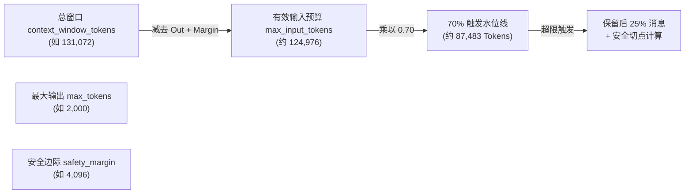
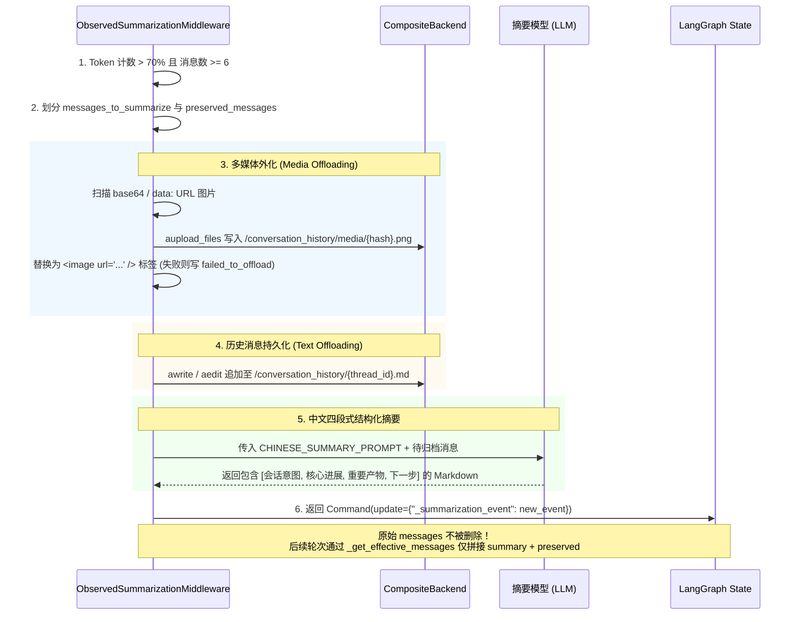
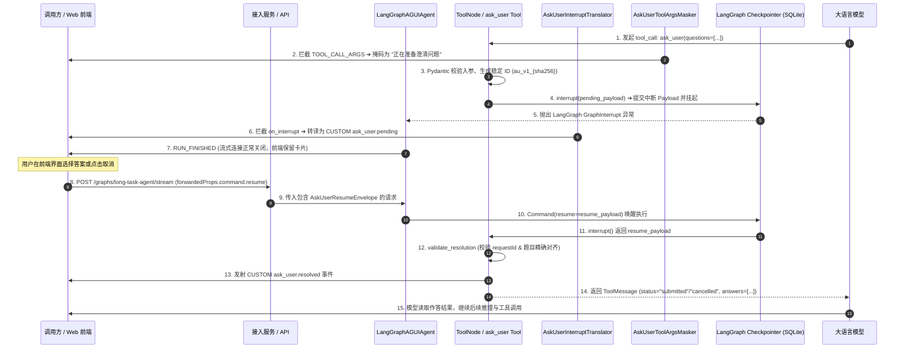

# 上下文治理、过程性知识、HITL 与业务链路引擎

> **本章定位**：作为平台连接长会话持久化、动态知识装载、人机协同与垂直业务计算的关键支撑面，本章深入剖析 `langAgent` 的上下文治理与业务执行体系。系统阐述五维存储与上下文生命周期、长期记忆虚拟路由与身份降级、深度上下文自动压缩与可观测性、技能包签名校验与渐进式激活、Ask User 强类型中断恢复契约，以及以 ChatBI 智能体化升级、DataEnvelope 数据流转、Visualization 双通道分发、A2UI 生成式 UI 与 Report/RAG 为代表的完整业务执行链路。
>
> **代码与事实基线**：
> - 运行与版本基线：`develop` Reference Worktree (`.scratch/langagent-develop-reference`)
> - 核心依赖锁定：`deepagents 0.6.12`、`langgraph 1.2.8`、`ag-ui-protocol 0.1.19`、`ag-ui-langgraph 0.0.42`、`copilotkit 0.1.94`
> - ChatBI 参考分支：`langagent-chatbi-agent-loop-reference` (独立参考代码实现，非 develop 运行基线，无配套单测)
> - A2UI 原型基线：只读工作树 `/Users/sunxichen/Projects/langAgent` (`prototype_verified` + `confirmed`，PoC 基础能力验证，未合入 develop)
> - 白板复现代码：[context_hitl_business.py](../recap-code/core/context_hitl_business.py)

---

## 1. 五维存储与上下文实体全景

在复杂长任务与多轮人机协同体系中，“上下文”不是一个单一的内存列表，而是由生命周期、隔离作用域、持久化载体和读写契约截然不同的五类实体构成的多层存储网状结构。混淆这些实体的边界会导致状态污染、内存泄漏甚至跨会话数据泄露。

```
┌──────────────────────────────────────────────────────────────────────────────────────────────────┐
│                                  五维上下文与存储实体生命周期全景                                   │
│                                                                                                  │
│  [ 客户端 / 网关请求 ] (thread_id, user_id, agent_id)                                            │
│            │                                                                                     │
│            ▼                                                                                     │
│  ┌────────────────────────────────────────────────────────────────────────────────────────────┐  │
│  │ 1. 对话历史 (Messages)               │ 2. LangGraph Checkpoint                              │  │
│  │ • 载体: MainAgentState / 内存列表    │ • 载体: SQLite (checkpoints.db) / AsyncSqliteSaver   │  │
│  │ • 作用域: 单会话 Thread              │ • 作用域: {"thread_id": ..., "checkpoint_ns": ...}   │  │
│  │ • 职责: 当前轮次模型推理的即时上下文  │ • 职责: 跨请求恢复、中断挂起点还原、两阶段回滚        │  │
│  │ • 治理: 压缩切片后动态投影生效       │ • 机制: 全量消息追加保留，不物理删改历史              │  │
│  └──────────────────────────────────────┴─────────────────────────────────────────────────────┘  │
│            │                                                                                     │
│            ▼                                                                                     │
│  ┌────────────────────────────────────────────────────────────────────────────────────────────┐  │
│  │ 3. 长期记忆体系 (Long-term Memory)                                                         │  │
│  │ • USER_GLOBAL: 跨 Agent 用户偏好 (/shared/preferences.md -> app_id=0)                      │  │
│  │ • USER_AGENT: 用户在当前 Agent 下的偏好 (/memories/preferences.md -> app_id=agent_id)      │  │
│  │ • 载体: Java 外部后端数据库 (agent_memory 单表)                                            │  │
│  │ • 职责: 跨会话沉淀习惯与指令偏好，Prompt 自动注入与模型行号级动态编辑                      │  │
│  └────────────────────────────────────────────────────────────────────────────────────────────┘  │
│            │                                                                                     │
│            ▼                                                                                     │
│  ┌────────────────────────────────────────────────────────────────────────────────────────────┐  │
│  │ 4. 压缩归档摘要 (Compaction Summary) │ 5. Workspace 沙箱文件系统                             │  │
│  │ • 载体: /conversation_history/{id}.md│ • 载体: Daytona Linux 容器 (/workspace/...)          │  │
│  │ • 作用域: 单会话 Thread              │ • 作用域: workspace_id 容器生命周期                  │  │
│  │ • 职责: 溢出历史文本与图片持久化外化  │ • 职责: 真实代码执行、技能运行、中间计算数据存储      │  │
│  │ • 机制: CompositeBackend 虚拟路由     │ • 治理: 租约续期、目录增量同步、Artifact 外化回灌     │  │
│  └──────────────────────────────────────┴─────────────────────────────────────────────────────┘  │
└──────────────────────────────────────────────────────────────────────────────────────────────────┘
```

### 1.1 五维实体特征与职责对比

| 维度 | 1. 对话消息 (Messages) | 2. LangGraph Checkpoint | 3. 长期记忆 (USER_GLOBAL / USER_AGENT) | 4. 压缩归档摘要 (History Offload) | 5. Workspace 沙箱文件 |
|---|---|---|---|---|---|
| **物理载体 / 存储位置** | LangGraph State `messages` 列表（内存 / Checkpointer） | SQLite (`checkpoints.db` / `AsyncSqliteSaver`) | Java 外部后端数据库（通过 HTTP 虚拟文件 `preferences.md` 交互） | Java 外部后端 / 对象存储（通过虚拟路径 `/conversation_history/` 交互） | Daytona 沙箱容器内 Linux 文件系统 (`/workspace/...`) |
| **生命周期 (Lifetime)** | 单个会话 Thread（受压缩裁剪与切片影响） | 跨请求、跨进程持久存在，直到会话被清理 | 用户级别持久化，跨会话共享（Global 跨所有 Agent，Agent 绑定特定应用） | 绑定单个会话 Thread，随压缩过程持续追加 | 绑定至 Daytona Workspace 容器生命周期（Claim -> Reclaim -> Destroy） |
| **隔离命名空间 (Namespace)** | `thread_id` + `checkpoint_ns` (区分主图与子代理) | `{"configurable": {"thread_id": ..., "checkpoint_ns": ...}}` | `scope_type="USER_GLOBAL"`, `user_id`, `app_id=0`<br>`scope_type="USER_AGENT"`, `user_id`, `app_id=int(agent_id)` | `/conversation_history/{thread_id}.md`<br>`/conversation_history/media/{hash}.png` | `workspace_id`（通常单沙箱与单 `thread_id` 绑定） |
| **读取路径 (Readers)** | LLM Agent Loop（由 SummarizationMiddleware 过滤为 Effective Messages） | LangGraph 运行时（`aget_state`、恢复中断、会话重入） | `JavaMemoryBackend` -> `MemoryMiddleware.abefore_agent` -> 注入 System Prompt (`<agent_memory>`) | 仅当模型显式调用 `read_file` 查看 `/conversation_history/{thread_id}.md` 时读取 | 沙箱文件工具 (`read_file`, `list_files`, `glob`, `grep`, `execute`)、`ArtifactService` |
| **写入路径 (Writers)** | 用户输入、模型 `AIMessage`、工具 `ToolMessage`（经 `add_messages` Reducer 追加） | LangGraph Pregel 引擎在每个 Superstep 节点执行完毕后写入 | Agent 调用 `write_file` / `edit_file` on `/shared/preferences.md` 或 `/memories/preferences.md` -> HTTP PUT | 上下文压缩中间件触发时自动追加写入文本与图片 | Agent 沙箱工具 (`write_file`, `edit_file`, bash `execute`)、`SkillImportService`、`SandboxFileImportService` |
| **上下文替换 / 压缩行为** | 触发压缩时，旧消息被摘要为一条带 `lc_source="summarization"` 的 HumanMessage，原始历史保留在 Checkpoint | Checkpoint 不物理删除历史消息，由 `_summarization_event` 记录 `cutoff_index` | 不受上下文压缩影响；内容变更直接写回 Java 后端，后续 run 加载最新版本 | 存储在外部持久化介质，不占用活动上下文窗口 | 存储在沙箱磁盘；重要产物通过 `export_artifacts` / `ArtifactService` 提取外化到对象存储 |

---

## 2. 长期记忆体系：虚拟文件路由与身份降级

### 2.1 架构演进与设计收敛 (`DELTA-MEM-001`)

在早期设计方案中，长期记忆曾规划了包含组织级（`/policies/company.md`）、Agent 级（`/agents/AGENTS.md`）、用户全局级（`/shared/preferences.md`）和用户×Agent 级（`/memories/preferences.md`）的四层架构，并设计了 4 张独立物理表。

在实际落地与团队评审中，我们对记忆范围进行了大幅收敛（收敛为 `USER_GLOBAL` 与 `USER_AGENT` 两层）：
1. **组织级记忆**：企业内部政策更新具有强管控属性，集体沉淀容易引入非预期噪音，且存在跨用户敏感信息泄露风险。
2. **Agent 级记忆**：单个 Agent 实例同时服务于多个用户，若共享 Agent 级偏好，极易发生不同用户之间的敏感上下文串扰。
3. **最终方案**：收敛为纯粹以“用户为中心”的两层偏好沉淀，后端存储统一为单张 `agent_memory` 表（联合唯一索引 `uk_agent_memory_scope`），既保证了隔离安全，又极大简化了存储治理。

### 2.2 身份归一化与防御性降级 (`memory_context.py`)

为了防止前端传参不合规导致整个长任务中断，我们在 Agent 构建前通过 `build_memory_context` 对身份凭证执行严格校验与降级：

```
                           build_memory_context 决策树
                                ┌──────────────┐
                                │ user_id 有效? │
                                └──────┬───────┘
                        No ┌───────────┴───────────┐ Yes
                           ▼                       ▼
                  【完全关闭长期记忆】      ┌──────────────────┐
                  enabled_global=False   │ agent_id 有效且为 │
                  enabled_agent=False    │   合规正整数?    │
                                         └─────────┬────────┘
                                   No ┌────────────┴────────────┐ Yes
                                      ▼                         ▼
                             【仅开启全局记忆】           【开启全局与应用记忆】
                             enabled_global=True         enabled_global=True
                             enabled_agent=False         enabled_agent=True
                             app_id=None                 app_id=int(agent_id)
```

1. **用户缺失**：`user_id` 为空时，返回 `enabled_global=False, enabled_agent=False`，完全关闭长期记忆读写。
2. **默认 Agent**：`agent_id` 为空或等于 `DEFAULT_LONG_TASK_AGENT_ID ("long-task-default")` 时，开启全局记忆，关闭 Agent 级记忆（`app_id=None`）。
3. **格式非法或溢出**：若 `agent_id` 包含非数字字符（如 `"agent-123"`）或数值超出 Java `Long.MAX_VALUE`（`9_223_372_036_854_775_807`），记录 Warning 日志并降级为仅开启全局记忆，保障主任务正常运行。

### 2.3 虚拟文件路由与 `JavaMemoryBackend` 机制

系统将长期记忆抽象为虚拟 Markdown 文件，通过 `deepagents` 的 `CompositeBackend` 实现路径前缀剥离与分发：
- `/shared/preferences.md` $\to$ 路由至 `JavaUserGlobalMemoryBackend(user_id, scope_type="USER_GLOBAL", app_id=0)`
- `/memories/preferences.md` $\to$ 路由至 `JavaUserAgentMemoryBackend(user_id, scope_type="USER_AGENT", app_id=app_id)`

#### 关键技术控制点与失败边界：
1. **严格路径白名单**：`_normalize_path` 校验剥离路由前缀后的文件名必须精确等于 `preferences.md`。任何越权读取（如 `read("../etc/passwd")` 或 `read("other.md")`）均抛出 `ValueError("长期记忆只允许访问 preferences.md")`。
2. **读失败防御性降级**：调用后端 `batch_get_memory_files` 时：
   - 遭遇 **HTTP 404**、**HTTP 5xx**、**Java 业务码 500** 或底层 **`httpx.HTTPError`** 时，记录 Warning 并降级返回空记忆对象 `MemoryFileVO(content="", version=0)`，不中断长任务。
   - 仅当遭遇 **HTTP 401 / 403** 鉴权异常时向上抛出。
3. **乐观并发控制与重试**：更新记忆时传递 `expected_version`。当遭遇并发修改导致 **HTTP 409 Conflict** 时，中间件支持最大重试 1 次（`_MAX_EDIT_RETRIES = 1`）：重新拉取最新版本内容并再次应用字符串替换。
4. **POSIX 行号格式化**：`read` 与 `aread` 采用 `_format_cat_n`（右对齐 6 位行号 + Tab，即 `f"{line_number:>6}\t{line}"`），与标准 `cat -n` 格式完全对齐，模型可据此使用 `edit_file` 精准定位并修改行内容。

---

## 3. 上下文自动压缩与可观测性 (Context Compaction)

在长时间运行的代码执行与多轮调试任务中，上下文窗口极易被庞大的工具调用输出、报错堆栈和多媒体数据填满。平台构建了深度上下文自动压缩引擎，保证 Agent 在超长执行中不丢失关键目标与产物信息。

### 3.1 动态输入预算推导与参数覆盖



1. **预算动态推导**：
   $$\text{max\_input\_tokens} = \text{context\_window\_tokens} - \text{max\_tokens} - \text{safety\_margin\_tokens}$$
2. **触发与保留阈值覆盖**：
   - `deepagents 0.6.12` 原生默认采用 85% 触发、保留 10% 历史。
   - 项目在 `chinese_deep_agent.py` 中通过 Monkey Patch 将默认值覆盖为 **70% 触发**（`context_compaction_trigger_fraction = 0.7`）、**保留后 25% 消息**（`context_compaction_keep_fraction = 0.25`）。
3. **前置消息数防抖**：`_should_summarize` 增加硬性约束：有效消息数必须 $\ge 6$ 条（`context_compaction_min_messages = 6`），防止在首轮对话中因单条超长输入误触发压缩。
4. **ToolCall 完整性保护 (`_find_safe_cutoff`)**：在计算切分点时，若目标索引恰好处于 `AIMessage(tool_calls=[...])` 与后续 `ToolMessage` 之间，切分算法自动向前推进，确保 ToolCall 与 ToolMessage 成对保留，防止破坏大模型推理消息协议。

### 3.2 历史多媒体外化与四段式结构化摘要

当压缩触发时，`ObservedDeepAgentsSummarizationMiddleware` 按照严格的流水线执行历史归档与摘要：



### 3.3 状态更新与动态消息投影原理

在 LangGraph 中，状态中的 `messages` 列表**永远保留全量历史**（保证 Checkpoint 审计与回放的完整性）。
- **私有事件标记**：中间件通过 `Command(update={"_summarization_event": {"cutoff_index": state_cutoff_index, "summary_message": HumanMessage(content=..., additional_kwargs={"lc_source": "summarization"}), "file_path": file_path}})` 记录最新切点与摘要。
- **动态有效投影 (`_get_effective_messages`)**：在后续每一轮模型推理前，中间件并不读取全量 `messages`，而是动态构造投影视图：
  $$\text{effective\_messages} = [\text{summary\_message}, *\text{messages}[\text{cutoff\_index}:]]$$
  从而在不破坏状态的前提下将活动上下文精确控制在安全水位内。

### 3.4 压缩异常与可观测事件差异 (`DELTA-CMP-001`)

在压缩流程中，各类异常被精细化分层处理：
- **历史外化失败 (Offload Failure)**：写入 `/conversation_history/` 遭遇 I/O 错误时，仅记录 Warning 日志并标记 `file_path=None`，不中断摘要生成。
- **多媒体转存失败**：单张图片上传失败时替换为 `<image error="failed_to_offload" />`，保证流程继续。
- **摘要 LLM 调用失败**：若生成摘要的模型调用异常，中间件记录异常并**重新抛出 (`raise`)**，交由外层错误处理机制接管。
- **事件可观测性演进差异**：
  - **设计规划 (`DESIGN-CMP-001`)**：设计方案曾规划了 `compaction_started`、`compaction_finished`、`compaction_failed`、`usage_updated` 4 个独立的 CUSTOM 事件。
  - **当前实现基线 (`FACT-CMP-006`)**：团队在最终落地时，前三者仅在服务端记录结构化日志（含耗时与 Trigger 原因），实际向前端和网关发射的 CUSTOM 事件收敛为单一的 **`context.usage_updated`**（携带 `approximate=True`, `context_ratio`, `compacted=True/False`）。事件发送异常被 `try...except` 捕获，不影响模型调用结果。

---

## 4. 技能系统 (Skill System)：规范、签名与渐进激活

技能（Skill）是封装在特定目录下的过程性知识（SOP、专用脚本、参考代码和依赖描述），帮助 Agent 在无需微调模型的前提下获得垂直领域专业能力。

```
┌──────────────────────────────────────────────────────────────────────────────────────────────────┐
│                                    Skill 导入、缓存与激活全流程                                     │
│                                                                                                  │
│  [ 请求参数 ] skill_configs: [{id, name, description, url, ...}]                                 │
│       │                                                                                          │
│       ▼                                                                                          │
│  ┌────────────────────────────────────────────────────────────────────────────────────────────┐  │
│  │ 1. 资源身份规范化与签名计算 (Skill Signature & Cache)                                       │  │
│  │    • _canonical_resource_identity(url): 剔除 x-oss-*, expires 等临时鉴权参数                  │  │
│  │    • SHA-256(layout-v3 + configs + sorted(id|canonical_url)): 计算唯一技能指纹              │  │
│  │    • 沙箱 Manifest 比对: 比对 .langagent_manifest.json 签名，一致则跳过下载                  │  │
│  └─────────────────────────────────────────────┬──────────────────────────────────────────────┘  │
│                                                │                                                 │
│                                                ▼ (缓存未命中)                                    │
│  ┌────────────────────────────────────────────────────────────────────────────────────────────┐  │
│  │ 2. 下载、Zip Slip 防御与原子切换 (Import & Sandboxing)                                       │  │
│  │    • 单包上限 50MB (MAX_SKILL_ZIP_SIZE_BYTES)，校验单个 SKILL.md 存在与 UTF-8 编码          │  │
│  │    • Zip Slip 路径穿越防御 (拒绝绝对路径与 ".." 分量)                                         │  │
│  │    • Staging 原子切换: /workspace/agent_skills.__staging__ ➔ 重命名替换，失败自动回滚 __backup__ │  │
│  │    • 隔离落盘: /workspace/agent_skills/{skill_id}/{skill_dir}/ (新协议按业务 ID 物理隔离)    │  │
│  └─────────────────────────────────────────────┬──────────────────────────────────────────────┘  │
│                                                │                                                 │
│                                                ▼                                                 │
│  ┌────────────────────────────────────────────────────────────────────────────────────────────┐  │
│  │ 3. 显式选技与渐进式激活观测 (initially_activated_ids vs SkillActivationMiddleware)          │  │
│  │                                                                                            │  │
│  │  【显式选技 (initially_activated_ids)】             【自主读取 (SkillActivationMiddleware)】 │  │
│  │  • 来源: 请求显式指定 selected_skill_id             • 触发: 模型执行 read_file(SKILL.md) 成功│  │
│  │  • 行为: 预置激活状态，置顶注入系统提示词           • 行为: 发射 skill_activation Activity   │  │
│  │  • 特征: 强制执行，无需模型主动探索                 • 去重: run 级 _activated_skill_ids 内存去重│  │
│  └────────────────────────────────────────────────────────────────────────────────────────────┘  │
└──────────────────────────────────────────────────────────────────────────────────────────────────┘
```

### 4.1 协议演进：新旧双协议兼容与目录隔离 (`DELTA-SKL-001` / `ORAL-T08-SKL-001`)

- **早期旧协议 (`skill_oss_urls`)**：仅支持 OSS 签名 URL 字符串列表，沙箱中平铺解压。在实际运行中，不同压缩包内若存在同名文件或目录会发生覆盖混淆，且无法根据后台配置稳定定位技能。
- **当前新协议 (`skill_configs`)**：引入结构化 `LongTaskSkillConfig`（包含 `id`, `name`, `description`, `url`, `dataset_ids`），在沙箱中严格按业务 ID 分离落盘（`/workspace/agent_skills/{skill_id}/{skill_dir}/`），并由系统自动生成 `.langagent_manifest.json`。
- **显式选技支持**：当用户在前端显式指定 `selected_skill_id` 时，`factory.py` 会将该技能的 Prompt 置顶并注入强制执行指令，同时将该技能 ID 预填入 `initially_activated_ids` 集合，避免重复触发自动发现事件。

### 4.2 资源身份签名与沙箱 Manifest 缓存

为了解决 OSS/S3 签名 URL 因有效期参数（`Expires`, `Signature`, `x-oss-*`）不断变化导致重复下载的问题，系统设计了 URL 规范化清洗：
1. `_canonical_resource_identity(url)`：剥离所有临时签名 Query 参数，仅保留 Scheme、Host、Path 与稳定业务 Query。
2. `compute_skill_signature`：对排序后的 `f"{skill.id}|{canonical_url}"` 计算 SHA-256。
3. **Manifest 缓存判定**：若 `workspace_id` 与 `signature` 均未变更，直接从沙箱读取 `.langagent_manifest.json` 复用已有技能包，避免重复网络 I/O。

### 4.3 安全校验与原子 Staging 切换

1. **体积与编码约束**：单 ZIP 上限 **50MB**（`MAX_SKILL_ZIP_SIZE_BYTES`），每个技能包必须包含且仅包含一个 UTF-8 编码的 `SKILL.md`。
2. **Zip Slip 路径遍历防御**：在解压前遍历所有压缩分量，拒绝绝对路径及包含 `..` 的非法相对路径，自动过滤 `__MACOSX` 噪音目录。
3. **Staging 原子切换与回滚**：解压至 `__staging__` 临时目录，通过 Shell 脚本执行目录重命名替换 `/workspace/agent_skills`；若替换失败则自动从 `__backup__` 恢复，保证沙箱文件系统的确定性。

### 4.4 原生 `SkillsMiddleware` 与自研 `SkillActivationMiddleware` 的协同

系统清晰解耦了“渐进式元数据注入”与“执行中激活观测”：
- **DeepAgents 0.6.12 原生 `SkillsMiddleware`**：在 Agent 启动时扫描沙箱内所有 `SKILL.md` 的 YAML frontmatter，将轻量名称与描述注入系统提示词（每项仅消耗几十 Tokens）。
- **自研 `SkillActivationMiddleware`**：作为只读拦截器挂载在 `awrap_tool_call` 上。当模型自主调用 `read_file(file_path="/workspace/.../SKILL.md")` 且工具成功返回时，中间件识别到技能真正被加载，向 AG-UI 事件流发射 `skill_activation` Activity 事件。
- **去重与幂等保证**：中间件实例按 run 创建，内存中维护 `_activated_skill_ids` 集合；在多工具并行调用场景下，**先向集合写入 ID 再发起异步事件派发**，确保同一技能在单次 run 中仅激活并通知一次。事件派发异常被捕获记录 Warning，绝不篡改工具的正常执行结果。

---

## 5. Human-in-the-loop (Ask User) 中断恢复引擎

在长任务执行中，当大模型遇到关键意图歧义或缺失必要业务参数时，需要暂停执行向用户发起精准提问，并在用户作答后无缝恢复执行上下文。



### 5.1 强类型契约与敏感词初筛 (`contracts.py`)

1. **问题结构约束 (`AskUserQuestion`)**：
   - 题量限制：单次提问必须包含 **1 至 4 道独立问题**。
   - 选项限制：每题提供 **2 至 4 个选项**（`min_length=2, max_length=4`），单选项长度上限 160 字符，同一题内选项不能重复。
   - **敏感词初筛**：`reject_sensitive_text` 扫描问题与上下文，严禁收集 `password`, `token`, `secret`, `验证码`, `密码`, `密钥`, `银行卡`, `身份证` 等敏感凭证。
2. **作答与恢复信封 (`AskUserResolution` / `AskUserResumeEnvelope`)**：
   - 状态互斥：支持 `"submitted"`（必须附带 `answers`）与 `"cancelled"`（严禁包含 `answers`）。
   - 单行答案约束：用户填写的 `text` 限制为 1 至 500 字符的单行文本（拒绝换行符注入）。
3. **顶层专有绑定**：在 `factory.py` 中，`ask_user` 工具仅绑定给顶层 Long Task Agent，子代理（SubAgents）在工具过滤中被显式剥离：`subagent_tools = [tool for tool in custom_tools if tool.name != "ask_user"]`，杜绝子代理绕过主流程直接中断用户。

### 5.2 确定性 Request ID 关联与防串扰

为了在无状态集群和异步重放中实现确定性关联，系统通过稳定哈希推导 `stable_request_id`：
$$\text{request\_id} = \text{"au\_v1\_"} + \text{SHA256}(\text{"v1\x1f"} + \text{thread\_id} + \text{"\x1f"} + \text{run\_id} + \text{"\x1f"} + \text{tool\_call\_id})[:32]$$
- **恢复校验 (`validate_resolution`)**：当收到恢复请求时，利用恒定时间比较函数 `secrets.compare_digest(parsed.request_id, expected_request_id)` 校验 Request ID，并检查回传的 `answers` 列表与 Checkpoint 中挂起的 `questions` 是否按原顺序严格一一对应，彻底防止参数串扰。

### 5.3 协议转译、参数掩码与非 Happy Path 边界

1. **流式参数安全掩码 (`AskUserToolArgsMasker`)**：在 SSE 协议层拦截大模型输出的 `TOOL_CALL_ARGS` delta，替换为统一提示 `"正在准备澄清问题"`，避免未校验的提问 JSON 碎片直接暴露在前端界面。
2. **中断事件转译 (`AskUserInterruptTranslator`)**：LangGraph 在执行 `interrupt()` 时会产生框架级 `on_interrupt` 事件。中间件拦截该事件并包装为标准的 AG-UI CUSTOM 事件 `ask_user.pending`，使前端能按统一卡片协议渲染。
3. **非 Happy Path 异常处理**：
   - **快照缺失或状态已推进**：若外部在无 pending 中断或已恢复的会话上重复发起 Resume，LangGraph Checkpointer 检测到状态不匹配抛出异常，接入网关拦截并返回错误响应。
   - **参数格式非法**：回传的 JSON 不符合 `AskUserResumeEnvelope` 规范（如缺少 `requestId` 或 `resolution` 结构损坏），Pydantic 校验抛出 `ValidationError`。
   - **Request ID 不匹配或题目顺序错位**：`validate_resolution` 抛出 `ValueError`，中断恢复失败。
   - **用户主动取消**：当用户点击取消时，恢复信封置 `status="cancelled"`。系统提示词预先指导模型：“当收到 cancelled 状态时，必须使用安全合理的默认假设继续推进任务，不得反复发起相同提问”。
4. **设计态与实现态边界澄清 (`DELTA-ASK-001` / `ORAL-T08-ASK-001`)**：
   - **设计规划**：早期架构方案曾规划在 Phase 3+ 引入独立的 `AskUserRequest` 数据库表与分布式 CAS 状态机，用于跨实例拦截 409 `ASK_USER_ALREADY_RESOLVED` 冲突并封装网关级 503 错误。
   - **当前实现**：目前主线完全基于 LangGraph Checkpoint 的原生状态机进行挂起与恢复；若前端重复提交 Resume，依赖 Checkpointer 状态已推进的底层异常进行拦截，未在业务层维护独立数据库状态机。

---

## 6. ChatBI 智能体化升级：固定 DAG vs Agent Loop 对照

ChatBI 是将自然语言问题转换为企业 SQL 并执行取数的核心业务子图。系统在演进过程中经历了从硬编码流水线到自主 ReAct 智能体循环的重大升级。

### 6.1 升级前后架构深度对照

```
┌──────────────────────────────────────────────────────────────────────────────────────────────────┐
│                                   ChatBI 两代架构执行模型对比                                       │
│                                                                                                  │
│  【第一代：develop 主线固定 6 节点 DAG 流水线】 (5 节点 Happy Path + 单次被动纠错)               │
│                                                                                                  │
│   START ──► entry ──► query_rewrite ──► sql_generation ──► sql_self_check ──┬──► exit ──► END    │
│                                                                   │         ▲                    │
│                                                       (报错纠错)   └──► error_correction ──┘      │
│                                                                                                  │
│   • 缺陷: 全量 Schema 暴力灌入；单次生成+单次纠错无法处理复杂逻辑；无法探测列值实际分布          │
│                                                                                                  │
│ ──────────────────────────────────────────────────────────────────────────────────────────────── │
│                                                                                                  │
│  【第二代：参考分支 Agent Loop 三段式自主循环】 (.scratch/langagent-chatbi-agent-loop-reference)  │
│                                                                                                  │
│   START ──► prepare_context ──► agent_reasoning ◄──────► tool_execution ──► finalize ──► END    │
│                                      │                                         ▲                 │
│                                      └── (终止信号: submit_final_sql) ──────────┘                 │
│                                                                                                  │
│   • 工具集 (4 个闭包工具): probe_column_values (列值探测) | execute_sql (试执行与缓存)            │
│                         submit_final_sql (终止提交)   | submit_clarification (歧义结构化上报)    │
│   • 治理: 关闭子图内部事件冒泡；绕过 ainvoke 直接调用底层函数；迭代超限 Fallback (confidence: low)│
└──────────────────────────────────────────────────────────────────────────────────────────────────┘
```

### 6.2 演进决策与关键架构取舍 (`DELTA-BI-001` / `DELTA-BI-002`)

1. **否定动态选表工具 (`DELTA-BI-001`)**：在早期重构方案中，曾提议引入 `get_table_schema` 动态选表工具。但在业务场景分析中发现，单个业务技能（`app_info_id`）通常仅关联 3～4 张表或 1 张宽表，全量 M-Schema 仅占用 2000～4000 Tokens。因此在 `prepare_context` 阶段直接全量内联 M-Schema，避免多一轮工具调用的网络与模型往返时延。
2. **列值探测与试执行闭环**：Agent Loop 引入 `probe_column_values` 工具，支持模型在生成 SQL 前先探测列中的真实枚举值（如将用户输入的“杭州”自动校准为数据库实际存储的“杭州市”），并通过 `execute_sql` 执行预检。
3. **子图事件抑制与 AG-UI 适配器防崩机制**：
   - **事件抑制**：ChatBI 在主 Agent 看来是一个单一工具（`chatbi_text2sql`）。为了防止子图内部的多轮推理步骤泄露到前端，在 LLM 调用配置中注入 `metadata={"copilotkit:emit-messages": False, "copilotkit:emit-tool-calls": False}`。
   - **底层函数直接调用**：在 `tool_execution_node` 中，**有意绕过 `BaseTool.ainvoke`，直接调用底层 `@tool` 装饰的原生 coroutine/func**。因为 `ainvoke` 会触发 LangChain 的 `on_tool_end` 事件冒泡至外层主图，AG-UI 适配器接收到内部工具返回的纯字符串后，会尝试访问 `.tool_call_id` 属性，从而引发 `'str' object has no attribute 'tool_call_id'` 崩溃。
4. **终止信号与缓存复用**：当模型调用 `submit_final_sql` 终止循环时，节点会追加一条合成的 `ToolMessage` 保持消息链完整；`finalize_node` 会优先复用 `execute_sql` 缓存的查询结果构建 `DataEnvelope`，避免重复执行 SQL。
5. **成熟度与范围说明 (`ORAL-T08-CBI-001/002`)**：Agent Loop 目前在独立参考分支中完整编写，尚未合入 `develop` 主线，且无配套自动化单元测试；主线当前运行基线仍为固定 6 节点 DAG。

---

## 7. 代表业务链路：ChatBI、DataEnvelope、Visualization 与 A2UI

在实际数据分析与交互场景中，多个垂直能力协同构成了一条端到端的高效数据处理流水线。

```
┌──────────────────────────────────────────────────────────────────────────────────────────────────┐
│                                   端到端代表业务链路流转拓扑                                        │
│                                                                                                  │
│  [ 用户输入: "分析上月各门店咖啡销量并画图" ]                                                      │
│        │                                                                                         │
│        ▼                                                                                         │
│  ┌────────────────────────┐                                                                      │
│  │ Main Agent (ReAct)     │ ── (调用 chatbi_text2sql 工具)                                        │
│  └───────────┬────────────┘                                                                      │
│              │                                                                                   │
│              ▼                                                                                   │
│  ┌────────────────────────┐                                                                      │
│  │ ChatBI 子图            │ ──► 生成 SQL ➔ 执行查询 ➔ 组装 DataEnvelope ➔ 持久化至 DB (envelope_id)│
│  └───────────┬────────────┘                                                                      │
│              │                                                                                   │
│              ▼ (返回带 envelope_id 与前 5 行预览的 ToolMessage，防止撑爆上下文)                  │
│  ┌────────────────────────┐                                                                      │
│  │ Main Agent (ReAct)     │ ── (自动决策调用 visualize(envelope_id=...) 工具)                     │
│  └───────────┬────────────┘                                                                      │
│              │                                                                                   │
│              ▼                                                                                   │
│  ┌────────────────────────┐                                                                      │
│  │ Visualization 子图     │ ──► 拉取信封 ➔ 生成 AntV G2 Spec ➔ 校验 (scale/encode 覆盖) ➔ 2次重试 │
│  └───────────┬────────────┘                                                                      │
│              │                                                                                   │
│              ├───────────────────────────────────────────────┐                                   │
│              ▼                                               ▼                                   │
│    【带外 Activity 通道】 (前端渲染)                【带内 ToolMessage 通道】 (主 Agent 上下文)  │
│    copilotkit_emit_activity                        ToolMessage(content="已成功生成图表...")       │
│    • activity_type: "antv_chart"                   • 轻量回执，不将巨大 Spec JSON 写入模型上下文  │
│    • dataset_strategy: inline_complete / client_fetch                                            │
│    • spec: AntV G2 配置 JSON                                                                     │
└──────────────────────────────────────────────────────────────────────────────────────────────────┘
```

### 7.1 DataEnvelope 协议与行数控制行为 (GAP-27 审计)

`DataEnvelope` 是跨子图、跨服务与前后端流转的标准化数据信封（包含 `row_count`, `column_metadata`, `sample_rows`, `full_data`, `query_sql`, `page_size`, `data_complete` 等）。

系统在数据链路中对对话历史与信封完整性进行了分层治理：
1. **ToolMessage 对话预览截断（`PREVIEW_THRESHOLD = 20`）**：
   - 作用于 `ToolMessage` 返回给主 Agent 的内容。若查询结果超过 20 行，仅展示前 5 行预览并标记 `is_truncated = True`，提示模型数据已保存至信封，防止海量行数据撑爆主模型上下文。
2. **DataEnvelope 完整性与分页分流（当前实现按 20 行边界生效）**：
   - 作用于信封持久化与分发。
   - **代码审计与 GAP-27 事实记录**：在 `develop` 主线的 `exit_node.py` 顶部虽然声明了常量 `DETAIL_QUERY_THRESHOLD = 200`，但在 `_build_data_envelope_from_sql_response` 函数内部，实际依据 `MAX_RETURN_ROWS = 20`（`is_detail = row_count > MAX_RETURN_ROWS`）进行判断，`DETAIL_QUERY_THRESHOLD` 未在函数中使用。
   - **当前运行行为**：当查询结果超过 20 行时，`data_complete = False`，`full_data` 仅保留前 20 条预览，并提供明文 `query_sql` 与 `page_size` 指示下游分页拉取；不超过 20 行时，`data_complete = True` 且 `full_data` 内联完整数据。

### 7.2 Visualization 子图：Spec 生成、校验与双通道分发

- **节点流转**：`START ──► fetch_envelope ──► extract_visualization_request ──► parse_envelope ──► generate_chart_spec ──► validate_spec ──► [should_retry]? ──► build_output ──► emit_visualization_tool_message ──► END`。
- **严格 Spec 校验与重试**：`validate_spec` 提取 AntV G2 JSON，校验顶层字段（`chart_type`, `title`, `spec`），并强制要求 `spec.scale` 必须完整覆盖 `spec.encode` 中引用的所有物理列字段。校验失败触发提示词回填重试（最多重试 2 次）。
- **双通道分发机制**：
  - **带外通道 (Out-of-band Activity)**：通过 `copilotkit_emit_activity` 发送 `activity_type="antv_chart"`，携带 `spec`、图表数据和数据集策略字段（`dataset_strategy: inline_complete / client_fetch / none`，直接读取 `envelope.data_complete`）。
  - **带内通道 (In-band ToolMessage)**：仅向主 Agent 回传简短确认文本（`"已成功生成 AntV 可视化图表。"`），避免几千行的图表 Spec JSON 污染对话历史。

### 7.3 A2UI 生成式 UI 原型 (`prototype_verified` + `confirmed`)

A2UI（Agent-to-UI）是平台面向政务与企业服务场景探索的生成式 UI 交互机制。

```
┌──────────────────────────────────────────────────────────────────────────────────────────────────┐
│                                     A2UI 子图分批生成与交互回流                                      │
│                                                                                                  │
│  [ 主 Agent 决策: render_a2ui(data, intent) ]                                                     │
│        │                                                                                         │
│        ▼                                                                                         │
│  ┌────────────────────────────────────────────────────────────────────────────────────────────┐  │
│  │ A2UI Subgraph (分批生成与 Basic Catalog 校验)                                               │  │
│  │ • emit_create_surface: 生成 surface_id，发射 beginRendering 初始状态                        │  │
│  │ • plan_batches: 结构化规划批次 (如 header 标题区 + content 列表区)                         │  │
│  │ • process_batches: 调用 LLM 生成 Basic Catalog UI JSON (Text, Card, Image, Button 等)       │  │
│  │ • 校验与重试: 校验组件层级与 action 契约 (失败最多重试 2 次)                                 │  │
│  │ • 事件发射: copilotkit_emit_activity (activity_type="a2ui_surface", surfaceUpdate)         │  │
│  └────────────────────────────────────────────────────────────────────────────────────────────┘  │
│        │                                                                                         │
│        ▼                                                                                         │
│  ┌────────────────────────────────────────────────────────────────────────────────────────────┐  │
│  │ 前端交互回流 (Two Interaction Modes)                                                       │  │
│  │                                                                                            │  │
│  │  【普通组件点击交互】 (如 select_shop)             【关键不可逆操作 HITL】 (如 createOrder)   │  │
│  │  • 机制: 前端包装为结构化 JSON 消息发送至聊天流    • 机制: 主图触发 interrupt 挂起            │  │
│  │  • 处理: 主 Agent 作为新对话轮次触发下一轮推理     • 确认: 前端弹窗确认后通过 Command(resume) 唤醒│  │
│  └────────────────────────────────────────────────────────────────────────────────────────────┘  │
└──────────────────────────────────────────────────────────────────────────────────────────────────┘
```

1. **分批生成与 Basic Catalog 约束**：子图通过 `plan_batches` 将 UI 拆解为多批次，LLM 严格使用 Google 官方 Basic Catalog 基础组件（`Text`, `Card`, `Image`, `Button`, `Row`, `Column`, `List`, `Badge` 等）自由组合，不依赖任何定制前端业务组件。
2. **不可逆操作 HITL 保护**：在点单或结算场景下，当检测到 `createOrder` 或 `cancelOrder` 等不可逆操作时，主 Agent 在调用工具前触发 LangGraph `interrupt()` 挂起，发射 `luckin_hitl_confirmation` Activity 等待用户确认，用户确认后通过 `Command(resume={"confirm": True})` 唤醒执行。
3. **成熟度标定**：A2UI 原型与测试存在于本地未提交分支（`prototype_verified` + `confirmed`），用于验证生成式 UI 与交互回流技术可行性，尚未合入 `develop` 主线。

### 7.4 Report 与 RAG 业务能力全貌

- **Report 子图 (`report_graph.py`)**：通过 `manage_report(action, instruction)` 暴露动作路由（`create`/`modify`/`query`/`list`/`text_edit`）。长文报告草案在子图状态与独立后端中维护，通过 `CUSTOM` 事件流式输出给前端预览，主 Agent 仅接收轻量状态回执，有效解耦长文生成与主图推理。
- **RAG 检索与多模态引用 (`rag_tool.py`)**：`create_rag_tool` 封装文本与图片知识库并发检索，经 RRF 融合排序；针对图片结果换取临时 URL 并调用 Vision-Language (VL) 模型解析；检索来源元数据（`sources`）附加在 `ToolMessage.artifact` 中，由 `RAGSourceCollector` 中间件拦截并广播，不占用大模型文本内容。

---

## 8. 设计取舍与非 Happy Path 汇总

下表汇总了本章涉及的核心设计决策、演进差异以及边界异常处理：

| 机制 / 领域 | 触发场景 / 问题 | 候选方案与最终选择 | 演进差异与依据 | 失败降级与恢复策略 |
|---|---|---|---|---|
| **长期记忆架构** (`MEM`) | 早期 4 层架构导致跨用户上下文串扰与数据泄露风险 | 否定组织与 Agent 共享层，收敛为 `USER_GLOBAL` 与 `USER_AGENT` 两层用户偏好 | 物理存储收敛为单张 `agent_memory` 表；首期不开启多租户隔离 | 读超时/500/网络错误降级为空记忆 VO；401/403 鉴权失败上抛；409 版本冲突支持重试 1 次；非法路径拦截抛出 `ValueError` |
| **上下文自动压缩** (`CMP`) | 长任务代码执行与调试日志填满上下文窗口 | 覆盖框架默认值，实行 **70% 触发、保留 25%**，增加 6 条消息防抖 | 原始历史保留在 Checkpoint，通过 `Command(update=...)` 与 `_get_effective_messages` 动态投影生效 | 文本/图片外化失败降级继续生成摘要；LLM 摘要失败重新抛出；事件发送失败静默忽略 |
| **技能导入与隔离** (`SKL`) | 早期平铺解压导致多 ZIP 间同名文件覆盖混淆 | 演进为结构化 `skill_configs` 并在沙箱按业务 ID 独立落盘；剔除 URL 签名参数计算 SHA-256 指纹 | 新旧协议双重兼容；每次 run 进行 URL 规范化清洗与沙箱 manifest 缓存比对 | 单包超 50MB 或 Zip Slip 路径穿越直接拒绝；沙箱切换失败自动回滚 `__backup__` |
| **技能激活观测** (`SKL`) | 需要在不修改工具结果的前提下捕获模型技能读取行为 | 自研 `SkillActivationMiddleware` 拦截 `read_file` 成功返回，区分显式选技 `initially_activated_ids` 与自主读取 | 只读拦截，内存维护 `_activated_skill_ids` 集合，先写集合后发事件防重 | 事件发送异常被捕获记录 Warning，保持工具调用成功返回 |
| **Ask User (HITL)** (`ASK`) | 模型推理缺少关键参数需挂起等待用户作答 | 基于 LangGraph `interrupt()` 挂起，计算确定性 `stable_request_id` 并由 `Command(resume=...)` 恢复 | 强类型 Pydantic 契约初筛敏感词；掩码流式参数；未在业务层实现独立数据库表 CAS | Request ID 或题目顺序不匹配拒绝恢复；用户取消时指导模型采用安全默认值推进 |
| **ChatBI 智能体化** (`BI`) | 固定 6 节点 DAG 无法处理复杂逻辑且缺乏列值探测 | 升级为 Agent Loop 三段式循环；全量内联 M-Schema；提供 4 个闭包工具与列值探测 | 抑制子图内部事件冒泡；绕过 `ainvoke` 直接调用底层函数防 AG-UI 适配器崩溃 | 达到最大迭代（6次）进入 Fallback，降级返回上一版有效 SQL 或可用表提示 |
| **数据信封与可视化** (`BI/VIS`) | 海量查询结果塞入 Prompt 会导致模型崩溃 | ToolMessage 预览截断（20 行）；DataEnvelope 完整性分流（20 行）；Visualization 实行双通道分发 | 源码保留 `DETAIL_QUERY_THRESHOLD = 200` 常量但未在函数中接入（GAP-27）；Visualization 直接消费 `data_complete` | Spec 校验失败重试 2 次；重试超限降级输出 |
