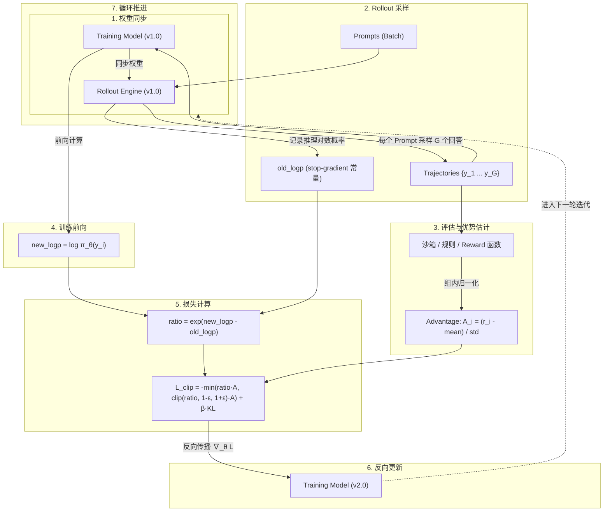

# 07 GRPO 训练流程、重要性采样比率（Ratio）与 Clip 机制 — 面试问答笔记

> **定位与目标**：本笔记针对大模型强化学习（RL / Post-Training）面试中关于 **GRPO（Group Relative Policy Optimization）执行闭环、两份权重设计、严格 On-Policy 梯度等价性、以及 PPO/GRPO Clip 截断机制** 的高频核心考点进行系统化记录与纵深拆解。
> 适用于强化学习算法岗、Agentic RL 后训练、大模型训推系统方向的深度技术面试与答辩复盘。

---

## 目录
- [一、核心问题与极简结论](#一核心问题与极简结论)
- [二、GRPO 完整训练流程（补齐细节的完整闭环）](#二grpo-完整训练流程补齐细节的完整闭环)
- [三、核心辨析一：严格 On-Policy 时 Ratio 恒等于 1，为什么梯度不为零？](#三核心辨析一严格-on-policy-时-ratio-恒等于-1为什么梯度不为零)
- [四、核心辨析二：Clip 什么时候才有意义？Ratio 为什么会偏离 1？](#四核心辨析二clip-什么时候才有意义ratio-为什么会偏离-1)
- [五、工业级主流开源框架落地实现对比](#五工业级主流开源框架落地实现对比)
- [六、面试高频实战答辩话术（30秒速答 / 3分钟深挖 / 风险防守）](#六面试高频实战答辩话术30秒速答--3分钟深挖--风险防守)
- [七、进阶辨析：Ratio 保持为 1 比较好吗？On-Policy 比 Off-Policy 更好吗？](#七进阶辨析ratio-保持为-1-比较好吗on-policy-比-off-policy-更好吗)
- [八、工程实操：将 Ratio 作为诊断指标与调优指南](#八工程实操将-ratio-作为诊断指标与调优指南)
- [九、关键公式速查卡（白板速记）](#九关键公式速查卡白板速记)

---

## 一、核心问题与极简结论

### 候选人常见提问 / 面试官核心设问
> **问题 1（流程定性）**：在 GRPO 做 LLM 后训练时，我们有两份模型权重，一份做 rollout，一份做 training。我们是先 rollout（model version 1.0）得到 `old_logp` 并计算 reward，然后再用 training model 做前向计算得到 `new_logp`，然后用 `new_logp / old_logp` 计算 loss 和梯度，更新得到 model version 2.0，最后重复循环。是这样的流程吗？
>
> **问题 2（机制死穴）**：在严格 on-policy 情况下（刚同步权重），$new\_logp == old\_logp$，此时比率 $\text{ratio} = \exp(new\_logp - old\_logp) \equiv 1$ 恒等于 1。既然数值恒为 1，那梯度怎么算？此时 PPO/GRPO 的 clip 机制还有意义吗？
>
> **问题 3（权衡思辨）**：ratio 保持为 1 是比较好的吗？on-policy 真的比 off-policy 更好吗？

### 极简核心结论
1. **流程定性**：流程描述完全正确。需要补齐两个关键工程与算法细节：
   - 采样生成的 `old_logp` 必须阻断反向传播（**stop-gradient**），作为常量参照物存储。
   - Advantage 采用组内均值与标准差归一化计算，无需单独的 Critic 网络。
2. **数值 vs 梯度**：在权重刚刚同步的第一步，数值上 $\text{ratio} = 1$；但自动微分计算图上，$\text{ratio}(\theta)$ 对训练模型参数 $\theta$ 的**梯度不为零**：
   $$\nabla_\theta \text{ratio}(\theta) = \text{ratio} \cdot \nabla_\theta \log \pi_\theta(a) = 1 \cdot \nabla_\theta \log \pi_\theta(a)$$
   此时整体 loss 梯度退化为经典**带 baseline 的策略梯度（REINFORCE with Baseline）**，clip 处于不触发边界。
3. **Clip 与两份权重的真正价值**：$\text{ratio} \neq 1$ 并触发 clip 截断保护，本质是为了让高昂的 Rollout 采样数据能够**安全地复用多步更新（Multi-step / Mini-batch / Epoch > 1）**，同时对抗**异步 Staleness（版本滞后）**与**训推框架算子数值微小偏差（Mismatch）**。
4. **On-Policy vs Off-Policy 的权衡本质**：
   - $\text{ratio} = 1$ 不是优化目标，而是“数据完全贴合当前策略”的副产品，代表**梯度无偏（最干净）**，但**样本效率极低（每批数据仅更新一次，成本极其奢侈）**。
   - On-policy 是**正确性的基线**，Off-policy 是**为了吞吐效率所付出的偏差代价**。
   - LLM 动作空间巨大（数万词表）且序列极长（数千 Token），微小的策略分布偏移会在重要性权重连乘中被**指数级放大**；因此近年工业界共识是：**尽量保持接近 on-policy，仅为吞吐做非常有限且带修正的 off-policy 让步**。

---

## 二、GRPO 完整训练流程（补齐细节的完整闭环）

GRPO 去除了 PPO 中的 Critic（Value）网络，改为通过组内相对打分计算优势（Advantage），但在 Actor 侧依然继承了 PPO 的重要性采样比率与 Clip 截断机制。其端到端完整闭环包含以下 7 个步骤：



### 完整步骤拆解
1. **同步权重（Weight Sync）**：
   - 将训练端模型参数复制/同步到推理 Rollout 引擎（version 1.0）。
   - 推理引擎（如 vLLM/SGLang）加载或热更新权重（或通过共享内存/LoRA 热重载）。
2. **Rollout 采样（Generation & Logp Extraction）**：
   - 对 Prompt 批量并行采样，每个 Prompt 独立采样 $G$ 个完整回答 $\{y_1, y_2, \dots, y_G\}$。
   - 推理引擎在生成时记录生成的每个 Token 的对数概率：
     $$\text{old\_logp}_t = \log \pi_{\theta_{\text{old}}}(y_t \mid x, y_{<t})$$
   - **关键细节**：此处的 `old_logp` 是一个不带梯度的静态常数浮点张量（`stop-gradient` / `torch.no_grad()`），存入 Rollout 经验池中供后续比对。
3. **Reward 结算与 Advantage 计算（Group-Relative Advantage）**：
   - 通过沙箱环境终态比对、规则判据或 Reward 模型给 $G$ 个候选回答分别打分，得到标量奖励 $\{r_1, r_2, \dots, r_G\}$。
   - 进行组内无偏优势估计，无需 Critic 网络拟合价值：
     $$A_i = \frac{r_i - \text{mean}(\{r_1, \dots, r_G\})}{\text{std}(\{r_1, \dots, r_G\}) + \epsilon}$$
4. **Training 模型前向计算（Forward Pass）**：
   - 将 Prompt 与生成的完整轨迹输入训练端模型（Training Model，参数为 $\theta$）。
   - 计算在当前参数下的对数条件概率：
     $$\text{new\_logp}_t = \log \pi_\theta(y_t \mid x, y_{<t})$$
   - 此时 `new_logp` 保留了自动微分计算图（Requires Grad）。
5. **Loss 计算（PPO-Clip 目标函数 + KL 约束）**：
   - 计算 Token 级别的重要采样比率：
     $$\text{ratio}_t(\theta) = \frac{\pi_\theta(y_t \mid x, y_{<t})}{\pi_{\theta_{\text{old}}}(y_t \mid x, y_{<t})} = \exp(\text{new\_logp}_t - \text{old\_logp}_t)$$
   - 计算代理截断目标（Surrogate Objective）：
     $$\mathcal{L}_{\text{CLIP}}(\theta) = -\frac{1}{G} \sum_{i=1}^G \frac{1}{|y_i|} \sum_{t=1}^{|y_i|} \min\left( \text{ratio}_{i,t}(\theta) \cdot A_i, \; \text{clip}(\text{ratio}_{i,t}(\theta), 1-\varepsilon, 1+\varepsilon) \cdot A_i \right)$$
   - 附加与参考模型（$\pi_{\text{ref}}$）的 KL 散度约束项 $\beta \cdot \mathbb{D}_{\text{KL}}(\pi_\theta \parallel \pi_{\text{ref}})$（或采用 DeepSeek-R1 中的无参直接 KL 估计）。
6. **反向传播与优化器更新（Backward & Update）**：
   - 计算损失对训练模型参数的梯度 $\nabla_\theta \mathcal{L}$，执行优化器（如 AdamW / 8-bit Adam）更新：
     $$\theta \leftarrow \theta - \eta \cdot \nabla_\theta \mathcal{L}$$
   - 训练模型参数演进为 version 2.0。
7. **进入下一个循环**：
   - 若一批 Rollout 数据复用完毕，则回到步骤 1 将新权重同步至 Rollout 引擎；若当前批次还有后续 mini-batch 或内部 epoch，则继续前向更新。

---

## 三、核心辨析一：严格 On-Policy 时 Ratio 恒等于 1，为什么梯度不为零？

### 核心物理矛盾
> 面试官：“在刚完成权重同步的第一步更新时，$new\_logp == old\_logp$，$\text{ratio} = \exp(0) = 1.0$。如果 ratio 恒等于 1，它还有导数吗？此时更新的本质是什么？”

### 深度原理解析：数值（Value） vs 计算图张量梯度（Gradient）

这是理解强化学习自动微分图的关键分水岭：

1. **计算图中的表达式**：
   $$\text{ratio}(\theta) = \exp\Big(\log \pi_\theta(a \mid s) - \text{stopgrad}(\text{old\_logp})\Big)$$
   - `old_logp` 是 Rollout 采样时固化的**常量张量**，反向传播不穿透它。
   - `new_logp` = $\log \pi_\theta(a \mid s)$ 是由训练模型参数 $\theta$ 经由前向网络计算出的**变量张量**。

2. **梯度推导**：
   对参数 $\theta$ 应用链式求导法则（Chain Rule）：
   $$\nabla_\theta \text{ratio}(\theta) = \nabla_\theta \exp\Big(\log \pi_\theta(a \mid s) - \text{old\_logp}\Big)$$
   由于 $\frac{d}{dx} \exp(x) = \exp(x)$：
   $$\nabla_\theta \text{ratio}(\theta) = \exp\Big(\log \pi_\theta(a \mid s) - \text{old\_logp}\Big) \cdot \nabla_\theta \log \pi_\theta(a \mid s) = \text{ratio}(\theta) \cdot \nabla_\theta \log \pi_\theta(a \mid s)$$

3. **代入初值 $\theta = \theta_{\text{old}}$**：
   在第一步计算时，尽管数值上前向评估得到：
   $$\text{ratio}(\theta) \big|_{\theta = \theta_{\text{old}}} = \exp(0) = 1.0$$
   但带入梯度表达式后：
   $$\nabla_\theta \text{ratio}(\theta) \big|_{\theta = \theta_{\text{old}}} = 1.0 \cdot \nabla_\theta \log \pi_\theta(a \mid s)$$

4. **对整体损失求导的退化结论**：
   当 $\text{ratio} = 1.0$ 时，完全落在截断区间 $[1-\varepsilon, 1+\varepsilon]$ 内部，$\min$ 操作直接选中无截断项 $\text{ratio} \cdot A$。因此损失函数对 $\theta$ 的梯度为：
   $$\nabla_\theta \mathcal{L} = - A \cdot \nabla_\theta \text{ratio}(\theta) = - A \cdot \nabla_\theta \log \pi_\theta(a \mid s)$$

> [!IMPORTANT]
> **黄金结论**：
> 在严格 on-policy 时，PPO/GRPO 的 ratio 形式在第一步更新时，**精确等价于经典策略梯度（Vanilla Policy Gradient / REINFORCE with Baseline）**。
> 写成 ratio 的形式，是为了在自动微分框架（PyTorch）中**统一单步与多步更新的代码结构**，让它在第一步自然退化为策略梯度，而在后续步骤中无缝过渡到重要性采样。

---

## 四、核心辨析二：Clip 什么时候才有意义？Ratio 为什么会偏离 1？

既然严格单步更新时 $\text{ratio} \equiv 1$ 且 clip 不触发，那么 **Clip 到底在什么时候才会触发？为什么要把 Rollout 和 Training 分成两份独立权重？**

Ratio 偏离 1 并触发 Clip 截断，根源于以下三大真实工程与算法场景：

### 场景 1：一批 Rollout 数据复用多步更新（最主要原因，PPO/GRPO 的灵魂）
- **高昂的采样代价**：在大语言模型后训练中，Rollout（自回归解码）的时间和算力开销极大，通常占据整个训练端到端耗时的 70%～85%。如果花几分钟甚至几十分钟生成一个 Batch 的轨迹（例如 512 个 Prompts $\times G=8$ 个回答），仅仅用于前向反向一次（1 个 Gradient Step）就全部丢弃，算力利用效率极低。
- **Mini-batch 与 Epoch 复用**：
  - 工业界常规做法是将这一大批数据切分成多个 mini-batch 逐步更新，或者跑多次 `ppo_epochs > 1`（在 DeepSeek-R1 / GRPO 原论文中定义为 $\mu$ 次内部迭代更新）。
  - **动态演进**：
    - 当用第 1 个 mini-batch 完成一次梯度反向传播后，训练模型的权重已经从 $\theta_0$ 变成了 $\theta_1$。
    - 当训练器处理第 2 个 mini-batch 或进入第 2 个 epoch 时，当前的 `new_logp` 是由新权重 $\theta_1$ 算出来的，而参照的 `old_logp` 依然是采样时的 $\theta_0$。
    - 此时训练**天然进入了 Off-Policy 状态**，$\text{ratio} = \exp(\text{new\_logp} - \text{old\_logp}) \neq 1$。
  - **Clip 的核心防护**：
    随着更新步数增加，策略偏离原始采样分布越来越远。Clip 强制将 ratio 截断在 $[1-\varepsilon, 1+\varepsilon]$（通常 $\varepsilon = 0.2$），当模型试图过大幅度修改概率时（尤其是正优势大幅推高或负优势大幅压低时），梯度被强制置零（截断区导数为 0），**有效防止策略走崩（Policy Collapse）**。

> [!NOTE]
> **为什么必须有两份独立权重？**
> 这正是“Rollout 模型与 Training 模型各自维持独立副本”的物理原因：
> 在多步 mini-batch 迭代期间，Rollout 产生的经验数据和 `old_logp` 必须作为基准参照系保持绝对固定（Frozen Baseline），而 Training 模型在每一个 mini-batch 之后沿梯度持续向前更新。

---

### 场景 2：异步 Rollout 带来的版本滞后（Staleness）
- 在现代大规模 RL 训练架构（如 Ray 驱动的分布式训练、Async PPO/GRPO）中，为了最大化流水线硬件利用率，Rollout Worker 引擎与 Training Worker 解耦并发运行。
- 推理端在后台持续使用版本 $k$ 的权重进行推理并推入消费队列；
- 训练端在消费队列中的轨迹数据时，主模型参数可能已经被其他 Worker 推到了 $k+1$ 甚至 $k+2$ 版本。
- **结果**：轨迹刚刚进入训练器时就已经具有版本滞后（Staleness），天然属于 Off-policy，第一步计算时 `new_logp`（来自 $k+2$）与 `old_logp`（来自 $k$）就不相等，Ratio 偏离 1，Clip 机制从一开始就作为安全隔离气闸发挥保护作用。

---

### 场景 3：训推框架底层的数值不一致（Training-Inference Mismatch）
即使是严格的单步同步更新（没有 mini-batch 切分、权重完全相同），在真实的工程落地中，`old_logp` 与 `new_logp` 也往往不完全相等：

| 维度 | 推理侧（Rollout Engine） | 训练侧（Training Engine） |
|---|---|---|
| **常用框架** | vLLM / SGLang / TensorRT-LLM | Megatron-LM / PyTorch FSDP / DeepSpeed |
| **Attention 算子** | PagedAttention / FlashInfer / 自研内核 | FlashAttention-2/3 / 自定义反向核函数 |
| **浮点累加顺序** | BF16/FP16 Decode 优化核，累加顺序重排 | 标准矩阵乘法累加核，反向需保精度 |
| **MoE 路由** | 针对低延迟剪枝的 Top-K 选路与量化门控 | 全量对齐的反向可导 Top-K 路由 |

- **现象**：由于两套框架的 CUDA 算子实现、并行切分策略（TP 维度不同）及浮点计算顺序存在细微误差，对完全相同的输入文本做前向，输出的 Logits 会有 $10^{-3} \sim 10^{-5}$ 量级的差异。
- **影响**：计算出的 ratio 会在 1.0 附近存在高频微小抖动（如 0.9982、1.0015）。在长序列（例如 4K~16K tokens）或 MoE 架构中，微小误差会逐 token 累积放大，甚至导致训练不稳定。近期学术界与工业界诸多重要性采样修正工作（如 TIS / MIS）正是为了校准该系统级 mismatch。

---

## 五、工业级主流开源框架落地实现对比

不同大模型强化学习开源框架在实现 GRPO / PPO 时，基于工程算力与稳定性的权衡，有着截然不同的设计选择：

```
+-----------------------------------------------------------------------------------+
| 框架实现             | num_iterations / epoch | ratio 处理方式           | Clip 生效情况  |
+-----------------------------------------------------------------------------------+
| TRL (Hugging Face)   | 默认 num_iterations=1   | old_logp = new.detach()  | 恒等于 1，不生效 |
| verl / OpenRLHF      | mini-batch 切分多步更新 | 显式缓存推理 old_logp    | 后续 mini-batch 生效 |
| DeepSeek-R1 (原著)   | 论文定义 μ 次更新迭代   | 两份权重物理隔离更新     | 严格按原版机制生效 |
+-----------------------------------------------------------------------------------+
```

### 1. Hugging Face TRL (`GRPOTrainer`)
- **实现特点**：默认配置 `num_iterations = 1`。
- **极限优化**：为了最大限度节省单机多卡显存与前向时间，TRL 在 Rollout 采样阶段**甚至不计算也不保留 `old_logp`**。
- **代码物理逻辑**：在采样完成后，直接将数据送进训练前向计算出 `new_logp`，然后执行：
  ```python
  # TRL 内部简化逻辑
  old_logp = new_logp.detach()
  ratio = torch.exp(new_logp - old_logp)  # 恒为 torch.ones_like()
  ```
- **本质**：此时 ratio 恒为 1.0，Clip 永远不会被触发，它实质上是一个**加了 KL 散度约束和组内基线归一化的纯策略梯度算法（REINFORCE with Group Baseline）**。

### 2. verl (Volcengine) / OpenRLHF
- **实现特点**：训推解耦架构，通常设定 `ppo_epochs = 1`，但为了适配大 batch 吞吐，采用 `ppo_mini_batch_size < rollout_batch_size`。
- **执行逻辑**：
  - 推理引擎（如 vLLM）在生成时完整计算并吐出 `old_logp`；
  - 训练端将一个大的 Rollout Batch 切分成多个连续的 mini-batch；
  - 第 1 个 mini-batch 更新后模型权重改变，从第 2 个 mini-batch 开始，`new_logp` 与原始 `old_logp` 出现显式漂移，ratio 偏离 1，Clip 机制开始刚性生效。

### 3. DeepSeek-R1 / GRPO 原论文
- **实现特点**：原论文中明确推导了每次采样后进行 $\mu$ 次优化迭代（$\mu \ge 1$，通常为内部多步梯度更新）。
- **执行逻辑**：明确保持 Rollout 模型与 Training 模型的权重独立。在 $\mu$ 步之内，Rollout 权重与 `old_logp` 保持绝对静态，Training 模型多步演进，Clip 机制在控制策略分布偏移（Trust Region）中发挥核心支柱作用。

---

## 六、面试高频实战答辩话术（30秒速答 / 3分钟深挖 / 风险防守）

### 1. 30 秒电梯汇报版（被问“解释一下 GRPO 中 ratio 和 clip 的作用”）
> “面试官好，GRPO 中确实包含 Rollout 采样与 Training 训练两套权重逻辑。在严格 on-policy 的初始第一步，两边权重完全一致，数值上 ratio 确实等于 1，但其自动微分梯度是 $1 \cdot \nabla_\theta \log \pi_\theta$，精确退化为带组内 baseline 的经典策略梯度。
> 
> 而 ratio 偏离 1 并触发 Clip 截断，核心是为了**让昂贵的 Rollout 数据能够复用多步更新**（如 mini-batch 切分或多 epoch 迭代）。在第一步更新后模型参数演进为 off-policy，Clip 负责限制更新步长以防止策略崩塌。此外，在异步 RL 的版本滞后以及推理/训练算子数值微小偏差中，Clip 也起到了关键的数值安全屏障作用。”

---

### 2. 3分钟深度答辩版（面试官追问底层推导与工程陷阱）
> “我们可以从**数学退化**、**工程复用**和**算子一致性**三个层面来看待这个问题：
> 
> 首先是**为什么 ratio=1 时依然能学到东西**。因为在计算图中，`old_logp` 经过了 stop-gradient 处理是静态常数，而 `new_logp` 是关于模型参数 $\theta$ 的前向计算结果。根据求导法则，$\nabla_\theta \exp(new\_logp - old\_logp) = \text{ratio} \cdot \nabla_\theta new\_logp$。当处于初始同步点时，ratio 数值为 1，导数精确保留为 $\nabla_\theta \log \pi_\theta$。这说明 PPO/GRPO 的公式在设计之初就保证了其在单步 on-policy 下是标准策略梯度的完美泛化。
> 
> 其次是**为什么必须存在两份权重与 Clip**。大模型 Rollout 解码占据了 80% 左右的开销，如果每一个 batch 数据只跑一次梯度更新就丢弃，计算性价比太低。因此工业界（如 DeepSeek-R1 的 $\mu$ 步迭代、verl 的 mini-batch 切分）都会复用数据做多步更新。第一步更新完后参数改变，后续步骤就变成了 off-policy，ratio 就会偏离 1。这时候两份权重的价值就体现出来了：Rollout 模型固化了采样分布作为参照系，Training 模型向前演进，而 Clip 确保了比率不会超过 $[1-\varepsilon, 1+\varepsilon]$，避免因为错误积累导致策略漂移。
> 
> 最后在**工业落地中还有一个隐蔽的坑——训推框架数值不一致（Mismatch）**。我们在实际落地中会发现，哪怕第一步权重严格相同，vLLM 和训练端的 FlashAttention 由于浮点累加顺序、算子精度和 MoE 路由内核的微小差异，算出来的 logits 依然有 $10^{-4}$ 量级的抖动，ratio 实际在 0.999~1.001 之间。在长序列任务下这种偏差会进一步放大，Clip 机制在工程上也天然提供了抵抗这种软硬件数值底噪的稳健性。”

---

### 3. 高频连环追问与攻防卡

| 追问陷阱 | 考查底层逻辑 | 标准防守与反击话术 |
|---|---|---|
| **追问 1**：既然 TRL 默认只做单步更新且 ratio=1，那直接算策略梯度不就完了，为什么要费劲算 ratio？ | 考查对代码通用性与自动微分机制的理解 | “写成 ratio 形式是现代 RL 框架的高度统一封装。通过 `ratio = exp(new - old.detach())`，框架用同一套计算图和统一的 Loss 形式同时兼容了单步更新与多步更新。如果单独写分支特判策略梯度，不仅代码冗余，而且无法自然过渡到 mini-batch 和 PPO-clip 机制。” |
| **追问 2**：如果我把 clip 的 $\varepsilon$ 设得很大（比如 0.8），或者干脆去掉 clip，多步更新会发生什么？ | 考查对强化学习分布崩塌（Collapse）的理解 | “去掉 Clip 会导致严重的正反馈过拟合或策略雪崩。当一个回答偶然得到极高 Reward 时，重要性采样比率 $\text{ratio}$ 会被持续推高，如果模型多次迭代复用该数据，梯度步长会被放得非常大，导致模型熵值骤降、输出模式坍缩或胡言乱语；Clip 正是通过上界 $1+\varepsilon$ 剥夺了过大比率的梯度假释权。” |
| **追问 3**：Rollout 引擎和训练引擎权重同步是实时 RPC 还是异步？会有什么系统瓶颈？ | 考查分布式系统设计与工程取舍 | “对于单机小模型，通常通过内存直接同步或热更 LoRA 权重；但在数十至数百卡规模下，全量模型同步需要占用大量通信带宽（如 NCCL Broadcast），若同步过于频繁会导致 GPU 计算流水线陷入通信气泡。因此工业界才会权衡多步复用数据（提高计算/通信比）或采用异步流水线。” |
| **追问 4**：既然 On-Policy 梯度无偏，为什么实际生产中很少采用严格 ratio=1 的纯单步更新？ | 考查算法正确性与工程吞吐之间的真实权衡 | “因为在大模型长思维链（CoT）推理场景下，Rollout 解码耗时占据了全流程的 70%~90%。严格维持 ratio=1 意味着每批生成的高昂数据只进行一次反向传播更新就丢弃，GPU 吞吐和时间成本极其奢侈。工业界的做法是在保证策略不发生分布崩塌的前提下，通过切分 mini-batch 引入可控的轻微 off-policy 来复用数据，寻找吞吐与稳定性的最佳平衡点。” |

---

## 七、进阶辨析：Ratio 保持为 1 比较好吗？On-Policy 比 Off-Policy 更好吗？

### 7.1 Ratio 保持为 1 好不好？

> **核心结论**：$\text{ratio} = 1$ 不是优化目标，它是“训练样本与当前优化策略完全一致”的**副产品**。

- **好的一面：梯度严格无偏（Unbiased Gradient）**
  - 策略梯度定理（Policy Gradient Theorem）的核心数学假设是：期望期望值中的样本轨迹必须采样自当前正在优化的策略分布 $\pi_\theta$。
  - 当 $\text{ratio} \equiv 1$ 时，完全满足该理论前提，梯度估计数学上严格无偏；
  - 此时 Clip 不会截断任何 Token 的梯度，KL 散度惩罚项从 0 起步，模型训练动态最为平稳、干净，绝不会出现策略分布剧烈震荡。
- **代价：样本效率（Sample Efficiency）最低**
  - 每一个批次的 Rollout 采样数据只能供优化器更新一个 Step 就必须全量废弃；
  - 在大模型强化学习（尤其是长程思考 CoT、多轮 Agentic 任务）中，Rollout 阶段通常耗费了整个系统 **70%～90%** 的时间与算力，这在工程成本上极其奢侈。

> [!NOTE]
> 因此，$\text{ratio} \equiv 1$ 意味着“稳但极慢”。在工程实践中，工程师真正需要权衡的核心命题是：**“为了换取更高的 GPU 吞吐与数据复用率，系统最多能够容忍 ratio 偏离 1 多少？”**

---

### 7.2 On-Policy vs Off-Policy：权衡分析与 LLM RL 的独特性质

| 机制属性 | On-Policy（如 ratio $\approx 1$ 的单步更新） | Off-Policy（如多 Epoch 复用 / 历史 Replay / 异步 RL） |
|---|---|---|
| **核心优势** | ① 梯度数学无偏，无需复杂的重要性采样校准；<br>② 训练动态极其平稳，不容易发生熵崩塌；<br>③ 策略收敛边界清晰可控。 | ① 数据利用率高，单批采样数据可复用多步更新；<br>② 天然支持异步解耦（Rollout 与 Training Worker 并发运行，GPU 零空转）；<br>③ 可利用历史经验、更强模型的示范轨迹或专家冷启动数据。 |
| **致命劣势** | 样本效率极低，生成数据一次性报废，整体训练耗时与硬件开销巨大。 | ① 策略容易发生分布漂移（Distribution Shift）与策略崩溃；<br>② 算法调参复杂度高，对超参数（clip、lr、staleness）极度敏感。 |

#### 为什么 LLM RL 对 Off-Policy 的敏感度远超传统 RL？
在经典强化学习（如 Atari 游戏或 MuJoCo 连续控制）中，动作空间往往只有数个离散按键或数十维连续动作，序列长度一般较短，Off-Policy 算法（如 DQN、SAC）表现极佳。但在大语言模型中：
1. **动作空间维度爆炸**：LLM 的 Action 空间是整个词表（Vocabulary Size $V \approx 32\text{k} \sim 150\text{k}$），分布极端稀疏且多峰；
2. **序列重要性权重指数级累乘**：一个完整 Response 往往包含 $1\text{k} \sim 8\text{k}$ 个 Token。整条轨迹的重要性采样权重理论上是逐 Token 概率比率的连乘：
   $$w(\tau) = \prod_{t=1}^T \frac{\pi_\theta(y_t \mid x, y_{<t})}{\pi_{\text{old}}(y_t \mid x, y_{<t})}$$
   即使单个 Token 的 ratio 仅偏离 1%（如 1.01），经过数千步累乘后，重要性权重的方差也会发生**指数级爆炸（Exponential Variance Explosion）**，导致有效样本容量急剧萎缩为接近 0。

---

### 7.3 近年工业界与学术界的经验性共识

面对上述理论与硬件现实的冲突，近两年 LLM RL 演进出了一条极其明确的工程共识：**“尽量紧贴 On-Policy，只为吞吐效率做非常有限、且必须带严密修正的 Off-Policy 让步”**：

1. **主流 Recipe 严格限制更新步数**：
   - 包括 DAPO、Open-Reasoner-Zero 以及绝大多数 verl 生产配置，均推荐设置 `ppo_epochs = 1`；
   - 仅依靠将一个较大的 Rollout Batch 切分成少量 mini-batch 来进行梯度更新，仅引入极其轻微的局部 Off-Policy。
   - 业界反复验证发现：强行增大 `ppo_epochs`（如设为 2~4）或直接从 Replay Buffer 中重放旧数据，普遍导致训练剧烈发散、输出 Entropy 暴跌，以及极其严重的 Reward Hacking（投机作弊）。
2. **异步 RL 必须限制 Staleness 并引入解耦修正**：
   - 异步训练系统（如 AReaL、Magistral、Seed 架构）证明系统可以容忍 1～2 个版本的滞后（Staleness），但必须引入配套防护：
     - 硬性限制 `max_staleness <= 2`（超时数据直接丢弃）；
     - 采用 Decoupled PPO 算法，显式将 Behavior Policy（生成时策略）与 Proximal Policy（近端更新策略）的对数概率分层建模。
3. **训推不一致（Mismatch）的破坏力被重新定性**：
   - 近期关于 TIS / MIS（Target / Merged Importance Sampling）的研究发现：哪怕模型权重 100% 比特级一致，仅由于 vLLM 与 Megatron 底层 Attention 算子与累加顺序的浮点微小差异，就足以诱发 GRPO 的梯度震荡甚至崩溃。
   - 这充分证明：**在大模型长序列下，哪怕是极其微弱的“无意识 Off-Policy 噪声”，也具有致命的杀伤力**。

---

### 7.4 Clip 本身的工程副作用与演化算法

Ratio 偏离 1 时，虽然 PPO-clip 提供了安全护栏，但 Clip 机制在 LLM 上存在显著的副作用：

1. **有效样本信号丢失**：
   - 凡是被截断的 Token，其局部梯度直接被强制置为 0。这意味着模型在该 Token 上彻底丢掉了反向传播的监督信号，浪费了昂贵的生成计算。
2. **对称截断压制低概率 Token（导致策略熵崩塌）**：
   - PPO 传统的截断区间是对称的 $[1-\varepsilon, 1+\varepsilon]$。对于基座原本输出概率很低的新颖探索 Token（分母 $\pi_{\text{old}}$ 极小），训练模型只要稍微增加一点概率，$\text{ratio} = \frac{\pi_\theta}{\pi_{\text{old}}}$ 就会极其轻易地突破 $1+\varepsilon$ 并被截断梯度；
   - 相反，对于原本概率很高的常规 Token，比率不易突破上界。
   - **后果**：对称截断在统计上系统性扼杀了模型探索低频新词的能力，促使策略过快收敛到单调模板，引发出名的**熵崩塌（Entropy Collapse）**。
   - **演进改良**：**DAPO 提出 Clip-Higher 技术**，专门放宽比率上界（甚至不对正向探索做硬截断），仅对负向漂移做刚性截断，显著改善了探索广度。
3. **Token 级比率的高频噪声**：
   - Token-level 的局部 ratio 在长序列中方差极大，单个词的标点或格式跳跃就会触发误截断。
   - **演进改良**：**GSPO（Group Sequence Policy Optimization）** 探索将 Token 级独立比率重构为 Sequence 级别的几何平均比率，从根本上降低了局部抖动。

---

## 八、工程实操：将 Ratio 作为诊断指标与调优指南

在 LLM RL 落地中，绝不能将固定 $\text{ratio} = 1$ 作为目标，而是应将其作为**监控系统健康状态的第一诊断仪表盘**：

### 8.1 核心监控指标体系
1. **截断比例（`clip_fraction`）**：
   $$\text{clip\_fraction} = \frac{1}{N_{\text{tokens}}} \sum_{i,t} \mathbb{I}\Big(\text{ratio}_{i,t} < 1-\varepsilon \;\lor\; \text{ratio}_{i,t} > 1+\varepsilon\Big)$$
   - **健康区间**：通常应平稳保持在 **$3\% \sim 8\%$**。
   - **过低（接近 0%）**：说明几乎处于严格 On-Policy 状态，步长偏保守，可适当调大学习率或增大切分粒度以提升效率；
   - **过高（超过 15%~20%）**：发出严重告警！说明单批数据更新步幅过大，策略漂移过快，大量梯度被截断作废。**必须立刻调小学习率（Learning Rate）、减少 mini-batch 数量或降低 PPO epochs**。
2. **近似 KL 散度（`approx_kl`）**：
   $$\text{approx\_kl} \approx \frac{1}{N_{\text{tokens}}} \sum_{i,t} \Big( (\text{ratio}_{i,t} - 1) - \log \text{ratio}_{i,t} \Big)$$
   - 监控训练模型与 Rollout 采样策略之间的实际分布距离。若该值非线性陡增，是策略崩塌的前兆。

### 8.2 四项实操调优落地法则
1. **基准防线**：新模型、新任务起跑时，**一律从 `ppo_epochs = 1` + 少量 Mini-batch（2~4 个）开始**，这是最稳妥、收敛确定性最高的配置；
2. **异步流水线防线**：如为提升吞吐采用异步架构，必须设立强校验：**严格丢弃滞后版本超过 1~2 步的陈旧轨迹**，并在损失函数中结合 Behavior Logp 进行 IS 权重校正；
3. **软硬件数值底噪防线**：上线前必须执行 Token-diff 严密比对。推理端（vLLM）与训练端（Megatron）的 Logits 偏差必须在单步严格对齐，禁止指望 Clip 机制来吸收由于算子差异带来的底层数值噪声；
4. **一句话底线总结**：
   > **“On-policy 是强化学习‘正确性’的理论基线，Off-policy 是为了‘工程吞吐’付出的妥协代价。在 LLM 的超高维动作与长序列空间中，这个代价被指数级放大，因此必须极其克制、且在严密监控与修正下引入。”**

---

## 九、关键公式速查卡（白板速记）

$$
\begin{aligned}
\text{Advantage (GRPO)} &: \quad A_i = \frac{r_i - \text{mean}(\{r_1, \dots, r_G\})}{\text{std}(\{r_1, \dots, r_G\}) + \epsilon} \\
\text{Importance Ratio} &: \quad \text{ratio}_t(\theta) = \exp\Big(\log \pi_\theta(y_t \mid x, y_{<t}) - \text{stopgrad}\big(\log \pi_{\theta_{\text{old}}}(y_t \mid x, y_{<t})\big)\Big) \\
\text{Surrogate Loss} &: \quad \mathcal{L}_{\text{CLIP}}(\theta) = -\mathbb{E}\left[ \min\Big(\text{ratio}_t(\theta) A_i, \; \text{clip}(\text{ratio}_t(\theta), 1-\varepsilon, 1+\varepsilon) A_i\Big) \right] \\
\text{Gradient at } \theta = \theta_{\text{old}} &: \quad \nabla_\theta \mathcal{L} \Big|_{\text{ratio}=1} = - A_i \cdot \nabla_\theta \log \pi_\theta(y_t \mid x, y_{<t}) \quad (\text{精确退化为经典策略梯度})
\end{aligned}
$$

